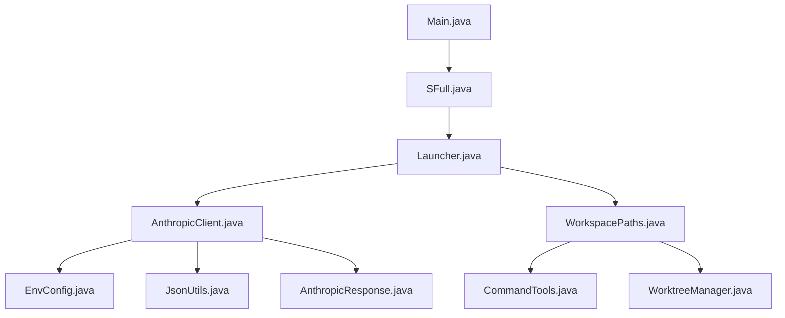
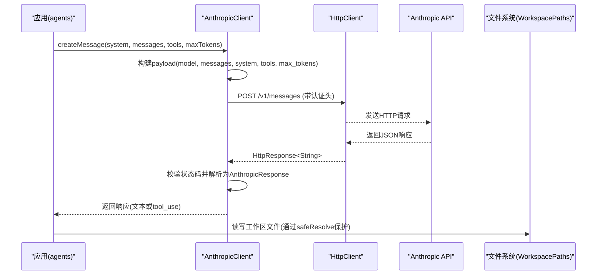
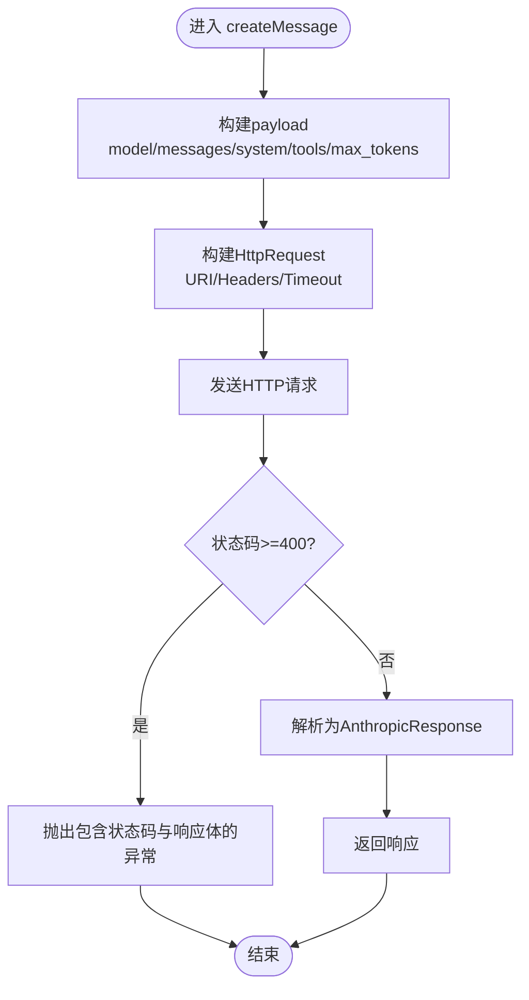
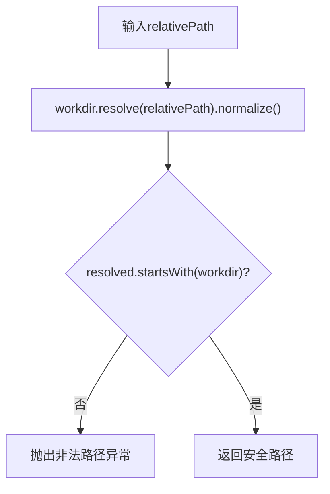
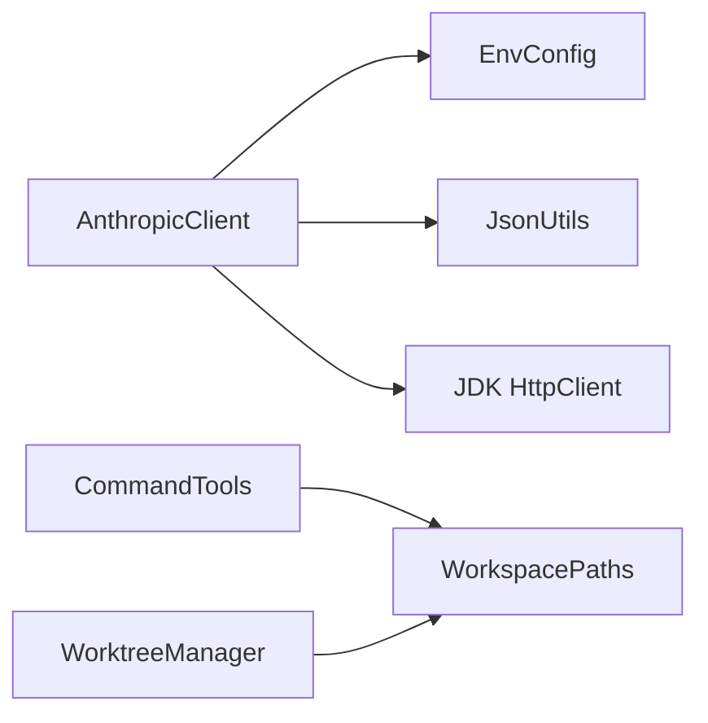
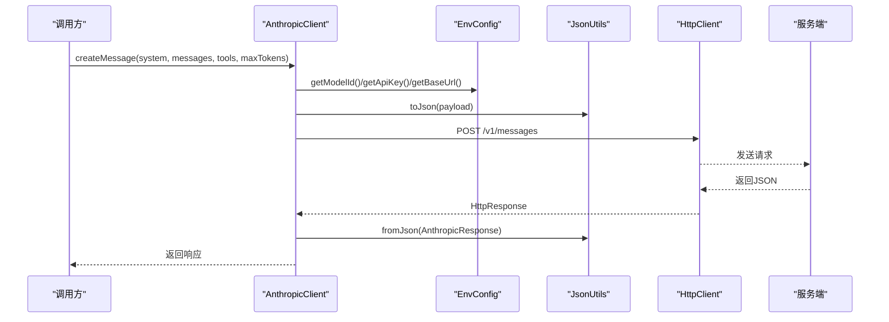

# API集成

<cite>
**本文引用的文件**
- [AnthropicClient.java](file://src/main/java/com/learnclaudecode/common/AnthropicClient.java)
- [EnvConfig.java](file://src/main/java/com/learnclaudecode/common/EnvConfig.java)
- [JsonUtils.java](file://src/main/java/com/learnclaudecode/common/JsonUtils.java)
- [WorkspacePaths.java](file://src/main/java/com/learnclaudecode/common/WorkspacePaths.java)
- [AnthropicResponse.java](file://src/main/java/com/learnclaudecode/model/AnthropicResponse.java)
- [ChatMessage.java](file://src/main/java/com/learnclaudecode/model/ChatMessage.java)
- [CommandTools.java](file://src/main/java/com/learnclaudecode/tools/CommandTools.java)
- [WorktreeManager.java](file://src/main/java/com/learnclaudecode/tasks/WorktreeManager.java)
- [Main.java](file://src/main/java/com/learnclaudecode/Main.java)
</cite>

## 目录
1. [简介](#简介)
2. [项目结构](#项目结构)
3. [核心组件](#核心组件)
4. [架构总览](#架构总览)
5. [详细组件分析](#详细组件分析)
6. [依赖关系分析](#依赖关系分析)
7. [性能与可靠性](#性能与可靠性)
8. [故障排查指南](#故障排查指南)
9. [结论](#结论)
10. [附录：API调用流程与消息格式](#附录api调用流程与消息格式)

## 简介
本文件面向需要集成 Claude（或兼容 Anthropic Messages API）的开发者，聚焦以下目标：
- 解释 AnthropicClient 的 HTTP 客户端实现：请求构造、响应处理、错误处理、超时管理。
- 描述消息格式规范与 API 调用流程。
- 说明工作区文件系统操作：工作目录管理与路径安全处理。
- 提供最佳实践：认证配置、速率限制建议、错误处理策略。
- 给出调试技巧与常见问题解决方案。

## 项目结构
本项目采用分层组织方式：
- common：通用能力（HTTP 客户端、JSON 工具、环境配置、工作区路径）。
- model：数据模型（消息、响应等）。
- tools：工具集（命令执行、文件编辑等），通过工作区路径进行安全访问。
- tasks：任务与工作树隔离管理。
- agents：Agent 运行期与编排（入口在 Main -> SFull -> Launcher）。

图表来源
- [Main.java:1-15](file://src/main/java/com/learnclaudecode/Main.java#L1-L15)
- [AnthropicClient.java:1-103](file://src/main/java/com/learnclaudecode/common/AnthropicClient.java#L1-L103)
- [EnvConfig.java:1-96](file://src/main/java/com/learnclaudecode/common/EnvConfig.java#L1-L96)
- [JsonUtils.java:1-83](file://src/main/java/com/learnclaudecode/common/JsonUtils.java#L1-L83)
- [WorkspacePaths.java:1-150](file://src/main/java/com/learnclaudecode/common/WorkspacePaths.java#L1-L150)
- [CommandTools.java:30-145](file://src/main/java/com/learnclaudecode/tools/CommandTools.java#L30-L145)
- [WorktreeManager.java:30-109](file://src/main/java/com/learnclaudecode/tasks/WorktreeManager.java#L30-L109)

章节来源
- [Main.java:1-15](file://src/main/java/com/learnclaudecode/Main.java#L1-L15)

## 核心组件
- AnthropicClient：封装对 Anthropic-compatible Messages API 的 HTTP 调用，负责构建请求体、设置头部、发送请求、解析响应与错误处理。
- EnvConfig：集中读取环境变量与 .env 文件，提供模型 ID、API Key、Base URL、工作目录等配置。
- JsonUtils：统一 JSON 序列化/反序列化，屏蔽 Jackson 细节。
- WorkspacePaths：工作区路径工具，提供安全路径解析与常用目录访问。
- CommandTools：基于 WorkspacePaths 的文件与命令工具，确保所有 IO 都在工作区内进行。
- WorktreeManager：工作树隔离管理，维护索引与事件日志。
- AnthropicResponse / ChatMessage：消息与响应的轻量数据模型。

章节来源
- [AnthropicClient.java:1-103](file://src/main/java/com/learnclaudecode/common/AnthropicClient.java#L1-L103)
- [EnvConfig.java:1-96](file://src/main/java/com/learnclaudecode/common/EnvConfig.java#L1-L96)
- [JsonUtils.java:1-83](file://src/main/java/com/learnclaudecode/common/JsonUtils.java#L1-L83)
- [WorkspacePaths.java:1-150](file://src/main/java/com/learnclaudecode/common/WorkspacePaths.java#L1-L150)
- [CommandTools.java:30-145](file://src/main/java/com/learnclaudecode/tools/CommandTools.java#L30-L145)
- [WorktreeManager.java:30-109](file://src/main/java/com/learnclaudecode/tasks/WorktreeManager.java#L30-L109)
- [AnthropicResponse.java:1-14](file://src/main/java/com/learnclaudecode/model/AnthropicResponse.java#L1-L14)
- [ChatMessage.java:1-8](file://src/main/java/com/learnclaudecode/model/ChatMessage.java#L1-L8)

## 架构总览
下图展示了从 Agent 到模型的端到端调用链路，以及工作区文件操作的边界。

图表来源
- [AnthropicClient.java:52-101](file://src/main/java/com/learnclaudecode/common/AnthropicClient.java#L52-L101)
- [WorkspacePaths.java:42-75](file://src/main/java/com/learnclaudecode/common/WorkspacePaths.java#L42-L75)

## 详细组件分析

### AnthropicClient：HTTP 客户端与请求生命周期
- 初始化：使用 JDK HttpClient，设置连接超时；请求级超时在构建 HttpRequest 时设置。
- 请求构造：
  - payload 包含 model、max_tokens、messages、可选 system、可选 tools。
  - Base URL 来自 EnvConfig，拼接 /v1/messages。
  - 头部设置 content-type、anthropic-version，并在有 API Key 时同时设置 x-api-key 与 authorization。
- 响应处理：
  - 非 2xx 直接抛出异常，包含状态码与响应体，便于调试兼容接口。
  - 成功响应通过 JsonUtils 反序列化为 AnthropicResponse。
- 错误与中断：
  - IOException/InterruptedException 统一包装为业务异常，并恢复线程中断标志。

图表来源
- [AnthropicClient.java:52-101](file://src/main/java/com/learnclaudecode/common/AnthropicClient.java#L52-L101)

章节来源
- [AnthropicClient.java:1-103](file://src/main/java/com/learnclaudecode/common/AnthropicClient.java#L1-L103)

### EnvConfig：认证与环境配置
- 优先级：系统环境变量优先于 .env 文件。
- 必填项：MODEL_ID 缺失将抛出异常。
- 可选项：ANTHROPIC_API_KEY、ANTHROPIC_BASE_URL（默认官方地址）。
- 工作目录：当前进程工作目录的绝对规范化路径。

章节来源
- [EnvConfig.java:1-96](file://src/main/java/com/learnclaudecode/common/EnvConfig.java#L1-L96)

### WorkspacePaths：工作区路径安全与常用目录
- safeResolve：将相对路径解析为绝对路径并做规范化，若结果不在工作区内则抛出异常，防止路径逃逸。
- readText/writeText：在工作区内安全地读写文本文件，写入时自动创建父目录。
- 常用目录：tasksDir、teamDir、inboxDir、skillsDir、transcriptDir、worktreesDir。

图表来源
- [WorkspacePaths.java:42-49](file://src/main/java/com/learnclaudecode/common/WorkspacePaths.java#L42-L49)

章节来源
- [WorkspacePaths.java:1-150](file://src/main/java/com/learnclaudecode/common/WorkspacePaths.java#L1-L150)

### CommandTools：基于工作区的文件与命令工具
- runBash：在工作区目录下执行 shell 命令，设置超时并收集输出。
- runWrite/runEdit：通过 WorkspacePaths.safeResolve 保证写入/编辑仅发生在允许的工作区内。

章节来源
- [CommandTools.java:30-145](file://src/main/java/com/learnclaudecode/tools/CommandTools.java#L30-L145)

### WorktreeManager：工作树隔离与索引
- 初始化：确保 .worktrees 目录存在，创建 index.json 与 events.jsonl。
- 创建 worktree：在 .worktrees/<name> 下创建隔离目录，更新索引，绑定任务，记录事件。
- 列出 worktree：读取索引文件返回元数据列表。

章节来源
- [WorktreeManager.java:30-109](file://src/main/java/com/learnclaudecode/tasks/WorktreeManager.java#L30-L109)

### 数据模型：消息与响应
- ChatMessage：role + content（Object 以兼容文本或结构化 tool_result）。
- AnthropicResponse：stop_reason + content（列表形式的消息内容）。

章节来源
- [ChatMessage.java:1-8](file://src/main/java/com/learnclaudecode/model/ChatMessage.java#L1-L8)
- [AnthropicResponse.java:1-14](file://src/main/java/com/learnclaudecode/model/AnthropicResponse.java#L1-L14)

## 依赖关系分析
- AnthropicClient 依赖 EnvConfig（获取模型、密钥、Base URL）、JsonUtils（序列化/反序列化）、JDK HttpClient（网络层）。
- 上层 Agent/Runner 通过 AnthropicClient 发起请求，并将响应交由上层逻辑判断是否继续调用工具或结束对话。
- 文件系统操作统一经由 WorkspacePaths，避免任意路径访问。

图表来源
- [AnthropicClient.java:1-103](file://src/main/java/com/learnclaudecode/common/AnthropicClient.java#L1-L103)
- [WorkspacePaths.java:1-150](file://src/main/java/com/learnclaudecode/common/WorkspacePaths.java#L1-L150)
- [CommandTools.java:30-145](file://src/main/java/com/learnclaudecode/tools/CommandTools.java#L30-L145)
- [WorktreeManager.java:30-109](file://src/main/java/com/learnclaudecode/tasks/WorktreeManager.java#L30-L109)

章节来源
- [AnthropicClient.java:1-103](file://src/main/java/com/learnclaudecode/common/AnthropicClient.java#L1-L103)
- [WorkspacePaths.java:1-150](file://src/main/java/com/learnclaudecode/common/WorkspacePaths.java#L1-L150)

## 性能与可靠性
- 超时管理：
  - 连接超时：HttpClient 级别设置为固定秒数。
  - 请求超时：单次请求设置较长超时，适配大模型推理耗时。
- 重试机制：
  - 当前实现未内置重试。建议在调用方根据业务需求增加幂等性检查与重试策略（如指数退避），注意区分可重试错误（如网络抖动、限流）与不可重试错误（如参数错误）。
- 速率限制：
  - 当前未实现令牌桶/漏桶等限流。建议在调用方结合上游服务配额与本地计数器实施限流，避免触发 429。
- 资源占用：
  - 命令执行设置超时并强制终止，避免僵尸进程。
  - 工作区 IO 通过安全路径约束，减少误写风险。

[本节为通用指导，不直接分析具体文件]

## 故障排查指南
- 认证失败：
  - 确认 ANTHROPIC_API_KEY 已正确设置，且 AnthropicClient 会同时发送 x-api-key 与 authorization 头。
  - 若使用第三方兼容端点，请检查 Base URL 是否正确。
- 网络错误：
  - 关注连接超时与请求超时的设置，必要时调整。
  - 捕获并打印异常堆栈，定位是 DNS、TLS 还是服务端拒绝。
- 参数错误：
  - 检查 payload 字段是否与目标服务兼容（model、messages、system、tools、max_tokens）。
  - 若返回 4xx，异常中已包含响应体，便于快速定位。
- 工作区路径问题：
  - 任何文件操作必须通过 WorkspacePaths.safeResolve，否则可能抛出“路径逃逸”异常。
  - 写入前确保父目录存在，writeText 会自动创建。
- 命令执行超时：
  - 命令执行设置了超时时间，超时将被强制终止并返回错误信息。

章节来源
- [AnthropicClient.java:81-101](file://src/main/java/com/learnclaudecode/common/AnthropicClient.java#L81-L101)
- [WorkspacePaths.java:42-75](file://src/main/java/com/learnclaudecode/common/WorkspacePaths.java#L42-L75)
- [CommandTools.java:30-145](file://src/main/java/com/learnclaudecode/tools/CommandTools.java#L30-L145)

## 结论
本项目通过 AnthropicClient 提供了简洁可靠的 Anthropic-compatible Messages API 集成能力，配合 EnvConfig 与 JsonUtils 完成配置与序列化，借助 WorkspacePaths 保障文件系统操作的安全性。上层 Agent 可专注于对话编排与工具调度，无需关心底层网络与路径细节。建议在调用方补充重试与限流策略，以满足生产环境的稳定性要求。

[本节为总结，不直接分析具体文件]

## 附录：API调用流程与消息格式
- 请求体字段：
  - model：模型标识，来自 EnvConfig.getModelId()。
  - messages：对话历史，由上层组装。
  - system：可选的系统提示词。
  - tools：可选的工具定义，用于启用工具调用。
  - max_tokens：最大输出 token 数。
- 请求头：
  - content-type: application/json
  - anthropic-version: 2023-06-01
  - x-api-key / authorization: 当存在 API Key 时附带
- 响应体：
  - stop_reason：停止原因
  - content：消息内容列表（文本或结构化 tool_use/tool_result）

图表来源
- [AnthropicClient.java:52-101](file://src/main/java/com/learnclaudecode/common/AnthropicClient.java#L52-L101)
- [EnvConfig.java:65-85](file://src/main/java/com/learnclaudecode/common/EnvConfig.java#L65-L85)
- [JsonUtils.java:29-80](file://src/main/java/com/learnclaudecode/common/JsonUtils.java#L29-L80)

章节来源
- [AnthropicClient.java:52-101](file://src/main/java/com/learnclaudecode/common/AnthropicClient.java#L52-L101)
- [EnvConfig.java:22-85](file://src/main/java/com/learnclaudecode/common/EnvConfig.java#L22-L85)
- [JsonUtils.java:29-80](file://src/main/java/com/learnclaudecode/common/JsonUtils.java#L29-L80)