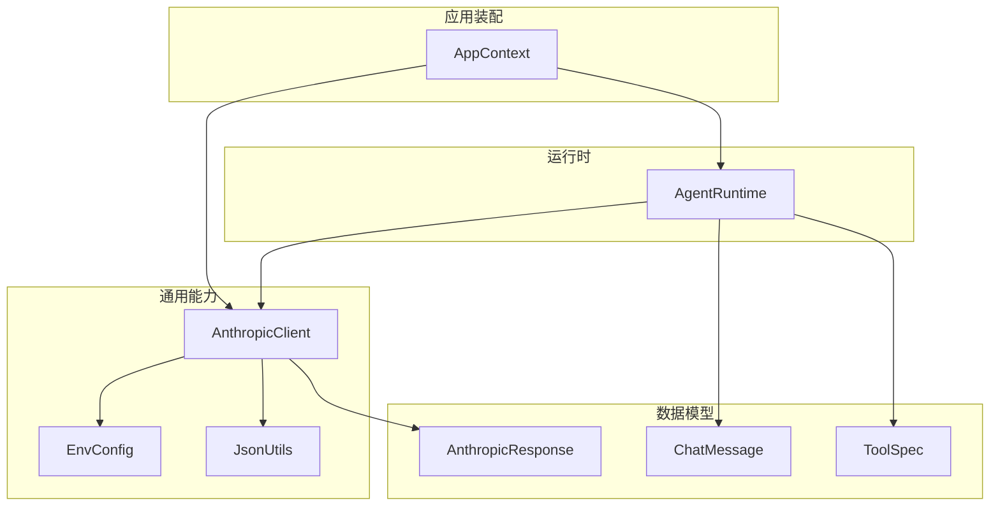
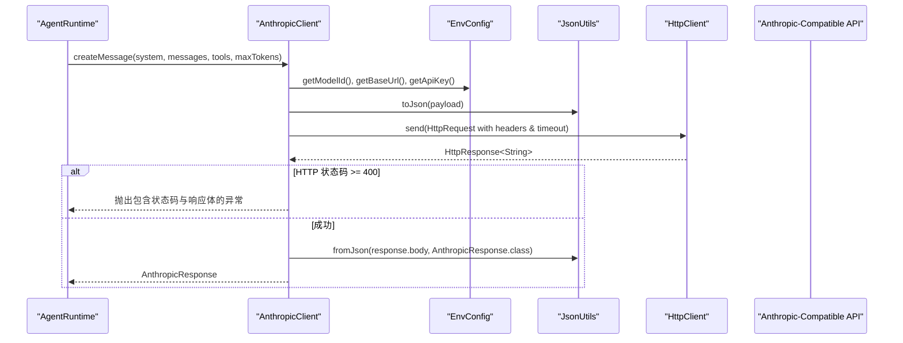
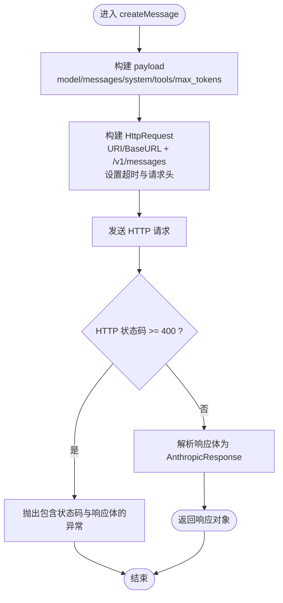
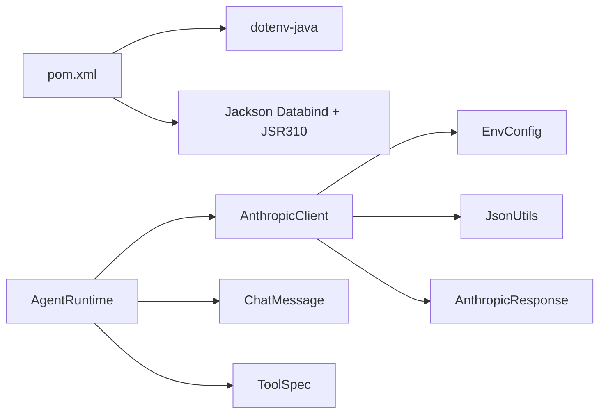

# Claude API客户端

<cite>
**本文引用的文件**
- [AnthropicClient.java](file://src/main/java/com/learnclaudecode/common/AnthropicClient.java)
- [EnvConfig.java](file://src/main/java/com/learnclaudecode/common/EnvConfig.java)
- [JsonUtils.java](file://src/main/java/com/learnclaudecode/common/JsonUtils.java)
- [AnthropicResponse.java](file://src/main/java/com/learnclaudecode/model/AnthropicResponse.java)
- [ChatMessage.java](file://src/main/java/com/learnclaudecode/model/ChatMessage.java)
- [ToolSpec.java](file://src/main/java/com/learnclaudecode/model/ToolSpec.java)
- [AgentRuntime.java](file://src/main/java/com/learnclaudecode/agents/AgentRuntime.java)
- [AppContext.java](file://src/main/java/com/learnclaudecode/agents/AppContext.java)
- [pom.xml](file://pom.xml)
</cite>

## 目录
1. [简介](#简介)
2. [项目结构](#项目结构)
3. [核心组件](#核心组件)
4. [架构总览](#架构总览)
5. [详细组件分析](#详细组件分析)
6. [依赖关系分析](#依赖关系分析)
7. [性能与超时](#性能与超时)
8. [故障排查指南](#故障排查指南)
9. [结论](#结论)
10. [附录：使用示例与最佳实践](#附录使用示例与最佳实践)

## 简介
本文件面向希望理解并正确使用本项目中 Claude API 客户端的开发者。文档聚焦于 AnthropicClient 类的 HTTP 客户端实现，涵盖请求构造、响应处理、错误重试与超时管理；说明 createMessage 方法的参数配置（system 提示词、消息历史、工具定义、最大 token 数）；解释认证机制（API 密钥配置与兼容第三方服务的认证方式）；描述请求头设置（content-type、anthropic-version、认证头）；提供错误处理策略（网络异常、HTTP 状态码处理与调试技巧），并给出实际使用示例与最佳实践建议。

## 项目结构
本项目采用分层组织：common 层提供通用能力（HTTP 客户端、JSON 序列化、环境配置），model 层定义数据模型，agents 层编排 Agent 运行时与调用流程。AnthropicClient 位于 common 层，作为“模型网关”，将上层 Agent 的请求转换为对 Anthropic-compatible messages API 的 HTTP 调用。

图表来源
- [AppContext.java:35-58](file://src/main/java/com/learnclaudecode/agents/AppContext.java#L35-L58)
- [AgentRuntime.java:165-172](file://src/main/java/com/learnclaudecode/agents/AgentRuntime.java#L165-L172)
- [AnthropicClient.java:27-101](file://src/main/java/com/learnclaudecode/common/AnthropicClient.java#L27-L101)
- [EnvConfig.java:22-29](file://src/main/java/com/learnclaudecode/common/EnvConfig.java#L22-L29)
- [JsonUtils.java:12-15](file://src/main/java/com/learnclaudecode/common/JsonUtils.java#L12-L15)
- [AnthropicResponse.java:11-13](file://src/main/java/com/learnclaudecode/model/AnthropicResponse.java#L11-L13)
- [ChatMessage.java:6-7](file://src/main/java/com/learnclaudecode/model/ChatMessage.java#L6-L7)
- [ToolSpec.java:8-9](file://src/main/java/com/learnclaudecode/model/ToolSpec.java#L8-L9)

章节来源
- [AppContext.java:35-58](file://src/main/java/com/learnclaudecode/agents/AppContext.java#L35-L58)
- [pom.xml:19-35](file://pom.xml#L19-L35)

## 核心组件
- AnthropicClient：封装对 Anthropic-compatible messages API 的 HTTP 调用，负责构建请求体、设置请求头、发送请求、解析响应与错误处理。
- EnvConfig：读取环境变量（模型 ID、API Key、Base URL、工作目录），支持 .env 与系统环境变量覆盖。
- JsonUtils：基于 Jackson 的统一 JSON 序列化/反序列化工具。
- 数据模型：AnthropicResponse、ChatMessage、ToolSpec 等用于承载请求与响应的数据结构。

章节来源
- [AnthropicClient.java:27-101](file://src/main/java/com/learnclaudecode/common/AnthropicClient.java#L27-L101)
- [EnvConfig.java:22-96](file://src/main/java/com/learnclaudecode/common/EnvConfig.java#L22-L96)
- [JsonUtils.java:12-83](file://src/main/java/com/learnclaudecode/common/JsonUtils.java#L12-L83)
- [AnthropicResponse.java:11-13](file://src/main/java/com/learnclaudecode/model/AnthropicResponse.java#L11-L13)
- [ChatMessage.java:6-7](file://src/main/java/com/learnclaudecode/model/ChatMessage.java#L6-L7)
- [ToolSpec.java:8-9](file://src/main/java/com/learnclaudecode/model/ToolSpec.java#L8-L9)

## 架构总览
下图展示了从 Agent 运行时到模型服务端的完整调用链路，包括请求构造、认证头注入、HTTP 发送、响应解析与错误处理。

图表来源
- [AgentRuntime.java:165-172](file://src/main/java/com/learnclaudecode/agents/AgentRuntime.java#L165-L172)
- [AnthropicClient.java:52-101](file://src/main/java/com/learnclaudecode/common/AnthropicClient.java#L52-L101)
- [EnvConfig.java:65-85](file://src/main/java/com/learnclaudecode/common/EnvConfig.java#L65-L85)
- [JsonUtils.java:29-65](file://src/main/java/com/learnclaudecode/common/JsonUtils.java#L29-L65)

## 详细组件分析

### AnthropicClient：HTTP 客户端实现
- 职责
  - 构建符合 Anthropic messages API 的请求体（model、messages、system、tools、max_tokens）。
  - 设置请求头：content-type、anthropic-version、x-api-key、authorization。
  - 通过 Java HttpClient 发送请求，设置连接超时与请求超时。
  - 解析响应为 AnthropicResponse，并在非 2xx 时抛出包含状态码和响应体的异常。
- 关键行为
  - Base URL 拼接 /v1/messages，允许通过环境变量替换为第三方兼容端点。
  - 同时发送 x-api-key 与 authorization Bearer 两种认证头，以兼容不同提供方。
  - 统一捕获 IO 与中断异常，转为业务异常并恢复线程中断标志。

图表来源
- [AnthropicClient.java:52-101](file://src/main/java/com/learnclaudecode/common/AnthropicClient.java#L52-L101)

章节来源
- [AnthropicClient.java:27-101](file://src/main/java/com/learnclaudecode/common/AnthropicClient.java#L27-L101)

### EnvConfig：环境与认证配置
- 环境变量优先级：系统环境变量优先于 .env 文件中的值。
- 必填项：MODEL_ID；可选：ANTHROPIC_API_KEY、ANTHROPIC_BASE_URL（默认官方地址）。
- 用途：为 AnthropicClient 提供 modelId、apiKey、baseUrl，便于切换第三方兼容端点。

章节来源
- [EnvConfig.java:22-96](file://src/main/java/com/learnclaudecode/common/EnvConfig.java#L22-L96)

### JsonUtils：JSON 序列化与反序列化
- 基于 Jackson ObjectMapper，注册 JavaTimeModule 并禁用时间戳输出。
- 提供紧凑与格式化 JSON 输出方法，以及泛型与非泛型反序列化方法。
- 在 AnthropicClient 中用于 payload 序列化与响应反序列化。

章节来源
- [JsonUtils.java:12-83](file://src/main/java/com/learnclaudecode/common/JsonUtils.java#L12-L83)

### 数据模型
- AnthropicResponse：包含 stop_reason 与 content（文本或 tool_use 块列表）。
- ChatMessage：角色与内容（Object 以兼容文本或结构化 tool_result）。
- ToolSpec：工具名称、描述与输入 schema，对齐 Claude messages API 的工具定义。

章节来源
- [AnthropicResponse.java:11-13](file://src/main/java/com/learnclaudecode/model/AnthropicResponse.java#L11-L13)
- [ChatMessage.java:6-7](file://src/main/java/com/learnclaudecode/model/ChatMessage.java#L6-L7)
- [ToolSpec.java:8-9](file://src/main/java/com/learnclaudecode/model/ToolSpec.java#L8-L9)

### AgentRuntime：调用示例与上下文组装
- 在 Agent 主循环中，构造 system prompt、messages 与 tools，调用 createMessage 获取下一步行动。
- 根据 response.stop_reason 判断是否继续工具调用循环，并将工具结果回写为 user 消息。
- 子代理场景下复用同一 AnthropicClient，但维护独立的消息上下文。

章节来源
- [AgentRuntime.java:165-172](file://src/main/java/com/learnclaudecode/agents/AgentRuntime.java#L165-L172)
- [AgentRuntime.java:270-309](file://src/main/java/com/learnclaudecode/agents/AgentRuntime.java#L270-L309)

## 依赖关系分析
- 外部依赖
  - dotenv-java：读取 .env 环境变量。
  - Jackson：JSON 序列化与反序列化。
- 内部依赖
  - AnthropicClient 依赖 EnvConfig（配置）、JsonUtils（序列化）、AnthropicResponse（响应模型）。
  - AgentRuntime 依赖 AnthropicClient 进行模型调用，并使用 ChatMessage、ToolSpec 等模型。

图表来源
- [pom.xml:19-35](file://pom.xml#L19-L35)
- [AnthropicClient.java:27-101](file://src/main/java/com/learnclaudecode/common/AnthropicClient.java#L27-L101)
- [AgentRuntime.java:165-172](file://src/main/java/com/learnclaudecode/agents/AgentRuntime.java#L165-L172)

章节来源
- [pom.xml:19-35](file://pom.xml#L19-L35)

## 性能与超时
- 连接超时：HttpClient 初始化时设置 connectTimeout 为 30 秒，避免握手阶段长时间阻塞。
- 请求超时：每次请求设置 180 秒超时，适合大模型推理场景。
- 序列化开销：payload 与响应均通过 Jackson 序列化/反序列化，建议在高频调用场景复用 JsonUtils 的 ObjectMapper（当前已静态共享）。
- 并发与复用：当前每个 AnthropicClient 持有独立的 HttpClient 实例；在高并发场景可考虑共享 HttpClient 以提升性能。

[本节为通用性能建议，不直接分析具体代码行]

## 故障排查指南
- 网络异常与中断
  - 捕获 IOException 与 InterruptedException，统一包装为 IllegalStateException，并恢复线程中断标志。
  - 排查要点：检查网络连通性、DNS 解析、代理配置与防火墙规则。
- HTTP 状态码处理
  - 当状态码 >= 400 时抛出异常，异常信息包含状态码与响应体，便于定位第三方接口返回的错误详情。
  - 排查要点：查看响应体中的错误码与消息，确认 Base URL、API Key 与权限。
- 认证问题
  - 同时发送 x-api-key 与 authorization Bearer 两种认证头，兼容不同提供方。
  - 排查要点：确认 ANTHROPIC_API_KEY 是否正确配置，第三方服务是否要求特定头部格式。
- 调试技巧
  - 打印请求体与响应体：可在调用前后记录 payload 与 response.body，对比官方 API 文档。
  - 逐步缩小范围：先验证 Base URL 与认证头，再逐步添加 messages、tools、system 等字段。
  - 使用最小可复现请求：仅包含必要字段，逐步增加复杂度。

章节来源
- [AnthropicClient.java:87-101](file://src/main/java/com/learnclaudecode/common/AnthropicClient.java#L87-L101)

## 结论
AnthropicClient 提供了轻量且易用的 Claude API 客户端实现，遵循 Anthropic-compatible messages API 协议，支持灵活的 Base URL 与多认证头兼容。结合 EnvConfig 与 JsonUtils，项目实现了清晰的分层与良好的可维护性。在生产环境中，建议关注并发下的 HttpClient 复用、重试策略与更细粒度的错误分类，以提升稳定性与可观测性。

[本节为总结性内容，不直接分析具体代码行]

## 附录：使用示例与最佳实践

### 基本用法
- 创建客户端：通过 AppContext 装配 EnvConfig 并创建 AnthropicClient。
- 构造请求：准备 system、messages、tools 与 maxTokens，调用 createMessage。
- 处理响应：根据 stop_reason 判断是否为 tool_use，并相应更新消息历史。

章节来源
- [AppContext.java:35-58](file://src/main/java/com/learnclaudecode/agents/AppContext.java#L35-L58)
- [AgentRuntime.java:165-172](file://src/main/java/com/learnclaudecode/agents/AgentRuntime.java#L165-L172)

### 参数配置说明
- system：系统级约束，用于设定模型行为边界与风格。
- messages：对话历史，包含用户与助手消息，支持文本与结构化 tool_result。
- tools：当前轮次允许模型调用的工具定义，需对齐 Claude messages API 的工具 schema。
- maxTokens：本轮最大输出 token 数，控制响应长度与成本。

章节来源
- [AnthropicClient.java:52-69](file://src/main/java/com/learnclaudecode/common/AnthropicClient.java#L52-L69)
- [ToolSpec.java:8-9](file://src/main/java/com/learnclaudecode/model/ToolSpec.java#L8-L9)
- [ChatMessage.java:6-7](file://src/main/java/com/learnclaudecode/model/ChatMessage.java#L6-L7)

### 认证机制
- API Key：通过 ANTHROPIC_API_KEY 环境变量注入，同时设置 x-api-key 与 authorization Bearer 头。
- Base URL：通过 ANTHROPIC_BASE_URL 指定，默认官方地址，可替换为第三方兼容端点。
- 模型 ID：通过 MODEL_ID 指定，决定使用的模型版本。

章节来源
- [EnvConfig.java:22-29](file://src/main/java/com/learnclaudecode/common/EnvConfig.java#L22-L29)
- [AnthropicClient.java:74-85](file://src/main/java/com/learnclaudecode/common/AnthropicClient.java#L74-L85)

### 请求头设置
- content-type：application/json。
- anthropic-version：固定为 2023-06-01，确保协议兼容性。
- 认证头：x-api-key 与 authorization Bearer，兼容多种提供方。

章节来源
- [AnthropicClient.java:74-85](file://src/main/java/com/learnclaudecode/common/AnthropicClient.java#L74-L85)

### 错误处理策略
- 网络异常：统一包装为业务异常，保留原始异常链以便调试。
- HTTP 错误：状态码 >= 400 时抛出异常，包含状态码与响应体。
- 调试建议：记录请求与响应，逐步验证各字段与头部。

章节来源
- [AnthropicClient.java:87-101](file://src/main/java/com/learnclaudecode/common/AnthropicClient.java#L87-L101)

### 最佳实践建议
- 复用 HttpClient：在高并发场景下，考虑在应用生命周期内复用 HttpClient 实例。
- 重试与退避：当前未实现自动重试，可根据业务需求在上层实现指数退避重试。
- 日志与监控：记录请求耗时、错误率与响应大小，便于性能分析与问题定位。
- 安全与合规：避免在日志中泄露 API Key 与敏感信息，使用环境变量管理密钥。

[本节为通用最佳实践，不直接分析具体代码行]