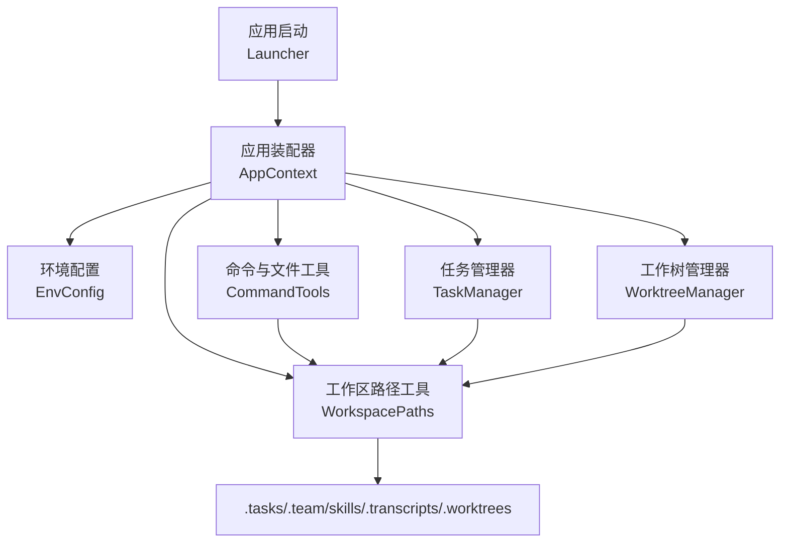
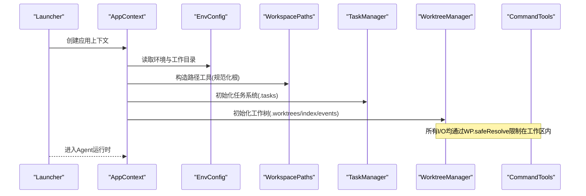
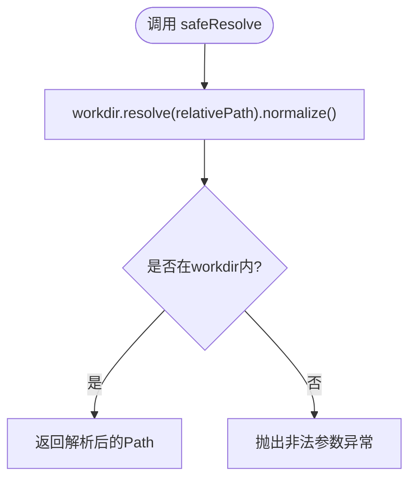
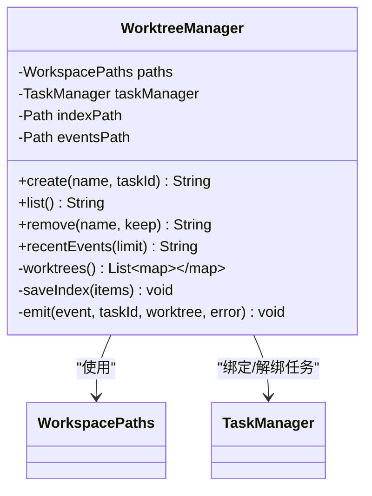
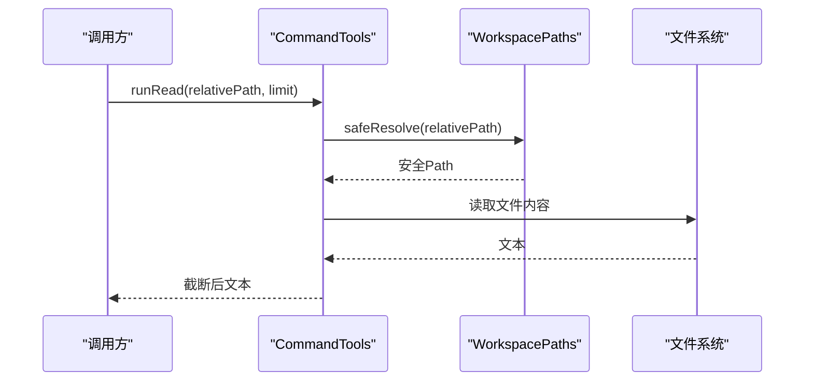
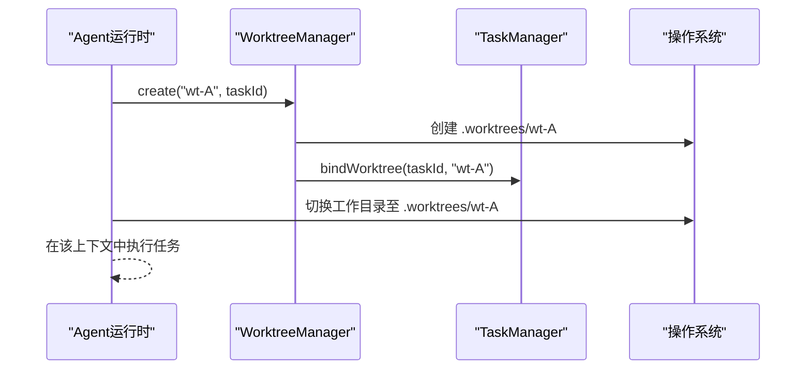
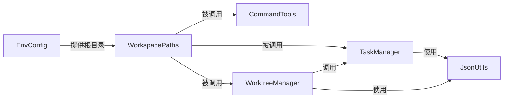

# 工作目录管理

<cite>
**本文引用的文件**
- [WorkspacePaths.java](file://src/main/java/com/learnclaudecode/common/WorkspacePaths.java)
- [WorktreeManager.java](file://src/main/java/com/learnclaudecode/tasks/WorktreeManager.java)
- [TaskManager.java](file://src/main/java/com/learnclaudecode/tasks/TaskManager.java)
- [CommandTools.java](file://src/main/java/com/learnclaudecode/tools/CommandTools.java)
- [AppContext.java](file://src/main/java/com/learnclaudecode/agents/AppContext.java)
- [EnvConfig.java](file://src/main/java/com/learnclaudecode/common/EnvConfig.java)
- [Launcher.java](file://src/main/java/com/learnclaudecode/agents/Launcher.java)
- [S12WorktreeTaskIsolation.java](file://src/main/java/com/learnclaudecode/agents/S12WorktreeTaskIsolation.java)
- [TaskRecord.java](file://src/main/java/com/learnclaudecode/model/TaskRecord.java)
- [JsonUtils.java](file://src/main/java/com/learnclaudecode/common/JsonUtils.java)
</cite>

## 目录
1. [简介](#简介)
2. [项目结构](#项目结构)
3. [核心组件](#核心组件)
4. [架构总览](#架构总览)
5. [详细组件分析](#详细组件分析)
6. [依赖关系分析](#依赖关系分析)
7. [性能与资源管理](#性能与资源管理)
8. [故障排查指南](#故障排查指南)
9. [结论](#结论)
10. [附录：常见使用场景与示例路径](#附录：常见使用场景与示例路径)

## 简介
本文件围绕“工作目录管理”展开，重点说明 WorkspacePaths 类的工作目录管理机制（路径解析、文件操作与安全验证），工作空间的初始化过程（目录结构与权限检查），文件读写操作的实现（绝对路径处理、相对路径转换、路径安全校验），以及与 Agent 运行时集成的方式（上下文隔离与工作树切换）。同时给出文件操作最佳实践（错误处理、性能优化、资源管理）和常见使用场景。

## 项目结构
该模块位于 common 与 tasks/tools 等包中，围绕“工作区根目录 + 子目录约定”组织数据与行为：
- 工作区根目录由环境配置提供，并通过统一的路径工具进行访问与约束。
- 关键子目录包括 .tasks、.team、skills、.transcripts、.worktrees 等，分别承载任务、团队协作、技能、会话转录与隔离工作树等数据。
- 命令执行与文件读写均通过统一入口，确保所有 I/O 都受限于工作区范围。

图表来源
- [Launcher.java:18-26](file://src/main/java/com/learnclaudecode/agents/Launcher.java#L18-L26)
- [AppContext.java:35-58](file://src/main/java/com/learnclaudecode/agents/AppContext.java#L35-L58)
- [EnvConfig.java:22-29](file://src/main/java/com/learnclaudecode/common/EnvConfig.java#L22-L29)
- [WorkspacePaths.java:21-23](file://src/main/java/com/learnclaudecode/common/WorkspacePaths.java#L21-L23)
- [CommandTools.java:26-28](file://src/main/java/com/learnclaudecode/tools/CommandTools.java#L26-L28)
- [TaskManager.java:35-42](file://src/main/java/com/learnclaudecode/tasks/TaskManager.java#L35-L42)
- [WorktreeManager.java:39-57](file://src/main/java/com/learnclaudecode/tasks/WorktreeManager.java#L39-L57)

章节来源
- [Launcher.java:18-26](file://src/main/java/com/learnclaudecode/agents/Launcher.java#L18-L26)
- [AppContext.java:35-58](file://src/main/java/com/learnclaudecode/agents/AppContext.java#L35-L58)
- [EnvConfig.java:22-29](file://src/main/java/com/learnclaudecode/common/EnvConfig.java#L22-L29)

## 核心组件
- WorkspacePaths：工作区路径工具，负责将任意相对路径解析为工作区内绝对路径并进行安全校验；提供常用子目录访问方法；封装安全的文本读写。
- WorktreeManager：维护 .worktrees 下的索引与事件日志，创建/列出/移除 worktree，并与任务绑定/解绑。
- TaskManager：基于 .tasks 的任务持久化与状态流转，支持任务创建、更新、认领、依赖清理以及 worktree 绑定。
- CommandTools：在工作区范围内执行 shell 命令与文件读写，强制通过 WorkspacePaths.safeResolve 保证路径安全。
- AppContext：集中装配 EnvConfig、WorkspacePaths、TaskManager、WorktreeManager 等共享服务，并注入到 AgentRuntime。
- EnvConfig：读取环境变量与当前工作目录，作为工作区根来源。

章节来源
- [WorkspacePaths.java:21-148](file://src/main/java/com/learnclaudecode/common/WorkspacePaths.java#L21-L148)
- [WorktreeManager.java:39-243](file://src/main/java/com/learnclaudecode/tasks/WorktreeManager.java#L39-L243)
- [TaskManager.java:35-338](file://src/main/java/com/learnclaudecode/tasks/TaskManager.java#L35-L338)
- [CommandTools.java:26-144](file://src/main/java/com/learnclaudecode/tools/CommandTools.java#L26-L144)
- [AppContext.java:35-58](file://src/main/java/com/learnclaudecode/agents/AppContext.java#L35-L58)
- [EnvConfig.java:22-94](file://src/main/java/com/learnclaudecode/common/EnvConfig.java#L22-L94)

## 架构总览
工作目录管理的整体流程如下：
- 启动阶段：Launcher 调用 AppContext 装配服务，EnvConfig 提供当前工作目录，WorkspacePaths 规范化根路径。
- 初始化阶段：TaskManager 确保 .tasks 存在；WorktreeManager 确保 .worktrees 及 index.json/events.jsonl 存在。
- 运行阶段：Agent 通过 CommandTools 或 WorkspacePaths 进行文件读写与命令执行，所有路径必须经 safeResolve 校验。
- 隔离阶段：WorktreeManager 为任务创建独立目录，TaskManager 记录 worktree 绑定，便于后续切换与审计。

图表来源
- [Launcher.java:18-26](file://src/main/java/com/learnclaudecode/agents/Launcher.java#L18-L26)
- [AppContext.java:35-58](file://src/main/java/com/learnclaudecode/agents/AppContext.java#L35-L58)
- [EnvConfig.java:22-29](file://src/main/java/com/learnclaudecode/common/EnvConfig.java#L22-L29)
- [TaskManager.java:35-42](file://src/main/java/com/learnclaudecode/tasks/TaskManager.java#L35-L42)
- [WorktreeManager.java:39-57](file://src/main/java/com/learnclaudecode/tasks/WorktreeManager.java#L39-L57)
- [CommandTools.java:26-28](file://src/main/java/com/learnclaudecode/tools/CommandTools.java#L26-L28)

## 详细组件分析

### WorkspacePaths：工作目录管理与安全边界
- 路径解析与安全校验
  - 构造函数接收 Path，转换为绝对路径并规范化，避免 ../ 逃逸。
  - safeResolve 将相对路径在工作区内解析并校验结果是否仍位于工作区根下，否则抛出非法参数异常。
- 文件读写
  - readText/writeText 基于 safeResolve 获取目标路径，写入时自动创建父目录，并以 UTF-8 编码读写。
- 常用子目录访问
  - tasksDir/teamDir/inboxDir/skillsDir/transcriptDir/worktreesDir 等方法返回以工作区根为基的固定子目录路径。
- 设计要点
  - 所有外部输入路径必须经过 safeResolve，形成单一可信入口。
  - 不直接暴露原始 workdir 给不受信任的代码，降低越权风险。

图表来源
- [WorkspacePaths.java:42-49](file://src/main/java/com/learnclaudecode/common/WorkspacePaths.java#L42-L49)

章节来源
- [WorkspacePaths.java:21-148](file://src/main/java/com/learnclaudecode/common/WorkspacePaths.java#L21-L148)

### WorktreeManager：工作树隔离与生命周期管理
- 初始化
  - 确保 .worktrees 目录存在，首次启动创建 index.json（worktree 清单）与 events.jsonl（事件流水）。
- 创建/列出/移除
  - create：在 .worktrees/<name> 创建目录，写入索引项（名称、路径、分支、任务ID、状态），绑定任务，记录创建事件。
  - list：读取 index.json 中的 worktrees 列表。
  - remove：从索引删除，可选择保留或删除目录；若关联任务则解绑；记录移除事件。
- 事件与审计
  - recentEvents：读取 events.jsonl 最近若干行，限制返回条数防止过大响应。
  - emit：追加一行 JSON 事件，包含事件名、时间戳、任务信息、worktree 信息与可选错误。
- 并发与一致性
  - 关键方法加同步锁，避免并发写索引与事件文件导致不一致。

图表来源
- [WorktreeManager.java:24-243](file://src/main/java/com/learnclaudecode/tasks/WorktreeManager.java#L24-L243)

章节来源
- [WorktreeManager.java:39-243](file://src/main/java/com/learnclaudecode/tasks/WorktreeManager.java#L39-L243)

### TaskManager：任务持久化与 worktree 绑定
- 任务模型
  - TaskRecord 包含 id、subject、description、status、owner、worktree、blockedBy、blocks、created_at、updated_at。
- 生命周期
  - create/get/update/listAll/claim/scanUnclaimed：基础 CRUD 与看板视图、可认领任务扫描。
  - bindWorktree/unbindWorktree：将任务与 worktree 名称绑定/解绑，并在绑定时将 pending 推进为 in_progress。
  - clearDependency：当任务完成时，清理其他任务对其的 blockedBy 依赖。
- 存储
  - 每个任务一个 JSON 文件，位于 .tasks 目录下，命名规则为 task_<id>.json。
  - 加载全部任务时按文件名排序，保证稳定顺序。

```mermaid
flowchart TD
S(["update(taskId,status,...)"]) --> Load["加载任务"]
Load --> StatusCheck{"状态变更?"}
StatusCheck --> |completed| ClearDep["清理依赖"]
StatusCheck --> |deleted| DeleteFile["删除任务文件并返回"]
StatusCheck --> |其他| AppendDeps["追加依赖关系"]
ClearDep --> Save["更新时间并保存"]
AppendDeps --> Save
DeleteFile --> End(["结束"])
Save --> End
```

图表来源
- [TaskManager.java:84-133](file://src/main/java/com/learnclaudecode/tasks/TaskManager.java#L84-L133)
- [TaskManager.java:329-336](file://src/main/java/com/learnclaudecode/tasks/TaskManager.java#L329-L336)

章节来源
- [TaskManager.java:35-338](file://src/main/java/com/learnclaudecode/tasks/TaskManager.java#L35-L338)
- [TaskRecord.java:9-62](file://src/main/java/com/learnclaudecode/model/TaskRecord.java#L9-L62)

### CommandTools：受限的命令与文件操作
- 命令执行
  - runBash：黑名单过滤危险命令，设置进程工作目录为工作区根，限制超时与输出长度。
  - shellCommand：根据操作系统选择 powershell 或 bash。
- 文件操作
  - runRead/runWrite/runEdit：所有路径通过 WorkspacePaths.safeResolve 校验，写入前自动创建父目录，编辑采用精确替换。
- 安全策略
  - 所有 I/O 必须经由 safeResolve，避免路径穿越。
  - 命令执行限制在进程级工作目录，配合黑名单最小化风险。

图表来源
- [CommandTools.java:87-100](file://src/main/java/com/learnclaudecode/tools/CommandTools.java#L87-L100)
- [WorkspacePaths.java:42-49](file://src/main/java/com/learnclaudecode/common/WorkspacePaths.java#L42-L49)

章节来源
- [CommandTools.java:26-144](file://src/main/java/com/learnclaudecode/tools/CommandTools.java#L26-L144)
- [WorkspacePaths.java:42-49](file://src/main/java/com/learnclaudecode/common/WorkspacePaths.java#L42-L49)

### 与 Agent 运行时集成：上下文隔离与工作树切换
- 装配与注入
  - AppContext 在启动时创建 EnvConfig、WorkspacePaths、TaskManager、WorktreeManager 等，并将它们注入到 AgentRuntime（由 AppContext.runtime 返回）。
- 工作树切换
  - 通过 WorktreeManager.create 为任务创建独立目录，TaskManager.bindWorktree 将任务与 worktree 名称绑定。
  - 外部调度可在执行任务时将工作目录切换到对应 worktree 目录，从而实现上下文隔离。
- 事件追踪
  - WorktreeManager.emit 记录创建/移除事件，便于审计与问题定位。

图表来源
- [AppContext.java:35-58](file://src/main/java/com/learnclaudecode/agents/AppContext.java#L35-L58)
- [WorktreeManager.java:71-98](file://src/main/java/com/learnclaudecode/tasks/WorktreeManager.java#L71-L98)
- [TaskManager.java:215-234](file://src/main/java/com/learnclaudecode/tasks/TaskManager.java#L215-L234)

章节来源
- [AppContext.java:35-58](file://src/main/java/com/learnclaudecode/agents/AppContext.java#L35-L58)
- [WorktreeManager.java:71-98](file://src/main/java/com/learnclaudecode/tasks/WorktreeManager.java#L71-L98)
- [TaskManager.java:215-234](file://src/main/java/com/learnclaudecode/tasks/TaskManager.java#L215-L234)

## 依赖关系分析
- 低耦合高内聚
  - WorkspacePaths 仅依赖 NIO 路径 API，职责单一且无外部库依赖。
  - WorktreeManager 依赖 WorkspacePaths 与 TaskManager，通过接口方法完成绑定/解绑，避免紧耦合。
  - CommandTools 依赖 WorkspacePaths，确保所有文件操作的安全边界。
- 外部依赖
  - JsonUtils 使用 Jackson 进行序列化/反序列化，统一时间类型处理。
  - EnvConfig 使用 dotenv 读取环境变量，兼容系统变量覆盖。

图表来源
- [WorkspacePaths.java:21-148](file://src/main/java/com/learnclaudecode/common/WorkspacePaths.java#L21-L148)
- [CommandTools.java:26-144](file://src/main/java/com/learnclaudecode/tools/CommandTools.java#L26-L144)
- [TaskManager.java:35-338](file://src/main/java/com/learnclaudecode/tasks/TaskManager.java#L35-L338)
- [WorktreeManager.java:39-243](file://src/main/java/com/learnclaudecode/tasks/WorktreeManager.java#L39-L243)
- [JsonUtils.java:12-83](file://src/main/java/com/learnclaudecode/common/JsonUtils.java#L12-L83)
- [EnvConfig.java:22-94](file://src/main/java/com/learnclaudecode/common/EnvConfig.java#L22-L94)

章节来源
- [WorkspacePaths.java:21-148](file://src/main/java/com/learnclaudecode/common/WorkspacePaths.java#L21-L148)
- [CommandTools.java:26-144](file://src/main/java/com/learnclaudecode/tools/CommandTools.java#L26-L144)
- [TaskManager.java:35-338](file://src/main/java/com/learnclaudecode/tasks/TaskManager.java#L35-L338)
- [WorktreeManager.java:39-243](file://src/main/java/com/learnclaudecode/tasks/WorktreeManager.java#L39-L243)
- [JsonUtils.java:12-83](file://src/main/java/com/learnclaudecode/common/JsonUtils.java#L12-L83)
- [EnvConfig.java:22-94](file://src/main/java/com/learnclaudecode/common/EnvConfig.java#L22-L94)

## 性能与资源管理
- 路径解析
  - 使用 Path.normalize 减少冗余分隔符与相对段，提升后续比较效率。
- 文件 I/O
  - 读大文件时使用 limit 限制行数，避免一次性加载过多内容导致内存压力。
  - 写文件时先创建父目录，减少上层调用复杂度。
- 并发控制
  - WorktreeManager 与 TaskManager 的关键方法使用同步块，避免并发写导致的索引/任务文件损坏。
- 超时与资源释放
  - 命令执行设置超时并强制销毁，防止僵尸进程占用资源。
  - 流式读取事件文件时限制返回条数，避免大响应影响性能。
- 建议
  - 对频繁读写的热点文件考虑缓存或批量写入。
  - 对大目录遍历（如删除）采用逆序删除，减少递归开销。

[本节为通用性能指导，不直接分析具体文件]

## 故障排查指南
- 路径越界
  - 现象：safeResolve 抛出非法参数异常。
  - 原因：相对路径尝试逃逸工作区根。
  - 处理：检查传入路径，确保不包含 .. 或指向工作区外的路径。
- 目录不存在
  - 现象：初始化失败或写入失败。
  - 原因：.tasks/.worktrees 未创建或权限不足。
  - 处理：确认启动流程已执行初始化逻辑，检查文件系统权限。
- 索引/事件文件损坏
  - 现象：读取 index.json/events.jsonl 失败。
  - 原因：并发写或异常中断导致文件不完整。
  - 处理：恢复默认空结构或清空后重试；增加事务性写入或备份机制。
- 命令执行超时
  - 现象：runBash 返回超时错误。
  - 原因：命令长时间无输出或死循环。
  - 处理：优化命令逻辑，缩短超时或拆分任务。

章节来源
- [WorkspacePaths.java:42-49](file://src/main/java/com/learnclaudecode/common/WorkspacePaths.java#L42-L49)
- [WorktreeManager.java:44-57](file://src/main/java/com/learnclaudecode/tasks/WorktreeManager.java#L44-L57)
- [CommandTools.java:36-65](file://src/main/java/com/learnclaudecode/tools/CommandTools.java#L36-L65)

## 结论
WorkspacePaths 提供了统一且安全的工作区路径抽象，是所有文件与命令操作的唯一可信入口。结合 TaskManager 与 WorktreeManager，实现了任务与隔离工作树的绑定与生命周期管理，使 Agent 能够在不同上下文中安全地执行任务。通过 AppContext 的集中装配，各组件松耦合协作，具备良好的可维护性与扩展性。遵循本文的最佳实践，可有效避免路径越权、资源泄漏与性能瓶颈等问题。

[本节为总结性内容，不直接分析具体文件]

## 附录：常见使用场景与示例路径
- 初始化工作空间
  - 启动 Launcher，AppContext 装配 EnvConfig、WorkspacePaths、TaskManager、WorktreeManager。
  - 参考路径：[Launcher.java:18-26](file://src/main/java/com/learnclaudecode/agents/Launcher.java#L18-L26)、[AppContext.java:35-58](file://src/main/java/com/learnclaudecode/agents/AppContext.java#L35-L58)
- 安全读取/写入文件
  - 通过 CommandTools.runRead/runWrite 或 WorkspacePaths.readText/writeText 操作文件，路径自动安全校验。
  - 参考路径：[CommandTools.java:87-121](file://src/main/java/com/learnclaudecode/tools/CommandTools.java#L87-L121)、[WorkspacePaths.java:58-75](file://src/main/java/com/learnclaudecode/common/WorkspacePaths.java#L58-L75)
- 创建任务并绑定工作树
  - 使用 TaskManager.create 创建任务，WorktreeManager.create 创建 worktree，再调用 TaskManager.bindWorktree 绑定。
  - 参考路径：[TaskManager.java:51-61](file://src/main/java/com/learnclaudecode/tasks/TaskManager.java#L51-L61)、[WorktreeManager.java:71-98](file://src/main/java/com/learnclaudecode/tasks/WorktreeManager.java#L71-L98)、[TaskManager.java:215-234](file://src/main/java/com/learnclaudecode/tasks/TaskManager.java#L215-L234)
- 切换工作上下文
  - 将进程工作目录切换到 .worktrees/<name>，在该上下文中执行命令与文件操作，实现隔离。
  - 参考路径：[WorktreeManager.java:71-98](file://src/main/java/com/learnclaudecode/tasks/WorktreeManager.java#L71-L98)、[CommandTools.java:36-65](file://src/main/java/com/learnclaudecode/tools/CommandTools.java#L36-L65)
- 查看工作树事件
  - 使用 WorktreeManager.recentEvents 获取最近的生命周期事件，用于审计与排障。
  - 参考路径：[WorktreeManager.java:175-184](file://src/main/java/com/learnclaudecode/tasks/WorktreeManager.java#L175-L184)

[本节为使用指引，不直接分析具体文件]