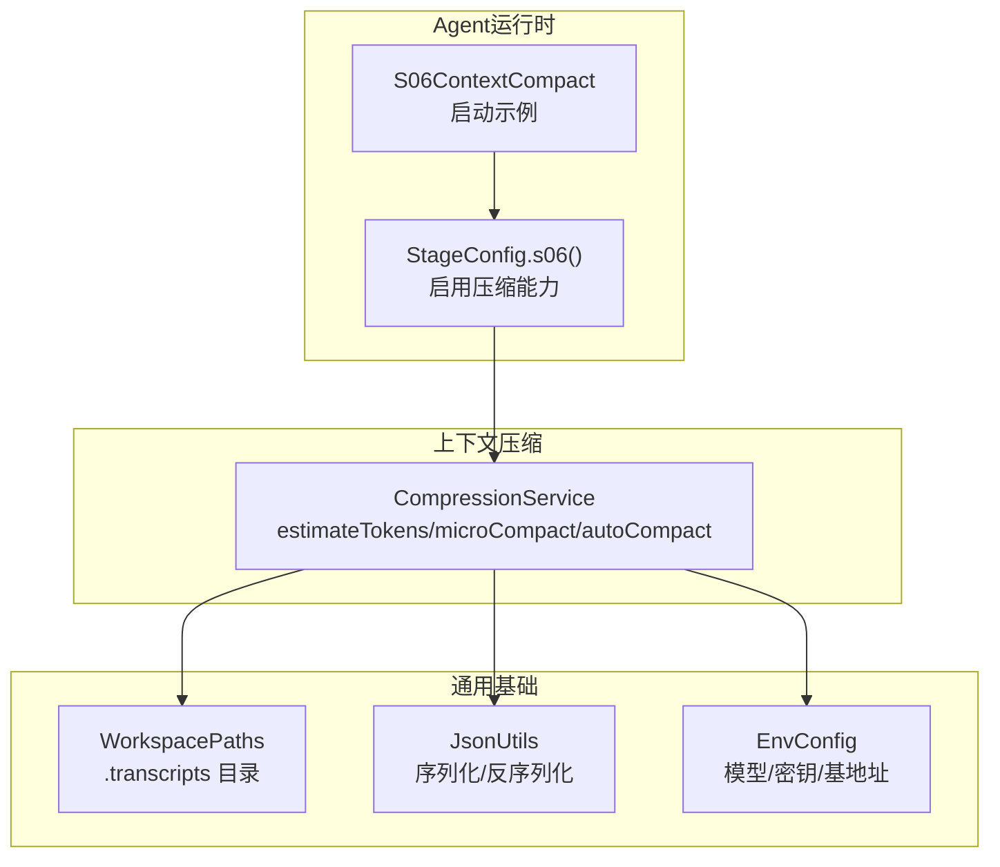
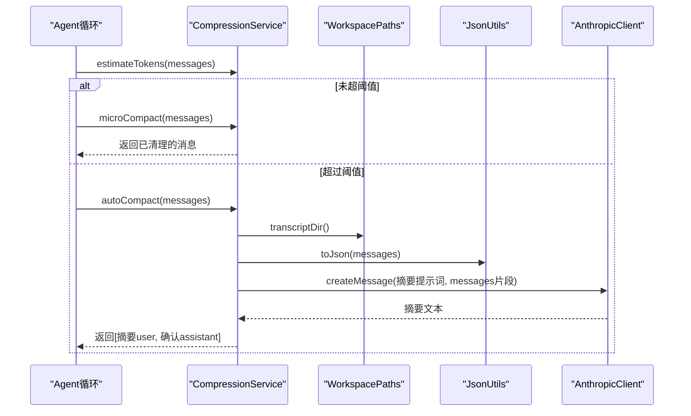
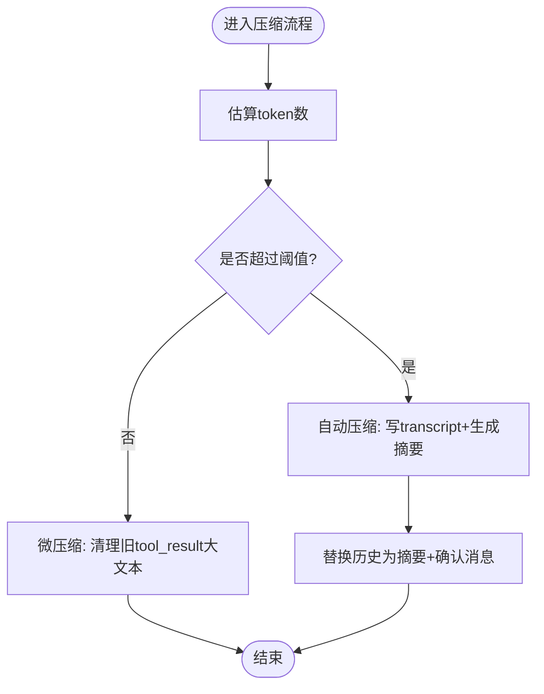
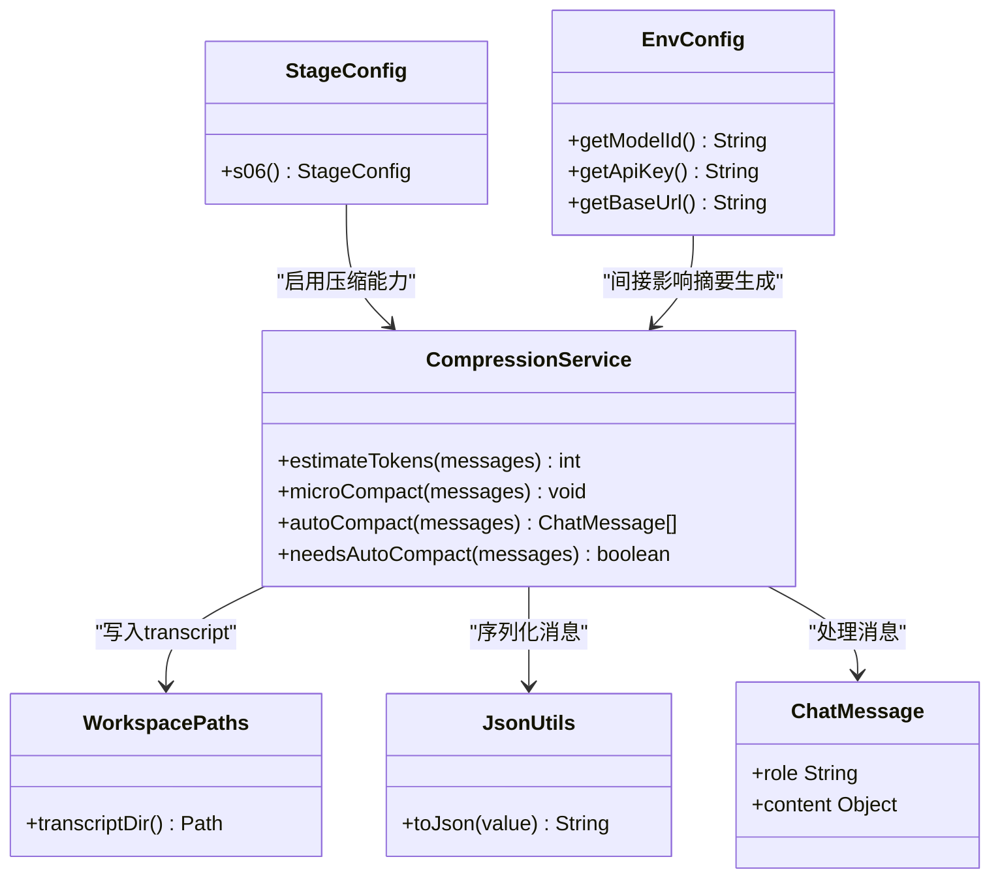

# 上下文压缩服务

<cite>
**本文引用的文件**
- [CompressionService.java](file://src/main/java/com/learnclaudecode/context/CompressionService.java)
- [S06ContextCompact.java](file://src/main/java/com/learnclaudecode/agents/S06ContextCompact.java)
- [StageConfig.java](file://src/main/java/com/learnclaudecode/agents/StageConfig.java)
- [ChatMessage.java](file://src/main/java/com/learnclaudecode/model/ChatMessage.java)
- [WorkspacePaths.java](file://src/main/java/com/learnclaudecode/common/WorkspacePaths.java)
- [JsonUtils.java](file://src/main/java/com/learnclaudecode/common/JsonUtils.java)
- [EnvConfig.java](file://src/main/java/com/learnclaudecode/common/EnvConfig.java)
- [s06-context-compact.tsx](file://web/src/components/visualizations/s06-context-compact.tsx)
- [s06.json](file://web/src/data/annotations/s06.json)
</cite>

## 目录
1. [简介](#简介)
2. [项目结构](#项目结构)
3. [核心组件](#核心组件)
4. [架构总览](#架构总览)
5. [详细组件分析](#详细组件分析)
6. [依赖关系分析](#依赖关系分析)
7. [性能考量](#性能考量)
8. [故障排查指南](#故障排查指南)
9. [结论](#结论)
10. [附录](#附录)

## 简介
本文件围绕“上下文压缩服务”展开，系统化解释智能对话历史压缩与优化策略。重点说明 CompressionService 的三层压缩思想：微压缩（micro compact）、自动压缩（auto compact）以及可配置阈值控制；阐述重要性评估、信息保留与上下文裁剪机制；提供压缩效果评估方法与性能优化建议；并给出上下文管理最佳实践与内存使用优化技巧。

## 项目结构
本项目将上下文压缩能力封装在 context 包中，并通过 agents 包的 s06 阶段配置暴露“compact”工具以触发手动压缩；同时通过 common 包提供工作区路径、JSON 序列化与环境配置等基础设施。前端可视化组件与标注文档用于教学演示与决策说明。

图表来源
- [S06ContextCompact.java:9-11](file://src/main/java/com/learnclaudecode/agents/S06ContextCompact.java#L9-L11)
- [StageConfig.java:142-149](file://src/main/java/com/learnclaudecode/agents/StageConfig.java#L142-L149)
- [CompressionService.java:29-48](file://src/main/java/com/learnclaudecode/context/CompressionService.java#L29-L48)
- [WorkspacePaths.java:127-136](file://src/main/java/com/learnclaudecode/common/WorkspacePaths.java#L127-L136)
- [JsonUtils.java:23-35](file://src/main/java/com/learnclaudecode/common/JsonUtils.java#L23-L35)
- [EnvConfig.java:22-29](file://src/main/java/com/learnclaudecode/common/EnvConfig.java#L22-L29)

章节来源
- [S06ContextCompact.java:9-11](file://src/main/java/com/learnclaudecode/agents/S06ContextCompact.java#L9-L11)
- [StageConfig.java:142-149](file://src/main/java/com/learnclaudecode/agents/StageConfig.java#L142-L149)
- [CompressionService.java:29-48](file://src/main/java/com/learnclaudecode/context/CompressionService.java#L29-L48)
- [WorkspacePaths.java:127-136](file://src/main/java/com/learnclaudecode/common/WorkspacePaths.java#L127-L136)
- [JsonUtils.java:23-35](file://src/main/java/com/learnclaudecode/common/JsonUtils.java#L23-L35)
- [EnvConfig.java:22-29](file://src/main/java/com/learnclaudecode/common/EnvConfig.java#L22-L29)

## 核心组件
- CompressionService：实现上下文压缩的核心服务，提供 token 估算、微压缩、自动压缩与阈值判断。
- ChatMessage：消息记录的数据结构，承载角色与内容（文本或结构化 tool_result）。
- WorkspacePaths：安全的工作区路径工具，提供 .transcripts 目录访问。
- JsonUtils：统一的 JSON 序列化/反序列化工具，支撑消息转存与估算。
- StageConfig.s06()：开启压缩能力的阶段配置，暴露 compact 工具。
- EnvConfig：读取模型 ID、API Key、Base URL 等工作环境参数。

章节来源
- [CompressionService.java:29-170](file://src/main/java/com/learnclaudecode/context/CompressionService.java#L29-L170)
- [ChatMessage.java:3-7](file://src/main/java/com/learnclaudecode/model/ChatMessage.java#L3-L7)
- [WorkspacePaths.java:127-136](file://src/main/java/com/learnclaudecode/common/WorkspacePaths.java#L127-L136)
- [JsonUtils.java:23-35](file://src/main/java/com/learnclaudecode/common/JsonUtils.java#L23-L35)
- [StageConfig.java:142-149](file://src/main/java/com/learnclaudecode/agents/StageConfig.java#L142-L149)
- [EnvConfig.java:22-29](file://src/main/java/com/learnclaudecode/common/EnvConfig.java#L22-L29)

## 架构总览
上下文压缩采用“三层策略”：
- 第一层：微压缩（micro compact），每轮运行，清理较老的 tool_result 大文本，保留最近若干条完整结果，降低上下文体积而不丢失调用结构。
- 第二层：自动压缩（auto compact），当估算 token 超过阈值时，将完整历史落盘为 transcript，再请求模型生成摘要，用“摘要 + 确认消息”替换旧历史。
- 第三层：手动压缩（/compact），由用户显式触发，进行更激进的压缩。

图表来源
- [CompressionService.java:56-60](file://src/main/java/com/learnclaudecode/context/CompressionService.java#L56-L60)
- [CompressionService.java:69-106](file://src/main/java/com/learnclaudecode/context/CompressionService.java#L69-L106)
- [CompressionService.java:118-160](file://src/main/java/com/learnclaudecode/context/CompressionService.java#L118-L160)
- [WorkspacePaths.java:127-136](file://src/main/java/com/learnclaudecode/common/WorkspacePaths.java#L127-L136)
- [JsonUtils.java:23-35](file://src/main/java/com/learnclaudecode/common/JsonUtils.java#L23-L35)

## 详细组件分析

### CompressionService：压缩策略与算法
- 重要性评估与 token 估算
  - 通过 JSON 序列化长度除以常数近似估算 token 数，用于快速判断是否接近上下文窗口上限。
  - 优点：轻量、无需精确 tokenizer；缺点：估算误差存在，需结合业务阈值保守设置。
- 信息保留与上下文裁剪（微压缩）
  - 仅对 user 角色的结构化 content 中的 tool_result 进行处理。
  - 收集所有 tool_result，若数量超过 keepRecent，则从最旧的开始，将长字符串内容替换为占位符，保留调用痕迹与结构。
  - 最近 keepRecent 条 tool_result 保持原样，确保近期操作细节可见。
- 自动压缩（auto compact）
  - 先将完整历史按行写入 .transcripts/transcript_*.jsonl，便于后续追溯。
  - 截取消息历史的一部分作为输入，构造“总结已完成事项、当前状态、关键决策”的提示词，调用模型生成摘要。
  - 用两条新消息替换旧历史：一条 user 消息包含 transcript 路径与摘要；一条 assistant 确认消息表示已理解上下文。
- 阈值控制
  - needsAutoCompact 基于 estimateTokens 与 threshold 比较决定是否触发自动压缩。
  - 阈值应结合最小节省量考虑：只有当压缩带来的 token 节省显著大于摘要成本时，才值得触发。

图表来源
- [CompressionService.java:56-60](file://src/main/java/com/learnclaudecode/context/CompressionService.java#L56-L60)
- [CompressionService.java:69-106](file://src/main/java/com/learnclaudecode/context/CompressionService.java#L69-L106)
- [CompressionService.java:118-160](file://src/main/java/com/learnclaudecode/context/CompressionService.java#L118-L160)
- [CompressionService.java:168-170](file://src/main/java/com/learnclaudecode/context/CompressionService.java#L168-L170)

章节来源
- [CompressionService.java:56-170](file://src/main/java/com/learnclaudecode/context/CompressionService.java#L56-L170)

### 数据模型：ChatMessage
- 字段 role：消息角色（如 user、assistant）。
- 字段 content：兼容文本或结构化 tool_result 列表，支持复杂上下文结构。
- 设计优势：统一消息表示，便于序列化与压缩处理。

章节来源
- [ChatMessage.java:3-7](file://src/main/java/com/learnclaudecode/model/ChatMessage.java#L3-L7)

### 工作区与持久化：WorkspacePaths
- 提供 .transcripts 目录路径，用于保存完整对话转录。
- 安全解析相对路径，防止路径逃逸出工作区。
- 为自动压缩提供可靠的落盘位置。

章节来源
- [WorkspacePaths.java:127-136](file://src/main/java/com/learnclaudecode/common/WorkspacePaths.java#L127-L136)

### 阶段配置与工具暴露：StageConfig.s06()
- 启用 enableCompression，并添加 compact 工具，允许用户手动触发压缩。
- 该配置体现了“能力开关”的设计：不同阶段按需打开压缩能力。

章节来源
- [StageConfig.java:142-149](file://src/main/java/com/learnclaudecode/agents/StageConfig.java#L142-L149)

### 环境与客户端：EnvConfig
- 读取 MODEL_ID、ANTHROPIC_API_KEY、ANTHROPIC_BASE_URL 等环境变量。
- 为 AnthropicClient 提供必要的连接参数，间接影响摘要生成质量与成本。

章节来源
- [EnvConfig.java:22-29](file://src/main/java/com/learnclaudecode/common/EnvConfig.java#L22-L29)

## 依赖关系分析
- CompressionService 依赖：
  - WorkspacePaths：获取 .transcripts 目录。
  - JsonUtils：序列化消息历史与写入 transcript。
  - AnthropicClient：调用模型生成摘要（由外部注入）。
- 入口点：
  - S06ContextCompact 通过 Launcher 加载 StageConfig.s06()，启用压缩能力。
- 前端可视化与标注：
  - s06-context-compact.tsx 展示三层压缩步骤。
  - s06.json 记录“三层压缩策略”与“最小节省量”等决策依据。

图表来源
- [CompressionService.java:29-170](file://src/main/java/com/learnclaudecode/context/CompressionService.java#L29-L170)
- [WorkspacePaths.java:127-136](file://src/main/java/com/learnclaudecode/common/WorkspacePaths.java#L127-L136)
- [JsonUtils.java:23-35](file://src/main/java/com/learnclaudecode/common/JsonUtils.java#L23-L35)
- [ChatMessage.java:3-7](file://src/main/java/com/learnclaudecode/model/ChatMessage.java#L3-L7)
- [StageConfig.java:142-149](file://src/main/java/com/learnclaudecode/agents/StageConfig.java#L142-L149)
- [EnvConfig.java:22-29](file://src/main/java/com/learnclaudecode/common/EnvConfig.java#L22-L29)

章节来源
- [CompressionService.java:29-170](file://src/main/java/com/learnclaudecode/context/CompressionService.java#L29-L170)
- [StageConfig.java:142-149](file://src/main/java/com/learnclaudecode/agents/StageConfig.java#L142-L149)
- [EnvConfig.java:22-29](file://src/main/java/com/learnclaudecode/common/EnvConfig.java#L22-L29)

## 性能考量
- 估算开销
  - estimateTokens 使用 JSON 长度近似 token 数，避免精确分词开销，适合高频调用。
- I/O 开销
  - autoCompact 会写入 transcript 文件，注意磁盘 I/O 频率与容量管理。
- API 调用成本
  - 自动压缩需要一次模型调用生成摘要，应结合“最小节省量”阈值控制触发频率，避免频繁摘要导致成本上升。
- 内存使用
  - 消息历史较大时，序列化与拼接可能占用较多内存；建议分批处理或限制输入片段大小。
- 缓存与复用
  - 可将常用提示词模板与摘要结果缓存（短期 TTL），减少重复计算。
- 并发与线程安全
  - 若多 Agent 共享同一压缩服务，需注意并发写入 transcript 与消息历史的同步。

[本节为通用性能讨论，不直接分析具体文件]

## 故障排查指南
- 压缩失败（IO异常）
  - 现象：autoCompact 抛出异常，提示“压缩会话失败”。
  - 原因：.transcripts 目录不可写或磁盘空间不足。
  - 处理：检查工作区权限与磁盘空间；确保 WorkspacePaths.transcriptDir() 可创建。
- 摘要不可用
  - 现象：摘要内容为“(summary unavailable)”。
  - 原因：模型响应未包含 text 块或网络错误。
  - 处理：检查 AnthropicClient 配置（模型ID、API Key、Base URL）与网络连通性。
- 压缩过度或不足
  - 现象：上下文仍过大或摘要质量差。
  - 原因：threshold 设置不当或 keepRecent 过小。
  - 处理：调高 threshold 或增大 keepRecent；结合“最小节省量”策略调整触发条件。
- 工具结果未被清理
  - 现象：microCompact 未生效。
  - 原因：tool_result 非字符串或长度较短；或数量未超过 keepRecent。
  - 处理：检查消息结构与内容长度；适当调整 keepRecent。

章节来源
- [CompressionService.java:118-160](file://src/main/java/com/learnclaudecode/context/CompressionService.java#L118-L160)
- [WorkspacePaths.java:127-136](file://src/main/java/com/learnclaudecode/common/WorkspacePaths.java#L127-L136)
- [EnvConfig.java:22-29](file://src/main/java/com/learnclaudecode/common/EnvConfig.java#L22-L29)

## 结论
CompressionService 通过三层压缩策略有效缓解对话历史膨胀问题：微压缩低成本维持上下文整洁，自动压缩在必要时生成摘要并持久化原始记录，手动压缩提供用户可控的最激进选项。合理设置阈值与 keepRecent，并结合最小节省量策略，可在保证上下文质量的同时控制成本与性能。配合工作区路径管理与 JSON 序列化，系统具备可扩展性与可追溯性。

[本节为总结性内容，不直接分析具体文件]

## 附录

### 配置与参数建议
- threshold：建议根据上下文窗口大小与最小节省量设定，避免频繁触发摘要。
- keepRecent：建议保留最近若干条 tool_result 完整内容，确保近期操作细节可见。
- 提示词长度：自动压缩时截取消息片段，避免摘要请求本身过大。

章节来源
- [CompressionService.java:56-60](file://src/main/java/com/learnclaudecode/context/CompressionService.java#L56-L60)
- [CompressionService.java:118-160](file://src/main/java/com/learnclaudecode/context/CompressionService.java#L118-L160)

### 压缩效果评估方法
- Token 节省率：对比压缩前后消息 JSON 长度变化，估算 token 节省比例。
- 摘要质量：人工抽检摘要是否覆盖“已完成事项、当前状态、关键决策”。
- 成本收益：统计自动压缩触发次数与 API 调用成本，评估是否达到“最小节省量”目标。
- 回溯能力：验证 transcript 文件完整性与可读性，确保可追溯。

章节来源
- [s06.json:1-10](file://web/src/data/annotations/s06.json#L1-L10)
- [s06.json:16-24](file://web/src/data/annotations/s06.json#L16-L24)

### 上下文管理最佳实践
- 分层压缩：优先微压缩，其次自动压缩，最后手动压缩。
- 保留结构：即使删除大文本，也保留 tool_result 的结构标记，便于后续推理。
- 持久化原始记录：每次自动压缩都写入 transcript，确保可回溯。
- 控制触发频率：结合最小节省量阈值，避免不必要的摘要调用。
- 监控与告警：记录压缩触发次数、摘要质量评分与成本指标，及时调优。

章节来源
- [s06.json:1-10](file://web/src/data/annotations/s06.json#L1-L10)
- [s06-context-compact.tsx:158-194](file://web/src/components/visualizations/s06-context-compact.tsx#L158-L194)

### 内存使用优化技巧
- 限制输入片段：自动压缩时仅截取部分消息作为摘要输入，减少内存峰值。
- 流式处理：对超大消息历史，考虑分块序列化与写入 transcript。
- 及时释放：处理完成后及时释放临时对象引用，避免内存泄漏。
- 缓存策略：对常用提示词与摘要结果设置短期缓存，减少重复计算与内存占用。

[本节为通用优化建议，不直接分析具体文件]