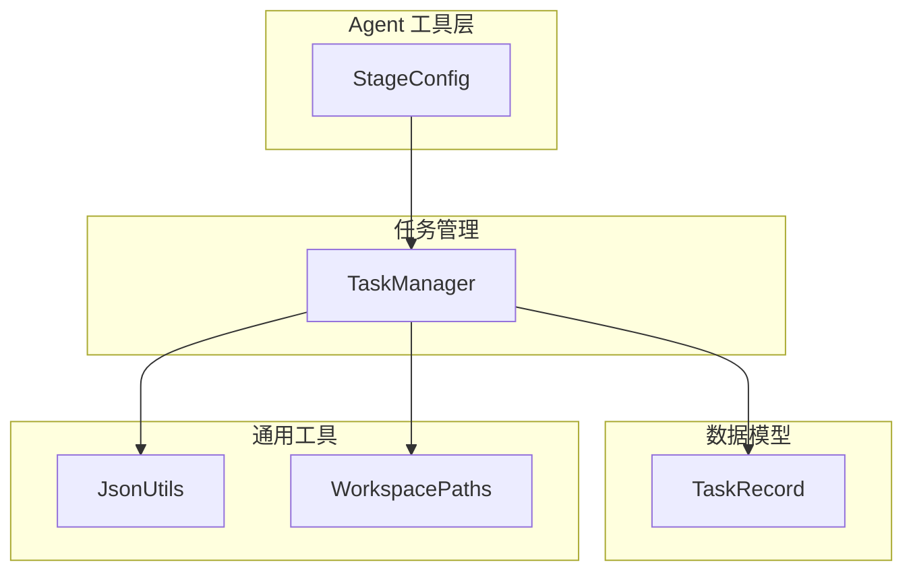
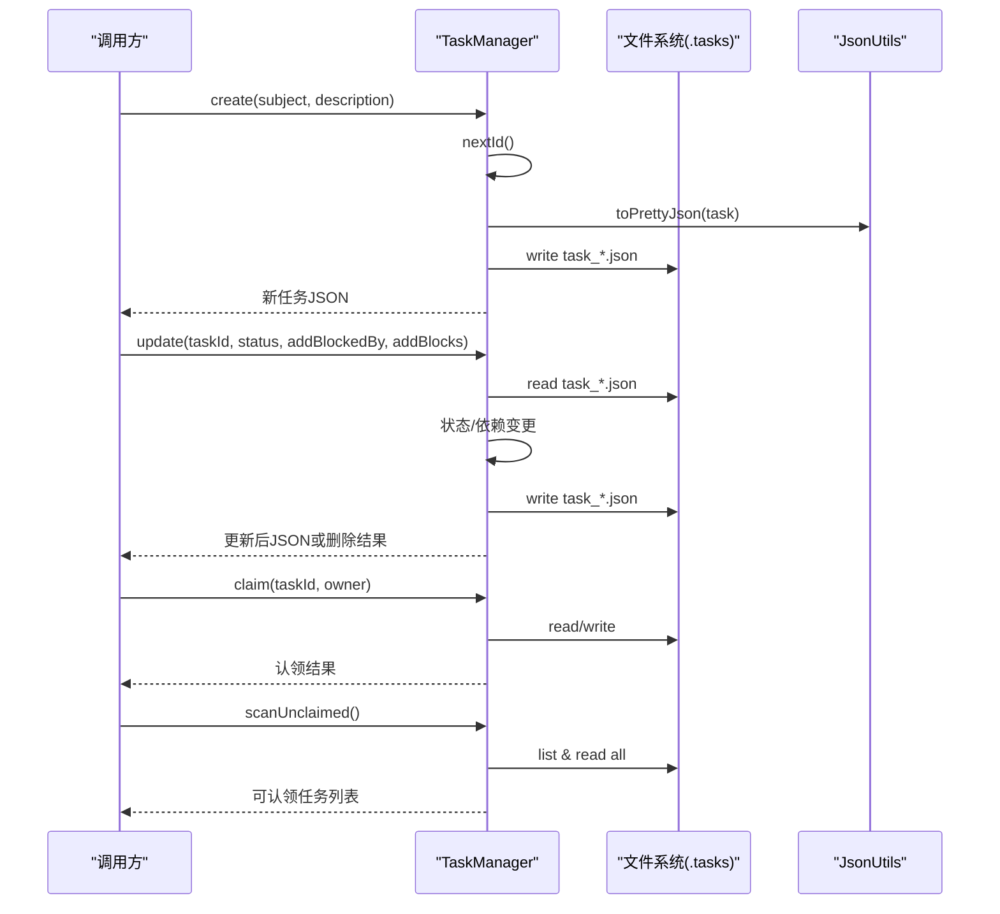
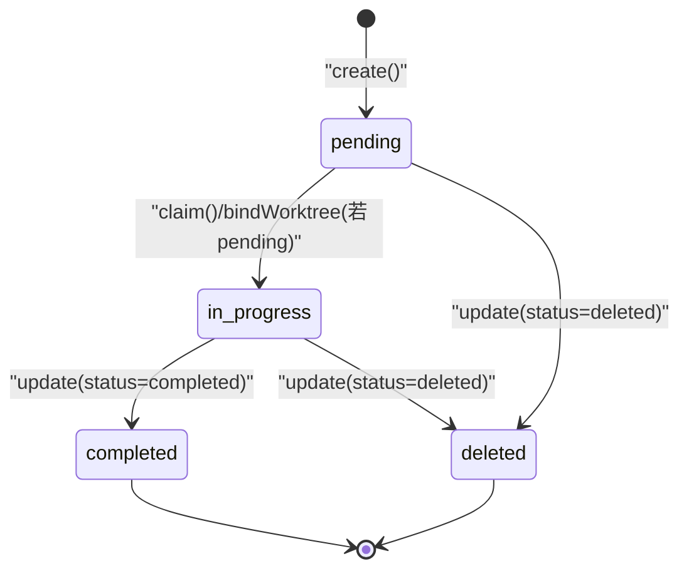
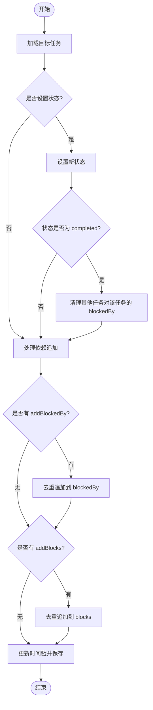
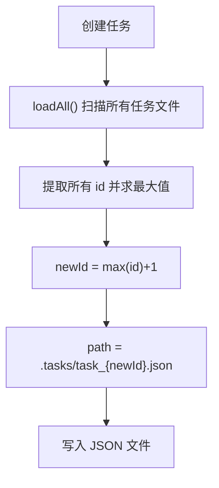
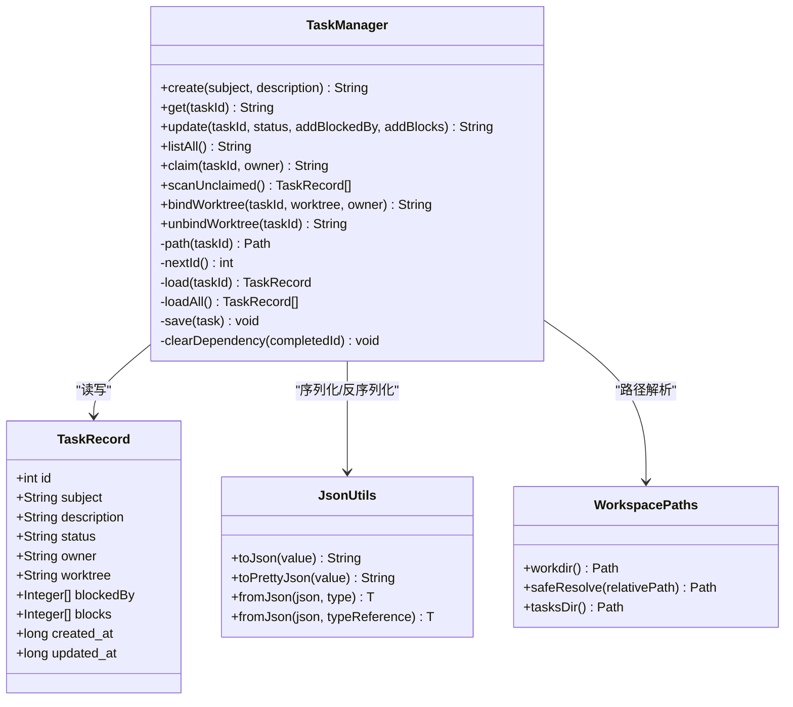
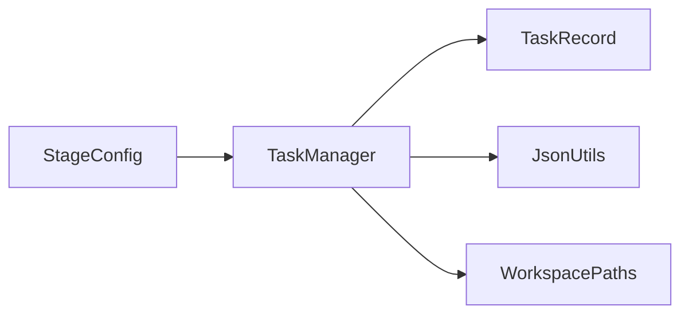

# 任务管理器

<cite>
**本文引用的文件**
- [TaskManager.java](file://src/main/java/com/learnclaudecode/tasks/TaskManager.java)
- [TaskRecord.java](file://src/main/java/com/learnclaudecode/model/TaskRecord.java)
- [JsonUtils.java](file://src/main/java/com/learnclaudecode/common/JsonUtils.java)
- [WorkspacePaths.java](file://src/main/java/com/learnclaudecode/common/WorkspacePaths.java)
- [StageConfig.java](file://src/main/java/com/learnclaudecode/agents/StageConfig.java)
</cite>

## 目录
1. [简介](#简介)
2. [项目结构](#项目结构)
3. [核心组件](#核心组件)
4. [架构总览](#架构总览)
5. [详细组件分析](#详细组件分析)
6. [依赖关系分析](#依赖关系分析)
7. [性能与并发特性](#性能与并发特性)
8. [故障排查指南](#故障排查指南)
9. [结论](#结论)
10. [附录：API 参考](#附录api-参考)

## 简介
本文件面向任务管理器的设计与实现，重点围绕 TaskManager 类展开，系统阐述任务的完整生命周期（创建、认领、更新、完成、删除）、状态转换规则、依赖关系管理（blockedBy/blocks）、基于 JSON 文件的持久化策略与并发安全机制，并提供完整的 API 参考与使用示例说明。该任务系统以“每个任务一个 JSON 文件”的简单而稳健的方式，支撑多 Agent 协作场景下的任务编排与追踪。

## 项目结构
任务管理器位于 tasks 包中，核心由 TaskManager 负责业务逻辑；数据模型在 model 包中的 TaskRecord；JSON 序列化通过 common 包的 JsonUtils；工作区路径由 WorkspacePaths 提供；Agent 工具层通过 StageConfig 暴露任务相关工具方法。

图表来源
- [TaskManager.java:27-338](file://src/main/java/com/learnclaudecode/tasks/TaskManager.java#L27-L338)
- [TaskRecord.java:9-61](file://src/main/java/com/learnclaudecode/model/TaskRecord.java#L9-L61)
- [JsonUtils.java:12-83](file://src/main/java/com/learnclaudecode/common/JsonUtils.java#L12-L83)
- [WorkspacePaths.java:11-150](file://src/main/java/com/learnclaudecode/common/WorkspacePaths.java#L11-L150)
- [StageConfig.java:151-165](file://src/main/java/com/learnclaudecode/agents/StageConfig.java#L151-L165)

章节来源
- [TaskManager.java:27-338](file://src/main/java/com/learnclaudecode/tasks/TaskManager.java#L27-L338)
- [WorkspacePaths.java:77-88](file://src/main/java/com/learnclaudecode/common/WorkspacePaths.java#L77-L88)

## 核心组件
- TaskManager：任务生命周期与状态流转、依赖管理、文件持久化的核心入口。
- TaskRecord：任务数据的持久化模型，包含 ID、主题、描述、状态、拥有者、worktree、依赖列表和时间戳等字段。
- JsonUtils：统一的 JSON 序列化/反序列化工具，确保时间类型和格式化输出的一致性。
- WorkspacePaths：工作区路径与安全解析，提供 .tasks 目录定位。
- StageConfig：为 Agent 暴露 task_create、task_update、task_list、task_get 等工具能力。

章节来源
- [TaskManager.java:27-338](file://src/main/java/com/learnclaudecode/tasks/TaskManager.java#L27-L338)
- [TaskRecord.java:9-61](file://src/main/java/com/learnclaudecode/model/TaskRecord.java#L9-L61)
- [JsonUtils.java:12-83](file://src/main/java/com/learnclaudecode/common/JsonUtils.java#L12-L83)
- [WorkspacePaths.java:77-88](file://src/main/java/com/learnclaudecode/common/WorkspacePaths.java#L77-L88)
- [StageConfig.java:151-165](file://src/main/java/com/learnclaudecode/agents/StageConfig.java#L151-L165)

## 架构总览
任务管理器采用“文件即存储”的轻量架构：每个任务对应一个 JSON 文件，位于工作区的 .tasks 目录下。所有写操作均通过 synchronized 方法保证同一时刻只有一个线程对任务进行读写，避免竞态条件。依赖关系通过 blockedBy 与 blocks 双向维护，并在任务完成时自动清理下游依赖。

图表来源
- [TaskManager.java:51-133](file://src/main/java/com/learnclaudecode/tasks/TaskManager.java#L51-L133)
- [TaskManager.java:168-197](file://src/main/java/com/learnclaudecode/tasks/TaskManager.java#L168-L197)
- [TaskManager.java:276-322](file://src/main/java/com/learnclaudecode/tasks/TaskManager.java#L276-L322)
- [JsonUtils.java:23-83](file://src/main/java/com/learnclaudecode/common/JsonUtils.java#L23-L83)

## 详细组件分析

### 任务生命周期与状态转换
- 初始状态：创建任务时默认状态为 pending。
- 认领：claim 将任务状态置为 in_progress，并记录 owner。
- 完成：update 将状态置为 completed 时，会触发依赖清理，移除其他任务对该任务的 blockedBy 依赖。
- 删除：update 将状态置为 deleted 时，直接删除任务文件，不再保存 JSON。
- 绑定 worktree：bindWorktree 若原状态为 pending，则推进为 in_progress；unbindWorktree 仅清除 worktree 关联。

图表来源
- [TaskManager.java:51-61](file://src/main/java/com/learnclaudecode/tasks/TaskManager.java#L51-L61)
- [TaskManager.java:84-133](file://src/main/java/com/learnclaudecode/tasks/TaskManager.java#L84-L133)
- [TaskManager.java:168-175](file://src/main/java/com/learnclaudecode/tasks/TaskManager.java#L168-L175)
- [TaskManager.java:215-235](file://src/main/java/com/learnclaudecode/tasks/TaskManager.java#L215-L235)

章节来源
- [TaskManager.java:51-133](file://src/main/java/com/learnclaudecode/tasks/TaskManager.java#L51-L133)
- [TaskManager.java:168-175](file://src/main/java/com/learnclaudecode/tasks/TaskManager.java#L168-L175)
- [TaskManager.java:215-235](file://src/main/java/com/learnclaudecode/tasks/TaskManager.java#L215-L235)

### 依赖关系管理（blockedBy 与 blocks）
- blockedBy：当前任务的前置依赖 ID 列表。只有这些前置任务完成后，当前任务才适合继续推进。
- blocks：被当前任务阻塞的后续任务 ID 列表，表示当前任务完成后会解除哪些任务的阻塞。
- 依赖追加：update 支持 addBlockedBy 与 addBlocks 去重追加，不覆盖已有依赖。
- 依赖清理：当某任务完成时，会自动遍历所有任务，移除其 blockedBy 中对该已完成任务 ID 的引用，并立即落盘。

图表来源
- [TaskManager.java:84-133](file://src/main/java/com/learnclaudecode/tasks/TaskManager.java#L84-L133)
- [TaskManager.java:329-336](file://src/main/java/com/learnclaudecode/tasks/TaskManager.java#L329-L336)

章节来源
- [TaskManager.java:84-133](file://src/main/java/com/learnclaudecode/tasks/TaskManager.java#L84-L133)
- [TaskManager.java:329-336](file://src/main/java/com/learnclaudecode/tasks/TaskManager.java#L329-L336)

### 任务 ID 生成策略与文件命名规范
- ID 生成：nextId 扫描所有已存在任务，取最大 ID 加一，确保唯一递增。
- 文件命名：每个任务以 task_{id}.json 的形式保存在 .tasks 目录下。
- 路径解析：通过 WorkspacePaths.tasksDir() 获取 .tasks 目录，再 resolve 具体文件名。

图表来源
- [TaskManager.java:266-268](file://src/main/java/com/learnclaudecode/tasks/TaskManager.java#L266-L268)
- [TaskManager.java:257-259](file://src/main/java/com/learnclaudecode/tasks/TaskManager.java#L257-L259)
- [WorkspacePaths.java:77-88](file://src/main/java/com/learnclaudecode/common/WorkspacePaths.java#L77-L88)

章节来源
- [TaskManager.java:257-268](file://src/main/java/com/learnclaudecode/tasks/TaskManager.java#L257-L268)
- [WorkspacePaths.java:77-88](file://src/main/java/com/learnclaudecode/common/WorkspacePaths.java#L77-L88)

### 持久化策略与并发安全
- 持久化：每个任务是一个独立的 JSON 文件，读取与写入通过 Files.readString/writeString 完成，统一使用 UTF-8 编码。
- 并发安全：TaskManager 的所有公开方法均为 synchronized，确保同一时刻只有一个线程执行任务读/写流程，避免状态覆盖与依赖不一致。
- 依赖一致性：任务完成时清理依赖后立即 save，确保多个 Agent 读到一致的状态。

图表来源
- [TaskManager.java:27-338](file://src/main/java/com/learnclaudecode/tasks/TaskManager.java#L27-L338)
- [TaskRecord.java:9-61](file://src/main/java/com/learnclaudecode/model/TaskRecord.java#L9-L61)
- [JsonUtils.java:12-83](file://src/main/java/com/learnclaudecode/common/JsonUtils.java#L12-L83)
- [WorkspacePaths.java:11-150](file://src/main/java/com/learnclaudecode/common/WorkspacePaths.java#L11-L150)

章节来源
- [TaskManager.java:27-338](file://src/main/java/com/learnclaudecode/tasks/TaskManager.java#L27-L338)
- [JsonUtils.java:12-83](file://src/main/java/com/learnclaudecode/common/JsonUtils.java#L12-L83)
- [WorkspacePaths.java:11-150](file://src/main/java/com/learnclaudecode/common/WorkspacePaths.java#L11-L150)

## 依赖关系分析
- 模块耦合：TaskManager 强依赖 TaskRecord（数据模型）、JsonUtils（序列化）、WorkspacePaths（路径）。StageConfig 通过工具注册间接依赖 TaskManager。
- 外部依赖：Jackson ObjectMapper 用于 JSON 处理；Java NIO 用于文件 IO。
- 潜在风险：文件 IO 异常需妥善捕获；并发访问通过 synchronized 控制，但跨进程共享仍需考虑文件系统锁或分布式协调（当前设计为单进程内并发安全）。

图表来源
- [StageConfig.java:151-165](file://src/main/java/com/learnclaudecode/agents/StageConfig.java#L151-L165)
- [TaskManager.java:27-338](file://src/main/java/com/learnclaudecode/tasks/TaskManager.java#L27-L338)

章节来源
- [StageConfig.java:151-165](file://src/main/java/com/learnclaudecode/agents/StageConfig.java#L151-L165)
- [TaskManager.java:27-338](file://src/main/java/com/learnclaudecode/tasks/TaskManager.java#L27-L338)

## 性能与并发特性
- 并发安全：所有公开方法使用 synchronized 关键字，确保同一时刻只有一个线程执行任务读/写，避免状态覆盖与依赖不一致。
- I/O 成本：每次更新都会读取并写入单个 JSON 文件；任务数量较大时，listAll/scanUnclaimed 会全量扫描 .tasks 目录，存在线性复杂度 O(n)。
- 优化建议：
  - 对于高频查询场景，可在内存中维护轻量索引（如按状态、owner 索引），减少全量扫描。
  - 批量更新时可合并多次 I/O，降低磁盘写入次数。
  - 大文件 JSON 可考虑分片或增量更新策略。

[本节为通用性能讨论，不直接分析具体文件]

## 故障排查指南
- 任务不存在：get/load 时若文件不存在，抛出非法参数异常。检查任务 ID 是否正确，确认任务已被创建且未被删除。
- 删除失败：update 设置为 deleted 时删除文件失败会抛出非法状态异常。检查文件系统权限与路径有效性。
- 读取/写入失败：I/O 异常会被包装为非法状态异常。检查磁盘空间、文件句柄与权限。
- 依赖不一致：任务完成后依赖清理应立即落盘；若发现依赖未清理，检查是否存在并发写入绕过 synchronized 的情况。

章节来源
- [TaskManager.java:276-322](file://src/main/java/com/learnclaudecode/tasks/TaskManager.java#L276-L322)
- [TaskManager.java:84-133](file://src/main/java/com/learnclaudecode/tasks/TaskManager.java#L84-L133)

## 结论
TaskManager 以简洁的文件持久化方案实现了任务的全生命周期管理与依赖关系控制，并通过 synchronized 保证并发安全。其设计易于理解与维护，适用于多 Agent 协作场景下的任务编排。结合 StageConfig 暴露的工具接口，Agent 可以方便地创建、查看、更新与认领任务，形成闭环的任务管理系统。

[本节为总结性内容，不直接分析具体文件]

## 附录：API 参考

- create(subject, description)
  - 功能：创建新任务，初始状态为 pending。
  - 参数：subject（字符串）、description（字符串，可为空）。
  - 返回：新任务的格式化 JSON。
  - 示例：调用后会在 .tasks 目录下生成 task_{id}.json。

- get(taskId)
  - 功能：获取指定任务的详情。
  - 参数：taskId（整数）。
  - 返回：任务 JSON。
  - 注意：任务不存在会抛出非法参数异常。

- update(taskId, status, addBlockedBy, addBlocks)
  - 功能：更新任务状态与依赖关系。
  - 参数：
    - taskId（整数）
    - status（字符串，可选）：支持 pending、in_progress、completed、deleted。
    - addBlockedBy（整数列表，可选）：新增前置依赖。
    - addBlocks（整数列表，可选）：新增被当前任务阻塞的后续任务。
  - 行为：
    - 若 status=completed：自动清理其他任务对该任务的 blockedBy 依赖。
    - 若 status=deleted：直接删除任务文件并返回删除结果。
  - 返回：更新后的任务 JSON 或删除结果。

- listAll()
  - 功能：列出所有任务的看板视图。
  - 返回：人类可读的任务列表文本。

- claim(taskId, owner)
  - 功能：认领任务，将状态设为 in_progress 并记录 owner。
  - 参数：taskId（整数）、owner（字符串）。
  - 返回：认领结果消息。

- scanUnclaimed()
  - 功能：扫描当前可立即认领的任务。
  - 条件：状态为 pending、owner 为空、blockedBy 为空。
  - 返回：可认领任务列表。

- bindWorktree(taskId, worktree, owner)
  - 功能：将任务绑定到指定 worktree，若原状态为 pending 则推进为 in_progress。
  - 参数：taskId（整数）、worktree（字符串）、owner（可选字符串）。
  - 返回：更新后的任务 JSON。

- unbindWorktree(taskId)
  - 功能：解除任务与 worktree 的绑定。
  - 参数：taskId（整数）。
  - 返回：更新后的任务 JSON。

章节来源
- [TaskManager.java:51-133](file://src/main/java/com/learnclaudecode/tasks/TaskManager.java#L51-L133)
- [TaskManager.java:168-197](file://src/main/java/com/learnclaudecode/tasks/TaskManager.java#L168-L197)
- [TaskManager.java:215-249](file://src/main/java/com/learnclaudecode/tasks/TaskManager.java#L215-L249)
- [StageConfig.java:151-165](file://src/main/java/com/learnclaudecode/agents/StageConfig.java#L151-L165)