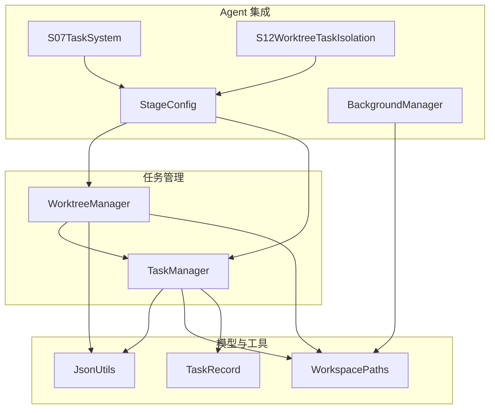
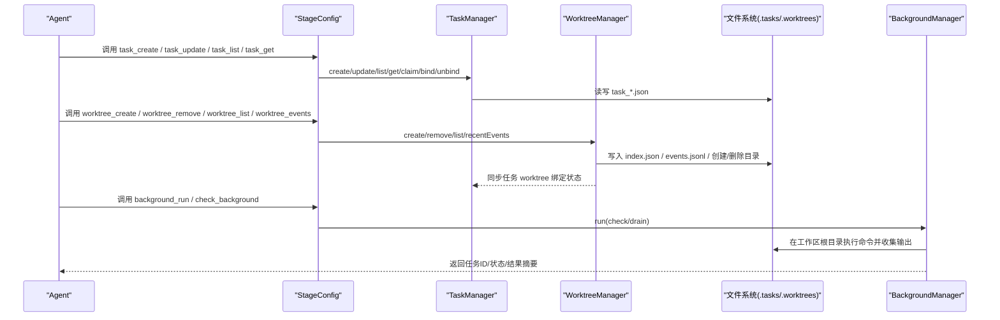
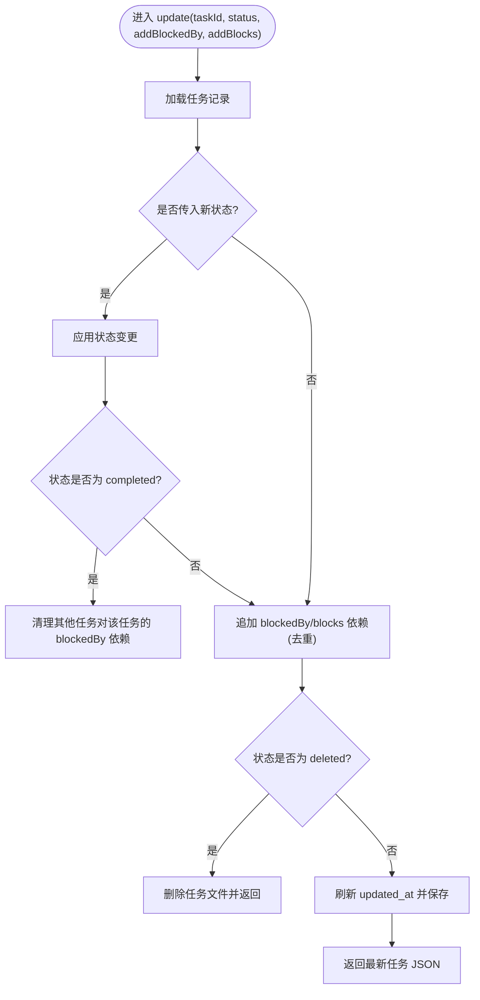
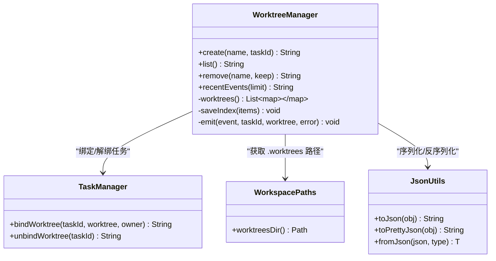
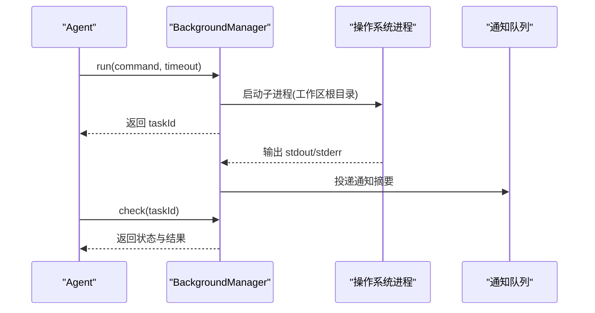
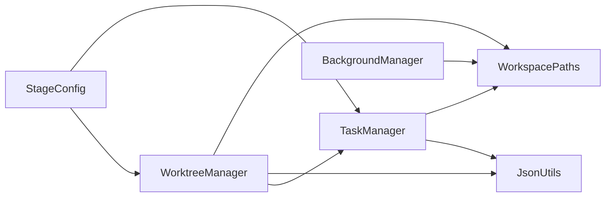

# 任务管理系统

<cite>
**本文引用的文件**
- [TaskManager.java](file://src/main/java/com/learnclaudecode/tasks/TaskManager.java)
- [WorktreeManager.java](file://src/main/java/com/learnclaudecode/tasks/WorktreeManager.java)
- [TaskRecord.java](file://src/main/java/com/learnclaudecode/model/TaskRecord.java)
- [WorkspacePaths.java](file://src/main/java/com/learnclaudecode/common/WorkspacePaths.java)
- [JsonUtils.java](file://src/main/java/com/learnclaudecode/common/JsonUtils.java)
- [StageConfig.java](file://src/main/java/com/learnclaudecode/agents/StageConfig.java)
- [S07TaskSystem.java](file://src/main/java/com/learnclaudecode/agents/S07TaskSystem.java)
- [S12WorktreeTaskIsolation.java](file://src/main/java/com/learnclaudecode/agents/S12WorktreeTaskIsolation.java)
- [BackgroundManager.java](file://src/main/java/com/learnclaudecode/background/BackgroundManager.java)
</cite>

## 目录
1. [简介](#简介)
2. [项目结构](#项目结构)
3. [核心组件](#核心组件)
4. [架构总览](#架构总览)
5. [详细组件分析](#详细组件分析)
6. [依赖关系分析](#依赖关系分析)
7. [性能与并发特性](#性能与并发特性)
8. [故障排查指南](#故障排查指南)
9. [结论](#结论)
10. [附录：API 参考与使用示例](#附录api-参考与使用示例)

## 简介
本系统提供面向多 Agent 协作的任务管理能力，包括任务的创建、跟踪、生命周期管理与状态转换；通过 WorktreeManager 实现任务间的工作树隔离，确保不同任务在独立目录中执行，避免上下文污染与文件冲突；同时提供后台异步任务能力，支持长耗时命令的异步执行与结果通知。数据持久化采用轻量 JSON 文件存储，便于跨进程共享与审计。

## 项目结构
- 任务管理位于 tasks 包：TaskManager 负责任务板（创建、查询、更新、认领、依赖清理、看板输出），WorktreeManager 负责工作树隔离（创建/删除/事件记录/索引维护）。
- 模型位于 model 包：TaskRecord 定义任务的数据结构与字段语义。
- 公共工具位于 common 包：WorkspacePaths 提供安全路径解析与工作区子目录访问；JsonUtils 统一 JSON 序列化/反序列化。
- 阶段配置位于 agents 包：StageConfig 暴露任务与工作树相关的工具接口（task_create、task_update、task_list、task_get、worktree_* 等），并通过 S07/S12 入口演示用法。
- 后台任务位于 background 包：BackgroundManager 提供异步执行与通知队列，配合任务系统完成长耗时操作。

图表来源
- [TaskManager.java:1-338](file://src/main/java/com/learnclaudecode/tasks/TaskManager.java#L1-L338)
- [WorktreeManager.java:1-245](file://src/main/java/com/learnclaudecode/tasks/WorktreeManager.java#L1-L245)
- [TaskRecord.java:1-62](file://src/main/java/com/learnclaudecode/model/TaskRecord.java#L1-L62)
- [WorkspacePaths.java:1-150](file://src/main/java/com/learnclaudecode/common/WorkspacePaths.java#L1-L150)
- [JsonUtils.java:1-83](file://src/main/java/com/learnclaudecode/common/JsonUtils.java#L1-L83)
- [StageConfig.java:151-244](file://src/main/java/com/learnclaudecode/agents/StageConfig.java#L151-L244)
- [S07TaskSystem.java:1-13](file://src/main/java/com/learnclaudecode/agents/S07TaskSystem.java#L1-L13)
- [S12WorktreeTaskIsolation.java:1-13](file://src/main/java/com/learnclaudecode/agents/S12WorktreeTaskIsolation.java#L1-L13)
- [BackgroundManager.java:1-160](file://src/main/java/com/learnclaudecode/background/BackgroundManager.java#L1-L160)

章节来源
- [TaskManager.java:1-338](file://src/main/java/com/learnclaudecode/tasks/TaskManager.java#L1-L338)
- [WorktreeManager.java:1-245](file://src/main/java/com/learnclaudecode/tasks/WorktreeManager.java#L1-L245)
- [TaskRecord.java:1-62](file://src/main/java/com/learnclaudecode/model/TaskRecord.java#L1-L62)
- [WorkspacePaths.java:1-150](file://src/main/java/com/learnclaudecode/common/WorkspacePaths.java#L1-L150)
- [JsonUtils.java:1-83](file://src/main/java/com/learnclaudecode/common/JsonUtils.java#L1-L83)
- [StageConfig.java:151-244](file://src/main/java/com/learnclaudecode/agents/StageConfig.java#L151-L244)
- [S07TaskSystem.java:1-13](file://src/main/java/com/learnclaudecode/agents/S07TaskSystem.java#L1-L13)
- [S12WorktreeTaskIsolation.java:1-13](file://src/main/java/com/learnclaudecode/agents/S12WorktreeTaskIsolation.java#L1-L13)
- [BackgroundManager.java:1-160](file://src/main/java/com/learnclaudecode/background/BackgroundManager.java#L1-L160)

## 核心组件
- TaskManager：基于文件的任务板，提供任务创建、详情获取、状态更新、依赖管理、认领、可认领扫描、工作树绑定/解绑、看板输出等能力。所有写操作均同步临界区保护，保证并发安全。
- WorktreeManager：维护 .worktrees 下的索引与事件日志，为每个任务创建独立目录作为隔离工作空间，并在索引中记录 worktree 元信息，同时联动 TaskManager 更新任务绑定关系。
- TaskRecord：任务数据模型，包含 ID、主题、描述、状态、拥有者、关联 worktree、前置依赖 blockedBy、被阻塞 blocks、创建与更新时间戳。
- WorkspacePaths：工作区路径工具，提供安全路径解析与常用目录（.tasks、.team、skills、.transcripts、.worktrees）访问。
- JsonUtils：统一的 JSON 序列化/反序列化工具，封装 Jackson ObjectMapper。
- StageConfig：按阶段暴露工具接口，包括任务与工作树相关 API，供 Agent 调用。
- BackgroundManager：后台任务管理器，提供异步执行、超时控制、结果通知与状态查询。

章节来源
- [TaskManager.java:1-338](file://src/main/java/com/learnclaudecode/tasks/TaskManager.java#L1-L338)
- [WorktreeManager.java:1-245](file://src/main/java/com/learnclaudecode/tasks/WorktreeManager.java#L1-L245)
- [TaskRecord.java:1-62](file://src/main/java/com/learnclaudecode/model/TaskRecord.java#L1-L62)
- [WorkspacePaths.java:1-150](file://src/main/java/com/learnclaudecode/common/WorkspacePaths.java#L1-L150)
- [JsonUtils.java:1-83](file://src/main/java/com/learnclaudecode/common/JsonUtils.java#L1-L83)
- [StageConfig.java:151-244](file://src/main/java/com/learnclaudecode/agents/StageConfig.java#L151-L244)
- [BackgroundManager.java:1-160](file://src/main/java/com/learnclaudecode/background/BackgroundManager.java#L1-L160)

## 架构总览
任务系统以“文件即数据库”的方式实现轻量级持久化，结合工作树隔离机制，使多个任务可以在互不干扰的目录下并行执行。Agent 通过 StageConfig 暴露的工具调用 TaskManager 与 WorktreeManager，完成任务规划、状态流转与环境隔离。后台任务用于处理长耗时命令，并通过通知队列将结果回传给主循环。

图表来源
- [StageConfig.java:151-244](file://src/main/java/com/learnclaudecode/agents/StageConfig.java#L151-L244)
- [TaskManager.java:1-338](file://src/main/java/com/learnclaudecode/tasks/TaskManager.java#L1-L338)
- [WorktreeManager.java:1-245](file://src/main/java/com/learnclaudecode/tasks/WorktreeManager.java#L1-L245)
- [BackgroundManager.java:1-160](file://src/main/java/com/learnclaudecode/background/BackgroundManager.java#L1-L160)

## 详细组件分析

### TaskManager：任务板与状态机
- 任务生命周期与状态转换
  - 初始状态：pending（新建任务默认 pending）
  - 认领或绑定 worktree：in_progress
  - 完成：completed（完成后自动清理其他任务对它的 blockedBy 依赖）
  - 删除：deleted（直接删除任务文件）
- 依赖管理
  - blockedBy：当前任务的前置依赖列表
  - blocks：当前任务完成后会解除哪些后续任务的阻塞
  - 更新时追加依赖去重，避免重复写入
- 并发控制
  - 所有写方法加 synchronized，保证同一时刻只有一个线程修改任务文件或依赖关系
- 持久化策略
  - 每个任务一个 JSON 文件，命名规则 task_<id>.json，存放于 .tasks 目录
  - 通过 nextId 计算下一个可用 ID，基于已有任务的最大 ID + 1
  - loadAll 扫描 .tasks 目录并按文件名排序，读取为 TaskRecord 列表
- 工作树绑定
  - bindWorktree：将任务与 worktree 名称绑定，若原状态为 pending 则推进为 in_progress
  - unbindWorktree：清空 worktree 字段并更新时间戳

图表来源
- [TaskManager.java:84-133](file://src/main/java/com/learnclaudecode/tasks/TaskManager.java#L84-L133)
- [TaskManager.java:329-336](file://src/main/java/com/learnclaudecode/tasks/TaskManager.java#L329-L336)

章节来源
- [TaskManager.java:44-133](file://src/main/java/com/learnclaudecode/tasks/TaskManager.java#L44-L133)
- [TaskManager.java:135-197](file://src/main/java/com/learnclaudecode/tasks/TaskManager.java#L135-L197)
- [TaskManager.java:199-249](file://src/main/java/com/learnclaudecode/tasks/TaskManager.java#L199-L249)
- [TaskManager.java:251-336](file://src/main/java/com/learnclaudecode/tasks/TaskManager.java#L251-L336)

### WorktreeManager：工作树隔离与资源管理
- 隔离机制
  - 在 .worktrees/<name> 下创建独立目录，作为任务的工作空间
  - 索引文件 index.json 维护 worktree 清单（名称、路径、分支、关联任务 ID、状态）
  - 事件日志 events.jsonl 记录生命周期事件（创建、移除等），便于审计与回溯
- 与任务系统的联动
  - create：创建目录、写入索引、调用 TaskManager.bindWorktree 绑定任务
  - remove：可选保留目录文件、从索引删除、调用 TaskManager.unbindWorktree 解绑任务、记录移除事件
- 并发与一致性
  - 所有公开方法加 synchronized，保证索引与事件的原子性
  - 事件追加采用 APPEND 模式，避免覆盖历史

图表来源
- [WorktreeManager.java:1-245](file://src/main/java/com/learnclaudecode/tasks/WorktreeManager.java#L1-L245)
- [TaskManager.java:199-249](file://src/main/java/com/learnclaudecode/tasks/TaskManager.java#L199-L249)
- [WorkspacePaths.java:138-148](file://src/main/java/com/learnclaudecode/common/WorkspacePaths.java#L138-L148)
- [JsonUtils.java:1-83](file://src/main/java/com/learnclaudecode/common/JsonUtils.java#L1-L83)

章节来源
- [WorktreeManager.java:60-166](file://src/main/java/com/learnclaudecode/tasks/WorktreeManager.java#L60-L166)
- [WorktreeManager.java:168-245](file://src/main/java/com/learnclaudecode/tasks/WorktreeManager.java#L168-L245)

### TaskRecord：数据模型与持久化策略
- 字段说明
  - id：唯一标识
  - subject：任务主题
  - description：详细描述
  - status：状态（pending/in_progress/completed/deleted）
  - owner：认领者
  - worktree：关联的工作树名称
  - blockedBy：前置依赖 ID 列表
  - blocks：被当前任务阻塞的后续任务 ID 列表
  - created_at/updated_at：时间戳（秒）
- 持久化
  - 通过 JsonUtils 序列化为 JSON 字符串，写入 .tasks/task_<id>.json
  - 读取时反序列化为 TaskRecord，便于业务逻辑处理

章节来源
- [TaskRecord.java:1-62](file://src/main/java/com/learnclaudecode/model/TaskRecord.java#L1-L62)
- [TaskManager.java:251-322](file://src/main/java/com/learnclaudecode/tasks/TaskManager.java#L251-L322)

### 后台任务与回调机制
- 异步执行
  - BackgroundManager.run 启动后台命令，分配唯一 taskId，立即返回，不阻塞主循环
  - 使用单线程执行器提交任务，限制并发度，避免资源争用
- 超时与错误处理
  - 设置超时时间，超时后强制终止进程，标记为 timeout
  - 异常统一捕获，标记为 error，并将异常信息写入结果字段
- 通知与查询
  - 执行完成后向 notifications 队列投递摘要通知，主循环可 drain 获取
  - check 支持按 taskId 查询或列出全部任务状态

图表来源
- [BackgroundManager.java:36-123](file://src/main/java/com/learnclaudecode/background/BackgroundManager.java#L36-L123)
- [BackgroundManager.java:125-158](file://src/main/java/com/learnclaudecode/background/BackgroundManager.java#L125-L158)

章节来源
- [BackgroundManager.java:36-123](file://src/main/java/com/learnclaudecode/background/BackgroundManager.java#L36-L123)
- [BackgroundManager.java:125-158](file://src/main/java/com/learnclaudecode/background/BackgroundManager.java#L125-L158)

## 依赖关系分析
- TaskManager 依赖 WorkspacePaths 获取 .tasks 目录，依赖 JsonUtils 进行 JSON 序列化/反序列化
- WorktreeManager 依赖 WorkspacePaths 获取 .worktrees 目录，依赖 JsonUtils 维护索引与事件，依赖 TaskManager 同步任务绑定状态
- StageConfig 暴露工具接口，间接调用 TaskManager 与 WorktreeManager
- BackgroundManager 依赖 WorkspacePaths 指定工作区根目录执行命令，并通过通知队列与上层交互

图表来源
- [TaskManager.java:1-338](file://src/main/java/com/learnclaudecode/tasks/TaskManager.java#L1-L338)
- [WorktreeManager.java:1-245](file://src/main/java/com/learnclaudecode/tasks/WorktreeManager.java#L1-L245)
- [StageConfig.java:151-244](file://src/main/java/com/learnclaudecode/agents/StageConfig.java#L151-L244)
- [BackgroundManager.java:1-160](file://src/main/java/com/learnclaudecode/background/BackgroundManager.java#L1-L160)

章节来源
- [TaskManager.java:1-338](file://src/main/java/com/learnclaudecode/tasks/TaskManager.java#L1-L338)
- [WorktreeManager.java:1-245](file://src/main/java/com/learnclaudecode/tasks/WorktreeManager.java#L1-L245)
- [StageConfig.java:151-244](file://src/main/java/com/learnclaudecode/agents/StageConfig.java#L151-L244)
- [BackgroundManager.java:1-160](file://src/main/java/com/learnclaudecode/background/BackgroundManager.java#L1-L160)

## 性能与并发特性
- 并发控制
  - TaskManager 与 WorktreeManager 的公开方法均加 synchronized，保证同一时刻只有一个线程修改任务文件或索引
  - BackgroundManager 使用单线程执行器，限制后台任务并发度，避免过多进程占用资源
- I/O 与持久化
  - 任务文件与索引文件采用 JSON 文本，适合小中型规模；大文件扫描可能带来一定开销
  - 事件日志采用追加模式，减少写放大
- 优化建议
  - 对于大规模任务场景，可考虑引入轻量索引或缓存层，减少全量扫描
  - 对频繁读的路径（如 listAll、worktrees）可增加内存缓存并设置失效策略
  - 后台任务可根据负载动态调整线程池大小

[本节为通用性能讨论，不直接分析具体文件]

## 故障排查指南
- 任务不存在
  - 现象：get 或 update 时报错
  - 原因：任务文件不存在或 ID 无效
  - 处理：检查 .tasks 目录是否存在对应 task_<id>.json，确认 ID 生成逻辑
- 删除失败
  - 现象：update 状态为 deleted 但文件未删除
  - 原因：IO 异常或权限不足
  - 处理：检查文件系统权限与磁盘空间，重试或删除
- 依赖未清理
  - 现象：任务完成后仍有其他任务显示被阻塞
  - 原因：clearDependency 未触发或并发竞争
  - 处理：确认状态更新流程，检查是否有并发修改导致覆盖
- 工作树事件缺失
  - 现象：recentEvents 返回空或较少
  - 原因：events.jsonl 未正确追加或读取失败
  - 处理：检查 .worktrees/events.jsonl 是否存在且可写，确认 emit 调用
- 后台任务超时
  - 现象：check 返回 timeout
  - 原因：命令执行超过设定超时时间
  - 处理：增加超时时间或优化命令执行效率

章节来源
- [TaskManager.java:69-103](file://src/main/java/com/learnclaudecode/tasks/TaskManager.java#L69-L103)
- [WorktreeManager.java:175-184](file://src/main/java/com/learnclaudecode/tasks/WorktreeManager.java#L175-L184)
- [BackgroundManager.java:68-123](file://src/main/java/com/learnclaudecode/background/BackgroundManager.java#L68-L123)

## 结论
该任务管理系统以轻量文件存储为基础，提供了完整的任务生命周期管理与工作树隔离能力，并通过后台任务机制支持异步执行与结果通知。其设计简洁、易于扩展，适合在多 Agent 协作场景中实现任务规划、状态追踪与环境隔离。未来可在大规模场景下引入索引与缓存优化，提升性能与可扩展性。

[本节为总结性内容，不直接分析具体文件]

## 附录：API 参考与使用示例

### 任务管理 API（由 StageConfig 暴露）
- task_create
  - 功能：创建新任务
  - 输入：subject、description
  - 输出：任务 JSON
  - 行为：生成唯一 ID，初始状态 pending，写入 .tasks/task_<id>.json
- task_update
  - 功能：更新任务状态与依赖
  - 输入：task_id、status、addBlockedBy、addBlocks
  - 输出：更新后的任务 JSON 或删除结果
  - 行为：状态为 completed 时清理依赖；状态为 deleted 时删除文件
- task_list
  - 功能：列出所有任务看板视图
  - 输出：格式化文本
- task_get
  - 功能：获取指定任务详情
  - 输入：task_id
  - 输出：任务 JSON

章节来源
- [StageConfig.java:151-165](file://src/main/java/com/learnclaudecode/agents/StageConfig.java#L151-L165)
- [TaskManager.java:44-133](file://src/main/java/com/learnclaudecode/tasks/TaskManager.java#L44-L133)

### 工作树管理 API（由 StageConfig 暴露）
- worktree_create
  - 功能：创建任务绑定的工作树车道
  - 输入：name、task_id
  - 输出：worktree 信息 JSON
  - 行为：创建 .worktrees/<name> 目录，写入 index.json，绑定任务
- worktree_list
  - 功能：列出所有 worktree
  - 输出：worktree 列表 JSON
- worktree_remove
  - 功能：移除 worktree
  - 输入：name、keep
  - 输出：移除结果
  - 行为：可选保留目录文件，从索引删除，解绑任务，记录事件
- worktree_events
  - 功能：查看最近的生命周期事件
  - 输入：limit
  - 输出：事件数组 JSON

章节来源
- [StageConfig.java:234-244](file://src/main/java/com/learnclaudecode/agents/StageConfig.java#L234-L244)
- [WorktreeManager.java:60-166](file://src/main/java/com/learnclaudecode/tasks/WorktreeManager.java#L60-L166)
- [WorktreeManager.java:168-184](file://src/main/java/com/learnclaudecode/tasks/WorktreeManager.java#L168-L184)

### 后台任务 API（由 StageConfig 暴露）
- background_run
  - 功能：在后台线程执行命令
  - 输入：command、timeout
  - 输出：任务启动结果（包含 taskId）
- check_background
  - 功能：查询后台任务状态
  - 输入：task_id
  - 输出：任务状态与结果

章节来源
- [StageConfig.java:172-179](file://src/main/java/com/learnclaudecode/agents/StageConfig.java#L172-L179)
- [BackgroundManager.java:36-123](file://src/main/java/com/learnclaudecode/background/BackgroundManager.java#L36-L123)
- [BackgroundManager.java:125-158](file://src/main/java/com/learnclaudecode/background/BackgroundManager.java#L125-L158)

### 使用示例
- 创建任务并绑定工作树
  - 步骤：调用 task_create 创建任务；调用 worktree_create 创建工作树并绑定任务；调用 task_update 更新状态为 in_progress
- 异步执行长耗时命令
  - 步骤：调用 background_run 启动命令；周期性调用 check_background 查询状态；完成后读取结果
- 查看任务看板与工作树事件
  - 步骤：调用 task_list 查看任务状态；调用 worktree_events 查看工作树生命周期事件

章节来源
- [S07TaskSystem.java:1-13](file://src/main/java/com/learnclaudecode/agents/S07TaskSystem.java#L1-L13)
- [S12WorktreeTaskIsolation.java:1-13](file://src/main/java/com/learnclaudecode/agents/S12WorktreeTaskIsolation.java#L1-L13)
- [StageConfig.java:151-244](file://src/main/java/com/learnclaudecode/agents/StageConfig.java#L151-L244)