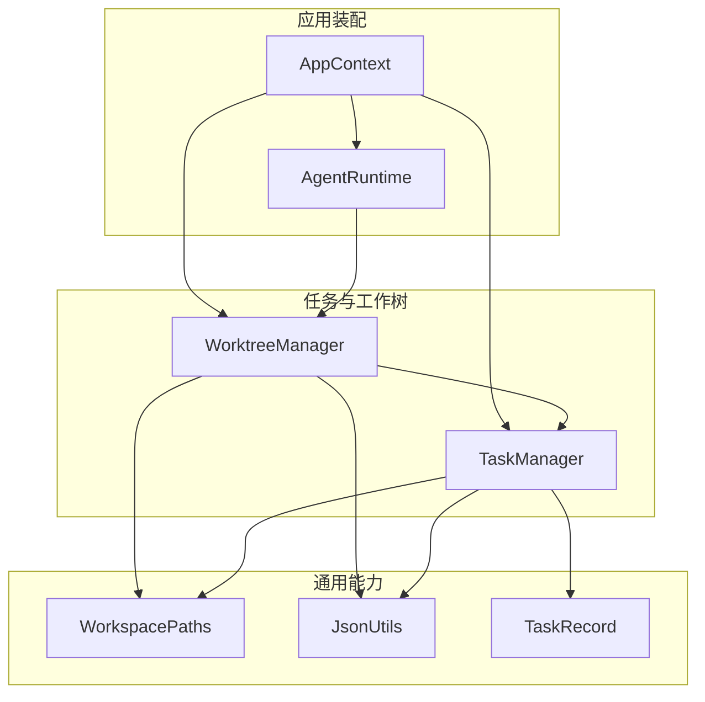
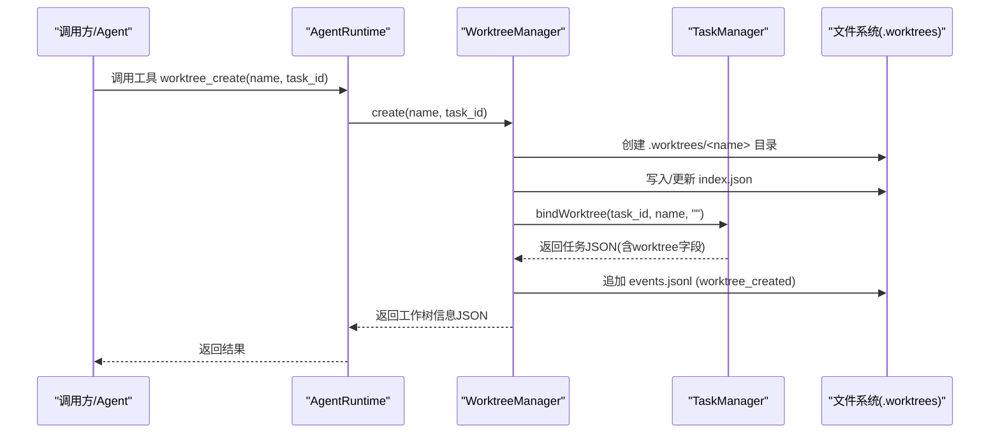
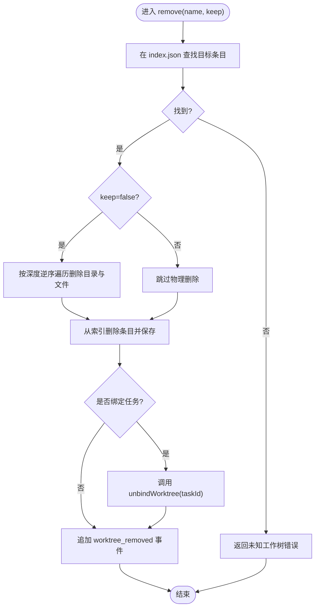
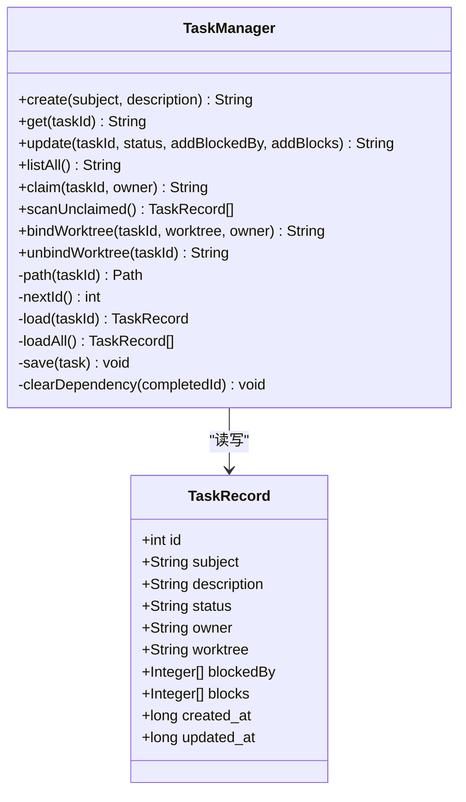
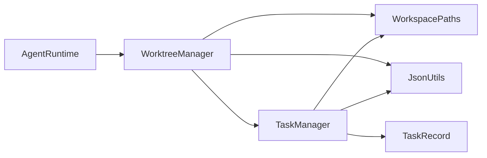

# 工作树管理器

<cite>
**本文引用的文件**
- [WorktreeManager.java](file://src/main/java/com/learnclaudecode/tasks/WorktreeManager.java)
- [TaskManager.java](file://src/main/java/com/learnclaudecode/tasks/TaskManager.java)
- [WorkspacePaths.java](file://src/main/java/com/learnclaudecode/common/WorkspacePaths.java)
- [JsonUtils.java](file://src/main/java/com/learnclaudecode/common/JsonUtils.java)
- [TaskRecord.java](file://src/main/java/com/learnclaudecode/model/TaskRecord.java)
- [AppContext.java](file://src/main/java/com/learnclaudecode/agents/AppContext.java)
- [AgentRuntime.java](file://src/main/java/com/learnclaudecode/agents/AgentRuntime.java)
</cite>

## 目录
1. [简介](#简介)
2. [项目结构](#项目结构)
3. [核心组件](#核心组件)
4. [架构总览](#架构总览)
5. [详细组件分析](#详细组件分析)
6. [依赖关系分析](#依赖关系分析)
7. [性能与并发特性](#性能与并发特性)
8. [故障排查指南](#故障排查指南)
9. [结论](#结论)
10. [附录：API 参考与使用示例](#附录api-参考与使用示例)

## 简介
本文件围绕 WorktreeManager 的实现，系统性说明其如何为任务提供“环境隔离”和“资源管理”。重点包括：
- 工作树的创建、绑定、解绑与销毁流程
- 工作树与任务的关联机制（bindWorktree/unbindWorktree）
- 工作树目录结构与文件系统操作策略
- 多任务并发执行时的隔离机制与冲突解决方案
- 生命周期管理与错误处理
- 在团队协作中的价值与实践建议

## 项目结构
工作树管理器位于 tasks 包中，依赖 common 包的路径工具与 JSON 工具，并与 tasks 包的任务管理器协作。应用装配器 AppContext 负责统一装配这些服务，AgentRuntime 暴露工具调用入口以驱动工作树生命周期。

图表来源
- [AppContext.java:35-58](file://src/main/java/com/learnclaudecode/agents/AppContext.java#L35-L58)
- [AgentRuntime.java:41-90](file://src/main/java/com/learnclaudecode/agents/AgentRuntime.java#L41-L90)
- [WorktreeManager.java:24-58](file://src/main/java/com/learnclaudecode/tasks/WorktreeManager.java#L24-L58)
- [TaskManager.java:27-42](file://src/main/java/com/learnclaudecode/tasks/TaskManager.java#L27-L42)
- [WorkspacePaths.java:11-23](file://src/main/java/com/learnclaudecode/common/WorkspacePaths.java#L11-L23)
- [JsonUtils.java:12-15](file://src/main/java/com/learnclaudecode/common/JsonUtils.java#L12-L15)
- [TaskRecord.java:9-61](file://src/main/java/com/learnclaudecode/model/TaskRecord.java#L9-L61)

章节来源
- [AppContext.java:35-58](file://src/main/java/com/learnclaudecode/agents/AppContext.java#L35-L58)
- [AgentRuntime.java:41-90](file://src/main/java/com/learnclaudecode/agents/AgentRuntime.java#L41-L90)

## 核心组件
- WorktreeManager：维护 .worktrees 下的索引与事件日志，负责工作树的创建、列出、移除与事件记录；通过 TaskManager 同步任务的工作树绑定状态。
- TaskManager：持久化任务记录，提供 bindWorktree/unbindWorktree 等方法，将任务与具体 worktree 名称建立关联。
- WorkspacePaths：集中定义工作区路径，确保所有子目录（如 .tasks、.team、.worktrees）安全、规范地拼接。
- JsonUtils：统一的 JSON 序列化/反序列化能力，用于 index.json 与 events.jsonl 的读写。
- TaskRecord：任务数据模型，包含 worktree 字段，用于记录任务当前绑定的工作树标识。

章节来源
- [WorktreeManager.java:24-58](file://src/main/java/com/learnclaudecode/tasks/WorktreeManager.java#L24-L58)
- [TaskManager.java:27-42](file://src/main/java/com/learnclaudecode/tasks/TaskManager.java#L27-L42)
- [WorkspacePaths.java:11-23](file://src/main/java/com/learnclaudecode/common/WorkspacePaths.java#L11-L23)
- [JsonUtils.java:12-15](file://src/main/java/com/learnclaudecode/common/JsonUtils.java#L12-L15)
- [TaskRecord.java:9-61](file://src/main/java/com/learnclaudecode/model/TaskRecord.java#L9-L61)

## 架构总览
WorktreeManager 作为“工作树协调者”，对外暴露 create/list/remove/recentEvents 等 API；内部通过 WorkspacePaths 定位 .worktrees 根目录，使用 JsonUtils 读写 index.json 与 events.jsonl，并通过 TaskManager 更新任务的工作树绑定状态。AgentRuntime 通过工具映射将外部调用（如 worktree_create）转发到 WorktreeManager。

图表来源
- [AgentRuntime.java:189-230](file://src/main/java/com/learnclaudecode/agents/AgentRuntime.java#L189-L230)
- [WorktreeManager.java:71-99](file://src/main/java/com/learnclaudecode/tasks/WorktreeManager.java#L71-L99)
- [TaskManager.java:215-235](file://src/main/java/com/learnclaudecode/tasks/TaskManager.java#L215-L235)
- [WorkspacePaths.java:138-148](file://src/main/java/com/learnclaudecode/common/WorkspacePaths.java#L138-L148)

## 详细组件分析

### WorktreeManager：工作树生命周期与事件追踪
- 初始化：确保 .worktrees 目录存在，并准备 index.json 与 events.jsonl。
- 创建工作树：
  - 在 .worktrees 下创建独立目录 <name>
  - 构造元数据（name、path、branch、task_id、status），追加到 index.json
  - 调用 TaskManager.bindWorktree 将任务与 worktree 绑定
  - 追加 worktree_created 事件到 events.jsonl
- 列出工作树：读取 index.json 中的 worktrees 列表并返回
- 移除工作树：
  - 从 index.json 删除对应条目
  - 可选删除物理目录（按深度逆序遍历删除）
  - 若该 worktree 绑定了任务，调用 TaskManager.unbindWorktree 解除绑定
  - 追加 worktree_removed 事件
- 事件查询：recentEvents 读取 events.jsonl 末尾若干行，限制最大条数

图表来源
- [WorktreeManager.java:122-166](file://src/main/java/com/learnclaudecode/tasks/WorktreeManager.java#L122-L166)
- [TaskManager.java:243-249](file://src/main/java/com/learnclaudecode/tasks/TaskManager.java#L243-L249)

章节来源
- [WorktreeManager.java:39-99](file://src/main/java/com/learnclaudecode/tasks/WorktreeManager.java#L39-L99)
- [WorktreeManager.java:122-184](file://src/main/java/com/learnclaudecode/tasks/WorktreeManager.java#L122-L184)
- [WorktreeManager.java:193-243](file://src/main/java/com/learnclaudecode/tasks/WorktreeManager.java#L193-L243)

### TaskManager：任务与工作树的绑定/解绑
- bindWorktree：
  - 加载任务记录，设置 worktree 字段
  - 若传入 owner，则同时记录认领者
  - 若任务原状态为 pending，则推进为 in_progress
  - 更新 updated_at 并持久化
- unbindWorktree：
  - 清空 worktree 字段，更新 updated_at 并持久化

图表来源
- [TaskManager.java:51-249](file://src/main/java/com/learnclaudecode/tasks/TaskManager.java#L51-L249)
- [TaskRecord.java:9-61](file://src/main/java/com/learnclaudecode/model/TaskRecord.java#L9-L61)

章节来源
- [TaskManager.java:215-249](file://src/main/java/com/learnclaudecode/tasks/TaskManager.java#L215-L249)
- [TaskRecord.java:9-61](file://src/main/java/com/learnclaudecode/model/TaskRecord.java#L9-L61)

### WorkspacePaths：工作区路径与安全解析
- 提供 workdir、tasksDir、teamDir、inboxDir、skillsDir、transcriptDir、worktreesDir 等路径访问方法
- safeResolve 对相对路径进行规范化与越界检查，防止路径逃逸出工作区

章节来源
- [WorkspacePaths.java:21-49](file://src/main/java/com/learnclaudecode/common/WorkspacePaths.java#L21-L49)
- [WorkspacePaths.java:77-148](file://src/main/java/com/learnclaudecode/common/WorkspacePaths.java#L77-L148)

### AgentRuntime：工具映射与调用入口
- 将模型的工具调用映射到本地实现，其中 worktree_create 会调用 WorktreeManager.create
- 通过 AppContext 装配时注入 WorktreeManager 实例

章节来源
- [AgentRuntime.java:41-90](file://src/main/java/com/learnclaudecode/agents/AgentRuntime.java#L41-L90)
- [AgentRuntime.java:189-230](file://src/main/java/com/learnclaudecode/agents/AgentRuntime.java#L189-L230)
- [AppContext.java:35-58](file://src/main/java/com/learnclaudecode/agents/AppContext.java#L35-L58)

## 依赖关系分析
- WorktreeManager 依赖：
  - WorkspacePaths：获取 .worktrees 根路径
  - TaskManager：同步任务的工作树绑定状态
  - JsonUtils：读写 index.json 与 events.jsonl
- TaskManager 依赖：
  - WorkspacePaths：获取 .tasks 目录
  - JsonUtils：任务记录的序列化/反序列化
  - TaskRecord：任务数据模型
- AgentRuntime 依赖：
  - WorktreeManager：通过工具映射调用工作树创建
  - AppContext：统一装配各服务

图表来源
- [AgentRuntime.java:41-90](file://src/main/java/com/learnclaudecode/agents/AgentRuntime.java#L41-L90)
- [WorktreeManager.java:24-58](file://src/main/java/com/learnclaudecode/tasks/WorktreeManager.java#L24-L58)
- [TaskManager.java:27-42](file://src/main/java/com/learnclaudecode/tasks/TaskManager.java#L27-L42)

章节来源
- [AgentRuntime.java:41-90](file://src/main/java/com/learnclaudecode/agents/AgentRuntime.java#L41-L90)
- [WorktreeManager.java:24-58](file://src/main/java/com/learnclaudecode/tasks/WorktreeManager.java#L24-L58)
- [TaskManager.java:27-42](file://src/main/java/com/learnclaudecode/tasks/TaskManager.java#L27-L42)

## 性能与并发特性
- 线程安全：WorktreeManager 的关键方法（create、list、remove、recentEvents）使用 synchronized 保证同一时刻只有一个线程修改索引或事件日志，避免并发写导致的竞争条件。
- 文件系统操作：
  - 创建目录：Files.createDirectories 幂等创建
  - 删除目录：按深度逆序遍历删除，确保先删文件后删目录
  - 事件追加：events.jsonl 采用 APPEND 模式追加一行 JSON，适合流式读取
- 索引读写：index.json 每次变更整体覆盖写回，简单可靠但非增量更新；适用于轻量级场景
- 事件限制：recentEvents 限制返回条数上限（最大200），避免一次性读取过多事件导致内存压力

[本节为通用性能讨论，不直接分析具体代码片段]

## 故障排查指南
- 初始化失败：
  - 现象：抛出 IllegalStateException，提示无法创建 .worktrees 目录
  - 可能原因：权限不足、磁盘空间不足、路径非法
  - 处理：检查工作区路径与权限，确认磁盘可用空间
- 创建工作树失败：
  - 现象：返回 Error: ... 消息
  - 可能原因：目录创建失败（IO异常）
  - 处理：检查 .worktrees 父目录是否存在且可写
- 移除工作树失败：
  - 现象：忽略 IO 异常，但仍会从索引删除条目
  - 可能原因：部分文件被占用或权限不足
  - 处理：手动清理残留文件或调整权限
- 事件读取为空：
  - 现象：recentEvents 返回 []
  - 可能原因：events.jsonl 不存在或读取失败
  - 处理：确认初始化逻辑已创建 events.jsonl

章节来源
- [WorktreeManager.java:44-57](file://src/main/java/com/learnclaudecode/tasks/WorktreeManager.java#L44-L57)
- [WorktreeManager.java:71-99](file://src/main/java/com/learnclaudecode/tasks/WorktreeManager.java#L71-L99)
- [WorktreeManager.java:122-166](file://src/main/java/com/learnclaudecode/tasks/WorktreeManager.java#L122-L166)
- [WorktreeManager.java:175-184](file://src/main/java/com/learnclaudecode/tasks/WorktreeManager.java#L175-L184)

## 结论
WorktreeManager 通过“目录隔离 + 索引记录 + 事件日志 + 任务绑定”的组合，实现了轻量而实用的工作树管理能力。它在不引入复杂版本控制或数据库的前提下，为多任务并发提供了清晰的环境隔离与资源管理边界。结合 TaskManager 的绑定/解绑机制，系统能够准确跟踪每个任务的工作空间归属，便于审计、恢复与协作。

[本节为总结性内容，不直接分析具体代码片段]

## 附录：API 参考与使用示例

### WorktreeManager API
- create(name, taskId)
  - 功能：创建工作树目录，更新索引，绑定任务，记录事件
  - 返回：工作树信息的 JSON 文本
  - 异常：IO 异常时返回错误字符串
- list()
  - 功能：列出所有工作树（仅读取索引）
  - 返回：包含 worktrees 数组的 JSON 文本
- remove(name, keep)
  - 功能：从索引删除工作树，可选删除物理目录，解除任务绑定，记录事件
  - 返回：移除结果描述
- recentEvents(limit)
  - 功能：读取最近的事件记录（限制条数）
  - 返回：事件数组的 JSON 文本

章节来源
- [WorktreeManager.java:71-99](file://src/main/java/com/learnclaudecode/tasks/WorktreeManager.java#L71-L99)
- [WorktreeManager.java:107-109](file://src/main/java/com/learnclaudecode/tasks/WorktreeManager.java#L107-L109)
- [WorktreeManager.java:122-166](file://src/main/java/com/learnclaudecode/tasks/WorktreeManager.java#L122-L166)
- [WorktreeManager.java:175-184](file://src/main/java/com/learnclaudecode/tasks/WorktreeManager.java#L175-L184)

### TaskManager 相关 API
- bindWorktree(taskId, worktree, owner)
  - 功能：将任务绑定到指定工作树，必要时推进状态为 in_progress
  - 返回：更新后的任务 JSON
- unbindWorktree(taskId)
  - 功能：解除任务与工作树的绑定
  - 返回：更新后的任务 JSON

章节来源
- [TaskManager.java:215-235](file://src/main/java/com/learnclaudecode/tasks/TaskManager.java#L215-L235)
- [TaskManager.java:243-249](file://src/main/java/com/learnclaudecode/tasks/TaskManager.java#L243-L249)

### 使用示例（概念流程）
- 创建工作树并绑定任务：
  - 调用 WorktreeManager.create(name, taskId)
  - 内部自动调用 TaskManager.bindWorktree 完成绑定
  - 事件记录 worktree_created
- 列出工作树：
  - 调用 WorktreeManager.list() 获取索引中的工作树列表
- 移除工作树：
  - 调用 WorktreeManager.remove(name, keep)
  - 内部自动调用 TaskManager.unbindWorktree 解除绑定
  - 事件记录 worktree_removed
- 查看事件：
  - 调用 WorktreeManager.recentEvents(limit) 获取最近事件

章节来源
- [WorktreeManager.java:71-99](file://src/main/java/com/learnclaudecode/tasks/WorktreeManager.java#L71-L99)
- [WorktreeManager.java:122-166](file://src/main/java/com/learnclaudecode/tasks/WorktreeManager.java#L122-L166)
- [WorktreeManager.java:175-184](file://src/main/java/com/learnclaudecode/tasks/WorktreeManager.java#L175-L184)

### 目录结构与文件系统策略
- 根目录：.worktrees
  - index.json：当前所有工作树的索引（名称、路径、分支、任务ID、状态）
  - events.jsonl：工作树生命周期事件日志（事件名、时间戳、任务、工作树信息、可选错误）
  - <name>/：每个工作树的独立目录，作为任务隔离的工作空间
- 策略：
  - 创建：幂等创建目录，追加索引，绑定任务，记录事件
  - 删除：可选删除物理目录（逆序遍历），始终删除索引记录，解除任务绑定，记录事件
  - 读取：优先读取索引，不扫描目录树；事件读取限制条数

章节来源
- [WorktreeManager.java:44-57](file://src/main/java/com/learnclaudecode/tasks/WorktreeManager.java#L44-L57)
- [WorktreeManager.java:71-99](file://src/main/java/com/learnclaudecode/tasks/WorktreeManager.java#L71-L99)
- [WorktreeManager.java:122-166](file://src/main/java/com/learnclaudecode/tasks/WorktreeManager.java#L122-L166)
- [WorktreeManager.java:175-184](file://src/main/java/com/learnclaudecode/tasks/WorktreeManager.java#L175-L184)
- [WorkspacePaths.java:138-148](file://src/main/java/com/learnclaudecode/common/WorkspacePaths.java#L138-L148)

### 多任务并发隔离与冲突解决
- 隔离机制：
  - 每个任务绑定到一个独立的 .worktrees/<name> 目录，互不干扰
  - 任务记录中的 worktree 字段明确标识任务的工作空间归属
- 冲突解决：
  - 通过 synchronized 保护索引与事件文件的并发写
  - 删除目录时按深度逆序遍历，避免目录未空导致删除失败
  - 事件日志采用追加模式，避免覆盖历史

章节来源
- [WorktreeManager.java:71-99](file://src/main/java/com/learnclaudecode/tasks/WorktreeManager.java#L71-L99)
- [WorktreeManager.java:122-166](file://src/main/java/com/learnclaudecode/tasks/WorktreeManager.java#L122-L166)
- [TaskManager.java:215-249](file://src/main/java/com/learnclaudecode/tasks/TaskManager.java#L215-L249)

### 团队协作中的作用与价值
- 环境隔离：不同成员或任务拥有独立工作目录，避免相互影响
- 可追溯性：事件日志记录工作树的生命周期变更，便于审计与排障
- 任务协同：通过任务绑定关系，明确每个任务的工作空间归属，支持并行开发与合并
- 轻量可靠：无需复杂基础设施，基于文件系统与简单索引即可实现

[本节为概念性内容，不直接分析具体代码片段]