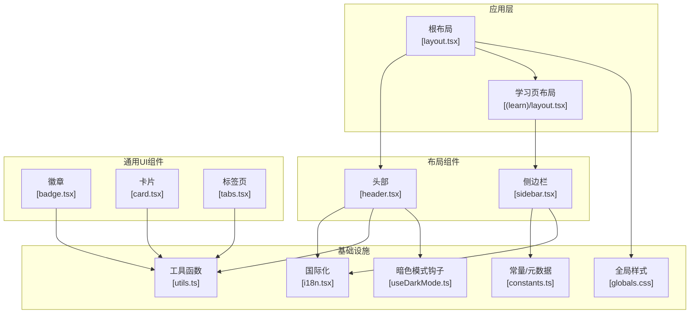
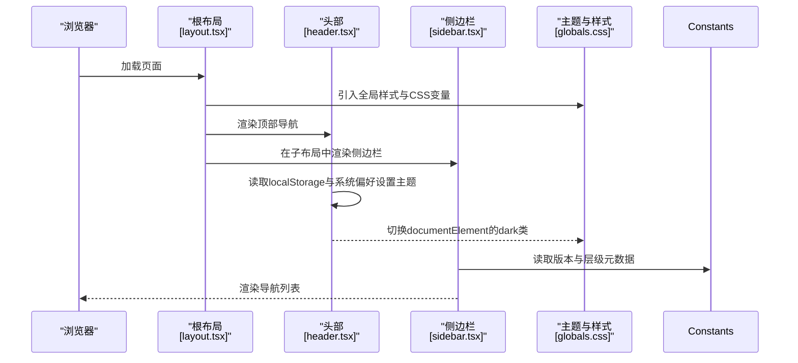
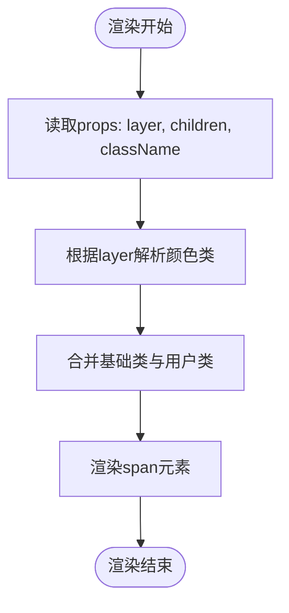
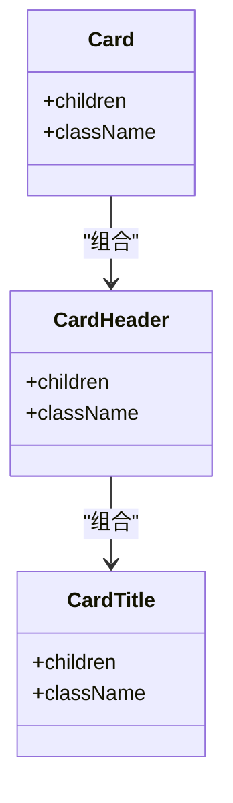
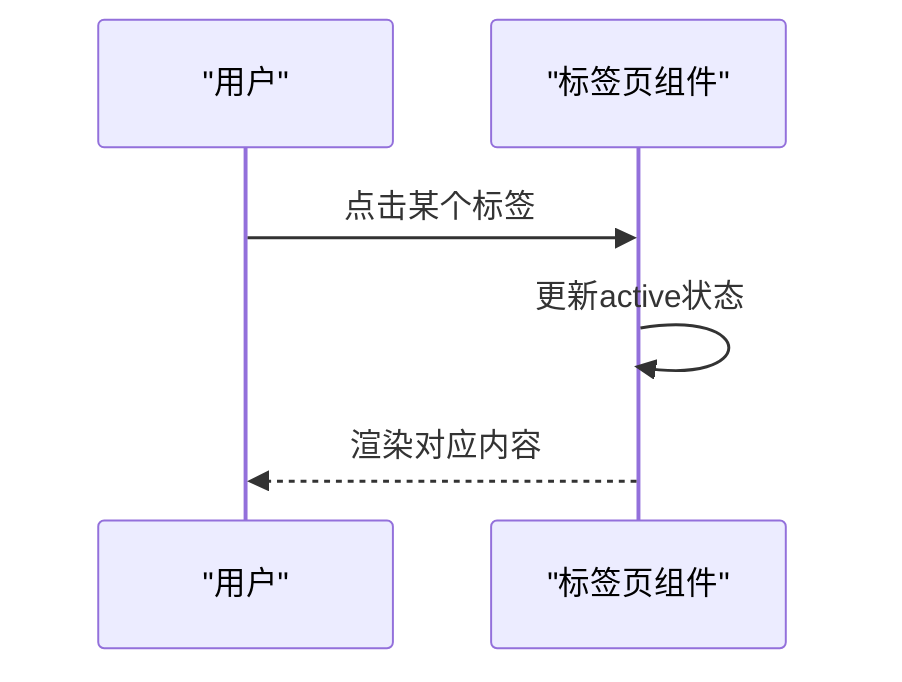
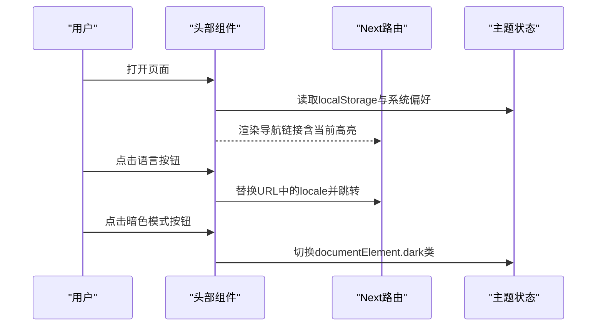
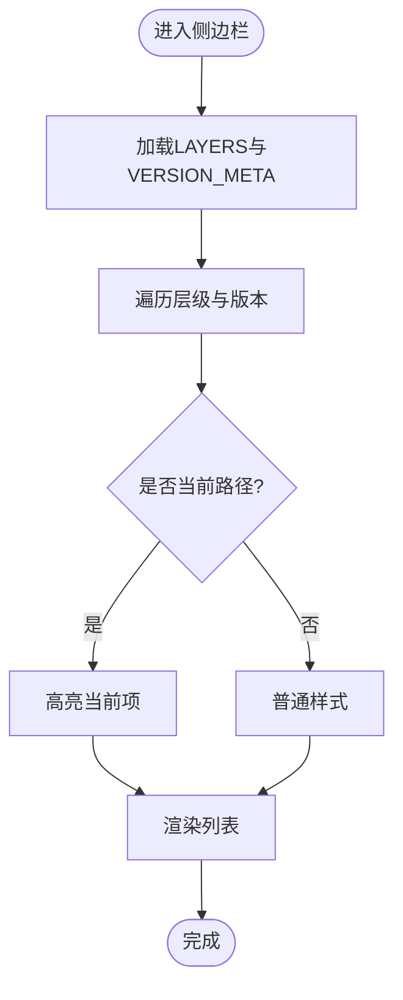
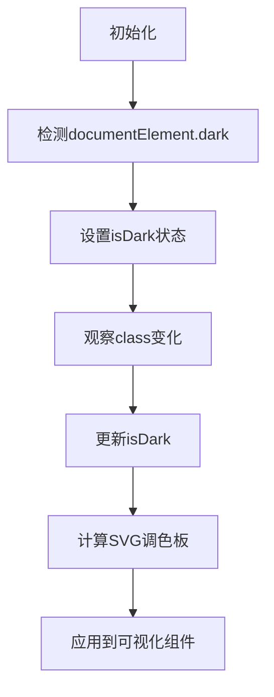
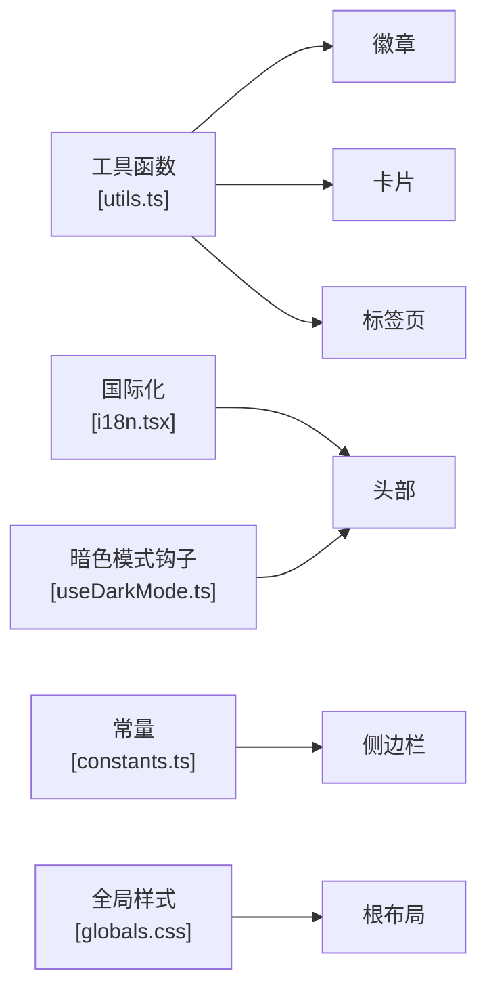

# UI组件库

<cite>
**本文引用的文件**
- [badge.tsx](file://web/src/components/ui/badge.tsx)
- [card.tsx](file://web/src/components/ui/card.tsx)
- [tabs.tsx](file://web/src/components/ui/tabs.tsx)
- [header.tsx](file://web/src/components/layout/header.tsx)
- [sidebar.tsx](file://web/src/components/layout/sidebar.tsx)
- [useDarkMode.ts](file://web/src/hooks/useDarkMode.ts)
- [utils.ts](file://web/src/lib/utils.ts)
- [constants.ts](file://web/src/lib/constants.ts)
- [i18n.tsx](file://web/src/lib/i18n.tsx)
- [layout.tsx](file://web/src/app/[locale]/layout.tsx)
- [learn layout.tsx](file://web/src/app/[locale]/(learn)/layout.tsx)
- [globals.css](file://web/src/app/globals.css)
- [package.json](file://web/package.json)
- [postcss.config.mjs](file://web/postcss.config.mjs)
</cite>

## 目录
1. [简介](#简介)
2. [项目结构](#项目结构)
3. [核心组件](#核心组件)
4. [架构总览](#架构总览)
5. [详细组件分析](#详细组件分析)
6. [依赖关系分析](#依赖关系分析)
7. [性能考量](#性能考量)
8. [故障排查指南](#故障排查指南)
9. [结论](#结论)
10. [附录](#附录)

## 简介
本文件为前端UI组件库的权威文档，聚焦基础通用组件（徽章、卡片、标签页）与布局组件（头部、侧边栏、导航结构），并系统阐述样式系统与主题定制（基于Tailwind CSS与CSS变量）、暗色模式支持、以及组件开发规范（命名约定、属性定义、事件处理最佳实践）。目标是帮助开发者快速理解并正确使用这些组件，同时提供可扩展的设计原则与实践建议。

## 项目结构
本项目采用Next.js + React + TypeScript技术栈，使用Tailwind CSS v4进行原子化样式构建，并通过CSS自定义属性实现主题与暗色模式切换。组件按职责分层组织：
- 通用UI组件：位于 components/ui，包含徽章、卡片、标签页等可复用基础组件
- 布局组件：位于 components/layout，包含头部与侧边栏，负责页面骨架与导航
- 钩子与工具：hooks与lib目录提供状态、国际化、工具函数等能力
- 应用入口与全局样式：app目录下定义根布局、语言环境注入与全局样式

图表来源
- [layout.tsx:29-61](file://web/src/app/[locale]/layout.tsx#L29-L61)
- [learn layout.tsx:1-15](file://web/src/app/[locale]/(learn)/layout.tsx#L1-L15)
- [header.tsx:22-173](file://web/src/components/layout/header.tsx#L22-L173)
- [sidebar.tsx:17-67](file://web/src/components/layout/sidebar.tsx#L17-L67)
- [badge.tsx:16-35](file://web/src/components/ui/badge.tsx#L16-L35)
- [card.tsx:3-40](file://web/src/components/ui/card.tsx#L3-L40)
- [tabs.tsx:6-38](file://web/src/components/ui/tabs.tsx#L6-L38)
- [utils.ts:1-4](file://web/src/lib/utils.ts#L1-L4)
- [i18n.tsx:16-37](file://web/src/lib/i18n.tsx#L16-L37)
- [constants.ts:1-38](file://web/src/lib/constants.ts#L1-L38)
- [useDarkMode.ts:5-76](file://web/src/hooks/useDarkMode.ts#L5-L76)
- [globals.css:1-556](file://web/src/app/globals.css#L1-L556)

章节来源
- [layout.tsx:29-61](file://web/src/app/[locale]/layout.tsx#L29-L61)
- [learn layout.tsx:1-15](file://web/src/app/[locale]/(learn)/layout.tsx#L1-L15)
- [globals.css:1-556](file://web/src/app/globals.css#L1-L556)
- [package.json:13-37](file://web/package.json#L13-L37)
- [postcss.config.mjs:1-8](file://web/postcss.config.mjs#L1-L8)

## 核心组件
本节概述三个基础UI组件的职责、属性接口与使用方式。所有组件均通过工具函数合并类名，确保样式组合灵活且一致。

- 徽章（LayerBadge）
  - 用途：以彩色圆角小标签标识不同“层级”（如工具、规划、记忆、并发、协作）
  - 关键属性
    - layer：限定颜色映射键（tools/planning/memory/concurrency/collaboration）
    - children：显示文本或节点
    - className：额外样式覆盖
  - 行为：根据layer选择预设背景与文字颜色，并自动适配暗色模式
  - 参考路径
    - [badge.tsx:16-35](file://web/src/components/ui/badge.tsx#L16-L35)

- 卡片（Card/CardHeader/CardTitle）
  - 用途：内容容器，提供边框、阴影、内边距与标题语义
  - 关键属性
    - Card：className、children，透传HTMLAttributes
    - CardHeader：段落间距与className
    - CardTitle：h3语义与强调字体
  - 行为：统一圆角与边框，暗色模式下切换背景与边框色
  - 参考路径
    - [card.tsx:3-40](file://web/src/components/ui/card.tsx#L3-L40)

- 标签页（Tabs）
  - 用途：基于本地状态的轻量标签页切换，渲染当前激活标签的内容
  - 关键属性
    - tabs：[{id, label}]数组，定义标签项
    - defaultTab：默认激活标签ID
    - children：接收activeTab作为参数的渲染函数
    - className：容器样式
  - 行为：点击切换active状态，底部高亮指示器；暗色模式切换边框与文字色
  - 参考路径
    - [tabs.tsx:6-38](file://web/src/components/ui/tabs.tsx#L6-L38)

章节来源
- [badge.tsx:16-35](file://web/src/components/ui/badge.tsx#L16-L35)
- [card.tsx:3-40](file://web/src/components/ui/card.tsx#L3-L40)
- [tabs.tsx:6-38](file://web/src/components/ui/tabs.tsx#L6-L38)
- [utils.ts:1-4](file://web/src/lib/utils.ts#L1-L4)

## 架构总览
整体架构围绕“根布局注入国际化与主题，布局组件承载导航与区域划分，通用组件提供可复用UI块”展开。样式系统基于Tailwind CSS v4与CSS变量，配合document.documentElement上的dark类实现暗色模式。

图表来源
- [layout.tsx:29-61](file://web/src/app/[locale]/layout.tsx#L29-L61)
- [header.tsx:22-173](file://web/src/components/layout/header.tsx#L22-L173)
- [sidebar.tsx:17-67](file://web/src/components/layout/sidebar.tsx#L17-L67)
- [globals.css:5-24](file://web/src/app/globals.css#L5-L24)

## 详细组件分析

### 徽章（LayerBadge）
- 设计要点
  - 通过layer键映射到预定义的颜色集合，保证视觉一致性
  - 使用工具函数合并类名，便于外部扩展
  - 暗色模式通过Tailwind dark前缀自动适配
- 复杂度与性能
  - O(1)颜色查找，渲染开销极低
- 错误处理
  - 未传入有效layer时，由TypeScript类型约束避免非法值
- 使用建议
  - 将layer与业务中的“能力层级”对齐，保持语义清晰

图表来源
- [badge.tsx:16-35](file://web/src/components/ui/badge.tsx#L16-L35)
- [utils.ts:1-4](file://web/src/lib/utils.ts#L1-L4)

章节来源
- [badge.tsx:16-35](file://web/src/components/ui/badge.tsx#L16-L35)

### 卡片（Card / CardHeader / CardTitle）
- 设计要点
  - 提供一致的容器样式与标题语义，便于信息分组
  - 透传HTMLAttributes，增强灵活性
- 复杂度与性能
  - 纯展示组件，无状态，O(1)渲染
- 错误处理
  - 通过React类型系统约束children与属性
- 使用建议
  - 将复杂内容拆分为多个Card，提升可读性与可维护性

图表来源
- [card.tsx:3-40](file://web/src/components/ui/card.tsx#L3-L40)

章节来源
- [card.tsx:3-40](file://web/src/components/ui/card.tsx#L3-L40)

### 标签页（Tabs）
- 设计要点
  - 基于useState管理activeTab，支持defaultTab初始化
  - 通过children(activeTab)函数式渲染，解耦内容与状态
- 复杂度与性能
  - 状态更新仅影响当前标签切换，渲染范围小
- 错误处理
  - 当tabs为空或未提供defaultTab时，安全回退
- 使用建议
  - 为每个tab提供唯一id，避免重复导致状态冲突

图表来源
- [tabs.tsx:6-38](file://web/src/components/ui/tabs.tsx#L6-L38)

章节来源
- [tabs.tsx:6-38](file://web/src/components/ui/tabs.tsx#L6-L38)

### 头部（Header）
- 功能概览
  - 响应式导航、多语言切换、暗色模式开关、GitHub外链
  - 使用国际化钩子获取文案，结合路由高亮当前项
- 交互流程
  - 首次挂载读取localStorage与系统偏好，设置dark类
  - 切换语言时替换URL中的locale段并跳转
  - 移动端菜单折叠/展开
- 性能与可访问性
  - 使用Next Link进行客户端导航，减少重排
  - 按钮具备最小触控尺寸，满足可访问性要求

图表来源
- [header.tsx:22-173](file://web/src/components/layout/header.tsx#L22-L173)
- [i18n.tsx:16-37](file://web/src/lib/i18n.tsx#L16-L37)

章节来源
- [header.tsx:22-173](file://web/src/components/layout/header.tsx#L22-L173)
- [i18n.tsx:16-37](file://web/src/lib/i18n.tsx#L16-L37)

### 侧边栏（Sidebar）
- 功能概览
  - 基于常量LAYERS与VERSION_META生成层级与版本导航
  - 根据当前路径高亮活跃项，支持diff子路径识别
- 数据结构
  - LAYERS：按能力维度分组版本
  - VERSION_META：每个版本的标题、副标题、核心新增、关键洞察、所属层级与前驱版本
- 交互与可访问性
  - 链接具备明确语义与键盘可达性
  - 颜色点与层级标签提升扫描效率

图表来源
- [sidebar.tsx:17-67](file://web/src/components/layout/sidebar.tsx#L17-L67)
- [constants.ts:1-38](file://web/src/lib/constants.ts#L1-L38)

章节来源
- [sidebar.tsx:17-67](file://web/src/components/layout/sidebar.tsx#L17-L67)
- [constants.ts:1-38](file://web/src/lib/constants.ts#L1-L38)

### 暗色模式与SVG调色板
- 暗色模式检测
  - 监听documentElement的class变化，同步内部状态
- SVG调色板
  - 根据暗色模式返回不同的节点、边、箭头与标签颜色，确保可视化可读性
- 使用场景
  - 图表、流程图等需要动态颜色的可视化组件

图表来源
- [useDarkMode.ts:5-76](file://web/src/hooks/useDarkMode.ts#L5-L76)

章节来源
- [useDarkMode.ts:5-76](file://web/src/hooks/useDarkMode.ts#L5-L76)

## 依赖关系分析
- 组件耦合
  - 通用UI组件仅依赖工具函数cn，低耦合、高内聚
  - 布局组件依赖国际化与常量，形成稳定的数据驱动视图
- 外部依赖
  - Tailwind CSS v4用于原子化样式
  - PostCSS插件启用Tailwind
  - Next.js提供路由与服务端渲染能力
- 潜在循环依赖
  - 未发现循环导入；组件间通过明确的上下文与常量传递数据

图表来源
- [utils.ts:1-4](file://web/src/lib/utils.ts#L1-L4)
- [i18n.tsx:16-37](file://web/src/lib/i18n.tsx#L16-L37)
- [constants.ts:1-38](file://web/src/lib/constants.ts#L1-L38)
- [globals.css:1-556](file://web/src/app/globals.css#L1-L556)
- [useDarkMode.ts:5-76](file://web/src/hooks/useDarkMode.ts#L5-L76)

章节来源
- [package.json:13-37](file://web/package.json#L13-L37)
- [postcss.config.mjs:1-8](file://web/postcss.config.mjs#L1-L8)

## 性能考量
- 组件级优化
  - 标签页使用局部状态，避免整树重渲染
  - 徽章与卡片为无状态展示组件，渲染成本极低
- 样式与主题
  - 使用CSS变量与Tailwind dark前缀，减少运行时样式计算
  - 首屏脚本提前设置dark类，避免闪烁
- 国际化
  - 按需加载messages，减少包体积
- 建议
  - 对大型列表或复杂可视化，考虑虚拟滚动与懒加载
  - 对频繁切换的标签页，可使用memo或React.lazy进一步优化

## 故障排查指南
- 暗色模式不生效
  - 检查根布局是否在首屏注入dark类逻辑
  - 确认头部切换逻辑正确修改documentElement的class
  - 参考路径
    - [layout.tsx:39-49](file://web/src/app/[locale]/layout.tsx#L39-L49)
    - [header.tsx:30-46](file://web/src/components/layout/header.tsx#L30-L46)
- 多语言切换无效
  - 确认I18nProvider已包裹应用并提供正确的locale
  - 检查URL中locale段是否正确替换
  - 参考路径
    - [i18n.tsx:16-37](file://web/src/lib/i18n.tsx#L16-L37)
    - [header.tsx:48-51](file://web/src/components/layout/header.tsx#L48-L51)
- 侧边栏高亮异常
  - 检查路径匹配逻辑是否包含diff子路径
  - 确认VERSION_META与LAYERS数据完整
  - 参考路径
    - [sidebar.tsx:38-42](file://web/src/components/layout/sidebar.tsx#L38-L42)
    - [constants.ts:9-37](file://web/src/lib/constants.ts#L9-L37)
- 样式错乱
  - 确认Tailwind与PostCSS配置正确
  - 检查全局样式是否被其他样式覆盖
  - 参考路径
    - [postcss.config.mjs:1-8](file://web/postcss.config.mjs#L1-L8)
    - [globals.css:1-24](file://web/src/app/globals.css#L1-L24)

章节来源
- [layout.tsx:39-49](file://web/src/app/[locale]/layout.tsx#L39-L49)
- [header.tsx:30-51](file://web/src/components/layout/header.tsx#L30-L51)
- [i18n.tsx:16-37](file://web/src/lib/i18n.tsx#L16-L37)
- [sidebar.tsx:38-42](file://web/src/components/layout/sidebar.tsx#L38-L42)
- [constants.ts:9-37](file://web/src/lib/constants.ts#L9-L37)
- [postcss.config.mjs:1-8](file://web/postcss.config.mjs#L1-L8)
- [globals.css:1-24](file://web/src/app/globals.css#L1-L24)

## 结论
该UI组件库以简洁、可组合的方式提供了基础UI与布局能力，借助Tailwind CSS与CSS变量实现了灵活的样式系统与暗色模式支持。通过清晰的属性接口与稳定的数据流，组件易于扩展与维护。建议在后续迭代中继续遵循统一的命名与属性约定，完善无障碍与测试覆盖，以提升整体质量与可维护性。

## 附录

### 样式系统与主题定制
- Tailwind CSS v4
  - 通过PostCSS插件启用，提供原子化类名与暗色模式变体
  - 参考路径
    - [package.json:29-37](file://web/package.json#L29-L37)
    - [postcss.config.mjs:1-8](file://web/postcss.config.mjs#L1-L8)
- CSS变量与暗色模式
  - 使用:root与.dark定义主题变量，统一背景、文本与边框色
  - 参考路径
    - [globals.css:5-24](file://web/src/app/globals.css#L5-L24)
- 文档渲染样式
  - 提供prose-custom风格，涵盖标题、段落、代码块、表格等
  - 参考路径
    - [globals.css:41-469](file://web/src/app/globals.css#L41-L469)

章节来源
- [package.json:29-37](file://web/package.json#L29-L37)
- [postcss.config.mjs:1-8](file://web/postcss.config.mjs#L1-L8)
- [globals.css:5-24](file://web/src/app/globals.css#L5-L24)
- [globals.css:41-469](file://web/src/app/globals.css#L41-L469)

### 组件开发规范
- 命名约定
  - 组件文件名使用小写驼峰（如badge.tsx、card.tsx、tabs.tsx）
  - 导出函数名使用大驼峰（如LayerBadge、Card、Tabs）
- 属性定义
  - 使用TypeScript接口明确props类型，限制可选与必填字段
  - 通过...props透传HTMLAttributes，增强灵活性
- 事件处理
  - 使用onClick等原生事件，避免过度封装
  - 对状态更新进行最小化作用域控制（如标签页的active状态）
- 样式策略
  - 使用工具函数合并类名，避免样式冲突
  - 利用Tailwind dark前缀实现暗色模式
- 可访问性
  - 为交互元素提供足够触控尺寸与键盘可达性
  - 使用语义化标签（如h3、nav、button）

章节来源
- [badge.tsx:16-35](file://web/src/components/ui/badge.tsx#L16-L35)
- [card.tsx:3-40](file://web/src/components/ui/card.tsx#L3-L40)
- [tabs.tsx:6-38](file://web/src/components/ui/tabs.tsx#L6-L38)
- [utils.ts:1-4](file://web/src/lib/utils.ts#L1-L4)
- [header.tsx:22-173](file://web/src/components/layout/header.tsx#L22-L173)
- [sidebar.tsx:17-67](file://web/src/components/layout/sidebar.tsx#L17-L67)