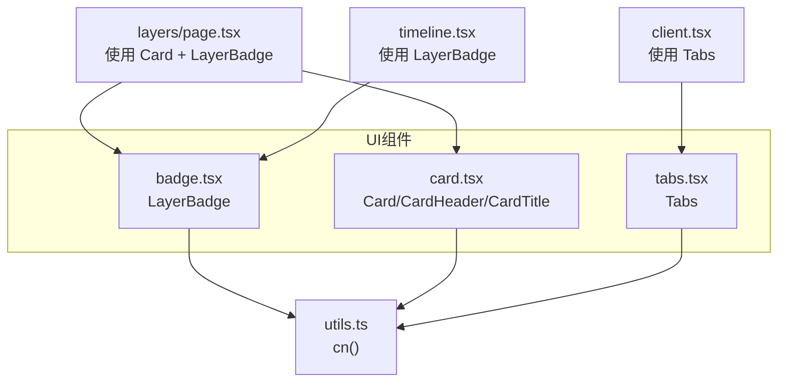
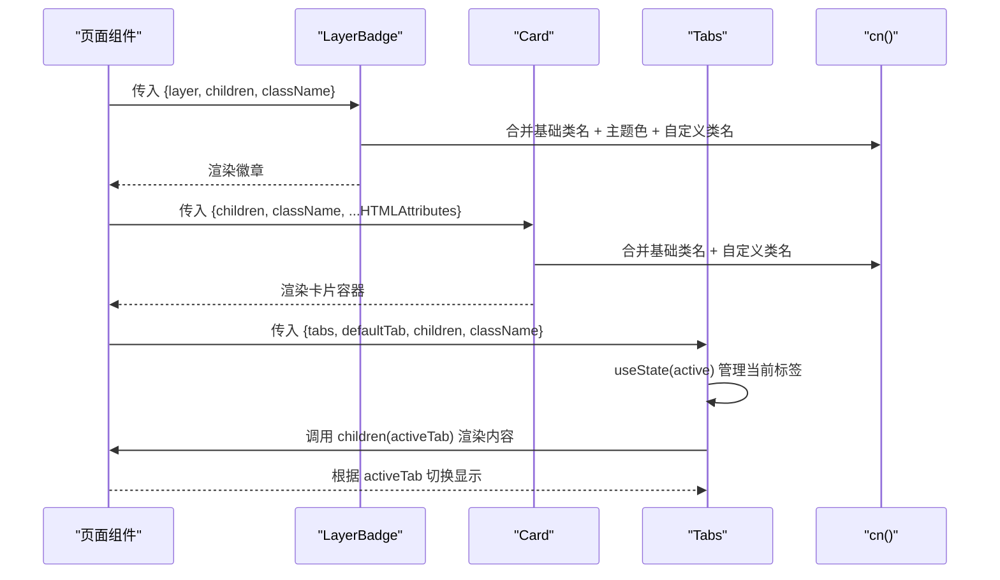
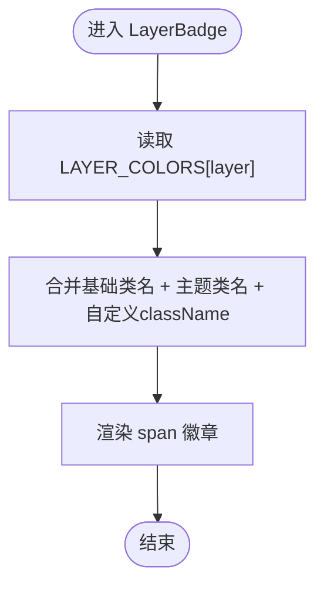
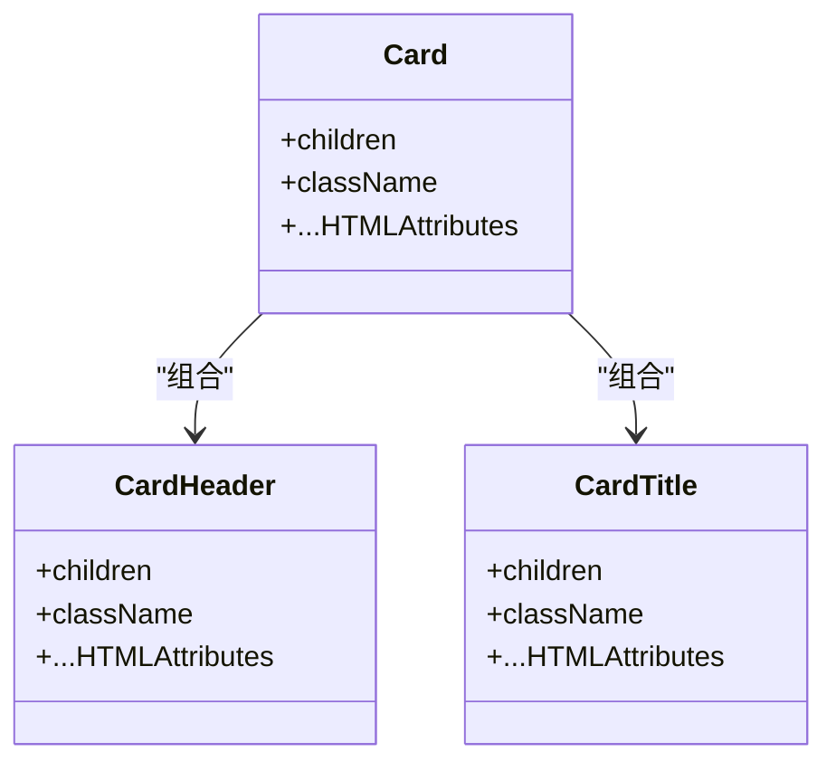
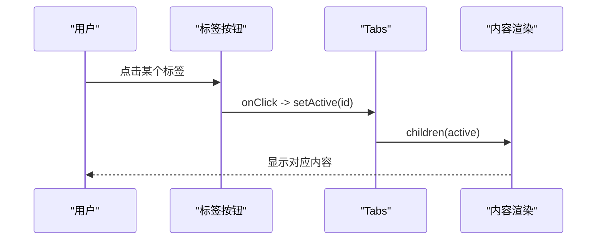
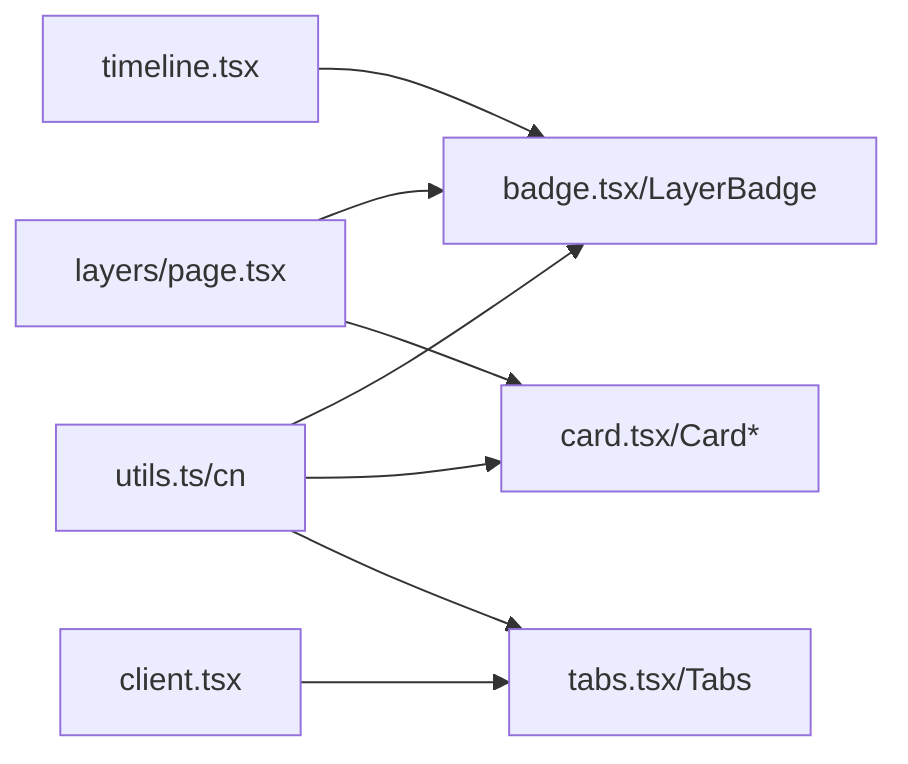

# 基础UI组件

<cite>
**本文引用的文件**
- [badge.tsx](file://web/src/components/ui/badge.tsx)
- [card.tsx](file://web/src/components/ui/card.tsx)
- [tabs.tsx](file://web/src/components/ui/tabs.tsx)
- [utils.ts](file://web/src/lib/utils.ts)
- [layers/page.tsx](file://web/src/app/[locale]/(learn)/layers/page.tsx)
- [client.tsx](file://web/src/app/[locale]/(learn)/[version]/client.tsx)
- [timeline.tsx](file://web/src/components/timeline/timeline.tsx)
</cite>

## 目录
1. [简介](#简介)
2. [项目结构](#项目结构)
3. [核心组件](#核心组件)
4. [架构总览](#架构总览)
5. [详细组件分析](#详细组件分析)
6. [依赖关系分析](#依赖关系分析)
7. [性能考量](#性能考量)
8. [故障排查指南](#故障排查指南)
9. [结论](#结论)
10. [附录：API与使用示例](#附录api与使用示例)

## 简介
本文件面向前端开发者，系统化梳理并文档化三个基础UI组件：徽章（LayerBadge）、卡片（Card）与标签页（Tabs）。重点覆盖：
- LayerBadge 的 layer 属性类型、颜色映射系统与样式定制选项
- Card 的结构设计、内容区域划分与响应式布局特性
- Tabs 的状态管理、切换逻辑与可访问性支持
同时提供每个组件的完整API接口说明（props、事件、样式覆盖），以及实际使用示例与最佳实践建议。

## 项目结构
三个基础组件位于 web/src/components/ui 下，通过统一的工具函数 cn 进行类名合并；在页面中广泛复用，例如：
- 层列表页使用 Card + LayerBadge 展示版本卡片
- 版本详情页使用 Tabs 组织“学习/模拟/代码/深入”等视图
- 时间线组件使用 LayerBadge 标注版本所属层级

图表来源
- [badge.tsx:1-35](file://web/src/components/ui/badge.tsx#L1-L35)
- [card.tsx:1-40](file://web/src/components/ui/card.tsx#L1-L40)
- [tabs.tsx:1-38](file://web/src/components/ui/tabs.tsx#L1-L38)
- [utils.ts:1-4](file://web/src/lib/utils.ts#L1-L4)
- [layers/page.tsx:1-134](file://web/src/app/[locale]/(learn)/layers/page.tsx#L1-L134)
- [client.tsx:1-83](file://web/src/app/[locale]/(learn)/[version]/client.tsx#L1-L83)
- [timeline.tsx:1-216](file://web/src/components/timeline/timeline.tsx#L1-L216)

章节来源
- [badge.tsx:1-35](file://web/src/components/ui/badge.tsx#L1-L35)
- [card.tsx:1-40](file://web/src/components/ui/card.tsx#L1-L40)
- [tabs.tsx:1-38](file://web/src/components/ui/tabs.tsx#L1-L38)
- [utils.ts:1-4](file://web/src/lib/utils.ts#L1-L4)
- [layers/page.tsx:1-134](file://web/src/app/[locale]/(learn)/layers/page.tsx#L1-L134)
- [client.tsx:1-83](file://web/src/app/[locale]/(learn)/[version]/client.tsx#L1-L83)
- [timeline.tsx:1-216](file://web/src/components/timeline/timeline.tsx#L1-L216)

## 核心组件
- LayerBadge：用于以徽章形式标识“层级/能力域”，内置多套明暗主题配色，支持自定义类名覆盖。
- Card：通用容器，提供圆角、边框、阴影、明暗背景等基础样式，并提供 CardHeader、CardTitle 子组件以规范内容分区。
- Tabs：基于 React useState 的轻量标签页，支持默认激活项、函数式渲染子内容，具备基础的键盘交互语义（button）。

章节来源
- [badge.tsx:16-34](file://web/src/components/ui/badge.tsx#L16-L34)
- [card.tsx:3-40](file://web/src/components/ui/card.tsx#L3-L40)
- [tabs.tsx:6-37](file://web/src/components/ui/tabs.tsx#L6-L37)

## 架构总览
组件间通过 props 传递数据与回调，统一使用 cn 合并 Tailwind 类名，保证样式一致性与可定制性。页面级组件组合这些基础组件构建业务界面。

图表来源
- [badge.tsx:16-34](file://web/src/components/ui/badge.tsx#L16-L34)
- [card.tsx:3-19](file://web/src/components/ui/card.tsx#L3-L19)
- [tabs.tsx:6-37](file://web/src/components/ui/tabs.tsx#L6-L37)
- [utils.ts:1-4](file://web/src/lib/utils.ts#L1-L4)

## 详细组件分析

### LayerBadge（徽章）
- 职责：以紧凑的视觉标记表达“层级/能力域”，支持明暗主题。
- 数据结构与复杂度：内部维护一个常量映射表 LAYER_COLORS，键为层类型，值为 Tailwind 类名字符串；查找复杂度 O(1)。
- 状态与副作用：无状态，纯展示组件。
- 错误处理：未对非法 layer 做显式校验，若传入不在映射中的值将不会应用主题色。
- 可访问性：使用  作为根元素，适合装饰性文本；如需语义强调，可在上层包裹更合适的语义标签。
- 样式定制：通过 className 透传，结合 cn 合并到基础样式上。

图表来源
- [badge.tsx:3-14](file://web/src/components/ui/badge.tsx#L3-L14)
- [badge.tsx:22-34](file://web/src/components/ui/badge.tsx#L22-L34)

章节来源
- [badge.tsx:1-35](file://web/src/components/ui/badge.tsx#L1-L35)

### Card（卡片）
- 职责：提供一致的卡片容器与标题区、标题语义元素，便于信息分组展示。
- 结构设计：
  - Card：通用容器，包含圆角、边框、阴影、明暗背景等基础样式，透传所有 HTMLAttributes。
  - CardHeader：头部区域，提供间距与容器语义。
  - CardTitle：标题语义 h3，提供字体粗细与尺寸。
- 响应式：通过 Tailwind 类名实现基础响应式（如 padding、边框、阴影在不同屏幕下的表现由主题与上下文决定）。
- 可访问性：CardTitle 使用 h3，符合文档大纲语义；外层容器为 div，不承载语义。
- 样式定制：通过 className 透传，支持覆盖默认样式。

图表来源
- [card.tsx:3-40](file://web/src/components/ui/card.tsx#L3-L40)

章节来源
- [card.tsx:1-40](file://web/src/components/ui/card.tsx#L1-L40)

### Tabs（标签页）
- 职责：提供标签切换能力，按当前激活标签渲染对应内容。
- 状态管理：使用 useState 维护 active 标签ID，默认值为 defaultTab 或第一个 tab.id。
- 切换逻辑：点击按钮时更新 active 状态，并通过 children(active) 函数式渲染对应内容。
- 可访问性：使用 button 元素，具备原生焦点与键盘行为；但缺少 ARIA 角色与键盘导航增强（如左右箭头切换、Enter/Space 触发）。
- 样式定制：通过 className 透传，支持覆盖默认样式；激活态与非激活态分别设置不同样式。

图表来源
- [tabs.tsx:6-37](file://web/src/components/ui/tabs.tsx#L6-L37)

章节来源
- [tabs.tsx:1-38](file://web/src/components/ui/tabs.tsx#L1-L38)

## 依赖关系分析
- 组件均依赖 cn 工具函数进行类名合并，确保样式可叠加且避免冲突。
- 页面组件组合基础组件完成业务布局：
  - layers/page.tsx 使用 Card + LayerBadge 展示版本卡片网格
  - client.tsx 使用 Tabs 组织多视图内容
  - timeline.tsx 使用 LayerBadge 标注版本层级

图表来源
- [utils.ts:1-4](file://web/src/lib/utils.ts#L1-L4)
- [badge.tsx:1-35](file://web/src/components/ui/badge.tsx#L1-L35)
- [card.tsx:1-40](file://web/src/components/ui/card.tsx#L1-L40)
- [tabs.tsx:1-38](file://web/src/components/ui/tabs.tsx#L1-L38)
- [layers/page.tsx:1-134](file://web/src/app/[locale]/(learn)/layers/page.tsx#L1-L134)
- [client.tsx:1-83](file://web/src/app/[locale]/(learn)/[version]/client.tsx#L1-L83)
- [timeline.tsx:1-216](file://web/src/components/timeline/timeline.tsx#L1-L216)

章节来源
- [layers/page.tsx:1-134](file://web/src/app/[locale]/(learn)/layers/page.tsx#L1-L134)
- [client.tsx:1-83](file://web/src/app/[locale]/(learn)/[version]/client.tsx#L1-L83)
- [timeline.tsx:1-216](file://web/src/components/timeline/timeline.tsx#L1-L216)

## 性能考量
- LayerBadge：无状态、无副作用，O(1) 颜色查找，渲染开销极小。
- Card：纯展示容器，仅做类名合并与透传，性能影响可忽略。
- Tabs：每次切换仅更新 active 状态并重新渲染 children 返回的内容；当内容较重时，建议按需懒加载或拆分子组件以减少重渲染范围。
- 类名合并：cn 过滤空值并拼接字符串，开销极低，适合高频使用。

## 故障排查指南
- LayerBadge 颜色不生效
  - 检查传入的 layer 是否在 LAYER_COLORS 的键集合内；若不在，将不会应用主题色。
  - 确认未通过 className 覆盖导致样式被意外替换。
- Tabs 无法切换或内容不更新
  - 确认 tabs 数组非空且每项具备唯一 id。
  - 检查 defaultTab 是否存在于 tabs 中；否则回退到第一个 tab.id。
  - 确认 children 函数能根据 activeTab 正确分支渲染。
- 样式覆盖无效
  - 确认 className 正确传入并被 cn 合并；注意 Tailwind 类名拼写与主题变量是否匹配。

章节来源
- [badge.tsx:3-14](file://web/src/components/ui/badge.tsx#L3-L14)
- [tabs.tsx:6-37](file://web/src/components/ui/tabs.tsx#L6-L37)
- [card.tsx:3-19](file://web/src/components/ui/card.tsx#L3-L19)

## 结论
这三个基础组件以极简实现提供了高复用性的 UI 能力：
- LayerBadge 通过集中化的颜色映射与灵活的 className 覆盖，满足多主题场景下的层级标识需求。
- Card 及其子组件规范化了信息卡片的结构与语义，便于快速搭建内容区块。
- Tabs 以最小状态管理实现了标签切换，配合函数式渲染使内容组织清晰。
在实际项目中，建议遵循现有命名与样式约定，并在需要时扩展可访问性与交互细节。

## 附录：API与使用示例

### LayerBadge API
- Props
  - layer: 必填，类型为 LAYER_COLORS 的键集合（即支持的层类型）
  - children: 必填，徽章内显示的文本或节点
  - className: 可选，附加的 Tailwind 类名，会与基础样式合并
- 事件
  - 无
- 样式覆盖
  - 通过 className 追加或覆盖样式；主题色由 layer 决定
- 使用示例路径
  - [layers/page.tsx:83-89](file://web/src/app/[locale]/(learn)/layers/page.tsx#L83-L89)
  - [timeline.tsx:114-116](file://web/src/components/timeline/timeline.tsx#L114-L116)

章节来源
- [badge.tsx:16-34](file://web/src/components/ui/badge.tsx#L16-L34)
- [layers/page.tsx:83-89](file://web/src/app/[locale]/(learn)/layers/page.tsx#L83-L89)
- [timeline.tsx:114-116](file://web/src/components/timeline/timeline.tsx#L114-L116)

### Card API
- Props
  - Card
    - children: 必填，卡片内容
    - className: 可选，附加类名
    - ...HTMLAttributes: 透传至根 div
  - CardHeader
    - children: 必填，头部内容
    - className: 可选，附加类名
    - ...HTMLAttributes: 透传至根 div
  - CardTitle
    - children: 必填，标题文本或节点
    - className: 可选，附加类名
    - ...HTMLAttributes: 透传至 h3
- 事件
  - 无
- 样式覆盖
  - 通过 className 覆盖默认样式；支持明暗主题适配
- 使用示例路径
  - [layers/page.tsx:83-113](file://web/src/app/[locale]/(learn)/layers/page.tsx#L83-L113)

章节来源
- [card.tsx:3-40](file://web/src/components/ui/card.tsx#L3-L40)
- [layers/page.tsx:83-113](file://web/src/app/[locale]/(learn)/layers/page.tsx#L83-L113)

### Tabs API
- Props
  - tabs: 必填，对象数组，每项包含 id 与 label
  - defaultTab: 可选，初始激活的 tab id；未提供则使用第一个 tab.id
  - children: 必填，函数 (activeTab: string) => ReactNode，用于根据当前激活标签渲染内容
  - className: 可选，附加类名
- 事件
  - 内部通过 onClick 更新 active 状态；对外不暴露回调
- 样式覆盖
  - 通过 className 覆盖容器样式；激活态样式可通过覆盖按钮类名调整
- 可访问性现状与建议
  - 现状：使用 button 元素，具备基本焦点行为；缺少 ARIA 角色与键盘导航增强
  - 建议：增加 role="tablist"、aria-selected、aria-controls 等属性，并支持左右箭头与 Home/End 键导航
- 使用示例路径
  - [client.tsx:36-79](file://web/src/app/[locale]/(learn)/[version]/client.tsx#L36-L79)

章节来源
- [tabs.tsx:6-37](file://web/src/components/ui/tabs.tsx#L6-L37)
- [client.tsx:36-79](file://web/src/app/[locale]/(learn)/[version]/client.tsx#L36-L79)