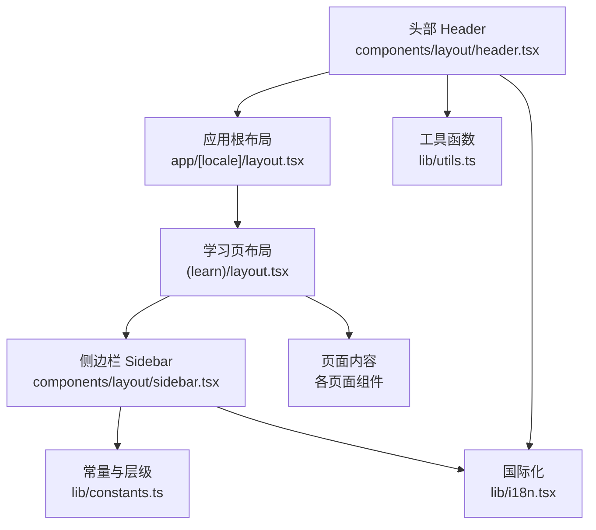
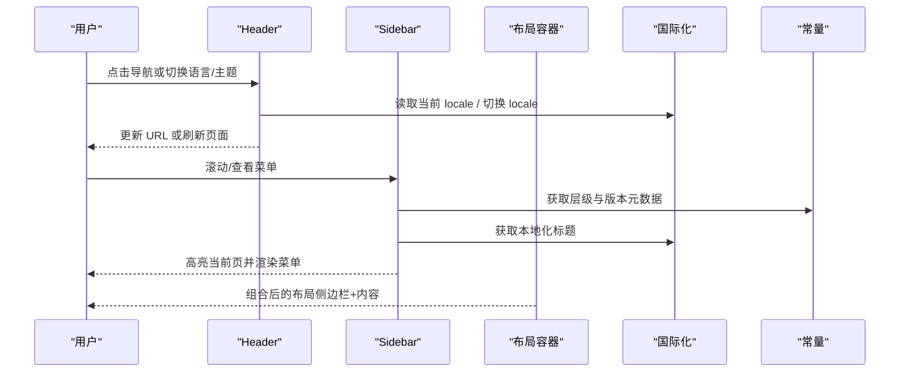
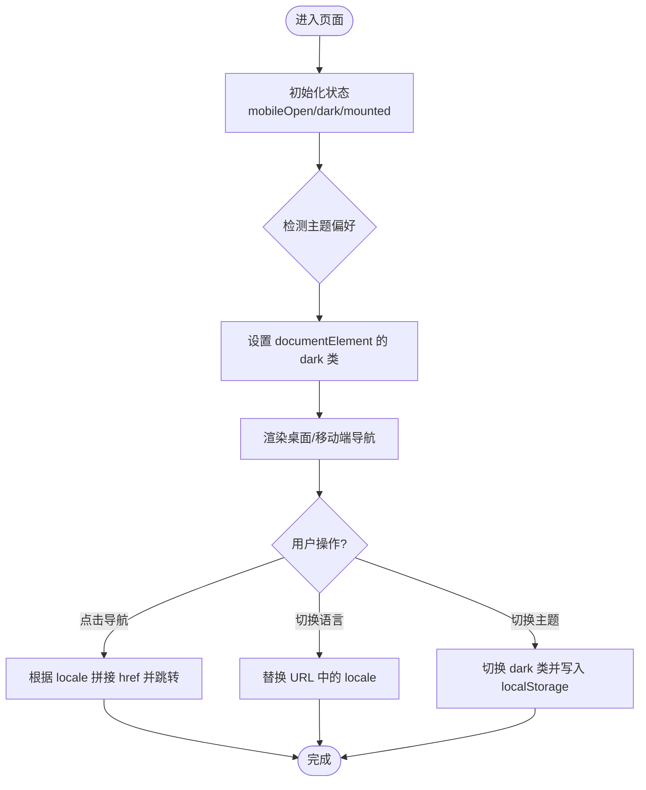
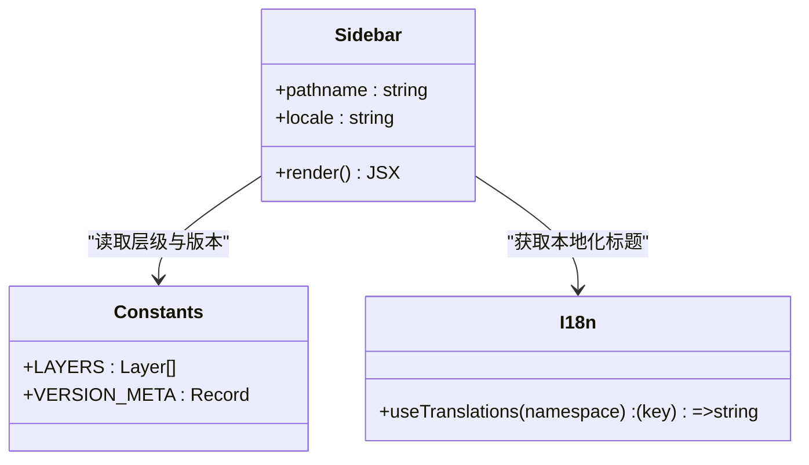
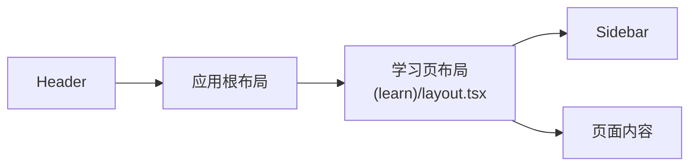
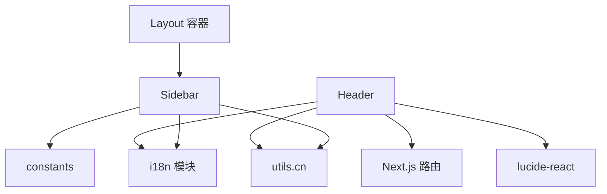

# 布局组件

<cite>
**本文引用的文件**
- [header.tsx](file://web/src/components/layout/header.tsx)
- [sidebar.tsx](file://web/src/components/layout/sidebar.tsx)
- [layout.tsx](file://web/src/app/[locale]/(learn)/layout.tsx)
- [constants.ts](file://web/src/lib/constants.ts)
- [i18n.tsx](file://web/src/lib/i18n.tsx)
- [utils.ts](file://web/src/lib/utils.ts)
- [page.tsx](file://web/src/app/[locale]/page.tsx)
</cite>

## 目录
1. [简介](#简介)
2. [项目结构](#项目结构)
3. [核心组件](#核心组件)
4. [架构总览](#架构总览)
5. [详细组件分析](#详细组件分析)
6. [依赖关系分析](#依赖关系分析)
7. [性能考量](#性能考量)
8. [故障排查指南](#故障排查指南)
9. [结论](#结论)
10. [附录](#附录)

## 简介
本文件聚焦于学习站点的布局组件，重点说明头部 Header 与侧边栏 Sidebar 的实现、响应式策略、组件协作与数据传递机制，并提供配置选项、扩展方法与最佳实践建议。该站点基于 Next.js 客户端组件构建，使用 Tailwind CSS 实现响应式布局，并通过 i18n 提供多语言支持。

## 项目结构
布局相关代码主要位于 web/src 下：
- 布局容器：app/[locale]/(learn)/layout.tsx 负责将 Sidebar 与页面内容组合为左右布局。
- 头部组件：components/layout/header.tsx 提供顶部导航、品牌标识、语言切换与主题切换。
- 侧边栏组件：components/layout/sidebar.tsx 提供按“能力层”分组的课程导航。
- 常量与国际化：lib/constants.ts 定义版本元数据与层级分组；lib/i18n.tsx 提供翻译上下文；lib/utils.ts 提供类名合并工具。
- 首页示例：app/[locale]/page.tsx 展示如何使用这些布局与数据。

图表来源
- [layout.tsx:1-15](file://web/src/app/[locale]/(learn)/layout.tsx#L1-L15)
- [header.tsx:1-173](file://web/src/components/layout/header.tsx#L1-L173)
- [sidebar.tsx:1-67](file://web/src/components/layout/sidebar.tsx#L1-L67)
- [constants.ts:1-38](file://web/src/lib/constants.ts#L1-L38)
- [i18n.tsx:1-37](file://web/src/lib/i18n.tsx#L1-L37)
- [utils.ts:1-4](file://web/src/lib/utils.ts#L1-L4)

章节来源
- [layout.tsx:1-15](file://web/src/app/[locale]/(learn)/layout.tsx#L1-L15)
- [header.tsx:1-173](file://web/src/components/layout/header.tsx#L1-L173)
- [sidebar.tsx:1-67](file://web/src/components/layout/sidebar.tsx#L1-L67)
- [constants.ts:1-38](file://web/src/lib/constants.ts#L1-L38)
- [i18n.tsx:1-37](file://web/src/lib/i18n.tsx#L1-L37)
- [utils.ts:1-4](file://web/src/lib/utils.ts#L1-L4)

## 核心组件
- Header：固定顶部、包含品牌链接、桌面端主导航、移动端汉堡菜单、语言切换器、深色模式切换与 GitHub 外链。
- Sidebar：按“能力层”组织课程列表，显示当前激活项，支持多语言标题与层级标签。
- 布局容器：在桌面端呈现左侧固定宽度侧边栏 + 右侧自适应内容区；移动端隐藏侧边栏，由 Header 承载导航。

章节来源
- [header.tsx:10-173](file://web/src/components/layout/header.tsx#L10-L173)
- [sidebar.tsx:9-67](file://web/src/components/layout/sidebar.tsx#L9-L67)
- [layout.tsx:1-15](file://web/src/app/[locale]/(learn)/layout.tsx#L1-L15)

## 架构总览
Header 与 Sidebar 通过共享的常量与国际化模块协同工作：
- 常量模块提供版本元数据与层级分组，Sidebar 据此渲染菜单。
- 国际化模块提供翻译键值，Header 与 Sidebar 分别用于导航项与章节标题。
- 布局容器将 Sidebar 与页面内容组合，形成稳定的学习路径浏览体验。

图表来源
- [header.tsx:22-173](file://web/src/components/layout/header.tsx#L22-L173)
- [sidebar.tsx:17-67](file://web/src/components/layout/sidebar.tsx#L17-L67)
- [i18n.tsx:16-37](file://web/src/lib/i18n.tsx#L16-L37)
- [constants.ts:9-38](file://web/src/lib/constants.ts#L9-L38)
- [layout.tsx:1-15](file://web/src/app/[locale]/(learn)/layout.tsx#L1-L15)

## 详细组件分析

### Header 组件
- 导航结构：
  - 桌面端导航：一组固定路由项，根据当前路径高亮。
  - 移动端导航：汉堡按钮展开后显示相同的路由项，点击后自动收起。
- 品牌标识：左上角品牌链接，带本地化前缀。
- 用户操作区域：
  - 语言切换：通过替换 URL 中的 locale 段实现。
  - 深色模式：读取本地存储与系统偏好，切换根节点 class 并持久化。
  - GitHub 外链：在新标签页打开。
- 响应式策略：
  - 使用 Tailwind 断点控制显示/隐藏（如 md:hidden）。
  - 移动端菜单通过状态控制显隐，保证可触摸目标尺寸。
- 交互行为：
  - 导航项根据 pathname 判断高亮。
  - 语言切换直接跳转新 URL。
  - 主题切换同步到 localStorage 与 documentElement。

图表来源
- [header.tsx:22-173](file://web/src/components/layout/header.tsx#L22-L173)

章节来源
- [header.tsx:10-173](file://web/src/components/layout/header.tsx#L10-L173)
- [i18n.tsx:25-37](file://web/src/lib/i18n.tsx#L25-L37)
- [utils.ts:1-4](file://web/src/lib/utils.ts#L1-L4)

### Sidebar 组件
- 菜单组织：
  - 按“能力层”分组（Tools、Planning、Memory、Concurrency、Collaboration），每组以彩色圆点与标签区分。
  - 每个组内列出对应版本的链接，显示版本号与本地化标题。
- 层级结构与数据来源：
  - 层级与版本映射来自常量模块的 LAYERS 与 VERSION_META。
  - 当前激活项通过 pathname 匹配（精确匹配或 diff 子路径）。
- 交互行为：
  - 仅桌面端可见（md:block），移动端由 Header 承载导航。
  - 高亮当前页，悬停反馈清晰。
- 响应式策略：
  - 固定宽度侧边栏，sticky 定位，避免长页面滚动时丢失导航。
  - 文本与间距在小屏上保持可读性。

图表来源
- [sidebar.tsx:17-67](file://web/src/components/layout/sidebar.tsx#L17-L67)
- [constants.ts:9-38](file://web/src/lib/constants.ts#L9-L38)
- [i18n.tsx:25-37](file://web/src/lib/i18n.tsx#L25-L37)

章节来源
- [sidebar.tsx:9-67](file://web/src/components/layout/sidebar.tsx#L9-L67)
- [constants.ts:1-38](file://web/src/lib/constants.ts#L1-L38)
- [i18n.tsx:1-37](file://web/src/lib/i18n.tsx#L1-L37)

### 布局容器与页面集成
- 布局容器：
  - 使用 flex 布局将 Sidebar 与内容区并列，内容区自适应剩余空间。
  - 仅在桌面端显示 Sidebar，移动端隐藏。
- 页面集成：
  - 首页等页面通过统一的布局容器获得一致的导航体验。
  - 页面内部可根据需要复用 Header 提供的导航与工具。

图表来源
- [layout.tsx:1-15](file://web/src/app/[locale]/(learn)/layout.tsx#L1-L15)
- [header.tsx:1-173](file://web/src/components/layout/header.tsx#L1-L173)

章节来源
- [layout.tsx:1-15](file://web/src/app/[locale]/(learn)/layout.tsx#L1-L15)
- [page.tsx:40-235](file://web/src/app/[locale]/page.tsx#L40-L235)

## 依赖关系分析
- Header 依赖：
  - Next.js 导航与路由：usePathname、Link。
  - 国际化：useTranslations、useLocale。
  - 工具函数：cn 合并类名。
  - 图标库：lucide-react 图标。
- Sidebar 依赖：
  - 常量：LAYERS、VERSION_META。
  - 国际化：useTranslations。
  - 工具函数：cn。
- 布局容器依赖：
  - 引入 Sidebar 并组合内容区。

图表来源
- [header.tsx:1-173](file://web/src/components/layout/header.tsx#L1-L173)
- [sidebar.tsx:1-67](file://web/src/components/layout/sidebar.tsx#L1-L67)
- [layout.tsx:1-15](file://web/src/app/[locale]/(learn)/layout.tsx#L1-L15)
- [constants.ts:1-38](file://web/src/lib/constants.ts#L1-L38)
- [i18n.tsx:1-37](file://web/src/lib/i18n.tsx#L1-L37)
- [utils.ts:1-4](file://web/src/lib/utils.ts#L1-L4)

章节来源
- [header.tsx:1-173](file://web/src/components/layout/header.tsx#L1-L173)
- [sidebar.tsx:1-67](file://web/src/components/layout/sidebar.tsx#L1-L67)
- [layout.tsx:1-15](file://web/src/app/[locale]/(learn)/layout.tsx#L1-L15)
- [constants.ts:1-38](file://web/src/lib/constants.ts#L1-L38)
- [i18n.tsx:1-37](file://web/src/lib/i18n.tsx#L1-L37)
- [utils.ts:1-4](file://web/src/lib/utils.ts#L1-L4)

## 性能考量
- 首屏渲染与主题闪烁：
  - Header 在挂载后读取本地存储与系统偏好，再设置主题类，避免 SSR/CSR 不一致导致的闪烁。
- 导航与高亮：
  - 使用 usePathname 进行轻量级高亮计算，避免额外状态。
- 菜单渲染：
  - Sidebar 从常量中读取结构化数据，渲染开销小且易于缓存。
- 移动端交互：
  - 汉堡菜单使用最小触摸尺寸，提升可访问性与交互效率。
- 样式与布局：
  - 使用 Tailwind 断点与 sticky 定位减少重排重绘。
- 资源加载：
  - 图标按需引入，避免打包体积过大。

[本节为通用性能建议，不直接分析具体文件]

## 故障排查指南
- 主题切换无效：
  - 检查是否成功读写 localStorage 以及是否正确切换 documentElement 的 dark 类。
- 语言切换未生效：
  - 确认 URL 中 locale 段已正确替换，并确保路由支持多语言前缀。
- 侧边栏高亮异常：
  - 检查 pathname 与 href 的匹配逻辑，确保包含精确匹配与 diff 子路径匹配。
- 移动端菜单无法展开：
  - 确认 mobileOpen 状态切换正常，且移动端菜单容器未被其他样式覆盖。
- 国际化文案缺失：
  - 检查 i18n 消息文件中对应命名空间与键是否存在。

章节来源
- [header.tsx:30-51](file://web/src/components/layout/header.tsx#L30-L51)
- [header.tsx:60-110](file://web/src/components/layout/header.tsx#L60-L110)
- [header.tsx:121-169](file://web/src/components/layout/header.tsx#L121-L169)
- [sidebar.tsx:35-58](file://web/src/components/layout/sidebar.tsx#L35-L58)
- [i18n.tsx:25-37](file://web/src/lib/i18n.tsx#L25-L37)

## 结论
Header 与 Sidebar 构成了学习站点的稳定布局骨架：Header 提供全局导航与用户操作入口，Sidebar 提供按能力层组织的课程导航。两者通过常量与国际化模块解耦数据与文案，配合响应式策略在多设备上保持一致体验。遵循本文的配置与扩展方法，可快速定制导航结构、主题与多语言支持，同时保持良好的性能与可维护性。

## 附录

### 组件配置选项与自定义扩展
- Header
  - 导航项：可在组件内扩展 NAV_ITEMS，新增路由与本地化键。
  - 语言列表：修改 LOCALES 以支持更多语言。
  - 主题：可通过 toggleDark 扩展更多主题策略（如跟随系统、定时切换）。
  - 外链：可添加更多外部链接（如文档、社区）。
- Sidebar
  - 层级与版本：在 constants.ts 中扩展 LAYERS 与 VERSION_META，即可自动反映到菜单。
  - 高亮规则：可按需调整 pathname 匹配逻辑，支持更复杂的嵌套路由。
  - 颜色体系：可调整 LAYER_DOT_BG 以匹配新的视觉规范。
- 布局容器
  - 可调整侧边栏宽度、间距与内容区布局，适配不同屏幕密度。
  - 可引入折叠侧边栏逻辑，进一步提升移动端可用性。

章节来源
- [header.tsx:10-20](file://web/src/components/layout/header.tsx#L10-L20)
- [header.tsx:41-51](file://web/src/components/layout/header.tsx#L41-L51)
- [sidebar.tsx:9-15](file://web/src/components/layout/sidebar.tsx#L9-L15)
- [constants.ts:31-38](file://web/src/lib/constants.ts#L31-L38)
- [layout.tsx:8-12](file://web/src/app/[locale]/(learn)/layout.tsx#L8-L12)

### 响应式布局策略总结
- 断点策略：使用 Tailwind 的 sm/md/lg/xl 断点控制显示与排版。
- 移动端优先：默认隐藏复杂导航，通过汉堡菜单提供关键入口。
- 可访问性：确保最小触摸尺寸与清晰的焦点状态。
- 性能优化：避免不必要的重排，使用 sticky 与固定高度减少抖动。

[本节为通用策略总结，不直接分析具体文件]