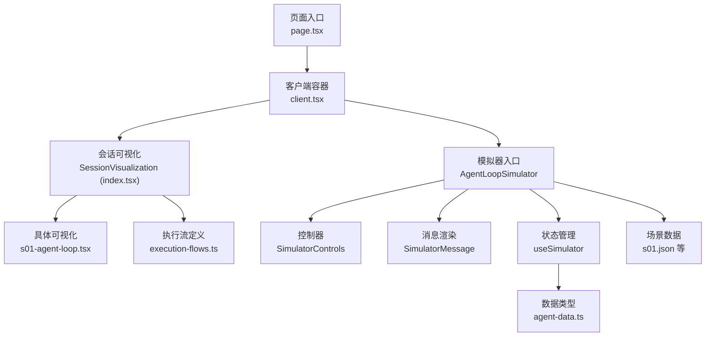
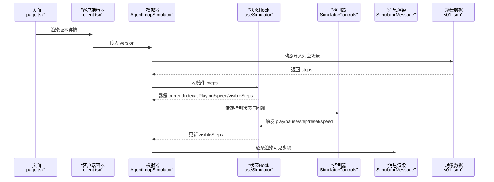
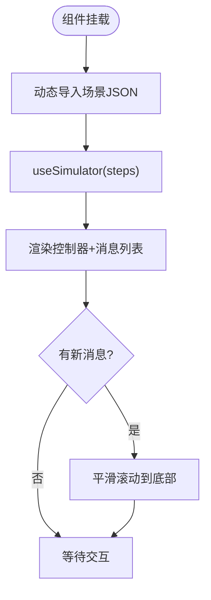
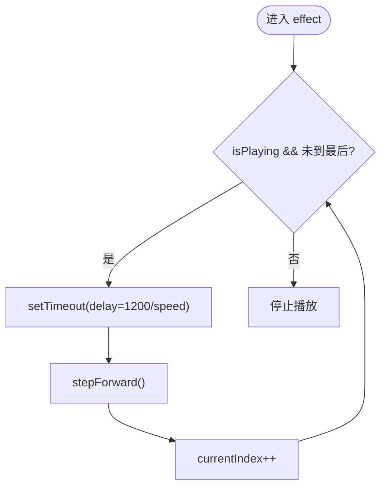
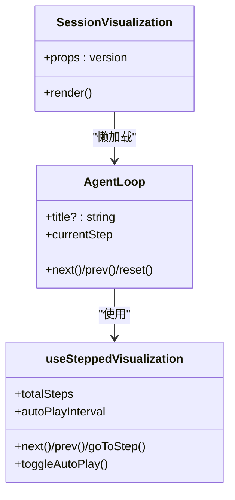
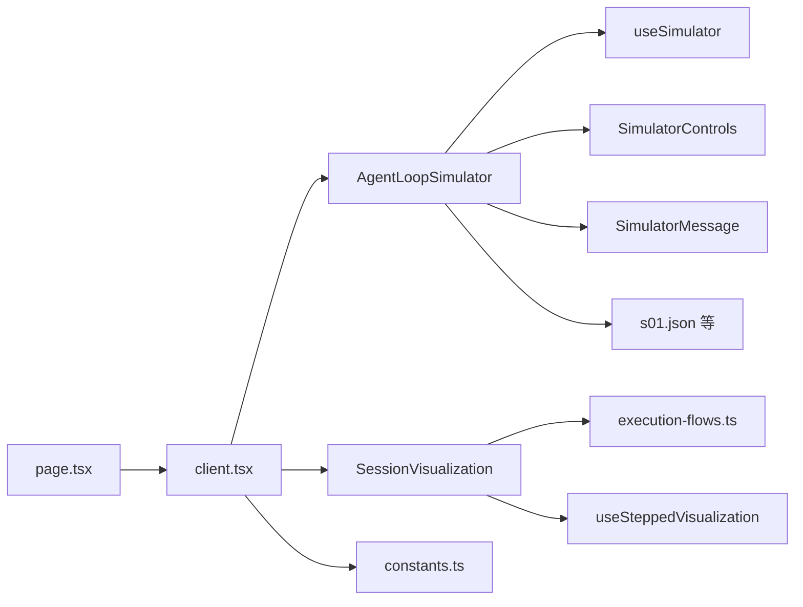

# 交互式模拟器

<cite>
**本文引用的文件**
- [agent-loop-simulator.tsx](file://web/src/components/simulator/agent-loop-simulator.tsx)
- [simulator-controls.tsx](file://web/src/components/simulator/simulator-controls.tsx)
- [simulator-message.tsx](file://web/src/components/simulator/simulator-message.tsx)
- [useSimulator.ts](file://web/src/hooks/useSimulator.ts)
- [useSteppedVisualization.ts](file://web/src/hooks/useSteppedVisualization.ts)
- [agent-data.ts](file://web/src/types/agent-data.ts)
- [s01.json](file://web/src/data/scenarios/s01.json)
- [execution-flows.ts](file://web/src/data/execution-flows.ts)
- [index.tsx](file://web/src/components/visualizations/index.tsx)
- [s01-agent-loop.tsx](file://web/src/components/visualizations/s01-agent-loop.tsx)
- [client.tsx](file://web/src/app/[locale]/(learn)/[version]/client.tsx)
- [page.tsx](file://web/src/app/[locale]/(learn)/[version]/page.tsx)
- [constants.ts](file://web/src/lib/constants.ts)
</cite>

## 目录
1. [简介](#简介)
2. [项目结构](#项目结构)
3. [核心组件](#核心组件)
4. [架构总览](#架构总览)
5. [详细组件分析](#详细组件分析)
6. [依赖关系分析](#依赖关系分析)
7. [性能考量](#性能考量)
8. [故障排查指南](#故障排查指南)
9. [结论](#结论)
10. [附录：扩展指南](#附录扩展指南)

## 简介
本文件系统性地解析“交互式模拟器”的实现，聚焦 Agent 循环模拟器的核心功能与实现机制。文档涵盖状态管理（模拟状态、执行进度、用户交互）、消息处理流程（生成、显示、交互响应）、控制器组件（播放控制、步骤导航、参数调节），并提供可扩展的指南（新增场景、自定义消息类型、定制交互行为）。目标是帮助读者在不深入代码细节的情况下理解整体设计，同时为二次开发提供清晰的参考路径。

## 项目结构
前端采用 Next.js + React 构建，模拟器相关能力集中在 web/src 下：
- 组件层：模拟器 UI（AgentLoopSimulator、SimulatorControls、SimulatorMessage）
- 逻辑层：Hook（useSimulator、useSteppedVisualization）
- 数据层：场景定义（scenarios/*.json）、执行流程图（execution-flows.ts）
- 页面集成：版本详情页（VersionDetailClient）将模拟器嵌入学习路径中
- 可视化：按版本动态加载的可视化组件（SessionVisualization）

图表来源
- [page.tsx:12-82](file://web/src/app/[locale]/(learn)/[version]/page.tsx#L12-L82)
- [client.tsx:28-83](file://web/src/app/[locale]/(learn)/[version]/client.tsx#L28-L83)
- [index.tsx:6-39](file://web/src/components/visualizations/index.tsx#L6-L39)
- [agent-loop-simulator.tsx:30-96](file://web/src/components/simulator/agent-loop-simulator.tsx#L30-L96)
- [useSimulator.ts:12-84](file://web/src/hooks/useSimulator.ts#L12-L84)
- [agent-data.ts:38-58](file://web/src/types/agent-data.ts#L38-L58)
- [s01.json:1-52](file://web/src/data/scenarios/s01.json#L1-L52)
- [execution-flows.ts:13-315](file://web/src/data/execution-flows.ts#L13-L315)

章节来源
- [page.tsx:12-82](file://web/src/app/[locale]/(learn)/[version]/page.tsx#L12-L82)
- [client.tsx:28-83](file://web/src/app/[locale]/(learn)/[version]/client.tsx#L28-L83)
- [index.tsx:6-39](file://web/src/components/visualizations/index.tsx#L6-L39)

## 核心组件
- AgentLoopSimulator：负责加载指定版本的场景数据，驱动模拟器播放与滚动展示。
- SimulatorControls：提供播放/暂停、单步前进、重置、速度调节等交互。
- SimulatorMessage：根据消息类型渲染不同样式与内容（用户、助手、工具调用/结果、系统事件）。
- useSimulator：维护模拟状态（当前索引、是否播放、速度），实现自动步进与边界控制。
- useSteppedVisualization：通用步进 Hook，用于可视化组件的逐步高亮与自动播放。
- 场景数据（s01.json 等）：以 JSON 描述一次完整的 Agent 对话流程（步骤序列）。
- execution-flows.ts：以节点与边定义各版本的执行流程图，供可视化组件使用。

章节来源
- [agent-loop-simulator.tsx:30-96](file://web/src/components/simulator/agent-loop-simulator.tsx#L30-L96)
- [simulator-controls.tsx:22-99](file://web/src/components/simulator/simulator-controls.tsx#L22-L99)
- [simulator-message.tsx:49-93](file://web/src/components/simulator/simulator-message.tsx#L49-L93)
- [useSimulator.ts:12-84](file://web/src/hooks/useSimulator.ts#L12-L84)
- [useSteppedVisualization.ts:23-84](file://web/src/hooks/useSteppedVisualization.ts#L23-L84)
- [s01.json:1-52](file://web/src/data/scenarios/s01.json#L1-L52)
- [execution-flows.ts:13-315](file://web/src/data/execution-flows.ts#L13-L315)

## 架构总览
下图展示了从页面到模拟器的完整调用链与数据流向：

图表来源
- [page.tsx:12-82](file://web/src/app/[locale]/(learn)/[version]/page.tsx#L12-L82)
- [client.tsx:28-83](file://web/src/app/[locale]/(learn)/[version]/client.tsx#L28-L83)
- [agent-loop-simulator.tsx:30-96](file://web/src/components/simulator/agent-loop-simulator.tsx#L30-L96)
- [useSimulator.ts:12-84](file://web/src/hooks/useSimulator.ts#L12-L84)
- [simulator-controls.tsx:22-99](file://web/src/components/simulator/simulator-controls.tsx#L22-L99)
- [simulator-message.tsx:49-93](file://web/src/components/simulator/simulator-message.tsx#L49-L93)
- [s01.json:1-52](file://web/src/data/scenarios/s01.json#L1-L52)

## 详细组件分析

### AgentLoopSimulator（模拟器容器）
- 职责：根据版本动态加载场景 JSON，初始化 useSimulator，管理滚动与动画呈现。
- 关键点：
  - 通过模块映射按需加载 s01..s12 的场景数据，减少首屏体积。
  - 监听 visibleSteps 变化自动滚动到底部，保证最新消息可见。
  - 将控制器与消息列表组合在统一容器中，保持 UI 一致性。

图表来源
- [agent-loop-simulator.tsx:30-96](file://web/src/components/simulator/agent-loop-simulator.tsx#L30-L96)

章节来源
- [agent-loop-simulator.tsx:30-96](file://web/src/components/simulator/agent-loop-simulator.tsx#L30-L96)

### useSimulator（状态与播放引擎）
- 职责：维护 currentIndex、isPlaying、speed；实现自动步进、边界检测、定时器清理。
- 关键点：
  - 自动播放基于 setTimeout，延迟 = 1200 / speed。
  - 到达最后一步时自动停止播放并标记完成。
  - 提供 stepForward、play、pause、reset、setSpeed 等方法供控制器调用。
  - 输出 visibleSteps = steps.slice(0, currentIndex + 1)，便于上层渲染。

图表来源
- [useSimulator.ts:12-84](file://web/src/hooks/useSimulator.ts#L12-L84)

章节来源
- [useSimulator.ts:12-84](file://web/src/hooks/useSimulator.ts#L12-L84)

### SimulatorControls（播放控制）
- 职责：提供播放/暂停、单步、重置、速度选择按钮，并显示当前进度。
- 关键点：
  - 禁用状态：当 isComplete 时禁用播放与单步。
  - 速度档位：0.5x、1x、2x、4x，通过 onSpeedChange 回传。
  - 进度指示：显示 “当前步骤/总步骤”。

章节来源
- [simulator-controls.tsx:22-99](file://web/src/components/simulator/simulator-controls.tsx#L22-L99)

### SimulatorMessage（消息渲染）
- 职责：根据 SimStep.type 渲染不同样式与内容，支持工具调用/结果的代码块展示。
- 关键点：
  - 类型配置：user_message、assistant_text、tool_call、tool_result、system_event。
  - 工具消息使用等宽代码块展示 content，非工具消息使用段落文本。
  - 附带 annotation 作为解释性注释。

章节来源
- [simulator-message.tsx:49-93](file://web/src/components/simulator/simulator-message.tsx#L49-L93)

### 场景数据与执行流
- 场景数据（如 s01.json）：以 steps 数组描述一次完整的 Agent 交互过程，包含用户输入、模型回复、工具调用与结果、系统事件等。
- 执行流（execution-flows.ts）：以 nodes 与 edges 定义每个版本的执行流程图，配合可视化组件进行逐步高亮。

章节来源
- [s01.json:1-52](file://web/src/data/scenarios/s01.json#L1-L52)
- [execution-flows.ts:13-315](file://web/src/data/execution-flows.ts#L13-L315)

### 可视化组件（以 s01 为例）
- SessionVisualization：根据版本懒加载对应可视化组件。
- s01-agent-loop.tsx：使用 useSteppedVisualization 驱动逐步高亮，左侧 SVG 流程图，右侧消息累积视图。

图表来源
- [index.tsx:6-39](file://web/src/components/visualizations/index.tsx#L6-L39)
- [s01-agent-loop.tsx:138-416](file://web/src/components/visualizations/s01-agent-loop.tsx#L138-L416)
- [useSteppedVisualization.ts:23-84](file://web/src/hooks/useSteppedVisualization.ts#L23-L84)

章节来源
- [index.tsx:6-39](file://web/src/components/visualizations/index.tsx#L6-L39)
- [s01-agent-loop.tsx:138-416](file://web/src/components/visualizations/s01-agent-loop.tsx#L138-L416)

## 依赖关系分析
- 页面层：page.tsx 负责静态参数与元信息，client.tsx 组装 Tab 与子组件。
- 模拟器层：AgentLoopSimulator 依赖 useSimulator、SimulatorControls、SimulatorMessage 与场景数据。
- 可视化层：SessionVisualization 根据版本懒加载具体可视化组件，这些组件依赖 execution-flows.ts 与 useSteppedVisualization。
- 类型与常量：agent-data.ts 定义消息与场景类型；constants.ts 定义版本顺序与元信息。

图表来源
- [page.tsx:12-82](file://web/src/app/[locale]/(learn)/[version]/page.tsx#L12-L82)
- [client.tsx:28-83](file://web/src/app/[locale]/(learn)/[version]/client.tsx#L28-L83)
- [agent-loop-simulator.tsx:30-96](file://web/src/components/simulator/agent-loop-simulator.tsx#L30-L96)
- [useSimulator.ts:12-84](file://web/src/hooks/useSimulator.ts#L12-L84)
- [execution-flows.ts:13-315](file://web/src/data/execution-flows.ts#L13-L315)
- [useSteppedVisualization.ts:23-84](file://web/src/hooks/useSteppedVisualization.ts#L23-L84)
- [constants.ts:1-38](file://web/src/lib/constants.ts#L1-L38)

章节来源
- [page.tsx:12-82](file://web/src/app/[locale]/(learn)/[version]/page.tsx#L12-L82)
- [client.tsx:28-83](file://web/src/app/[locale]/(learn)/[version]/client.tsx#L28-L83)
- [agent-loop-simulator.tsx:30-96](file://web/src/components/simulator/agent-loop-simulator.tsx#L30-L96)
- [useSimulator.ts:12-84](file://web/src/hooks/useSimulator.ts#L12-L84)
- [execution-flows.ts:13-315](file://web/src/data/execution-flows.ts#L13-L315)
- [useSteppedVisualization.ts:23-84](file://web/src/hooks/useSteppedVisualization.ts#L23-L84)
- [constants.ts:1-38](file://web/src/lib/constants.ts#L1-L38)

## 性能考量
- 动态导入场景：按版本按需加载 JSON，降低初始包体。
- 自动滚动：仅在 visibleSteps 长度变化时触发，避免频繁重排。
- 定时器管理：useSimulator 在切换状态或卸载时清理定时器，防止内存泄漏。
- 懒加载可视化：SessionVisualization 使用 React.lazy 与 Suspense，按需加载复杂可视化组件。
- 渲染优化：消息列表使用 key 与动画库的 popLayout，提升过渡体验。

## 故障排查指南
- 无消息显示：检查场景 JSON 是否存在且 steps 非空；确认 useSimulator 已接收 steps。
- 无法播放：确认 isComplete 是否为真（已到末尾会禁用播放）；检查 speed 是否为有效值。
- 自动播放不停止：检查 useEffect 清理逻辑是否正确；确保到达最后一步后 isPlaying 被置为 false。
- 滚动异常：确认 scrollRef 存在且 visibleSteps 变化触发滚动逻辑。
- 可视化不显示：确认版本对应的可视化组件已注册到 visualizations 映射；检查懒加载是否成功。

章节来源
- [useSimulator.ts:12-84](file://web/src/hooks/useSimulator.ts#L12-L84)
- [agent-loop-simulator.tsx:30-96](file://web/src/components/simulator/agent-loop-simulator.tsx#L30-L96)
- [index.tsx:6-39](file://web/src/components/visualizations/index.tsx#L6-L39)

## 结论
该交互式模拟器以“场景 JSON + 状态 Hook + 组件化 UI”的方式实现了可插拔的 Agent 循环演示。通过统一的类型定义与模块化组织，既保证了易用性，又具备良好的扩展性。结合执行流程图与可视化组件，用户可以直观理解不同版本的 Agent 工作流差异。

## 附录：扩展指南

### 新增场景
- 在 web/src/data/scenarios 下新增 JSON 文件（例如 s13.json），遵循 agent-data.ts 中的 Scenario 与 SimStep 类型定义。
- 在 AgentLoopSimulator 的 scenarioModules 中添加映射，以便通过版本标识动态加载。
- 如需在可视化中体现，可在 execution-flows.ts 中补充对应版本的节点与边定义，并在 SessionVisualization 中注册可视化组件。

章节来源
- [agent-loop-simulator.tsx:11-24](file://web/src/components/simulator/agent-loop-simulator.tsx#L11-L24)
- [agent-data.ts:38-58](file://web/src/types/agent-data.ts#L38-L58)
- [execution-flows.ts:13-315](file://web/src/data/execution-flows.ts#L13-L315)
- [index.tsx:6-39](file://web/src/components/visualizations/index.tsx#L6-L39)

### 自定义消息类型
- 在 agent-data.ts 的 SimStepType 中添加新类型（例如 custom_action）。
- 在 SimulatorMessage 的 TYPE_CONFIG 中为新类型添加图标、标签与样式类。
- 在场景 JSON 中使用新类型编写步骤，确保 content 与 annotation 字段符合预期。

章节来源
- [agent-data.ts:38-58](file://web/src/types/agent-data.ts#L38-L58)
- [simulator-message.tsx:13-47](file://web/src/components/simulator/simulator-message.tsx#L13-L47)

### 定制交互行为
- 调整播放速度：通过 SimulatorControls 的 SPEEDS 数组修改可用档位，或在 useSimulator 中调整 delay 计算方式。
- 增加交互：在 useSimulator 中扩展方法（如 jumpToStep、seek），并在控制器中暴露相应按钮。
- 自定义自动播放间隔：对于可视化组件，可通过 useSteppedVisualization 的 autoPlayInterval 参数调整节奏。

章节来源
- [simulator-controls.tsx:20-99](file://web/src/components/simulator/simulator-controls.tsx#L20-L99)
- [useSimulator.ts:12-84](file://web/src/hooks/useSimulator.ts#L12-L84)
- [useSteppedVisualization.ts:23-84](file://web/src/hooks/useSteppedVisualization.ts#L23-L84)