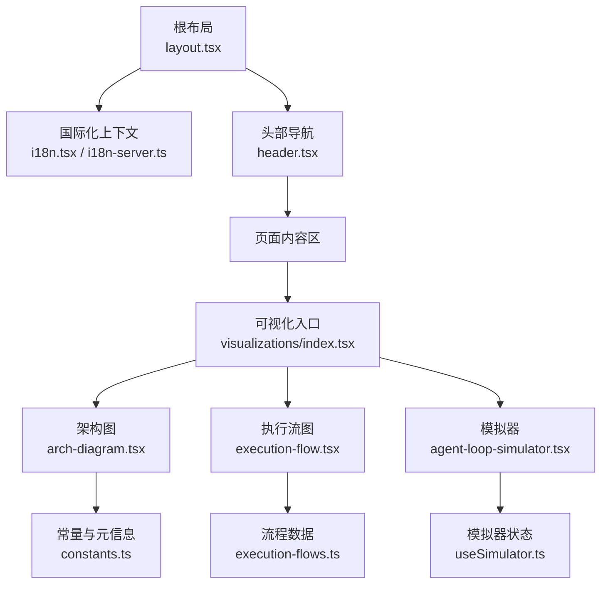
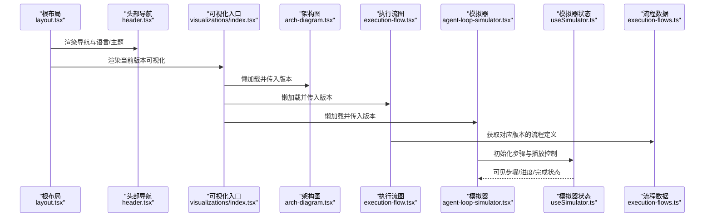
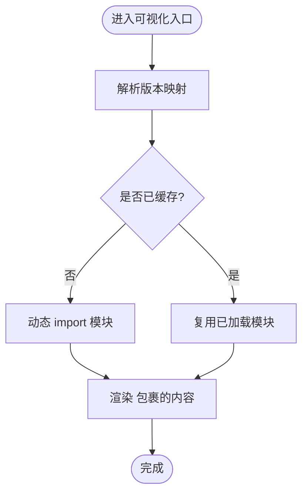
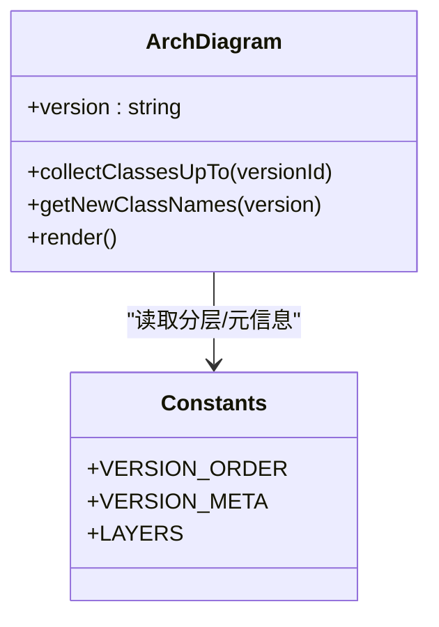
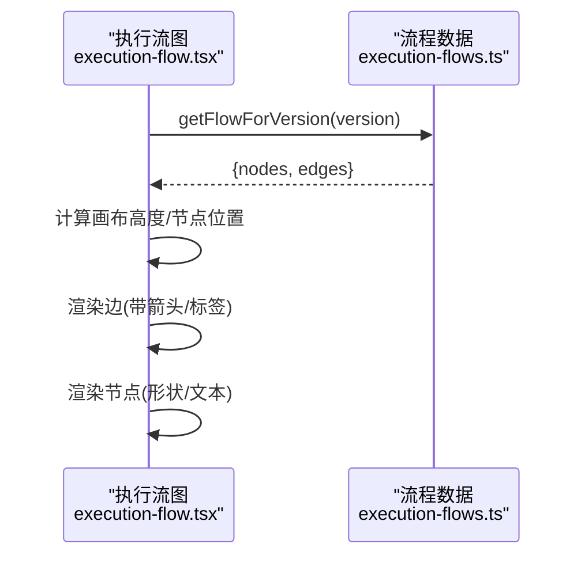
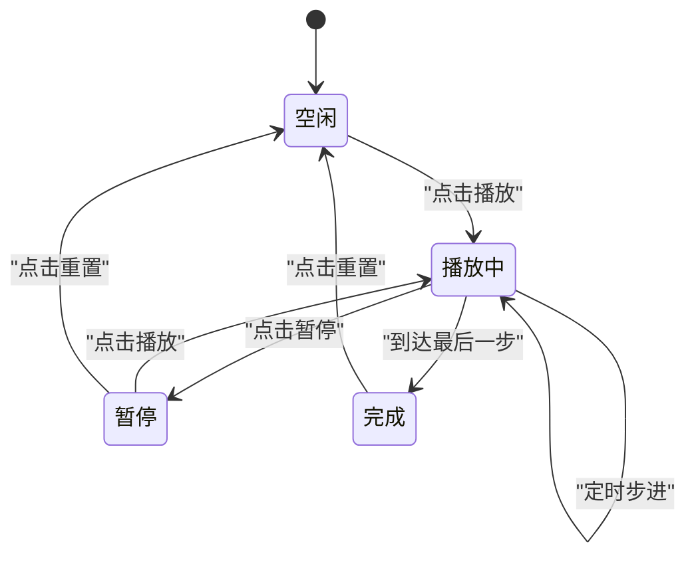
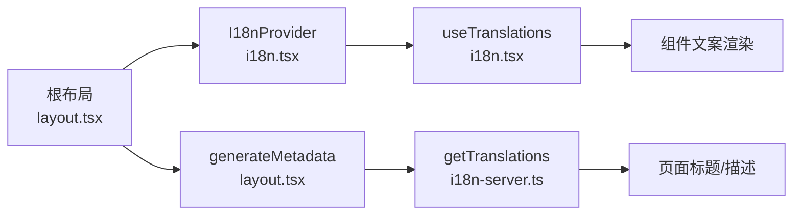

# 前端可视化系统

<cite>
**本文引用的文件**
- [package.json](file://web/package.json)
- [next.config.ts](file://web/next.config.ts)
- [layout.tsx](file://web/src/app/[locale]/layout.tsx)
- [i18n.tsx](file://web/src/lib/i18n.tsx)
- [i18n-server.ts](file://web/src/lib/i18n-server.ts)
- [index.tsx](file://web/src/components/visualizations/index.tsx)
- [agent-loop-simulator.tsx](file://web/src/components/simulator/agent-loop-simulator.tsx)
- [useSimulator.ts](file://web/src/hooks/useSimulator.ts)
- [arch-diagram.tsx](file://web/src/components/architecture/arch-diagram.tsx)
- [execution-flow.tsx](file://web/src/components/architecture/execution-flow.tsx)
- [header.tsx](file://web/src/components/layout/header.tsx)
- [constants.ts](file://web/src/lib/constants.ts)
- [execution-flows.ts](file://web/src/data/execution-flows.ts)
- [agent-data.ts](file://web/src/types/agent-data.ts)
- [en.json](file://web/src/i18n/messages/en.json)
</cite>

## 目录
1. [简介](#简介)
2. [项目结构](#项目结构)
3. [核心组件](#核心组件)
4. [架构总览](#架构总览)
5. [详细组件分析](#详细组件分析)
6. [依赖关系分析](#依赖关系分析)
7. [性能考虑](#性能考虑)
8. [故障排查指南](#故障排查指南)
9. [结论](#结论)
10. [附录](#附录)

## 简介
本文件系统性地梳理了基于 Next.js 的前端可视化系统的架构与实现，覆盖：
- 应用整体架构与路由、国际化、主题切换等基础能力
- 可视化组件的组织方式与按需加载策略
- 执行流程图与消息流可视化的渲染机制
- 模拟器系统的交互逻辑与状态管理
- 多语言支持与国际化实现
- 前端开发规范、样式定制与性能优化建议
- 用户交互流程与用户体验设计要点

## 项目结构
本项目采用 Next.js App Router，按功能域组织代码：
- 应用层：[layout.tsx](file://web/src/app/[locale]/layout.tsx) 提供根布局、国际化上下文注入与全局样式
- 国际化：客户端与服务端分别通过 [i18n.tsx](file://web/src/lib/i18n.tsx)、[i18n-server.ts](file://web/src/lib/i18n-server.ts) 暴露翻译能力
- 可视化：[index.tsx](file://web/src/components/visualizations/index.tsx) 统一注册并懒加载各版本可视化组件
- 架构视图：[arch-diagram.tsx](file://web/src/components/architecture/arch-diagram.tsx) 展示类演进；[execution-flow.tsx](file://web/src/components/architecture/execution-flow.tsx) 渲染执行流程图
- 模拟器：[agent-loop-simulator.tsx](file://web/src/components/simulator/agent-loop-simulator.tsx) + [useSimulator.ts](file://web/src/hooks/useSimulator.ts) 驱动步骤播放
- 数据与类型：[execution-flows.ts](file://web/src/data/execution-flows.ts) 定义流程节点与边；[agent-data.ts](file://web/src/types/agent-data.ts) 定义共享类型
- 常量与元信息：[constants.ts](file://web/src/lib/constants.ts) 维护版本顺序、分层与元信息
- 导航与主题：[header.tsx](file://web/src/components/layout/header.tsx) 提供导航、语言切换与深色模式
- 构建配置：[next.config.ts](file://web/next.config.ts) 启用静态导出与图片优化关闭；[package.json](file://web/package.json) 声明依赖与脚本

图表来源
- [layout.tsx:29-59](file://web/src/app/[locale]/layout.tsx#L29-L59)
- [i18n.tsx:16-36](file://web/src/lib/i18n.tsx#L16-L36)
- [i18n-server.ts:9-16](file://web/src/lib/i18n-server.ts#L9-L16)
- [index.tsx:24-39](file://web/src/components/visualizations/index.tsx#L24-L39)
- [arch-diagram.tsx:105-228](file://web/src/components/architecture/arch-diagram.tsx#L105-L228)
- [execution-flow.tsx:188-243](file://web/src/components/architecture/execution-flow.tsx#L188-L243)
- [agent-loop-simulator.tsx:30-96](file://web/src/components/simulator/agent-loop-simulator.tsx#L30-L96)
- [useSimulator.ts:12-84](file://web/src/hooks/useSimulator.ts#L12-L84)
- [execution-flows.ts:13-315](file://web/src/data/execution-flows.ts#L13-L315)
- [constants.ts:1-38](file://web/src/lib/constants.ts#L1-L38)

章节来源
- [layout.tsx:29-59](file://web/src/app/[locale]/layout.tsx#L29-L59)
- [package.json:1-39](file://web/package.json#L1-L39)
- [next.config.ts:1-10](file://web/next.config.ts#L1-L10)

## 核心组件
- 可视化入口与懒加载：通过映射表将版本标识与组件模块关联，使用 React.lazy 与 Suspense 实现按需加载与占位体验。
- 架构图组件：根据版本动态收集已引入的类，标注新增项，并以层级动画呈现。
- 执行流图组件：读取流程定义（节点与边），以 SVG 绘制节点形状与连线，支持逐步动画。
- 模拟器：基于场景步骤数据驱动播放、暂停、步进、重置与速度调节，自动滚动至最新消息。
- 国际化：客户端 Context 提供 useTranslations/useLocale，服务端 getTranslations 用于 SSR 元信息与标题。
- 导航与主题：Header 提供多语言切换、深色模式持久化与响应式菜单。

章节来源
- [index.tsx:6-39](file://web/src/components/visualizations/index.tsx#L6-L39)
- [arch-diagram.tsx:71-103](file://web/src/components/architecture/arch-diagram.tsx#L71-L103)
- [execution-flow.tsx:21-42](file://web/src/components/architecture/execution-flow.tsx#L21-L42)
- [agent-loop-simulator.tsx:30-96](file://web/src/components/simulator/agent-loop-simulator.tsx#L30-L96)
- [i18n.tsx:16-36](file://web/src/lib/i18n.tsx#L16-L36)
- [i18n-server.ts:9-16](file://web/src/lib/i18n-server.ts#L9-L16)
- [header.tsx:22-173](file://web/src/components/layout/header.tsx#L22-L173)

## 架构总览
下图展示了从根布局到具体可视化与模拟器的调用链路与数据流向。

图表来源
- [layout.tsx:29-59](file://web/src/app/[locale]/layout.tsx#L29-L59)
- [index.tsx:24-39](file://web/src/components/visualizations/index.tsx#L24-L39)
- [execution-flow.tsx:188-243](file://web/src/components/architecture/execution-flow.tsx#L188-L243)
- [execution-flows.ts:13-315](file://web/src/data/execution-flows.ts#L13-L315)
- [agent-loop-simulator.tsx:30-96](file://web/src/components/simulator/agent-loop-simulator.tsx#L30-L96)
- [useSimulator.ts:12-84](file://web/src/hooks/useSimulator.ts#L12-L84)

## 详细组件分析

### 可视化入口与懒加载
- 职责：集中管理 s01-s12 的可视化组件映射，按版本懒加载，并提供统一的占位与错误边界。
- 关键点：
  - 使用 React.lazy 与 Suspense 降低首屏体积
  - 通过国际化键值显示标题
  - 为每个版本预留最小高度容器，避免布局抖动

图表来源
- [index.tsx:6-39](file://web/src/components/visualizations/index.tsx#L6-L39)

章节来源
- [index.tsx:6-39](file://web/src/components/visualizations/index.tsx#L6-L39)

### 架构图组件（类演进）
- 职责：根据版本收集历史类集合，标注新增类，按层级着色，展示工具集。
- 关键点：
  - 通过版本顺序累积类集合，去重后按引入版本排序
  - 使用 diff 或版本元信息判断“新增”标记
  - 依据分层常量计算边框与背景色

图表来源
- [arch-diagram.tsx:71-103](file://web/src/components/architecture/arch-diagram.tsx#L71-L103)
- [constants.ts:1-38](file://web/src/lib/constants.ts#L1-L38)

章节来源
- [arch-diagram.tsx:105-228](file://web/src/components/architecture/arch-diagram.tsx#L105-L228)
- [constants.ts:1-38](file://web/src/lib/constants.ts#L1-L38)

### 执行流图组件（SVG 流程图）
- 职责：根据版本对应的流程定义渲染节点与边，支持箭头与标签。
- 关键点：
  - 节点类型决定形状（开始/结束/决策/子流程/过程）
  - 边路径计算考虑节点尺寸与类型差异
  - 使用 motion 进行入场动画

图表来源
- [execution-flow.tsx:188-243](file://web/src/components/architecture/execution-flow.tsx#L188-L243)
- [execution-flows.ts:13-315](file://web/src/data/execution-flows.ts#L13-L315)

章节来源
- [execution-flow.tsx:21-42](file://web/src/components/architecture/execution-flow.tsx#L21-L42)
- [execution-flow.tsx:188-243](file://web/src/components/architecture/execution-flow.tsx#L188-L243)
- [execution-flows.ts:13-315](file://web/src/data/execution-flows.ts#L13-L315)

### 模拟器系统与状态管理
- 职责：加载场景步骤数据，驱动播放/暂停/步进/重置/变速，自动滚动到最新消息。
- 关键点：
  - 场景数据按版本动态导入，减少初始包体
  - useSimulator 封装定时器与状态机，保证播放与步进的一致性
  - AnimatePresence 增强消息出现/消失动效

图表来源
- [useSimulator.ts:12-84](file://web/src/hooks/useSimulator.ts#L12-L84)
- [agent-loop-simulator.tsx:30-96](file://web/src/components/simulator/agent-loop-simulator.tsx#L30-L96)

章节来源
- [agent-loop-simulator.tsx:11-96](file://web/src/components/simulator/agent-loop-simulator.tsx#L11-L96)
- [useSimulator.ts:12-84](file://web/src/hooks/useSimulator.ts#L12-L84)

### 国际化与多语言实现
- 客户端：I18nProvider 提供 locale 与 messages，useTranslations 返回命名空间访问器，useLocale 获取当前语言。
- 服务端：getTranslations 在生成静态参数与元信息时提供回退策略（优先本地，其次英文）。
- 导航：Header 支持 EN/中文/日本語 切换，通过替换 URL 中的 locale 段实现。

图表来源
- [layout.tsx:16-27](file://web/src/app/[locale]/layout.tsx#L16-L27)
- [i18n.tsx:16-36](file://web/src/lib/i18n.tsx#L16-L36)
- [i18n-server.ts:9-16](file://web/src/lib/i18n-server.ts#L9-L16)
- [header.tsx:48-51](file://web/src/components/layout/header.tsx#L48-L51)

章节来源
- [i18n.tsx:16-36](file://web/src/lib/i18n.tsx#L16-L36)
- [i18n-server.ts:9-16](file://web/src/lib/i18n-server.ts#L9-L16)
- [header.tsx:48-51](file://web/src/components/layout/header.tsx#L48-L51)
- [en.json:1-77](file://web/src/i18n/messages/en.json#L1-L77)

### 用户交互流程与体验设计
- 语言切换：Header 中通过替换 URL 中的 locale 段触发重新加载，保持路由一致性。
- 深色模式：启动时读取 localStorage 与系统偏好，设置 documentElement 的 dark 类，并在 Header 中提供切换按钮。
- 可视化交互：懒加载避免首屏阻塞；Suspense 占位提升感知性能；执行流与架构图使用入场动画引导注意力。
- 模拟器体验：自动滚动至最新消息；播放/暂停/步进/重置/变速提供完整控制；空态提示引导操作。

章节来源
- [header.tsx:30-51](file://web/src/components/layout/header.tsx#L30-L51)
- [layout.tsx:41-48](file://web/src/app/[locale]/layout.tsx#L41-L48)
- [index.tsx:24-39](file://web/src/components/visualizations/index.tsx#L24-L39)
- [execution-flow.tsx:188-243](file://web/src/components/architecture/execution-flow.tsx#L188-L243)
- [agent-loop-simulator.tsx:44-51](file://web/src/components/simulator/agent-loop-simulator.tsx#L44-L51)

## 依赖关系分析
- 组件耦合：
  - 可视化入口对各个可视化组件弱耦合（通过字符串键映射）
  - 执行流图仅依赖流程数据与类型定义
  - 模拟器依赖 useSimulator 与场景数据，UI 解耦良好
- 外部依赖：
  - framer-motion 提供动画
  - lucide-react 提供图标
  - Next.js 提供路由、SSR/静态导出能力
- 潜在循环依赖：未发现直接循环引用；数据与类型集中在 data 与 types 目录，利于维护。

```mermaid
graph TB
VIZ["visualizations/index.tsx"] --> S01["s01-agent-loop"]
VIZ --> S02["s02-tool-dispatch"]
VIZ --> S03["s03-todo-write"]
VIZ --> S04["s04-subagent"]
VIZ --> S05["s05-skill-loading"]
VIZ --> S06["s06-context-compact"]
VIZ --> S07["s07-task-system"]
VIZ --> S08["s08-background-tasks"]
VIZ --> S09["s09-agent-teams"]
VIZ --> S10["s10-team-protocols"]
VIZ --> S11["s11-autonomous-agents"]
VIZ --> S12["s12-worktree-task-isolation"]
ARCH["arch-diagram.tsx"] --> CONST["constants.ts"]
FLOW["execution-flow.tsx"] --> DATA["execution-flows.ts"]
SIM["agent-loop-simulator.tsx"] --> HOOK["useSimulator.ts"]
```

图表来源
- [index.tsx:6-22](file://web/src/components/visualizations/index.tsx#L6-L22)
- [arch-diagram.tsx:105-228](file://web/src/components/architecture/arch-diagram.tsx#L105-L228)
- [execution-flow.tsx:188-243](file://web/src/components/architecture/execution-flow.tsx#L188-L243)
- [execution-flows.ts:13-315](file://web/src/data/execution-flows.ts#L13-L315)
- [agent-loop-simulator.tsx:30-96](file://web/src/components/simulator/agent-loop-simulator.tsx#L30-L96)
- [useSimulator.ts:12-84](file://web/src/hooks/useSimulator.ts#L12-L84)
- [constants.ts:1-38](file://web/src/lib/constants.ts#L1-L38)

章节来源
- [index.tsx:6-22](file://web/src/components/visualizations/index.tsx#L6-L22)
- [execution-flow.tsx:188-243](file://web/src/components/architecture/execution-flow.tsx#L188-L243)
- [execution-flows.ts:13-315](file://web/src/data/execution-flows.ts#L13-L315)
- [agent-loop-simulator.tsx:30-96](file://web/src/components/simulator/agent-loop-simulator.tsx#L30-L96)
- [useSimulator.ts:12-84](file://web/src/hooks/useSimulator.ts#L12-L84)
- [constants.ts:1-38](file://web/src/lib/constants.ts#L1-L38)

## 性能考虑
- 首屏优化：
  - 使用 React.lazy + Suspense 对可视化组件进行分块加载，减少初始包体
  - 静态导出（output: export）与关闭图片优化，便于部署与 CDN 缓存
- 运行时优化：
  - 执行流图使用 SVG 原生元素，避免重型图形库开销
  - 模拟器使用 setTimeout 控制步进步调，避免频繁重排
  - 列表渲染使用 key 与稳定索引，配合 AnimatePresence 提升动画性能
- 可维护性：
  - 类型集中定义于 agent-data.ts，确保数据契约一致
  - 常量与元信息集中于 constants.ts，便于扩展新层级与新版本

章节来源
- [next.config.ts:3-7](file://web/next.config.ts#L3-L7)
- [index.tsx:24-39](file://web/src/components/visualizations/index.tsx#L24-L39)
- [execution-flow.tsx:188-243](file://web/src/components/architecture/execution-flow.tsx#L188-L243)
- [agent-loop-simulator.tsx:44-51](file://web/src/components/simulator/agent-loop-simulator.tsx#L44-L51)
- [agent-data.ts:1-73](file://web/src/types/agent-data.ts#L1-L73)
- [constants.ts:1-38](file://web/src/lib/constants.ts#L1-L38)

## 故障排查指南
- 国际化缺失键：
  - 现象：组件显示原始键名
  - 处理：检查 en.json 及目标语言文件是否包含对应命名空间与键；服务端 getTranslations 会回退到英文
- 懒加载失败：
  - 现象：Suspense 占位一直显示
  - 处理：确认版本标识与映射一致；检查网络请求是否成功；查看控制台是否有模块未找到错误
- 模拟器不播放：
  - 现象：点击播放无反应
  - 处理：确认场景数据 steps 存在且非空；检查 useSimulator 的 isPlaying 与 currentIndex 状态；验证定时器清理逻辑
- 执行流图空白：
  - 现象：无节点或边
  - 处理：确认 getFlowForVersion 返回有效数据；检查 nodes/edges 的 id 引用是否正确

章节来源
- [i18n-server.ts:9-16](file://web/src/lib/i18n-server.ts#L9-L16)
- [index.tsx:24-39](file://web/src/components/visualizations/index.tsx#L24-L39)
- [useSimulator.ts:59-69](file://web/src/hooks/useSimulator.ts#L59-L69)
- [execution-flow.tsx:188-243](file://web/src/components/architecture/execution-flow.tsx#L188-L243)
- [execution-flows.ts:313-315](file://web/src/data/execution-flows.ts#L313-L315)

## 结论
该前端可视化系统以 Next.js 为基础，结合懒加载、SVG 流程图与轻量状态管理，实现了清晰、可扩展的架构。通过统一的可视化入口、完善的国际化与主题能力，以及可复用的模拟器框架，既保证了学习路径的可读性，也为后续扩展新的可视化与交互提供了坚实基础。建议在后续迭代中继续完善错误边界、埋点与性能监控，进一步提升用户体验与可维护性。

## 附录
- 构建与运行
  - 安装依赖：npm install
  - 开发：npm run dev（预执行 extract 脚本）
  - 构建：npm run build（静态导出）
  - 启动：npm run start
- 关键配置
  - next.config.ts 启用静态导出与 trailingSlash
  - package.json 声明 Next、React、framer-motion 等依赖

章节来源
- [package.json:5-11](file://web/package.json#L5-L11)
- [next.config.ts:3-7](file://web/next.config.ts#L3-L7)