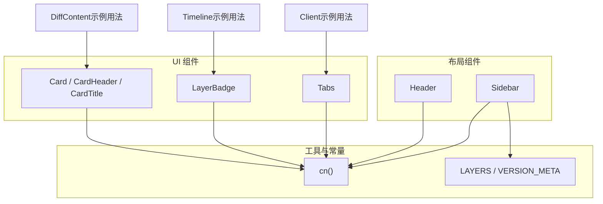
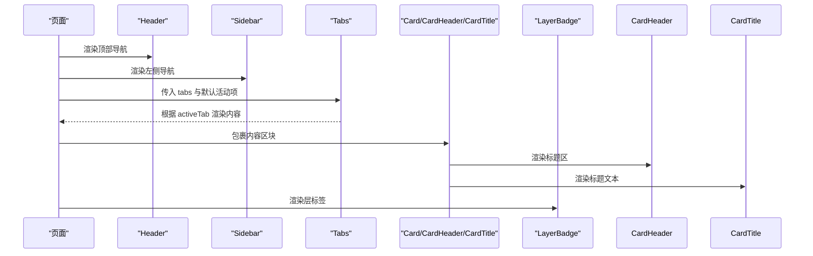
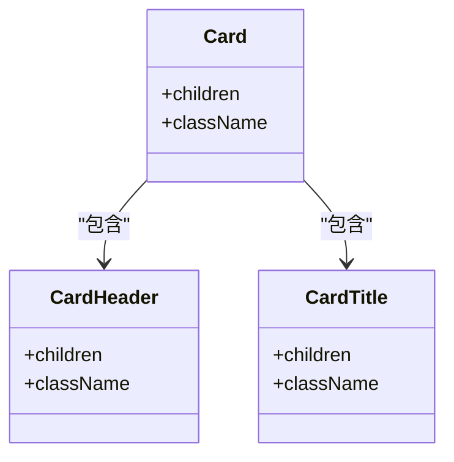
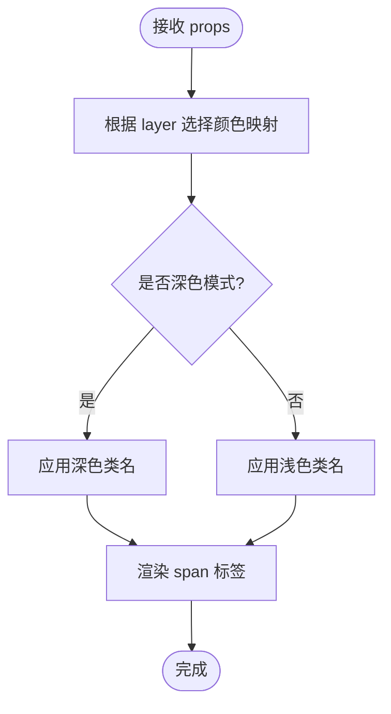
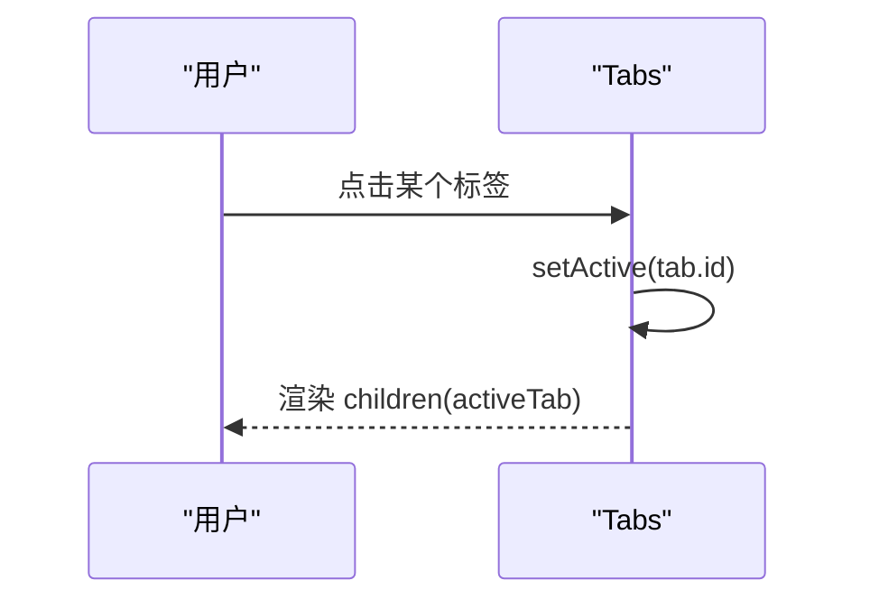
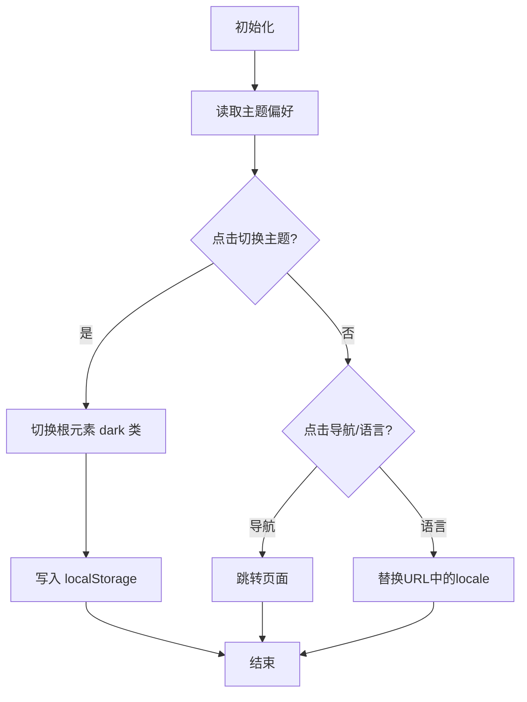
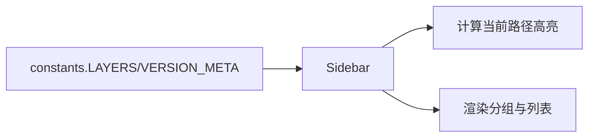
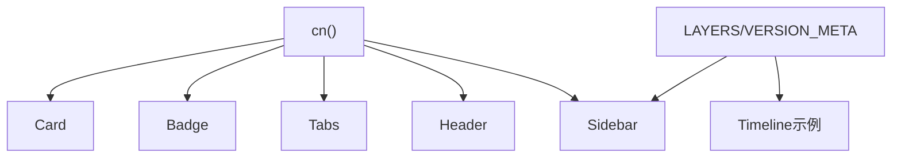

# 共享UI组件

<cite>
**本文引用的文件**
- [card.tsx](file://web/src/components/ui/card.tsx)
- [badge.tsx](file://web/src/components/ui/badge.tsx)
- [tabs.tsx](file://web/src/components/ui/tabs.tsx)
- [header.tsx](file://web/src/components/layout/header.tsx)
- [sidebar.tsx](file://web/src/components/layout/sidebar.tsx)
- [utils.ts](file://web/src/lib/utils.ts)
- [constants.ts](file://web/src/lib/constants.ts)
- [client.tsx](file://web/src/app/[locale]/(learn)/[version]/client.tsx)
- [diff-content.tsx](file://web/src/app/[locale]/(learn)/[version]/diff/diff-content.tsx)
- [timeline.tsx](file://web/src/components/timeline/timeline.tsx)
</cite>

## 目录
1. [简介](#简介)
2. [项目结构](#项目结构)
3. [核心组件](#核心组件)
4. [架构总览](#架构总览)
5. [详细组件分析](#详细组件分析)
6. [依赖关系分析](#依赖关系分析)
7. [性能考量](#性能考量)
8. [故障排查指南](#故障排查指南)
9. [结论](#结论)
10. [附录：使用指南与样式覆盖](#附录使用指南与样式覆盖)

## 简介
本文件面向共享UI组件库的设计与实现规范，聚焦以下目标：
- 卡片组件的变体：内容布局、边框样式与阴影效果
- 标签组件的状态管理：激活状态、禁用状态与颜色主题
- 布局组件的结构：头部导航、侧边栏菜单与响应式适配
- 组件使用指南：Props接口、事件处理与样式覆盖方法

所有说明均基于仓库中的实际代码实现，确保可追溯与可落地。

## 项目结构
共享UI组件位于 web/src/components/ui，布局组件位于 web/src/components/layout，工具函数与常量分别位于 web/src/lib/utils.ts 与 web/src/lib/constants.ts。页面通过 Next.js 路由组织，并在多个页面中复用这些组件。

图表来源
- [card.tsx:1-40](file://web/src/components/ui/card.tsx#L1-L40)
- [badge.tsx:1-35](file://web/src/components/ui/badge.tsx#L1-L35)
- [tabs.tsx:1-38](file://web/src/components/ui/tabs.tsx#L1-L38)
- [header.tsx:1-173](file://web/src/components/layout/header.tsx#L1-L173)
- [sidebar.tsx:1-67](file://web/src/components/layout/sidebar.tsx#L1-L67)
- [utils.ts:1-4](file://web/src/lib/utils.ts#L1-L4)
- [constants.ts:1-38](file://web/src/lib/constants.ts#L1-L38)
- [client.tsx:40-83](file://web/src/app/[locale]/(learn)/[version]/client.tsx#L40-L83)
- [diff-content.tsx:80-180](file://web/src/app/[locale]/(learn)/[version]/diff/diff-content.tsx#L80-L180)
- [timeline.tsx:1-200](file://web/src/components/timeline/timeline.tsx#L1-L200)

章节来源
- [card.tsx:1-40](file://web/src/components/ui/card.tsx#L1-L40)
- [badge.tsx:1-35](file://web/src/components/ui/badge.tsx#L1-L35)
- [tabs.tsx:1-38](file://web/src/components/ui/tabs.tsx#L1-L38)
- [header.tsx:1-173](file://web/src/components/layout/header.tsx#L1-L173)
- [sidebar.tsx:1-67](file://web/src/components/layout/sidebar.tsx#L1-L67)
- [utils.ts:1-4](file://web/src/lib/utils.ts#L1-L4)
- [constants.ts:1-38](file://web/src/lib/constants.ts#L1-L38)

## 核心组件
- 卡片组件（Card、CardHeader、CardTitle）：提供基础容器、标题区与标题文本，支持深色模式与圆角、边框、内边距与阴影。
- 标签组件（LayerBadge）：按“层”维度渲染彩色小标签，内置多套明暗主题配色。
- 标签页组件（Tabs）：基于本地状态切换活动标签，渲染对应内容区域。
- 头部导航（Header）：响应式导航、语言切换、深色模式切换与移动端折叠菜单。
- 侧边栏（Sidebar）：按“层”分组展示版本列表，高亮当前路径。

章节来源
- [card.tsx:1-40](file://web/src/components/ui/card.tsx#L1-L40)
- [badge.tsx:1-35](file://web/src/components/ui/badge.tsx#L1-L35)
- [tabs.tsx:1-38](file://web/src/components/ui/tabs.tsx#L1-L38)
- [header.tsx:1-173](file://web/src/components/layout/header.tsx#L1-L173)
- [sidebar.tsx:1-67](file://web/src/components/layout/sidebar.tsx#L1-L67)

## 架构总览
组件之间通过工具函数 cn 组合 Tailwind 类名；布局组件依赖国际化与路由能力；数据与配置来自 constants。页面通过组合这些组件形成完整界面。

图表来源
- [header.tsx:1-173](file://web/src/components/layout/header.tsx#L1-L173)
- [sidebar.tsx:1-67](file://web/src/components/layout/sidebar.tsx#L1-L67)
- [tabs.tsx:1-38](file://web/src/components/ui/tabs.tsx#L1-L38)
- [card.tsx:1-40](file://web/src/components/ui/card.tsx#L1-L40)
- [badge.tsx:1-35](file://web/src/components/ui/badge.tsx#L1-L35)

## 详细组件分析

### 卡片组件（Card、CardHeader、CardTitle）
- 设计要点
  - 容器：圆角、边框、背景色、内边距与阴影，支持深色模式变量切换。
  - 标题区：底部外边距用于与正文分隔。
  - 标题文本：语义化 h3，强调字号与字重。
- 变体与扩展
  - 通过 className 叠加实现不同边框风格（如左侧强调边框）、不同阴影或尺寸。
  - 可通过外层容器控制布局（网格/弹性），内部保持最小约束。
- 复杂度与性能
  - 纯展示型组件，无额外状态，渲染开销低。
- 错误处理
  - 未传 children 时仅渲染空容器，不会报错。
- 使用示例位置
  - 差异对比页面中使用 Card/CardHeader/CardTitle 组织信息块。

图表来源
- [card.tsx:1-40](file://web/src/components/ui/card.tsx#L1-L40)

章节来源
- [card.tsx:1-40](file://web/src/components/ui/card.tsx#L1-L40)
- [diff-content.tsx:80-180](file://web/src/app/[locale]/(learn)/[version]/diff/diff-content.tsx#L80-L180)

### 标签组件（LayerBadge）
- 设计要点
  - 以“层”为维度定义颜色映射，同时提供明暗两套配色。
  - 固定尺寸与字体大小，适合行内标注。
- 状态管理
  - 当前实现为受控外观（由 layer 决定样式），未暴露显式的激活/禁用状态。
  - 如需禁用态，可在上层封装并传递 disabled 属性，结合条件类名实现。
- 颜色主题
  - 内置 tools/planning/memory/concurrency/collaboration 五种主题色。
- 使用示例位置
  - 时间线、首页等处以 LayerBadge 标注版本所属层。

图表来源
- [badge.tsx:1-35](file://web/src/components/ui/badge.tsx#L1-L35)

章节来源
- [badge.tsx:1-35](file://web/src/components/ui/badge.tsx#L1-L35)
- [timeline.tsx:1-200](file://web/src/components/timeline/timeline.tsx#L1-L200)

### 标签页组件（Tabs）
- 设计要点
  - 基于本地 state 维护 active 标签。
  - 通过 children(activeTab) 函数式子节点渲染，便于按需加载。
- 交互流程
  - 点击标签按钮更新 active 状态，触发重新渲染。
- 可扩展点
  - 可添加键盘导航、无障碍属性、禁用态与自定义激活指示器。
- 使用示例位置
  - 学习页面中以 Tabs 组织“学习/模拟/源码/深入”等内容。

图表来源
- [tabs.tsx:1-38](file://web/src/components/ui/tabs.tsx#L1-L38)
- [client.tsx:40-83](file://web/src/app/[locale]/(learn)/[version]/client.tsx#L40-L83)

章节来源
- [tabs.tsx:1-38](file://web/src/components/ui/tabs.tsx#L1-L38)
- [client.tsx:40-83](file://web/src/app/[locale]/(learn)/[version]/client.tsx#L40-L83)

### 头部导航（Header）
- 功能特性
  - 桌面端导航链接、移动端汉堡菜单。
  - 语言切换：根据当前 locale 修改 URL。
  - 深色模式：读取 localStorage 与系统偏好，切换根元素 dark 类。
- 响应式适配
  - 使用断点隐藏/显示导航与菜单。
  - 移动端菜单展开收起。
- 可访问性
  - 按钮具备最小触控尺寸，图标按钮有 aria 语义空间。
- 使用位置
  - 全局布局入口，贯穿全站。

图表来源
- [header.tsx:1-173](file://web/src/components/layout/header.tsx#L1-L173)

章节来源
- [header.tsx:1-173](file://web/src/components/layout/header.tsx#L1-L173)

### 侧边栏（Sidebar）
- 结构
  - 按 LAYERS 分组，每组下展示该层的版本列表。
  - 根据 pathname 高亮当前项。
- 数据源
  - 使用 constants 中的 LAYERS 与 VERSION_META。
- 响应式
  - 在移动端隐藏，桌面端固定宽度。
- 可访问性
  - 链接具备明确文本与焦点样式。

图表来源
- [sidebar.tsx:1-67](file://web/src/components/layout/sidebar.tsx#L1-L67)
- [constants.ts:1-38](file://web/src/lib/constants.ts#L1-L38)

章节来源
- [sidebar.tsx:1-67](file://web/src/components/layout/sidebar.tsx#L1-L67)
- [constants.ts:1-38](file://web/src/lib/constants.ts#L1-L38)

## 依赖关系分析
- 工具函数
  - cn 用于合并类名，被所有 UI 组件广泛使用，降低类名冲突风险。
- 常量
  - LAYERS 与 VERSION_META 驱动侧边栏与时间线的结构与文案。
- 组件耦合
  - 布局组件与业务页面解耦，通过 props 与上下文（i18n、路由）协作。
  - UI 组件不直接依赖业务数据，保证可复用性。

图表来源
- [utils.ts:1-4](file://web/src/lib/utils.ts#L1-L4)
- [constants.ts:1-38](file://web/src/lib/constants.ts#L1-L38)
- [card.tsx:1-40](file://web/src/components/ui/card.tsx#L1-L40)
- [badge.tsx:1-35](file://web/src/components/ui/badge.tsx#L1-L35)
- [tabs.tsx:1-38](file://web/src/components/ui/tabs.tsx#L1-L38)
- [header.tsx:1-173](file://web/src/components/layout/header.tsx#L1-L173)
- [sidebar.tsx:1-67](file://web/src/components/layout/sidebar.tsx#L1-L67)
- [timeline.tsx:1-200](file://web/src/components/timeline/timeline.tsx#L1-L200)

章节来源
- [utils.ts:1-4](file://web/src/lib/utils.ts#L1-L4)
- [constants.ts:1-38](file://web/src/lib/constants.ts#L1-L38)

## 性能考量
- 组件均为轻量级展示组件，无复杂计算，渲染成本低。
- Tabs 使用本地状态，避免不必要的服务端交互。
- Header 的主题切换仅在必要时更新 DOM 类名，减少重排。
- 建议
  - 对大量列表项（如侧边栏）可使用虚拟滚动（若未来扩展）。
  - 将静态样式抽离为 CSS 变量或主题配置，便于统一优化。

## 故障排查指南
- 深色模式不生效
  - 检查根元素是否已切换 dark 类，确认 localStorage 中 theme 值是否正确。
  - 参考：主题切换逻辑在头部组件中。
- 标签页不切换
  - 确认传入的 tabs 数组 id 唯一且 defaultTab 存在。
  - 检查 children(activeTab) 是否正确返回内容。
- 侧边栏高亮异常
  - 核对 pathname 与 href 匹配规则，注意末尾斜杠与 diff 子路径。
- 标签颜色不正确
  - 确认传入的 layer 值在颜色映射中存在。

章节来源
- [header.tsx:30-46](file://web/src/components/layout/header.tsx#L30-L46)
- [tabs.tsx:13-34](file://web/src/components/ui/tabs.tsx#L13-L34)
- [sidebar.tsx:35-56](file://web/src/components/layout/sidebar.tsx#L35-L56)
- [badge.tsx:3-14](file://web/src/components/ui/badge.tsx#L3-L14)

## 结论
本共享UI组件库以简洁、可复用为核心原则，通过统一的工具函数与常量管理样式与数据，配合响应式布局与主题切换，满足多场景下的展示需求。卡片、标签与标签页组件提供了稳定的基础能力，头部与侧边栏则构建了清晰的导航结构。后续可按需扩展更多变体与交互能力。

## 附录：使用指南与样式覆盖

### Props 接口概览
- Card
  - 继承 HTMLDivElement 属性，支持 children、className 等。
- CardHeader
  - 继承 HTMLDivElement 属性，支持 children、className 等。
- CardTitle
  - 继承 HTMLHeadingElement 属性，支持 children、className 等。
- LayerBadge
  - layer：限定于预定义的颜色主题键。
  - children：标签文本或图标。
  - className：可选附加样式。
- Tabs
  - tabs：标签项数组，每项含 id 与 label。
  - defaultTab：默认激活标签。
  - children：函数式子节点，参数为当前活动标签 id。
  - className：容器样式。

章节来源
- [card.tsx:3-39](file://web/src/components/ui/card.tsx#L3-L39)
- [badge.tsx:16-33](file://web/src/components/ui/badge.tsx#L16-L33)
- [tabs.tsx:6-36](file://web/src/components/ui/tabs.tsx#L6-L36)

### 事件处理
- Tabs：点击标签触发内部状态更新，无需外部事件绑定。
- Header：语言切换与主题切换由组件内部管理，外部只需引入即可。

章节来源
- [tabs.tsx:13-34](file://web/src/components/ui/tabs.tsx#L13-L34)
- [header.tsx:41-51](file://web/src/components/layout/header.tsx#L41-L51)

### 样式覆盖方法
- 使用 className 追加或覆盖默认样式（例如为 Card 添加左侧强调边框）。
- 通过 Tailwind 的 dark: 前缀适配深色模式。
- 利用 CSS 变量（如 --color-border、--color-bg）统一主题。

章节来源
- [card.tsx:7-17](file://web/src/components/ui/card.tsx#L7-L17)
- [header.tsx:54-55](file://web/src/components/layout/header.tsx#L54-L55)
- [diff-content.tsx:166-179](file://web/src/app/[locale]/(learn)/[version]/diff/diff-content.tsx#L166-L179)