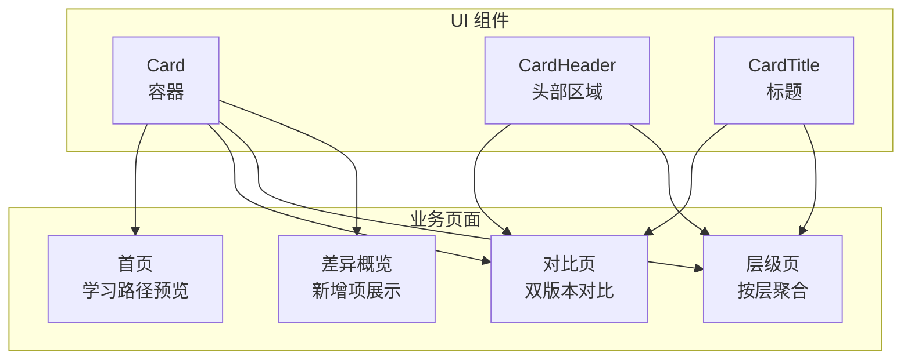
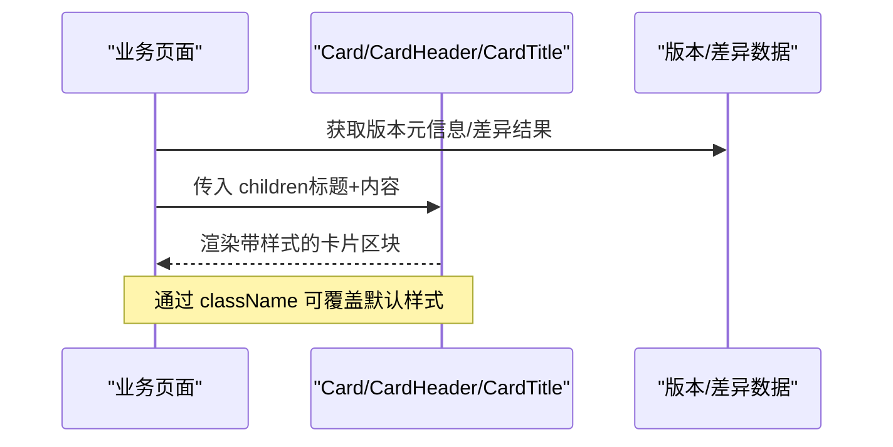
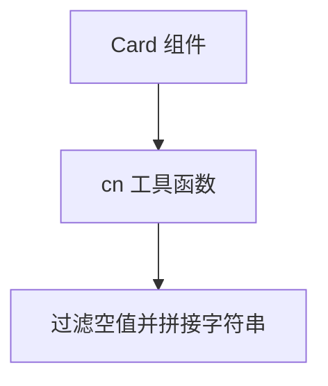

# 卡片组件

<cite>
**本文引用的文件**
- [card.tsx](file://web/src/components/ui/card.tsx)
- [utils.ts](file://web/src/lib/utils.ts)
- [page.tsx（首页）](file://web/src/app/[locale]/page.tsx)
- [compare/page.tsx（对比页）](file://web/src/app/[locale]/(learn)/compare/page.tsx)
- [layers/page.tsx（层级页）](file://web/src/app/[locale]/(learn)/layers/page.tsx)
- [whats-new.tsx（差异概览）](file://web/src/components/diff/whats-new.tsx)
</cite>

## 目录
1. [简介](#简介)
2. [项目结构](#项目结构)
3. [核心组件](#核心组件)
4. [架构总览](#架构总览)
5. [详细组件分析](#详细组件分析)
6. [依赖关系分析](#依赖关系分析)
7. [性能考量](#性能考量)
8. [故障排查指南](#故障排查指南)
9. [结论](#结论)
10. [附录：使用指南与最佳实践](#附录使用指南与最佳实践)

## 简介
本文件面向前端开发者，系统化说明本项目中的 Card 卡片组件。内容涵盖布局结构、样式设计、响应式适配、使用方式与最佳实践，帮助你在不同页面中正确复用并扩展卡片能力。

## 项目结构
Card 组件位于 UI 基础组件目录，提供容器与标题区域等子组件；在多个业务页面中被广泛使用，用于组织信息区块、展示版本/工具/函数差异等。

图表来源
- [card.tsx:7-39](file://web/src/components/ui/card.tsx#L7-L39)
- [page.tsx（首页）:150-182](file://web/src/app/[locale]/page.tsx#L150-L182)
- [compare/page.tsx:102-228](file://web/src/app/[locale]/(learn)/compare/page.tsx#L102-L228)
- [layers/page.tsx:74-116](file://web/src/app/[locale]/(learn)/layers/page.tsx#L74-L116)
- [whats-new.tsx:36-131](file://web/src/components/diff/whats-new.tsx#L36-L131)

章节来源
- [card.tsx:1-39](file://web/src/components/ui/card.tsx#L1-L39)
- [page.tsx（首页）:150-182](file://web/src/app/[locale]/page.tsx#L150-L182)
- [compare/page.tsx:102-228](file://web/src/app/[locale]/(learn)/compare/page.tsx#L102-L228)
- [layers/page.tsx:74-116](file://web/src/app/[locale]/(learn)/layers/page.tsx#L74-L116)
- [whats-new.tsx:36-131](file://web/src/components/diff/whats-new.tsx#L36-L131)

## 核心组件
- Card 容器：负责圆角、边框、背景、内边距与阴影的基础外观，支持通过 className 覆盖默认样式。
- CardHeader：为卡片头部提供间距与布局语义，便于放置标题、标签或操作区。
- CardTitle：用于卡片主标题的语义化标题元素，具备合适的字号与字重。

这些组件组合形成“标题区域 + 内容区域”的常见卡片结构；操作区域可通过在 CardHeader 或内容区追加按钮/图标实现。

章节来源
- [card.tsx:7-39](file://web/src/components/ui/card.tsx#L7-L39)

## 架构总览
下图展示了 Card 组件与其在业务页面中的调用关系，以及典型的数据流向（如版本信息、差异数据）如何被渲染到卡片中。

图表来源
- [card.tsx:7-39](file://web/src/components/ui/card.tsx#L7-L39)
- [compare/page.tsx:102-228](file://web/src/app/[locale]/(learn)/compare/page.tsx#L102-L228)
- [layers/page.tsx:74-116](file://web/src/app/[locale]/(learn)/layers/page.tsx#L74-L116)
- [whats-new.tsx:36-131](file://web/src/components/diff/whats-new.tsx#L36-L131)

## 详细组件分析

### Card 容器
- 作用：统一卡片的基础视觉风格（圆角、边框、背景、内边距、阴影），并提供可扩展的 className 注入点。
- 样式要点：
  - 圆角：中等偏大圆角，提升现代感。
  - 边框：浅色主题下使用中性边框色，暗色主题下切换为深色边框。
  - 背景：亮/暗模式分别设置背景色，保证可读性。
  - 内边距：提供舒适的内部留白。
  - 阴影：轻微阴影增强层次。
- 扩展点：通过 className 可覆盖任意样式（如边框颜色、阴影强度、圆角大小）。

章节来源
- [card.tsx:7-18](file://web/src/components/ui/card.tsx#L7-L18)

### CardHeader 与 CardTitle
- CardHeader：为头部区域提供上外边距，适合放置标题、标签、操作按钮等。
- CardTitle：语义化的标题元素，具备合适的字体大小与粗细，突出卡片主题。

章节来源
- [card.tsx:21-39](file://web/src/components/ui/card.tsx#L21-L39)

### 布局结构与组成
- 标题区域：通常由 CardHeader + CardTitle 构成，承载卡片的主标题与辅助信息。
- 内容区域：在 Card 内部自由放置文本、列表、标签、统计数字等。
- 操作区域：可在 CardHeader 右侧或内容区底部添加按钮/图标，保持交互一致性。

章节来源
- [compare/page.tsx:102-228](file://web/src/app/[locale]/(learn)/compare/page.tsx#L102-L228)
- [layers/page.tsx:74-116](file://web/src/app/[locale]/(learn)/layers/page.tsx#L74-L116)
- [whats-new.tsx:36-131](file://web/src/components/diff/whats-new.tsx#L36-L131)

### 样式变体与定制
- 边框样式：通过 className 可调整边框宽度、颜色、虚实线等；示例页面中使用彩色左边框区分层级。
- 阴影效果：默认轻微阴影，可通过 className 增加 hover 状态下的阴影变化以提升交互反馈。
- 圆角设置：默认中等偏大圆角，可按需调小以适配更紧凑的布局。
- 主题适配：组件内置亮/暗模式背景与边框色，确保在不同主题下保持一致的可读性。

章节来源
- [card.tsx:7-18](file://web/src/components/ui/card.tsx#L7-L18)
- [layers/page.tsx:50-57](file://web/src/app/[locale]/(learn)/layers/page.tsx#L50-L57)
- [layers/page.tsx:83-113](file://web/src/app/[locale]/(learn)/layers/page.tsx#L83-L113)

### 响应式设计
- 网格布局：页面使用响应式网格将多张卡片在不同屏幕尺寸下自动排列（单列/双列/三列）。
- 移动端适配：在小屏幕上采用单列堆叠，在大屏幕展开为多列，保证信息密度与可读性平衡。
- 屏幕尺寸检测：通过 Tailwind 断点控制布局与排版，无需额外逻辑即可实现响应式行为。

章节来源
- [page.tsx（首页）:149-182](file://web/src/app/[locale]/page.tsx#L149-L182)
- [compare/page.tsx:102-128](file://web/src/app/[locale]/(learn)/compare/page.tsx#L102-L128)
- [compare/page.tsx:150-228](file://web/src/app/[locale]/(learn)/compare/page.tsx#L150-L228)
- [layers/page.tsx:74-116](file://web/src/app/[locale]/(learn)/layers/page.tsx#L74-L116)

## 依赖关系分析
Card 组件依赖一个轻量级的类名合并工具，用于安全地拼接默认类与外部传入的类名。

图表来源
- [card.tsx:1-18](file://web/src/components/ui/card.tsx#L1-L18)
- [utils.ts:1-4](file://web/src/lib/utils.ts#L1-L4)

章节来源
- [card.tsx:1-18](file://web/src/components/ui/card.tsx#L1-L18)
- [utils.ts:1-4](file://web/src/lib/utils.ts#L1-L4)

## 性能考量
- 渲染成本：Card 为纯展示型组件，无复杂计算，渲染开销极低。
- 样式覆盖：通过 className 覆盖样式时，避免过度嵌套，减少不必要的重绘。
- 列表渲染：在大量卡片场景下，建议使用稳定的 key 与合理的分页/懒加载策略，避免一次性渲染过多节点。
- 主题切换：组件已内置亮/暗模式样式，无需额外逻辑，降低运行时开销。

[本节为通用指导，不直接分析具体文件]

## 故障排查指南
- 样式未生效：检查是否在 Card 上正确传递了 className；确认 cn 工具能正常合并类名。
- 暗色模式下不可读：确认父级或全局样式未覆盖背景/边框色；必要时在 Card 上显式指定背景与文字色。
- 布局错乱：检查外层容器是否使用了正确的响应式网格类；确认卡片高度一致（必要时设置等高）。
- 交互反馈弱：可为 Card 添加 hover 状态的阴影或边框变化，提升可点击性与层次感。

章节来源
- [card.tsx:7-18](file://web/src/components/ui/card.tsx#L7-L18)
- [utils.ts:1-4](file://web/src/lib/utils.ts#L1-L4)

## 结论
Card 组件以简洁的 API 提供了统一的卡片外观与结构，配合响应式网格与主题适配，能够高效支撑多种业务场景的信息展示。通过灵活的 className 覆盖机制，可以在不破坏组件封装的前提下满足多样化的定制需求。

[本节为总结性内容，不直接分析具体文件]

## 附录：使用指南与最佳实践

### 基本用法
- 在页面中引入 Card、CardHeader、CardTitle，并按“标题区域 + 内容区域”的结构组织内容。
- 使用 className 对卡片进行微调（如边框颜色、阴影、圆角）。

参考路径
- [card.tsx:7-39](file://web/src/components/ui/card.tsx#L7-L39)
- [compare/page.tsx:102-228](file://web/src/app/[locale]/(learn)/compare/page.tsx#L102-L228)

### 嵌套布局
- 在 Card 内部使用 Flex/Grid 布局组织内容，例如并列展示统计数字、标签列表、简短描述。
- 在 CardHeader 中放置标题与操作按钮，保持头部与内容的清晰分离。

参考路径
- [layers/page.tsx:74-116](file://web/src/app/[locale]/(learn)/layers/page.tsx#L74-L116)
- [whats-new.tsx:36-131](file://web/src/components/diff/whats-new.tsx#L36-L131)

### 自定义样式覆盖
- 通过 className 覆盖默认样式，例如：
  - 边框：调整边框颜色、宽度、虚实线。
  - 阴影：在 hover 时增强阴影，提升交互反馈。
  - 圆角：根据布局需要调小或增大圆角。
- 结合响应式断点，在不同屏幕尺寸下应用不同的样式策略。

参考路径
- [card.tsx:7-18](file://web/src/components/ui/card.tsx#L7-L18)
- [layers/page.tsx:50-57](file://web/src/app/[locale]/(learn)/layers/page.tsx#L50-L57)

### 实际使用示例（路径引用）
- 首页学习路径预览：使用 Card 展示各版本入口，配合网格布局实现响应式排列。
  - 参考路径：[page.tsx（首页）:149-182](file://web/src/app/[locale]/page.tsx#L149-L182)
- 对比页：使用 Card + CardHeader + CardTitle 组织双版本信息与差异指标。
  - 参考路径：[compare/page.tsx:102-228](file://web/src/app/[locale]/(learn)/compare/page.tsx#L102-L228)
- 层级页：在层级分组中使用 Card 展示版本卡片，并通过左侧彩色边框区分层级。
  - 参考路径：[layers/page.tsx:50-116](file://web/src/app/[locale]/(learn)/layers/page.tsx#L50-L116)
- 差异概览：用 Card 包裹新增类、工具、函数与代码行数变化，形成清晰的差异面板。
  - 参考路径：[whats-new.tsx:36-131](file://web/src/components/diff/whats-new.tsx#L36-L131)

### 最佳实践建议
- 保持语义化：标题使用 CardTitle，头部使用 CardHeader，内容放在 Card 内。
- 控制信息密度：避免在单张卡片中堆砌过多内容，必要时拆分为多卡或折叠区域。
- 一致的交互：为可点击卡片添加 hover 状态（阴影/边框变化），提升可发现性。
- 主题兼容：优先使用内置亮/暗模式样式，必要时通过 className 精细调整。
- 响应式优先：利用网格与断点实现从单列到多列的平滑过渡，确保移动端体验。

[本节为通用指导，不直接分析具体文件]