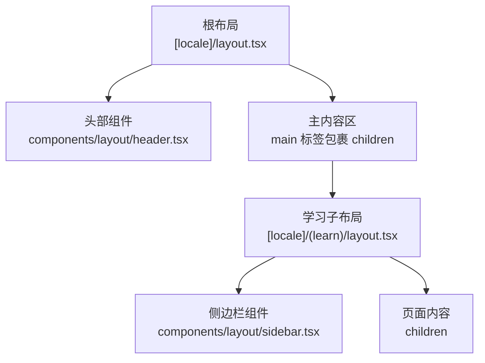
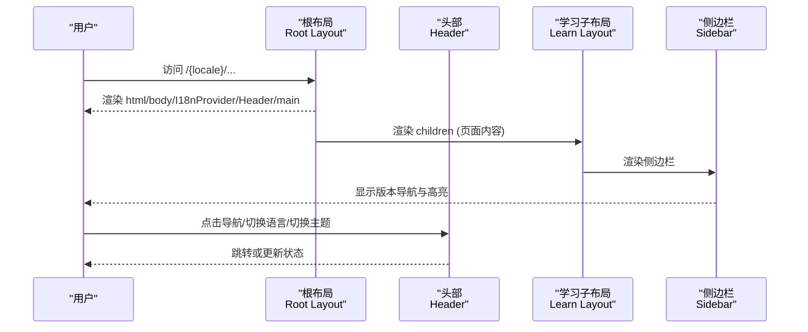
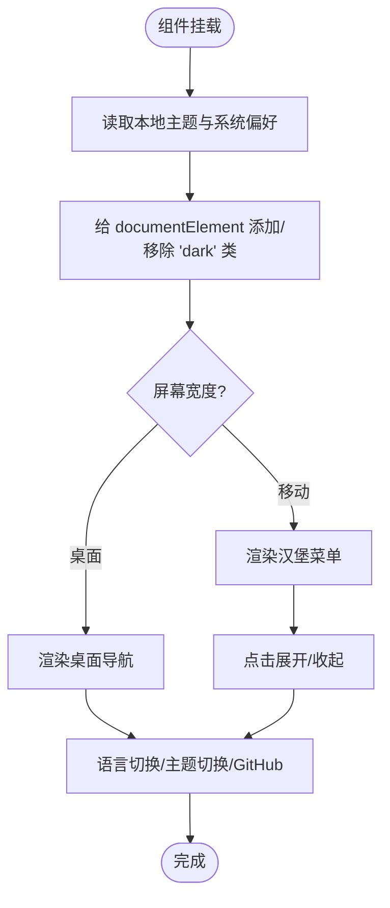
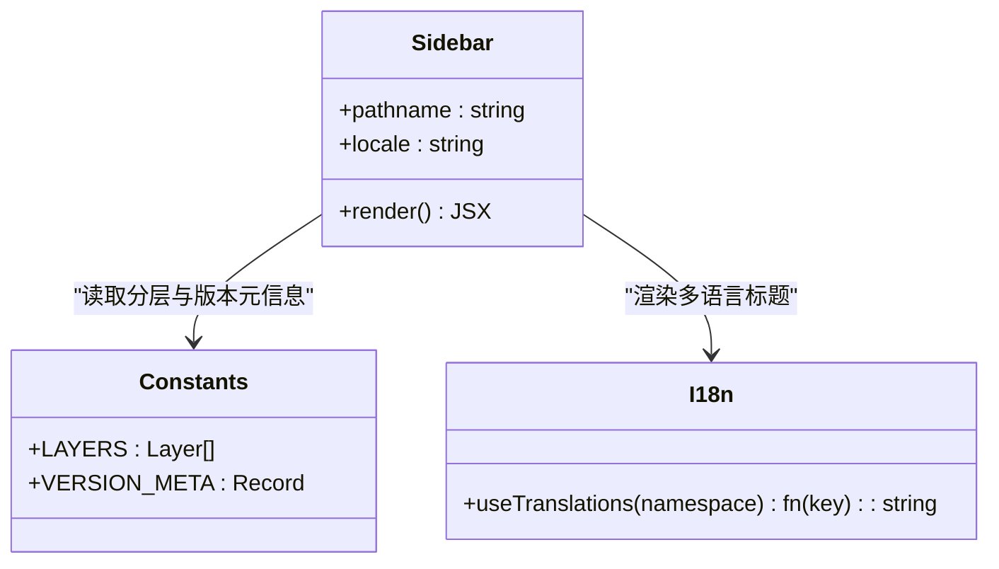
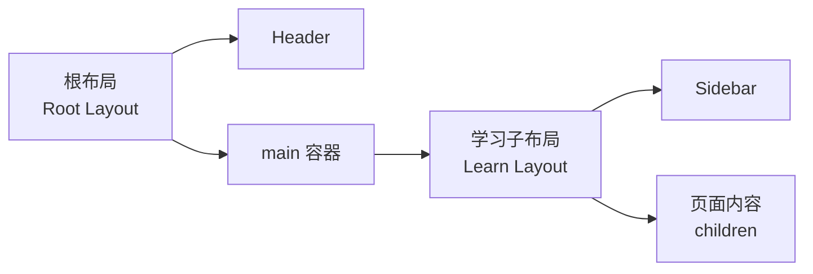
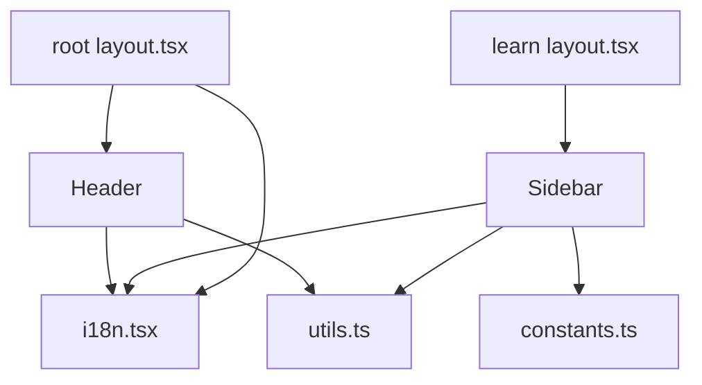

# 布局组件

<cite>
**本文引用的文件**
- [header.tsx](file://web/src/components/layout/header.tsx)
- [sidebar.tsx](file://web/src/components/layout/sidebar.tsx)
- [learn layout.tsx](file://web/src/app/[locale]/(learn)/layout.tsx)
- [root layout.tsx](file://web/src/app/[locale]/layout.tsx)
- [constants.ts](file://web/src/lib/constants.ts)
- [utils.ts](file://web/src/lib/utils.ts)
- [i18n.tsx](file://web/src/lib/i18n.tsx)
- [globals.css](file://web/src/app/globals.css)
</cite>

## 目录
1. [简介](#简介)
2. [项目结构](#项目结构)
3. [核心组件](#核心组件)
4. [架构总览](#架构总览)
5. [详细组件分析](#详细组件分析)
6. [依赖关系分析](#依赖关系分析)
7. [性能考量](#性能考量)
8. [故障排查指南](#故障排查指南)
9. [结论](#结论)
10. [附录：集成示例与最佳实践](#附录：集成示例与最佳实践)

## 简介
本文件聚焦于学习站点的布局组件，系统性说明 Header 头部与 Sidebar 侧边栏的架构设计与实现细节。内容涵盖：
- 头部组件的功能模块：导航菜单、语言切换、主题切换、GitHub 入口等
- 侧边栏的交互逻辑：路由高亮、按章节/版本分组展示
- 响应式适配机制：移动端折叠菜单、Tailwind 断点控制、暗色模式
- 布局组合方式：根布局与学习子布局的组合、内容区域自适应
- 实际集成示例与最佳实践建议

## 项目结构
布局由“根布局 + 学习子布局”构成，Header 在根布局中全局渲染，Sidebar 在学习子布局中作为左侧导航存在，主体内容位于右侧。

图表来源
- [root layout.tsx:29-59](file://web/src/app/[locale]/layout.tsx#L29-L59)
- [learn layout.tsx:3-14](file://web/src/app/[locale]/(learn)/layout.tsx#L3-L14)
- [header.tsx:22-170](file://web/src/components/layout/header.tsx#L22-L170)
- [sidebar.tsx:17-66](file://web/src/components/layout/sidebar.tsx#L17-L66)

章节来源
- [root layout.tsx:29-59](file://web/src/app/[locale]/layout.tsx#L29-L59)
- [learn layout.tsx:3-14](file://web/src/app/[locale]/(learn)/layout.tsx#L3-L14)

## 核心组件
- 头部组件（Header）：负责站点级导航、语言切换、主题切换、外部链接；提供桌面端固定导航与移动端汉堡菜单
- 侧边栏组件（Sidebar）：按“能力层”分组展示版本列表，基于当前路径进行高亮；仅在大屏显示
- 布局组合：根布局注入 Header 与 I18nProvider，学习子布局将 Sidebar 与内容并排

章节来源
- [header.tsx:22-170](file://web/src/components/layout/header.tsx#L22-L170)
- [sidebar.tsx:17-66](file://web/src/components/layout/sidebar.tsx#L17-L66)
- [root layout.tsx:29-59](file://web/src/app/[locale]/layout.tsx#L29-L59)
- [learn layout.tsx:3-14](file://web/src/app/[locale]/(learn)/layout.tsx#L3-L14)

## 架构总览
整体采用 Next.js App Router 的多层布局：
- 根布局负责国际化上下文、全局样式与 Header
- 学习子布局负责左侧导航与内容区的弹性布局
- 头部与侧边栏通过 i18n 与常量配置驱动，保持数据与视图分离

图表来源
- [root layout.tsx:29-59](file://web/src/app/[locale]/layout.tsx#L29-L59)
- [learn layout.tsx:3-14](file://web/src/app/[locale]/(learn)/layout.tsx#L3-L14)
- [header.tsx:22-170](file://web/src/components/layout/header.tsx#L22-L170)
- [sidebar.tsx:17-66](file://web/src/components/layout/sidebar.tsx#L17-L66)

## 详细组件分析

### 头部组件（Header）
职责与功能模块
- 导航菜单：桌面端常驻，移动端折叠为汉堡菜单；根据当前路径高亮当前项
- 语言切换：支持 en/zh/ja，通过替换 URL locale 段实现
- 主题切换：读取本地存储与系统偏好，切换 dark/light 类名
- 外部链接：GitHub 入口
- 可访问性：按钮最小尺寸满足触控目标要求

关键实现要点
- 使用 Next.js 的路由钩子获取当前路径与语言
- 使用 i18n 工具函数渲染多语言文案
- 使用 Tailwind 断点控制桌面/移动端展示
- 使用 CSS 变量与 dark 类实现主题切换

图表来源
- [header.tsx:22-170](file://web/src/components/layout/header.tsx#L22-L170)
- [i18n.tsx:16-36](file://web/src/lib/i18n.tsx#L16-L36)
- [globals.css:18-24](file://web/src/app/globals.css#L18-L24)

章节来源
- [header.tsx:22-170](file://web/src/components/layout/header.tsx#L22-L170)
- [i18n.tsx:16-36](file://web/src/lib/i18n.tsx#L16-L36)
- [globals.css:18-24](file://web/src/app/globals.css#L18-L24)

### 侧边栏组件（Sidebar）
职责与交互逻辑
- 分组展示：按“能力层”（工具、计划、记忆、并发、协作）组织版本
- 路由高亮：匹配当前路径或 diff 子路径时高亮对应项
- 多语言标题：优先使用 i18n 文案，回退到元数据标题
- 响应式：仅在 md 及以上屏幕显示

关键实现要点
- 从常量配置读取 LAYERS 与 VERSION_META，解耦数据与视图
- 使用 usePathname 判断高亮状态
- 使用 cn 工具合并动态类名

图表来源
- [sidebar.tsx:17-66](file://web/src/components/layout/sidebar.tsx#L17-L66)
- [constants.ts:1-38](file://web/src/lib/constants.ts#L1-L38)
- [i18n.tsx:25-36](file://web/src/lib/i18n.tsx#L25-L36)

章节来源
- [sidebar.tsx:17-66](file://web/src/components/layout/sidebar.tsx#L17-L66)
- [constants.ts:1-38](file://web/src/lib/constants.ts#L1-L38)
- [i18n.tsx:25-36](file://web/src/lib/i18n.tsx#L25-L36)

### 布局组合（根布局与学习子布局）
- 根布局：注入 I18nProvider、全局样式、Header，并在 main 中渲染 children
- 学习子布局：以 flex 布局将 Sidebar 与内容并列，内容区自适应剩余空间

图表来源
- [root layout.tsx:29-59](file://web/src/app/[locale]/layout.tsx#L29-L59)
- [learn layout.tsx:3-14](file://web/src/app/[locale]/(learn)/layout.tsx#L3-L14)

章节来源
- [root layout.tsx:29-59](file://web/src/app/[locale]/layout.tsx#L29-L59)
- [learn layout.tsx:3-14](file://web/src/app/[locale]/(learn)/layout.tsx#L3-L14)

## 依赖关系分析
- Header 依赖：Next.js 路由 API、i18n 工具、Tailwind 样式、Lucide 图标
- Sidebar 依赖：常量配置（LAYERS、VERSION_META）、i18n、路由 API
- 布局依赖：I18nProvider、全局样式、Tailwind 断点

图表来源
- [header.tsx:22-170](file://web/src/components/layout/header.tsx#L22-L170)
- [sidebar.tsx:17-66](file://web/src/components/layout/sidebar.tsx#L17-L66)
- [root layout.tsx:29-59](file://web/src/app/[locale]/layout.tsx#L29-L59)
- [learn layout.tsx:3-14](file://web/src/app/[locale]/(learn)/layout.tsx#L3-L14)
- [i18n.tsx:16-36](file://web/src/lib/i18n.tsx#L16-L36)
- [constants.ts:1-38](file://web/src/lib/constants.ts#L1-L38)
- [utils.ts:1-4](file://web/src/lib/utils.ts#L1-L4)

章节来源
- [header.tsx:22-170](file://web/src/components/layout/header.tsx#L22-L170)
- [sidebar.tsx:17-66](file://web/src/components/layout/sidebar.tsx#L17-L66)
- [root layout.tsx:29-59](file://web/src/app/[locale]/layout.tsx#L29-L59)
- [learn layout.tsx:3-14](file://web/src/app/[locale]/(learn)/layout.tsx#L3-L14)
- [i18n.tsx:16-36](file://web/src/lib/i18n.tsx#L16-L36)
- [constants.ts:1-38](file://web/src/lib/constants.ts#L1-L38)
- [utils.ts:1-4](file://web/src/lib/utils.ts#L1-L4)

## 性能考量
- 首屏渲染：Header 与 Sidebar 均为轻量客户端组件，无重型计算；主题初始化在 useEffect 中执行，避免阻塞首屏
- 路由高亮：基于字符串比较，时间复杂度 O(1)，开销极低
- 主题切换：直接操作 DOM 类名，避免整页重绘；使用 CSS 变量统一配色，减少重复样式
- 响应式：通过 Tailwind 断点控制显隐，减少不必要的 DOM 节点
- 可扩展性：新增版本只需更新常量配置，无需改动组件逻辑

[本节为通用性能建议，不直接分析具体代码行]

## 故障排查指南
常见问题与定位思路
- 主题闪烁或初始状态不正确
  - 检查根布局是否在 head 中提前注入脚本设置 dark 类
  - 确认 Header 的 useEffect 是否正确读取 localStorage 与系统偏好
- 侧边栏高亮异常
  - 核对 pathname 与 href 的匹配逻辑，确保包含带斜杠与 diff 子路径的情况
- 语言切换无效
  - 确认 switchLocale 是否替换了 URL 中的 locale 段，并触发完整页面跳转
- 移动端菜单无法展开
  - 检查移动端断点与汉堡按钮事件绑定，确认 mobileOpen 状态切换

章节来源
- [root layout.tsx:39-48](file://web/src/app/[locale]/layout.tsx#L39-L48)
- [header.tsx:30-51](file://web/src/components/layout/header.tsx#L30-L51)
- [sidebar.tsx:35-42](file://web/src/components/layout/sidebar.tsx#L35-L42)

## 结论
该布局方案通过清晰的层次划分与数据驱动的方式，实现了稳定的头部与侧边栏体验：
- Header 提供跨页面的导航、语言与主题能力，兼顾桌面与移动端
- Sidebar 以分层结构组织版本，结合路由高亮提升导航效率
- 根布局与学习子布局组合灵活，便于扩展新的页面与布局
- 通过常量与 i18n 解耦数据与视图，易于维护与扩展

[本节为总结性内容，不直接分析具体代码行]

## 附录：集成示例与最佳实践

### 集成步骤
- 在根布局中引入 I18nProvider 与 Header，确保全局可用
- 在学习子布局中引入 Sidebar，并以 flex 布局与内容区并列
- 通过 constants.ts 管理版本与分层数据，避免硬编码
- 使用 i18n.tsx 提供的 useTranslations 与 useLocale 处理多语言与当前语言

章节来源
- [root layout.tsx:29-59](file://web/src/app/[locale]/layout.tsx#L29-L59)
- [learn layout.tsx:3-14](file://web/src/app/[locale]/(learn)/layout.tsx#L3-L14)
- [constants.ts:1-38](file://web/src/lib/constants.ts#L1-L38)
- [i18n.tsx:16-36](file://web/src/lib/i18n.tsx#L16-L36)

### 响应式适配与手势
- 使用 Tailwind 断点控制显隐：如 md:hidden/md:block 控制桌面/移动端导航
- 移动端菜单通过状态切换实现展开/收起，按钮尺寸满足触控目标
- 触摸优化：全局禁用默认点击高亮，提升移动端交互体验

章节来源
- [header.tsx:112-169](file://web/src/components/layout/header.tsx#L112-L169)
- [globals.css:31-39](file://web/src/app/globals.css#L31-L39)

### 键盘导航与可访问性
- 所有交互元素具备合适的语义标签与可聚焦性
- 按钮与链接具备明确的文本描述与视觉反馈
- 建议在后续迭代中补充 aria-* 属性与键盘快捷键支持

[本节为通用可访问性建议，不直接分析具体代码行]

### 性能优化策略
- 将静态数据（版本、分层）集中在常量文件中，便于缓存与复用
- 避免在渲染路径中进行复杂计算，必要时使用 useMemo/useCallback
- 合理使用 Tailwind 原子类，减少自定义样式带来的体积增长

[本节为通用性能建议，不直接分析具体代码行]