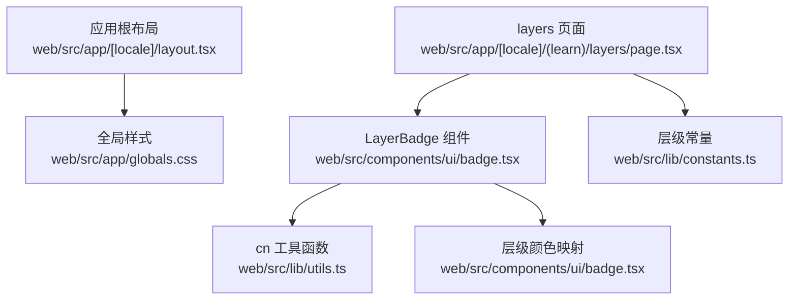
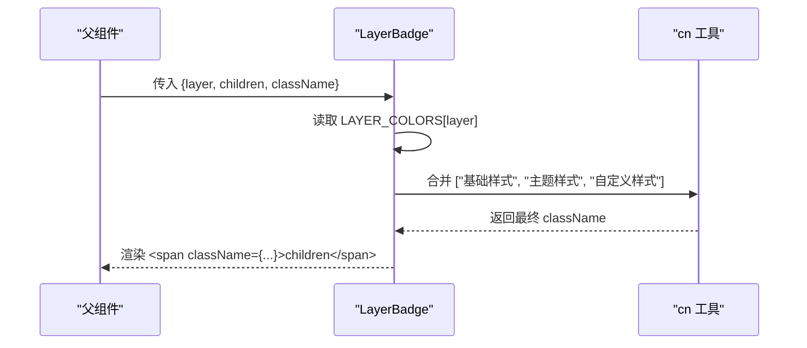
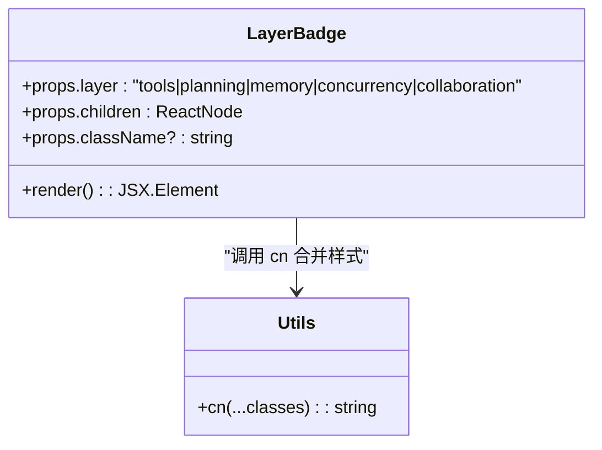
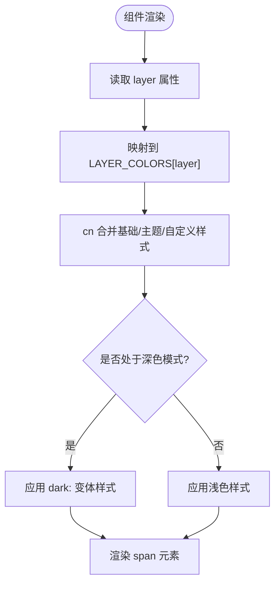
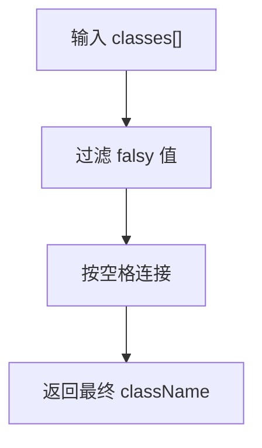
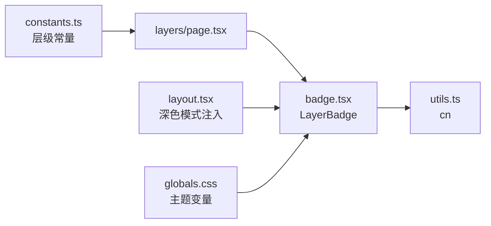

# 标签组件

<cite>
**本文引用的文件**
- [badge.tsx](file://web/src/components/ui/badge.tsx)
- [utils.ts](file://web/src/lib/utils.ts)
- [constants.ts](file://web/src/lib/constants.ts)
- [page.tsx（layers）](file://web/src/app/[locale]/(learn)/layers/page.tsx)
- [layout.tsx（应用根布局）](file://web/src/app/[locale]/layout.tsx)
- [globals.css](file://web/src/app/globals.css)
</cite>

## 目录
1. [简介](#简介)
2. [项目结构](#项目结构)
3. [核心组件](#核心组件)
4. [架构总览](#架构总览)
5. [详细组件分析](#详细组件分析)
6. [依赖关系分析](#依赖关系分析)
7. [性能考量](#性能考量)
8. [故障排查指南](#故障排查指南)
9. [结论](#结论)
10. [附录：使用示例与响应式适配](#附录使用示例与响应式适配)

## 简介
本文件聚焦于 Badge 标签组件中的 LayerBadge，用于以“层级”为语义的可视化标签。LayerBadge 通过 props 接收 layer、children 和 className，依据 layer 映射到预设的颜色主题，并支持浅色/深色模式自适应。组件内部使用 cn 工具函数进行条件样式合并，确保样式组合简洁且可维护。该组件在多个页面中被广泛使用，用于标识不同能力层（如 tools、planning、memory、concurrency、collaboration）。

## 项目结构
- 组件实现位于 web/src/components/ui/badge.tsx
- 样式工具函数位于 web/src/lib/utils.ts
- 层级常量定义位于 web/src/lib/constants.ts
- 典型使用场景位于 web/src/app/[locale]/(learn)/layers/page.tsx
- 深色模式开关由应用根布局注入 class="dark" 控制
- 全局 CSS 变量与主题色定义位于 web/src/app/globals.css

图表来源
- [layout.tsx（应用根布局）:38-60](file://web/src/app/[locale]/layout.tsx#L38-L60)
- [globals.css:1-24](file://web/src/app/globals.css#L1-L24)
- [badge.tsx:1-35](file://web/src/components/ui/badge.tsx#L1-L35)
- [utils.ts:1-4](file://web/src/lib/utils.ts#L1-L4)
- [page.tsx（layers）:1-134](file://web/src/app/[locale]/(learn)/layers/page.tsx#L1-L134)
- [constants.ts:1-38](file://web/src/lib/constants.ts#L1-L38)

章节来源
- [badge.tsx:1-35](file://web/src/components/ui/badge.tsx#L1-L35)
- [utils.ts:1-4](file://web/src/lib/utils.ts#L1-L4)
- [constants.ts:1-38](file://web/src/lib/constants.ts#L1-L38)
- [page.tsx（layers）:1-134](file://web/src/app/[locale]/(learn)/layers/page.tsx#L1-L134)
- [layout.tsx（应用根布局）:38-60](file://web/src/app/[locale]/layout.tsx#L38-L60)
- [globals.css:1-24](file://web/src/app/globals.css#L1-L24)

## 核心组件
LayerBadge 是一个轻量级 React 函数组件，负责渲染带层级语义的标签。其职责包括：
- 根据 layer 选择对应颜色主题
- 合并基础样式与传入的自定义 className
- 输出一个内联块元素承载 children

Props 接口
- layer: 必填，限定为 "tools" | "planning" | "memory" | "concurrency" | "collaboration"
- children: 必填，ReactNode，作为标签显示内容
- className?: 可选，字符串或 undefined/null/false，用于覆盖或追加样式

颜色主题系统
- 浅色模式：背景浅、文字深，保证可读性
- 深色模式：背景半透明深色、文字亮色，确保对比度
- 每个 layer 均提供独立的浅色/深色两套 Tailwind 类名集合

样式类名组合机制
- 使用 cn 工具函数将基础样式、layer 主题样式与自定义 className 合并
- 过滤掉 falsy 值，避免多余空格与无效类名

章节来源
- [badge.tsx:1-35](file://web/src/components/ui/badge.tsx#L1-L35)
- [utils.ts:1-4](file://web/src/lib/utils.ts#L1-L4)

## 架构总览
LayerBadge 的渲染流程如下：
- 父组件传入 layer、children、className
- 组件内部读取 LAYER_COLORS[layer] 获取主题类名
- 通过 cn 合并基础类名、主题类名与自定义类名
- 渲染 span 元素并挂载合并后的 className

图表来源
- [badge.tsx:16-34](file://web/src/components/ui/badge.tsx#L16-L34)
- [utils.ts:1-4](file://web/src/lib/utils.ts#L1-L4)

## 详细组件分析

### LayerBadge 组件设计
- 类型安全：layer 使用 keyof typeof LAYER_COLORS，限制为已定义的层级键
- 可扩展：新增层级只需扩展 LAYER_COLORS 映射
- 可定制：支持 className 覆盖默认样式
- 主题适配：内置 dark: 变体，自动跟随根节点 .dark 切换

图表来源
- [badge.tsx:16-34](file://web/src/components/ui/badge.tsx#L16-L34)
- [utils.ts:1-4](file://web/src/lib/utils.ts#L1-L4)

章节来源
- [badge.tsx:16-34](file://web/src/components/ui/badge.tsx#L16-L34)
- [utils.ts:1-4](file://web/src/lib/utils.ts#L1-L4)

### 颜色主题系统与深浅色适配
- 浅色模式：各层级使用浅色背景与深色文字，提升可读性
- 深色模式：各层级使用半透明深色背景与浅色文字，保持对比度
- 根布局通过注入 class="dark" 启用深色模式，CSS 变量与 Tailwind 暗色变体协同工作

图表来源
- [badge.tsx:3-14](file://web/src/components/ui/badge.tsx#L3-L14)
- [badge.tsx:22-33](file://web/src/components/ui/badge.tsx#L22-L33)
- [layout.tsx（应用根布局）:38-60](file://web/src/app/[locale]/layout.tsx#L38-L60)
- [globals.css:1-24](file://web/src/app/globals.css#L1-L24)

章节来源
- [badge.tsx:3-14](file://web/src/components/ui/badge.tsx#L3-L14)
- [layout.tsx（应用根布局）:38-60](file://web/src/app/[locale]/layout.tsx#L38-L60)
- [globals.css:1-24](file://web/src/app/globals.css#L1-L24)

### 样式类名组合机制（cn）
- 输入：任意数量的字符串或 falsy 值
- 处理：过滤掉 falsy 值并按空格拼接
- 输出：干净的类名字符串
- 优势：避免冗余空格与无效类名，简化条件样式逻辑

图表来源
- [utils.ts:1-4](file://web/src/lib/utils.ts#L1-L4)

章节来源
- [utils.ts:1-4](file://web/src/lib/utils.ts#L1-L4)

### 使用示例与响应式适配
- 基本用法：传入 layer 与 children，即可渲染对应层级标签
- 自定义样式：通过 className 追加或覆盖默认样式
- 响应式：组件本身无断点逻辑，但可通过外层容器与 Tailwind 响应式类实现布局适配
- 实际页面：layers 页面中使用 LayerBadge 展示层级信息，结合卡片网格在不同屏幕尺寸下自适应排列

章节来源
- [page.tsx（layers）:74-116](file://web/src/app/[locale]/(learn)/layers/page.tsx#L74-L116)

## 依赖关系分析
- LayerBadge 依赖：
  - cn 工具函数：用于样式合并
  - LAYER_COLORS：层级颜色映射表
- 使用方依赖：
  - constants.ts：提供层级枚举与元数据
  - 应用根布局：提供深色模式上下文
  - 全局样式：提供 CSS 变量与暗色主题

图表来源
- [constants.ts:1-38](file://web/src/lib/constants.ts#L1-L38)
- [page.tsx（layers）:1-134](file://web/src/app/[locale]/(learn)/layers/page.tsx#L1-L134)
- [badge.tsx:1-35](file://web/src/components/ui/badge.tsx#L1-L35)
- [utils.ts:1-4](file://web/src/lib/utils.ts#L1-L4)
- [layout.tsx（应用根布局）:38-60](file://web/src/app/[locale]/layout.tsx#L38-L60)
- [globals.css:1-24](file://web/src/app/globals.css#L1-L24)

章节来源
- [constants.ts:1-38](file://web/src/lib/constants.ts#L1-L38)
- [page.tsx（layers）:1-134](file://web/src/app/[locale]/(learn)/layers/page.tsx#L1-L134)
- [badge.tsx:1-35](file://web/src/components/ui/badge.tsx#L1-L35)
- [utils.ts:1-4](file://web/src/lib/utils.ts#L1-L4)
- [layout.tsx（应用根布局）:38-60](file://web/src/app/[locale]/layout.tsx#L38-L60)
- [globals.css:1-24](file://web/src/app/globals.css#L1-L24)

## 性能考量
- 组件无状态、无副作用，渲染开销极低
- 样式合并发生在渲染阶段，但仅涉及字符串操作，成本可忽略
- 主题切换由根节点 class 控制，无需组件内部状态管理，减少重渲染
- 建议：
  - 避免在高频列表中对每个条目重复创建复杂样式对象
  - 如需大量渲染，可将常用 className 预计算或使用 memo 包裹父组件以减少子组件重渲染

## 故障排查指南
- 问题：标签颜色不生效
  - 检查传入的 layer 是否为受支持的键
  - 确认 LAYER_COLORS 中是否存在对应映射
- 问题：深色模式下对比度不足
  - 检查根节点是否正确添加 class="dark"
  - 确认 Tailwind 暗色变体是否被正确编译与应用
- 问题：自定义样式未生效
  - 检查 className 是否正确传入
  - 确认 cn 合并顺序，必要时调整样式优先级

章节来源
- [badge.tsx:3-14](file://web/src/components/ui/badge.tsx#L3-L14)
- [layout.tsx（应用根布局）:38-60](file://web/src/app/[locale]/layout.tsx#L38-L60)
- [utils.ts:1-4](file://web/src/lib/utils.ts#L1-L4)

## 结论
LayerBadge 是一个简单而强大的层级标签组件，通过清晰的 Props 接口、完善的颜色主题系统与灵活的样式合并机制，满足了多场景下的标签展示需求。配合应用的深色模式与响应式布局，能够在不同设备与主题下保持一致的视觉体验。

## 附录：使用示例与响应式适配
- 基本示例
  - 使用方式：传入 layer 与 children，例如展示某个版本所属的层级
  - 效果：根据 layer 显示对应的颜色主题标签
- 自定义样式
  - 通过 className 追加额外样式，如间距、边框等
- 响应式适配
  - 组件本身无断点逻辑，可在外层容器使用响应式类（如 grid-cols-1 sm:grid-cols-2 lg:grid-cols-3）实现不同屏幕下的布局变化
  - layers 页面展示了卡片网格在不同尺寸下的自适应排列

章节来源
- [page.tsx（layers）:74-116](file://web/src/app/[locale]/(learn)/layers/page.tsx#L74-L116)