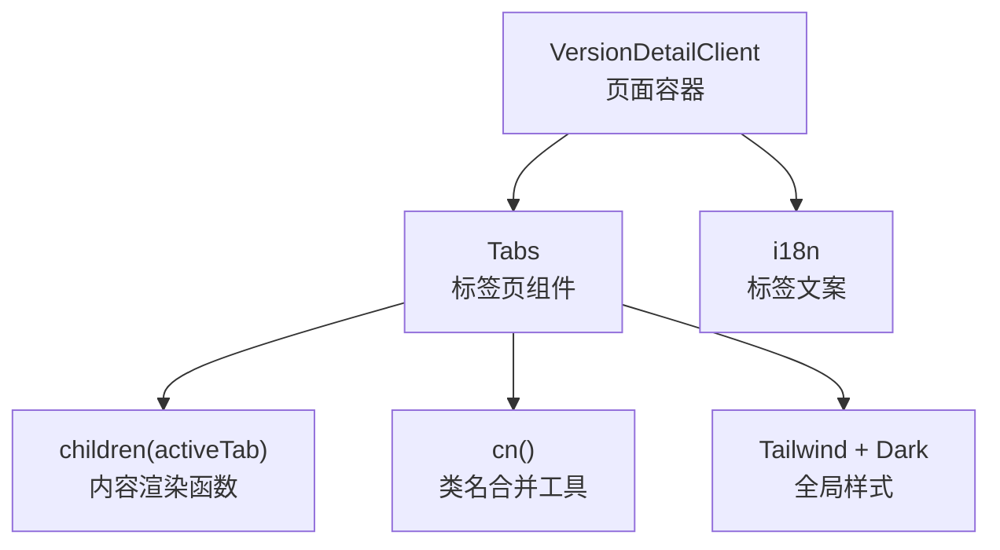
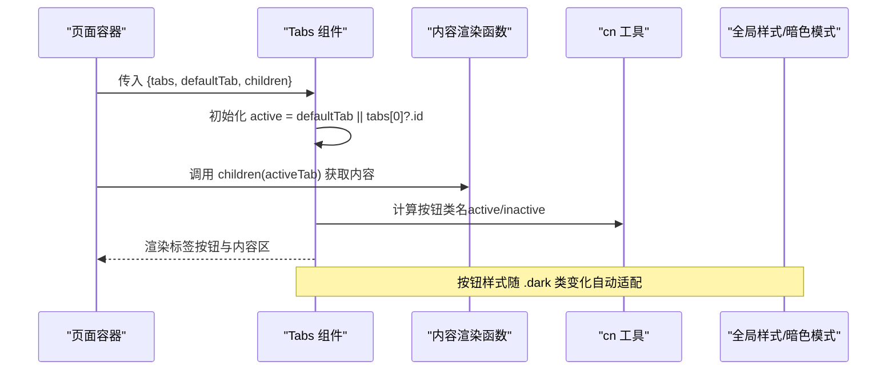
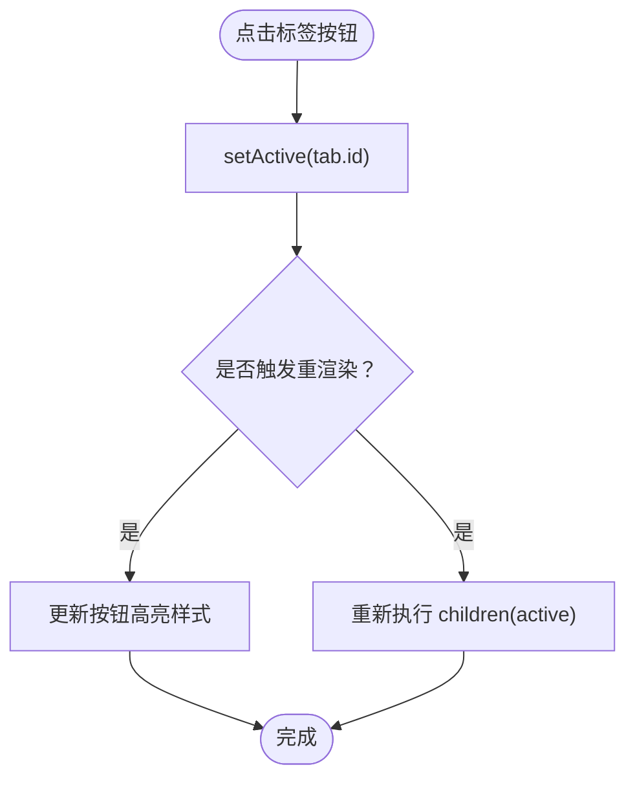
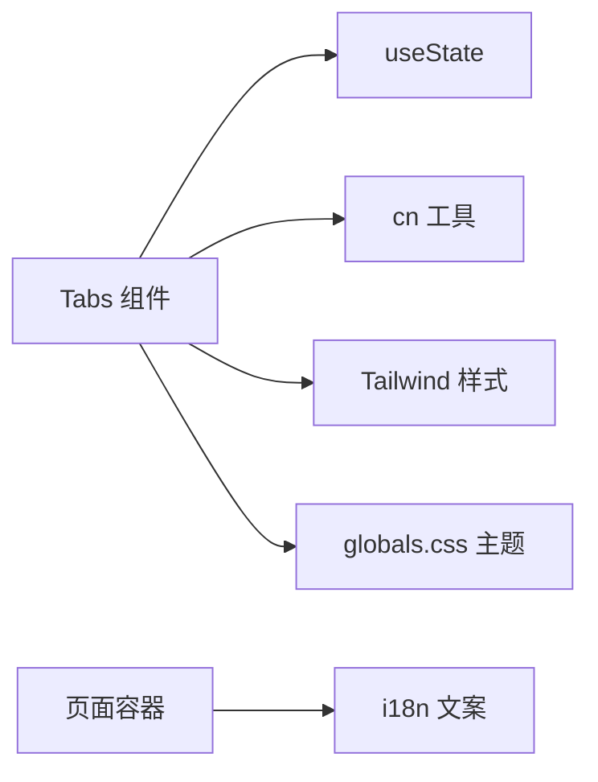

# 标签页组件

<cite>
**本文引用的文件**
- [web/src/components/ui/tabs.tsx](file://web/src/components/ui/tabs.tsx)
- [web/src/app/[locale]/(learn)/[version]/client.tsx](file://web/src/app/[locale]/(learn)/[version]/client.tsx)
- [web/src/lib/utils.ts](file://web/src/lib/utils.ts)
- [web/src/hooks/useDarkMode.ts](file://web/src/hooks/useDarkMode.ts)
- [web/src/app/globals.css](file://web/src/app/globals.css)
- [web/src/i18n/messages/en.json](file://web/src/i18n/messages/en.json)
</cite>

## 目录
1. [简介](#简介)
2. [项目结构](#项目结构)
3. [核心组件](#核心组件)
4. [架构总览](#架构总览)
5. [详细组件分析](#详细组件分析)
6. [依赖分析](#依赖分析)
7. [性能考虑](#性能考虑)
8. [故障排查指南](#故障排查指南)
9. [结论](#结论)
10. [附录](#附录)

## 简介
本文件为“标签页（Tabs）”组件的完整技术文档，聚焦于状态管理与交互逻辑、属性配置、切换实现原理、键盘导航支持、使用示例以及样式定制与主题适配。该组件基于 React 客户端组件实现，采用函数式状态管理，通过 children 渲染函数提供内容区域，配合 Tailwind CSS 完成样式与暗色主题适配。

## 项目结构
标签页组件位于 UI 基础组件层，被学习版本详情页消费。其核心文件与相关依赖如下：
- 组件实现：web/src/components/ui/tabs.tsx
- 使用方：web/src/app/[locale]/(learn)/[version]/client.tsx
- 工具函数：web/src/lib/utils.ts（类名合并）
- 主题与样式：web/src/app/globals.css、web/src/hooks/useDarkMode.ts
- 国际化文案：web/src/i18n/messages/en.json

图表来源
- [web/src/app/[locale]/(learn)/[version]/client.tsx:36-79](file://web/src/app/[locale]/(learn)/[version]/client.tsx#L36-L79)
- [web/src/components/ui/tabs.tsx:1-37](file://web/src/components/ui/tabs.tsx#L1-L37)
- [web/src/lib/utils.ts:1-4](file://web/src/lib/utils.ts#L1-L4)
- [web/src/app/globals.css:3-24](file://web/src/app/globals.css#L3-L24)
- [web/src/i18n/messages/en.json:5](file://web/src/i18n/messages/en.json#L5)

章节来源
- [web/src/components/ui/tabs.tsx:1-37](file://web/src/components/ui/tabs.tsx#L1-L37)
- [web/src/app/[locale]/(learn)/[version]/client.tsx:36-79](file://web/src/app/[locale]/(learn)/[version]/client.tsx#L36-L79)
- [web/src/lib/utils.ts:1-4](file://web/src/lib/utils.ts#L1-L4)
- [web/src/app/globals.css:3-24](file://web/src/app/globals.css#L3-L24)
- [web/src/i18n/messages/en.json:5](file://web/src/i18n/messages/en.json#L5)

## 核心组件
- Tabs 组件职责
  - 接收标签项数组与默认激活项，维护当前激活标签的状态。
  - 渲染标签按钮列表，点击时更新激活状态。
  - 通过 children 渲染函数将 activeTab 注入到内容区，由调用方按需渲染对应内容。
  - 使用 cn 工具函数组合动态类名，支持亮/暗主题样式。

- 关键属性
  - tabs：标签项定义，包含 id 与 label。
  - defaultTab：可选，指定初始激活标签；未提供则默认选中第一个标签。
  - children：函数类型，接收 activeTab，返回要渲染的内容节点。
  - className：可选，用于包裹容器的自定义类名。

- 内部状态
  - active：当前激活标签的 id，使用 useState 管理。

章节来源
- [web/src/components/ui/tabs.tsx:6-14](file://web/src/components/ui/tabs.tsx#L6-L14)
- [web/src/components/ui/tabs.tsx:13-34](file://web/src/components/ui/tabs.tsx#L13-L34)

## 架构总览
标签页组件在页面中作为可复用 UI 单元，负责状态与交互；页面侧负责数据与内容组装。整体流程如下：

图表来源
- [web/src/app/[locale]/(learn)/[version]/client.tsx:49-79](file://web/src/app/[locale]/(learn)/[version]/client.tsx#L49-L79)
- [web/src/components/ui/tabs.tsx:13-34](file://web/src/components/ui/tabs.tsx#L13-L34)
- [web/src/lib/utils.ts:1-4](file://web/src/lib/utils.ts#L1-L4)
- [web/src/app/globals.css:3-24](file://web/src/app/globals.css#L3-L24)

## 详细组件分析

### 组件 API 与属性配置
- 标签项定义
  - 每个标签项需具备唯一 id 和显示文本 label。
  - 建议 id 稳定且语义化，便于后续扩展（如路由或缓存键）。
- 默认激活状态
  - 若未提供 defaultTab，组件会回退到 tabs[0]?.id。
  - 当 tabs 为空时，active 为空字符串，需确保 children 能处理空态。
- 内容缓存机制
  - 当前实现通过 children 函数按需渲染，未显式缓存内容。
  - 如需缓存，可在调用方对内容进行记忆化（例如 useMemo），或在组件内增加缓存策略。

章节来源
- [web/src/components/ui/tabs.tsx:6-14](file://web/src/components/ui/tabs.tsx#L6-L14)
- [web/src/app/[locale]/(learn)/[version]/client.tsx:49-79](file://web/src/app/[locale]/(learn)/[version]/client.tsx#L49-L79)

### 标签切换的实现原理
- 事件处理
  - 每个标签按钮绑定 onClick，调用 setActive(tab.id) 更新激活状态。
- 状态更新
  - 使用 React 内置 useState 管理 active，触发重渲染以更新高亮与内容区。
- 渲染策略
  - 标签按钮根据 active === tab.id 决定高亮样式。
  - 内容区通过 children(active) 渲染，调用方可按 activeTab 条件渲染不同内容。

图表来源
- [web/src/components/ui/tabs.tsx:19-34](file://web/src/components/ui/tabs.tsx#L19-L34)

章节来源
- [web/src/components/ui/tabs.tsx:13-34](file://web/src/components/ui/tabs.tsx#L13-L34)

### 键盘导航支持
- 现状
  - 当前实现未包含键盘事件监听（如方向键切换、快捷键操作）。
  - 由于按钮元素本身具备原生焦点行为，可通过 Tab 键聚焦，但无方向键切换逻辑。
- 建议增强
  - 添加 onKeyDown 监听，支持左右方向键切换相邻标签。
  - 为标签组添加 role="tablist"，为按钮添加 role="tab"，为内容区添加 role="tabpanel"，并设置 aria-selected 等无障碍属性。
  - 可结合 useFocusTrap 或自定义焦点管理提升可访问性体验。

章节来源
- [web/src/components/ui/tabs.tsx:19-34](file://web/src/components/ui/tabs.tsx#L19-L34)

### 使用示例
- 基本用法
  - 在页面中导入 Tabs，定义 tabs 数组与 defaultTab，并通过 children 函数按 activeTab 渲染不同内容。
- 动态标签
  - 可将 tabs 从接口或配置中动态生成，注意保证 id 的唯一性与稳定性。
- 懒加载内容
  - 建议在调用方对昂贵内容进行记忆化（如 useMemo），或仅在首次访问时加载，避免重复渲染。

章节来源
- [web/src/app/[locale]/(learn)/[version]/client.tsx:36-79](file://web/src/app/[locale]/(learn)/[version]/client.tsx#L36-L79)

### 样式定制与主题适配
- 基础样式
  - 标签按钮使用 Tailwind 类名控制间距、字号、字体粗细与过渡动画。
  - 激活态与非激活态通过条件类名切换，底部边框与文字颜色区分。
- 暗色主题
  - 通过全局 .dark 选择器覆盖颜色变量，按钮样式自动适配暗色模式。
  - 可使用 useDarkMode 钩子在其他组件中感知主题状态。
- 自定义样式
  - 通过 className 向容器注入自定义类名，或使用 Tailwind 的 dark: 变体进行主题差异化。

章节来源
- [web/src/components/ui/tabs.tsx:18-31](file://web/src/components/ui/tabs.tsx#L18-L31)
- [web/src/app/globals.css:3-24](file://web/src/app/globals.css#L3-L24)
- [web/src/hooks/useDarkMode.ts:5-21](file://web/src/hooks/useDarkMode.ts#L5-L21)

## 依赖分析
- 组件内部依赖
  - useState：管理 active 状态。
  - cn：合并类名，简化条件样式拼接。
- 外部依赖
  - Tailwind CSS：提供原子化样式与暗色主题支持。
  - 全局样式：定义 CSS 变量与 .dark 主题覆盖。
  - i18n：提供标签文案，便于多语言切换。

图表来源
- [web/src/components/ui/tabs.tsx:3-4](file://web/src/components/ui/tabs.tsx#L3-L4)
- [web/src/lib/utils.ts:1-4](file://web/src/lib/utils.ts#L1-L4)
- [web/src/app/globals.css:3-24](file://web/src/app/globals.css#L3-L24)
- [web/src/i18n/messages/en.json:5](file://web/src/i18n/messages/en.json#L5)

章节来源
- [web/src/components/ui/tabs.tsx:3-4](file://web/src/components/ui/tabs.tsx#L3-L4)
- [web/src/lib/utils.ts:1-4](file://web/src/lib/utils.ts#L1-L4)
- [web/src/app/globals.css:3-24](file://web/src/app/globals.css#L3-L24)
- [web/src/i18n/messages/en.json:5](file://web/src/i18n/messages/en.json#L5)

## 性能考虑
- 渲染优化
  - 当前实现每次切换都会重新执行 children(active)，若内容较重，建议在调用方使用记忆化（如 useMemo）减少重复计算。
- 状态粒度
  - 仅维护 active 一个状态，避免不必要的复杂状态导致重渲染扩散。
- 样式开销
  - 使用 Tailwind 原子类与条件类名，避免额外样式库引入。
- 可扩展点
  - 如需更细粒度的性能控制，可增加 key 或虚拟滚动（针对大量标签场景）。

## 故障排查指南
- 问题：切换后内容不更新
  - 检查 children 是否正确接收 activeTab，并确保条件分支覆盖了所有可能的标签 id。
- 问题：默认标签未生效
  - 确认 defaultTab 是否在 tabs 中存在；若为空，组件会回退到第一个标签。
- 问题：暗色模式下样式异常
  - 检查 .dark 选择器是否生效，确认根元素是否包含 dark 类。
- 问题：无障碍键盘导航缺失
  - 当前未实现方向键切换，需自行补充 onKeyDown 与 ARIA 属性。

章节来源
- [web/src/components/ui/tabs.tsx:13-34](file://web/src/components/ui/tabs.tsx#L13-L34)
- [web/src/app/globals.css:3-24](file://web/src/app/globals.css#L3-L24)

## 结论
该标签页组件以简洁的方式实现了标签切换的核心功能，具备良好的可扩展性与主题适配能力。当前实现侧重于状态管理与基础交互，尚未包含键盘导航与内容缓存。在实际使用中，建议在调用方进行内容记忆化与懒加载，并根据需要增强键盘可达性与无障碍属性，以获得更佳的用户体验。

## 附录
- 国际化文案位置：web/src/i18n/messages/en.json
- 暗色主题开关逻辑：web/src/hooks/useDarkMode.ts
- 全局样式与变量：web/src/app/globals.css