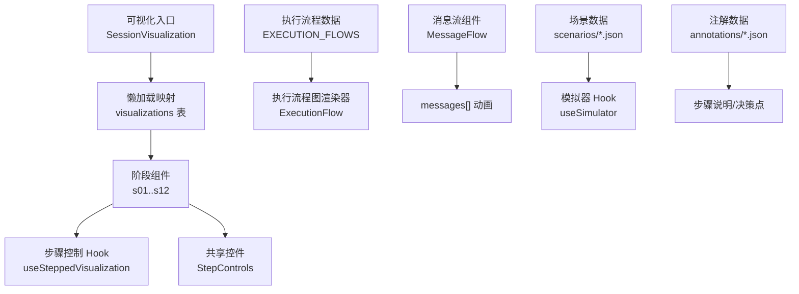
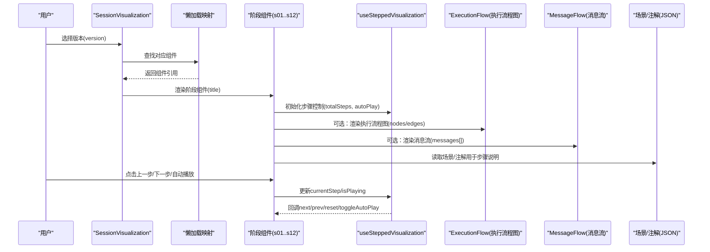
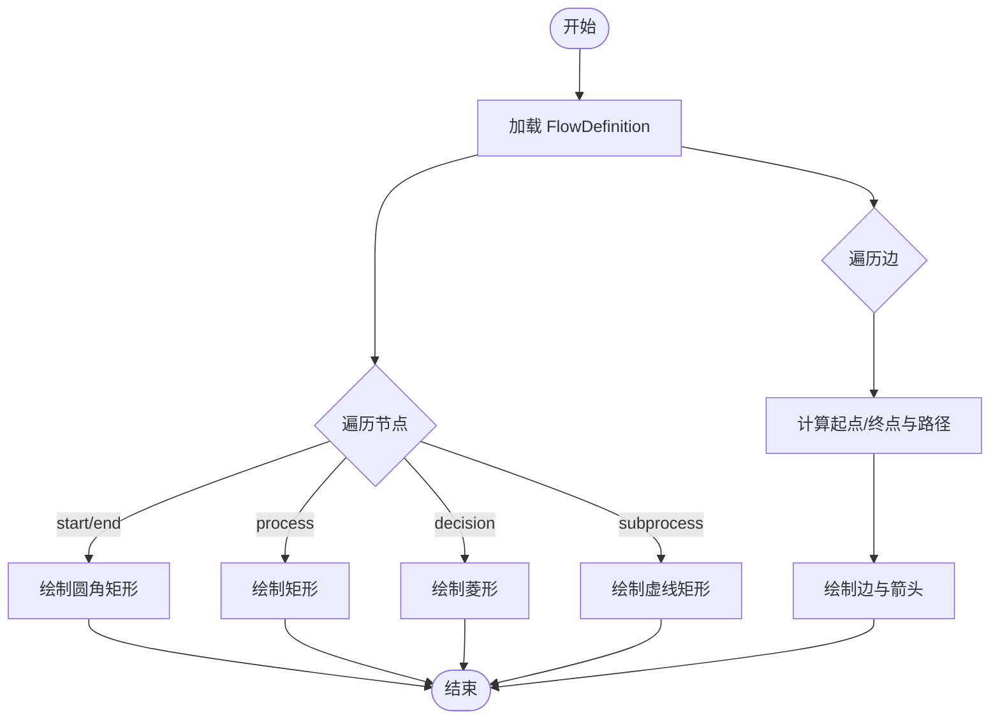
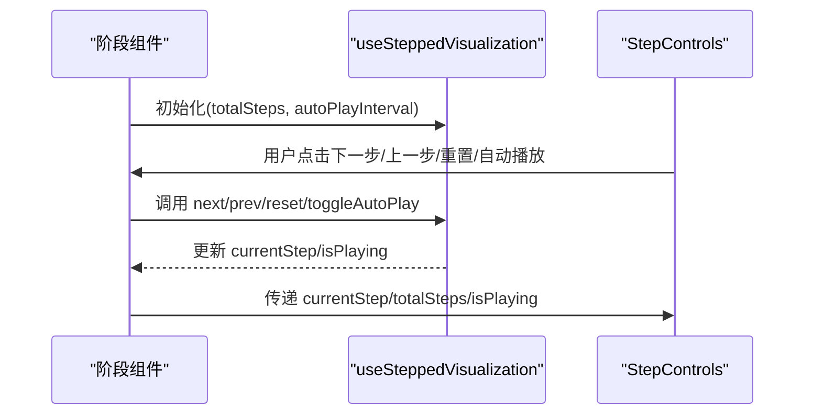
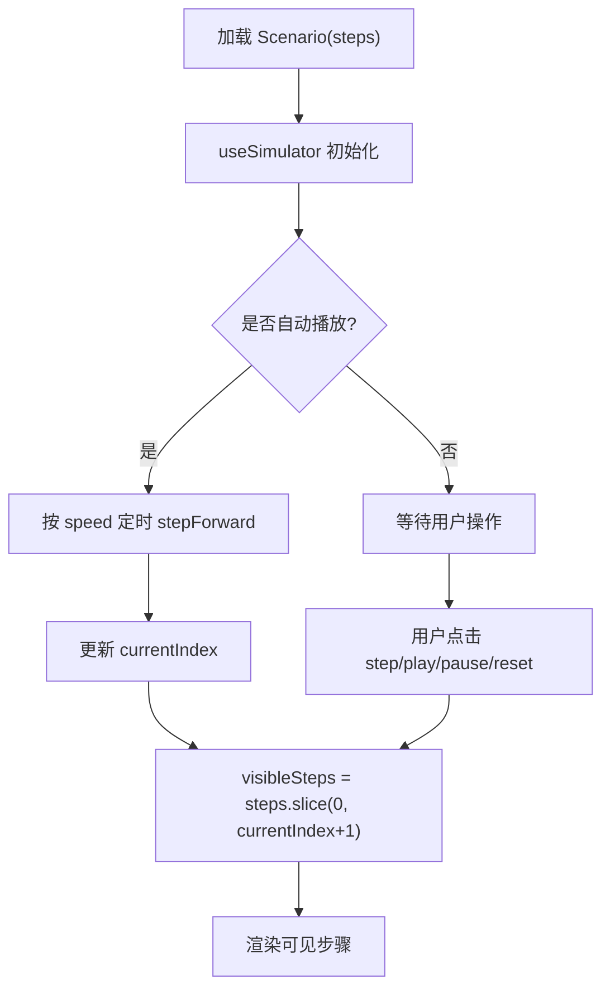
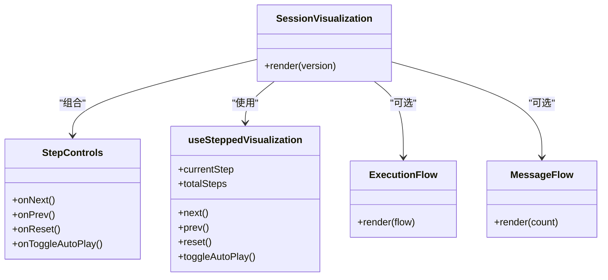
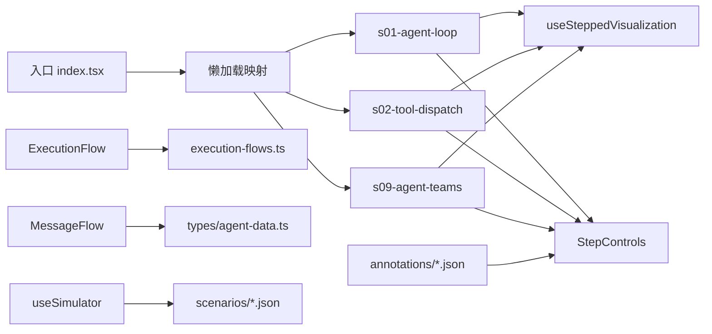

# 可视化组件系统

<cite>
**本文引用的文件**
- [web/src/components/visualizations/index.tsx](file://web/src/components/visualizations/index.tsx)
- [web/src/data/execution-flows.ts](file://web/src/data/execution-flows.ts)
- [web/src/types/agent-data.ts](file://web/src/types/agent-data.ts)
- [web/src/hooks/useSteppedVisualization.ts](file://web/src/hooks/useSteppedVisualization.ts)
- [web/src/components/simulator/simulator-controls.tsx](file://web/src/components/simulator/simulator-controls.tsx)
- [web/src/components/visualizations/shared/step-controls.tsx](file://web/src/components/visualizations/shared/step-controls.tsx)
- [web/src/components/visualizations/s01-agent-loop.tsx](file://web/src/components/visualizations/s01-agent-loop.tsx)
- [web/src/components/visualizations/s02-tool-dispatch.tsx](file://web/src/components/visualizations/s02-tool-dispatch.tsx)
- [web/src/components/visualizations/s09-agent-teams.tsx](file://web/src/components/visualizations/s09-agent-teams.tsx)
- [web/src/components/architecture/execution-flow.tsx](file://web/src/components/architecture/execution-flow.tsx)
- [web/src/components/architecture/message-flow.tsx](file://web/src/components/architecture/message-flow.tsx)
- [web/src/hooks/useSimulator.ts](file://web/src/hooks/useSimulator.ts)
- [web/src/data/annotations/s01.json](file://web/src/data/annotations/s01.json)
- [web/src/data/scenarios/s01.json](file://web/src/data/scenarios/s01.json)
</cite>

## 目录
1. [简介](#简介)
2. [项目结构](#项目结构)
3. [核心组件](#核心组件)
4. [架构总览](#架构总览)
5. [详细组件分析](#详细组件分析)
6. [依赖关系分析](#依赖关系分析)
7. [性能考虑](#性能考虑)
8. [故障排查指南](#故障排查指南)
9. [结论](#结论)
10. [附录](#附录)

## 简介
本文件系统性地梳理了前端可视化组件体系，涵盖架构图展示、执行流程图与消息流可视化的实现原理；详解各阶段专用可视化组件（S01-S12）的设计模式与数据驱动渲染机制；说明交互控制（步骤控制、自动播放、速度调节）与动画反馈；并提供组件复用指南与最佳实践，帮助快速扩展新的可视化阶段。

## 项目结构
- 可视化入口与懒加载：通过统一入口按版本键动态懒加载对应阶段的可视化组件，并包裹 Suspense 提供加载占位。
- 数据层：
  - 执行流程定义集中存放于 JSON/TS 常量中，描述节点与边，供通用流程图渲染器使用。
  - 场景与注解数据以 JSON 形式组织，用于模拟器与步骤说明。
- 状态与交互：
  - 步骤化可视化 Hook 管理当前步、自动播放与边界控制。
  - 模拟器 Hook 管理基于场景步骤的播放、暂停、步进与速度控制。
- 通用 UI：
  - 步骤控制面板、模拟器控制面板等可复用控件。
- 架构视图：
  - 执行流程图渲染器根据 FlowDefinition 绘制节点与边。
  - 消息流组件演示 messages[] 的动态增长过程。

图表来源
- [web/src/components/visualizations/index.tsx:6-39](file://web/src/components/visualizations/index.tsx#L6-L39)
- [web/src/data/execution-flows.ts:13-315](file://web/src/data/execution-flows.ts#L13-L315)
- [web/src/components/architecture/execution-flow.tsx:188-243](file://web/src/components/architecture/execution-flow.tsx#L188-L243)
- [web/src/components/architecture/message-flow.tsx:17-70](file://web/src/components/architecture/message-flow.tsx#L17-L70)
- [web/src/hooks/useSteppedVisualization.ts:23-84](file://web/src/hooks/useSteppedVisualization.ts#L23-L84)
- [web/src/hooks/useSimulator.ts:12-84](file://web/src/hooks/useSimulator.ts#L12-L84)

章节来源
- [web/src/components/visualizations/index.tsx:1-39](file://web/src/components/visualizations/index.tsx#L1-L39)
- [web/src/data/execution-flows.ts:1-316](file://web/src/data/execution-flows.ts#L1-L316)
- [web/src/types/agent-data.ts:1-73](file://web/src/types/agent-data.ts#L1-L73)

## 核心组件
- 阶段可视化入口：按 version 懒加载具体 sXX 组件，统一注入标题与最小高度容器，并使用 Suspense 处理异步加载。
- 步骤化可视化 Hook：封装 currentStep、totalSteps、next/prev/reset/goToStep、isPlaying/toggleAutoPlay 以及首尾步判断，支持定时自动播放。
- 共享步骤控件：提供上一步/下一步/重置/自动播放按钮、进度指示与步骤说明区域。
- 执行流程图渲染器：读取 FlowDefinition 中的 nodes/edges，计算路径与箭头，逐条绘制并带入场动画。
- 消息流组件：以水平滚动条方式逐步展示 messages[] 的累积过程，配合 AnimatePresence 做进出场动画。
- 模拟器 Hook 与控制面板：基于 SimStep[] 驱动播放、步进、速度与完成态，提供统一的播放控制 UI。

章节来源
- [web/src/components/visualizations/index.tsx:24-39](file://web/src/components/visualizations/index.tsx#L24-L39)
- [web/src/hooks/useSteppedVisualization.ts:23-84](file://web/src/hooks/useSteppedVisualization.ts#L23-L84)
- [web/src/components/visualizations/shared/step-controls.tsx:19-102](file://web/src/components/visualizations/shared/step-controls.tsx#L19-L102)
- [web/src/components/architecture/execution-flow.tsx:188-243](file://web/src/components/architecture/execution-flow.tsx#L188-L243)
- [web/src/components/architecture/message-flow.tsx:17-70](file://web/src/components/architecture/message-flow.tsx#L17-L70)
- [web/src/hooks/useSimulator.ts:12-84](file://web/src/hooks/useSimulator.ts#L12-L84)
- [web/src/components/simulator/simulator-controls.tsx:22-99](file://web/src/components/simulator/simulator-controls.tsx#L22-L99)

## 架构总览
下图展示了从入口到具体阶段组件、数据源与渲染器的整体调用关系。

图表来源
- [web/src/components/visualizations/index.tsx:24-39](file://web/src/components/visualizations/index.tsx#L24-L39)
- [web/src/hooks/useSteppedVisualization.ts:23-84](file://web/src/hooks/useSteppedVisualization.ts#L23-L84)
- [web/src/components/architecture/execution-flow.tsx:188-243](file://web/src/components/architecture/execution-flow.tsx#L188-L243)
- [web/src/components/architecture/message-flow.tsx:17-70](file://web/src/components/architecture/message-flow.tsx#L17-L70)

## 详细组件分析

### 阶段可视化入口与懒加载
- 设计要点
  - 使用 React.lazy 将每个 sXX 组件延迟加载，减少初始包体积。
  - 通过 Suspense 提供加载骨架屏，提升感知性能。
  - 统一注入 title，便于多语言切换。
- 数据流
  - 外部传入 version，内部查表获取组件，若不存在则不渲染。
- 扩展建议
  - 新增阶段只需在映射表中注册 lazy import，无需改动入口逻辑。

章节来源
- [web/src/components/visualizations/index.tsx:6-39](file://web/src/components/visualizations/index.tsx#L6-L39)

### 执行流程图渲染器（Architecture Execution Flow）
- 数据模型
  - FlowNode：id、label、type、坐标 x/y。
  - FlowEdge：from、to、可选 label。
  - FlowDefinition：nodes、edges。
- 渲染逻辑
  - 根据 type 绘制不同形状（矩形、菱形、起止节点）。
  - 计算边路径，垂直或折线连接，附加箭头标记。
  - 逐条边与节点入场动画，增强可读性。
- 数据来源
  - EXECUTION_FLOWS 为每个版本提供独立流程定义。
- 适用场景
  - 解释各阶段的核心执行路径与分支条件。

图表来源
- [web/src/components/architecture/execution-flow.tsx:21-42](file://web/src/components/architecture/execution-flow.tsx#L21-L42)
- [web/src/components/architecture/execution-flow.tsx:44-135](file://web/src/components/architecture/execution-flow.tsx#L44-L135)
- [web/src/components/architecture/execution-flow.tsx:137-182](file://web/src/components/architecture/execution-flow.tsx#L137-L182)
- [web/src/data/execution-flows.ts:13-315](file://web/src/data/execution-flows.ts#L13-L315)

章节来源
- [web/src/components/architecture/execution-flow.tsx:188-243](file://web/src/components/architecture/execution-flow.tsx#L188-L243)
- [web/src/data/execution-flows.ts:1-316](file://web/src/data/execution-flows.ts#L1-L316)
- [web/src/types/agent-data.ts:60-73](file://web/src/types/agent-data.ts#L60-L73)

### 消息流可视化（Message Flow）
- 功能
  - 以水平滚动条形式逐步展示 messages[] 的累积过程。
  - 使用定时器推进计数，达到末尾后循环重置。
- 动画
  - 新消息进入时缩放与淡入，移除时反向动画。
- 用途
  - 直观呈现“用户-助手-工具调用-工具结果”的循环。

章节来源
- [web/src/components/architecture/message-flow.tsx:6-70](file://web/src/components/architecture/message-flow.tsx#L6-L70)

### 步骤控制与自动播放
- useSteppedVisualization
  - 维护 currentStep、isPlaying、autoPlayInterval。
  - 提供 next/prev/reset/goToStep 与 isFirstStep/isLastStep。
  - 自动播放到达最后一步时停止。
- StepControls
  - 提供上一步/下一步/重置/自动播放按钮。
  - 显示进度点与当前步号。
  - 展示步骤标题与说明。
- 使用方式
  - 阶段组件内调用 Hook，并将回调与状态传递给 StepControls。

图表来源
- [web/src/hooks/useSteppedVisualization.ts:23-84](file://web/src/hooks/useSteppedVisualization.ts#L23-L84)
- [web/src/components/visualizations/shared/step-controls.tsx:19-102](file://web/src/components/visualizations/shared/step-controls.tsx#L19-L102)

章节来源
- [web/src/hooks/useSteppedVisualization.ts:1-85](file://web/src/hooks/useSteppedVisualization.ts#L1-L85)
- [web/src/components/visualizations/shared/step-controls.tsx:1-103](file://web/src/components/visualizations/shared/step-controls.tsx#L1-L103)

### 模拟器与场景驱动
- 数据模型
  - SimStep：type、content、annotation、toolName、toolInput。
  - Scenario：version、title、description、steps。
- 行为
  - useSimulator 管理 currentIndex、isPlaying、speed，按 speed 定时推进。
  - 暴露 visibleSteps 供上层按需渲染已发生的步骤。
- 控制器
  - SimulatorControls 提供播放/暂停/步进/重置与速度选择。

图表来源
- [web/src/hooks/useSimulator.ts:12-84](file://web/src/hooks/useSimulator.ts#L12-L84)
- [web/src/components/simulator/simulator-controls.tsx:22-99](file://web/src/components/simulator/simulator-controls.tsx#L22-L99)
- [web/src/types/agent-data.ts:38-58](file://web/src/types/agent-data.ts#L38-L58)

章节来源
- [web/src/hooks/useSimulator.ts:1-85](file://web/src/hooks/useSimulator.ts#L1-L85)
- [web/src/components/simulator/simulator-controls.tsx:1-100](file://web/src/components/simulator/simulator-controls.tsx#L1-L100)
- [web/src/types/agent-data.ts:38-58](file://web/src/types/agent-data.ts#L38-L58)

### 阶段专用可视化组件（S01-S12）
- 共同模式
  - 使用 useSteppedVisualization 管理步骤。
  - 通过 StepControls 提供统一交互。
  - 使用 SVG + Framer Motion 实现节点高亮、连线动画、消息块进出场。
  - 每步配置 activeNodes/activeEdges/messagesPerStep/STEP_INFO，驱动视图变化。
- S01 代理循环
  - 展示 while 循环：API 调用 -> 判断 stop_reason -> 执行工具 -> 追加结果 -> 再次调用。
  - 右侧面板累积 messages[]，体现上下文增长。
- S02 工具分发
  - 中心 dispatcher 将 tool_call.name 路由到 handlers[name]。
  - 每步高亮一个工具卡片，末步展示所有路由激活与可扩展性提示。
- S09 团队通信
  - 三角布局：Lead/Coder/Reviewer，各自拥有 .jsonl 邮箱。
  - 通过消息块动画展示任务下发、结果回传与反馈闭环。
- S03-S08、S10-S12
  - 均遵循相同模式：定义节点/边、步骤高亮、消息与注解，结合执行流程图与消息流进行讲解。

图表来源
- [web/src/components/visualizations/index.tsx:24-39](file://web/src/components/visualizations/index.tsx#L24-L39)
- [web/src/components/visualizations/shared/step-controls.tsx:19-102](file://web/src/components/visualizations/shared/step-controls.tsx#L19-L102)
- [web/src/hooks/useSteppedVisualization.ts:23-84](file://web/src/hooks/useSteppedVisualization.ts#L23-L84)
- [web/src/components/architecture/execution-flow.tsx:188-243](file://web/src/components/architecture/execution-flow.tsx#L188-L243)
- [web/src/components/architecture/message-flow.tsx:17-70](file://web/src/components/architecture/message-flow.tsx#L17-L70)

章节来源
- [web/src/components/visualizations/s01-agent-loop.tsx:10-98](file://web/src/components/visualizations/s01-agent-loop.tsx#L10-L98)
- [web/src/components/visualizations/s02-tool-dispatch.tsx:19-75](file://web/src/components/visualizations/s02-tool-dispatch.tsx#L19-L75)
- [web/src/components/visualizations/s09-agent-teams.tsx:14-47](file://web/src/components/visualizations/s09-agent-teams.tsx#L14-L47)

## 依赖关系分析
- 组件耦合
  - 阶段组件强依赖 useSteppedVisualization 与 StepControls，弱依赖 ExecutionFlow/MessageFlow（按需引入）。
  - 入口仅依赖懒加载映射，解耦具体阶段实现。
- 数据依赖
  - 执行流程图依赖 FlowDefinition（nodes/edges），由 execution-flows.ts 提供。
  - 模拟器依赖 Scenario（steps），由 scenarios/*.json 提供。
  - 注解数据 annotations/*.json 提供决策点与多语言说明，供步骤说明使用。
- 外部库
  - Framer Motion 负责动画与过渡。
  - Lucide 图标用于控制按钮。
  - Tailwind CSS 用于样式。

图表来源
- [web/src/components/visualizations/index.tsx:6-39](file://web/src/components/visualizations/index.tsx#L6-L39)
- [web/src/data/execution-flows.ts:13-315](file://web/src/data/execution-flows.ts#L13-L315)
- [web/src/types/agent-data.ts:38-73](file://web/src/types/agent-data.ts#L38-L73)
- [web/src/hooks/useSteppedVisualization.ts:23-84](file://web/src/hooks/useSteppedVisualization.ts#L23-L84)
- [web/src/components/visualizations/shared/step-controls.tsx:19-102](file://web/src/components/visualizations/shared/step-controls.tsx#L19-L102)
- [web/src/hooks/useSimulator.ts:12-84](file://web/src/hooks/useSimulator.ts#L12-L84)

章节来源
- [web/src/components/visualizations/index.tsx:6-39](file://web/src/components/visualizations/index.tsx#L6-L39)
- [web/src/data/execution-flows.ts:13-315](file://web/src/data/execution-flows.ts#L13-L315)
- [web/src/types/agent-data.ts:38-73](file://web/src/types/agent-data.ts#L38-L73)

## 性能考虑
- 懒加载阶段组件：显著降低首屏体积，按需加载 sXX 组件。
- 动画性能：Framer Motion 的 transform 与 opacity 动画对重排影响小；避免过多同时动画元素。
- 列表渲染：消息流与步骤指示使用稳定 key，减少不必要的重渲染。
- 数据量控制：执行流程图节点数量适中，避免复杂路径计算导致卡顿。
- 自动播放：到达最后一步自动停止，防止无意义轮询。

[本节为通用指导，不直接分析具体文件]

## 故障排查指南
- 无法加载阶段组件
  - 检查入口映射是否包含该版本键。
  - 确认懒加载路径正确且组件默认导出存在。
- 步骤控制无效
  - 确认 totalSteps 与实际步骤数一致。
  - 检查 StepControls 的回调是否正确绑定。
- 流程图不显示
  - 确认 FlowDefinition 的 nodes/edges 完整且 id 匹配。
  - 检查 getFlowForVersion 返回值是否为 null。
- 模拟器不前进
  - 检查 steps 长度与 currentIndex 边界。
  - 确认 isPlaying 与 speed 设置正确。

章节来源
- [web/src/components/visualizations/index.tsx:24-39](file://web/src/components/visualizations/index.tsx#L24-L39)
- [web/src/hooks/useSteppedVisualization.ts:31-70](file://web/src/hooks/useSteppedVisualization.ts#L31-L70)
- [web/src/components/architecture/execution-flow.tsx:192-196](file://web/src/components/architecture/execution-flow.tsx#L192-L196)
- [web/src/hooks/useSimulator.ts:27-69](file://web/src/hooks/useSimulator.ts#L27-L69)

## 结论
本可视化组件系统通过“入口懒加载 + 阶段组件 + 通用 Hook/控件 + 数据驱动渲染”的分层设计，实现了清晰的职责划分与良好的扩展性。S01-S12 各阶段组件遵循统一的数据结构与交互模式，借助执行流程图与消息流可视化，有效传达了 Agent 的运行机制。通过场景与注解数据，进一步增强了教学性与可维护性。

[本节为总结，不直接分析具体文件]

## 附录

### 数据驱动渲染机制（JSON 到图形）
- 执行流程图
  - 输入：FlowDefinition（nodes/edges）。
  - 处理：根据 type 选择形状，计算边路径，附加箭头与标签。
  - 输出：SVG 图形，带入场动画。
- 消息流
  - 输入：模拟步骤序列（或内置示例）。
  - 处理：逐步增加可见消息，使用 AnimatePresence 做进出场。
  - 输出：水平滚动的消息条集合。
- 场景与注解
  - 输入：Scenario.steps、Annotations.decisions。
  - 处理：驱动模拟器步骤与步骤说明文案。
  - 输出：可播放的步骤序列与多语言说明。

章节来源
- [web/src/data/execution-flows.ts:13-315](file://web/src/data/execution-flows.ts#L13-L315)
- [web/src/components/architecture/execution-flow.tsx:21-42](file://web/src/components/architecture/execution-flow.tsx#L21-L42)
- [web/src/components/architecture/message-flow.tsx:6-70](file://web/src/components/architecture/message-flow.tsx#L6-L70)
- [web/src/data/scenarios/s01.json:1-52](file://web/src/data/scenarios/s01.json#L1-L52)
- [web/src/data/annotations/s01.json:1-48](file://web/src/data/annotations/s01.json#L1-L48)

### 交互功能实现要点
- 步骤控制
  - 使用 useSteppedVisualization 管理状态机，提供精确的步进与自动播放。
- 动画效果
  - 使用 Framer Motion 的 motion.* 与 AnimatePresence 实现平滑过渡。
- 用户反馈
  - StepControls 提供进度点与步骤说明；模拟器控制面板提供速度选择与完成态提示。

章节来源
- [web/src/hooks/useSteppedVisualization.ts:23-84](file://web/src/hooks/useSteppedVisualization.ts#L23-L84)
- [web/src/components/visualizations/shared/step-controls.tsx:19-102](file://web/src/components/visualizations/shared/step-controls.tsx#L19-L102)
- [web/src/components/simulator/simulator-controls.tsx:22-99](file://web/src/components/simulator/simulator-controls.tsx#L22-L99)

### 组件复用指南与最佳实践
- 新增阶段组件
  - 在入口映射中添加懒加载项。
  - 定义步骤数组（ACTIVE_NODES_PER_STEP、ACTIVE_EDGES_PER_STEP、MESSAGES_PER_STEP、STEP_INFO）。
  - 使用 useSteppedVisualization 与 StepControls 构建交互。
  - 如需流程图，准备 FlowDefinition 并通过 ExecutionFlow 渲染。
- 数据规范
  - 严格遵循类型定义（FlowNode、FlowEdge、SimStep、Scenario）。
  - 保持节点 id 唯一，边 from/to 指向有效节点。
- 动画与性能
  - 优先使用 transform/opacity 动画。
  - 控制同时动画元素数量，避免过度重绘。
- 可访问性与国际化
  - 为按钮添加 title/aria 属性。
  - 通过 i18n 注入标题与说明。

章节来源
- [web/src/components/visualizations/index.tsx:6-39](file://web/src/components/visualizations/index.tsx#L6-L39)
- [web/src/types/agent-data.ts:38-73](file://web/src/types/agent-data.ts#L38-L73)
- [web/src/components/visualizations/s01-agent-loop.tsx:46-98](file://web/src/components/visualizations/s01-agent-loop.tsx#L46-L98)
- [web/src/components/visualizations/s02-tool-dispatch.tsx:54-75](file://web/src/components/visualizations/s02-tool-dispatch.tsx#L54-L75)
- [web/src/components/visualizations/s09-agent-teams.tsx:39-47](file://web/src/components/visualizations/s09-agent-teams.tsx#L39-L47)