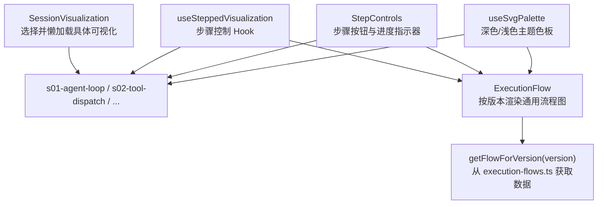
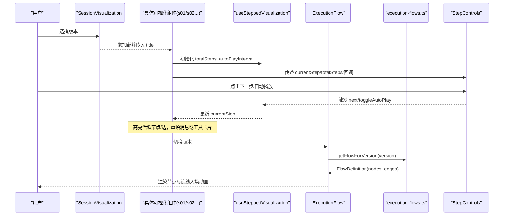
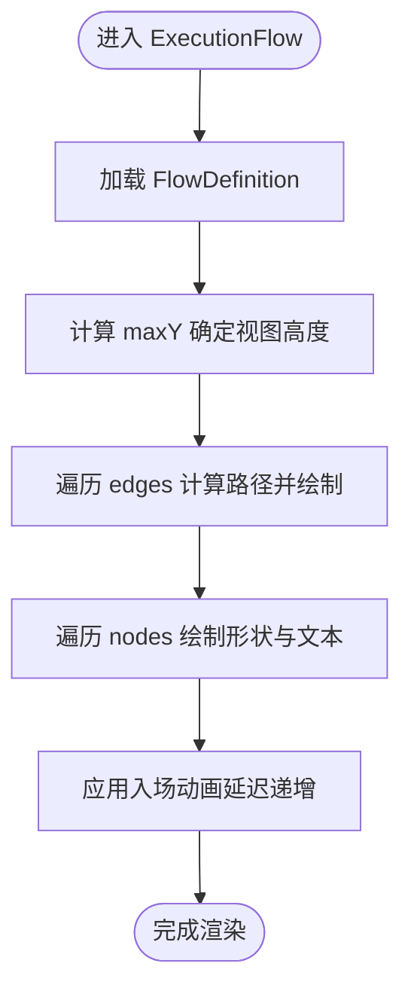
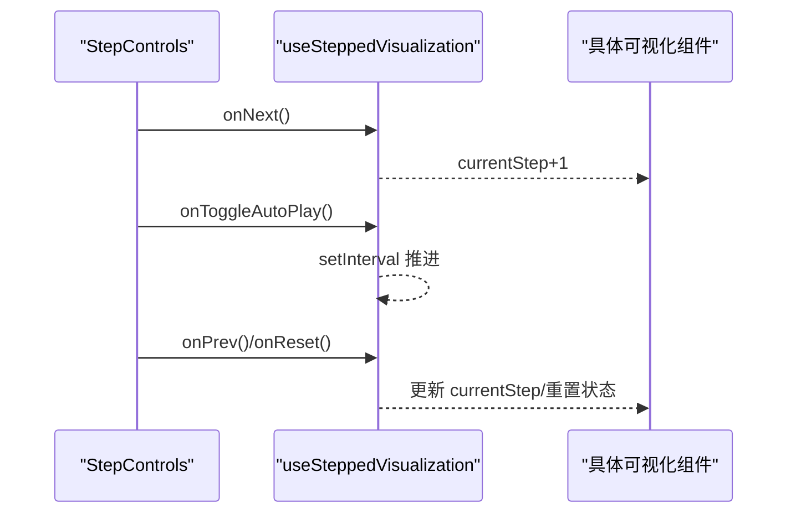
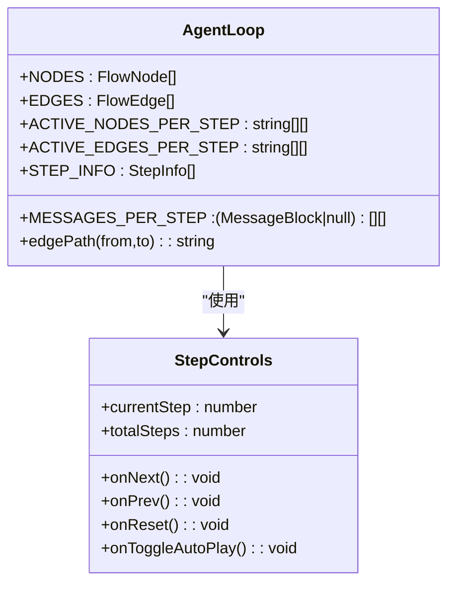
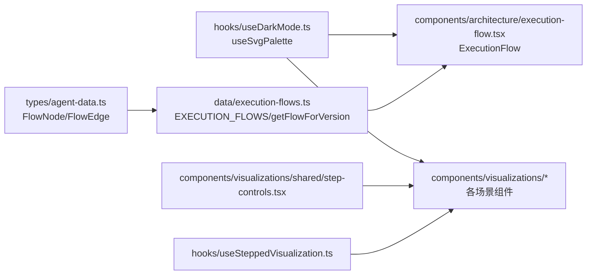

# 执行流程可视化

<cite>
**本文引用的文件**
- [web/src/components/visualizations/index.tsx](file://web/src/components/visualizations/index.tsx)
- [web/src/data/execution-flows.ts](file://web/src/data/execution-flows.ts)
- [web/src/hooks/useSteppedVisualization.ts](file://web/src/hooks/useSteppedVisualization.ts)
- [web/src/components/visualizations/shared/step-controls.tsx](file://web/src/components/visualizations/shared/step-controls.tsx)
- [web/src/components/architecture/execution-flow.tsx](file://web/src/components/architecture/execution-flow.tsx)
- [web/src/types/agent-data.ts](file://web/src/types/agent-data.ts)
- [web/src/hooks/useDarkMode.ts](file://web/src/hooks/useDarkMode.ts)
- [web/src/components/visualizations/s01-agent-loop.tsx](file://web/src/components/visualizations/s01-agent-loop.tsx)
- [web/src/components/visualizations/s02-tool-dispatch.tsx](file://web/src/components/visualizations/s02-tool-dispatch.tsx)
</cite>

## 目录
1. [简介](#简介)
2. [项目结构](#项目结构)
3. [核心组件](#核心组件)
4. [架构总览](#架构总览)
5. [详细组件分析](#详细组件分析)
6. [依赖关系分析](#依赖关系分析)
7. [性能考量](#性能考量)
8. [故障排查指南](#故障排查指南)
9. [结论](#结论)
10. [附录：流程定制指南](#附录：流程定制指南)

## 简介
本文件面向“执行流程可视化”能力，聚焦 ExecutionFlow 组件的流程图渲染机制与交互体验。内容涵盖：
- 步骤序列的动态生成：步骤数据解析、节点布局、连接线绘制
- 交互式流程控制：步骤导航、进度指示器、状态反馈
- 动画过渡效果：步骤展开、折叠与重新排列
- 流程定制指南：自定义步骤类型、样式配置、交互行为扩展

该实现基于 React + SVG + Framer Motion，通过声明式的数据驱动方式将 Agent 的执行过程以可交互的流程图呈现，支持多版本（s01-s12）的流程定义与逐步演示。

## 项目结构
前端可视化部分位于 web/src 下，关键目录与职责如下：
- components/visualizations：各场景的可视化组件（如 s01-agent-loop、s02-tool-dispatch），以及共享的步骤控制 UI
- components/architecture：通用 ExecutionFlow 组件，用于按版本动态渲染流程
- data：流程定义数据（节点、边、坐标等）
- hooks：复用逻辑（步骤步进控制、深色主题调色板）
- types：类型定义（FlowNode、FlowEdge 等）

图表来源
- [web/src/components/visualizations/index.tsx:24-39](file://web/src/components/visualizations/index.tsx#L24-L39)
- [web/src/components/architecture/execution-flow.tsx:188-243](file://web/src/components/architecture/execution-flow.tsx#L188-L243)
- [web/src/data/execution-flows.ts:13-315](file://web/src/data/execution-flows.ts#L13-L315)
- [web/src/hooks/useSteppedVisualization.ts:23-84](file://web/src/hooks/useSteppedVisualization.ts#L23-L84)
- [web/src/components/visualizations/shared/step-controls.tsx:19-102](file://web/src/components/visualizations/shared/step-controls.tsx#L19-L102)
- [web/src/hooks/useDarkMode.ts:39-75](file://web/src/hooks/useDarkMode.ts#L39-L75)

章节来源
- [web/src/components/visualizations/index.tsx:1-40](file://web/src/components/visualizations/index.tsx#L1-L40)
- [web/src/data/execution-flows.ts:1-316](file://web/src/data/execution-flows.ts#L1-L316)
- [web/src/hooks/useSteppedVisualization.ts:1-85](file://web/src/hooks/useSteppedVisualization.ts#L1-L85)
- [web/src/components/visualizations/shared/step-controls.tsx:1-103](file://web/src/components/visualizations/shared/step-controls.tsx#L1-L103)
- [web/src/components/architecture/execution-flow.tsx:1-244](file://web/src/components/architecture/execution-flow.tsx#L1-L244)
- [web/src/types/agent-data.ts:60-73](file://web/src/types/agent-data.ts#L60-L73)
- [web/src/hooks/useDarkMode.ts:1-76](file://web/src/hooks/useDarkMode.ts#L1-L76)

## 核心组件
- SessionVisualization：根据版本字符串懒加载对应可视化组件，提供占位与标题透传
- ExecutionFlow：通用流程图渲染器，读取版本对应的 FlowDefinition，计算画布高度，绘制节点与连线，带入场动画
- useSteppedVisualization：管理当前步骤、自动播放、前进/后退/重置、边界判断
- StepControls：步骤控制 UI，包含上一步/下一步/自动播放/重置按钮与进度点指示器
- 各场景可视化（如 s01-agent-loop、s02-tool-dispatch）：使用上述 Hook 和 UI，结合 SVG/Framer Motion 展示特定流程

章节来源
- [web/src/components/visualizations/index.tsx:24-39](file://web/src/components/visualizations/index.tsx#L24-L39)
- [web/src/components/architecture/execution-flow.tsx:188-243](file://web/src/components/architecture/execution-flow.tsx#L188-L243)
- [web/src/hooks/useSteppedVisualization.ts:23-84](file://web/src/hooks/useSteppedVisualization.ts#L23-L84)
- [web/src/components/visualizations/shared/step-controls.tsx:19-102](file://web/src/components/visualizations/shared/step-controls.tsx#L19-L102)
- [web/src/components/visualizations/s01-agent-loop.tsx:138-416](file://web/src/components/visualizations/s01-agent-loop.tsx#L138-L416)
- [web/src/components/visualizations/s02-tool-dispatch.tsx:95-200](file://web/src/components/visualizations/s02-tool-dispatch.tsx#L95-L200)

## 架构总览
下图展示了从版本到流程图渲染的整体调用链与数据流：

图表来源
- [web/src/components/visualizations/index.tsx:24-39](file://web/src/components/visualizations/index.tsx#L24-L39)
- [web/src/components/visualizations/shared/step-controls.tsx:19-102](file://web/src/components/visualizations/shared/step-controls.tsx#L19-L102)
- [web/src/hooks/useSteppedVisualization.ts:23-84](file://web/src/hooks/useSteppedVisualization.ts#L23-L84)
- [web/src/components/architecture/execution-flow.tsx:188-243](file://web/src/components/architecture/execution-flow.tsx#L188-L243)
- [web/src/data/execution-flows.ts:313-315](file://web/src/data/execution-flows.ts#L313-L315)

## 详细组件分析

### ExecutionFlow 组件（通用流程图渲染）
- 数据源：通过 getFlowForVersion(version) 获取 FlowDefinition（nodes 与 edges）
- 节点布局：使用 FlowNode.x/y 作为中心坐标；根据 type 决定形状（矩形/菱形/起止）
- 连线绘制：根据节点类型计算起点/终点，垂直或折线连接，箭头标记
- 动画：节点与连线依次入场，延迟递增，提升可读性
- 响应式：根据最大 y 计算 viewBox 高度，确保完整显示

图表来源
- [web/src/components/architecture/execution-flow.tsx:25-42](file://web/src/components/architecture/execution-flow.tsx#L25-L42)
- [web/src/components/architecture/execution-flow.tsx:44-135](file://web/src/components/architecture/execution-flow.tsx#L44-L135)
- [web/src/components/architecture/execution-flow.tsx:137-182](file://web/src/components/architecture/execution-flow.tsx#L137-L182)
- [web/src/components/architecture/execution-flow.tsx:188-243](file://web/src/components/architecture/execution-flow.tsx#L188-L243)
- [web/src/data/execution-flows.ts:13-315](file://web/src/data/execution-flows.ts#L13-L315)

章节来源
- [web/src/components/architecture/execution-flow.tsx:1-244](file://web/src/components/architecture/execution-flow.tsx#L1-L244)
- [web/src/data/execution-flows.ts:1-316](file://web/src/data/execution-flows.ts#L1-L316)
- [web/src/types/agent-data.ts:60-73](file://web/src/types/agent-data.ts#L60-L73)

### 步骤控制与交互（useSteppedVisualization + StepControls）
- 状态管理：currentStep、isPlaying、totalSteps
- 导航：next/prev/reset/goToStep，边界保护防止越界
- 自动播放：setInterval 推进步骤，到达末尾自动停止
- UI 反馈：StepControls 提供按钮与进度点，显示当前步骤序号
- 组合使用：各场景可视化组件通过 Hook 获取状态，驱动 SVG 高亮与消息更新

图表来源
- [web/src/hooks/useSteppedVisualization.ts:23-84](file://web/src/hooks/useSteppedVisualization.ts#L23-L84)
- [web/src/components/visualizations/shared/step-controls.tsx:19-102](file://web/src/components/visualizations/shared/step-controls.tsx#L19-L102)

章节来源
- [web/src/hooks/useSteppedVisualization.ts:1-85](file://web/src/hooks/useSteppedVisualization.ts#L1-L85)
- [web/src/components/visualizations/shared/step-controls.tsx:1-103](file://web/src/components/visualizations/shared/step-controls.tsx#L1-L103)

### 场景示例：Agent 循环（s01-agent-loop）
- 数据结构：本地定义 NODES/EDGES，每步激活的节点与边数组，以及 messages[] 累积
- 渲染：SVG 绘制矩形与菱形节点，特殊处理回环边（append -> api_call）与水平边（check -> end）
- 动画：Framer Motion 控制节点/边的颜色、描边宽度变化，消息块入场/退出动画
- 交互：通过 useSteppedVisualization 驱动步骤，StepControls 提供导航与自动播放

图表来源
- [web/src/components/visualizations/s01-agent-loop.tsx:10-65](file://web/src/components/visualizations/s01-agent-loop.tsx#L10-L65)
- [web/src/components/visualizations/s01-agent-loop.tsx:102-134](file://web/src/components/visualizations/s01-agent-loop.tsx#L102-L134)
- [web/src/components/visualizations/s01-agent-loop.tsx:138-416](file://web/src/components/visualizations/s01-agent-loop.tsx#L138-L416)
- [web/src/components/visualizations/shared/step-controls.tsx:19-102](file://web/src/components/visualizations/shared/step-controls.tsx#L19-L102)

章节来源
- [web/src/components/visualizations/s01-agent-loop.tsx:1-417](file://web/src/components/visualizations/s01-agent-loop.tsx#L1-L417)

### 场景示例：工具分发（s02-tool-dispatch）
- 数据结构：工具定义（名称、描述、颜色）、每步激活的工具索引、请求 JSON
- 渲染：顶部调度器卡片 + 底部工具卡片网格，根据 activeToolIdx 高亮对应卡片
- 动画：请求代码块与卡片入场/退出动画，增强步骤感知
- 交互：同样基于 useSteppedVisualization 与 StepControls

章节来源
- [web/src/components/visualizations/s02-tool-dispatch.tsx:1-200](file://web/src/components/visualizations/s02-tool-dispatch.tsx#L1-L200)

### 主题与配色（useSvgPalette）
- 提供深色/浅色两套 SVG 调色板（节点填充、描边、文本、边、箭头等）
- 在场景组件中通过 Hook 获取，保证一致的主题表现

章节来源
- [web/src/hooks/useDarkMode.ts:39-75](file://web/src/hooks/useDarkMode.ts#L39-L75)
- [web/src/components/visualizations/s01-agent-loop.tsx:149-149](file://web/src/components/visualizations/s01-agent-loop.tsx#L149-L149)

## 依赖关系分析
- 数据层：execution-flows.ts 提供 FlowDefinition（nodes/edges），types/agent-data.ts 定义 FlowNode/FlowEdge
- 渲染层：ExecutionFlow 负责通用流程图渲染；各场景组件负责特定交互与动画
- 控制层：useSteppedVisualization 提供步骤状态与自动播放；StepControls 提供 UI
- 主题层：useSvgPalette 提供主题色，影响 SVG 元素外观

图表来源
- [web/src/types/agent-data.ts:60-73](file://web/src/types/agent-data.ts#L60-L73)
- [web/src/data/execution-flows.ts:13-315](file://web/src/data/execution-flows.ts#L13-L315)
- [web/src/components/architecture/execution-flow.tsx:188-243](file://web/src/components/architecture/execution-flow.tsx#L188-L243)
- [web/src/hooks/useSteppedVisualization.ts:23-84](file://web/src/hooks/useSteppedVisualization.ts#L23-L84)
- [web/src/components/visualizations/shared/step-controls.tsx:19-102](file://web/src/components/visualizations/shared/step-controls.tsx#L19-L102)
- [web/src/hooks/useDarkMode.ts:39-75](file://web/src/hooks/useDarkMode.ts#L39-L75)

章节来源
- [web/src/types/agent-data.ts:1-73](file://web/src/types/agent-data.ts#L1-L73)
- [web/src/data/execution-flows.ts:1-316](file://web/src/data/execution-flows.ts#L1-L316)
- [web/src/components/architecture/execution-flow.tsx:1-244](file://web/src/components/architecture/execution-flow.tsx#L1-L244)
- [web/src/hooks/useSteppedVisualization.ts:1-85](file://web/src/hooks/useSteppedVisualization.ts#L1-L85)
- [web/src/components/visualizations/shared/step-controls.tsx:1-103](file://web/src/components/visualizations/shared/step-controls.tsx#L1-L103)
- [web/src/hooks/useDarkMode.ts:1-76](file://web/src/hooks/useDarkMode.ts#L1-L76)

## 性能考量
- 懒加载：SessionVisualization 使用 React.lazy/Suspense 按需加载具体可视化组件，减少首屏体积
- 增量渲染：ExecutionFlow 对节点与连线采用延迟入场动画，避免一次性大量 DOM 操作造成卡顿
- 最小化重绘：步骤切换时仅更新当前活跃节点/边与消息集合，利用 key 与 AnimatePresence 优化列表动画
- 主题切换：useSvgPalette 集中管理颜色，避免重复计算
- 建议：对于复杂流程（节点/边较多），可考虑虚拟滚动或分片渲染；对频繁步骤切换，可缓存 SVG 路径计算结果

[本节为通用指导，不直接分析具体文件]

## 故障排查指南
- 版本无流程数据：检查 getFlowForVersion(version) 是否返回 null；确认 version 是否在 EXECUTION_FLOWS 中存在
- 节点/边未显示：核对 FlowNode.id 与 FlowEdge.from/to 是否匹配；检查 x/y 坐标是否合理
- 步骤无法前进：确认 totalSteps 设置正确；检查 isLastStep 条件；验证 StepControls 回调是否正确绑定
- 自动播放不停止：检查到达最后一步后是否关闭定时器；确认 useEffect 清理逻辑
- 主题异常：确认 useSvgPalette 在深色模式下返回正确的颜色值；检查 CSS dark 类是否生效

章节来源
- [web/src/data/execution-flows.ts:313-315](file://web/src/data/execution-flows.ts#L313-L315)
- [web/src/components/architecture/execution-flow.tsx:188-243](file://web/src/components/architecture/execution-flow.tsx#L188-L243)
- [web/src/hooks/useSteppedVisualization.ts:55-70](file://web/src/hooks/useSteppedVisualization.ts#L55-L70)
- [web/src/components/visualizations/shared/step-controls.tsx:44-98](file://web/src/components/visualizations/shared/step-controls.tsx#L44-L98)
- [web/src/hooks/useDarkMode.ts:39-75](file://web/src/hooks/useDarkMode.ts#L39-L75)

## 结论
ExecutionFlow 及相关组件通过数据驱动的流程图渲染与步骤化交互，清晰展示了 Agent 在不同阶段的执行流程。其优势在于：
- 可扩展：新增版本只需添加 FlowDefinition 与对应可视化组件
- 可交互：统一的步骤控制与进度指示，提升学习体验
- 可定制：主题与样式集中管理，易于适配不同风格
- 可维护：清晰的模块划分与类型约束，便于长期演进

[本节为总结性内容，不直接分析具体文件]

## 附录：流程定制指南

### 自定义步骤类型
- 在 FlowNode.type 中扩展新类型（如 start/process/decision/subprocess/end），并在 ExecutionFlow 的 NodeShape 中补充渲染逻辑
- 若需更复杂的形状（如圆角矩形、图标），可在 NodeShape 中增加分支处理

章节来源
- [web/src/types/agent-data.ts:60-66](file://web/src/types/agent-data.ts#L60-L66)
- [web/src/components/architecture/execution-flow.tsx:44-135](file://web/src/components/architecture/execution-flow.tsx#L44-L135)

### 样式配置
- 使用 useSvgPalette 统一调整节点/边/箭头的颜色与粗细
- 在场景组件中通过 Hook 获取调色板，应用到 SVG 元素
- 如需全局主题变量，可在 CSS 中定义并通过 var(--color-*) 引用

章节来源
- [web/src/hooks/useDarkMode.ts:39-75](file://web/src/hooks/useDarkMode.ts#L39-L75)
- [web/src/components/visualizations/s01-agent-loop.tsx:149-149](file://web/src/components/visualizations/s01-agent-loop.tsx#L149-L149)

### 交互行为扩展
- 在 useSteppedVisualization 中扩展回调（如 onStepChange、onComplete），在场景组件中监听并执行副作用
- 在 StepControls 中添加更多控制项（如跳转到指定步骤、调节自动播放速度）
- 在场景组件中根据 currentStep 动态改变 SVG 内容（如高亮、显示隐藏信息）

章节来源
- [web/src/hooks/useSteppedVisualization.ts:23-84](file://web/src/hooks/useSteppedVisualization.ts#L23-L84)
- [web/src/components/visualizations/shared/step-controls.tsx:19-102](file://web/src/components/visualizations/shared/step-controls.tsx#L19-L102)
- [web/src/components/visualizations/s01-agent-loop.tsx:138-416](file://web/src/components/visualizations/s01-agent-loop.tsx#L138-L416)

### 数据驱动的流程定义
- 在 execution-flows.ts 中为每个版本定义 nodes 与 edges，设置合理的 x/y 坐标与 label
- 使用 getFlowForVersion(version) 在 ExecutionFlow 中加载对应流程
- 如需复杂布局，可引入自动布局算法或预设模板

章节来源
- [web/src/data/execution-flows.ts:13-315](file://web/src/data/execution-flows.ts#L13-L315)
- [web/src/components/architecture/execution-flow.tsx:188-243](file://web/src/components/architecture/execution-flow.tsx#L188-L243)