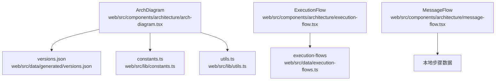
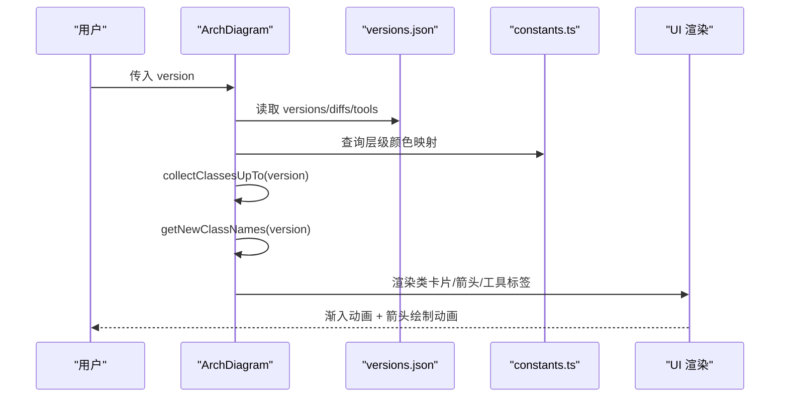
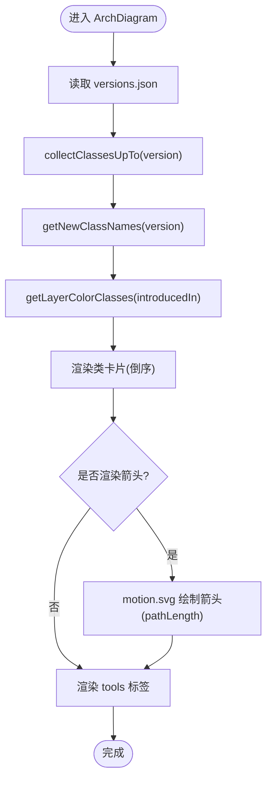
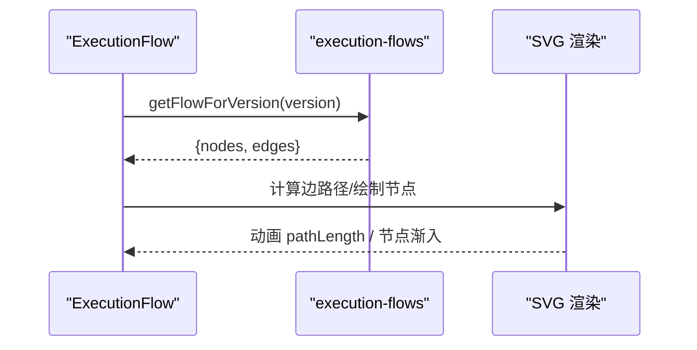
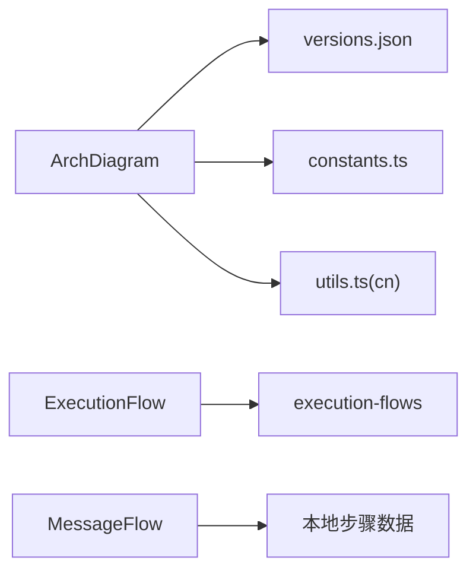

# 架构图展示组件

<cite>
**本文引用的文件**
- [arch-diagram.tsx](file://web/src/components/architecture/arch-diagram.tsx)
- [constants.ts](file://web/src/lib/constants.ts)
- [utils.ts](file://web/src/lib/utils.ts)
- [versions.json](file://web/src/data/generated/versions.json)
- [execution-flow.tsx](file://web/src/components/architecture/execution-flow.tsx)
- [message-flow.tsx](file://web/src/components/architecture/message-flow.tsx)
</cite>

## 目录
1. [简介](#简介)
2. [项目结构](#项目结构)
3. [核心组件](#核心组件)
4. [架构总览](#架构总览)
5. [详细组件分析](#详细组件分析)
6. [依赖关系分析](#依赖关系分析)
7. [性能考虑](#性能考虑)
8. [故障排查指南](#故障排查指南)
9. [结论](#结论)
10. [附录：自定义样式指南](#附录自定义样式指南)

## 简介
本组件文档聚焦于“架构图展示组件”，重点解释 ArchDiagram 的实现原理与渲染逻辑，包括版本化类图的动态生成机制（类收集、层级颜色映射、新类高亮）、Framer Motion 动画效果（渐入、箭头绘制、状态切换）、数据驱动渲染模式（versions.json 的解析与可视化转换），以及可定制的样式指南（颜色主题、边框样式、响应式布局适配）。同时补充执行流程图与消息流组件，帮助理解整体可视化体系。

## 项目结构
- 组件层
  - 架构图：ArchDiagram（类图卡片列表 + 箭头 + 工具标签）
  - 执行流程：ExecutionFlow（节点与边的 SVG 流程图）
  - 消息流：MessageFlow（消息序列动画）
- 数据与常量
  - versions.json：版本、类集合、差异信息、工具列表
  - constants.ts：版本元信息、层级定义、颜色与顺序
  - utils.ts：样式合并工具
- 入口与集成
  - 各页面通过路由参数 version 传入当前版本，触发对应数据加载与渲染

图表来源
- [arch-diagram.tsx:1-229](file://web/src/components/architecture/arch-diagram.tsx#L1-L229)
- [constants.ts:1-38](file://web/src/lib/constants.ts#L1-L38)
- [execution-flow.tsx:1-244](file://web/src/components/architecture/execution-flow.tsx#L1-L244)
- [message-flow.tsx:1-71](file://web/src/components/architecture/message-flow.tsx#L1-L71)

章节来源
- [arch-diagram.tsx:1-229](file://web/src/components/architecture/arch-diagram.tsx#L1-L229)
- [constants.ts:1-38](file://web/src/lib/constants.ts#L1-L38)
- [execution-flow.tsx:1-244](file://web/src/components/architecture/execution-flow.tsx#L1-L244)
- [message-flow.tsx:1-71](file://web/src/components/architecture/message-flow.tsx#L1-L71)

## 核心组件
- ArchDiagram
  - 输入：version（如 s01..s12）
  - 功能：根据版本收集历史类、计算新增类、按层级着色、渲染类卡片与工具标签，使用 Framer Motion 实现入场与箭头绘制动画
- ExecutionFlow
  - 输入：version
  - 功能：从 execution-flows 获取节点与边，SVG 绘制流程图，带路径绘制动画与节点渐入
- MessageFlow
  - 功能：以动画方式展示消息序列（user/assistant/tool_call/tool_result）

章节来源
- [arch-diagram.tsx:1-229](file://web/src/components/architecture/arch-diagram.tsx#L1-L229)
- [execution-flow.tsx:1-244](file://web/src/components/architecture/execution-flow.tsx#L1-L244)
- [message-flow.tsx:1-71](file://web/src/components/architecture/message-flow.tsx#L1-L71)

## 架构总览
下图展示了数据到视图的流转：版本选择驱动数据读取，数据经转换后驱动 UI 渲染；动画由 Framer Motion 统一控制。

图表来源
- [arch-diagram.tsx:71-108](file://web/src/components/architecture/arch-diagram.tsx#L71-L108)
- [arch-diagram.tsx:105-229](file://web/src/components/architecture/arch-diagram.tsx#L105-L229)
- [constants.ts:31-37](file://web/src/lib/constants.ts#L31-L37)
- [versions.json](file://web/src/data/generated/versions.json)

## 详细组件分析

### ArchDiagram：版本化类图与渲染逻辑
- 类收集机制
  - 基于 versions 数组的顺序，累计至目标版本，去重得到所有历史类，并记录每个类的引入版本
- 新增类识别
  - 优先使用 diffs.to === version 的 newClasses；若不存在则回退为当前版本的 classes 作为初始集
- 层级颜色映射
  - 通过 LAYERS 将版本映射到层级，再映射到 Tailwind 边框与背景色类名，用于区分不同阶段能力
- 渲染策略
  - 倒序渲染类卡片，使最新类位于顶部
  - 每两个类之间插入向下箭头 SVG，使用 pathLength 动画绘制
  - 新增类使用高亮边框与背景，并显示 NEW 标签
  - 底部渲染 tools 列表，延迟渐入
- 动画细节
  - 卡片：opacity + y 渐入，逐条延迟
  - 箭头：pathLength 从 0 到 1，配合小延迟形成绘制感
  - 工具标签：整体延迟后渐入

图表来源
- [arch-diagram.tsx:71-108](file://web/src/components/architecture/arch-diagram.tsx#L71-L108)
- [arch-diagram.tsx:105-229](file://web/src/components/architecture/arch-diagram.tsx#L105-L229)

章节来源
- [arch-diagram.tsx:71-108](file://web/src/components/architecture/arch-diagram.tsx#L71-L108)
- [arch-diagram.tsx:105-229](file://web/src/components/architecture/arch-diagram.tsx#L105-L229)
- [constants.ts:31-37](file://web/src/lib/constants.ts#L31-L37)

### ExecutionFlow：执行流程图
- 数据结构
  - nodes：包含类型（start/process/decision/subprocess/end）、坐标、标签
  - edges：from/to 连接，可选 label
- 渲染逻辑
  - 根据节点类型绘制不同形状（圆角矩形、菱形、虚线框等）
  - 边路径计算：垂直对齐或折线连接，使用 markerEnd 绘制箭头
  - 动画：边 pathLength 绘制动画，节点渐入
- 交互与扩展
  - 可通过修改 execution-flows 数据源定制不同版本的执行流程

图表来源
- [execution-flow.tsx:21-42](file://web/src/components/architecture/execution-flow.tsx#L21-L42)
- [execution-flow.tsx:137-182](file://web/src/components/architecture/execution-flow.tsx#L137-L182)
- [execution-flow.tsx:188-244](file://web/src/components/architecture/execution-flow.tsx#L188-L244)

章节来源
- [execution-flow.tsx:1-244](file://web/src/components/architecture/execution-flow.tsx#L1-L244)

### MessageFlow：消息流动画
- 行为
  - 定时递增计数，逐步展示消息序列，循环播放
- 动画
  - 使用 AnimatePresence 与 motion.div 实现缩放与宽度展开
- 用途
  - 直观展示一次对话中 user/assistant/tool_call/tool_result 的时序

章节来源
- [message-flow.tsx:1-71](file://web/src/components/architecture/message-flow.tsx#L1-L71)

## 依赖关系分析
- 组件依赖
  - ArchDiagram 依赖 versions.json（版本、类、差异、工具）与 constants.ts（层级与颜色）
  - ExecutionFlow 依赖 execution-flows（节点与边）
  - MessageFlow 依赖本地步骤数据
- 工具函数
  - cn 用于合并 className，简化条件样式拼接

图表来源
- [arch-diagram.tsx:1-229](file://web/src/components/architecture/arch-diagram.tsx#L1-L229)
- [execution-flow.tsx:1-244](file://web/src/components/architecture/execution-flow.tsx#L1-L244)
- [message-flow.tsx:1-71](file://web/src/components/architecture/message-flow.tsx#L1-L71)
- [utils.ts:1-4](file://web/src/lib/utils.ts#L1-L4)

章节来源
- [arch-diagram.tsx:1-229](file://web/src/components/architecture/arch-diagram.tsx#L1-L229)
- [execution-flow.tsx:1-244](file://web/src/components/architecture/execution-flow.tsx#L1-L244)
- [message-flow.tsx:1-71](file://web/src/components/architecture/message-flow.tsx#L1-L71)
- [utils.ts:1-4](file://web/src/lib/utils.ts#L1-L4)

## 性能考虑
- 数据规模
  - versions.json 可能较大，建议按需加载或缓存；当前为静态导入，适合中小规模数据
- 渲染优化
  - 类卡片与箭头采用延迟动画，避免一次性大量 DOM 更新
  - 使用 key 稳定标识（类名）减少重排
- 动画性能
  - pathLength 与 opacity/y 动画对性能友好；避免过多复杂滤镜
- 可扩展性
  - 若版本数量增长，可考虑分页或虚拟滚动；当前列表长度适中

[本节为通用指导，不直接分析具体文件]

## 故障排查指南
- 无类显示
  - 检查 versions.json 中当前版本是否存在 classes；若无，会显示“仅函数”提示
- 新增类未高亮
  - 确认 diffs 中存在 to === version 且 newClasses 非空；否则回退为当前版本 classes
- 颜色异常
  - 检查 constants.ts 中 LAYERS 是否包含该版本；缺失时回退默认色
- 动画不生效
  - 确保 Framer Motion 已安装；检查浏览器是否支持相关 CSS/JS 特性
- 箭头错位
  - 在 ExecutionFlow 中检查节点坐标与边路径计算；确保 from/to 存在

章节来源
- [arch-diagram.tsx:203-207](file://web/src/components/architecture/arch-diagram.tsx#L203-L207)
- [arch-diagram.tsx:96-103](file://web/src/components/architecture/arch-diagram.tsx#L96-L103)
- [arch-diagram.tsx:30-69](file://web/src/components/architecture/arch-diagram.tsx#L30-L69)
- [execution-flow.tsx:21-42](file://web/src/components/architecture/execution-flow.tsx#L21-L42)

## 结论
ArchDiagram 通过数据驱动的类收集与层级颜色映射，结合 Framer Motion 的流畅动画，实现了清晰、可演进的多版本架构图展示。配合 ExecutionFlow 与 MessageFlow，形成了完整的可视化体系，便于理解系统演进与运行时行为。通过合理的样式与响应式布局，可在不同设备上获得一致体验。

[本节为总结，不直接分析具体文件]

## 附录：自定义样式指南
- 颜色主题
  - 层级颜色：tools/planning/memory/concurrency/collaboration 分别映射到蓝/绿/紫/琥珀/红
  - 文本与边框：使用 CSS 变量 --color-text-secondary、--color-border、--color-bg 保持明暗主题一致
- 边框样式
  - 新增类：使用对应层级的高亮边框与半透明背景
  - 普通类：使用中性边框与浅色背景，深色模式下自动切换
- 响应式布局
  - 容器使用 flex-wrap 与 gap，保证在小屏下良好换行
  - 流程图使用横向滚动容器，避免溢出
- 动画风格
  - 统一使用淡入与位移组合；箭头绘制使用 pathLength 增强过程感
  - 延迟策略：按索引递增 delay，形成瀑布式呈现

章节来源
- [arch-diagram.tsx:30-69](file://web/src/components/architecture/arch-diagram.tsx#L30-L69)
- [arch-diagram.tsx:119-199](file://web/src/components/architecture/arch-diagram.tsx#L119-L199)
- [execution-flow.tsx:200-244](file://web/src/components/architecture/execution-flow.tsx#L200-L244)
- [message-flow.tsx:36-69](file://web/src/components/architecture/message-flow.tsx#L36-L69)