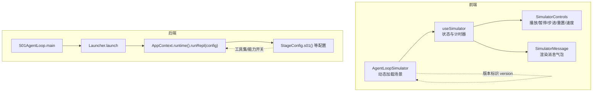
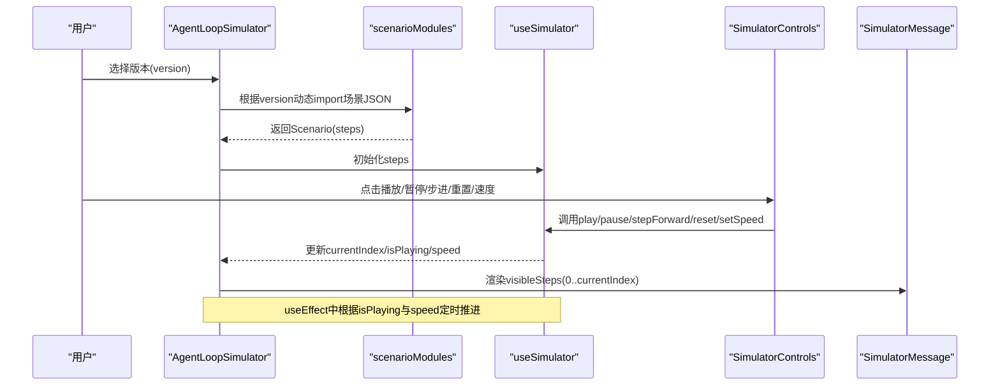
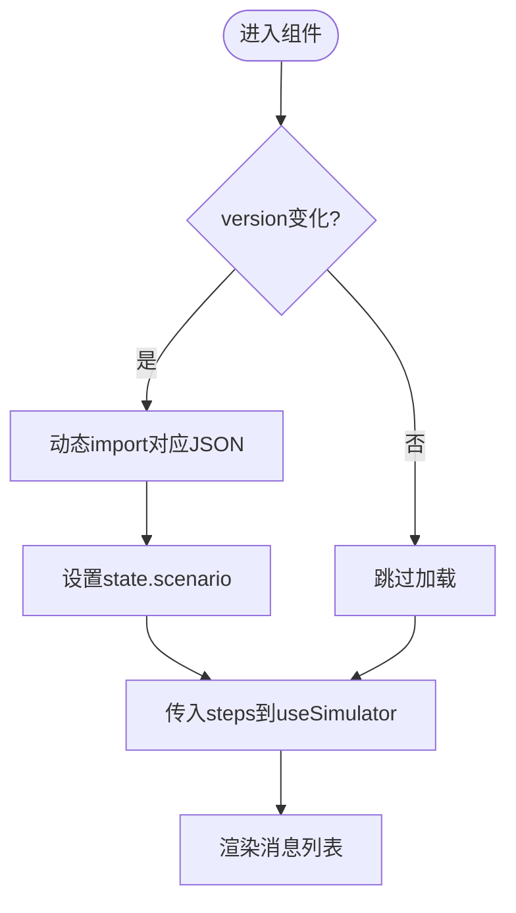
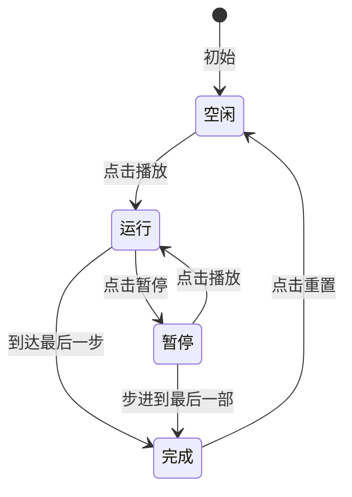
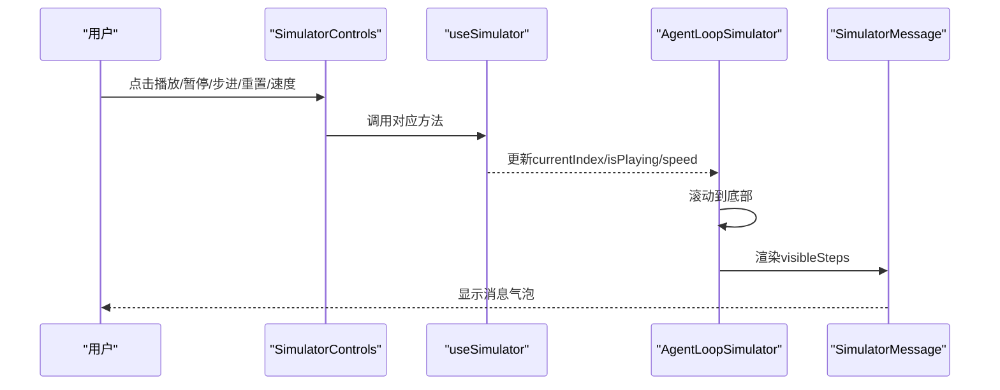
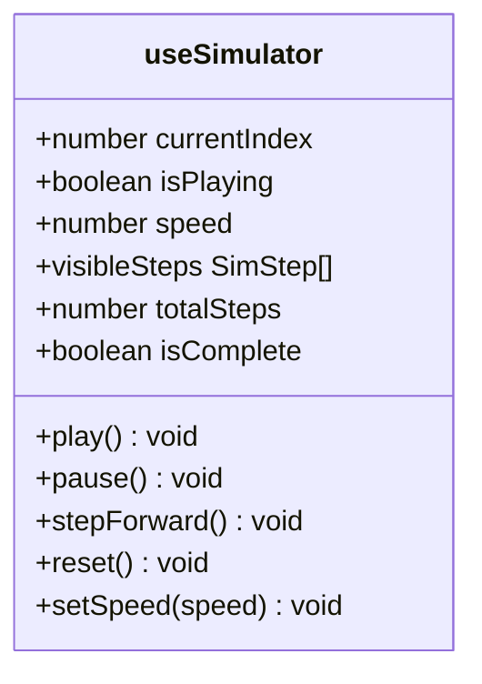
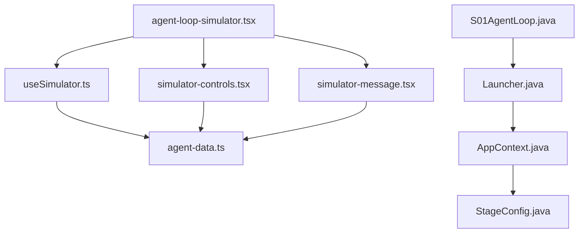

# Agent循环模拟器

<cite>
**本文引用的文件**
- [S01AgentLoop.java](file://src/main/java/com/learnclaudecode/agents/S01AgentLoop.java)
- [Launcher.java](file://src/main/java/com/learnclaudecode/agents/Launcher.java)
- [StageConfig.java](file://src/main/java/com/learnclaudecode/agents/StageConfig.java)
- [AppContext.java](file://src/main/java/com/learnclaudecode/agents/AppContext.java)
- [useSimulator.ts](file://web/src/hooks/useSimulator.ts)
- [agent-loop-simulator.tsx](file://web/src/components/simulator/agent-loop-simulator.tsx)
- [simulator-controls.tsx](file://web/src/components/simulator/simulator-controls.tsx)
- [simulator-message.tsx](file://web/src/components/simulator/simulator-message.tsx)
- [agent-data.ts](file://web/src/types/agent-data.ts)
- [s01.json](file://web/src/data/scenarios/s01.json)
- [execution-flows.ts](file://web/src/data/execution-flows.ts)
</cite>

## 目录
1. [简介](#简介)
2. [项目结构](#项目结构)
3. [核心组件](#核心组件)
4. [架构总览](#架构总览)
5. [详细组件分析](#详细组件分析)
6. [依赖关系分析](#依赖关系分析)
7. [性能考量](#性能考量)
8. [故障排查指南](#故障排查指南)
9. [结论](#结论)
10. [附录：扩展指南](#附录扩展指南)

## 简介
本文件面向“Agent循环模拟器”的文档目标，聚焦前端可视化与后端教学脚本协同工作的整体机制。内容涵盖：
- 主模拟器组件的核心功能与实现原理
- 动态场景加载机制（基于版本的模块导入与场景数据管理）
- 循环状态管理（运行、暂停、完成状态的转换逻辑）
- 消息处理管道（输入接收、处理执行、结果输出）
- 与 useSimulator Hook 的集成（步骤控制、可见性管理、性能优化）
- 扩展指南（新增场景、自定义步骤类型、事件处理机制）

## 项目结构
本项目由两部分组成：
- 后端 Java 教学脚本：通过 Launcher 统一入口启动不同 StageConfig，演示从最小闭环到多 Agent 协作的演进。
- 前端 Next.js 模拟器：根据版本动态加载场景 JSON，驱动步骤播放、暂停、步进、速度调节等交互，并以消息流形式展示 Agent 循环过程。

图表来源
- [agent-loop-simulator.tsx:11-42](file://web/src/components/simulator/agent-loop-simulator.tsx#L11-L42)
- [useSimulator.ts:12-84](file://web/src/hooks/useSimulator.ts#L12-L84)
- [simulator-controls.tsx:22-99](file://web/src/components/simulator/simulator-controls.tsx#L22-L99)
- [simulator-message.tsx:49-93](file://web/src/components/simulator/simulator-message.tsx#L49-L93)
- [S01AgentLoop.java:9-11](file://src/main/java/com/learnclaudecode/agents/S01AgentLoop.java#L9-L11)
- [Launcher.java:23-26](file://src/main/java/com/learnclaudecode/agents/Launcher.java#L23-L26)
- [AppContext.java:35-58](file://src/main/java/com/learnclaudecode/agents/AppContext.java#L35-L58)
- [StageConfig.java:77-82](file://src/main/java/com/learnclaudecode/agents/StageConfig.java#L77-L82)

章节来源
- [agent-loop-simulator.tsx:11-42](file://web/src/components/simulator/agent-loop-simulator.tsx#L11-L42)
- [useSimulator.ts:12-84](file://web/src/hooks/useSimulator.ts#L12-L84)
- [S01AgentLoop.java:9-11](file://src/main/java/com/learnclaudecode/agents/S01AgentLoop.java#L9-L11)
- [Launcher.java:23-26](file://src/main/java/com/learnclaudecode/agents/Launcher.java#L23-L26)
- [AppContext.java:35-58](file://src/main/java/com/learnclaudecode/agents/AppContext.java#L35-L58)
- [StageConfig.java:77-82](file://src/main/java/com/learnclaudecode/agents/StageConfig.java#L77-L82)

## 核心组件
- 动态场景加载器：按版本 key 动态 import 对应 JSON 场景，避免一次性加载全部资源。
- 模拟器状态 Hook：维护 currentIndex、isPlaying、speed，提供 play/pause/stepForward/reset/setSpeed 等方法，并自动推进可见步骤。
- 控制面板：封装播放、暂停、步进、重置和速度选择按钮，驱动状态变化。
- 消息渲染：按步骤类型（用户消息、助手文本、工具调用、工具结果、系统事件）差异化渲染。
- 后端教学脚本：以 StageConfig 为编排中心，逐步打开工具和能力开关，配合统一运行时执行。

章节来源
- [agent-loop-simulator.tsx:11-42](file://web/src/components/simulator/agent-loop-simulator.tsx#L11-L42)
- [useSimulator.ts:12-84](file://web/src/hooks/useSimulator.ts#L12-L84)
- [simulator-controls.tsx:22-99](file://web/src/components/simulator/simulator-controls.tsx#L22-L99)
- [simulator-message.tsx:49-93](file://web/src/components/simulator/simulator-message.tsx#L49-L93)
- [StageConfig.java:77-82](file://src/main/java/com/learnclaudecode/agents/StageConfig.java#L77-L82)

## 架构总览
下图展示了从版本选择到场景加载、状态推进、消息渲染的整体流程，以及后端教学脚本的启动链路。

图表来源
- [agent-loop-simulator.tsx:11-42](file://web/src/components/simulator/agent-loop-simulator.tsx#L11-L42)
- [useSimulator.ts:59-69](file://web/src/hooks/useSimulator.ts#L59-L69)
- [simulator-controls.tsx:22-99](file://web/src/components/simulator/simulator-controls.tsx#L22-L99)
- [simulator-message.tsx:49-93](file://web/src/components/simulator/simulator-message.tsx#L49-L93)

## 详细组件分析

### 动态场景加载机制（基于版本的模块导入与场景数据管理）
- 版本映射表：在组件内维护一个版本到动态 import 函数的映射，key 为 s01..s12，value 为按需加载对应 JSON 的函数。
- 懒加载策略：仅在版本变化时触发 import，并将默认导出作为 Scenario 对象缓存到本地 state。
- 数据结构：Scenario 包含 version、title、description、steps；每个 step 具备 type、content、annotation，可选 toolName、toolInput。
- 执行流视图：execution-flows.ts 提供各版本的流程图定义，用于可视化解释执行路径。

图表来源
- [agent-loop-simulator.tsx:11-42](file://web/src/components/simulator/agent-loop-simulator.tsx#L11-L42)
- [agent-data.ts:38-58](file://web/src/types/agent-data.ts#L38-L58)
- [execution-flows.ts:13-315](file://web/src/data/execution-flows.ts#L13-L315)

章节来源
- [agent-loop-simulator.tsx:11-42](file://web/src/components/simulator/agent-loop-simulator.tsx#L11-L42)
- [agent-data.ts:38-58](file://web/src/types/agent-data.ts#L38-L58)
- [execution-flows.ts:13-315](file://web/src/data/execution-flows.ts#L13-L315)

### 循环状态管理（运行、暂停、完成状态的转换逻辑）
- 状态字段：currentIndex（当前步骤索引）、isPlaying（是否自动播放）、speed（播放倍速）。
- 播放逻辑：当 isPlaying 为真且未到达最后一步时，使用 setTimeout 按 speed 计算延迟推进到下一步；到达末尾时自动停止。
- 暂停逻辑：清除定时器并将 isPlaying 置为 false。
- 步进逻辑：每次前进一步；若已到末尾则停止播放。
- 重置逻辑：清除定时器，将 currentIndex 复位为 -1，保持 speed 不变。
- 完成判定：currentIndex >= steps.length - 1 视为完成。

图表来源
- [useSimulator.ts:27-69](file://web/src/hooks/useSimulator.ts#L27-L69)

章节来源
- [useSimulator.ts:27-69](file://web/src/hooks/useSimulator.ts#L27-L69)

### 消息处理管道（输入接收、处理执行、结果输出）
- 输入接收：用户通过 SimulatorControls 触发操作（播放/暂停/步进/重置/速度），这些操作最终转化为对 useSimulator 的方法调用。
- 处理执行：useSimulator 内部维护定时器与状态，按规则推进 currentIndex，生成 visibleSteps。
- 结果输出：AgentLoopSimulator 监听 visibleSteps 长度变化，滚动到底部并渲染每条消息；SimulatorMessage 根据步骤类型渲染不同样式与图标。

图表来源
- [simulator-controls.tsx:22-99](file://web/src/components/simulator/simulator-controls.tsx#L22-L99)
- [useSimulator.ts:27-84](file://web/src/hooks/useSimulator.ts#L27-L84)
- [agent-loop-simulator.tsx:44-51](file://web/src/components/simulator/agent-loop-simulator.tsx#L44-L51)
- [simulator-message.tsx:49-93](file://web/src/components/simulator/simulator-message.tsx#L49-L93)

章节来源
- [simulator-controls.tsx:22-99](file://web/src/components/simulator/simulator-controls.tsx#L22-L99)
- [useSimulator.ts:27-84](file://web/src/hooks/useSimulator.ts#L27-L84)
- [agent-loop-simulator.tsx:44-51](file://web/src/components/simulator/agent-loop-simulator.tsx#L44-L51)
- [simulator-message.tsx:49-93](file://web/src/components/simulator/simulator-message.tsx#L49-L93)

### 与 useSimulator Hook 的集成（步骤控制、可见性管理、性能优化）
- 步骤控制：暴露 play、pause、stepForward、reset、setSpeed，供外部 UI 调用。
- 可见性管理：通过 steps.slice(0, currentIndex + 1) 生成 visibleSteps，仅渲染已到达的步骤，减少 DOM 压力。
- 性能优化：
  - 使用 useRef 保存定时器句柄，避免重复创建与内存泄漏。
  - 使用 useCallback 稳定回调引用，降低子组件重渲染。
  - 在 effect 中清理定时器，确保组件卸载或依赖变化时及时释放。
  - 条件判断避免在已完成状态下继续推进。

图表来源
- [useSimulator.ts:12-84](file://web/src/hooks/useSimulator.ts#L12-L84)

章节来源
- [useSimulator.ts:12-84](file://web/src/hooks/useSimulator.ts#L12-L84)

### 后端教学脚本与阶段配置（补充说明）
- 统一入口：S01AgentLoop.main 调用 Launcher.launch，传入 StageConfig.s01()。
- 装配上下文：AppContext 集中创建共享服务（命令工具、任务管理、后台任务、团队通信、worktree 等），并注入 AgentRuntime。
- 阶段配置：StageConfig 定义 system prompt、工具集合、能力开关（Todo、压缩、后台、团队、自治队友、worktree），并通过 systemPrompt 动态展开工作区与技能信息。

图表来源
- [S01AgentLoop.java:9-11](file://src/main/java/com/learnclaudecode/agents/S01AgentLoop.java#L9-L11)
- [Launcher.java:23-26](file://src/main/java/com/learnclaudecode/agents/Launcher.java#L23-L26)
- [AppContext.java:35-58](file://src/main/java/com/learnclaudecode/agents/AppContext.java#L35-L58)
- [StageConfig.java:77-82](file://src/main/java/com/learnclaudecode/agents/StageConfig.java#L77-L82)

章节来源
- [S01AgentLoop.java:9-11](file://src/main/java/com/learnclaudecode/agents/S01AgentLoop.java#L9-L11)
- [Launcher.java:23-26](file://src/main/java/com/learnclaudecode/agents/Launcher.java#L23-L26)
- [AppContext.java:35-58](file://src/main/java/com/learnclaudecode/agents/AppContext.java#L35-L58)
- [StageConfig.java:77-82](file://src/main/java/com/learnclaudecode/agents/StageConfig.java#L77-L82)

## 依赖关系分析
- 前端依赖：
  - agent-loop-simulator.tsx 依赖 useSimulator、SimulatorControls、SimulatorMessage、types/agent-data。
  - useSimulator 依赖 types/agent-data 中的 SimStep。
  - simulator-controls.tsx 依赖 i18n 与 lucide 图标库。
  - simulator-message.tsx 依赖 framer-motion 动画与类型定义。
- 后端依赖：
  - S01AgentLoop 依赖 Launcher 与 StageConfig。
  - Launcher 依赖 AppContext。
  - AppContext 依赖多个子系统（命令工具、任务管理、后台任务、团队通信、worktree 等）。
  - StageConfig 提供不同阶段的工具与能力开关。

图表来源
- [agent-loop-simulator.tsx:1-9](file://web/src/components/simulator/agent-loop-simulator.tsx#L1-L9)
- [useSimulator.ts:1-5](file://web/src/hooks/useSimulator.ts#L1-L5)
- [simulator-controls.tsx:1-6](file://web/src/components/simulator/simulator-controls.tsx#L1-L6)
- [simulator-message.tsx:1-6](file://web/src/components/simulator/simulator-message.tsx#L1-L6)
- [agent-data.ts:38-58](file://web/src/types/agent-data.ts#L38-L58)
- [S01AgentLoop.java:9-11](file://src/main/java/com/learnclaudecode/agents/S01AgentLoop.java#L9-L11)
- [Launcher.java:23-26](file://src/main/java/com/learnclaudecode/agents/Launcher.java#L23-L26)
- [AppContext.java:35-58](file://src/main/java/com/learnclaudecode/agents/AppContext.java#L35-L58)
- [StageConfig.java:77-82](file://src/main/java/com/learnclaudecode/agents/StageConfig.java#L77-L82)

章节来源
- [agent-loop-simulator.tsx:1-9](file://web/src/components/simulator/agent-loop-simulator.tsx#L1-L9)
- [useSimulator.ts:1-5](file://web/src/hooks/useSimulator.ts#L1-L5)
- [simulator-controls.tsx:1-6](file://web/src/components/simulator/simulator-controls.tsx#L1-L6)
- [simulator-message.tsx:1-6](file://web/src/components/simulator/simulator-message.tsx#L1-L6)
- [agent-data.ts:38-58](file://web/src/types/agent-data.ts#L38-L58)
- [S01AgentLoop.java:9-11](file://src/main/java/com/learnclaudecode/agents/S01AgentLoop.java#L9-L11)
- [Launcher.java:23-26](file://src/main/java/com/learnclaudecode/agents/Launcher.java#L23-L26)
- [AppContext.java:35-58](file://src/main/java/com/learnclaudecode/agents/AppContext.java#L35-L58)
- [StageConfig.java:77-82](file://src/main/java/com/learnclaudecode/agents/StageConfig.java#L77-L82)

## 性能考量
- 懒加载场景：按版本动态 import JSON，避免一次性加载所有场景数据，减小首屏体积。
- 可见步骤裁剪：仅渲染 visibleSteps，降低 DOM 节点数量与重绘开销。
- 定时器管理：使用 useRef 保存定时器句柄，并在 effect 清理，防止内存泄漏与竞态。
- 回调稳定性：使用 useCallback 稳定函数引用，减少不必要的子组件重渲染。
- 动画与滚动：framer-motion 提供轻量动画；滚动到底部时使用 smooth 行为提升体验。

[本节为通用性能建议，不直接分析具体文件]

## 故障排查指南
- 场景未加载：检查版本 key 是否在 scenarioModules 映射中存在；确认动态 import 路径正确。
- 播放不停止：确认 steps 长度与 currentIndex 边界判断；检查 effect 依赖是否包含 steps.length。
- 定时器泄漏：确保 pause 与 reset 中调用 clearTimer；组件卸载时 effect 清理定时器。
- 消息未渲染：确认 visibleSteps 是否正确生成；检查 SimulatorMessage 的类型配置是否覆盖新步骤类型。
- 后端无响应：确认 Launcher 是否正确调用 AppContext.runtime().runRepl(config)，并验证 StageConfig 的工具与能力开关。

章节来源
- [agent-loop-simulator.tsx:11-42](file://web/src/components/simulator/agent-loop-simulator.tsx#L11-L42)
- [useSimulator.ts:27-69](file://web/src/hooks/useSimulator.ts#L27-L69)
- [simulator-message.tsx:49-93](file://web/src/components/simulator/simulator-message.tsx#L49-L93)
- [Launcher.java:23-26](file://src/main/java/com/learnclaudecode/agents/Launcher.java#L23-L26)
- [StageConfig.java:77-82](file://src/main/java/com/learnclaudecode/agents/StageConfig.java#L77-L82)

## 结论
该模拟器通过前后端协同实现了 Agent 循环的可视化教学：前端负责动态场景加载、状态管理与消息渲染，后端通过 StageConfig 编排不同阶段的能力与工具。useSimulator Hook 提供了简洁的状态控制接口，结合懒加载与可见步骤裁剪，保证了良好的用户体验与性能。后续可通过扩展场景数据、步骤类型与事件处理机制，进一步增强模拟器的表达能力与可维护性。

[本节为总结性内容，不直接分析具体文件]

## 附录：扩展指南

### 新增场景
- 在 web/src/data/scenarios 下新增 JSON 文件，遵循 Scenario 结构（version、title、description、steps）。
- 在 agent-loop-simulator.tsx 的 scenarioModules 中添加版本键与动态 import 映射。
- 如需配套流程图，可在 execution-flows.ts 中添加对应版本的 FlowDefinition。

章节来源
- [agent-loop-simulator.tsx:11-24](file://web/src/components/simulator/agent-loop-simulator.tsx#L11-L24)
- [execution-flows.ts:13-315](file://web/src/data/execution-flows.ts#L13-L315)
- [agent-data.ts:53-58](file://web/src/types/agent-data.ts#L53-L58)

### 自定义步骤类型
- 在 agent-data.ts 的 SimStepType 中添加新类型（如 custom_action）。
- 在 simulator-message.tsx 的 TYPE_CONFIG 中为新类型添加图标、标签、背景与边框样式。
- 在场景中为该步骤填充 content、annotation、toolName（可选）等字段。

章节来源
- [agent-data.ts:38-51](file://web/src/types/agent-data.ts#L38-L51)
- [simulator-message.tsx:13-47](file://web/src/components/simulator/simulator-message.tsx#L13-L47)

### 事件处理机制
- 在 useSimulator 中增加对外事件回调（如 onStepStart、onStepEnd、onComplete），在相应时机触发。
- 在 AgentLoopSimulator 中订阅事件，记录日志或触发额外 UI 行为（如高亮当前步骤、弹出提示）。
- 在 SimulatorControls 中可根据事件状态禁用/启用按钮，提升交互一致性。

[本节为概念性扩展建议，不直接分析具体文件]