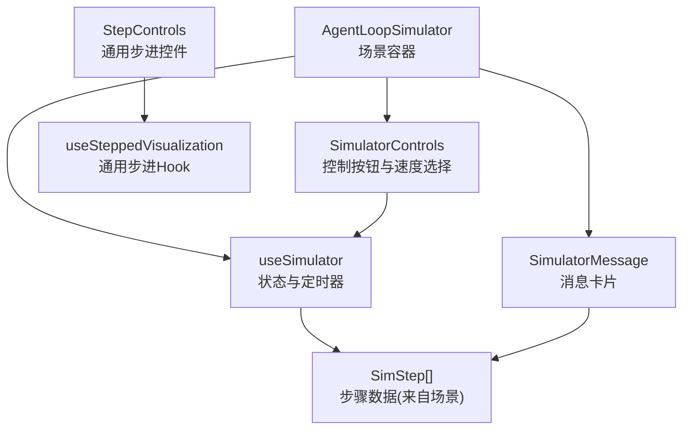
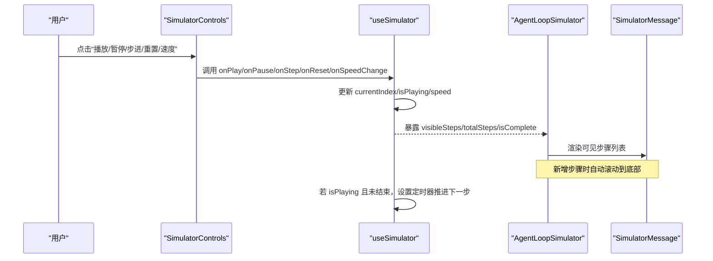
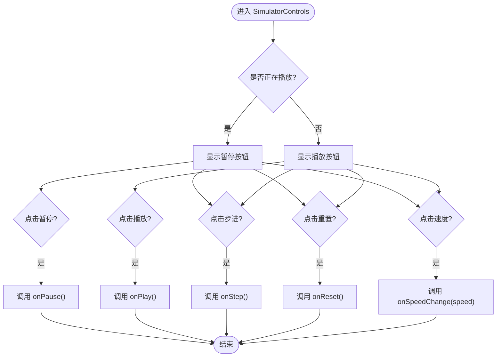
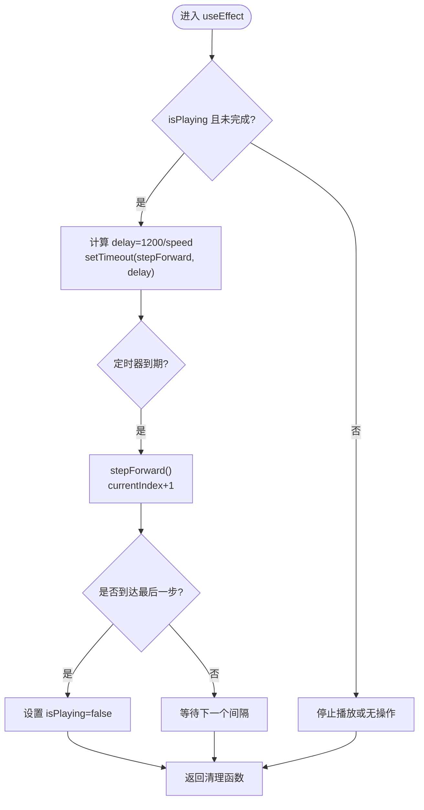
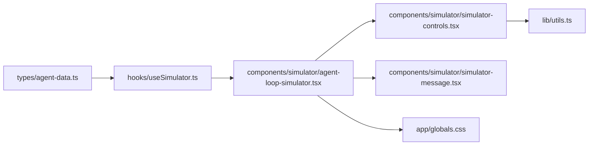

# 模拟器控制面板

<cite>
**本文引用的文件**
- [simulator-controls.tsx](file://web/src/components/simulator/simulator-controls.tsx)
- [useSimulator.ts](file://web/src/hooks/useSimulator.ts)
- [agent-loop-simulator.tsx](file://web/src/components/simulator/agent-loop-simulator.tsx)
- [simulator-message.tsx](file://web/src/components/simulator/simulator-message.tsx)
- [step-controls.tsx](file://web/src/components/visualizations/shared/step-controls.tsx)
- [useSteppedVisualization.ts](file://web/src/hooks/useSteppedVisualization.ts)
- [agent-data.ts](file://web/src/types/agent-data.ts)
- [utils.ts](file://web/src/lib/utils.ts)
- [globals.css](file://web/src/app/globals.css)
</cite>

## 目录
1. [简介](#简介)
2. [项目结构](#项目结构)
3. [核心组件](#核心组件)
4. [架构总览](#架构总览)
5. [详细组件分析](#详细组件分析)
6. [依赖关系分析](#依赖关系分析)
7. [性能考虑](#性能考虑)
8. [故障排查指南](#故障排查指南)
9. [结论](#结论)
10. [附录：自定义控件指南](#附录自定义控件指南)

## 简介
本文件面向“模拟器控制面板”的用户交互界面设计与实现，覆盖控制按钮（启动、停止、重置、步进）的实现逻辑、参数配置（播放速度、进度显示、状态指示）、事件处理机制（用户操作响应、状态同步、错误处理）、UI 组件设计（按钮样式、动画效果、响应式布局），并提供扩展与定制新控制项的方法。

## 项目结构
模拟器控制面板由以下关键部分组成：
- 控制器 UI：提供播放/暂停、步进、重置和速度调节等交互入口
- 状态管理 Hook：封装播放状态、定时器、步进推进与完成态判断
- 场景渲染容器：加载场景数据、组合控制器与消息列表、自动滚动
- 消息卡片：按类型渲染不同消息并附带入场动画
- 通用步进控件：用于可视化演示的通用前后步控制与进度点
- 类型定义：统一步骤数据结构与场景描述
- 工具函数与全局样式：类名合并、主题变量与暗色模式支持

图表来源
- [agent-loop-simulator.tsx:30-96](file://web/src/components/simulator/agent-loop-simulator.tsx#L30-L96)
- [simulator-controls.tsx:22-99](file://web/src/components/simulator/simulator-controls.tsx#L22-L99)
- [useSimulator.ts:12-84](file://web/src/hooks/useSimulator.ts#L12-L84)
- [simulator-message.tsx:49-93](file://web/src/components/simulator/simulator-message.tsx#L49-L93)
- [step-controls.tsx:19-102](file://web/src/components/visualizations/shared/step-controls.tsx#L19-L102)
- [useSteppedVisualization.ts:23-84](file://web/src/hooks/useSteppedVisualization.ts#L23-L84)

章节来源
- [agent-loop-simulator.tsx:30-96](file://web/src/components/simulator/agent-loop-simulator.tsx#L30-L96)
- [simulator-controls.tsx:22-99](file://web/src/components/simulator/simulator-controls.tsx#L22-L99)
- [useSimulator.ts:12-84](file://web/src/hooks/useSimulator.ts#L12-L84)
- [simulator-message.tsx:49-93](file://web/src/components/simulator/simulator-message.tsx#L49-L93)
- [step-controls.tsx:19-102](file://web/src/components/visualizations/shared/step-controls.tsx#L19-L102)
- [useSteppedVisualization.ts:23-84](file://web/src/hooks/useSteppedVisualization.ts#L23-L84)

## 核心组件
- 控制器面板（SimulatorControls）
  - 功能：播放/暂停切换、单步前进、重置、速度选择（0.5x/1x/2x/4x）、当前步骤/总步骤计数
  - 交互：点击触发回调；完成时禁用部分按钮；选中速度高亮
  - 样式：圆角按钮、悬停与禁用态、暗色模式适配、紧凑布局
- 状态管理 Hook（useSimulator）
  - 状态：当前索引、是否播放、速度
  - 行为：play/pause/reset/stepForward/setSpeed
  - 自动播放：基于 setTimeout 的定时器，延迟=1200ms/速度；到达末尾自动停止
  - 输出：visibleSteps、totalSteps、isComplete 等派生值
- 场景容器（AgentLoopSimulator）
  - 动态加载场景 JSON，传入 useSimulator
  - 组合控制器与消息列表，自动滚动到底部
  - 使用 AnimatePresence 进行消息出现动画
- 消息卡片（SimulatorMessage）
  - 根据类型渲染不同图标、背景与边框
  - 工具调用/结果以代码块展示，系统事件特殊高亮
  - 入场动画：淡入+上移
- 通用步进控件（StepControls + useSteppedVisualization）
  - 提供上一/下一/重置/自动播放切换
  - 进度点指示器与当前步骤/总步骤文本
  - 适用于可视化演示场景

章节来源
- [simulator-controls.tsx:22-99](file://web/src/components/simulator/simulator-controls.tsx#L22-L99)
- [useSimulator.ts:12-84](file://web/src/hooks/useSimulator.ts#L12-L84)
- [agent-loop-simulator.tsx:30-96](file://web/src/components/simulator/agent-loop-simulator.tsx#L30-L96)
- [simulator-message.tsx:49-93](file://web/src/components/simulator/simulator-message.tsx#L49-L93)
- [step-controls.tsx:19-102](file://web/src/components/visualizations/shared/step-controls.tsx#L19-L102)
- [useSteppedVisualization.ts:23-84](file://web/src/hooks/useSteppedVisualization.ts#L23-L84)

## 架构总览
下图展示了从用户操作到状态更新再到视图更新的完整流程。

图表来源
- [simulator-controls.tsx:36-99](file://web/src/components/simulator/simulator-controls.tsx#L36-L99)
- [useSimulator.ts:27-69](file://web/src/hooks/useSimulator.ts#L27-L69)
- [agent-loop-simulator.tsx:44-91](file://web/src/components/simulator/agent-loop-simulator.tsx#L44-L91)
- [simulator-message.tsx:53-93](file://web/src/components/simulator/simulator-message.tsx#L53-L93)

## 详细组件分析

### 控制器面板（SimulatorControls）
- 控制按钮
  - 播放/暂停：根据 isPlaying 切换图标与标题；完成时禁用播放
  - 步进：每点击一次将当前索引+1，到达末尾时禁用
  - 重置：清空定时器并回到初始状态（currentIndex=-1，isPlaying=false）
- 速度调节
  - 预设档位：0.5x、1x、2x、4x
  - 选中态高亮，通过 onSpeedChange 通知上层
- 进度显示
  - 右侧显示“当前步骤/总步骤”，便于定位
- 样式与可访问性
  - 圆角、悬停与禁用态、暗色模式变量
  - 使用 title 提供工具提示

图表来源
- [simulator-controls.tsx:36-99](file://web/src/components/simulator/simulator-controls.tsx#L36-L99)

章节来源
- [simulator-controls.tsx:22-99](file://web/src/components/simulator/simulator-controls.tsx#L22-L99)

### 状态管理 Hook（useSimulator）
- 状态与副作用
  - 使用 useState 维护 currentIndex、isPlaying、speed
  - 使用 useRef 保存定时器引用，确保在清理时释放
  - useEffect 监听 isPlaying/currentIndex/speed/steps.length，驱动自动播放
- 算法要点
  - 自动播放间隔 = 1200ms / speed
  - 到达最后一步时自动停止播放
  - reset 会清除定时器并恢复初始状态，保留当前速度
- 复杂度
  - 每次步进 O(1)
  - 定时器调度 O(1)，内存占用恒定

图表来源
- [useSimulator.ts:59-69](file://web/src/hooks/useSimulator.ts#L59-L69)
- [useSimulator.ts:27-53](file://web/src/hooks/useSimulator.ts#L27-L53)

章节来源
- [useSimulator.ts:12-84](file://web/src/hooks/useSimulator.ts#L12-L84)

### 场景容器（AgentLoopSimulator）
- 场景加载：根据版本标识动态 import 对应 JSON 场景
- 组合渲染：将 useSimulator 暴露的状态与方法传递给控制器，渲染可见步骤列表
- 滚动行为：当可见步骤变化时，平滑滚动至底部
- 动画：使用 AnimatePresence 包裹消息列表，实现新增条目弹出动画

章节来源
- [agent-loop-simulator.tsx:30-96](file://web/src/components/simulator/agent-loop-simulator.tsx#L30-L96)

### 消息卡片（SimulatorMessage）
- 类型映射：用户消息、助手文本、工具调用、工具结果、系统事件分别对应不同图标、背景与边框
- 内容渲染：工具调用/结果以代码块形式展示，系统事件使用深色背景突出
- 动画：入场时淡入并轻微上移，提升视觉层次

章节来源
- [simulator-message.tsx:49-93](file://web/src/components/simulator/simulator-message.tsx#L49-L93)

### 通用步进控件（StepControls + useSteppedVisualization）
- 功能：上一/下一/重置/自动播放切换，进度点指示器，当前步骤/总步骤文本
- 适用：可视化演示场景，独立于模拟器主流程
- 状态：内部维护 currentStep、isPlaying，定时推进并在末尾停止

章节来源
- [step-controls.tsx:19-102](file://web/src/components/visualizations/shared/step-controls.tsx#L19-L102)
- [useSteppedVisualization.ts:23-84](file://web/src/hooks/useSteppedVisualization.ts#L23-L84)

## 依赖关系分析
- 组件耦合
  - AgentLoopSimulator 依赖 useSimulator 与两个子组件（控制器、消息）
  - SimulatorControls 仅依赖 i18n、图标库与工具函数，低耦合
  - useSimulator 依赖 SimStep 类型，不直接依赖 UI
- 外部依赖
  - lucide-react：图标
  - framer-motion：动画
  - Tailwind CSS：样式与暗色模式变量
- 潜在循环依赖
  - 无直接循环导入；组件通过 props 与 hooks 解耦

图表来源
- [agent-data.ts:38-58](file://web/src/types/agent-data.ts#L38-L58)
- [useSimulator.ts:12-84](file://web/src/hooks/useSimulator.ts#L12-L84)
- [agent-loop-simulator.tsx:30-96](file://web/src/components/simulator/agent-loop-simulator.tsx#L30-L96)
- [simulator-controls.tsx:22-99](file://web/src/components/simulator/simulator-controls.tsx#L22-L99)
- [simulator-message.tsx:49-93](file://web/src/components/simulator/simulator-message.tsx#L49-L93)
- [utils.ts:1-4](file://web/src/lib/utils.ts#L1-L4)
- [globals.css:5-24](file://web/src/app/globals.css#L5-L24)

章节来源
- [agent-data.ts:38-58](file://web/src/types/agent-data.ts#L38-L58)
- [useSimulator.ts:12-84](file://web/src/hooks/useSimulator.ts#L12-L84)
- [agent-loop-simulator.tsx:30-96](file://web/src/components/simulator/agent-loop-simulator.tsx#L30-L96)
- [simulator-controls.tsx:22-99](file://web/src/components/simulator/simulator-controls.tsx#L22-L99)
- [simulator-message.tsx:49-93](file://web/src/components/simulator/simulator-message.tsx#L49-L93)
- [utils.ts:1-4](file://web/src/lib/utils.ts#L1-L4)
- [globals.css:5-24](file://web/src/app/globals.css#L5-L24)

## 性能考虑
- 定时器管理
  - 使用 useRef 保存定时器，避免重复创建与内存泄漏
  - 在 pause/reset 时及时清理
- 渲染优化
  - 仅渲染 visibleSteps，减少长列表开销
  - 使用 key 稳定化列表项，配合 AnimatePresence 提高动画性能
- 样式与主题
  - 通过 CSS 变量与 Tailwind 暗色模式，避免运行时条件分支过多
- 可扩展性
  - 速度档位为常量数组，易于扩展更多档位
  - 场景数据与渲染解耦，新增场景无需修改组件逻辑

[本节为通用指导，不直接分析具体文件]

## 故障排查指南
- 播放不停止
  - 检查是否在到达最后一步后正确设置 isPlaying=false
  - 确认定时器未被意外复用或未及时清理
- 步进无效
  - 检查 steps.length 是否为 0 或场景未加载成功
  - 确认 stepForward 边界判断是否正确
- 速度调节无效果
  - 检查 onSpeedChange 是否被正确调用并更新 state.speed
  - 确认 useEffect 依赖包含 speed，以便重新计算定时器间隔
- 滚动异常
  - 检查 scrollRef 是否存在以及 visibleSteps 长度变化是否触发滚动
- 样式错乱
  - 确认 dark 类已正确应用，CSS 变量生效
  - 检查 Tailwind 类名拼接是否使用了 cn 工具函数

章节来源
- [useSimulator.ts:20-69](file://web/src/hooks/useSimulator.ts#L20-L69)
- [agent-loop-simulator.tsx:44-51](file://web/src/components/simulator/agent-loop-simulator.tsx#L44-L51)
- [simulator-controls.tsx:78-91](file://web/src/components/simulator/simulator-controls.tsx#L78-L91)
- [utils.ts:1-4](file://web/src/lib/utils.ts#L1-L4)
- [globals.css:5-24](file://web/src/app/globals.css#L5-L24)

## 结论
模拟器控制面板通过清晰的职责划分实现了可控、可扩展的交互体验：控制器负责输入，Hook 管理状态与定时器，容器负责场景装配与动画，消息卡片负责信息呈现。整体架构低耦合、易扩展，适合教学与演示场景。

[本节为总结，不直接分析具体文件]

## 附录：自定义控件指南
- 添加新控制项
  - 在 SimulatorControls 中新增按钮或滑块，绑定相应回调（如 onNewAction）
  - 在 useSimulator 中增加对应状态与处理方法，并通过 props 暴露给控制器
  - 在 AgentLoopSimulator 中传递新回调与状态
- 样式定制
  - 使用 Tailwind 类与 cn 工具函数组合样式
  - 利用 globals.css 中的 CSS 变量与暗色模式保持一致风格
  - 对按钮增加 hover/disabled 态，保持可访问性（title、aria-*）
- 事件绑定方法
  - 控制器只负责派发事件，状态变更集中在 Hook 中
  - 使用 useCallback 包装回调以避免不必要的重渲染
  - 对于异步或复杂逻辑，可在容器层封装后再传给控制器
- 示例路径参考
  - 控制器组件：[simulator-controls.tsx](file://web/src/components/simulator/simulator-controls.tsx)
  - 状态 Hook：[useSimulator.ts](file://web/src/hooks/useSimulator.ts)
  - 容器组件：[agent-loop-simulator.tsx](file://web/src/components/simulator/agent-loop-simulator.tsx)
  - 工具函数：[utils.ts](file://web/src/lib/utils.ts)
  - 全局样式：[globals.css](file://web/src/app/globals.css)

章节来源
- [simulator-controls.tsx:22-99](file://web/src/components/simulator/simulator-controls.tsx#L22-L99)
- [useSimulator.ts:12-84](file://web/src/hooks/useSimulator.ts#L12-L84)
- [agent-loop-simulator.tsx:30-96](file://web/src/components/simulator/agent-loop-simulator.tsx#L30-L96)
- [utils.ts:1-4](file://web/src/lib/utils.ts#L1-L4)
- [globals.css:5-24](file://web/src/app/globals.css#L5-L24)