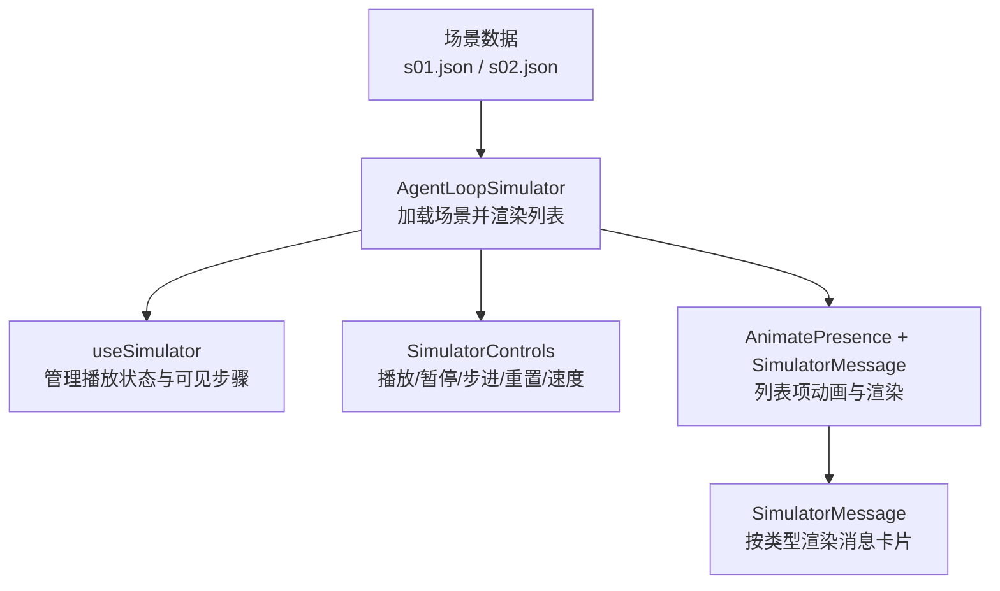
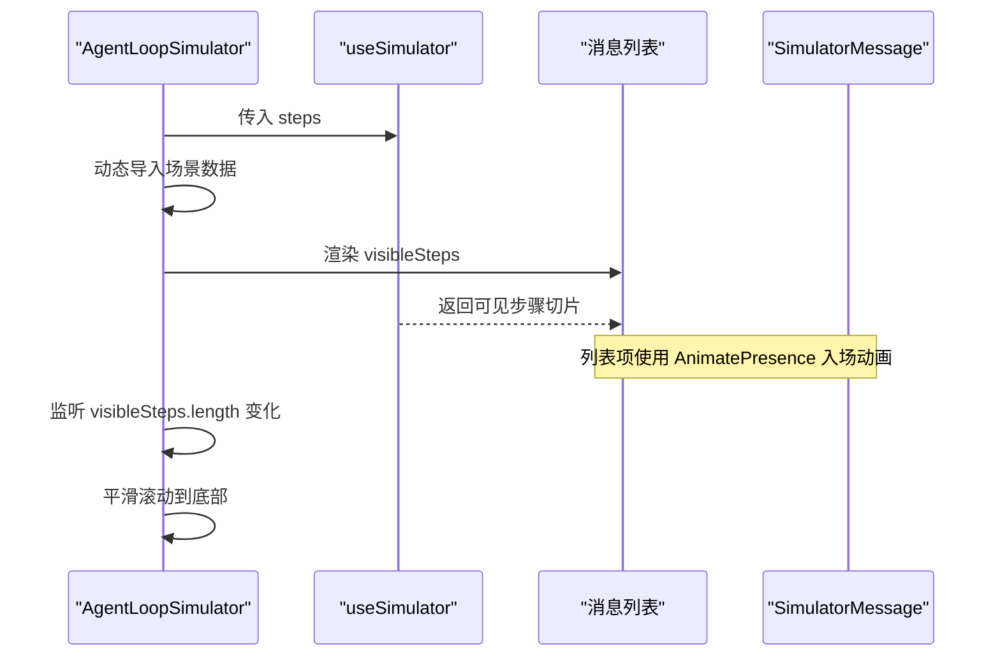
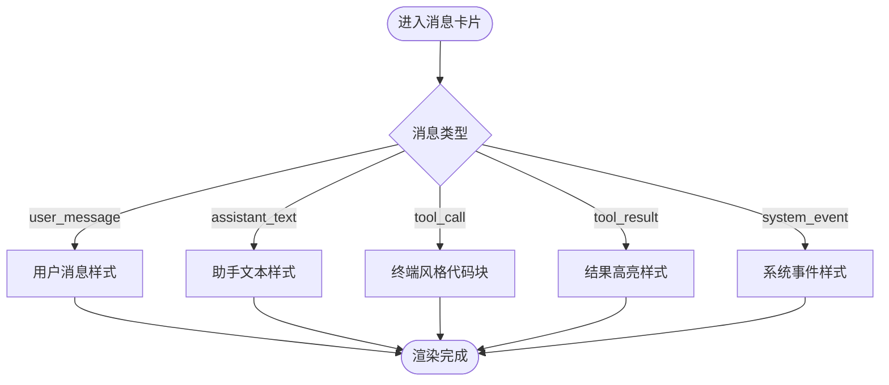
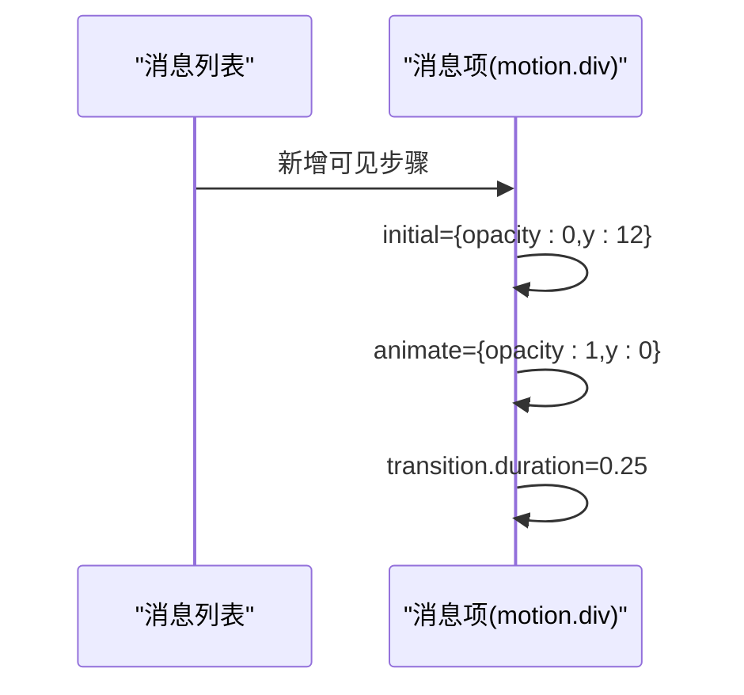
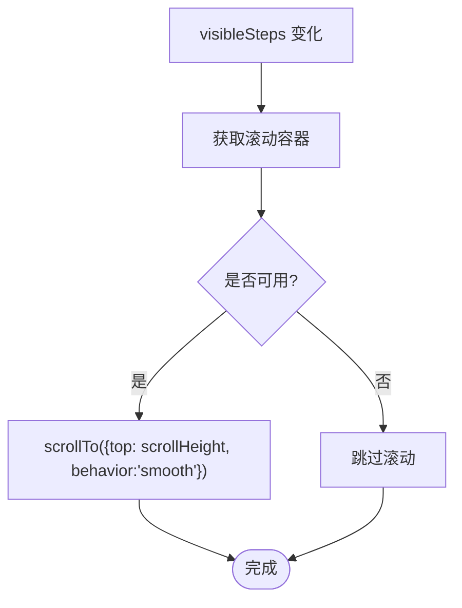
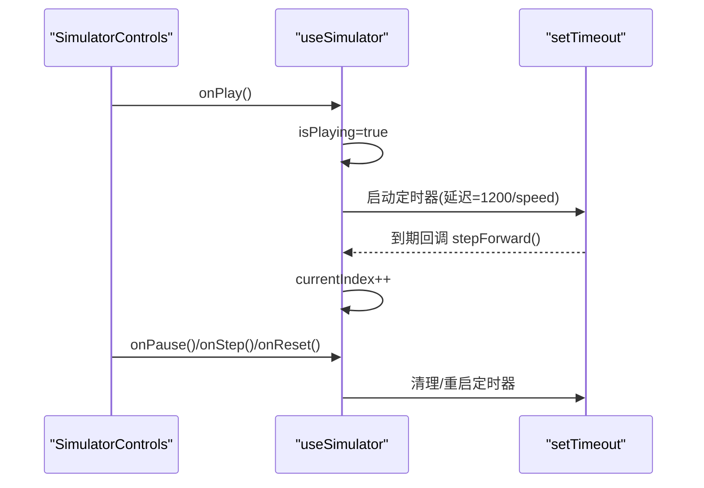
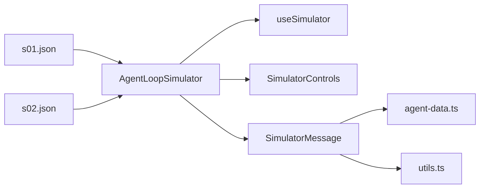

# 模拟器消息显示

<cite>
**本文引用的文件**
- [simulator-message.tsx](file://web/src/components/simulator/simulator-message.tsx)
- [agent-loop-simulator.tsx](file://web/src/components/simulator/agent-loop-simulator.tsx)
- [simulator-controls.tsx](file://web/src/components/simulator/simulator-controls.tsx)
- [useSimulator.ts](file://web/src/hooks/useSimulator.ts)
- [agent-data.ts](file://web/src/types/agent-data.ts)
- [utils.ts](file://web/src/lib/utils.ts)
- [s01.json](file://web/src/data/scenarios/s01.json)
- [s02.json](file://web/src/data/scenarios/s02.json)
</cite>

## 目录
1. [简介](#简介)
2. [项目结构](#项目结构)
3. [核心组件](#核心组件)
4. [架构总览](#架构总览)
5. [详细组件分析](#详细组件分析)
6. [依赖关系分析](#依赖关系分析)
7. [性能考量](#性能考量)
8. [故障排查指南](#故障排查指南)
9. [结论](#结论)
10. [附录：扩展指南](#附录扩展指南)

## 简介
本文件面向“模拟器消息显示”功能，系统性说明消息展示界面的实现细节与交互流程。内容涵盖：
- 消息类型区分：用户输入、系统响应、工具调用、工具结果、系统事件的不同展示方式
- 消息格式化：代码块、JSON、表格、链接等富文本渲染策略与现状
- 动画效果：基于 Framer Motion 的消息出现与列表过渡
- 滚动管理：自动滚动、锚点跳转与历史消息定位
- 扩展指南：如何新增自定义消息类型、渲染器与交互能力

## 项目结构
模拟器消息显示由以下关键部分组成：
- 场景数据：以 JSON 描述步骤序列（包含消息类型、内容、标注与工具信息）
- 状态控制 Hook：驱动播放、暂停、步进、速度调节与可见步骤切片
- 控制面板：播放/暂停、步进、重置与速度选择
- 消息容器：负责滚动、列表渲染与动画
- 消息卡片：按类型渲染不同样式与内容区域

图表来源
- [agent-loop-simulator.tsx:30-96](file://web/src/components/simulator/agent-loop-simulator.tsx#L30-L96)
- [useSimulator.ts:12-84](file://web/src/hooks/useSimulator.ts#L12-L84)
- [simulator-controls.tsx:22-99](file://web/src/components/simulator/simulator-controls.tsx#L22-L99)
- [simulator-message.tsx:49-93](file://web/src/components/simulator/simulator-message.tsx#L49-L93)
- [s01.json:1-52](file://web/src/data/scenarios/s01.json#L1-L52)
- [s02.json:1-47](file://web/src/data/scenarios/s02.json#L1-L47)

章节来源
- [agent-loop-simulator.tsx:30-96](file://web/src/components/simulator/agent-loop-simulator.tsx#L30-L96)
- [useSimulator.ts:12-84](file://web/src/hooks/useSimulator.ts#L12-L84)
- [simulator-controls.tsx:22-99](file://web/src/components/simulator/simulator-controls.tsx#L22-L99)
- [simulator-message.tsx:49-93](file://web/src/components/simulator/simulator-message.tsx#L49-L93)
- [agent-data.ts:38-58](file://web/src/types/agent-data.ts#L38-L58)
- [s01.json:1-52](file://web/src/data/scenarios/s01.json#L1-L52)
- [s02.json:1-47](file://web/src/data/scenarios/s02.json#L1-L47)

## 核心组件
- AgentLoopSimulator：加载指定版本场景，提供播放面板与消息列表容器，监听可见步骤变化触发自动滚动
- useSimulator：维护 currentIndex、isPlaying、speed，计算 visibleSteps，提供 play/pause/stepForward/reset/setSpeed
- SimulatorControls：UI 控件，绑定播放控制与速度切换
- SimulatorMessage：根据消息类型渲染图标、标题、内容与标注，使用 Framer Motion 入场动画

章节来源
- [agent-loop-simulator.tsx:30-96](file://web/src/components/simulator/agent-loop-simulator.tsx#L30-L96)
- [useSimulator.ts:12-84](file://web/src/hooks/useSimulator.ts#L12-L84)
- [simulator-controls.tsx:22-99](file://web/src/components/simulator/simulator-controls.tsx#L22-L99)
- [simulator-message.tsx:49-93](file://web/src/components/simulator/simulator-message.tsx#L49-L93)

## 架构总览
从数据到渲染的完整链路如下：
- 场景数据通过动态 import 加载为 Scenario，包含 steps 数组
- useSimulator 将 steps 切片为 visibleSteps，随播放推进逐步增加
- AgentLoopSimulator 使用 AnimatePresence 包裹消息列表，配合 SimulatorMessage 渲染每条消息
- 每次 visibleSteps 变化时，容器自动平滑滚动到底部

图表来源
- [agent-loop-simulator.tsx:30-96](file://web/src/components/simulator/agent-loop-simulator.tsx#L30-L96)
- [useSimulator.ts:12-84](file://web/src/hooks/useSimulator.ts#L12-L84)

## 详细组件分析

### 消息类型与展示规则
- 类型定义：user_message、assistant_text、tool_call、tool_result、system_event
- 展示差异：
  - user_message：用户输入，带用户图标与蓝色系背景
  - assistant_text：助手文本，默认卡片样式
  - tool_call：工具调用，终端风格深色背景，显示命令或参数
  - tool_result：工具结果，绿色系背景，显示执行结果
  - system_event：系统事件，紫色系背景，显示系统日志或提示
- 工具名展示：当存在 toolName 时，在标题旁以等宽字体显示

图表来源
- [simulator-message.tsx:13-47](file://web/src/components/simulator/simulator-message.tsx#L13-L47)
- [simulator-message.tsx:76-86](file://web/src/components/simulator/simulator-message.tsx#L76-L86)
- [agent-data.ts:38-51](file://web/src/types/agent-data.ts#L38-L51)

章节来源
- [simulator-message.tsx:13-47](file://web/src/components/simulator/simulator-message.tsx#L13-L47)
- [simulator-message.tsx:76-86](file://web/src/components/simulator/simulator-message.tsx#L76-L86)
- [agent-data.ts:38-51](file://web/src/types/agent-data.ts#L38-L51)

### 消息格式化策略
- 当前实现：
  - 工具调用/结果：使用预格式化的等宽文本块，适合命令与结构化输出
  - 系统事件：使用等宽文本块，便于阅读日志
  - 其他类型：普通段落渲染
- 代码高亮：
  - 当前未对消息内容进行语法高亮；如需支持，可在消息卡片内引入代码高亮库或复用文档渲染管线
- JSON 美化：
  - 当前以纯文本展示；可结合 JSON.stringify(..., null, 2) 进行缩进美化后放入预格式化块
- 表格渲染：
  - 当前未内置表格解析；若需支持，可在消息中嵌入 Markdown 表格并通过统一渲染管线处理
- 链接处理：
  - 当前未解析链接；可在消息内容中识别 URL 并转换为可点击链接

章节来源
- [simulator-message.tsx:76-86](file://web/src/components/simulator/simulator-message.tsx#L76-L86)

### 动画效果（Framer Motion）
- 单条消息：使用 motion.div 实现淡入与上移的入场动画
- 列表过渡：使用 AnimatePresence 与 popLayout 模式，使新增消息弹出式出现，提升视觉连贯性
- 性能建议：避免过度复杂的动画；保持 transition.duration 较短，确保流畅体验

图表来源
- [simulator-message.tsx:54-57](file://web/src/components/simulator/simulator-message.tsx#L54-L57)
- [agent-loop-simulator.tsx:87-91](file://web/src/components/simulator/agent-loop-simulator.tsx#L87-L91)

章节来源
- [simulator-message.tsx:54-57](file://web/src/components/simulator/simulator-message.tsx#L54-L57)
- [agent-loop-simulator.tsx:87-91](file://web/src/components/simulator/agent-loop-simulator.tsx#L87-L91)

### 滚动管理
- 自动滚动：每当 visibleSteps 长度变化时，容器平滑滚动到底部，保证最新消息可见
- 锚点跳转：当前未实现锚点定位；可通过为每条消息添加唯一 id，并提供导航按钮实现跳转
- 历史消息定位：可结合索引或时间戳，在控制面板中添加“跳转到第 N 步”的能力

图表来源
- [agent-loop-simulator.tsx:44-51](file://web/src/components/simulator/agent-loop-simulator.tsx#L44-L51)

章节来源
- [agent-loop-simulator.tsx:44-51](file://web/src/components/simulator/agent-loop-simulator.tsx#L44-L51)

### 播放控制与步进逻辑
- 播放：设置 isPlaying=true，定时器按 speed 调整间隔推进 currentIndex
- 暂停：清除定时器，停止推进
- 步进：手动递增 currentIndex，到达末尾时自动停止播放
- 重置：清空定时器，回到初始状态，保留当前速度
- 速度：支持多档倍速，影响定时器延迟

图表来源
- [useSimulator.ts:27-69](file://web/src/hooks/useSimulator.ts#L27-L69)
- [simulator-controls.tsx:36-99](file://web/src/components/simulator/simulator-controls.tsx#L36-L99)

章节来源
- [useSimulator.ts:27-69](file://web/src/hooks/useSimulator.ts#L27-L69)
- [simulator-controls.tsx:36-99](file://web/src/components/simulator/simulator-controls.tsx#L36-L99)

## 依赖关系分析
- 组件依赖：
  - AgentLoopSimulator 依赖 useSimulator、SimulatorControls、SimulatorMessage
  - SimulatorMessage 依赖类型定义与工具函数（cn）
- 数据依赖：
  - 场景 JSON 提供步骤数据，决定渲染内容与样式
- 外部依赖：
  - Framer Motion：动画与列表过渡
  - Lucide React：图标资源

图表来源
- [agent-loop-simulator.tsx:30-96](file://web/src/components/simulator/agent-loop-simulator.tsx#L30-L96)
- [useSimulator.ts:12-84](file://web/src/hooks/useSimulator.ts#L12-L84)
- [simulator-message.tsx:49-93](file://web/src/components/simulator/simulator-message.tsx#L49-L93)
- [agent-data.ts:38-58](file://web/src/types/agent-data.ts#L38-L58)
- [utils.ts:1-4](file://web/src/lib/utils.ts#L1-L4)
- [s01.json:1-52](file://web/src/data/scenarios/s01.json#L1-L52)
- [s02.json:1-47](file://web/src/data/scenarios/s02.json#L1-L47)

章节来源
- [agent-loop-simulator.tsx:30-96](file://web/src/components/simulator/agent-loop-simulator.tsx#L30-L96)
- [useSimulator.ts:12-84](file://web/src/hooks/useSimulator.ts#L12-L84)
- [simulator-message.tsx:49-93](file://web/src/components/simulator/simulator-message.tsx#L49-L93)
- [agent-data.ts:38-58](file://web/src/types/agent-data.ts#L38-L58)
- [utils.ts:1-4](file://web/src/lib/utils.ts#L1-L4)
- [s01.json:1-52](file://web/src/data/scenarios/s01.json#L1-L52)
- [s02.json:1-47](file://web/src/data/scenarios/s02.json#L1-L47)

## 性能考量
- 列表渲染：使用 key 与 AnimatePresence 优化新增项动画，避免重排开销
- 动画时长：短促过渡（约 0.25s）减少卡顿
- 滚动性能：仅在可见步骤变化时滚动，避免频繁重绘
- 内存管理：定时器在暂停/重置时正确清理，防止泄漏
- 可扩展性：消息渲染按需分支，避免不必要的复杂处理

## 故障排查指南
- 无消息显示：检查场景数据是否正确加载，visibleSteps 是否为空
- 滚动异常：确认滚动容器 ref 已挂载且高度有效
- 动画不生效：确认 Framer Motion 已正确引入，且列表使用 AnimatePresence
- 播放不停止：检查边界条件（currentIndex >= steps.length - 1）是否生效
- 样式错乱：核对类型配置中的类名是否与主题变量一致

章节来源
- [agent-loop-simulator.tsx:44-51](file://web/src/components/simulator/agent-loop-simulator.tsx#L44-L51)
- [useSimulator.ts:27-69](file://web/src/hooks/useSimulator.ts#L27-L69)
- [simulator-message.tsx:54-93](file://web/src/components/simulator/simulator-message.tsx#L54-L93)

## 结论
该消息显示组件通过清晰的数据驱动与分层设计，实现了多类型消息的统一渲染与良好的交互体验。借助 Framer Motion 的轻量动画与可控的滚动策略，用户在观看模拟过程时能获得直观、流畅的反馈。未来可在消息格式化与交互增强方面进一步扩展，以满足更丰富的展示需求。

## 附录：扩展指南

### 新增自定义消息类型
- 在类型定义中扩展 SimStepType，并在 SimStep 中补充必要字段（如 toolName、toolInput）
- 在消息卡片中为该类型添加配置项（图标、标签、背景与边框样式）
- 在渲染分支中实现专属的内容展示逻辑

章节来源
- [agent-data.ts:38-51](file://web/src/types/agent-data.ts#L38-L51)
- [simulator-message.tsx:13-47](file://web/src/components/simulator/simulator-message.tsx#L13-L47)
- [simulator-message.tsx:76-86](file://web/src/components/simulator/simulator-message.tsx#L76-L86)

### 增强消息格式化
- 代码高亮：在消息卡片内集成代码高亮库，或复用文档渲染管线对代码块进行处理
- JSON 美化：对 JSON 字符串进行缩进格式化后再渲染
- 表格渲染：解析 Markdown 表格或 HTML 表格，统一样式
- 链接处理：识别 URL 并转换为可点击链接，支持新窗口打开

章节来源
- [simulator-message.tsx:76-86](file://web/src/components/simulator/simulator-message.tsx#L76-L86)

### 增强交互能力
- 锚点跳转：为每条消息生成唯一标识，提供导航按钮快速定位
- 复制与折叠：为代码块与长内容提供一键复制与折叠展开
- 错误提示：对无效或异常内容给出友好提示与降级展示

章节来源
- [agent-loop-simulator.tsx:44-51](file://web/src/components/simulator/agent-loop-simulator.tsx#L44-L51)
- [simulator-controls.tsx:36-99](file://web/src/components/simulator/simulator-controls.tsx#L36-L99)