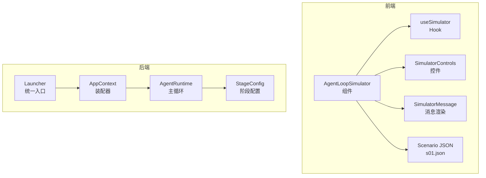
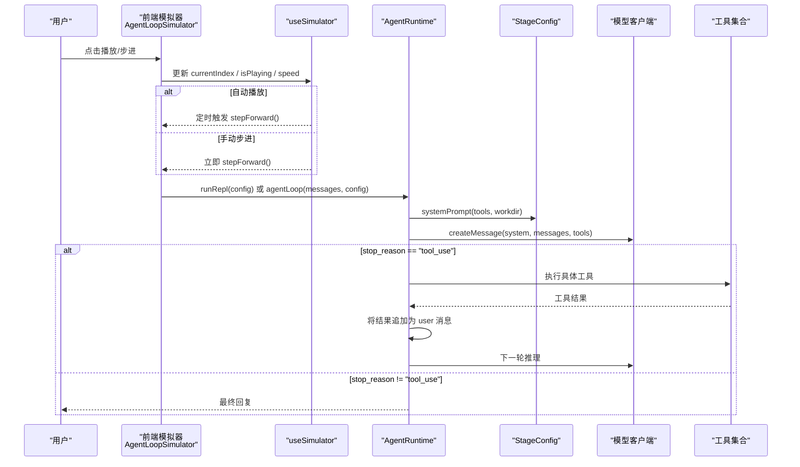
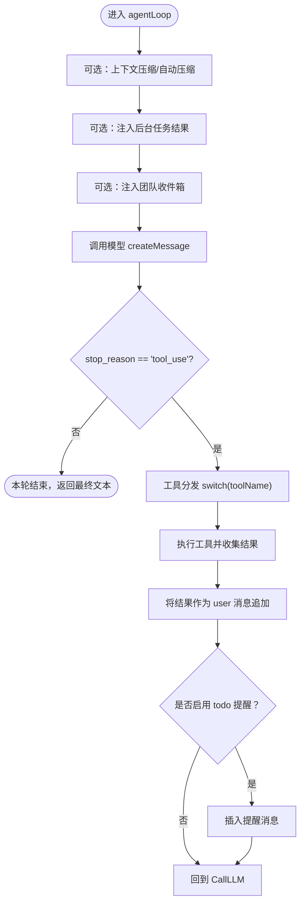
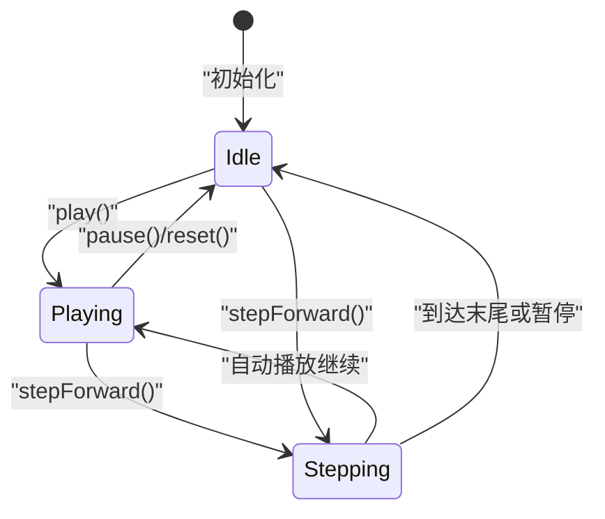
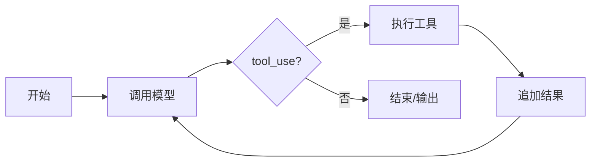
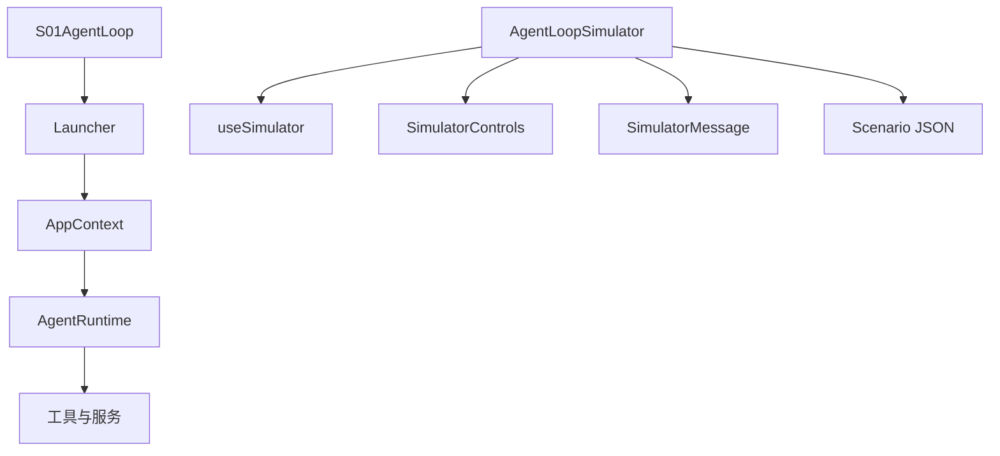

# 模拟器组件

<cite>
**本文引用的文件**
- [AgentRuntime.java](file://src/main/java/com/learnclaudecode/agents/AgentRuntime.java)
- [AppContext.java](file://src/main/java/com/learnclaudecode/agents/AppContext.java)
- [Launcher.java](file://src/main/java/com/learnclaudecode/agents/Launcher.java)
- [StageConfig.java](file://src/main/java/com/learnclaudecode/agents/StageConfig.java)
- [S01AgentLoop.java](file://src/main/java/com/learnclaudecode/agents/S01AgentLoop.java)
- [useSimulator.ts](file://web/src/hooks/useSimulator.ts)
- [agent-loop-simulator.tsx](file://web/src/components/simulator/agent-loop-simulator.tsx)
- [simulator-controls.tsx](file://web/src/components/simulator/simulator-controls.tsx)
- [simulator-message.tsx](file://web/src/components/simulator/simulator-message.tsx)
- [agent-data.ts](file://web/src/types/agent-data.ts)
- [s01.json](file://web/src/data/scenarios/s01.json)
- [execution-flows.ts](file://web/src/data/execution-flows.ts)
- [s01-agent-loop.tsx](file://web/src/components/visualizations/s01-agent-loop.tsx)
</cite>

## 目录
1. [简介](#简介)
2. [项目结构](#项目结构)
3. [核心组件](#核心组件)
4. [架构总览](#架构总览)
5. [详细组件分析](#详细组件分析)
6. [依赖关系分析](#依赖关系分析)
7. [性能考量](#性能考量)
8. [故障排查指南](#故障排查指南)
9. [结论](#结论)
10. [附录：扩展指南](#附录：扩展指南)

## 简介
本文件面向“Agent 循环模拟器”的完整实现，覆盖后端 Agent 运行时与前端可视化模拟器的协同工作。重点解释：
- 模拟引擎的核心逻辑：状态机管理、事件驱动架构、时间控制机制
- 用户交互控制：播放、暂停、步进、速度调节
- 消息模拟系统：输入输出格式化、错误处理、日志记录
- 扩展指南：自定义场景、插件开发、API 集成方法

## 项目结构
本项目由两部分组成：
- 后端 Java Agent 运行时：负责真实调用模型、执行工具、维护消息历史、上下文压缩、后台任务、团队协作等能力
- 前端 Next.js 模拟器：通过 JSON 场景数据驱动步骤化回放，提供播放/暂停/步进/变速等交互，并可视化 Agent 流程

图表来源
- [agent-loop-simulator.tsx:30-97](file://web/src/components/simulator/agent-loop-simulator.tsx#L30-L97)
- [useSimulator.ts:12-85](file://web/src/hooks/useSimulator.ts#L12-L85)
- [simulator-controls.tsx:22-99](file://web/src/components/simulator/simulator-controls.tsx#L22-L99)
- [simulator-message.tsx:49-93](file://web/src/components/simulator/simulator-message.tsx#L49-L93)
- [s01.json:1-52](file://web/src/data/scenarios/s01.json#L1-L52)
- [Launcher.java:23-26](file://src/main/java/com/learnclaudecode/agents/Launcher.java#L23-L26)
- [AppContext.java:35-68](file://src/main/java/com/learnclaudecode/agents/AppContext.java#L35-L68)
- [AgentRuntime.java:97-123](file://src/main/java/com/learnclaudecode/agents/AgentRuntime.java#L97-L123)
- [StageConfig.java:77-82](file://src/main/java/com/learnclaudecode/agents/StageConfig.java#L77-L82)

章节来源
- [agent-loop-simulator.tsx:30-97](file://web/src/components/simulator/agent-loop-simulator.tsx#L30-L97)
- [useSimulator.ts:12-85](file://web/src/hooks/useSimulator.ts#L12-L85)
- [simulator-controls.tsx:22-99](file://web/src/components/simulator/simulator-controls.tsx#L22-L99)
- [simulator-message.tsx:49-93](file://web/src/components/simulator/simulator-message.tsx#L49-L93)
- [s01.json:1-52](file://web/src/data/scenarios/s01.json#L1-L52)
- [Launcher.java:23-26](file://src/main/java/com/learnclaudecode/agents/Launcher.java#L23-L26)
- [AppContext.java:35-68](file://src/main/java/com/learnclaudecode/agents/AppContext.java#L35-L68)
- [AgentRuntime.java:97-123](file://src/main/java/com/learnclaudecode/agents/AgentRuntime.java#L97-L123)
- [StageConfig.java:77-82](file://src/main/java/com/learnclaudecode/agents/StageConfig.java#L77-L82)

## 核心组件
- 后端运行时（AgentRuntime）：实现 Agent 主循环，接收用户输入，调用模型，解析 tool_use，执行本地工具，将结果写回消息历史，直到模型停止调用工具
- 阶段配置（StageConfig）：以“开关+工具集+system prompt”的方式定义不同教学阶段的可用能力
- 应用装配器（AppContext）：集中创建共享服务（命令、Todo、技能加载、压缩、任务、后台、消息总线、队友、worktree），并注入到运行时
- 启动器（Launcher）：统一入口，选择阶段配置后交给运行时执行
- 前端模拟器（AgentLoopSimulator + useSimulator + SimulatorControls + SimulatorMessage）：基于 JSON 场景数据驱动步骤回放，提供播放/暂停/步进/变速等交互
- 流程图与可视化（execution-flows.ts, s01-agent-loop.tsx）：用节点和边描述各阶段执行流，配合动画展示当前活跃路径

章节来源
- [AgentRuntime.java:23-39](file://src/main/java/com/learnclaudecode/agents/AgentRuntime.java#L23-L39)
- [StageConfig.java:11-25](file://src/main/java/com/learnclaudecode/agents/StageConfig.java#L11-L25)
- [AppContext.java:16-28](file://src/main/java/com/learnclaudecode/agents/AppContext.java#L16-L28)
- [Launcher.java:3-10](file://src/main/java/com/learnclaudecode/agents/Launcher.java#L3-L10)
- [agent-loop-simulator.tsx:30-97](file://web/src/components/simulator/agent-loop-simulator.tsx#L30-L97)
- [useSimulator.ts:12-85](file://web/src/hooks/useSimulator.ts#L12-L85)
- [execution-flows.ts:13-316](file://web/src/data/execution-flows.ts#L13-L316)
- [s01-agent-loop.tsx:138-417](file://web/src/components/visualizations/s01-agent-loop.tsx#L138-L417)

## 架构总览
下图展示了从用户输入到模型决策、工具执行、结果反馈的完整闭环，以及前端模拟器如何驱动步骤回放。

图表来源
- [AgentRuntime.java:97-123](file://src/main/java/com/learnclaudecode/agents/AgentRuntime.java#L97-L123)
- [AgentRuntime.java:131-261](file://src/main/java/com/learnclaudecode/agents/AgentRuntime.java#L131-L261)
- [StageConfig.java:44-49](file://src/main/java/com/learnclaudecode/agents/StageConfig.java#L44-L49)
- [useSimulator.ts:59-69](file://web/src/hooks/useSimulator.ts#L59-L69)
- [agent-loop-simulator.tsx:42-75](file://web/src/components/simulator/agent-loop-simulator.tsx#L42-L75)

## 详细组件分析

### 后端：Agent 主循环与状态机
- 主循环（agentLoop）：while(true) 持续调用模型，根据 stop_reason 决定继续还是结束；若需要，先做上下文微压缩/自动压缩，再注入后台任务结果与团队收件箱消息
- 工具分发：switch(toolName) 将模型声明的工具映射到本地实现（bash、read/write/edit、todo、subagent、skill、task、background、team、worktree 等）
- 子代理（runSubagent）：独立消息上下文，限制可写能力，用于隔离探索性任务
- 容错与默认值：numberOrNull/numberOrDefault/stringOrNull 保证模型返回字段类型不一致时的健壮性

图表来源
- [AgentRuntime.java:131-261](file://src/main/java/com/learnclaudecode/agents/AgentRuntime.java#L131-L261)
- [AgentRuntime.java:270-310](file://src/main/java/com/learnclaudecode/agents/AgentRuntime.java#L270-L310)
- [AgentRuntime.java:318-349](file://src/main/java/com/learnclaudecode/agents/AgentRuntime.java#L318-L349)

章节来源
- [AgentRuntime.java:97-123](file://src/main/java/com/learnclaudecode/agents/AgentRuntime.java#L97-L123)
- [AgentRuntime.java:131-261](file://src/main/java/com/learnclaudecode/agents/AgentRuntime.java#L131-L261)
- [AgentRuntime.java:270-310](file://src/main/java/com/learnclaudecode/agents/AgentRuntime.java#L270-L310)
- [AgentRuntime.java:318-349](file://src/main/java/com/learnclaudecode/agents/AgentRuntime.java#L318-L349)

### 前端：模拟器状态机与时间控制
- 状态：currentIndex、isPlaying、speed
- 动作：play、pause、stepForward、reset、setSpeed
- 定时器：当 isPlaying 且未结束时，按 speed 计算 delay=1200/speed 毫秒推进一步
- 可见步骤：visibleSteps = steps.slice(0, currentIndex+1)，用于渲染当前已到达的步骤

图表来源
- [useSimulator.ts:12-85](file://web/src/hooks/useSimulator.ts#L12-L85)

章节来源
- [useSimulator.ts:12-85](file://web/src/hooks/useSimulator.ts#L12-L85)
- [agent-loop-simulator.tsx:42-75](file://web/src/components/simulator/agent-loop-simulator.tsx#L42-L75)

### 用户交互控制：播放、暂停、步进、速度
- 播放/暂停：切换 isPlaying，控制定时器启停
- 步进：每次前进一步，到达末尾时自动停止
- 速度：支持 0.5x、1x、2x、4x，影响定时器延迟
- 进度显示：currentIndex/totalSteps，便于定位当前步骤

章节来源
- [simulator-controls.tsx:22-99](file://web/src/components/simulator/simulator-controls.tsx#L22-L99)
- [useSimulator.ts:59-69](file://web/src/hooks/useSimulator.ts#L59-L69)

### 消息模拟系统：输入输出格式化、错误处理、日志
- 场景数据：每个版本对应一个 JSON 场景，包含 steps 数组，每步有 type、content、annotation、可选 toolName/toolInput
- 消息类型：user_message、assistant_text、tool_call、tool_result、system_event
- 渲染：根据类型使用不同图标、背景色、边框样式；工具相关消息以代码块形式展示
- 日志：后端在工具执行前后打印简要日志，便于调试

章节来源
- [agent-data.ts:38-58](file://web/src/types/agent-data.ts#L38-L58)
- [simulator-message.tsx:13-47](file://web/src/components/simulator/simulator-message.tsx#L13-L47)
- [simulator-message.tsx:49-93](file://web/src/components/simulator/simulator-message.tsx#L49-L93)
- [s01.json:1-52](file://web/src/data/scenarios/s01.json#L1-L52)
- [AgentRuntime.java:235-235](file://src/main/java/com/learnclaudecode/agents/AgentRuntime.java#L235-L235)

### 流程图与可视化：执行流与高亮
- execution-flows.ts 定义了各版本的节点与边，描述从用户输入到工具执行、结果追加、结束的完整流程
- s01-agent-loop.tsx 使用 SVG + Framer Motion 动态高亮当前活跃节点与边，并展示累积的消息数组

图表来源
- [execution-flows.ts:13-316](file://web/src/data/execution-flows.ts#L13-L316)
- [s01-agent-loop.tsx:20-65](file://web/src/components/visualizations/s01-agent-loop.tsx#L20-L65)

章节来源
- [execution-flows.ts:13-316](file://web/src/data/execution-flows.ts#L13-L316)
- [s01-agent-loop.tsx:138-417](file://web/src/components/visualizations/s01-agent-loop.tsx#L138-L417)

## 依赖关系分析
- 启动链路：S01AgentLoop -> Launcher -> AppContext -> AgentRuntime
- 运行时依赖：AnthropicClient、CommandTools、TodoManager、SkillLoader、CompressionService、TaskManager、BackgroundManager、MessageBus、TeammateManager、WorktreeManager
- 前端依赖：useSimulator 管理状态；AgentLoopSimulator 组合控件与消息渲染；Scenario JSON 提供步骤数据

图表来源
- [S01AgentLoop.java:9-11](file://src/main/java/com/learnclaudecode/agents/S01AgentLoop.java#L9-L11)
- [Launcher.java:23-26](file://src/main/java/com/learnclaudecode/agents/Launcher.java#L23-L26)
- [AppContext.java:35-68](file://src/main/java/com/learnclaudecode/agents/AppContext.java#L35-L68)
- [agent-loop-simulator.tsx:30-97](file://web/src/components/simulator/agent-loop-simulator.tsx#L30-L97)

章节来源
- [S01AgentLoop.java:9-11](file://src/main/java/com/learnclaudecode/agents/S01AgentLoop.java#L9-L11)
- [Launcher.java:23-26](file://src/main/java/com/learnclaudecode/agents/Launcher.java#L23-L26)
- [AppContext.java:35-68](file://src/main/java/com/learnclaudecode/agents/AppContext.java#L35-L68)
- [agent-loop-simulator.tsx:30-97](file://web/src/components/simulator/agent-loop-simulator.tsx#L30-L97)

## 性能考量
- 上下文压缩：在长对话中按需进行微压缩与自动压缩，避免消息历史无限增长导致性能下降
- 后台任务：长时间任务放入后台线程，主循环不被阻塞，结果异步注入
- 前端定时器：使用 setTimeout 控制播放节奏，速度可调，避免频繁重渲染
- 工具执行：尽量最小化 I/O 操作，必要时批量处理

[本节为通用指导，不直接分析具体文件]

## 故障排查指南
- 工具未知：当模型返回未知 toolName 时，会返回 “Unknown tool: ...”，检查 StageConfig.tools 与实际实现是否一致
- 参数解析失败：numberOrNull/numberOrDefault 对数字字段做了容错，若仍失败请检查模型输出格式
- 前端无响应：确认 scenario 已正确加载，useSimulator 的 steps 非空；检查浏览器控制台是否有脚本错误
- 步骤卡住：检查 isComplete 条件，确保 stepForward 能推进到下一步；确认定时器未被提前清除

章节来源
- [AgentRuntime.java:233-233](file://src/main/java/com/learnclaudecode/agents/AgentRuntime.java#L233-L233)
- [AgentRuntime.java:318-349](file://src/main/java/com/learnclaudecode/agents/AgentRuntime.java#L318-L349)
- [useSimulator.ts:27-34](file://web/src/hooks/useSimulator.ts#L27-L34)
- [useSimulator.ts:59-69](file://web/src/hooks/useSimulator.ts#L59-L69)

## 结论
该模拟器组件系统通过“后端 Agent 运行时 + 前端步骤化回放”的组合，实现了完整的 Agent 循环可视化与交互控制。后端以状态机驱动主循环，前端以 Hook 管理播放状态与时间控制，两者通过 JSON 场景数据解耦，便于扩展新场景与新能力。

[本节为总结，不直接分析具体文件]

## 附录：扩展指南

### 自定义模拟场景
- 新增场景：在 web/src/data/scenarios 下添加新的 JSON 文件，定义 version/title/description/steps
- 注册场景：在 agent-loop-simulator.tsx 的 scenarioModules 中添加动态导入映射
- 验证：通过 AgentLoopSimulator 传入 version，确认步骤渲染与控制正常

章节来源
- [agent-loop-simulator.tsx:11-24](file://web/src/components/simulator/agent-loop-simulator.tsx#L11-L24)
- [agent-data.ts:53-58](file://web/src/types/agent-data.ts#L53-L58)

### 插件开发（后端工具扩展）
- 新增工具定义：在 StageConfig 中通过 tool(name, description, schema) 添加工具 schema
- 实现工具逻辑：在 AgentRuntime.agentLoop 的 switch(toolName) 分支中增加新工具的执行逻辑
- 安全与权限：可通过 subagentWritable、工具白名单等方式限制能力范围

章节来源
- [StageConfig.java:270-284](file://src/main/java/com/learnclaudecode/agents/StageConfig.java#L270-L284)
- [AgentRuntime.java:189-234](file://src/main/java/com/learnclaudecode/agents/AgentRuntime.java#L189-L234)

### API 集成方法
- 模型调用：统一通过 AnthropicClient.createMessage，传入 system prompt、messages、tools、max_tokens
- 消息历史：始终维护 ChatMessage 列表，工具结果以 user 消息追加，保持上下文一致性
- 多阶段能力：通过 StageConfig 切换不同能力组合，无需修改运行时主体逻辑

章节来源
- [AgentRuntime.java:168-176](file://src/main/java/com/learnclaudecode/agents/AgentRuntime.java#L168-L176)
- [StageConfig.java:77-267](file://src/main/java/com/learnclaudecode/agents/StageConfig.java#L77-L267)