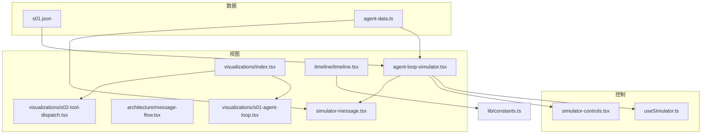
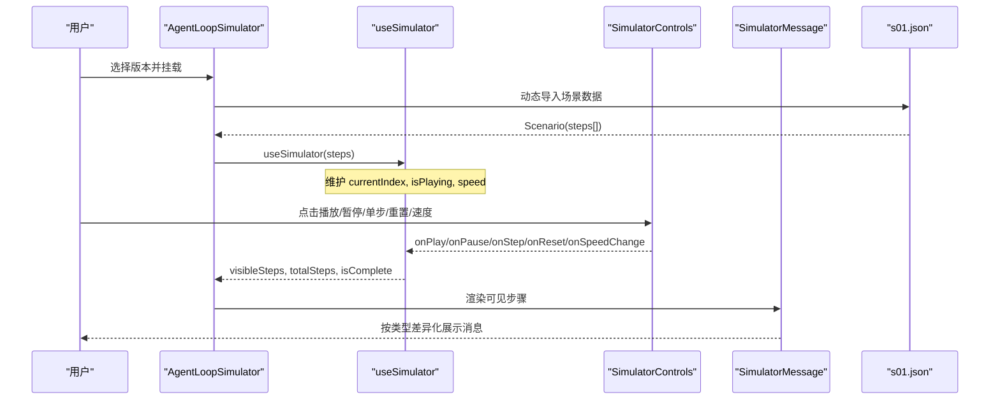
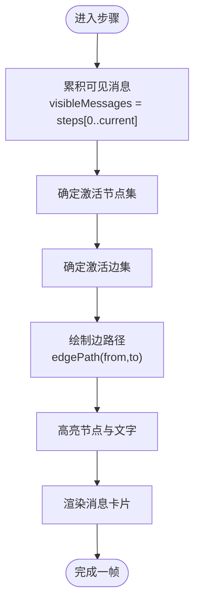
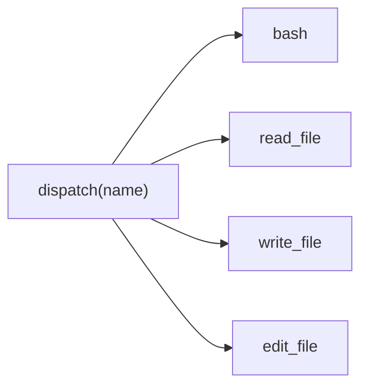
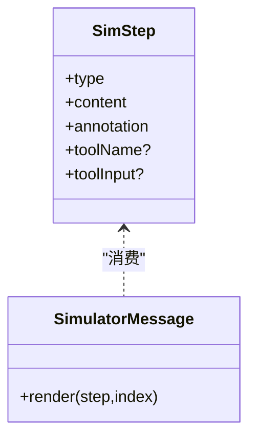
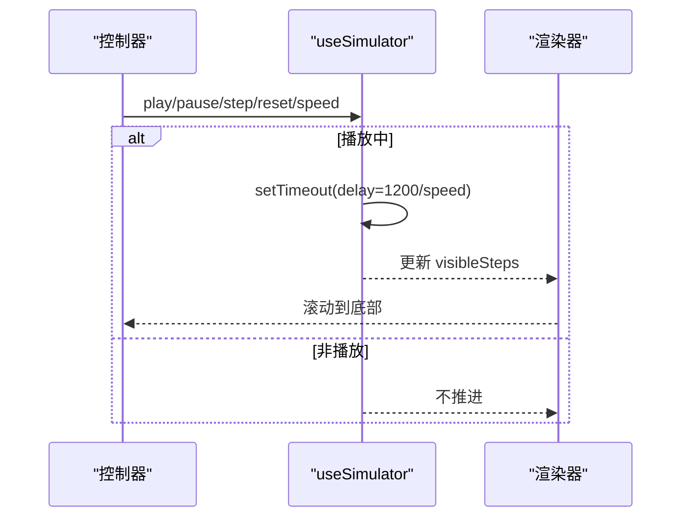
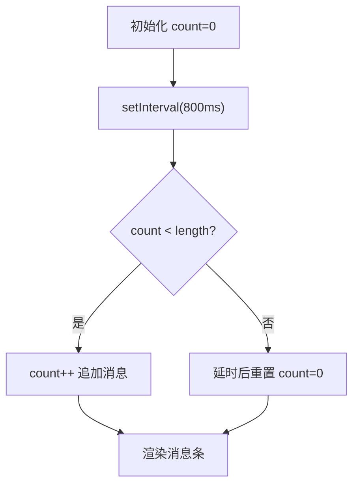
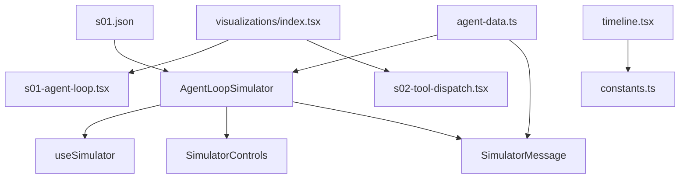

# 消息流可视化

<cite>
**本文引用的文件**
- [message-flow.tsx](file://web/src/components/architecture/message-flow.tsx)
- [agent-loop-simulator.tsx](file://web/src/components/simulator/agent-loop-simulator.tsx)
- [simulator-controls.tsx](file://web/src/components/simulator/simulator-controls.tsx)
- [simulator-message.tsx](file://web/src/components/simulator/simulator-message.tsx)
- [useSimulator.ts](file://web/src/hooks/useSimulator.ts)
- [s01-agent-loop.tsx](file://web/src/components/visualizations/s01-agent-loop.tsx)
- [s02-tool-dispatch.tsx](file://web/src/components/visualizations/s02-tool-dispatch.tsx)
- [timeline.tsx](file://web/src/components/timeline/timeline.tsx)
- [index.tsx](file://web/src/components/visualizations/index.tsx)
- [constants.ts](file://web/src/lib/constants.ts)
- [agent-data.ts](file://web/src/types/agent-data.ts)
- [s01.json](file://web/src/data/scenarios/s01.json)
</cite>

## 目录
1. [简介](#简介)
2. [项目结构](#项目结构)
3. [核心组件](#核心组件)
4. [架构总览](#架构总览)
5. [详细组件分析](#详细组件分析)
6. [依赖关系分析](#依赖关系分析)
7. [性能考量](#性能考量)
8. [故障排查指南](#故障排查指南)
9. [结论](#结论)
10. [附录](#附录)

## 简介
本文件围绕“消息流可视化”主题，系统性说明 MessageFlow 及相关模拟器、时序图与流程图组件如何协作，实现消息传递的可视化。重点包括：
- 消息时序图的生成算法：消息排序、时间轴计算、流向绘制
- 不同消息类型的视觉表示：请求、响应、错误、系统消息的差异展示
- 实时消息流的模拟与播放控制：速度调节、暂停、重播
- 消息流分析工具：性能指标、瓶颈识别、优化建议

## 项目结构
前端采用 Next.js + React + Framer Motion 构建，消息流可视化由多个层次组成：
- 场景数据层：JSON 描述步骤（类型、内容、标注）
- 状态与播放控制 Hook：管理播放进度、速度、可见步骤
- UI 组件层：控制器、消息卡片、流程/时序图
- 可视化编排：按版本动态加载具体可视化组件

图表来源
- [agent-loop-simulator.tsx:30-96](file://web/src/components/simulator/agent-loop-simulator.tsx#L30-L96)
- [useSimulator.ts:12-84](file://web/src/hooks/useSimulator.ts#L12-L84)
- [simulator-controls.tsx:22-99](file://web/src/components/simulator/simulator-controls.tsx#L22-L99)
- [simulator-message.tsx:49-93](file://web/src/components/simulator/simulator-message.tsx#L49-L93)
- [message-flow.tsx:17-70](file://web/src/components/architecture/message-flow.tsx#L17-L70)
- [index.tsx:24-39](file://web/src/components/visualizations/index.tsx#L24-L39)
- [s01-agent-loop.tsx:138-161](file://web/src/components/visualizations/s01-agent-loop.tsx#L138-L161)
- [s02-tool-dispatch.tsx:95-109](file://web/src/components/visualizations/s02-tool-dispatch.tsx#L95-L109)
- [timeline.tsx:45-168](file://web/src/components/timeline/timeline.tsx#L45-L168)
- [constants.ts:9-37](file://web/src/lib/constants.ts#L9-L37)

章节来源
- [agent-loop-simulator.tsx:30-96](file://web/src/components/simulator/agent-loop-simulator.tsx#L30-L96)
- [useSimulator.ts:12-84](file://web/src/hooks/useSimulator.ts#L12-L84)
- [simulator-controls.tsx:22-99](file://web/src/components/simulator/simulator-controls.tsx#L22-L99)
- [simulator-message.tsx:49-93](file://web/src/components/simulator/simulator-message.tsx#L49-L93)
- [message-flow.tsx:17-70](file://web/src/components/architecture/message-flow.tsx#L17-L70)
- [index.tsx:24-39](file://web/src/components/visualizations/index.tsx#L24-L39)
- [s01-agent-loop.tsx:138-161](file://web/src/components/visualizations/s01-agent-loop.tsx#L138-L161)
- [s02-tool-dispatch.tsx:95-109](file://web/src/components/visualizations/s02-tool-dispatch.tsx#L95-L109)
- [timeline.tsx:45-168](file://web/src/components/timeline/timeline.tsx#L45-L168)
- [constants.ts:9-37](file://web/src/lib/constants.ts#L9-L37)

## 核心组件
- 场景数据模型：定义 SimStep、Scenario 等类型，统一消息步骤的结构与语义
- 模拟器 Hook：维护 currentIndex、isPlaying、speed，驱动自动播放与步进
- 控制器 UI：提供播放/暂停/单步/重置/速度切换
- 消息渲染：根据类型差异化显示图标、背景、边框、代码块或文本
- 基础消息流条：以水平滚动条形式展示 messages[] 的累积长度变化
- 可视化编排：按版本懒加载具体可视化组件（流程图、时序图等）

章节来源
- [agent-data.ts:38-58](file://web/src/types/agent-data.ts#L38-L58)
- [useSimulator.ts:12-84](file://web/src/hooks/useSimulator.ts#L12-L84)
- [simulator-controls.tsx:22-99](file://web/src/components/simulator/simulator-controls.tsx#L22-L99)
- [simulator-message.tsx:49-93](file://web/src/components/simulator/simulator-message.tsx#L49-L93)
- [message-flow.tsx:17-70](file://web/src/components/architecture/message-flow.tsx#L17-L70)
- [index.tsx:24-39](file://web/src/components/visualizations/index.tsx#L24-L39)

## 架构总览
下图展示了从场景数据到可视化的完整调用链，以及播放控制的时序。

图表来源
- [agent-loop-simulator.tsx:30-96](file://web/src/components/simulator/agent-loop-simulator.tsx#L30-L96)
- [useSimulator.ts:12-84](file://web/src/hooks/useSimulator.ts#L12-L84)
- [simulator-controls.tsx:22-99](file://web/src/components/simulator/simulator-controls.tsx#L22-L99)
- [simulator-message.tsx:49-93](file://web/src/components/simulator/simulator-message.tsx#L49-L93)
- [s01.json:1-52](file://web/src/data/scenarios/s01.json#L1-L52)

## 详细组件分析

### 消息时序图生成算法（基于 s01 流程图）
该组件通过“步骤索引 -> 激活节点/边 -> 累积消息”的方式，将 while 循环的执行过程可视化。

- 消息排序
  - 使用 MESSAGES_PER_STEP 数组，每个步骤对应若干消息块；渲染时按步骤顺序累积为 visibleMessages
  - 依据 currentStep 决定当前可见的消息集合，保证时序正确
- 时间轴计算
  - 使用 useSteppedVisualization 提供的 autoPlayInterval 控制每步间隔
  - 在 SVG 中通过固定坐标布局节点，边路径根据节点位置计算（垂直默认、特殊分支处理）
- 流向绘制
  - EDGES 定义有向边，ACTIVE_EDGES_PER_STEP 指定每步高亮的边
  - edgePath 函数根据 from/to 节点坐标生成 SVG path，支持回环与横向分支
  - 节点高亮通过 ACTIVE_NODES_PER_STEP 控制，结合滤镜与颜色动画增强可读性

图表来源
- [s01-agent-loop.tsx:46-65](file://web/src/components/visualizations/s01-agent-loop.tsx#L46-L65)
- [s01-agent-loop.tsx:102-134](file://web/src/components/visualizations/s01-agent-loop.tsx#L102-L134)
- [s01-agent-loop.tsx:153-161](file://web/src/components/visualizations/s01-agent-loop.tsx#L153-L161)

章节来源
- [s01-agent-loop.tsx:46-65](file://web/src/components/visualizations/s01-agent-loop.tsx#L46-L65)
- [s01-agent-loop.tsx:102-134](file://web/src/components/visualizations/s01-agent-loop.tsx#L102-L134)
- [s01-agent-loop.tsx:153-161](file://web/src/components/visualizations/s01-agent-loop.tsx#L153-L161)

### 工具分发可视化（s02）
- 调度器居中，工具卡片均匀分布，连线根据是否激活改变粗细与颜色
- 每步高亮一个工具或全部工具，体现“新增工具即扩展映射表”的设计思想
- 顶部展示 incoming 请求 JSON，底部展示 handlers 映射片段

图表来源
- [s02-tool-dispatch.tsx:19-55](file://web/src/components/visualizations/s02-tool-dispatch.tsx#L19-L55)
- [s02-tool-dispatch.tsx:95-109](file://web/src/components/visualizations/s02-tool-dispatch.tsx#L95-L109)
- [s02-tool-dispatch.tsx:234-310](file://web/src/components/visualizations/s02-tool-dispatch.tsx#L234-L310)

章节来源
- [s02-tool-dispatch.tsx:19-55](file://web/src/components/visualizations/s02-tool-dispatch.tsx#L19-L55)
- [s02-tool-dispatch.tsx:95-109](file://web/src/components/visualizations/s02-tool-dispatch.tsx#L95-L109)
- [s02-tool-dispatch.tsx:234-310](file://web/src/components/visualizations/s02-tool-dispatch.tsx#L234-L310)

### 消息类型与视觉表示
- 用户消息：蓝色背景/边框，用户图标
- 助手文本：中性背景/边框，机器人图标
- 工具调用：橙色系背景/边框，终端图标，内容以代码块呈现
- 工具结果：绿色系背景/边框，箭头图标，内容以代码块呈现
- 系统事件：紫色系背景/边框，警告图标，内容以代码块呈现

图表来源
- [agent-data.ts:38-58](file://web/src/types/agent-data.ts#L38-L58)
- [simulator-message.tsx:13-47](file://web/src/components/simulator/simulator-message.tsx#L13-L47)
- [simulator-message.tsx:49-93](file://web/src/components/simulator/simulator-message.tsx#L49-L93)

章节来源
- [agent-data.ts:38-58](file://web/src/types/agent-data.ts#L38-L58)
- [simulator-message.tsx:13-47](file://web/src/components/simulator/simulator-message.tsx#L13-L47)
- [simulator-message.tsx:49-93](file://web/src/components/simulator/simulator-message.tsx#L49-L93)

### 实时消息流模拟与播放控制
- 播放控制
  - 播放：设置 isPlaying=true，定时器按 speed 推进 currentIndex
  - 暂停：清除定时器，停止推进
  - 单步：手动递增 currentIndex
  - 重置：回到初始状态，保留当前 speed
  - 速度：可选 0.5x/1x/2x/4x，影响定时器延迟
- 可见步骤
  - visibleSteps = steps.slice(0, currentIndex+1)，用于渲染已发生的消息
- 自动滚动
  - 每次可见步骤变化后，容器平滑滚动到底部

图表来源
- [useSimulator.ts:27-69](file://web/src/hooks/useSimulator.ts#L27-L69)
- [agent-loop-simulator.tsx:44-51](file://web/src/components/simulator/agent-loop-simulator.tsx#L44-L51)
- [simulator-controls.tsx:22-99](file://web/src/components/simulator/simulator-controls.tsx#L22-L99)

章节来源
- [useSimulator.ts:27-69](file://web/src/hooks/useSimulator.ts#L27-L69)
- [agent-loop-simulator.tsx:44-51](file://web/src/components/simulator/agent-loop-simulator.tsx#L44-L51)
- [simulator-controls.tsx:22-99](file://web/src/components/simulator/simulator-controls.tsx#L22-L99)

### 基础消息流条（MessageFlow）
- 以固定序列模拟 messages[] 的增长，每隔固定间隔增加一个元素
- 使用 AnimatePresence 与 motion 实现入场动画
- 显示当前长度，便于理解消息队列的演进

图表来源
- [message-flow.tsx:6-15](file://web/src/components/architecture/message-flow.tsx#L6-L15)
- [message-flow.tsx:21-34](file://web/src/components/architecture/message-flow.tsx#L21-L34)
- [message-flow.tsx:36-70](file://web/src/components/architecture/message-flow.tsx#L36-L70)

章节来源
- [message-flow.tsx:6-15](file://web/src/components/architecture/message-flow.tsx#L6-L15)
- [message-flow.tsx:21-34](file://web/src/components/architecture/message-flow.tsx#L21-L34)
- [message-flow.tsx:36-70](file://web/src/components/architecture/message-flow.tsx#L36-L70)

### 版本化可视化编排
- 通过 index.tsx 的 visualizations 映射，按 version 懒加载对应可视化组件
- 配合 Suspense 提供加载占位，提升首屏体验
- timeline.tsx 提供学习路径概览与 LOC 增长图，辅助理解各版本演进

章节来源
- [index.tsx:6-39](file://web/src/components/visualizations/index.tsx#L6-L39)
- [timeline.tsx:45-168](file://web/src/components/timeline/timeline.tsx#L45-L168)
- [constants.ts:9-37](file://web/src/lib/constants.ts#L9-L37)

## 依赖关系分析
- 数据依赖
  - 场景数据 s01.json 提供步骤序列，被 AgentLoopSimulator 动态导入
  - agent-data.ts 定义通用类型，约束步骤结构与场景结构
- 状态依赖
  - useSimulator 管理播放状态，暴露 visibleSteps、totalSteps、isComplete
- 组件耦合
  - AgentLoopSimulator 组合 SimulatorControls 与 SimulatorMessage
  - 可视化组件（s01/s02）独立于模拟器，但共享 useSteppedVisualization 与 StepControls
- 外部库
  - framer-motion 负责动画与过渡
  - lucide-react 提供图标
  - next/link 与 i18n 用于导航与国际化

图表来源
- [agent-loop-simulator.tsx:30-96](file://web/src/components/simulator/agent-loop-simulator.tsx#L30-L96)
- [useSimulator.ts:12-84](file://web/src/hooks/useSimulator.ts#L12-L84)
- [simulator-message.tsx:49-93](file://web/src/components/simulator/simulator-message.tsx#L49-L93)
- [index.tsx:24-39](file://web/src/components/visualizations/index.tsx#L24-L39)
- [timeline.tsx:45-168](file://web/src/components/timeline/timeline.tsx#L45-L168)
- [constants.ts:9-37](file://web/src/lib/constants.ts#L9-L37)

章节来源
- [agent-loop-simulator.tsx:30-96](file://web/src/components/simulator/agent-loop-simulator.tsx#L30-L96)
- [useSimulator.ts:12-84](file://web/src/hooks/useSimulator.ts#L12-L84)
- [simulator-message.tsx:49-93](file://web/src/components/simulator/simulator-message.tsx#L49-L93)
- [index.tsx:24-39](file://web/src/components/visualizations/index.tsx#L24-L39)
- [timeline.tsx:45-168](file://web/src/components/timeline/timeline.tsx#L45-L168)
- [constants.ts:9-37](file://web/src/lib/constants.ts#L9-L37)

## 性能考量
- 渲染优化
  - 使用 AnimatePresence 与 key 稳定标识，减少不必要的重绘
  - 仅渲染 visibleSteps，避免全量步骤导致的性能问题
- 动画性能
  - 合理设置 transition duration，避免过度动画导致卡顿
  - 对大量消息列表考虑虚拟滚动（当前未实现，可作为优化方向）
- 网络与加载
  - 场景数据按需动态导入，减少首包体积
  - 可视化组件懒加载，配合 Suspense 提升交互响应
- 内存管理
  - 定时器在组件卸载或状态变更时及时清理，防止泄漏

[本节为通用指导，无需特定文件引用]

## 故障排查指南
- 播放无响应
  - 检查 isPlaying 状态是否正确设置
  - 确认定时器未被意外清除（pause/reset 逻辑）
- 消息不更新
  - 验证 visibleSteps 切片是否正确（currentIndex+1）
  - 检查场景数据 steps 是否为空或格式不符
- 动画异常
  - 确保 framer-motion 的 key 唯一且稳定
  - 检查样式类名与主题变量是否生效
- 路由与懒加载
  - 确认 visualizations 映射中存在对应版本键
  - 检查 Suspense fallback 是否正常显示

章节来源
- [useSimulator.ts:27-69](file://web/src/hooks/useSimulator.ts#L27-L69)
- [agent-loop-simulator.tsx:44-51](file://web/src/components/simulator/agent-loop-simulator.tsx#L44-L51)
- [index.tsx:24-39](file://web/src/components/visualizations/index.tsx#L24-L39)

## 结论
该消息流可视化方案通过清晰的数据模型、可控的播放状态与差异化的视觉表达，实现了从简单消息条到复杂流程图的多层次可视化。借助分步动画与懒加载策略，既保证了交互流畅性，也提升了可维护性与可扩展性。未来可在虚拟滚动、更精细的时间轴与性能埋点方面进一步优化。

[本节为总结性内容，无需特定文件引用]

## 附录
- 关键数据结构
  - SimStep：type/content/annotation/toolName/toolInput
  - Scenario：version/title/description/steps
- 常用配置
  - SPEEDS：[0.5, 1, 2, 4]
  - 自动播放间隔：useSteppedVisualization 的 autoPlayInterval 与 useSimulator 的 delay=1200/speed

章节来源
- [agent-data.ts:38-58](file://web/src/types/agent-data.ts#L38-L58)
- [simulator-controls.tsx:20-21](file://web/src/components/simulator/simulator-controls.tsx#L20-L21)
- [useSimulator.ts:59-69](file://web/src/hooks/useSimulator.ts#L59-L69)