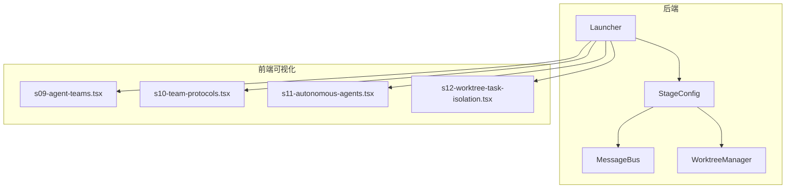
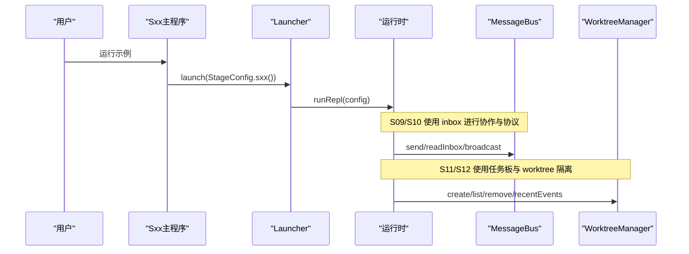
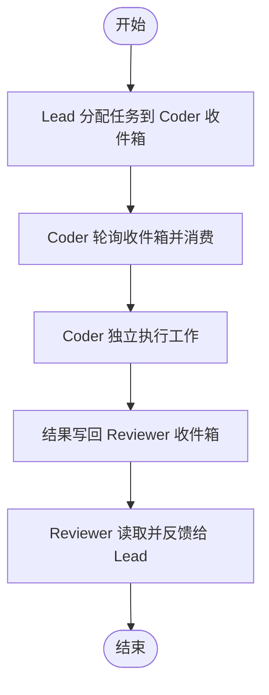
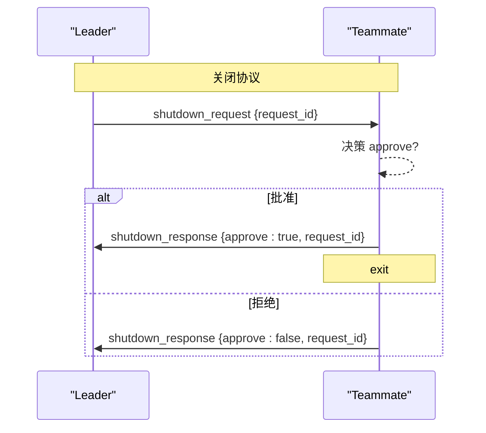
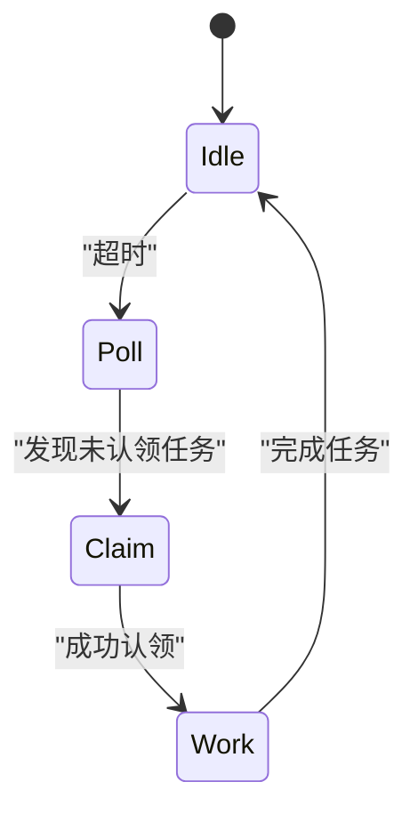
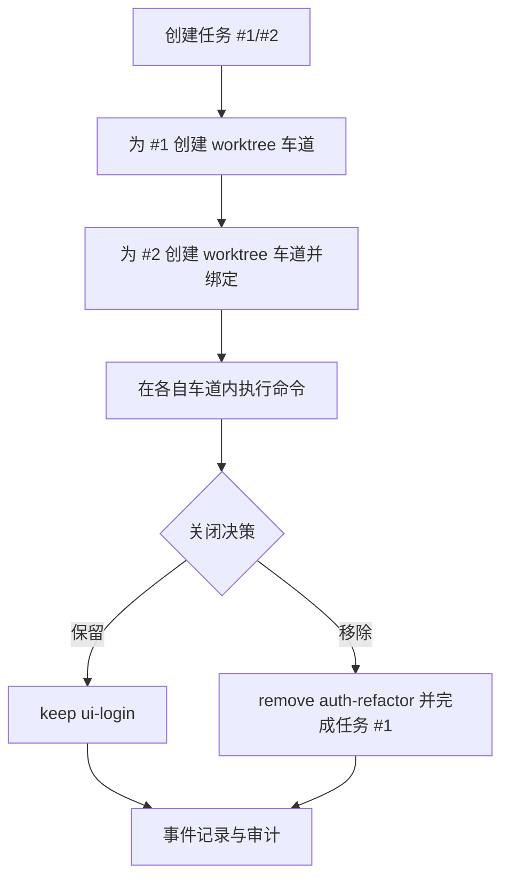
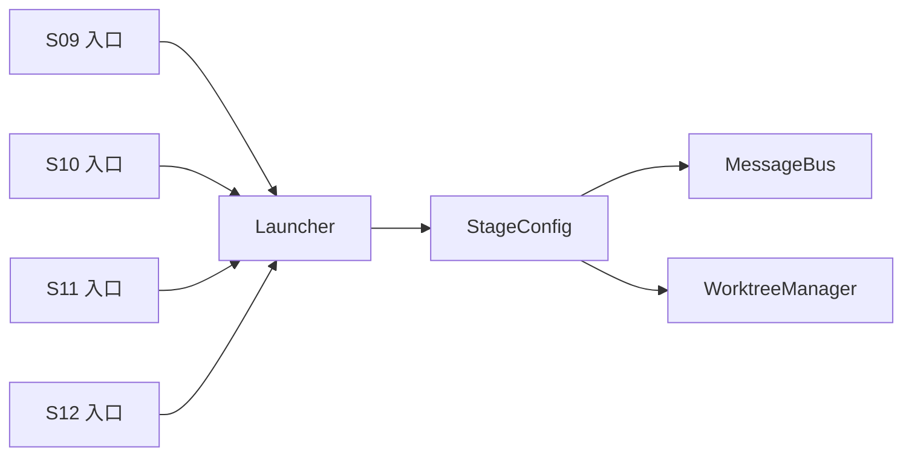

# 专家阶段可视化 (S09-S12)

<cite>
**本文引用的文件**
- [S09AgentTeams.java](file://src/main/java/com/learnclaudecode/agents/S09AgentTeams.java)
- [S10TeamProtocols.java](file://src/main/java/com/learnclaudecode/agents/S10TeamProtocols.java)
- [S11AutonomousAgents.java](file://src/main/java/com/learnclaudecode/agents/S11AutonomousAgents.java)
- [S12WorktreeTaskIsolation.java](file://src/main/java/com/learnclaudecode/agents/S12WorktreeTaskIsolation.java)
- [Launcher.java](file://src/main/java/com/learnclaudecode/agents/Launcher.java)
- [StageConfig.java](file://src/main/java/com/learnclaudecode/agents/StageConfig.java)
- [MessageBus.java](file://src/main/java/com/learnclaudecode/team/MessageBus.java)
- [WorktreeManager.java](file://src/main/java/com/learnclaudecode/tasks/WorktreeManager.java)
- [s09-agent-teams.tsx](file://web/src/components/visualizations/s09-agent-teams.tsx)
- [s10-team-protocols.tsx](file://web/src/components/visualizations/s10-team-protocols.tsx)
- [s11-autonomous-agents.tsx](file://web/src/components/visualizations/s11-autonomous-agents.tsx)
- [s12-worktree-task-isolation.tsx](file://web/src/components/visualizations/s12-worktree-task-isolation.tsx)
- [s09.json](file://web/src/data/scenarios/s09.json)
- [s10.json](file://web/src/data/scenarios/s10.json)
- [s11.json](file://web/src/data/scenarios/s11.json)
- [s12.json](file://web/src/data/scenarios/s12.json)
</cite>

## 目录
1. [简介](#简介)
2. [项目结构](#项目结构)
3. [核心组件](#核心组件)
4. [架构总览](#架构总览)
5. [详细组件分析](#详细组件分析)
6. [依赖关系分析](#依赖关系分析)
7. [性能考量](#性能考量)
8. [故障排查指南](#故障排查指南)
9. [结论](#结论)
10. [附录](#附录)

## 简介
本文件聚焦专家阶段的四个高级可视化与实现：S09-代理团队、S10-团队协议、S11-自主代理、S12-工作树隔离。目标包括：
- 多代理协作的可视化模型：通信拓扑、协议状态、隔离边界
- 复杂状态管理：分布式状态同步、冲突解决、一致性保证
- 企业级应用指导：大规模部署、监控集成、故障恢复策略

这些能力通过统一的启动器与阶段配置驱动，前端以分步可视化呈现关键流程，后端以文件系统为“最小依赖”的协调介质（消息总线、任务板、worktree 索引与事件）。

## 项目结构
- 后端入口与编排
  - 每个 Sxx 入口类仅负责选择 StageConfig 并调用统一 Launcher，避免重复初始化逻辑
  - StageConfig 集中定义各阶段暴露的工具集、系统提示词与能力开关
- 团队协作与协议
  - MessageBus 提供基于 .team/inbox/*.jsonl 的文件型消息总线，支持点对点、广播、以及带 request_id 的请求-响应协议
- 自治与隔离
  - WorktreeManager 维护 .worktrees/index.json 与 events.jsonl，提供创建、列出、移除、事件查询等能力，并与任务管理器联动绑定/解绑 worktree
- 前端可视化
  - s09-s12 四个可视化组件分别展示：团队邮箱、协议序列图、自治 FSM、工作树隔离三视图（任务板、worktree 索引、执行车道）

图表来源
- [Launcher.java:18-26](file://src/main/java/com/learnclaudecode/agents/Launcher.java#L18-L26)
- [StageConfig.java:181-244](file://src/main/java/com/learnclaudecode/agents/StageConfig.java#L181-L244)
- [MessageBus.java:16-123](file://src/main/java/com/learnclaudecode/team/MessageBus.java#L16-L123)
- [WorktreeManager.java:16-245](file://src/main/java/com/learnclaudecode/tasks/WorktreeManager.java#L16-L245)

章节来源
- [Launcher.java:1-28](file://src/main/java/com/learnclaudecode/agents/Launcher.java#L1-L28)
- [StageConfig.java:1-301](file://src/main/java/com/learnclaudecode/agents/StageConfig.java#L1-L301)

## 核心组件
- 统一启动器与阶段配置
  - Launcher 将 AppContext 运行时交给具体 StageConfig 执行，确保不同教学阶段复用同一运行环境
  - StageConfig 按阶段逐步打开工具与特性：s09 开启 inbox；s10 增加 shutdown_request/plan_approval；s11 引入 claim_task/idle 与任务工具；s12 引入 worktree_* 系列工具
- 文件型消息总线
  - MessageBus 使用 .team/inbox/*.jsonl 作为异步通道，支持 message/broadcast/shutdown_request/shutdown_response/plan_approval_response 类型
  - readInbox 采用“读后即清空”语义，避免重复消费
- Worktree 隔离
  - WorktreeManager 在 .worktrees 下维护 index.json 与 events.jsonl，提供 create/list/remove/recentEvents，并在创建/移除时触发事件记录
  - 与 TaskManager 联动，完成 worktree 与任务的绑定/解绑

章节来源
- [StageConfig.java:181-244](file://src/main/java/com/learnclaudecode/agents/StageConfig.java#L181-L244)
- [MessageBus.java:16-123](file://src/main/java/com/learnclaudecode/team/MessageBus.java#L16-L123)
- [WorktreeManager.java:16-245](file://src/main/java/com/learnclaudecode/tasks/WorktreeManager.java#L16-L245)

## 架构总览
下图展示了从启动到可视化的端到端路径，以及 S09-S12 的关键数据流：
- 启动：Sxx main -> Launcher.launch(StageConfig.sxx()) -> AppContext.runtime().runRepl(config)
- 协作：Lead/Teammate 通过 MessageBus 写入/读取 .team/inbox/*.jsonl
- 协议：shutdown_request/shutdown_response 与 plan_approval_response 通过 request_id 关联
- 自治：Teammate 空闲周期 poll 任务板，claim 任务后进入 work
- 隔离：WorktreeManager 创建/移除 lane，更新 index.json，追加 events.jsonl，并联动任务绑定

图表来源
- [Launcher.java:18-26](file://src/main/java/com/learnclaudecode/agents/Launcher.java#L18-L26)
- [MessageBus.java:44-123](file://src/main/java/com/learnclaudecode/team/MessageBus.java#L44-L123)
- [WorktreeManager.java:60-184](file://src/main/java/com/learnclaudecode/tasks/WorktreeManager.java#L60-L184)

## 详细组件分析

### S09-代理团队可视化与实现
- 可视化要点
  - 三角布局：Lead/Coder/Reviewer，每个节点下方有 inbox 托盘
  - 步骤化演示：分配任务、读取收件箱、独立工作、结果回传、反馈循环、文件系统坐标
- 后端支撑
  - StageConfig.s09() 启用 inbox 并暴露 spawn_teammate/send_message/read_inbox/broadcast 等工具
  - MessageBus 提供 append-only 的 JSONL 收件箱，readInbox 读后即清空
- 通信拓扑
  - Lead -> Coder -> Reviewer -> Lead 的闭环，任意拓扑均可通过 inbox 组合实现

图表来源
- [s09-agent-teams.tsx:39-47](file://web/src/components/visualizations/s09-agent-teams.tsx#L39-L47)
- [StageConfig.java:181-197](file://src/main/java/com/learnclaudecode/agents/StageConfig.java#L181-L197)
- [MessageBus.java:44-102](file://src/main/java/com/learnclaudecode/team/MessageBus.java#L44-L102)

章节来源
- [S09AgentTeams.java:1-13](file://src/main/java/com/learnclaudecode/agents/S09AgentTeams.java#L1-L13)
- [s09-agent-teams.tsx:1-394](file://web/src/components/visualizations/s09-agent-teams.tsx#L1-L394)
- [s09.json:1-45](file://web/src/data/scenarios/s09.json#L1-L45)
- [StageConfig.java:181-197](file://src/main/java/com/learnclaudecode/agents/StageConfig.java#L181-L197)
- [MessageBus.java:16-123](file://src/main/java/com/learnclaudecode/team/MessageBus.java#L16-L123)

### S10-团队协议可视化与实现
- 可视化要点
  - 双生命线序列图：Leader 与 Teammate
  - 两种协议：Shutdown Protocol、Plan Approval Protocol
  - 通过 request_id 关联请求与响应，体现结构化协议
- 后端支撑
  - StageConfig.s10() 继承 s09 工具并新增 shutdown_request/plan_approval
  - MessageBus 支持 shutdown_request/shutdown_response/plan_approval_response 类型
- 协议状态机
  - Shutdown：pending -> approved | rejected
  - Plan：提交计划 -> 审批通过/拒绝

图表来源
- [s10-team-protocols.tsx:25-38](file://web/src/components/visualizations/s10-team-protocols.tsx#L25-L38)
- [StageConfig.java:199-211](file://src/main/java/com/learnclaudecode/agents/StageConfig.java#L199-L211)
- [MessageBus.java:20-26](file://src/main/java/com/learnclaudecode/team/MessageBus.java#L20-L26)

章节来源
- [S10TeamProtocols.java:1-13](file://src/main/java/com/learnclaudecode/agents/S10TeamProtocols.java#L1-L13)
- [s10-team-protocols.tsx:1-498](file://web/src/components/visualizations/s10-team-protocols.tsx#L1-L498)
- [s10.json:1-39](file://web/src/data/scenarios/s10.json#L1-L39)
- [StageConfig.java:199-211](file://src/main/java/com/learnclaudecode/agents/StageConfig.java#L199-L211)
- [MessageBus.java:16-123](file://src/main/java/com/learnclaudecode/team/MessageBus.java#L16-L123)

### S11-自主代理可视化与实现
- 可视化要点
  - 左侧空间视图：任务板 + 多个 Agent（A/B/C），显示计时环、连线（poll/claim）、当前任务
  - 右侧 FSM：idle -> poll -> claim -> work -> idle 循环
  - 步骤化演示：空闲计时、轮询任务板、认领任务、独立工作、并发认领、完成重置、自组织
- 后端支撑
  - StageConfig.s11() 继承 s10 工具并新增 claim_task/idle，同时注入任务工具
  - 多 Agent 各自维护空闲周期，超时后主动 poll 任务板并 claim
- 冲突与一致性
  - 通过“原子写入”或“先查后占”的策略避免重复认领（可视化强调无中心协调）

图表来源
- [s11-autonomous-agents.tsx:8-28](file://web/src/components/visualizations/s11-autonomous-agents.tsx#L8-L28)
- [StageConfig.java:213-227](file://src/main/java/com/learnclaudecode/agents/StageConfig.java#L213-L227)

章节来源
- [S11AutonomousAgents.java:1-13](file://src/main/java/com/learnclaudecode/agents/S11AutonomousAgents.java#L1-L13)
- [s11-autonomous-agents.tsx:1-467](file://web/src/components/visualizations/s11-autonomous-agents.tsx#L1-L467)
- [s11.json:1-45](file://web/src/data/scenarios/s11.json#L1-L45)
- [StageConfig.java:213-227](file://src/main/java/com/learnclaudecode/agents/StageConfig.java#L213-L227)

### S12-工作树任务隔离可视化与实现
- 可视化要点
  - 三列视图：任务板(.tasks)、worktree 索引(.worktrees/index.json)、执行车道(lanes)
  - 步骤化演示：单工作区冲突 -> 为任务分配车道 -> 在隔离车道中运行命令 -> 保留/关闭车道 -> 事件审计
- 后端支撑
  - StageConfig.s12() 新增 worktree_create/list/remove/events 工具
  - WorktreeManager 维护 index.json 与 events.jsonl，并在 create/remove 时触发事件；与任务管理器联动绑定/解绑
- 隔离边界
  - 每个 lane 对应独立目录，命令路由到 lane 的工作目录，避免共享根目录下的文件冲突

图表来源
- [s12-worktree-task-isolation.tsx:38-143](file://web/src/components/visualizations/s12-worktree-task-isolation.tsx#L38-L143)
- [StageConfig.java:229-244](file://src/main/java/com/learnclaudecode/agents/StageConfig.java#L229-L244)
- [WorktreeManager.java:60-184](file://src/main/java/com/learnclaudecode/tasks/WorktreeManager.java#L60-L184)

章节来源
- [S12WorktreeTaskIsolation.java:1-13](file://src/main/java/com/learnclaudecode/agents/S12WorktreeTaskIsolation.java#L1-L13)
- [s12-worktree-task-isolation.tsx:1-279](file://web/src/components/visualizations/s12-worktree-task-isolation.tsx#L1-L279)
- [s12.json:1-52](file://web/src/data/scenarios/s12.json#L1-L52)
- [StageConfig.java:229-244](file://src/main/java/com/learnclaudecode/agents/StageConfig.java#L229-L244)
- [WorktreeManager.java:16-245](file://src/main/java/com/learnclaudecode/tasks/WorktreeManager.java#L16-L245)

## 依赖关系分析
- 启动链路
  - Sxx main -> Launcher.launch(StageConfig.sxx()) -> AppContext.runtime().runRepl(config)
- 协作链路
  - StageConfig.s09/s10 暴露 inbox 相关工具 -> MessageBus.send/readInbox/broadcast
- 自治链路
  - StageConfig.s11 注入任务工具与 claim/idle -> 多 Agent 自行 poll/claim/work
- 隔离链路
  - StageConfig.s12 注入 worktree_* 工具 -> WorktreeManager.create/list/remove/recentEvents -> 事件落盘

图表来源
- [S09AgentTeams.java:1-13](file://src/main/java/com/learnclaudecode/agents/S09AgentTeams.java#L1-L13)
- [S10TeamProtocols.java:1-13](file://src/main/java/com/learnclaudecode/agents/S10TeamProtocols.java#L1-L13)
- [S11AutonomousAgents.java:1-13](file://src/main/java/com/learnclaudecode/agents/S11AutonomousAgents.java#L1-L13)
- [S12WorktreeTaskIsolation.java:1-13](file://src/main/java/com/learnclaudecode/agents/S12WorktreeTaskIsolation.java#L1-L13)
- [Launcher.java:18-26](file://src/main/java/com/learnclaudecode/agents/Launcher.java#L18-L26)
- [StageConfig.java:181-244](file://src/main/java/com/learnclaudecode/agents/StageConfig.java#L181-L244)

章节来源
- [Launcher.java:1-28](file://src/main/java/com/learnclaudecode/agents/Launcher.java#L1-L28)
- [StageConfig.java:1-301](file://src/main/java/com/learnclaudecode/agents/StageConfig.java#L1-L301)

## 性能考量
- 文件 I/O 与并发
  - MessageBus 使用 synchronized 方法保护读写，避免竞态；在高吞吐场景可考虑缓冲写入与批量读取
  - WorktreeManager 的事件追加为顺序写入，适合审计；大量事件时应限制查询范围（recentEvents 已有限制）
- 上下文与内存
  - 通过 inbox 与任务板解耦，减少进程间共享状态；建议对长对话启用上下文压缩（s06）以降低 LLM 调用成本
- 可扩展性
  - 多 Agent 并行工作，注意磁盘 IO 瓶颈；可将 inbox 与 events 迁移至持久化队列或对象存储以提升吞吐
- 可视化性能
  - 分步动画与 SVG 渲染在浏览器端进行，建议控制每步元素数量，避免过多重绘

[本节为通用指导，不直接分析具体文件]

## 故障排查指南
- 消息丢失或重复
  - 检查 .team/inbox/*.jsonl 是否存在且可读；确认 readInbox 是否被多次调用导致提前清空
  - 校验消息类型是否在 VALID_TYPES 范围内
- 协议卡死
  - 核对 request_id 是否正确关联；确认 shutdown_response/plan_approval_response 是否返回
- 工作树异常
  - 检查 .worktrees/index.json 是否完整；events.jsonl 是否持续追加
  - 确认 worktree 目录权限与删除顺序（逆序删除）
- 自治代理饥饿
  - 检查任务板是否有可认领任务；确认空闲周期与超时设置合理

章节来源
- [MessageBus.java:20-102](file://src/main/java/com/learnclaudecode/team/MessageBus.java#L20-L102)
- [WorktreeManager.java:122-184](file://src/main/java/com/learnclaudecode/tasks/WorktreeManager.java#L122-L184)

## 结论
S09-S12 通过“文件系统即协调层”的设计，实现了低耦合、可观测、易调试的多代理协作体系：
- S09 用 inbox 建立基础通信拓扑
- S10 用 request_id 与 FSM 实现可靠协议
- S11 让 Agent 自组织，降低协调开销
- S12 用 worktree 隔离执行，避免冲突并增强可审计性
结合前端分步可视化，便于理解与教学演示。企业落地时可结合队列化消息、持久化索引与事件流，提升吞吐与可靠性。

[本节为总结，不直接分析具体文件]

## 附录
- 企业级部署建议
  - 将 MessageBus 与 WorktreeManager 的底层存储替换为高可用存储（如对象存储+元数据库）
  - 引入指标采集：消息延迟、事件速率、worktree 生命周期耗时
  - 灰度发布与回滚：通过 StageConfig 动态切换能力开关
- 监控集成
  - 将 events.jsonl 接入日志平台，构建告警规则（如长时间无事件、错误事件激增）
  - 对 inbox 积压设置阈值告警，防止消费者滞后
- 故障恢复
  - 基于 events.jsonl 重放恢复状态；inbox 支持幂等处理（通过 request_id 去重）
  - 对 worktree 删除失败提供重试与补偿机制

[本节为通用指导，不直接分析具体文件]