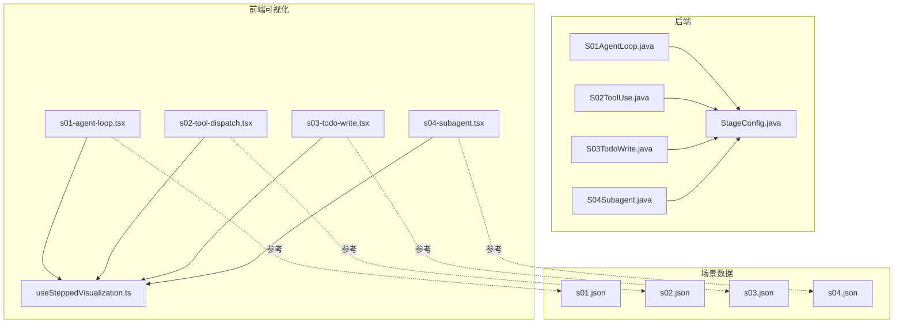
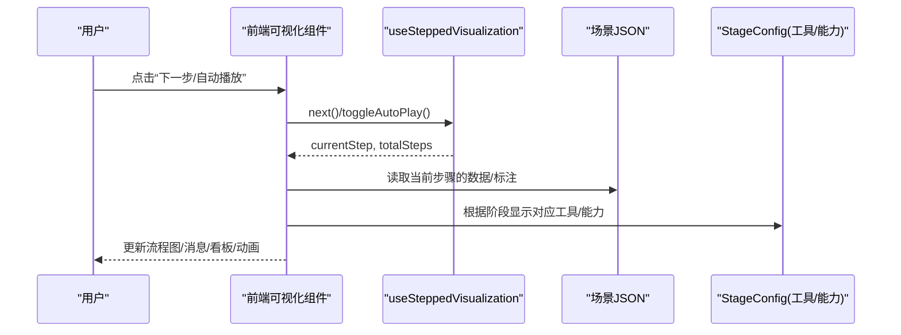
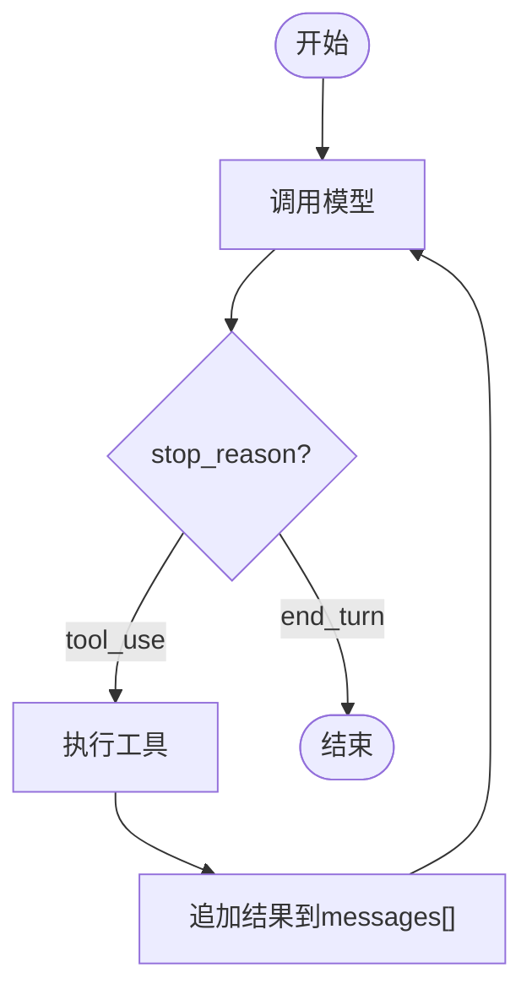
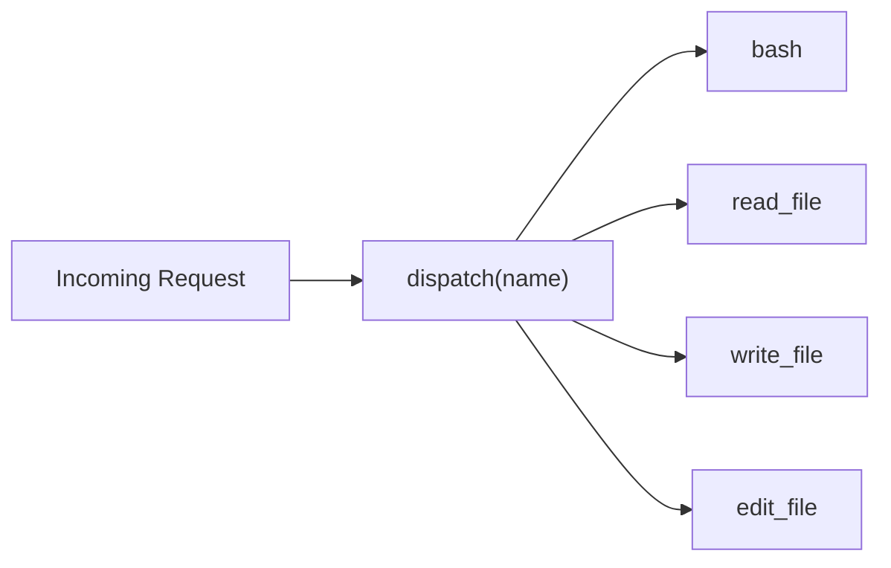
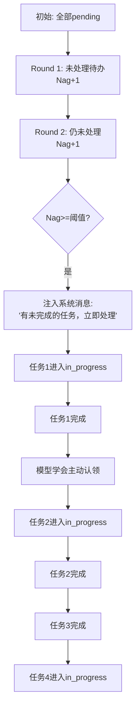
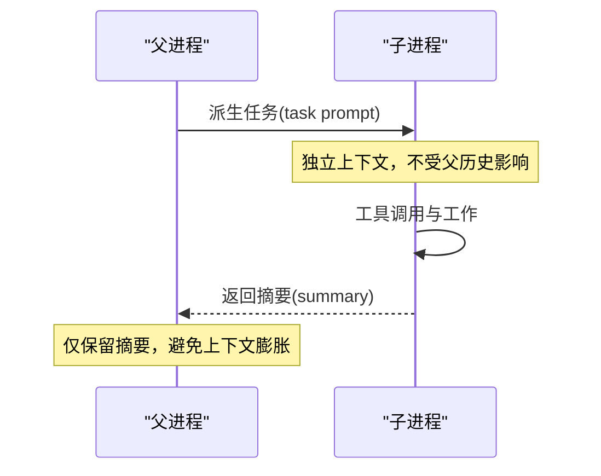
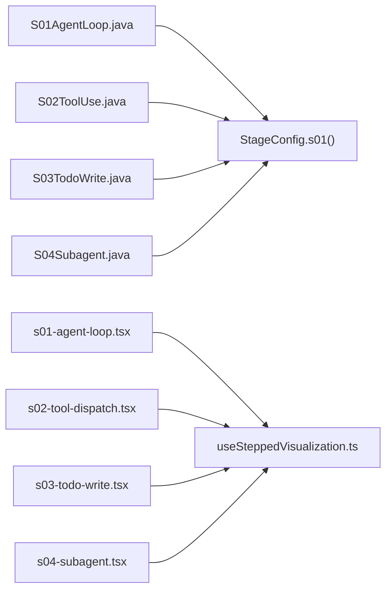

# 基础阶段可视化 (S01-S04)

<cite>
**本文引用的文件**
- [S01AgentLoop.java](file://src/main/java/com/learnclaudecode/agents/S01AgentLoop.java)
- [S02ToolUse.java](file://src/main/java/com/learnclaudecode/agents/S02ToolUse.java)
- [S03TodoWrite.java](file://src/main/java/com/learnclaudecode/agents/S03TodoWrite.java)
- [S04Subagent.java](file://src/main/java/com/learnclaudecode/agents/S04Subagent.java)
- [StageConfig.java](file://src/main/java/com/learnclaudecode/agents/StageConfig.java)
- [s01-agent-loop.tsx](file://web/src/components/visualizations/s01-agent-loop.tsx)
- [s02-tool-dispatch.tsx](file://web/src/components/visualizations/s02-tool-dispatch.tsx)
- [s03-todo-write.tsx](file://web/src/components/visualizations/s03-todo-write.tsx)
- [s04-subagent.tsx](file://web/src/components/visualizations/s04-subagent.tsx)
- [useSteppedVisualization.ts](file://web/src/hooks/useSteppedVisualization.ts)
- [s01.json](file://web/src/data/scenarios/s01.json)
- [s02.json](file://web/src/data/scenarios/s02.json)
- [s03.json](file://web/src/data/scenarios/s03.json)
- [s04.json](file://web/src/data/scenarios/s04.json)
</cite>

## 目录
1. [简介](#简介)
2. [项目结构](#项目结构)
3. [核心组件](#核心组件)
4. [架构总览](#架构总览)
5. [详细组件分析](#详细组件分析)
6. [依赖关系分析](#依赖关系分析)
7. [性能与动画考量](#性能与动画考量)
8. [故障排查与测试指南](#故障排查与测试指南)
9. [结论](#结论)

## 简介
本文件聚焦基础阶段的四个可视化组件：S01-Agent循环、S02-工具调度、S03-Todo写入、S04-子代理。目标是帮助读者理解每个组件的核心交互逻辑（循环演示、工具调用流程、任务列表操作、子代理创建过程），并解释其动画设计思路（步骤推进、状态变化、用户反馈）。同时提供调试与测试指南，包括模拟数据准备和交互场景验证。

## 项目结构
后端以 Java 为主，通过 StageConfig 为不同教学阶段配置系统提示、可用工具和能力开关；前端使用 React + Framer Motion 实现分步可视化，配合 useSteppedVisualization 钩子驱动步骤播放与交互。

图表来源
- [StageConfig.java:77-122](file://src/main/java/com/learnclaudecode/agents/StageConfig.java#L77-L122)
- [s01-agent-loop.tsx:138-148](file://web/src/components/visualizations/s01-agent-loop.tsx#L138-L148)
- [s02-tool-dispatch.tsx:95-109](file://web/src/components/visualizations/s02-tool-dispatch.tsx#L95-L109)
- [s03-todo-write.tsx:221-235](file://web/src/components/visualizations/s03-todo-write.tsx#L221-L235)
- [s04-subagent.tsx:69-78](file://web/src/components/visualizations/s04-subagent.tsx#L69-L78)
- [useSteppedVisualization.ts:23-84](file://web/src/hooks/useSteppedVisualization.ts#L23-L84)

章节来源
- [StageConfig.java:77-122](file://src/main/java/com/learnclaudecode/agents/StageConfig.java#L77-L122)
- [s01-agent-loop.tsx:138-148](file://web/src/components/visualizations/s01-agent-loop.tsx#L138-L148)
- [s02-tool-dispatch.tsx:95-109](file://web/src/components/visualizations/s02-tool-dispatch.tsx#L95-L109)
- [s03-todo-write.tsx:221-235](file://web/src/components/visualizations/s03-todo-write.tsx#L221-L235)
- [s04-subagent.tsx:69-78](file://web/src/components/visualizations/s04-subagent.tsx#L69-L78)
- [useSteppedVisualization.ts:23-84](file://web/src/hooks/useSteppedVisualization.ts#L23-L84)

## 核心组件
- S01-Agent循环：展示最小 Agent 的 while 循环，从用户输入到模型决策、工具执行、结果追加，直到结束。
- S02-工具调度：展示基于名称的工具分发机制，新增工具只需扩展调度表。
- S03-Todo写入：展示可见计划与“Nag”压力机制，推动模型主动完成待办。
- S04-子代理：展示父代理派生子代理进行隔离上下文工作，最终仅返回摘要以保持父上下文简洁。

章节来源
- [S01AgentLoop.java:4-11](file://src/main/java/com/learnclaudecode/agents/S01AgentLoop.java#L4-L11)
- [S02ToolUse.java:4-11](file://src/main/java/com/learnclaudecode/agents/S02ToolUse.java#L4-L11)
- [S03TodoWrite.java:4-11](file://src/main/java/com/learnclaudecode/agents/S03TodoWrite.java#L4-L11)
- [S04Subagent.java:4-11](file://src/main/java/com/learnclaudecode/agents/S04Subagent.java#L4-L11)

## 架构总览
整体由“后端阶段配置 + 前端分步可视化”构成。后端通过 StageConfig 定义各阶段可用的工具与能力开关；前端通过独立组件渲染对应流程图、消息流或看板，并使用统一的步骤控制钩子驱动动画与交互。

图表来源
- [useSteppedVisualization.ts:23-84](file://web/src/hooks/useSteppedVisualization.ts#L23-L84)
- [s01-agent-loop.tsx:138-148](file://web/src/components/visualizations/s01-agent-loop.tsx#L138-L148)
- [s02-tool-dispatch.tsx:95-109](file://web/src/components/visualizations/s02-tool-dispatch.tsx#L95-L109)
- [s03-todo-write.tsx:221-235](file://web/src/components/visualizations/s03-todo-write.tsx#L221-L235)
- [s04-subagent.tsx:69-78](file://web/src/components/visualizations/s04-subagent.tsx#L69-L78)
- [StageConfig.java:77-122](file://src/main/java/com/learnclaudecode/agents/StageConfig.java#L77-L122)

## 详细组件分析

### S01-Agent循环可视化
- 核心交互逻辑
  - 步骤化展示 while 循环：开始 -> API 调用 -> 判断 stop_reason -> 若 tool_use 则执行工具并追加结果 -> 回到 API 调用 -> 若 end_turn 则结束。
  - 右侧消息数组逐步累积，体现“messages[]”的增长与迭代。
- 动画设计
  - 节点高亮与边高亮随步骤切换，使用渐变与发光滤镜强调活跃路径。
  - 消息块出现时带有入场动画，增强“追加结果”的感知。
  - 第5步起显示“iter #2”，强化循环语义。
- 关键数据结构
  - 节点与边的静态定义，每步激活集合映射到 UI 高亮。
  - 每步消息集合用于构建可见消息数组。
- 调试与测试要点
  - 验证每一步激活的节点/边是否符合预期。
  - 检查消息累积顺序与长度标记是否正确。
  - 自动播放间隔可调，便于观察循环细节。

图表来源
- [s01-agent-loop.tsx:20-43](file://web/src/components/visualizations/s01-agent-loop.tsx#L20-L43)
- [s01-agent-loop.tsx:46-65](file://web/src/components/visualizations/s01-agent-loop.tsx#L46-L65)
- [s01-agent-loop.tsx:106-134](file://web/src/components/visualizations/s01-agent-loop.tsx#L106-L134)

章节来源
- [s01-agent-loop.tsx:20-98](file://web/src/components/visualizations/s01-agent-loop.tsx#L20-L98)
- [s01-agent-loop.tsx:138-148](file://web/src/components/visualizations/s01-agent-loop.tsx#L138-L148)
- [s01-agent-loop.tsx:176-350](file://web/src/components/visualizations/s01-agent-loop.tsx#L176-L350)
- [s01-agent-loop.tsx:353-398](file://web/src/components/visualizations/s01-agent-loop.tsx#L353-L398)

### S02-工具调度可视化
- 核心交互逻辑
  - 顶部显示“Incoming”请求 JSON，随步骤切换路由到不同工具卡片。
  - 中心 dispatcher 将 name 映射到 handlers[name]，体现“名称路由”。
  - 最后一步高亮所有工具，强调可扩展性。
- 动画设计
  - 连线颜色与粗细随激活状态变化，箭头标识方向。
  - 工具卡片在激活时带发光效果，非激活保持低调。
  - 底部代码片段动态高亮当前工具键名，辅助理解调度表结构。
- 关键数据结构
  - 工具定义数组包含名称、描述与主题色。
  - 每步激活工具索引与请求 JSON 映射到 UI。
- 调试与测试要点
  - 验证每步请求与路由是否一致。
  - 检查连线与卡片高亮是否与激活状态匹配。
  - 确认“全部激活”状态下的扩展提示出现时机正确。

图表来源
- [s02-tool-dispatch.tsx:19-55](file://web/src/components/visualizations/s02-tool-dispatch.tsx#L19-L55)
- [s02-tool-dispatch.tsx:77-93](file://web/src/components/visualizations/s02-tool-dispatch.tsx#L77-L93)
- [s02-tool-dispatch.tsx:204-252](file://web/src/components/visualizations/s02-tool-dispatch.tsx#L204-L252)

章节来源
- [s02-tool-dispatch.tsx:95-109](file://web/src/components/visualizations/s02-tool-dispatch.tsx#L95-L109)
- [s02-tool-dispatch.tsx:118-158](file://web/src/components/visualizations/s02-tool-dispatch.tsx#L118-L158)
- [s02-tool-dispatch.tsx:160-341](file://web/src/components/visualizations/s02-tool-dispatch.tsx#L160-L341)
- [s02-tool-dispatch.tsx:343-364](file://web/src/components/visualizations/s02-tool-dispatch.tsx#L343-L364)

### S03-Todo写入可视化
- 核心交互逻辑
  - 看板三列：Pending、In Progress、Done，任务状态随步骤迁移。
  - Nag 计时器递增，达到阈值后注入系统消息，促使模型处理待办。
  - 当模型完成任务或主动认领任务时，计时器重置。
- 动画设计
  - 任务卡片使用布局动画（layout/layoutId）平滑移动与过渡。
  - Nag 进度条宽度随值变化，触发时带缩放与边框闪烁提醒。
  - 系统消息出现/消失采用高度与透明度动画。
- 关键数据结构
  - 每步的任务快照数组，明确每个任务的 id、label、status。
  - 每步 Nag 值与触发标志，决定 UI 行为。
- 调试与测试要点
  - 验证每步任务状态迁移是否符合预期。
  - 检查 Nag 阈值与触发时机是否正确。
  - 确认进度条与消息动画流畅且无重绘抖动。

图表来源
- [s03-todo-write.tsx:17-86](file://web/src/components/visualizations/s03-todo-write.tsx#L17-L86)
- [s03-todo-write.tsx:171-217](file://web/src/components/visualizations/s03-todo-write.tsx#L171-L217)
- [s03-todo-write.tsx:241-307](file://web/src/components/visualizations/s03-todo-write.tsx#L241-L307)

章节来源
- [s03-todo-write.tsx:17-86](file://web/src/components/visualizations/s03-todo-write.tsx#L17-L86)
- [s03-todo-write.tsx:88-167](file://web/src/components/visualizations/s03-todo-write.tsx#L88-L167)
- [s03-todo-write.tsx:171-217](file://web/src/components/visualizations/s03-todo-write.tsx#L171-L217)
- [s03-todo-write.tsx:221-320](file://web/src/components/visualizations/s03-todo-write.tsx#L221-L320)

### S04-子代理可视化
- 核心交互逻辑
  - 左侧父进程维护 messages[]，右侧子进程拥有独立的 fresh messages[]。
  - 步骤推进：父上下文 -> 派生子代理 -> 子代理独立工作 -> 压缩结果 -> 返回摘要 -> 父上下文保持简洁。
- 动画设计
  - 父子容器间用虚线分隔表示“隔离墙”。
  - “task prompt”从父流向子，“summary”从子返回父，使用绝对定位与位移动画。
  - 子进程在完成后淡出并显示“context discarded”，强调上下文隔离。
- 关键数据结构
  - 父/子消息块数组，按步骤推导显示内容。
  - 步骤标志位控制弧线与状态显示。
- 调试与测试要点
  - 验证每步父子消息内容与隔离边界是否正确。
  - 检查“压缩中”与“已丢弃”提示出现时机。
  - 确保弧线动画路径与停留时间符合预期。

图表来源
- [s04-subagent.tsx:13-67](file://web/src/components/visualizations/s04-subagent.tsx#L13-L67)
- [s04-subagent.tsx:81-103](file://web/src/components/visualizations/s04-subagent.tsx#L81-L103)
- [s04-subagent.tsx:114-289](file://web/src/components/visualizations/s04-subagent.tsx#L114-L289)

章节来源
- [s04-subagent.tsx:69-78](file://web/src/components/visualizations/s04-subagent.tsx#L69-L78)
- [s04-subagent.tsx:81-103](file://web/src/components/visualizations/s04-subagent.tsx#L81-L103)
- [s04-subagent.tsx:114-289](file://web/src/components/visualizations/s04-subagent.tsx#L114-L289)

## 依赖关系分析
- 后端依赖
  - 各阶段入口类（S01-S04）统一通过 Launcher.launch(StageConfig.xxx()) 启动，StageConfig 负责暴露工具与能力开关。
- 前端依赖
  - 可视化组件均依赖 useSteppedVisualization 管理步骤状态与自动播放。
  - 场景数据（s01-s04.json）提供步骤级元数据，便于扩展与本地调试。

图表来源
- [S01AgentLoop.java:9-11](file://src/main/java/com/learnclaudecode/agents/S01AgentLoop.java#L9-L11)
- [S02ToolUse.java:9-11](file://src/main/java/com/learnclaudecode/agents/S02ToolUse.java#L9-L11)
- [S03TodoWrite.java:9-11](file://src/main/java/com/learnclaudecode/agents/S03TodoWrite.java#L9-L11)
- [S04Subagent.java:9-11](file://src/main/java/com/learnclaudecode/agents/S04Subagent.java#L9-L11)
- [StageConfig.java:77-122](file://src/main/java/com/learnclaudecode/agents/StageConfig.java#L77-L122)
- [useSteppedVisualization.ts:23-84](file://web/src/hooks/useSteppedVisualization.ts#L23-L84)

章节来源
- [StageConfig.java:77-122](file://src/main/java/com/learnclaudecode/agents/StageConfig.java#L77-L122)
- [useSteppedVisualization.ts:23-84](file://web/src/hooks/useSteppedVisualization.ts#L23-L84)

## 性能与动画考量
- 步骤控制
  - 使用单一 hook 管理步骤与自动播放，减少重复状态逻辑，提升可维护性。
- 渲染优化
  - SVG 节点与边使用 motion.path/motion.rect 等轻量动画，避免过度 DOM 操作。
  - 看板任务卡片使用 layout/layoutId 进行位置过渡，减少重排开销。
- 用户体验
  - 自动播放间隔默认适中（约2.5秒），支持手动控制与暂停。
  - 关键状态（如 Nag 触发、子代理隔离）通过颜色与动效强化感知。

[本节为通用指导，不直接分析具体文件]

## 故障排查与测试指南
- 模拟数据准备
  - 使用 web/src/data/scenarios 下的 s01-s04.json 作为步骤级数据源，便于快速验证交互流程。
  - 如需自定义场景，可在对应 JSON 中增加 steps，并在可视化组件中适配步骤数与显示逻辑。
- 交互场景验证
  - S01：验证“while 循环”的节点/边高亮顺序，检查消息数组长度与内容。
  - S02：验证每步 Incoming 请求与工具路由一致性，确认“全部激活”扩展提示。
  - S03：验证 Nag 阈值与触发时机，检查任务状态迁移与进度条动画。
  - S04：验证父子隔离边界、弧线动画与“context discarded”提示。
- 调试技巧
  - 调整 useSteppedVisualization 的 autoPlayInterval，放慢节奏以便观察细节。
  - 在浏览器控制台打印 currentStep 与 activeNodes/activeEdges，核对数据绑定。
  - 对看板组件，检查 key 与 layoutId 的唯一性，避免动画错乱。

章节来源
- [s01.json:1-52](file://web/src/data/scenarios/s01.json#L1-L52)
- [s02.json:1-47](file://web/src/data/scenarios/s02.json#L1-L47)
- [s03.json:1-54](file://web/src/data/scenarios/s03.json#L1-L54)
- [s04.json:1-52](file://web/src/data/scenarios/s04.json#L1-L52)
- [useSteppedVisualization.ts:23-84](file://web/src/hooks/useSteppedVisualization.ts#L23-L84)

## 结论
基础阶段可视化通过清晰的步骤化呈现与精心设计的动画，有效传达了 Agent 循环、工具调度、任务管理与子代理隔离的核心思想。结合后端 StageConfig 的能力开关与前端的统一步骤控制，开发者可以快速扩展新的教学阶段与交互场景，同时保证良好的用户体验与可维护性。