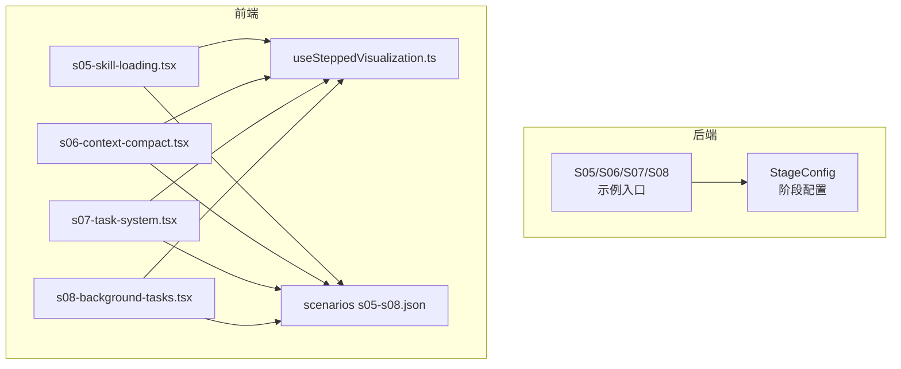
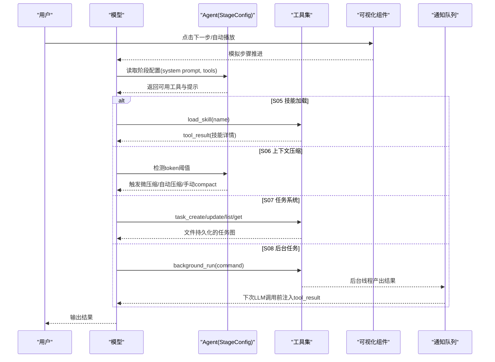
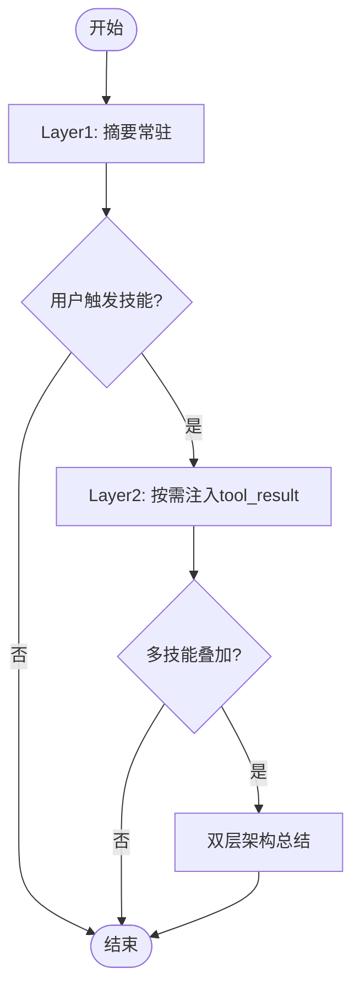
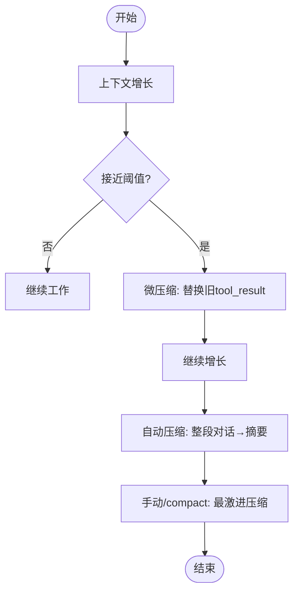
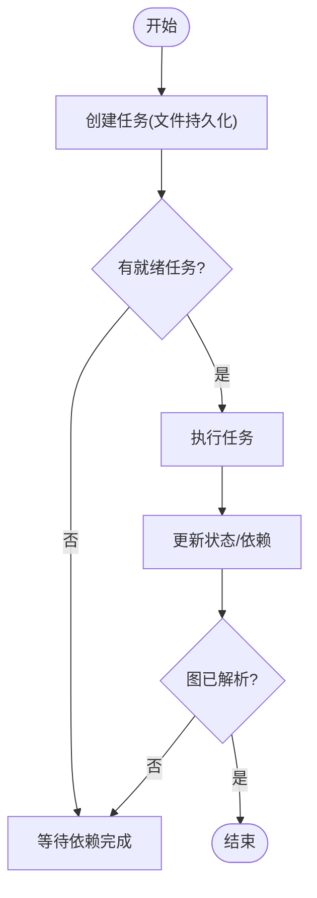
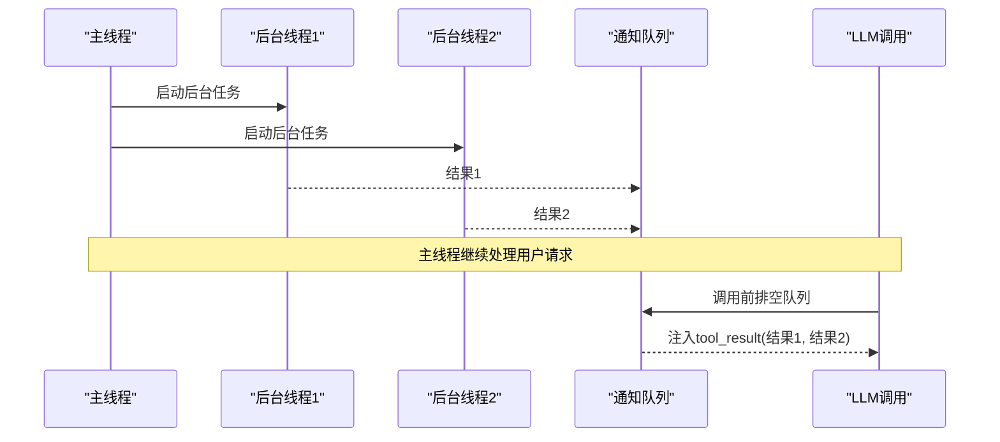
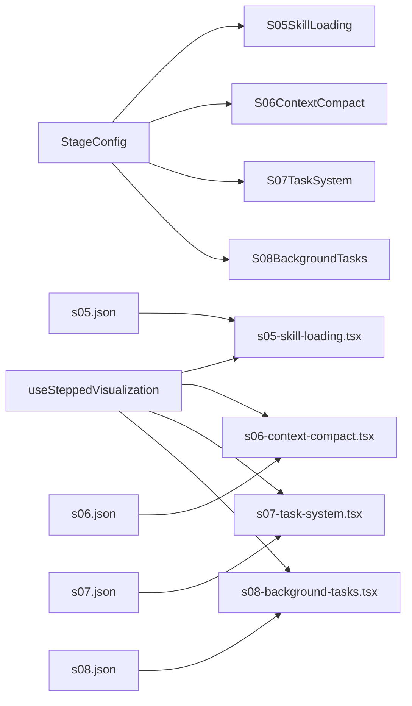

# 进阶阶段可视化 (S05-S08)

<cite>
**本文引用的文件**
- [S05SkillLoading.java](file://src/main/java/com/learnclaudecode/agents/S05SkillLoading.java)
- [S06ContextCompact.java](file://src/main/java/com/learnclaudecode/agents/S06ContextCompact.java)
- [S07TaskSystem.java](file://src/main/java/com/learnclaudecode/agents/S07TaskSystem.java)
- [S08BackgroundTasks.java](file://src/main/java/com/learnclaudecode/agents/S08BackgroundTasks.java)
- [StageConfig.java](file://src/main/java/com/learnclaudecode/agents/StageConfig.java)
- [s05-skill-loading.tsx](file://web/src/components/visualizations/s05-skill-loading.tsx)
- [s06-context-compact.tsx](file://web/src/components/visualizations/s06-context-compact.tsx)
- [s07-task-system.tsx](file://web/src/components/visualizations/s07-task-system.tsx)
- [s08-background-tasks.tsx](file://web/src/components/visualizations/s08-background-tasks.tsx)
- [useSteppedVisualization.ts](file://web/src/hooks/useSteppedVisualization.ts)
- [s05.json](file://web/src/data/scenarios/s05.json)
- [s06.json](file://web/src/data/scenarios/s06.json)
- [s07.json](file://web/src/data/scenarios/s07.json)
- [s08.json](file://web/src/data/scenarios/s08.json)
</cite>

## 目录
1. [简介](#简介)
2. [项目结构](#项目结构)
3. [核心组件](#核心组件)
4. [架构总览](#架构总览)
5. [详细组件分析](#详细组件分析)
6. [依赖关系分析](#依赖关系分析)
7. [性能考量](#性能考量)
8. [故障排查指南](#故障排查指南)
9. [结论](#结论)
10. [附录](#附录)

## 简介
本文件聚焦进阶阶段的四个可视化与实现主题：技能加载（S05）、上下文压缩（S06）、任务系统（S07）与后台任务（S08）。文档从后端能力编排、前端可视化交互、数据流与状态转换、动画效果到性能优化策略进行系统化说明，帮助读者理解复杂交互逻辑与高级动画的实现方式，并提供大数据量处理与内存管理的实践建议。

## 项目结构
- 后端入口与能力编排
  - S05-S08 的 Java 启动类仅作为示例入口，统一通过 Launcher 与 StageConfig 暴露不同阶段的能力开关与工具集。
  - StageConfig 集中定义每个阶段的 system prompt、工具列表以及是否启用压缩、后台等高级机制。
- 前端可视化
  - 每个阶段对应一个独立的可视化组件，使用分步动画展示关键流程。
  - useSteppedVisualization 提供统一的步骤控制、自动播放与生命周期管理。
  - scenarios JSON 描述典型执行序列，便于演示与教学。

图表来源
- [StageConfig.java:124-179](file://src/main/java/com/learnclaudecode/agents/StageConfig.java#L124-L179)
- [s05-skill-loading.tsx:97-107](file://web/src/components/visualizations/s05-skill-loading.tsx#L97-L107)
- [s06-context-compact.tsx:196-207](file://web/src/components/visualizations/s06-context-compact.tsx#L196-L207)
- [s07-task-system.tsx:195-204](file://web/src/components/visualizations/s07-task-system.tsx#L195-L204)
- [s08-background-tasks.tsx:151-165](file://web/src/components/visualizations/s08-background-tasks.tsx#L151-L165)
- [useSteppedVisualization.ts:23-84](file://web/src/hooks/useSteppedVisualization.ts#L23-L84)

章节来源
- [StageConfig.java:124-179](file://src/main/java/com/learnclaudecode/agents/StageConfig.java#L124-L179)
- [useSteppedVisualization.ts:23-84](file://web/src/hooks/useSteppedVisualization.ts#L23-L84)

## 核心组件
- 阶段配置器（StageConfig）
  - 负责为每个阶段注入 system prompt、工具集与功能开关（如 enableCompression、enableBackground）。
  - 将工作区路径与可用技能描述动态展开到 system prompt，使 Agent 在运行时具备“按需知识”能力。
- 可视化控制器（useSteppedVisualization）
  - 统一管理当前步骤、自动播放、前进/后退、重置与边界判断。
  - 所有阶段可视化复用该 Hook，保证一致的交互体验。
- 阶段可视化组件
  - s05-skill-loading.tsx：演示两层技能架构（摘要常驻 + 详情按需注入），右侧 Token 计量条随步骤变化。
  - s06-context-compact.tsx：三层压缩（微压缩、自动压缩、手动 /compact），左侧上下文窗口堆叠块随压缩阶段变化。
  - s07-task-system.tsx：基于 SVG 的任务依赖图，节点状态与边激活随步骤推进，体现文件持久化与跨压缩存活。
  - s08-background-tasks.tsx：三车道时间线（主线程 + 两个后台线程），通知队列在 LLM 调用前被排空并注入 tool_result。

章节来源
- [StageConfig.java:124-179](file://src/main/java/com/learnclaudecode/agents/StageConfig.java#L124-L179)
- [useSteppedVisualization.ts:23-84](file://web/src/hooks/useSteppedVisualization.ts#L23-L84)
- [s05-skill-loading.tsx:97-107](file://web/src/components/visualizations/s05-skill-loading.tsx#L97-L107)
- [s06-context-compact.tsx:196-207](file://web/src/components/visualizations/s06-context-compact.tsx#L196-L207)
- [s07-task-system.tsx:195-204](file://web/src/components/visualizations/s07-task-system.tsx#L195-L204)
- [s08-background-tasks.tsx:151-165](file://web/src/components/visualizations/s08-background-tasks.tsx#L151-L165)

## 架构总览
下图展示了 S05-S08 的整体数据流：用户输入触发模型推理，Agent 根据阶段配置选择工具；技能加载通过 tool_result 注入详情；上下文压缩在接近阈值时触发多层压缩；任务系统以文件形式持久化依赖图；后台任务通过线程与通知队列异步执行并在下一次 LLM 调用前注入结果。

图表来源
- [StageConfig.java:124-179](file://src/main/java/com/learnclaudecode/agents/StageConfig.java#L124-L179)
- [s05-skill-loading.tsx:97-107](file://web/src/components/visualizations/s05-skill-loading.tsx#L97-L107)
- [s06-context-compact.tsx:196-207](file://web/src/components/visualizations/s06-context-compact.tsx#L196-L207)
- [s07-task-system.tsx:195-204](file://web/src/components/visualizations/s07-task-system.tsx#L195-L204)
- [s08-background-tasks.tsx:151-165](file://web/src/components/visualizations/s08-background-tasks.tsx#L151-L165)

## 详细组件分析

### S05 技能加载可视化
- 交互逻辑
  - 步骤0：系统提示中列出所有技能的摘要（Layer 1，常驻，约120 tokens）。
  - 步骤1：用户输入触发 Skill 工具调用。
  - 步骤2：完整技能指令以 tool_result 注入（Layer 2，按需加载，约300-500 tokens）。
  - 步骤3-5：多技能叠加与双层架构总结。
- 动画与数据流
  - 右侧 Token 计量条随步骤变化，颜色随用量区间切换。
  - 技能内容块以入场动画逐步显示，强调“tool_result 而非 system prompt 膨胀”。
- 复杂度与优化
  - 渲染复杂度 O(N)（N 为技能条目数），可通过虚拟滚动或分页降低大列表开销。
  - 建议对 SKILL.md 内容做懒加载与缓存，避免重复解析。

图表来源
- [s05-skill-loading.tsx:64-95](file://web/src/components/visualizations/s05-skill-loading.tsx#L64-L95)
- [s05-skill-loading.tsx:120-170](file://web/src/components/visualizations/s05-skill-loading.tsx#L120-L170)
- [s05-skill-loading.tsx:223-307](file://web/src/components/visualizations/s05-skill-loading.tsx#L223-L307)
- [s05-skill-loading.tsx:356-387](file://web/src/components/visualizations/s05-skill-loading.tsx#L356-L387)

章节来源
- [s05-skill-loading.tsx:64-95](file://web/src/components/visualizations/s05-skill-loading.tsx#L64-L95)
- [s05-skill-loading.tsx:97-107](file://web/src/components/visualizations/s05-skill-loading.tsx#L97-L107)
- [s05-skill-loading.tsx:120-170](file://web/src/components/visualizations/s05-skill-loading.tsx#L120-L170)
- [s05-skill-loading.tsx:223-307](file://web/src/components/visualizations/s05-skill-loading.tsx#L223-L307)
- [s05-skill-loading.tsx:356-387](file://web/src/components/visualizations/s05-skill-loading.tsx#L356-L387)
- [StageConfig.java:124-135](file://src/main/java/com/learnclaudecode/agents/StageConfig.java#L124-L135)
- [s05.json:1-45](file://web/src/data/scenarios/s05.json#L1-L45)

### S06 上下文压缩可视化
- 交互逻辑
  - 步骤0-2：上下文增长，tool_result 成为最大消耗项。
  - 步骤3：微压缩（Micro-Compact），替换旧 tool_result 为短摘要。
  - 步骤4-5：继续增长后触发自动压缩（Auto-Compact），整段对话压缩为摘要块。
  - 步骤6：手动 /compact，最激进压缩，上下文几乎清空。
- 算法与数据流
  - computeStepState 按步骤生成不同状态的块集合、Token 计数与填充百分比。
  - 三种压缩层级分别对应不同的 token 节省策略与触发条件。
- 复杂度与优化
  - 计算复杂度 O(N)（N 为消息块数量），可引入增量更新与差量渲染。
  - 建议对 tool_result 内容做摘要缓存与去重，减少重复压缩成本。

图表来源
- [s06-context-compact.tsx:56-156](file://web/src/components/visualizations/s06-context-compact.tsx#L56-L156)
- [s06-context-compact.tsx:158-194](file://web/src/components/visualizations/s06-context-compact.tsx#L158-L194)
- [s06-context-compact.tsx:218-293](file://web/src/components/visualizations/s06-context-compact.tsx#L218-L293)
- [s06-context-compact.tsx:351-429](file://web/src/components/visualizations/s06-context-compact.tsx#L351-L429)

章节来源
- [s06-context-compact.tsx:56-156](file://web/src/components/visualizations/s06-context-compact.tsx#L56-L156)
- [s06-context-compact.tsx:158-194](file://web/src/components/visualizations/s06-context-compact.tsx#L158-L194)
- [s06-context-compact.tsx:218-293](file://web/src/components/visualizations/s06-context-compact.tsx#L218-L293)
- [s06-context-compact.tsx:351-429](file://web/src/components/visualizations/s06-context-compact.tsx#L351-L429)
- [StageConfig.java:137-149](file://src/main/java/com/learnclaudecode/agents/StageConfig.java#L137-L149)
- [s06.json:1-52](file://web/src/data/scenarios/s06.json#L1-L52)

### S07 任务系统可视化
- 交互逻辑
  - 步骤0：任务以 JSON 文件持久化，跨上下文压缩存活。
  - 步骤1-3：无依赖任务立即开始；完成上游任务后解锁下游。
  - 步骤4-6：部分阻塞与完全解锁，最终图解析完毕。
- 图形与状态
  - 使用 SVG 绘制任务节点与依赖边；边颜色与样式反映激活/阻塞状态。
  - 节点状态映射（pending/in_progress/completed/blocked）驱动视觉反馈。
- 复杂度与优化
  - 依赖解析复杂度 O(V+E)，其中 V 为任务数，E 为依赖边数。
  - 建议对大图采用虚拟化渲染与增量更新，避免全量重绘。

图表来源
- [s07-task-system.tsx:24-30](file://web/src/components/visualizations/s07-task-system.tsx#L24-L30)
- [s07-task-system.tsx:71-129](file://web/src/components/visualizations/s07-task-system.tsx#L71-L129)
- [s07-task-system.tsx:185-193](file://web/src/components/visualizations/s07-task-system.tsx#L185-L193)
- [s07-task-system.tsx:209-233](file://web/src/components/visualizations/s07-task-system.tsx#L209-L233)
- [s07-task-system.tsx:305-334](file://web/src/components/visualizations/s07-task-system.tsx#L305-L334)
- [s07-task-system.tsx:336-388](file://web/src/components/visualizations/s07-task-system.tsx#L336-L388)

章节来源
- [s07-task-system.tsx:24-30](file://web/src/components/visualizations/s07-task-system.tsx#L24-L30)
- [s07-task-system.tsx:71-129](file://web/src/components/visualizations/s07-task-system.tsx#L71-L129)
- [s07-task-system.tsx:185-193](file://web/src/components/visualizations/s07-task-system.tsx#L185-L193)
- [s07-task-system.tsx:209-233](file://web/src/components/visualizations/s07-task-system.tsx#L209-L233)
- [s07-task-system.tsx:305-334](file://web/src/components/visualizations/s07-task-system.tsx#L305-L334)
- [s07-task-system.tsx:336-388](file://web/src/components/visualizations/s07-task-system.tsx#L336-L388)
- [StageConfig.java:151-165](file://src/main/java/com/learnclaudecode/agents/StageConfig.java#L151-L165)
- [s07.json:1-54](file://web/src/data/scenarios/s07.json#L1-L54)

### S08 后台任务可视化
- 交互逻辑
  - 步骤0-1：主线程正常处理请求。
  - 步骤2-3：派生后台线程并行执行长耗时任务。
  - 步骤4-5：后台任务完成，结果进入通知队列。
  - 步骤6：在下一次 LLM 调用前，队列被排空并注入 tool_result。
- 动画与数据流
  - 三车道时间线展示主线程与后台线程的工作区间。
  - 通知队列卡片在步骤6以飞入动画注入主线程，体现非阻塞异步。
- 复杂度与优化
  - 并发调度复杂度取决于任务数量与资源限制，需防止过多线程导致上下文切换开销。
  - 建议对队列进行批处理与背压控制，避免堆积影响 UI 响应。

图表来源
- [s08-background-tasks.tsx:73-100](file://web/src/components/visualizations/s08-background-tasks.tsx#L73-L100)
- [s08-background-tasks.tsx:108-111](file://web/src/components/visualizations/s08-background-tasks.tsx#L108-L111)
- [s08-background-tasks.tsx:120-133](file://web/src/components/visualizations/s08-background-tasks.tsx#L120-L133)
- [s08-background-tasks.tsx:135-149](file://web/src/components/visualizations/s08-background-tasks.tsx#L135-L149)
- [s08-background-tasks.tsx:369-405](file://web/src/components/visualizations/s08-background-tasks.tsx#L369-L405)
- [s08-background-tasks.tsx:439-539](file://web/src/components/visualizations/s08-background-tasks.tsx#L439-L539)
- [s08-background-tasks.tsx:541-579](file://web/src/components/visualizations/s08-background-tasks.tsx#L541-L579)

章节来源
- [s08-background-tasks.tsx:73-100](file://web/src/components/visualizations/s08-background-tasks.tsx#L73-L100)
- [s08-background-tasks.tsx:108-111](file://web/src/components/visualizations/s08-background-tasks.tsx#L108-L111)
- [s08-background-tasks.tsx:120-133](file://web/src/components/visualizations/s08-background-tasks.tsx#L120-L133)
- [s08-background-tasks.tsx:135-149](file://web/src/components/visualizations/s08-background-tasks.tsx#L135-L149)
- [s08-background-tasks.tsx:369-405](file://web/src/components/visualizations/s08-background-tasks.tsx#L369-L405)
- [s08-background-tasks.tsx:439-539](file://web/src/components/visualizations/s08-background-tasks.tsx#L439-L539)
- [s08-background-tasks.tsx:541-579](file://web/src/components/visualizations/s08-background-tasks.tsx#L541-L579)
- [StageConfig.java:167-179](file://src/main/java/com/learnclaudecode/agents/StageConfig.java#L167-L179)
- [s08.json:1-57](file://web/src/data/scenarios/s08.json#L1-L57)

## 依赖关系分析
- 后端依赖
  - S05-S08 启动类均依赖 StageConfig 提供的阶段能力与工具集。
  - StageConfig 通过 systemPrompt 方法将工作区路径与技能描述注入 system prompt。
- 前端依赖
  - 各可视化组件依赖 useSteppedVisualization 提供步骤控制。
  - 场景数据来自 scenarios JSON，用于驱动演示流程。

图表来源
- [StageConfig.java:124-179](file://src/main/java/com/learnclaudecode/agents/StageConfig.java#L124-L179)
- [useSteppedVisualization.ts:23-84](file://web/src/hooks/useSteppedVisualization.ts#L23-L84)
- [s05.json:1-45](file://web/src/data/scenarios/s05.json#L1-L45)
- [s06.json:1-52](file://web/src/data/scenarios/s06.json#L1-L52)
- [s07.json:1-54](file://web/src/data/scenarios/s07.json#L1-L54)
- [s08.json:1-57](file://web/src/data/scenarios/s08.json#L1-L57)

章节来源
- [StageConfig.java:124-179](file://src/main/java/com/learnclaudecode/agents/StageConfig.java#L124-L179)
- [useSteppedVisualization.ts:23-84](file://web/src/hooks/useSteppedVisualization.ts#L23-L84)

## 性能考量
- 大数据量处理
  - 技能列表与上下文块渲染可采用虚拟滚动与分页，降低 DOM 压力。
  - 任务依赖图在大图场景下建议使用虚拟化与增量更新，避免全量重绘。
- 内存管理策略
  - 对 tool_result 内容做摘要缓存与去重，减少重复解析与存储。
  - 后台任务队列实施批处理与背压控制，防止内存暴涨与 UI 卡顿。
- 动画与渲染优化
  - 使用 framer-motion 的 AnimatePresence 与 key 变更触发高效过渡。
  - 对频繁更新的指标（如 Token 计量条）使用最小化 state 更新与防抖。

[本节为通用指导，不直接分析具体文件]

## 故障排查指南
- 技能加载问题
  - 检查 SKILL.md 是否被正确扫描与注入为 tool_result。
  - 确认 system prompt 中的技能摘要与实际加载内容一致。
- 上下文压缩异常
  - 验证阈值触发逻辑与压缩层级顺序（微压缩→自动压缩→手动 /compact）。
  - 关注 tool_result 大小与摘要质量，确保压缩后仍保留关键信息。
- 任务依赖死锁
  - 检查依赖图是否存在环或错误依赖，确保任务状态更新正确。
  - 确认文件持久化路径与权限，避免跨进程/压缩后状态丢失。
- 后台任务阻塞
  - 监控通知队列长度与排空时机，确保在 LLM 调用前注入结果。
  - 设置合理的超时与重试策略，避免长时间占用资源。

章节来源
- [s05-skill-loading.tsx:223-307](file://web/src/components/visualizations/s05-skill-loading.tsx#L223-L307)
- [s06-context-compact.tsx:56-156](file://web/src/components/visualizations/s06-context-compact.tsx#L56-L156)
- [s07-task-system.tsx:71-129](file://web/src/components/visualizations/s07-task-system.tsx#L71-L129)
- [s08-background-tasks.tsx:439-539](file://web/src/components/visualizations/s08-background-tasks.tsx#L439-L539)

## 结论
S05-S08 通过前后端协同实现了技能按需加载、上下文智能压缩、任务依赖管理与后台异步执行的完整闭环。可视化组件以分步动画清晰呈现复杂交互与状态转换，配合场景数据与阶段配置，既便于教学演示，也为工程实践提供了参考范式。建议在大规模应用中结合虚拟化、缓存与背压策略，进一步提升性能与稳定性。

[本节为总结性内容，不直接分析具体文件]

## 附录
- 关键实现路径参考
  - 阶段配置与工具集：[StageConfig.java:124-179](file://src/main/java/com/learnclaudecode/agents/StageConfig.java#L124-L179)
  - 步骤控制 Hook：[useSteppedVisualization.ts:23-84](file://web/src/hooks/useSteppedVisualization.ts#L23-L84)
  - 技能加载可视化：[s05-skill-loading.tsx:64-95](file://web/src/components/visualizations/s05-skill-loading.tsx#L64-L95)
  - 上下文压缩可视化：[s06-context-compact.tsx:56-156](file://web/src/components/visualizations/s06-context-compact.tsx#L56-L156)
  - 任务系统可视化：[s07-task-system.tsx:24-30](file://web/src/components/visualizations/s07-task-system.tsx#L24-L30)
  - 后台任务可视化：[s08-background-tasks.tsx:73-100](file://web/src/components/visualizations/s08-background-tasks.tsx#L73-L100)
  - 场景数据：[s05.json:1-45](file://web/src/data/scenarios/s05.json#L1-L45), [s06.json:1-52](file://web/src/data/scenarios/s06.json#L1-L52), [s07.json:1-54](file://web/src/data/scenarios/s07.json#L1-L54), [s08.json:1-57](file://web/src/data/scenarios/s08.json#L1-L57)

[本节为附录，不直接分析具体文件]