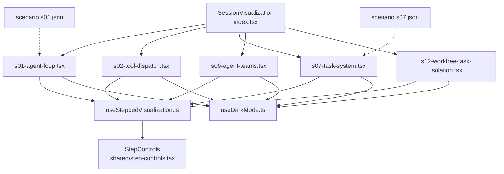
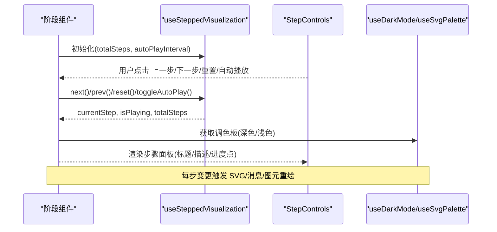
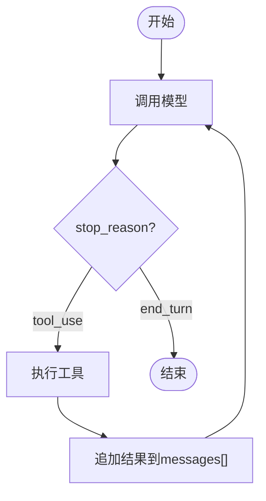
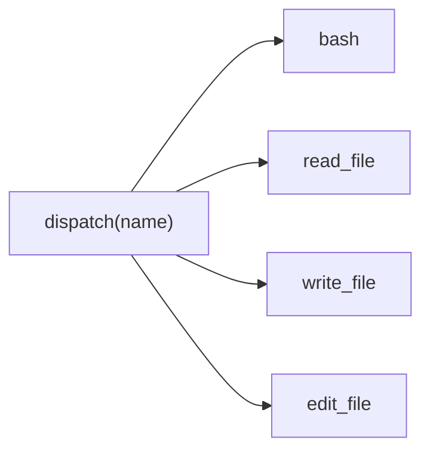
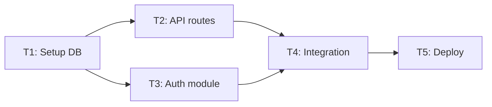
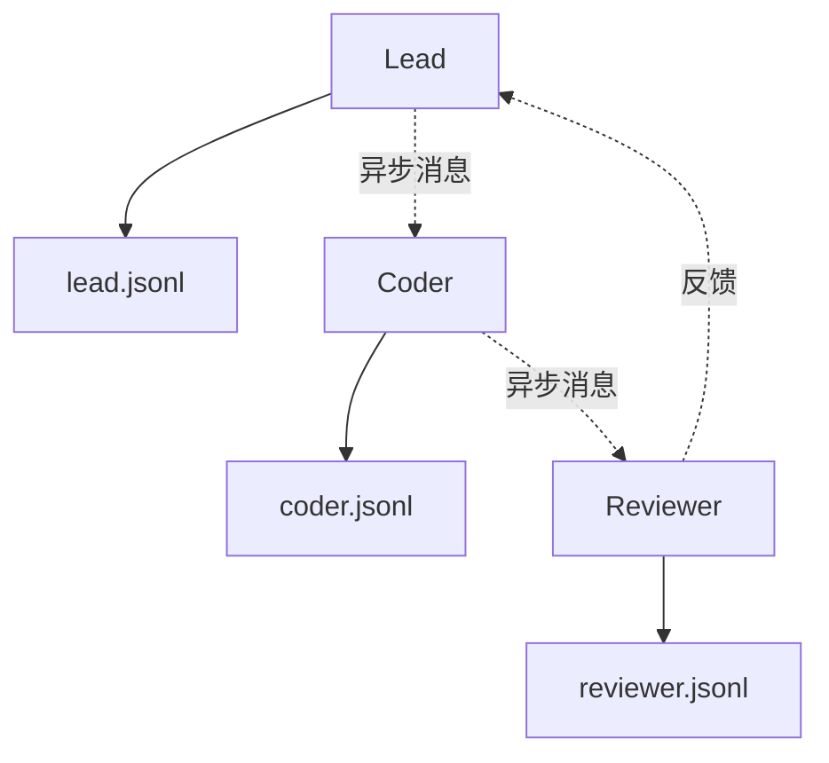
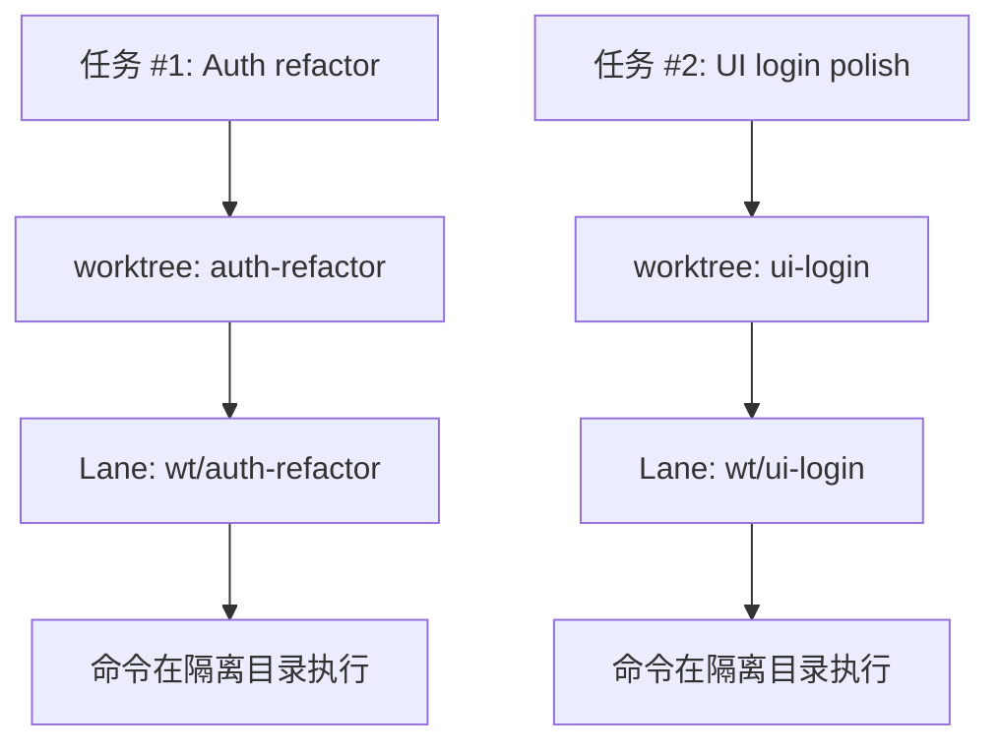
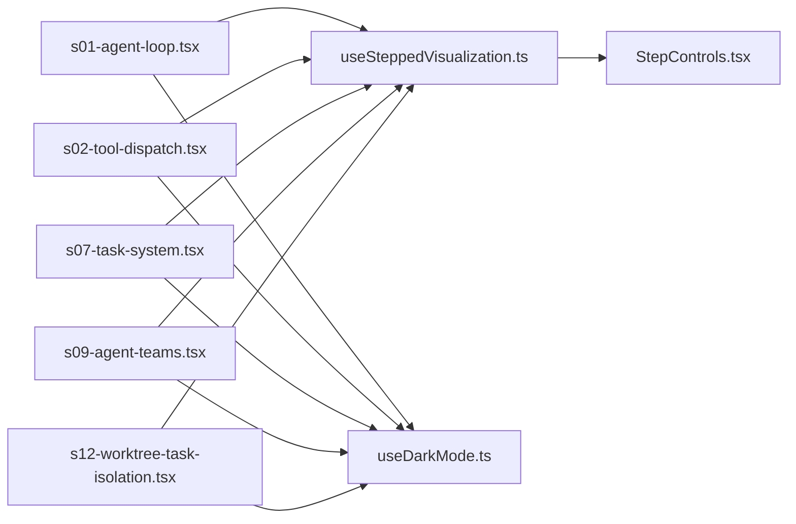

# 阶段专用可视化组件

<cite>
**本文引用的文件**
- [web/src/components/visualizations/index.tsx](file://web/src/components/visualizations/index.tsx)
- [web/src/components/visualizations/shared/step-controls.tsx](file://web/src/components/visualizations/shared/step-controls.tsx)
- [web/src/hooks/useSteppedVisualization.ts](file://web/src/hooks/useSteppedVisualization.ts)
- [web/src/types/agent-data.ts](file://web/src/types/agent-data.ts)
- [web/src/data/scenarios/s01.json](file://web/src/data/scenarios/s01.json)
- [web/src/data/scenarios/s07.json](file://web/src/data/scenarios/s07.json)
- [web/src/components/visualizations/s01-agent-loop.tsx](file://web/src/components/visualizations/s01-agent-loop.tsx)
- [web/src/components/visualizations/s02-tool-dispatch.tsx](file://web/src/components/visualizations/s02-tool-dispatch.tsx)
- [web/src/components/visualizations/s03-todo-write.tsx](file://web/src/components/visualizations/s03-todo-write.tsx)
- [web/src/components/visualizations/s04-subagent.tsx](file://web/src/components/visualizations/s04-subagent.tsx)
- [web/src/components/visualizations/s05-skill-loading.tsx](file://web/src/components/visualizations/s05-skill-loading.tsx)
- [web/src/components/visualizations/s06-context-compact.tsx](file://web/src/components/visualizations/s06-context-compact.tsx)
- [web/src/components/visualizations/s07-task-system.tsx](file://web/src/components/visualizations/s07-task-system.tsx)
- [web/src/components/visualizations/s08-background-tasks.tsx](file://web/src/components/visualizations/s08-background-tasks.tsx)
- [web/src/components/visualizations/s09-agent-teams.tsx](file://web/src/components/visualizations/s09-agent-teams.tsx)
- [web/src/components/visualizations/s10-team-protocols.tsx](file://web/src/components/visualizations/s10-team-protocols.tsx)
- [web/src/components/visualizations/s11-autonomous-agents.tsx](file://web/src/components/visualizations/s11-autonomous-agents.tsx)
- [web/src/components/visualizations/s12-worktree-task-isolation.tsx](file://web/src/components/visualizations/s12-worktree-task-isolation.tsx)
- [web/src/hooks/useSimulator.ts](file://web/src/hooks/useSimulator.ts)
- [web/src/hooks/useDarkMode.ts](file://web/src/hooks/useDarkMode.ts)
</cite>

## 目录
1. [简介](#简介)
2. [项目结构](#项目结构)
3. [核心组件](#核心组件)
4. [架构总览](#架构总览)
5. [详细组件分析](#详细组件分析)
6. [依赖关系分析](#依赖关系分析)
7. [性能考量](#性能考量)
8. [故障排查指南](#故障排查指南)
9. [结论](#结论)
10. [附录：新阶段可视化开发指南](#附录：新阶段可视化开发指南)

## 简介
本文件面向“阶段专用可视化组件”的综合文档，目标是系统化说明 S01-S12 各阶段的可视化实现、交互设计与数据绑定机制。内容覆盖：
- Agent 循环演示（S01）
- 工具调度可视化（S02）
- 任务管理界面（S07）
- 团队与协议协作（S09/S10）
- 自主代理与工作区隔离（S11/S12）
同时解释共享组件 StepControls、动画效果与状态管理，以及 scenario.json 数据的解析与可视化映射方式，并提供新增阶段可视化的模板与最佳实践。

## 项目结构
前端采用 Next.js 客户端组件组织，所有阶段可视化集中在 web/src/components/visualizations 下，通过懒加载按需引入；共享控制与状态逻辑位于 hooks 与 shared 目录；场景数据位于 data/scenarios。

图表来源
- [web/src/components/visualizations/index.tsx:6-22](file://web/src/components/visualizations/index.tsx#L6-L22)
- [web/src/hooks/useSteppedVisualization.ts:23-84](file://web/src/hooks/useSteppedVisualization.ts#L23-L84)
- [web/src/components/visualizations/shared/step-controls.tsx:6-17](file://web/src/components/visualizations/shared/step-controls.tsx#L6-L17)
- [web/src/hooks/useDarkMode.ts:23-75](file://web/src/hooks/useDarkMode.ts#L23-L75)
- [web/src/data/scenarios/s01.json:1-52](file://web/src/data/scenarios/s01.json#L1-L52)
- [web/src/data/scenarios/s07.json:1-54](file://web/src/data/scenarios/s07.json#L1-L54)

章节来源
- [web/src/components/visualizations/index.tsx:1-40](file://web/src/components/visualizations/index.tsx#L1-L40)

## 核心组件
- SessionVisualization：根据版本标识动态懒加载对应阶段可视化组件，统一渲染容器与占位骨架屏。
- useSteppedVisualization：提供步骤化播放控制（前进、后退、重置、自动播放），维护当前步骤与边界状态。
- StepControls：统一的步骤控制面板，包含标题、描述、进度指示器与播放控制按钮。
- useDarkMode/useSvgPalette：主题与 SVG 调色板，确保节点、边、箭头在不同主题下的可读性。
- useSimulator：基于 SimStep 序列的通用模拟器 Hook，用于按步推进消息流。

章节来源
- [web/src/components/visualizations/index.tsx:24-39](file://web/src/components/visualizations/index.tsx#L24-L39)
- [web/src/hooks/useSteppedVisualization.ts:5-84](file://web/src/hooks/useSteppedVisualization.ts#L5-L84)
- [web/src/components/visualizations/shared/step-controls.tsx:6-103](file://web/src/components/visualizations/shared/step-controls.tsx#L6-L103)
- [web/src/hooks/useDarkMode.ts:5-75](file://web/src/hooks/useDarkMode.ts#L5-L75)
- [web/src/hooks/useSimulator.ts:6-84](file://web/src/hooks/useSimulator.ts#L6-L84)

## 架构总览
阶段可视化遵循“数据驱动 + 步骤驱动 + 共享控制”的统一模式：
- 数据层：每个阶段定义步骤集（如 ACTIVE_NODES_PER_STEP、STEP_INFO、TASKS 等），或通过 scenario.json 提供结构化步骤。
- 控制层：useSteppedVisualization 管理步骤索引与自动播放；StepControls 暴露 UI 操作。
- 表现层：SVG/React 元素根据 currentStep 计算高亮、连线、消息累积与状态变化。
- 主题层：useSvgPalette 提供一致的深浅色配色，保证可访问性。

图表来源
- [web/src/hooks/useSteppedVisualization.ts:23-84](file://web/src/hooks/useSteppedVisualization.ts#L23-L84)
- [web/src/components/visualizations/shared/step-controls.tsx:19-103](file://web/src/components/visualizations/shared/step-controls.tsx#L19-L103)
- [web/src/hooks/useDarkMode.ts:39-75](file://web/src/hooks/useDarkMode.ts#L39-L75)

## 详细组件分析

### S01：Agent 循环演示
- 目标：可视化 while 循环中模型调用、工具执行与结果追加的过程。
- 关键设计：
  - 流程图节点与边：start/api_call/check/execute/append/end，边带标签 tool_use/end_turn。
  - 步骤映射：ACTIVE_NODES_PER_STEP 与 ACTIVE_EDGES_PER_STEP 决定每步高亮。
  - 消息累积：visibleMessages 随步骤递增显示，体现 messages[] 增长。
  - 动画：framer-motion 控制节点发光、边粗细与颜色过渡。
- 交互：StepControls 支持手动步进与自动播放；标题/描述来自 STEP_INFO。

图表来源
- [web/src/components/visualizations/s01-agent-loop.tsx:20-43](file://web/src/components/visualizations/s01-agent-loop.tsx#L20-L43)
- [web/src/components/visualizations/s01-agent-loop.tsx:46-65](file://web/src/components/visualizations/s01-agent-loop.tsx#L46-L65)
- [web/src/components/visualizations/s01-agent-loop.tsx:75-98](file://web/src/components/visualizations/s01-agent-loop.tsx#L75-L98)

章节来源
- [web/src/components/visualizations/s01-agent-loop.tsx:138-417](file://web/src/components/visualizations/s01-agent-loop.tsx#L138-L417)

### S02：工具调度可视化
- 目标：展示 dispatch(name) 将 tool_call.name 路由到具体 handler 的映射机制。
- 关键设计：
  - 工具卡片：bash/read_file/write_file/edit_file，各自有颜色与描述。
  - 请求展示：REQUEST_PER_STEP 显示入站 JSON 示例。
  - 高亮策略：ACTIVE_TOOL_PER_STEP 指定当前激活的工具或全部激活。
  - 扩展性提示：最后一步以“+”符号强调可扩展。
- 交互：StepControls 驱动步骤切换，代码片段区域同步高亮 handlers 键名。

图表来源
- [web/src/components/visualizations/s02-tool-dispatch.tsx:19-55](file://web/src/components/visualizations/s02-tool-dispatch.tsx#L19-L55)
- [web/src/components/visualizations/s02-tool-dispatch.tsx:57-75](file://web/src/components/visualizations/s02-tool-dispatch.tsx#L57-L75)
- [web/src/components/visualizations/s02-tool-dispatch.tsx:95-110](file://web/src/components/visualizations/s02-tool-dispatch.tsx#L95-L110)

章节来源
- [web/src/components/visualizations/s02-tool-dispatch.tsx:95-381](file://web/src/components/visualizations/s02-tool-dispatch.tsx#L95-L381)

### S03：Todo 写入
- 目标：演示 Todo 任务的创建、更新与完成流程（结合工具调用）。
- 关键点：复用 StepControls 与 useSteppedVisualization；通过步骤控制 Todo 列表状态变化。
- 数据绑定：通常由本地步骤数组驱动，也可对接 scenario.json 的 steps。

章节来源
- [web/src/components/visualizations/s03-todo-write.tsx](file://web/src/components/visualizations/s03-todo-write.tsx)

### S04：子代理
- 目标：展示主代理派生子代理执行子任务的流程。
- 关键点：步骤驱动的子任务生命周期；消息在父子代理间传递。
- 数据绑定：可使用 SimStep 类型表示 user_message/assistant_text/tool_call/tool_result/system_event。

章节来源
- [web/src/components/visualizations/s04-subagent.tsx](file://web/src/components/visualizations/s04-subagent.tsx)
- [web/src/types/agent-data.ts:38-58](file://web/src/types/agent-data.ts#L38-L58)

### S05：技能加载
- 目标：可视化技能发现、注册与调用的过程。
- 关键点：步骤化展示技能清单与加载状态；可结合工具调度视图。

章节来源
- [web/src/components/visualizations/s05-skill-loading.tsx](file://web/src/components/visualizations/s05-skill-loading.tsx)

### S06：上下文压缩
- 目标：展示长上下文的压缩与保留关键信息的策略。
- 关键点：步骤化呈现压缩前后对比；突出保留的关键片段。

章节来源
- [web/src/components/visualizations/s06-context-compact.tsx](file://web/src/components/visualizations/s06-context-compact.tsx)

### S07：任务系统
- 目标：可视化基于文件的持久化任务及其依赖图。
- 关键设计：
  - 任务节点：T1-T5，含依赖关系。
  - 状态机：pending/in_progress/completed/blocked，按步骤映射。
  - 边状态：根据上下游任务状态决定高亮或阻塞。
  - 持久化提示：底部文件路径与闪烁指示器。
- 数据绑定：可结合 scenario.json 中的 task_manager 工具调用序列。

图表来源
- [web/src/components/visualizations/s07-task-system.tsx:24-30](file://web/src/components/visualizations/s07-task-system.tsx#L24-L30)
- [web/src/components/visualizations/s07-task-system.tsx:71-129](file://web/src/components/visualizations/s07-task-system.tsx#L71-L129)
- [web/src/data/scenarios/s07.json:1-54](file://web/src/data/scenarios/s07.json#L1-L54)

章节来源
- [web/src/components/visualizations/s07-task-system.tsx:195-495](file://web/src/components/visualizations/s07-task-system.tsx#L195-L495)

### S08：后台任务
- 目标：展示与主循环并行的后台任务执行与结果回传。
- 关键点：步骤化展示后台任务队列、执行与完成状态。

章节来源
- [web/src/components/visualizations/s08-background-tasks.tsx](file://web/src/components/visualizations/s08-background-tasks.tsx)

### S09：代理团队
- 目标：可视化 Leader-Worker 模式的团队通信与文件邮箱机制。
- 关键设计：
  - 角色：Lead/Coder/Reviewer，位置呈倒三角布局。
  - 邮箱：每个代理下方 inbox 托盘，消息通过 .jsonl 文件异步传递。
  - 动画：消息在代理与邮箱之间移动，支持脉冲与发光效果。
  - 拓扑：支持线性、广播、轮询等多种通信拓扑。
- 数据绑定：步骤配置 STEPS 驱动不同阶段的消息流动与高亮。

图表来源
- [web/src/components/visualizations/s09-agent-teams.tsx:14-18](file://web/src/components/visualizations/s09-agent-teams.tsx#L14-L18)
- [web/src/components/visualizations/s09-agent-teams.tsx:39-65](file://web/src/components/visualizations/s09-agent-teams.tsx#L39-L65)
- [web/src/components/visualizations/s09-agent-teams.tsx:134-394](file://web/src/components/visualizations/s09-agent-teams.tsx#L134-L394)

章节来源
- [web/src/components/visualizations/s09-agent-teams.tsx:134-394](file://web/src/components/visualizations/s09-agent-teams.tsx#L134-L394)

### S10：团队协议
- 目标：展示团队协作中的协议约定与消息格式规范。
- 关键点：步骤化展示协议握手、消息校验与错误处理。

章节来源
- [web/src/components/visualizations/s10-team-protocols.tsx](file://web/src/components/visualizations/s10-team-protocols.tsx)

### S11：自主代理
- 目标：展示具备更高自治能力的代理如何自我规划与执行。
- 关键点：步骤化展示目标分解、资源分配与结果评估。

章节来源
- [web/src/components/visualizations/s11-autonomous-agents.tsx](file://web/src/components/visualizations/s11-autonomous-agents.tsx)

### S12：工作区任务隔离
- 目标：通过 worktree 隔离不同任务的执行环境，避免冲突。
- 关键设计：
  - 三栏视图：Task Board、Worktree Index、Execution Lanes。
  - 步骤状态：tasks/worktrees/lanes 在每个步骤中明确状态与归属。
  - 操作日志：顶部 op 字段显示当前操作步骤。
- 数据绑定：STEPS 数组驱动三栏视图的状态变化与高亮。

图表来源
- [web/src/components/visualizations/s12-worktree-task-isolation.tsx:38-143](file://web/src/components/visualizations/s12-worktree-task-isolation.tsx#L38-L143)
- [web/src/components/visualizations/s12-worktree-task-isolation.tsx:158-279](file://web/src/components/visualizations/s12-worktree-task-isolation.tsx#L158-L279)

章节来源
- [web/src/components/visualizations/s12-worktree-task-isolation.tsx:158-279](file://web/src/components/visualizations/s12-worktree-task-isolation.tsx#L158-L279)

## 依赖关系分析
- 组件耦合：
  - 阶段组件强依赖 useSteppedVisualization 与 StepControls，弱依赖 useDarkMode/useSvgPalette。
  - 场景数据（scenario.json）与组件解耦，便于替换与扩展。
- 外部依赖：
  - framer-motion 提供动画能力。
  - lucide-react 提供图标。
- 潜在风险：
  - 步骤映射数组过大时影响性能，建议按需计算或虚拟化。
  - SVG 节点过多时需考虑渲染优化（如 memoization）。

图表来源
- [web/src/hooks/useSteppedVisualization.ts:23-84](file://web/src/hooks/useSteppedVisualization.ts#L23-L84)
- [web/src/components/visualizations/shared/step-controls.tsx:19-103](file://web/src/components/visualizations/shared/step-controls.tsx#L19-L103)
- [web/src/hooks/useDarkMode.ts:39-75](file://web/src/hooks/useDarkMode.ts#L39-L75)

章节来源
- [web/src/components/visualizations/index.tsx:6-22](file://web/src/components/visualizations/index.tsx#L6-L22)

## 性能考量
- 懒加载：SessionVisualization 使用 React.lazy 按需加载阶段组件，减少首屏体积。
- 动画开销：framer-motion 的频繁重绘可能带来性能压力，建议在大数据量时使用节流或简化动画。
- SVG 渲染：大量节点/边时，考虑合并路径、减少滤镜使用或使用 Canvas/WebGL。
- 状态计算：步骤映射数组应尽可能小且稳定，必要时使用 useMemo 缓存。

[本节为通用指导，不直接分析具体文件]

## 故障排查指南
- 步骤不更新：检查 useSteppedVisualization 的 totalSteps 与实际步骤数是否一致。
- 自动播放不停止：确认 last step 时 setIsPlaying(false) 逻辑是否生效。
- 主题颜色异常：确认 useSvgPalette 返回的颜色值与 Tailwind 类名兼容。
- 场景数据不生效：验证 scenario.json 的 steps 结构与 SimStep 类型匹配。

章节来源
- [web/src/hooks/useSteppedVisualization.ts:55-70](file://web/src/hooks/useSteppedVisualization.ts#L55-L70)
- [web/src/types/agent-data.ts:38-58](file://web/src/types/agent-data.ts#L38-L58)
- [web/src/hooks/useDarkMode.ts:39-75](file://web/src/hooks/useDarkMode.ts#L39-L75)

## 结论
该可视化体系通过统一的步骤控制、共享 UI 组件与主题适配，实现了 S01-S12 各阶段的一致体验。数据驱动的设计使新增阶段变得简单：只需定义步骤映射与视图逻辑，即可快速集成。未来可进一步引入虚拟滚动、Web Worker 计算与更丰富的交互（如拖拽、缩放）以提升体验。

[本节为总结，不直接分析具体文件]

## 附录：新阶段可视化开发指南

### 组件模板
- 入口：在 index.tsx 的 visualizations 映射中添加新版本键值对，指向新组件。
- 步骤控制：使用 useSteppedVisualization(totalSteps, autoPlayInterval)。
- 控制面板：传入 StepControls 的 currentStep、totalSteps、回调函数与 stepTitle/description。
- 主题：通过 useSvgPalette 获取深浅色配色，应用于 SVG 节点与边。

章节来源
- [web/src/components/visualizations/index.tsx:6-22](file://web/src/components/visualizations/index.tsx#L6-L22)
- [web/src/hooks/useSteppedVisualization.ts:23-84](file://web/src/hooks/useSteppedVisualization.ts#L23-L84)
- [web/src/components/visualizations/shared/step-controls.tsx:19-103](file://web/src/components/visualizations/shared/step-controls.tsx#L19-L103)
- [web/src/hooks/useDarkMode.ts:39-75](file://web/src/hooks/useDarkMode.ts#L39-L75)

### 数据格式规范
- 场景数据（scenario.json）：
  - version/title/description/steps
  - steps 项：type/content/annotation/toolName/toolInput
- 类型定义：参考 SimStep、Scenario 接口。

章节来源
- [web/src/types/agent-data.ts:38-58](file://web/src/types/agent-data.ts#L38-L58)
- [web/src/data/scenarios/s01.json:1-52](file://web/src/data/scenarios/s01.json#L1-L52)
- [web/src/data/scenarios/s07.json:1-54](file://web/src/data/scenarios/s07.json#L1-L54)

### 数据绑定机制
- 步骤映射：定义 ACTIVE_NODES_PER_STEP、ACTIVE_EDGES_PER_STEP、STEP_INFO 等数组，按 currentStep 选择高亮与文案。
- 消息累积：遍历 0..currentStep 收集可见消息，配合 AnimatePresence 实现入场/出场动画。
- 场景数据：若使用 scenario.json，可通过 useSimulator 或自定义 Hook 将 steps 转换为可视化步骤。

章节来源
- [web/src/components/visualizations/s01-agent-loop.tsx:75-98](file://web/src/components/visualizations/s01-agent-loop.tsx#L75-L98)
- [web/src/hooks/useSimulator.ts:12-84](file://web/src/hooks/useSimulator.ts#L12-L84)

### 最佳实践
- 保持步骤映射与视图逻辑分离，便于测试与维护。
- 使用 useMemo 缓存复杂计算（如图边坐标、状态映射）。
- 为动画设置合理时长与缓动，避免过度抖动。
- 提供无障碍属性（aria-label、title）提升可访问性。
- 在大型图中分片渲染或虚拟化列表，保障流畅度。

[本节为通用指导，不直接分析具体文件]