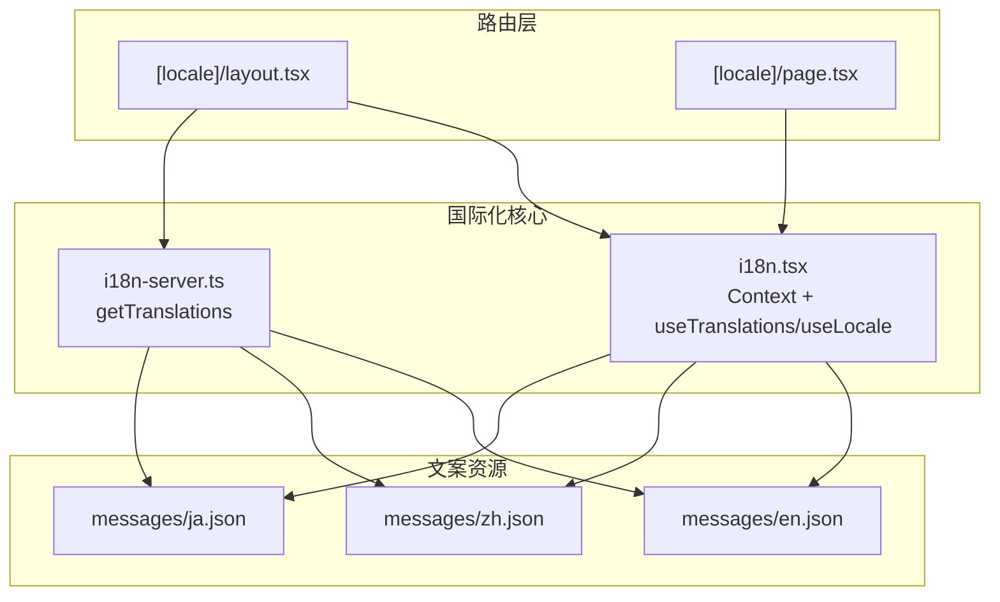
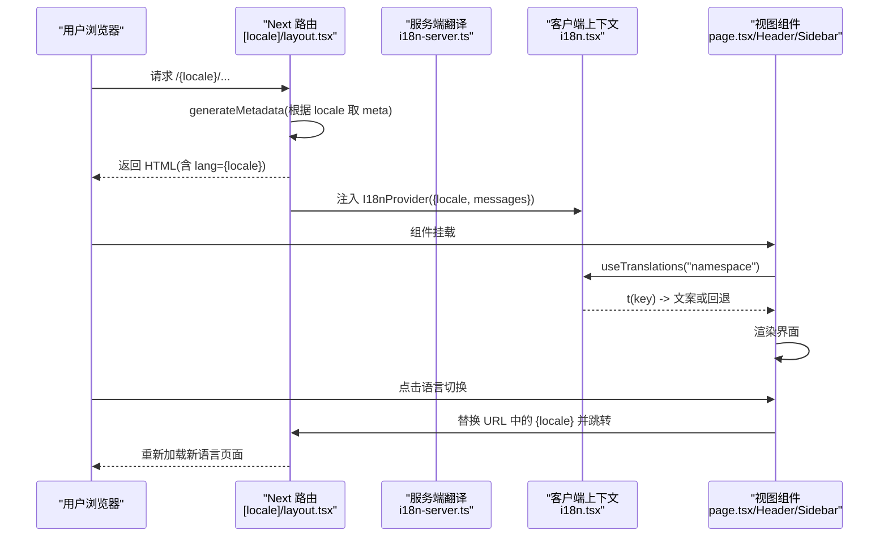
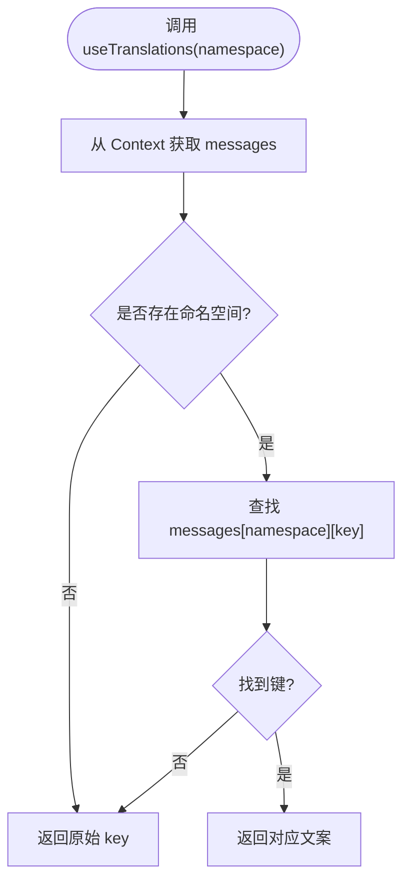
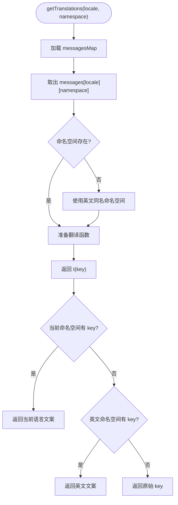
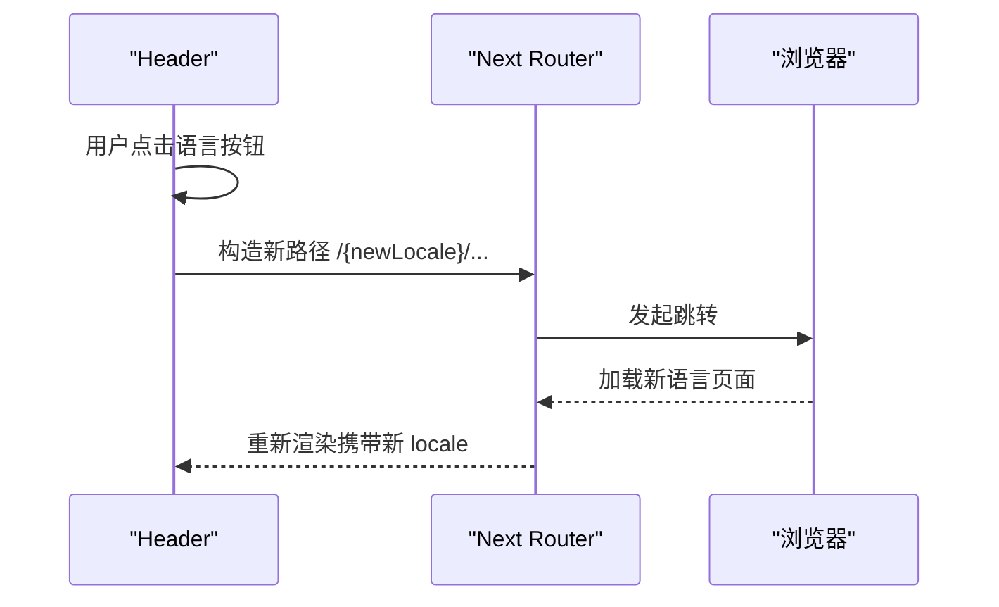
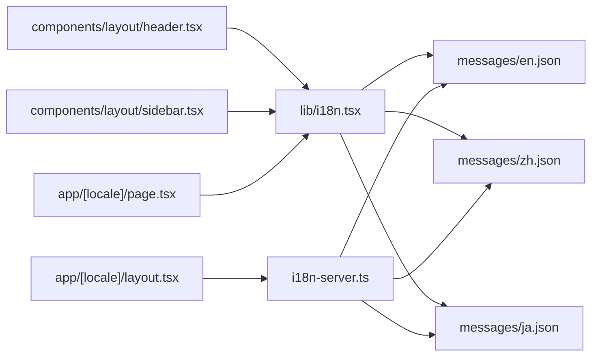

# 国际化支持

<cite>
**本文引用的文件**
- [web/src/lib/i18n.tsx](file://web/src/lib/i18n.tsx)
- [web/src/lib/i18n-server.ts](file://web/src/i18n-server.ts)
- [web/src/app/[locale]/layout.tsx](file://web/src/app/[locale]/layout.tsx)
- [web/src/components/layout/header.tsx](file://web/src/components/layout/header.tsx)
- [web/src/components/layout/sidebar.tsx](file://web/src/components/layout/sidebar.tsx)
- [web/src/app/[locale]/page.tsx](file://web/src/app/[locale]/page.tsx)
- [web/src/i18n/messages/en.json](file://web/src/i18n/messages/en.json)
- [web/src/i18n/messages/ja.json](file://web/src/i18n/messages/ja.json)
- [web/package.json](file://web/package.json)
</cite>

## 目录
1. [简介](#简介)
2. [项目结构](#项目结构)
3. [核心组件](#核心组件)
4. [架构总览](#架构总览)
5. [详细组件分析](#详细组件分析)
6. [依赖关系分析](#依赖关系分析)
7. [性能考量](#性能考量)
8. [故障排查指南](#故障排查指南)
9. [结论](#结论)
10. [附录：本地化开发指南](#附录本地化开发指南)

## 简介
本系统为 Next.js 前端应用提供完整的国际化（i18n）能力，覆盖服务端与客户端的翻译获取、语言切换、消息组织与回退策略。通过基于路由的语言前缀实现多语言页面，结合 React Context 在客户端动态注入当前语言与文案；在服务端渲染时按命名空间返回翻译函数，并支持以英文为默认回退。文案采用 JSON 键值对按命名空间分组管理，便于维护与扩展。

## 项目结构
- 路由级国际化：使用 Next.js 的动态路由 [locale] 包裹页面，生成 /en、/zh、/ja 等路径。根布局根据 locale 设置 html lang 并通过 I18nProvider 向子树注入当前语言与消息。
- 文案资源：位于 web/src/i18n/messages，每个语言一个 JSON 文件，内部按命名空间（如 meta、nav、home、version、compare、diff、sessions、layer_labels、viz 等）组织键值对。
- 客户端 i18n：提供 useTranslations(namespace) 与 useLocale() Hook，通过 React Context 读取当前语言的消息对象，并按命名空间解析 key。
- 服务端 i18n：提供 getTranslations(locale, namespace) 返回翻译函数，支持缺失键时回退到英文同命名空间。
- 语言切换：Header 中提供语言按钮，点击后替换 URL 中的语言段并跳转，触发对应语言的页面加载。

图表来源
- [web/src/app/[locale]/layout.tsx:1-61](file://web/src/app/[locale]/layout.tsx#L1-L61)
- [web/src/lib/i18n.tsx:1-37](file://web/src/lib/i18n.tsx#L1-L37)
- [web/src/lib/i18n-server.ts:1-17](file://web/src/lib/i18n-server.ts#L1-L17)
- [web/src/i18n/messages/en.json:1-77](file://web/src/i18n/messages/en.json#L1-L77)
- [web/src/i18n/messages/ja.json:1-77](file://web/src/i18n/messages/ja.json#L1-L77)

章节来源
- [web/src/app/[locale]/layout.tsx:1-61](file://web/src/app/[locale]/layout.tsx#L1-L61)
- [web/src/lib/i18n.tsx:1-37](file://web/src/lib/i18n.tsx#L1-L37)
- [web/src/lib/i18n-server.ts:1-17](file://web/src/lib/i18n-server.ts#L1-L17)
- [web/src/i18n/messages/en.json:1-77](file://web/src/i18n/messages/en.json#L1-L77)
- [web/src/i18n/messages/ja.json:1-77](file://web/src/i18n/messages/ja.json#L1-L77)

## 核心组件
- 客户端上下文与 Hook
  - I18nProvider：接收 locale，选择对应 messages，注入 Context。
  - useTranslations(namespace)：返回 (key) => string，优先从当前语言命名空间取值，不存在则返回 key。
  - useLocale()：返回当前 locale。
- 服务端翻译函数
  - getTranslations(locale, namespace)：返回 (key) => string，若当前语言缺失键，回退到英文同命名空间。
- 路由布局
  - generateStaticParams：为 en、zh、ja 生成静态参数。
  - generateMetadata：根据 locale 设置页面标题与描述。
  - RootLayout：设置 html lang，注入 I18nProvider。
- 语言切换
  - Header：提供语言按钮，点击后替换 URL 中的语言段并跳转。

章节来源
- [web/src/lib/i18n.tsx:1-37](file://web/src/lib/i18n.tsx#L1-L37)
- [web/src/lib/i18n-server.ts:1-17](file://web/src/lib/i18n-server.ts#L1-L17)
- [web/src/app/[locale]/layout.tsx:1-61](file://web/src/app/[locale]/layout.tsx#L1-L61)
- [web/src/components/layout/header.tsx:1-173](file://web/src/components/layout/header.tsx#L1-L173)

## 架构总览
下图展示了从用户访问到文案渲染的关键流程，包括服务端元数据生成、客户端 Provider 注入、Hook 获取文案以及语言切换的路由跳转。

图表来源
- [web/src/app/[locale]/layout.tsx:12-27](file://web/src/app/[locale]/layout.tsx#L12-L27)
- [web/src/app/[locale]/layout.tsx:29-61](file://web/src/app/[locale]/layout.tsx#L29-L61)
- [web/src/lib/i18n.tsx:16-31](file://web/src/lib/i18n.tsx#L16-L31)
- [web/src/lib/i18n-server.ts:9-16](file://web/src/lib/i18n-server.ts#L9-L16)
- [web/src/components/layout/header.tsx:48-51](file://web/src/components/layout/header.tsx#L48-L51)

## 详细组件分析

### 客户端国际化（i18n.tsx）
- 设计要点
  - 使用 React Context 集中管理 locale 与 messages。
  - useTranslations 支持命名空间访问，未命中时返回原始 key，便于调试与渐进完善。
  - 支持多语言消息对象映射，新增语言只需添加 JSON 并加入映射。
- 复杂度
  - 查找时间 O(1)（对象键访问）。
  - 内存占用与语言数量成正比，但单页仅加载当前语言。
- 错误处理
  - 当命名空间或键缺失时，返回 key 本身，避免崩溃。
- 优化建议
  - 可按需拆分大 JSON 为模块，减少首屏体积。
  - 可考虑将 messages 缓存于全局以避免重复导入开销。

图表来源
- [web/src/lib/i18n.tsx:25-31](file://web/src/lib/i18n.tsx#L25-L31)

章节来源
- [web/src/lib/i18n.tsx:1-37](file://web/src/lib/i18n.tsx#L1-L37)

### 服务端国际化（i18n-server.ts）
- 设计要点
  - getTranslations(locale, namespace) 返回翻译函数，优先使用当前语言命名空间，缺失时回退到英文同名命名空间。
  - 适合在服务端渲染阶段按需获取文案，避免客户端冗余逻辑。
- 复杂度
  - 每次调用 O(1)。
- 错误处理
  - 三层回退：当前语言命名空间 -> 英文命名空间 -> 原始 key。
- 优化建议
  - 可在构建期预取常用命名空间并缓存，减少运行时判断。

图表来源
- [web/src/lib/i18n-server.ts:9-16](file://web/src/lib/i18n-server.ts#L9-L16)

章节来源
- [web/src/lib/i18n-server.ts:1-17](file://web/src/lib/i18n-server.ts#L1-L17)

### 路由与元数据（[locale]/layout.tsx）
- 功能
  - generateStaticParams 为 en、zh、ja 生成静态路由参数。
  - generateMetadata 根据 locale 设置 title 与 description。
  - RootLayout 设置 html lang，并通过 I18nProvider 注入 locale 与 messages。
- 关键点
  - 使用 suppressHydrationWarning 避免 SSR/CSR 差异警告。
  - 通过 window.matchMedia 与 localStorage 初始化主题（与 i18n 无关但共存于布局）。

章节来源
- [web/src/app/[locale]/layout.tsx:1-61](file://web/src/app/[locale]/layout.tsx#L1-L61)

### 语言切换（header.tsx）
- 功能
  - 提供 EN/中文/日本語 按钮，点击后将 pathname 中的语言段替换为目标语言，并使用 window.location.href 跳转。
  - 导航项文案通过 useTranslations("nav") 获取。
- 交互
  - 桌面与移动端均提供语言切换入口。
  - 切换后由 Next.js 路由重新加载对应语言页面。

图表来源
- [web/src/components/layout/header.tsx:48-51](file://web/src/components/layout/header.tsx#L48-L51)
- [web/src/components/layout/header.tsx:77-93](file://web/src/components/layout/header.tsx#L77-L93)

章节来源
- [web/src/components/layout/header.tsx:1-173](file://web/src/components/layout/header.tsx#L1-L173)

### 侧边栏与页面文案（sidebar.tsx、page.tsx）
- Sidebar
  - 使用 useTranslations("sessions") 与 useTranslations("layer_labels") 渲染课程列表与层级标签。
  - 链接路径包含当前 locale，确保导航保持语言一致。
- Home Page
  - 使用 useTranslations("home") 渲染首页文案，链接使用当前 locale。

章节来源
- [web/src/components/layout/sidebar.tsx:1-67](file://web/src/components/layout/sidebar.tsx#L1-L67)
- [web/src/app/[locale]/page.tsx:1-235](file://web/src/app/[locale]/page.tsx#L1-L235)

## 依赖关系分析
- 组件依赖
  - 所有页面与 UI 组件通过 useTranslations/useLocale 依赖客户端 i18n。
  - 服务端元数据通过 layout.tsx 直接引用 messages JSON。
- 文案依赖
  - 各命名空间被多处复用（如 nav、home、version、compare、diff、sessions、layer_labels、viz）。
- 构建脚本
  - package.json 定义了 extract 脚本，用于在 dev/build 前执行内容提取任务（与 i18n 无直接耦合，但影响构建流程）。

图表来源
- [web/src/components/layout/header.tsx:1-173](file://web/src/components/layout/header.tsx#L1-L173)
- [web/src/components/layout/sidebar.tsx:1-67](file://web/src/components/layout/sidebar.tsx#L1-L67)
- [web/src/app/[locale]/page.tsx:1-235](file://web/src/app/[locale]/page.tsx#L1-L235)
- [web/src/app/[locale]/layout.tsx:1-61](file://web/src/app/[locale]/layout.tsx#L1-L61)
- [web/src/lib/i18n.tsx:1-37](file://web/src/lib/i18n.tsx#L1-L37)
- [web/src/lib/i18n-server.ts:1-17](file://web/src/lib/i18n-server.ts#L1-L17)
- [web/src/i18n/messages/en.json:1-77](file://web/src/i18n/messages/en.json#L1-L77)
- [web/src/i18n/messages/ja.json:1-77](file://web/src/i18n/messages/ja.json#L1-L77)

章节来源
- [web/package.json:1-39](file://web/package.json#L1-L39)

## 性能考量
- 首屏体积
  - 当前将所有语言 JSON 作为模块导入，建议在大型项目中按命名空间或页面进行代码分割，减少首屏包体。
- 运行时查找
  - 命名空间与键查找为 O(1)，整体开销极低。
- 回退机制
  - 服务端回退至英文可减少缺失文案导致的空白显示，提升用户体验。
- 缓存策略
  - 可在应用启动时将 messages 缓存到全局状态，避免重复导入与解析。
- 构建优化
  - 利用 Next.js 的静态生成与增量静态再生成，配合 extract 脚本保证文案一致性。

## 故障排查指南
- 文案不显示或显示 key
  - 检查命名空间是否正确传入 useTranslations。
  - 确认 JSON 文件中是否存在对应键。
  - 服务端渲染时，确认 getTranslations 的回退逻辑是否生效。
- 语言切换无效
  - 检查 Header 中 switchLocale 是否替换了正确的路径段。
  - 确认路由是否包含 [locale] 动态段。
- 元数据不正确
  - 检查 generateMetadata 中 locale 与 messages.meta 的映射。
- 构建失败
  - 检查 package.json 的 extract 脚本是否能正常运行。
  - 确认所有语言 JSON 格式合法且键一致。

章节来源
- [web/src/lib/i18n.tsx:25-31](file://web/src/lib/i18n.tsx#L25-L31)
- [web/src/lib/i18n-server.ts:9-16](file://web/src/lib/i18n-server.ts#L9-L16)
- [web/src/components/layout/header.tsx:48-51](file://web/src/components/layout/header.tsx#L48-L51)
- [web/src/app/[locale]/layout.tsx:16-27](file://web/src/app/[locale]/layout.tsx#L16-L27)
- [web/package.json:5-11](file://web/package.json#L5-L11)

## 结论
该国际化方案以简洁的 JSON 命名空间组织文案，通过 Next.js 路由与 React Context 实现服务端与客户端的统一接入。服务端提供带回退的翻译函数，客户端提供便捷的 Hook 与上下文。语言切换通过 URL 路由完成，简单可靠。后续可在此基础上引入按需加载、文案校验与自动化检测缺失键等增强能力。

## 附录：本地化开发指南
- 新增语言
  - 在 web/src/i18n/messages 下新增语言 JSON 文件（如 xx.json），复制现有结构并翻译键值。
  - 在 i18n.tsx 与 i18n-server.ts 中将新语言加入 messagesMap。
  - 在 [locale]/layout.tsx 的 locales 数组中添加新语言代码。
  - 在 Header 的 LOCALES 列表中添加新语言选项。
- 翻译维护
  - 统一命名空间：meta、nav、home、version、compare、diff、sessions、layer_labels、viz 等。
  - 保持键名一致：新增键时需同步所有语言文件，避免回退导致不一致。
  - 使用工具脚本：可通过 extract 脚本辅助抽取与校验文案。
- 格式化与最佳实践
  - 文案尽量短小明确，避免长句硬编码。
  - 复杂文本可拆分为多个命名空间，便于局部更新与维护。
  - 对可变内容（如数字、日期）建议使用模板或占位符，并在调用处拼接。
- 常见问题
  - 文案不生效：检查命名空间与键是否存在。
  - 切换语言后部分文案未更新：确认组件是否使用了 useTranslations 而非硬编码字符串。
  - 构建时报错：检查 JSON 语法与 extract 脚本输出。

章节来源
- [web/src/lib/i18n.tsx:1-37](file://web/src/lib/i18n.tsx#L1-L37)
- [web/src/lib/i18n-server.ts:1-17](file://web/src/lib/i18n-server.ts#L1-L17)
- [web/src/app/[locale]/layout.tsx:1-61](file://web/src/app/[locale]/layout.tsx#L1-L61)
- [web/src/components/layout/header.tsx:16-20](file://web/src/components/layout/header.tsx#L16-L20)
- [web/package.json:5-11](file://web/package.json#L5-L11)