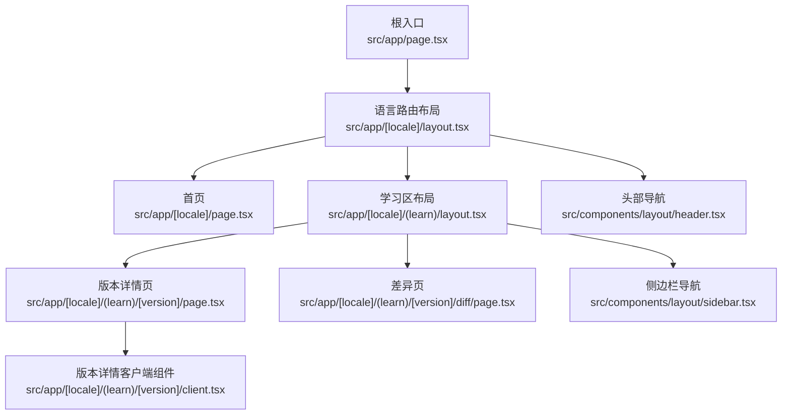
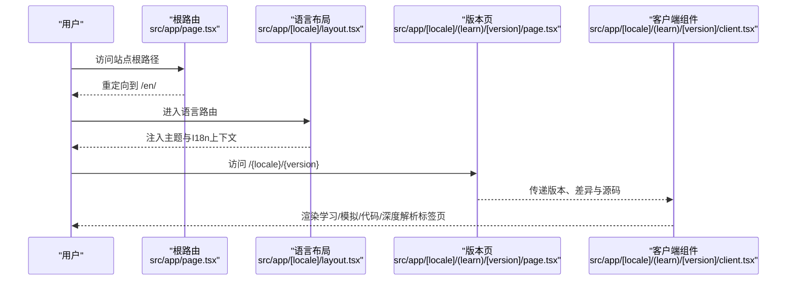
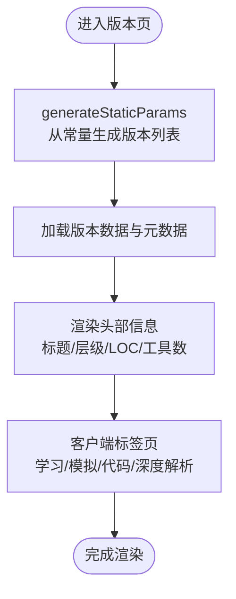
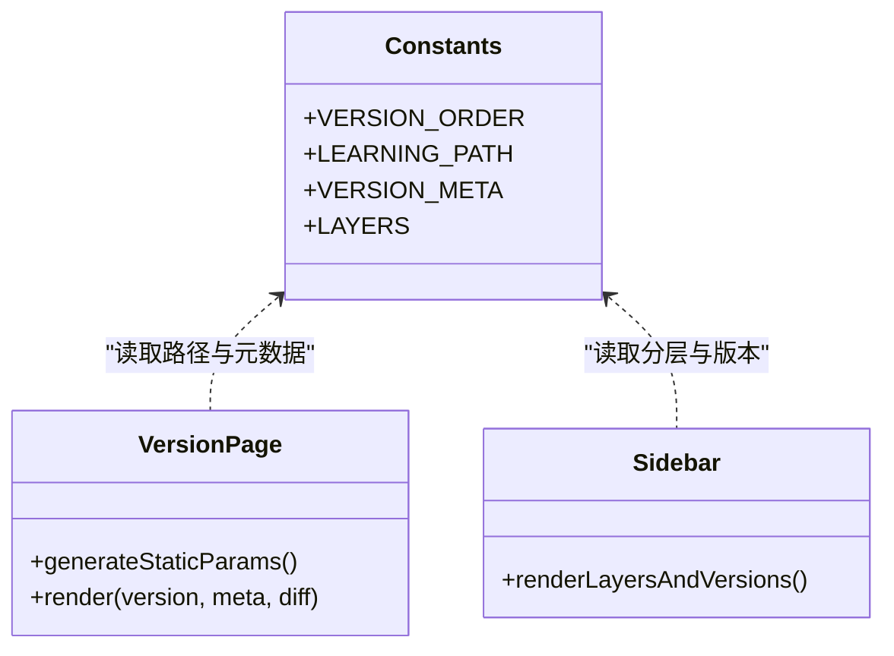
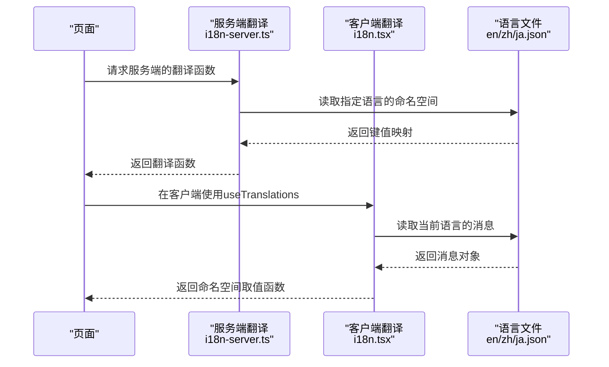
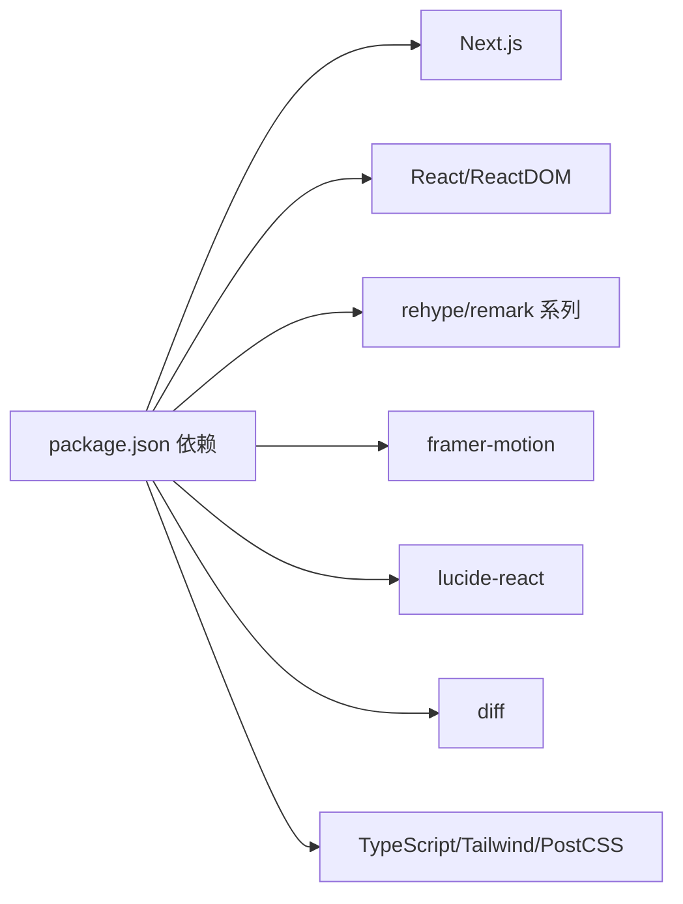

# 应用架构设计

<cite>
**本文引用的文件**
- [package.json](file://web/package.json)
- [next.config.ts](file://web/next.config.ts)
- [src/app/page.tsx](file://web/src/app/page.tsx)
- [src/app/[locale]/layout.tsx](file://web/src/app/[locale]/layout.tsx)
- [src/app/[locale]/page.tsx](file://web/src/app/[locale]/page.tsx)
- [src/app/[locale]/(learn)/layout.tsx](file://web/src/app/[locale]/(learn)/layout.tsx)
- [src/app/[locale]/(learn)/[version]/page.tsx](file://web/src/app/[locale]/(learn)/[version]/page.tsx)
- [src/app/[locale]/(learn)/[version]/client.tsx](file://web/src/app/[locale]/(learn)/[version]/client.tsx)
- [src/app/[locale]/(learn)/[version]/diff/page.tsx](file://web/src/app/[locale]/(learn)/[version]/diff/page.tsx)
- [src/lib/constants.ts](file://web/src/lib/constants.ts)
- [src/lib/i18n.tsx](file://web/src/lib/i18n.tsx)
- [src/lib/i18n-server.ts](file://web/src/lib/i18n-server.ts)
- [src/components/layout/header.tsx](file://web/src/components/layout/header.tsx)
- [src/components/layout/sidebar.tsx](file://web/src/components/layout/sidebar.tsx)
</cite>

## 目录
1. [简介](#简介)
2. [项目结构](#项目结构)
3. [核心组件](#核心组件)
4. [架构总览](#架构总览)
5. [详细组件分析](#详细组件分析)
6. [依赖关系分析](#依赖关系分析)
7. [性能考量](#性能考量)
8. [故障排查指南](#故障排查指南)
9. [结论](#结论)
10. [附录](#附录)

## 简介
本文件面向Next.js前端工程，系统化说明应用的目录结构、路由与页面组织、版本化学习路径的实现机制（静态参数生成、动态路由与渲染策略）、国际化方案（多语言文件管理与翻译函数使用）、配置管理系统（常量定义、版本元数据与环境配置），以及前端开发规范（组件组织、样式策略与性能优化建议）。目标是帮助开发者快速理解并高效扩展该站点。

## 项目结构
- 构建与运行
  - 通过脚本命令进行内容提取、开发与构建，构建产物为静态导出。
- 路由与布局
  - 根路由重定向到默认语言；语言段采用动态路由；学习模块使用路由组隔离布局；版本详情与对比等子路由位于版本段下。
- 数据与资源
  - 版本相关的数据由脚本生成后以JSON形式提供；UI组件按功能域拆分；国际化文案按语言分文件管理。

图表来源
- [src/app/page.tsx:1-6](file://web/src/app/page.tsx#L1-L6)
- [src/app/[locale]/layout.tsx:1-61](file://web/src/app/[locale]/layout.tsx#L1-L61)
- [src/app/[locale]/page.tsx:1-235](file://web/src/app/[locale]/page.tsx#L1-L235)
- [src/app/[locale]/(learn)/layout.tsx:1-15](file://web/src/app/[locale]/(learn)/layout.tsx#L1-L15)
- [src/app/[locale]/(learn)/[version]/page.tsx:1-126](file://web/src/app/[locale]/(learn)/[version]/page.tsx#L1-L126)
- [src/app/[locale]/(learn)/[version]/client.tsx:1-83](file://web/src/app/[locale]/(learn)/[version]/client.tsx#L1-L83)
- [src/app/[locale]/(learn)/[version]/diff/page.tsx:1-16](file://web/src/app/[locale]/(learn)/[version]/diff/page.tsx#L1-L16)
- [src/components/layout/header.tsx:1-173](file://web/src/components/layout/header.tsx#L1-L173)
- [src/components/layout/sidebar.tsx:1-67](file://web/src/components/layout/sidebar.tsx#L1-L67)

章节来源
- [package.json:1-39](file://web/package.json#L1-L39)
- [next.config.ts:1-10](file://web/next.config.ts#L1-L10)
- [src/app/page.tsx:1-6](file://web/src/app/page.tsx#L1-L6)
- [src/app/[locale]/layout.tsx:1-61](file://web/src/app/[locale]/layout.tsx#L1-L61)
- [src/app/[locale]/(learn)/layout.tsx:1-15](file://web/src/app/[locale]/(learn)/layout.tsx#L1-L15)

## 核心组件
- 国际化上下文与提供者
  - 提供当前语言与消息字典的上下文，支持命名空间访问与回退逻辑。
- 服务端翻译工具
  - 在服务端渲染时根据语言和命名空间获取翻译键值，具备英文回退能力。
- 常量与版本元数据
  - 集中维护学习路径顺序、版本元信息、分层标签与颜色映射，作为全站一致性的数据源。
- 布局与导航
  - 根布局注入主题初始化脚本与I18nProvider；头部与侧边栏负责导航、语言切换与主题控制。

章节来源
- [src/lib/i18n.tsx:1-37](file://web/src/lib/i18n.tsx#L1-L37)
- [src/lib/i18n-server.ts:1-17](file://web/src/lib/i18n-server.ts#L1-L17)
- [src/lib/constants.ts:1-38](file://web/src/lib/constants.ts#L1-L38)
- [src/app/[locale]/layout.tsx:1-61](file://web/src/app/[locale]/layout.tsx#L1-L61)
- [src/components/layout/header.tsx:1-173](file://web/src/components/layout/header.tsx#L1-L173)
- [src/components/layout/sidebar.tsx:1-67](file://web/src/components/layout/sidebar.tsx#L1-L67)

## 架构总览
整体采用“根重定向 + 语言路由 + 路由组 + 动态版本路由”的分层结构：
- 根路由统一重定向至默认语言路径。
- 语言路由层负责元数据、全局布局与I18n注入。
- 学习路由组承载侧边栏与内容区域，隔离学习相关布局。
- 版本动态路由加载对应版本的详情与交互内容，并通过客户端组件实现交互。

图表来源
- [src/app/page.tsx:1-6](file://web/src/app/page.tsx#L1-L6)
- [src/app/[locale]/layout.tsx:1-61](file://web/src/app/[locale]/layout.tsx#L1-L61)
- [src/app/[locale]/(learn)/[version]/page.tsx:1-126](file://web/src/app/[locale]/(learn)/[version]/page.tsx#L1-L126)
- [src/app/[locale]/(learn)/[version]/client.tsx:1-83](file://web/src/app/[locale]/(learn)/[version]/client.tsx#L1-L83)

## 详细组件分析

### 路由设计与页面组织
- 根重定向
  - 将根路径统一跳转到默认语言，确保URL规范化。
- 语言路由
  - 使用动态段[locale]，并在布局中声明generateStaticParams以预生成所有语言。
  - 在布局中设置html lang、注入主题初始化脚本、包裹I18nProvider。
- 学习路由组
  - 使用(learn)路由组隔离布局，提供侧边栏与主内容区。
- 版本动态路由
  - [version]动态段配合generateStaticParams从常量中学习路径生成静态参数，实现SSG。
  - 页面读取生成的版本数据与元数据，渲染标题、层级标签、LOC与工具数、关键洞察等。
  - 通过客户端组件实现标签页切换、可视化、模拟器与源码查看。
- 差异页
  - 同样基于版本动态段，展示两个版本之间的变更摘要。

图表来源
- [src/app/[locale]/(learn)/[version]/page.tsx:1-126](file://web/src/app/[locale]/(learn)/[version]/page.tsx#L1-L126)
- [src/app/[locale]/(learn)/[version]/client.tsx:1-83](file://web/src/app/[locale]/(learn)/[version]/client.tsx#L1-L83)
- [src/lib/constants.ts:1-38](file://web/src/lib/constants.ts#L1-L38)

章节来源
- [src/app/page.tsx:1-6](file://web/src/app/page.tsx#L1-L6)
- [src/app/[locale]/layout.tsx:1-61](file://web/src/app/[locale]/layout.tsx#L1-L61)
- [src/app/[locale]/(learn)/layout.tsx:1-15](file://web/src/app/[locale]/(learn)/layout.tsx#L1-L15)
- [src/app/[locale]/(learn)/[version]/page.tsx:1-126](file://web/src/app/[locale]/(learn)/[version]/page.tsx#L1-L126)
- [src/app/[locale]/(learn)/[version]/diff/page.tsx:1-16](file://web/src/app/[locale]/(learn)/[version]/diff/page.tsx#L1-L16)

### 版本化学习路径的实现机制
- 静态参数生成
  - 通过常量中的学习路径数组，在版本页与差异页调用generateStaticParams，为每个版本生成静态路由。
- 动态路由与渲染策略
  - 版本详情页在服务端读取版本数据与元数据，渲染首屏信息；交互部分交由客户端组件处理，兼顾SEO与交互体验。
- 前后导航
  - 基于学习路径索引计算上一/下一个版本，提供连续学习体验。

图表来源
- [src/lib/constants.ts:1-38](file://web/src/lib/constants.ts#L1-L38)
- [src/app/[locale]/(learn)/[version]/page.tsx:1-126](file://web/src/app/[locale]/(learn)/[version]/page.tsx#L1-L126)
- [src/components/layout/sidebar.tsx:1-67](file://web/src/components/layout/sidebar.tsx#L1-L67)

章节来源
- [src/lib/constants.ts:1-38](file://web/src/lib/constants.ts#L1-L38)
- [src/app/[locale]/(learn)/[version]/page.tsx:1-126](file://web/src/app/[locale]/(learn)/[version]/page.tsx#L1-L126)
- [src/components/layout/sidebar.tsx:1-67](file://web/src/components/layout/sidebar.tsx#L1-L67)

### 国际化支持的实现方式
- 多语言文件管理
  - 每种语言一个JSON文件，包含导航、首页、版本、会话、分层等命名空间的文案。
- 客户端翻译
  - 通过I18nProvider注入messages，useTranslations(namespace)返回按命名空间取值的函数。
- 服务端翻译
  - getTranslations(locale, namespace)在服务端渲染时获取翻译键值，并提供英文回退。
- 语言切换
  - 头部组件根据当前pathname替换语言段，触发整页跳转以加载新语言资源。

图表来源
- [src/lib/i18n-server.ts:1-17](file://web/src/lib/i18n-server.ts#L1-L17)
- [src/lib/i18n.tsx:1-37](file://web/src/lib/i18n.tsx#L1-L37)
- [src/components/layout/header.tsx:1-173](file://web/src/components/layout/header.tsx#L1-L173)

章节来源
- [src/lib/i18n.tsx:1-37](file://web/src/lib/i18n.tsx#L1-L37)
- [src/lib/i18n-server.ts:1-17](file://web/src/lib/i18n-server.ts#L1-L17)
- [src/components/layout/header.tsx:1-173](file://web/src/components/layout/header.tsx#L1-L173)

### 配置管理系统
- 常量与版本元数据
  - 集中定义学习路径顺序、版本元信息（标题、副标题、核心新增、关键洞察、所属层、前一版本）与分层标签及颜色。
- 环境配置
  - Next.js配置启用静态导出、关闭图片优化、开启尾随斜杠，适配静态托管部署。
- 脚本与依赖
  - 构建前执行内容提取脚本，确保版本数据与文档同步；依赖包括动画、图标、Markdown处理与Diff库。

章节来源
- [src/lib/constants.ts:1-38](file://web/src/lib/constants.ts#L1-L38)
- [next.config.ts:1-10](file://web/next.config.ts#L1-L10)
- [package.json:1-39](file://web/package.json#L1-L39)

### 前端开发指南
- 组件组织规范
  - 按功能域划分components目录（如architecture、code、diff、docs、layout、simulator、timeline、ui、visualizations），保持高内聚低耦合。
  - 页面级组件与服务端渲染逻辑分离，交互密集型内容放入客户端组件。
- 样式策略
  - 使用Tailwind CSS原子类进行样式编排；通过CSS变量与dark模式类名实现主题切换；避免内联复杂样式。
- 性能优化建议
  - 充分利用静态导出与generateStaticParams减少运行时开销。
  - 首屏只渲染必要信息，复杂交互延迟到客户端组件。
  - 合理使用懒加载与按需引入，避免打包体积膨胀。
  - 图片与媒体资源保持最小化，必要时考虑CDN与缓存策略。

## 依赖关系分析
- 构建与运行依赖
  - Next.js用于路由与渲染；React与ReactDOM用于组件体系；rehype/remark系列用于Markdown处理；framer-motion用于动效；lucide-react用于图标；diff用于差异展示。
- 开发依赖
  - TypeScript、Tailwind CSS与PostCSS用于类型检查与样式管线。

图表来源
- [package.json:1-39](file://web/package.json#L1-L39)

章节来源
- [package.json:1-39](file://web/package.json#L1-L39)

## 性能考量
- 静态生成优先
  - 使用generateStaticParams为所有版本生成静态路由，提升首屏速度与可缓存性。
- 客户端交互下沉
  - 将需要状态管理的交互（如模拟器、标签页切换）放在客户端组件，降低服务端压力。
- 资源与渲染优化
  - 关闭图片优化以适配静态导出；合理拆分组件与依赖；避免不必要的重渲染。
- 主题与首屏
  - 在布局中尽早注入主题初始化脚本，减少闪烁；使用CSS变量统一主题色。

## 故障排查指南
- 版本未找到
  - 当访问的版本不在学习路径或数据缺失时，页面会显示“版本未找到”。检查常量中的学习路径与生成的版本数据是否一致。
- 国际化键缺失
  - 若翻译键不存在，客户端与服务端均会回退到键本身。检查对应命名空间下的文案是否完整。
- 语言切换无效
  - 确认头部组件的语言切换逻辑是否正确替换了pathname中的语言段，并确保目标语言文件存在。
- 构建失败
  - 检查构建脚本是否成功执行内容提取；确认依赖安装完整；核对Next.js配置是否符合静态导出要求。

章节来源
- [src/app/[locale]/(learn)/[version]/page.tsx:1-126](file://web/src/app/[locale]/(learn)/[version]/page.tsx#L1-L126)
- [src/lib/i18n.tsx:1-37](file://web/src/lib/i18n.tsx#L1-L37)
- [src/lib/i18n-server.ts:1-17](file://web/src/lib/i18n-server.ts#L1-L17)
- [src/components/layout/header.tsx:1-173](file://web/src/components/layout/header.tsx#L1-L173)
- [package.json:1-39](file://web/package.json#L1-L39)
- [next.config.ts:1-10](file://web/next.config.ts#L1-L10)

## 结论
该Next.js应用通过清晰的路由分层、集中的常量与元数据管理、完善的国际化方案与静态导出策略，实现了可扩展的学习型站点。版本化学习路径借助静态参数生成与客户端交互下沉，兼顾SEO与用户体验。遵循本文的开发规范与性能建议，可进一步提升可维护性与运行效率。

## 附录
- 术语说明
  - 路由组：用于隔离布局与共享结构的目录分组。
  - 静态参数生成：在构建时为动态路由生成具体参数，产出静态页面。
  - 客户端组件：带有"use client"指令的组件，运行于浏览器环境。
- 参考路径
  - 版本详情页：[src/app/[locale]/(learn)/[version]/page.tsx](file://web/src/app/[locale]/(learn)/[version]/page.tsx)
  - 客户端交互：[src/app/[locale]/(learn)/[version]/client.tsx](file://web/src/app/[locale]/(learn)/[version]/client.tsx)
  - 常量与元数据：[src/lib/constants.ts](file://web/src/lib/constants.ts)
  - 国际化服务：[src/lib/i18n.tsx](file://web/src/lib/i18n.tsx)、[src/lib/i18n-server.ts](file://web/src/lib/i18n-server.ts)
  - 布局与导航：[src/app/[locale]/layout.tsx](file://web/src/app/[locale]/layout.tsx)、[src/components/layout/header.tsx](file://web/src/components/layout/header.tsx)、[src/components/layout/sidebar.tsx](file://web/src/components/layout/sidebar.tsx)