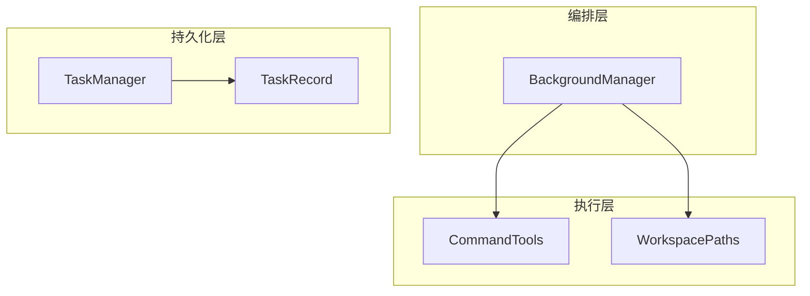
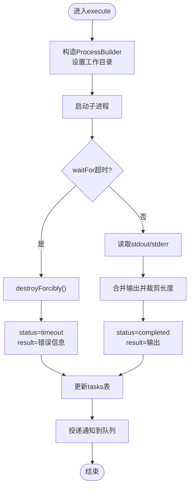
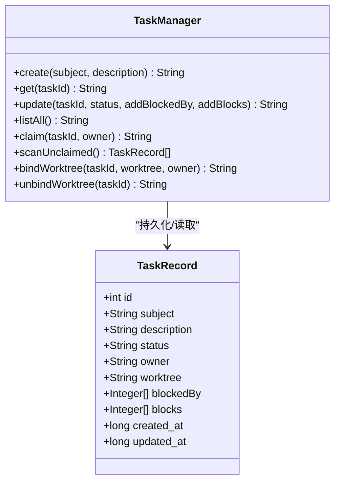
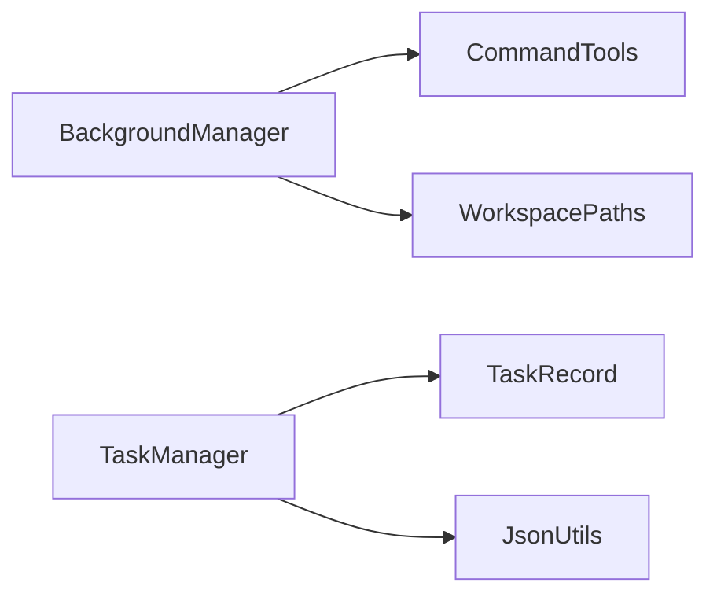

# 后台任务系统

<cite>
**本文引用的文件**
- [BackgroundManager.java](file://src/main/java/com/learnclaudecode/background/BackgroundManager.java)
- [CommandTools.java](file://src/main/java/com/learnclaudecode/tools/CommandTools.java)
- [WorkspacePaths.java](file://src/main/java/com/learnclaudecode/common/WorkspacePaths.java)
- [TaskManager.java](file://src/main/java/com/learnclaudecode/tasks/TaskManager.java)
- [TaskRecord.java](file://src/main/java/com/learnclaudecode/model/TaskRecord.java)
- [JsonUtils.java](file://src/main/java/com/learnclaudecode/common/JsonUtils.java)
- [S08BackgroundTasks.java](file://src/main/java/com/learnclaudecode/agents/S08BackgroundTasks.java)
</cite>

## 目录
1. [简介](#简介)
2. [项目结构](#项目结构)
3. [核心组件](#核心组件)
4. [架构总览](#架构总览)
5. [详细组件分析](#详细组件分析)
6. [依赖关系分析](#依赖关系分析)
7. [性能与资源管理](#性能与资源管理)
8. [故障排查指南](#故障排查指南)
9. [结论](#结论)
10. [附录：使用示例](#附录使用示例)

## 简介
本文件围绕后台任务系统的异步执行机制与任务调度策略展开，重点解释 BackgroundManager 的任务提交、状态监控、结果回调与异常处理；阐述任务生命周期（排队、执行、完成通知）；并提供可操作的使用示例（任务定义、参数传递、结果获取），以及性能调优与资源管理最佳实践。

## 项目结构
后台任务系统由“命令执行层”“任务编排层”“持久化任务板”三部分构成：
- 命令执行层：CommandTools 负责构造跨平台 shell 命令并安全执行，提供超时控制与输出裁剪。
- 任务编排层：BackgroundManager 负责后台任务的异步提交、进程生命周期管理、状态跟踪与通知分发。
- 持久化任务板：TaskManager + TaskRecord 提供基于文件的任务看板，支持创建、认领、依赖管理与工作区隔离绑定。

图表来源
- [BackgroundManager.java:20-52](file://src/main/java/com/learnclaudecode/background/BackgroundManager.java#L20-L52)
- [CommandTools.java:16-78](file://src/main/java/com/learnclaudecode/tools/CommandTools.java#L16-L78)
- [WorkspacePaths.java:11-34](file://src/main/java/com/learnclaudecode/common/WorkspacePaths.java#L11-L34)
- [TaskManager.java:27-61](file://src/main/java/com/learnclaudecode/tasks/TaskManager.java#L27-L61)
- [TaskRecord.java:9-61](file://src/main/java/com/learnclaudecode/model/TaskRecord.java#L9-L61)

章节来源
- [BackgroundManager.java:20-159](file://src/main/java/com/learnclaudecode/background/BackgroundManager.java#L20-L159)
- [CommandTools.java:16-146](file://src/main/java/com/learnclaudecode/tools/CommandTools.java#L16-L146)
- [WorkspacePaths.java:11-150](file://src/main/java/com/learnclaudecode/common/WorkspacePaths.java#L11-L150)
- [TaskManager.java:27-338](file://src/main/java/com/learnclaudecode/tasks/TaskManager.java#L27-L338)
- [TaskRecord.java:9-61](file://src/main/java/com/learnclaudecode/model/TaskRecord.java#L9-L61)

## 核心组件
- BackgroundManager：后台任务管理器，负责任务提交、进程执行、状态更新与通知队列。
- CommandTools：命令工具，封装跨平台 shell 命令构造、黑名单拦截、超时控制与输出裁剪。
- WorkspacePaths：工作区路径工具，提供安全路径解析与工作区根目录访问。
- TaskManager：文件型任务板，实现任务创建、查询、更新、认领、依赖清理与 worktree 绑定。
- TaskRecord：任务持久化模型，包含任务元数据、状态、依赖与时间戳。
- JsonUtils：JSON 序列化/反序列化工具，统一 Jackson 配置。

章节来源
- [BackgroundManager.java:20-159](file://src/main/java/com/learnclaudecode/background/BackgroundManager.java#L20-L159)
- [CommandTools.java:16-146](file://src/main/java/com/learnclaudecode/tools/CommandTools.java#L16-L146)
- [WorkspacePaths.java:11-150](file://src/main/java/com/learnclaudecode/common/WorkspacePaths.java#L11-L150)
- [TaskManager.java:27-338](file://src/main/java/com/learnclaudecode/tasks/TaskManager.java#L27-L338)
- [TaskRecord.java:9-61](file://src/main/java/com/learnclaudecode/model/TaskRecord.java#L9-L61)
- [JsonUtils.java:12-83](file://src/main/java/com/learnclaudecode/common/JsonUtils.java#L12-L83)

## 架构总览
后台任务系统采用“异步执行 + 通知拉取”的解耦模式：
- 提交阶段：调用 run(command, timeoutSeconds) 立即返回 taskId，不阻塞主线程。
- 执行阶段：在独立线程中通过 ProcessBuilder 启动子进程，限制工作目录为工作区根，按超时等待并收集 stdout/stderr。
- 完成阶段：将完整结果写入任务表，同时向通知队列投递摘要通知。
- 消费阶段：上层周期性 drain() 拉取通知，或 check(taskId) 查询具体任务详情。

```mermaid
sequenceDiagram
participant Caller as "调用方"
participant BM as "BackgroundManager"
participant CT as "CommandTools"
participant OS as "操作系统进程"
participant Q as "通知队列"
Caller->>BM : run(command, timeout)
BM-->>Caller : 返回taskId
BM->>BM : 记录任务状态=running
BM->>CT : shellCommand(command)
CT-->>BM : 命令数组
BM->>OS : 启动子进程(工作目录=workdir)
OS-->>BM : 执行中...
alt 超时
BM->>OS : destroyForcibly()
BM->>Q : 推送{task_id,status="timeout",result}
else 正常结束
BM->>OS : 读取stdout/stderr
BM->>Q : 推送{task_id,status="completed",result}
end
Note over BM,Q : 完成后更新tasks表与通知队列
```

图表来源
- [BackgroundManager.java:43-123](file://src/main/java/com/learnclaudecode/background/BackgroundManager.java#L43-L123)
- [CommandTools.java:73-78](file://src/main/java/com/learnclaudecode/tools/CommandTools.java#L73-L78)

## 详细组件分析

### BackgroundManager：异步任务编排器
- 任务提交
  - 生成短任务 ID，初始化任务状态为 running，并立即返回。
  - 每个任务使用独立单线程执行，避免共享线程池竞争。
- 执行流程
  - 通过 CommandTools.shellCommand 构造跨平台命令。
  - 强制设置工作目录为工作区根，避免相对路径歧义。
  - 使用 waitFor(timeout, SECONDS) 控制最长运行时间，超时则强制销毁进程。
  - 合并 stdout 与 stderr 作为最终结果，空输出时返回占位文本。
- 状态与通知
  - 完成后更新 tasks 表（完整结果，长度上限保护）。
  - 向 notifications 队列投递摘要通知（较短结果，便于快速消费）。
- 查询与消费
  - check(taskId)：查询单个或全部任务状态。
  - drain()：批量取出通知队列中的消息。

图表来源
- [BackgroundManager.java:68-123](file://src/main/java/com/learnclaudecode/background/BackgroundManager.java#L68-L123)

章节来源
- [BackgroundManager.java:20-159](file://src/main/java/com/learnclaudecode/background/BackgroundManager.java#L20-L159)

### CommandTools：命令执行与安全
- 跨平台命令构造：根据操作系统选择 powershell 或 bash -lc。
- 危险命令拦截：内置黑名单，阻止高危指令。
- 超时与输出裁剪：默认 120 秒超时，输出最大 50000 字符。
- 文件读写：在工作区内安全读写，支持行数限制与精确替换。

章节来源
- [CommandTools.java:16-146](file://src/main/java/com/learnclaudecode/tools/CommandTools.java#L16-L146)

### WorkspacePaths：工作区路径安全
- 规范化工作目录，防止路径逃逸。
- 提供 tasksDir、teamDir、inboxDir、skillsDir、transcriptDir、worktreesDir 等常用目录访问。
- 统一 readText/writeText 接口，确保路径安全与编码一致。

章节来源
- [WorkspacePaths.java:11-150](file://src/main/java/com/learnclaudecode/common/WorkspacePaths.java#L11-L150)

### TaskManager：文件型任务板
- 任务生命周期
  - 创建：生成唯一 ID，初始状态 pending，落盘 JSON。
  - 认领：owner 非空且状态推进为 in_progress。
  - 更新：支持状态变更、依赖追加、删除（deleted 直接删除文件）。
  - 扫描：scanUnclaimed 返回可立即认领的任务（pending、无 owner、无 blockedBy）。
- 依赖管理
  - blockedBy/blocks 双向维护，任务 completed 时自动清理下游依赖。
- 工作区隔离
  - bindWorktree/unbindWorktree 将任务与 worktree 关联，便于多任务并行隔离。

图表来源
- [TaskRecord.java:9-61](file://src/main/java/com/learnclaudecode/model/TaskRecord.java#L9-L61)
- [TaskManager.java:27-338](file://src/main/java/com/learnclaudecode/tasks/TaskManager.java#L27-L338)

章节来源
- [TaskManager.java:27-338](file://src/main/java/com/learnclaudecode/tasks/TaskManager.java#L27-L338)
- [TaskRecord.java:9-61](file://src/main/java/com/learnclaudecode/model/TaskRecord.java#L9-L61)

### S08BackgroundTasks：入口示例
- 通过 Launcher.launch(StageConfig.s08()) 启动 s08 场景，演示后台任务能力。

章节来源
- [S08BackgroundTasks.java:1-13](file://src/main/java/com/learnclaudecode/agents/S08BackgroundTasks.java#L1-L13)

## 依赖关系分析
- BackgroundManager 依赖 CommandTools 与 WorkspacePaths，用于命令构造与工作区路径安全。
- TaskManager 依赖 TaskRecord 与 JsonUtils，实现任务持久化与序列化。
- 各模块职责清晰，耦合度低，便于扩展与测试。

图表来源
- [BackgroundManager.java:20-34](file://src/main/java/com/learnclaudecode/background/BackgroundManager.java#L20-L34)
- [TaskManager.java:27-61](file://src/main/java/com/learnclaudecode/tasks/TaskManager.java#L27-L61)
- [JsonUtils.java:12-83](file://src/main/java/com/learnclaudecode/common/JsonUtils.java#L12-L83)

章节来源
- [BackgroundManager.java:20-159](file://src/main/java/com/learnclaudecode/background/BackgroundManager.java#L20-L159)
- [TaskManager.java:27-338](file://src/main/java/com/learnclaudecode/tasks/TaskManager.java#L27-L338)

## 性能与资源管理
- 线程模型
  - 当前实现为每个任务分配一个独立单线程执行器，简单可靠但不可控并发。建议在生产环境替换为有界线程池（如 ThreadPoolExecutor），配合任务优先级队列与拒绝策略，避免资源耗尽。
- 进程管理
  - 所有子进程固定在工作区根目录执行，降低路径风险；超时后强制销毁，避免僵尸进程。
  - 建议增加进程级资源限制（如 ulimit/cgroups 或容器化），限制 CPU/内存/IO 使用。
- I/O 与缓冲
  - 输出统一裁剪至 50000 字符，通知摘要裁剪至 500 字符，减少内存占用与传输开销。
  - 对大输出场景，建议分块读取与流式处理，避免一次性加载到内存。
- 任务队列
  - 通知队列使用 LinkedBlockingQueue，drainTo 批量消费，适合高吞吐拉取。
  - 若存在大量长任务，建议引入持久化队列（如磁盘或消息中间件）以支持重启恢复。
- 任务板
  - 文件型任务板简单直观，适合中小规模；大规模场景建议迁移至数据库或键值存储，提升查询与并发性能。
- 安全
  - 命令黑名单与路径安全校验为基础防护；生产环境建议引入白名单命令集与沙箱执行环境。

[本节为通用指导，不直接分析具体文件]

## 故障排查指南
- 任务未开始或无响应
  - 检查 run 是否返回了 taskId；确认 execute 是否被提交到线程执行。
  - 查看 check(taskId) 的状态是否为 running；若长时间无变化，可能进程卡死或被系统回收。
- 超时与终止
  - 若出现 timeout，说明 waitFor 超时；检查命令逻辑是否存在死循环或外部依赖缓慢。
  - 可通过增大 timeoutSeconds 或优化命令逻辑解决。
- 权限与路径问题
  - 工作目录固定为 workdir，若命令依赖相对路径，请确保命令内部 cd 到目标目录。
  - 使用 WorkspacePaths.safeResolve 进行路径校验，避免越权访问。
- 输出为空
  - 空输出会显示占位文本；如需区分“无输出”和“执行失败”，可在命令中显式输出错误码或日志。
- 任务板状态不一致
  - 文件任务板依赖文件系统原子性；在高并发下可能出现竞态。建议加锁或迁移到数据库。
  - 依赖清理在 completed 时触发，若上游任务未正确标记完成，下游可能被长期阻塞。

章节来源
- [BackgroundManager.java:68-123](file://src/main/java/com/learnclaudecode/background/BackgroundManager.java#L68-L123)
- [CommandTools.java:36-78](file://src/main/java/com/learnclaudecode/tools/CommandTools.java#L36-L78)
- [TaskManager.java:84-133](file://src/main/java/com/learnclaudecode/tasks/TaskManager.java#L84-L133)

## 结论
该后台任务系统以 BackgroundManager 为核心，实现了“提交即返回”的异步执行模型，结合 CommandTools 的安全命令执行与 WorkspacePaths 的路径安全，形成稳定的后台任务编排能力。TaskManager 提供了轻量级的任务看板与依赖管理，适用于教学与小规模协作场景。面向生产环境，建议在并发控制、资源限制、持久化与可观测性方面进一步增强。

[本节为总结性内容，不直接分析具体文件]

## 附录：使用示例
以下示例展示如何定义任务、传递参数、获取结果与监控状态。为避免泄露实现细节，仅给出调用路径与行为说明。

- 启动后台任务
  - 调用 BackgroundManager.run(command, timeoutSeconds)，传入命令字符串与超时秒数。
  - 立即返回包含 taskId 的提示，表示任务已入队并开始执行。
  - 参考路径：[BackgroundManager.run:43-52](file://src/main/java/com/learnclaudecode/background/BackgroundManager.java#L43-L52)

- 查询任务状态
  - 使用 BackgroundManager.check(taskId) 获取指定任务的状态与结果摘要。
  - 若不传 taskId，则列出所有任务及其状态。
  - 参考路径：[BackgroundManager.check:131-147](file://src/main/java/com/learnclaudecode/background/BackgroundManager.java#L131-L147)

- 拉取通知
  - 周期性调用 BackgroundManager.drain() 获取通知队列中的摘要消息。
  - 通知包含 task_id、status 与截断后的 result。
  - 参考路径：[BackgroundManager.drain:154-158](file://src/main/java/com/learnclaudecode/background/BackgroundManager.java#L154-L158)

- 任务定义与参数传递
  - 命令字符串即为任务输入，可包含参数与环境变量；例如构建脚本、数据处理命令等。
  - 工作目录固定为工作区根，必要时在命令内切换目录。
  - 参考路径：[BackgroundManager.execute:68-123](file://src/main/java/com/learnclaudecode/background/BackgroundManager.java#L68-L123)

- 结果获取
  - 通过 check(taskId) 获取完整结果，或通过 drain() 获取摘要通知。
  - 结果包含 stdout 与 stderr 的合并输出，空输出时返回占位文本。
  - 参考路径：[BackgroundManager.execute:90-102](file://src/main/java/com/learnclaudecode/background/BackgroundManager.java#L90-L102)

- 任务板协作
  - 使用 TaskManager.create 创建任务，TaskManager.claim 认领任务，TaskManager.update 更新状态与依赖。
  - 通过 TaskManager.scanUnclaimed 发现可立即执行的任务。
  - 参考路径：[TaskManager.create:51-61](file://src/main/java/com/learnclaudecode/tasks/TaskManager.java#L51-L61)、[TaskManager.claim:168-175](file://src/main/java/com/learnclaudecode/tasks/TaskManager.java#L168-L175)、[TaskManager.scanUnclaimed:187-197](file://src/main/java/com/learnclaudecode/tasks/TaskManager.java#L187-L197)

章节来源
- [BackgroundManager.java:43-158](file://src/main/java/com/learnclaudecode/background/BackgroundManager.java#L43-L158)
- [TaskManager.java:51-197](file://src/main/java/com/learnclaudecode/tasks/TaskManager.java#L51-L197)