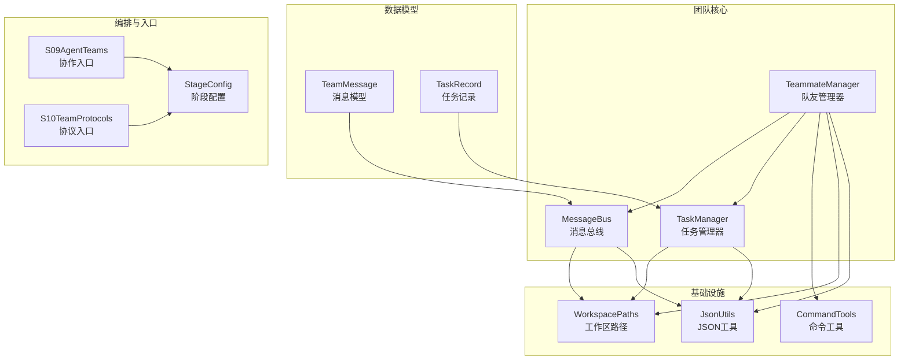
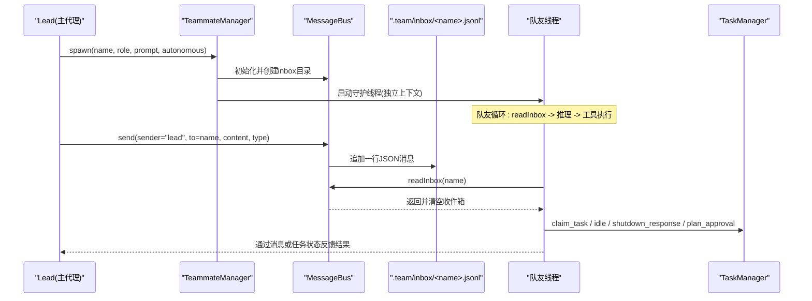
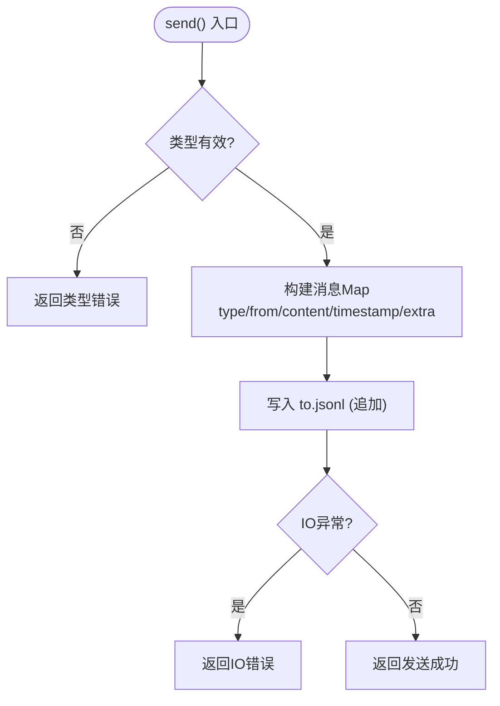
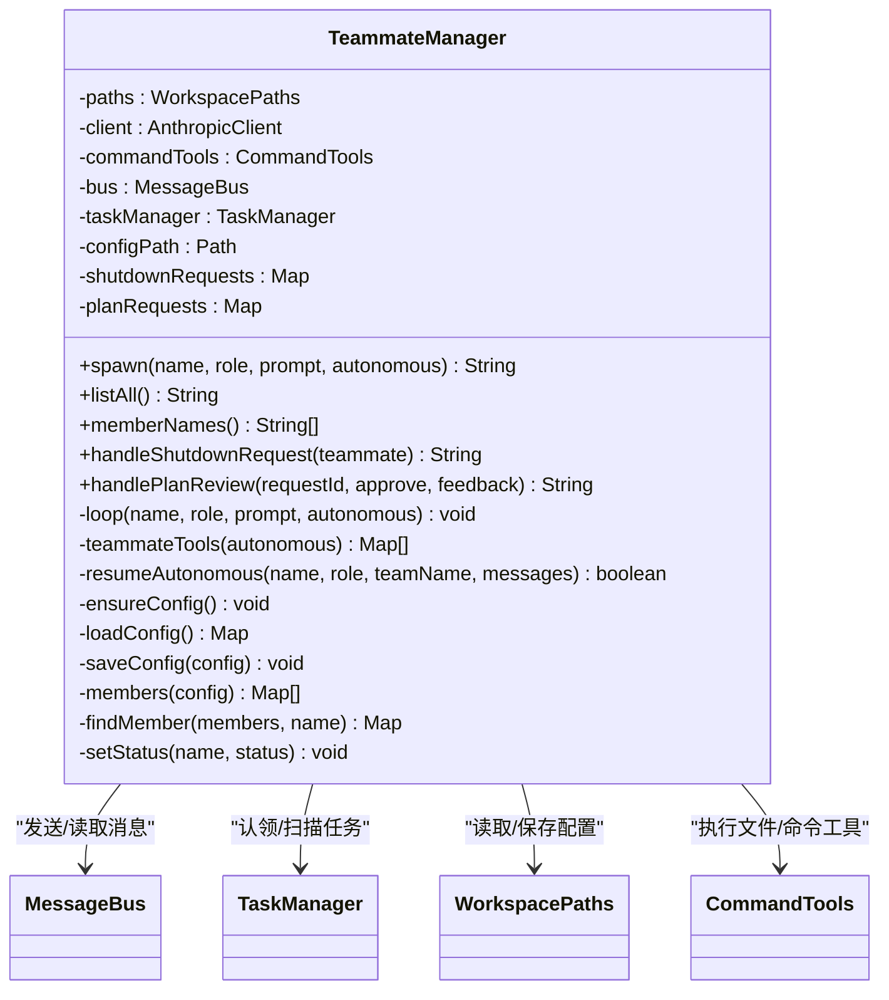
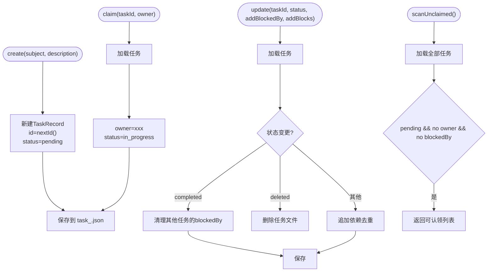
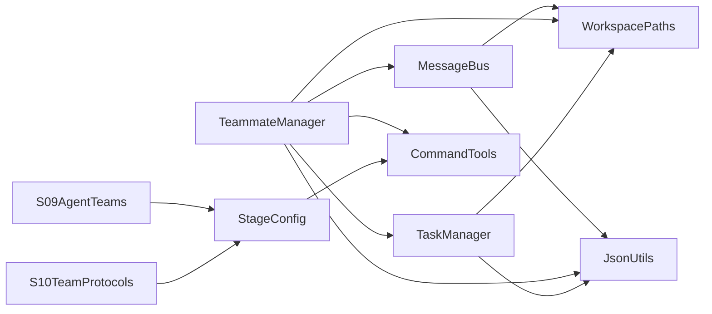

# 团队协作系统

<cite>
**本文引用的文件**
- [MessageBus.java](file://src/main/java/com/learnclaudecode/team/MessageBus.java)
- [TeammateManager.java](file://src/main/java/com/learnclaudecode/team/TeammateManager.java)
- [TeamMessage.java](file://src/main/java/com/learnclaudecode/model/TeamMessage.java)
- [TaskManager.java](file://src/main/java/com/learnclaudecode/tasks/TaskManager.java)
- [StageConfig.java](file://src/main/java/com/learnclaudecode/agents/StageConfig.java)
- [WorkspacePaths.java](file://src/main/java/com/learnclaudecode/common/WorkspacePaths.java)
- [JsonUtils.java](file://src/main/java/com/learnclaudecode/common/JsonUtils.java)
- [CommandTools.java](file://src/main/java/com/learnclaudecode/tools/CommandTools.java)
- [S09AgentTeams.java](file://src/main/java/com/learnclaudecode/agents/S09AgentTeams.java)
- [S10TeamProtocols.java](file://src/main/java/com/learnclaudecode/agents/S10TeamProtocols.java)
</cite>

## 目录
1. [简介](#简介)
2. [项目结构](#项目结构)
3. [核心组件](#核心组件)
4. [架构总览](#架构总览)
5. [详细组件分析](#详细组件分析)
6. [依赖关系分析](#依赖关系分析)
7. [性能与可扩展性](#性能与可扩展性)
8. [故障排查指南](#故障排查指南)
9. [结论](#结论)
10. [附录：使用示例与协议规范](#附录使用示例与协议规范)

## 简介
本文档面向团队协作系统的开发者与使用者，系统性说明多代理通信机制与事件驱动架构。重点覆盖：
- MessageBus 的消息传递机制（消息路由、订阅模式、事件分发）
- TeammateManager 的团队成员管理（成员注册、角色权限、生命周期管理）
- TeamMessage 的数据结构与通信协议
- 团队协作的使用示例（代理间通信、消息格式规范、错误处理策略）

该系统以“文件系统即协作层”为核心思想，通过 .team/inbox/*.jsonl 实现最小依赖的多 Agent 通信；通过任务板与共享配置实现团队编排；通过工具集控制不同角色的能力边界。

## 项目结构
围绕团队协作的关键代码位于 team、model、tasks、agents、common、tools 等包中：
- team：消息总线与队友管理器
- model：消息模型与任务记录
- tasks：任务板与任务状态流转
- agents：阶段配置与入口脚本
- common：路径工具与 JSON 序列化
- tools：基础命令与文件操作工具

图表来源
- [MessageBus.java:16-123](file://src/main/java/com/learnclaudecode/team/MessageBus.java#L16-L123)
- [TeammateManager.java:24-438](file://src/main/java/com/learnclaudecode/team/TeammateManager.java#L24-L438)
- [TaskManager.java:17-338](file://src/main/java/com/learnclaudecode/tasks/TaskManager.java#L17-L338)
- [TeamMessage.java:6-35](file://src/main/java/com/learnclaudecode/model/TeamMessage.java#L6-L35)
- [WorkspacePaths.java:8-150](file://src/main/java/com/learnclaudecode/common/WorkspacePaths.java#L8-L150)
- [JsonUtils.java:9-83](file://src/main/java/com/learnclaudecode/common/JsonUtils.java#L9-L83)
- [CommandTools.java:13-146](file://src/main/java/com/learnclaudecode/tools/CommandTools.java#L13-L146)
- [StageConfig.java:11-301](file://src/main/java/com/learnclaudecode/agents/StageConfig.java#L11-L301)
- [S09AgentTeams.java:1-13](file://src/main/java/com/learnclaudecode/agents/S09AgentTeams.java#L1-L13)
- [S10TeamProtocols.java:1-13](file://src/main/java/com/learnclaudecode/agents/S10TeamProtocols.java#L1-L13)

章节来源
- [MessageBus.java:16-123](file://src/main/java/com/learnclaudecode/team/MessageBus.java#L16-L123)
- [TeammateManager.java:24-438](file://src/main/java/com/learnclaudecode/team/TeammateManager.java#L24-L438)
- [TaskManager.java:17-338](file://src/main/java/com/learnclaudecode/tasks/TaskManager.java#L17-L338)
- [TeamMessage.java:6-35](file://src/main/java/com/learnclaudecode/model/TeamMessage.java#L6-L35)
- [WorkspacePaths.java:8-150](file://src/main/java/com/learnclaudecode/common/WorkspacePaths.java#L8-L150)
- [JsonUtils.java:9-83](file://src/main/java/com/learnclaudecode/common/JsonUtils.java#L9-L83)
- [CommandTools.java:13-146](file://src/main/java/com/learnclaudecode/tools/CommandTools.java#L13-L146)
- [StageConfig.java:11-301](file://src/main/java/com/learnclaudecode/agents/StageConfig.java#L11-L301)
- [S09AgentTeams.java:1-13](file://src/main/java/com/learnclaudecode/agents/S09AgentTeams.java#L1-L13)
- [S10TeamProtocols.java:1-13](file://src/main/java/com/learnclaudecode/agents/S10TeamProtocols.java#L1-L13)

## 核心组件
- MessageBus：基于文件系统的消息总线，提供点对点发送、广播、收件箱读取与清空，支持多种消息类型。
- TeammateManager：负责创建与管理队友线程、维护团队配置、协调消息与任务、处理关闭请求与计划审批。
- TaskManager：文件型任务板，支持任务创建、认领、状态更新、依赖管理与 worktree 绑定。
- TeamMessage：消息数据结构，包含类型、发送者、内容、时间戳与扩展字段。
- StageConfig：阶段化能力开关与工具集定义，决定 lead 与队友可用的工具集合。
- WorkspacePaths：安全路径解析与工作区子目录访问（.team/inbox、.tasks 等）。
- JsonUtils：统一的 JSON 序列化/反序列化。
- CommandTools：安全的 shell 执行与文件读写编辑工具。

章节来源
- [MessageBus.java:16-123](file://src/main/java/com/learnclaudecode/team/MessageBus.java#L16-L123)
- [TeammateManager.java:24-438](file://src/main/java/com/learnclaudecode/team/TeammateManager.java#L24-L438)
- [TaskManager.java:17-338](file://src/main/java/com/learnclaudecode/tasks/TaskManager.java#L17-L338)
- [TeamMessage.java:6-35](file://src/main/java/com/learnclaudecode/model/TeamMessage.java#L6-L35)
- [StageConfig.java:11-301](file://src/main/java/com/learnclaudecode/agents/StageConfig.java#L11-L301)
- [WorkspacePaths.java:8-150](file://src/main/java/com/learnclaudecode/common/WorkspacePaths.java#L8-L150)
- [JsonUtils.java:9-83](file://src/main/java/com/learnclaudecode/common/JsonUtils.java#L9-L83)
- [CommandTools.java:13-146](file://src/main/java/com/learnclaudecode/tools/CommandTools.java#L13-L146)

## 架构总览
系统采用“事件驱动 + 文件持久化”的轻量协作架构：
- 消息总线将消息写入每个队友的 inbox.jsonl 文件，实现解耦的点对点与广播通信。
- 队友线程在独立守护线程中运行，循环消费收件箱、调用模型推理、执化工具（包括 send_message、read_inbox、claim_task、idle、shutdown_response、plan_approval 等）。
- 任务板作为共享工作池，支持自治队友在空闲时自动认领无阻塞任务。
- 通过 StageConfig 为 lead 和队友分别暴露不同的工具集，形成清晰的职责分离。

图表来源
- [TeammateManager.java:81-105](file://src/main/java/com/learnclaudecode/team/TeammateManager.java#L81-L105)
- [TeammateManager.java:177-273](file://src/main/java/com/learnclaudecode/team/TeammateManager.java#L177-L273)
- [MessageBus.java:54-121](file://src/main/java/com/learnclaudecode/team/MessageBus.java#L54-L121)
- [TaskManager.java:168-197](file://src/main/java/com/learnclaudecode/tasks/TaskManager.java#L168-L197)

## 详细组件分析

### MessageBus：消息总线
- 消息类型白名单：message、broadcast、shutdown_request、shutdown_response、plan_approval_response。
- 发送流程：校验类型 -> 构造消息体（type/from/content/timestamp/extra）-> 写入 to.jsonl（追加模式）-> 返回结果。
- 读取流程：读取 name.jsonl -> 立即清空 -> 逐行反序列化为 Map -> 返回列表。
- 广播：遍历目标列表，向除发送者外的所有队友发送 broadcast 类型消息。
- 错误处理：无效类型直接返回错误；IO异常封装为错误消息返回。

图表来源
- [MessageBus.java:54-75](file://src/main/java/com/learnclaudecode/team/MessageBus.java#L54-L75)
- [MessageBus.java:83-102](file://src/main/java/com/learnclaudecode/team/MessageBus.java#L83-L102)
- [MessageBus.java:112-121](file://src/main/java/com/learnclaudecode/team/MessageBus.java#L112-L121)

章节来源
- [MessageBus.java:16-123](file://src/main/java/com/learnclaudecode/team/MessageBus.java#L16-L123)

### TeammateManager：队友管理器
- 成员注册与生命周期：
  - spawn：检查/更新成员配置，设置状态为 working，启动守护线程执行 loop。
  - listAll/memberNames：读取团队配置，输出成员列表与名称。
  - setStatus：更新成员状态与更新时间，持久化到 config.json。
- 工具集与角色权限：
  - teammateTools：基础工具 + 通信工具（send_message、read_inbox），自治模式下额外开放 claim_task、idle；非自治模式开放 shutdown_response、plan_approval。
- 事件驱动循环：
  - 先消费收件箱消息，再调用模型推理，根据 stop_reason 决定是否继续。
  - 工具执行分支：bash/read_file/write_file/edit_file/send_message/read_inbox/claim_task/idle/shutdown_response/plan_approval。
  - 自治恢复：空闲时轮询收件箱或扫描未认领任务，自动恢复工作。
- 协议交互：
  - handleShutdownRequest：生成 request_id，发送 shutdown_request，等待 shutdown_response 回传批准/拒绝。
  - handlePlanReview：接收 plan_approval_response，更新状态并通过消息通知发送方。

图表来源
- [TeammateManager.java:39-438](file://src/main/java/com/learnclaudecode/team/TeammateManager.java#L39-L438)

章节来源
- [TeammateManager.java:81-105](file://src/main/java/com/learnclaudecode/team/TeammateManager.java#L81-L105)
- [TeammateManager.java:177-273](file://src/main/java/com/learnclaudecode/team/TeammateManager.java#L177-L273)
- [TeammateManager.java:281-310](file://src/main/java/com/learnclaudecode/team/TeammateManager.java#L281-L310)
- [TeammateManager.java:321-356](file://src/main/java/com/learnclaudecode/team/TeammateManager.java#L321-L356)
- [TeammateManager.java:361-438](file://src/main/java/com/learnclaudecode/team/TeammateManager.java#L361-L438)

### TaskManager：任务板
- 任务生命周期：创建（pending）、认领（in_progress）、完成（completed）、删除（deleted）。
- 依赖管理：blockedBy/blocks 双向依赖，完成任务后自动清理相关依赖。
- 扫描与认领：scanUnclaimed 返回可立即认领的任务（pending、无owner、无阻塞）。
- Worktree 绑定：bindWorktree/unbindWorktree 将任务与隔离工作目录关联。

图表来源
- [TaskManager.java:51-61](file://src/main/java/com/learnclaudecode/tasks/TaskManager.java#L51-L61)
- [TaskManager.java:84-133](file://src/main/java/com/learnclaudecode/tasks/TaskManager.java#L84-L133)
- [TaskManager.java:168-197](file://src/main/java/com/learnclaudecode/tasks/TaskManager.java#L168-L197)
- [TaskManager.java:215-249](file://src/main/java/com/learnclaudecode/tasks/TaskManager.java#L215-L249)
- [TaskManager.java:276-338](file://src/main/java/com/learnclaudecode/tasks/TaskManager.java#L276-L338)

章节来源
- [TaskManager.java:17-338](file://src/main/java/com/learnclaudecode/tasks/TaskManager.java#L17-L338)

### TeamMessage：消息模型
- 字段：
  - type：消息类型（message、broadcast、shutdown_request、shutdown_response、plan_approval_response）
  - from：发送者标识
  - content：消息正文
  - timestamp：Unix 时间戳
  - extra：扩展字段（Map<String, Object>）
- 用途：统一描述跨代理通信的数据结构，配合 MessageBus 进行序列化与传输。

章节来源
- [TeamMessage.java:6-35](file://src/main/java/com/learnclaudecode/model/TeamMessage.java#L6-L35)

### StageConfig：阶段配置与工具集
- baseTools：基础文件与命令工具（bash、read_file、write_file、edit_file）。
- s09/s10/s11/s12：逐步开启团队协作、协议、自治与 worktree 隔离能力。
- systemPrompt：动态注入工作区路径与技能描述。
- 工具去重：合并多阶段工具时按名称去重，保留最后一次定义。

章节来源
- [StageConfig.java:11-301](file://src/main/java/com/learnclaudecode/agents/StageConfig.java#L11-L301)

### WorkspacePaths：工作区路径工具
- 安全解析：safeResolve 防止路径逃逸出工作区。
- 常用目录：workdir、tasksDir、teamDir、inboxDir、skillsDir、transcriptDir、worktreesDir。
- 文本读写：readText/writeText 统一编码与目录创建。

章节来源
- [WorkspacePaths.java:8-150](file://src/main/java/com/learnclaudecode/common/WorkspacePaths.java#L8-L150)

### JsonUtils：JSON 工具
- 统一 ObjectMapper 配置（JavaTimeModule、禁用日期时间戳）。
- toJson/toPrettyJson/fromJson 提供紧凑与格式化序列化。

章节来源
- [JsonUtils.java:9-83](file://src/main/java/com/learnclaudecode/common/JsonUtils.java#L9-L83)

### CommandTools：命令与文件工具
- runBash：黑名单拦截危险命令，限制超时，捕获 stdout/stderr。
- runRead/runWrite/runEdit：安全路径下读取、写入与精确替换。

章节来源
- [CommandTools.java:13-146](file://src/main/java/com/learnclaudecode/tools/CommandTools.java#L13-L146)

## 依赖关系分析
- 松耦合：MessageBus 仅依赖 WorkspacePaths 与 JsonUtils，不感知业务逻辑；TeammateManager 组合多个子系统，但通过接口方法调用，降低耦合。
- 文件即状态：消息与任务均以文件形式持久化，便于多进程/多代理共享与重启恢复。
- 工具集分层：StageConfig 为不同角色（lead/teammate）提供差异化能力，避免越权。

图表来源
- [MessageBus.java:16-123](file://src/main/java/com/learnclaudecode/team/MessageBus.java#L16-L123)
- [TeammateManager.java:24-438](file://src/main/java/com/learnclaudecode/team/TeammateManager.java#L24-L438)
- [TaskManager.java:17-338](file://src/main/java/com/learnclaudecode/tasks/TaskManager.java#L17-L338)
- [StageConfig.java:11-301](file://src/main/java/com/learnclaudecode/agents/StageConfig.java#L11-L301)
- [S09AgentTeams.java:1-13](file://src/main/java/com/learnclaudecode/agents/S09AgentTeams.java#L1-L13)
- [S10TeamProtocols.java:1-13](file://src/main/java/com/learnclaudecode/agents/S10TeamProtocols.java#L1-L13)

章节来源
- [MessageBus.java:16-123](file://src/main/java/com/learnclaudecode/team/MessageBus.java#L16-L123)
- [TeammateManager.java:24-438](file://src/main/java/com/learnclaudecode/team/TeammateManager.java#L24-L438)
- [TaskManager.java:17-338](file://src/main/java/com/learnclaudecode/tasks/TaskManager.java#L17-L338)
- [StageConfig.java:11-301](file://src/main/java/com/learnclaudecode/agents/StageConfig.java#L11-L301)

## 性能与可扩展性
- 文件 I/O 开销：每条消息写入一行 JSON，读后即清空，适合中小规模协作；高并发场景建议增加锁粒度优化或引入内存队列缓冲。
- 线程模型：队友线程为守护线程，避免阻塞主进程；自治恢复采用轮询间隔，避免空转消耗 CPU。
- 可扩展点：
  - 消息总线可扩展为内存+文件双写，提升吞吐。
  - 任务板可扩展索引或数据库后端，支持复杂查询与历史回溯。
  - 工具集可通过 StageConfig 动态裁剪，适配不同安全等级。

[本节为通用指导，不直接分析具体文件]

## 故障排查指南
- 消息类型错误：MessageBus.send 对非法类型直接返回错误，检查 msg_type 是否在 VALID_TYPES 中。
- 收件箱为空：readInbox 若文件不存在返回空列表；确认发送方是否正确写入 to.jsonl。
- 任务找不到：TaskManager.load 抛出异常提示任务不存在；检查任务 ID 与文件命名规则。
- 命令执行失败：runBash 可能因超时或 IO 异常返回错误；检查命令是否被黑名单拦截或工作区路径是否正确。
- 配置读写失败：TeammateManager 在 load/save 配置时抛异常；检查工作区权限与 .team/config.json 是否存在。

章节来源
- [MessageBus.java:54-75](file://src/main/java/com/learnclaudecode/team/MessageBus.java#L54-L75)
- [MessageBus.java:83-102](file://src/main/java/com/learnclaudecode/team/MessageBus.java#L83-L102)
- [TaskManager.java:276-286](file://src/main/java/com/learnclaudecode/tasks/TaskManager.java#L276-L286)
- [CommandTools.java:36-65](file://src/main/java/com/learnclaudecode/tools/CommandTools.java#L36-L65)
- [TeammateManager.java:372-393](file://src/main/java/com/learnclaudecode/team/TeammateManager.java#L372-L393)

## 结论
该团队协作系统以文件系统为协作层，通过 MessageBus 与 TaskManager 实现解耦的消息与任务管理；TeammateManager 统一管理队友生命周期与协议交互；StageConfig 提供灵活的能力编排。整体设计简洁、可观测、易扩展，适合教学与中小型团队协作场景。

[本节为总结，不直接分析具体文件]

## 附录：使用示例与协议规范

### 使用示例
- 启动协作示例：
  - 通过 S09AgentTeams.main 启动多 Agent 协作场景。
  - 通过 S10TeamProtocols.main 启动团队协议场景（关闭请求与计划审批）。
- 典型流程：
  - Lead 调用 spawn 创建队友，分配角色与初始提示。
  - 队友线程循环消费收件箱，调用 send_message 与其他队友通信。
  - 自治队友在空闲时通过 claim_task 自动认领任务，或通过 idle 进入空闲等待新消息。
  - Lead 通过 handleShutdownRequest 优雅关闭队友，通过 handlePlanReview 审批队友计划。

章节来源
- [S09AgentTeams.java:1-13](file://src/main/java/com/learnclaudecode/agents/S09AgentTeams.java#L1-L13)
- [S10TeamProtocols.java:1-13](file://src/main/java/com/learnclaudecode/agents/S10TeamProtocols.java#L1-L13)
- [TeammateManager.java:81-105](file://src/main/java/com/learnclaudecode/team/TeammateManager.java#L81-L105)
- [TeammateManager.java:177-273](file://src/main/java/com/learnclaudecode/team/TeammateManager.java#L177-L273)

### 消息格式规范
- 基本字段：
  - type：消息类型（message、broadcast、shutdown_request、shutdown_response、plan_approval_response）
  - from：发送者名称
  - content：消息正文
  - timestamp：Unix 时间戳
  - extra：扩展字段（如 request_id、approve、feedback 等）
- 存储格式：每行一个 JSON 对象，写入 to.jsonl 文件。
- 路由规则：
  - 点对点：send(sender, to, content, type, extra)
  - 广播：broadcast(sender, content, names)，排除发送者自身

章节来源
- [MessageBus.java:20-26](file://src/main/java/com/learnclaudecode/team/MessageBus.java#L20-L26)
- [MessageBus.java:54-75](file://src/main/java/com/learnclaudecode/team/MessageBus.java#L54-L75)
- [MessageBus.java:112-121](file://src/main/java/com/learnclaudecode/team/MessageBus.java#L112-L121)
- [TeamMessage.java:6-35](file://src/main/java/com/learnclaudecode/model/TeamMessage.java#L6-L35)

### 错误处理策略
- 输入校验：消息类型白名单校验，非法类型直接返回错误。
- IO 异常：文件读写异常封装为错误消息返回，保证调用方可见。
- 任务异常：任务不存在或保存失败抛出异常，调用方需捕获并处理。
- 命令执行：危险命令黑名单拦截，超时强制终止，输出截断避免过大响应。

章节来源
- [MessageBus.java:54-75](file://src/main/java/com/learnclaudecode/team/MessageBus.java#L54-L75)
- [TaskManager.java:276-286](file://src/main/java/com/learnclaudecode/tasks/TaskManager.java#L276-L286)
- [CommandTools.java:36-65](file://src/main/java/com/learnclaudecode/tools/CommandTools.java#L36-L65)