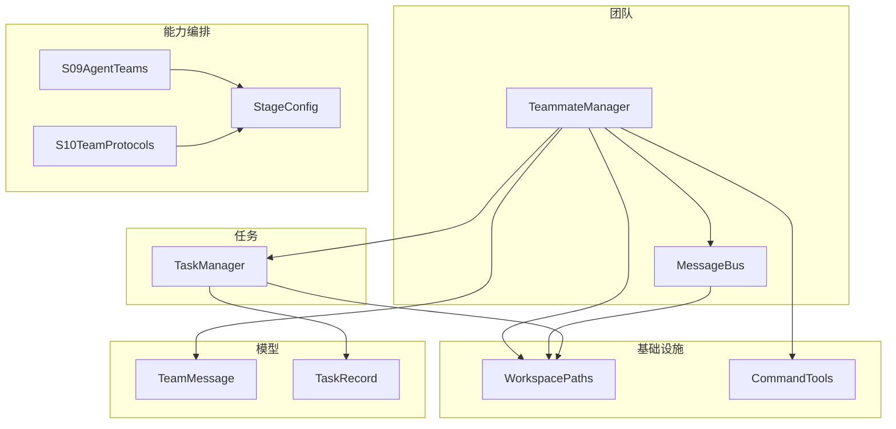
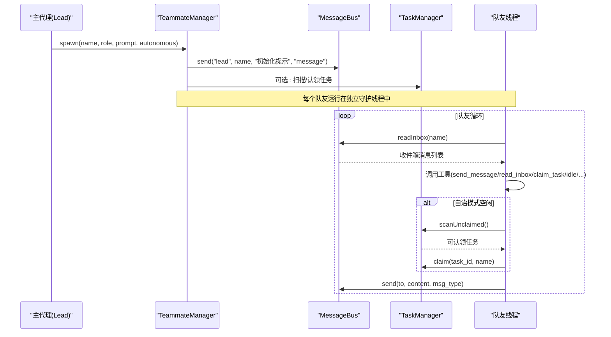
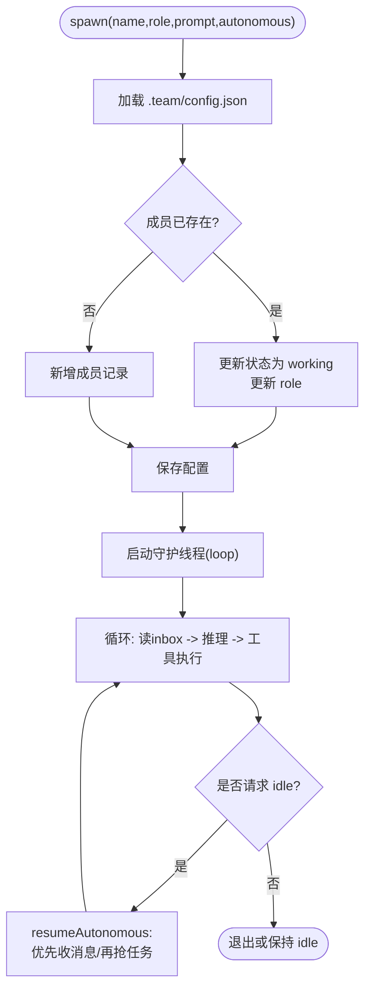
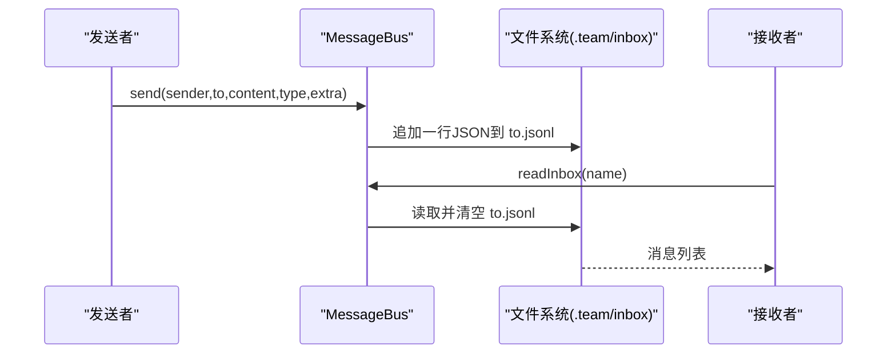
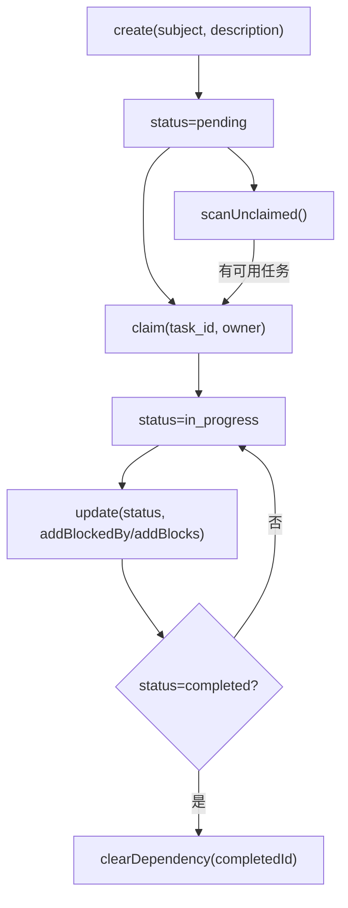
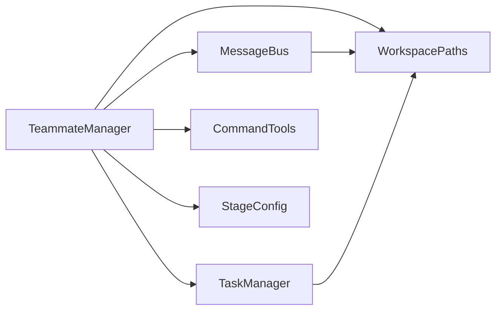

# 团队成员管理

<cite>
**本文引用的文件**
- [TeammateManager.java](file://src/main/java/com/learnclaudecode/team/TeammateManager.java)
- [MessageBus.java](file://src/main/java/com/learnclaudecode/team/MessageBus.java)
- [TaskManager.java](file://src/main/java/com/learnclaudecode/tasks/TaskManager.java)
- [StageConfig.java](file://src/main/java/com/learnclaudecode/agents/StageConfig.java)
- [S09AgentTeams.java](file://src/main/java/com/learnclaudecode/agents/S09AgentTeams.java)
- [S10TeamProtocols.java](file://src/main/java/com/learnclaudecode/agents/S10TeamProtocols.java)
- [WorkspacePaths.java](file://src/main/java/com/learnclaudecode/common/WorkspacePaths.java)
- [CommandTools.java](file://src/main/java/com/learnclaudecode/tools/CommandTools.java)
- [TeamMessage.java](file://src/main/java/com/learnclaudecode/model/TeamMessage.java)
- [TaskRecord.java](file://src/main/java/com/learnclaudecode/model/TaskRecord.java)
</cite>

## 目录
1. [简介](#简介)
2. [项目结构](#项目结构)
3. [核心组件](#核心组件)
4. [架构总览](#架构总览)
5. [详细组件分析](#详细组件分析)
6. [依赖关系分析](#依赖关系分析)
7. [性能与并发特性](#性能与并发特性)
8. [故障排查指南](#故障排查指南)
9. [结论](#结论)
10. [附录：使用场景与最佳实践](#附录使用场景与最佳实践)

## 简介
本文件面向“团队成员管理系统”，围绕 TeammateManager 的功能与实现，系统阐述团队成员的注册、发现、生命周期管理；成员角色定义、权限控制与通信协议；以及与 MessageBus 的集成方式（消息路由与订阅模式）。同时给出多代理协作、任务分配与状态同步的使用场景，并提供代码级参考路径与最佳实践建议。

## 项目结构
团队相关能力集中在 team、tasks、agents、common、tools、model 等包中：
- team：TeammateManager（队友管理与协调）、MessageBus（基于文件的轻量消息总线）
- tasks：TaskManager（任务板与任务生命周期）
- agents：StageConfig（阶段能力编排）、S09/S10（示例入口）
- common：WorkspacePaths（工作区与安全路径）
- tools：CommandTools（基础命令与文件操作工具）
- model：TeamMessage、TaskRecord（数据模型）

图表来源
- [TeammateManager.java:39-70](file://src/main/java/com/learnclaudecode/team/TeammateManager.java#L39-L70)
- [MessageBus.java:19-42](file://src/main/java/com/learnclaudecode/team/MessageBus.java#L19-L42)
- [TaskManager.java:27-42](file://src/main/java/com/learnclaudecode/tasks/TaskManager.java#L27-L42)
- [StageConfig.java:181-227](file://src/main/java/com/learnclaudecode/agents/StageConfig.java#L181-L227)
- [S09AgentTeams.java:9-11](file://src/main/java/com/learnclaudecode/agents/S09AgentTeams.java#L9-L11)
- [S10TeamProtocols.java:9-11](file://src/main/java/com/learnclaudecode/agents/S10TeamProtocols.java#L9-L11)
- [WorkspacePaths.java:77-113](file://src/main/java/com/learnclaudecode/common/WorkspacePaths.java#L77-L113)
- [CommandTools.java:16-28](file://src/main/java/com/learnclaudecode/tools/CommandTools.java#L16-L28)
- [TeamMessage.java:9-34](file://src/main/java/com/learnclaudecode/model/TeamMessage.java#L9-L34)
- [TaskRecord.java:9-61](file://src/main/java/com/learnclaudecode/model/TaskRecord.java#L9-L61)

章节来源
- [TeammateManager.java:39-70](file://src/main/java/com/learnclaudecode/team/TeammateManager.java#L39-L70)
- [MessageBus.java:19-42](file://src/main/java/com/learnclaudecode/team/MessageBus.java#L19-L42)
- [TaskManager.java:27-42](file://src/main/java/com/learnclaudecode/tasks/TaskManager.java#L27-L42)
- [StageConfig.java:181-227](file://src/main/java/com/learnclaudecode/agents/StageConfig.java#L181-L227)
- [WorkspacePaths.java:77-113](file://src/main/java/com/learnclaudecode/common/WorkspacePaths.java#L77-L113)

## 核心组件
- TeammateManager：负责队友的创建、状态管理、生命周期控制、自治恢复、计划审批与关闭流程协调。
- MessageBus：基于文件系统的最小化消息总线，提供点对点发送、读取消费与广播能力。
- TaskManager：持久化的任务板，支持任务创建、认领、更新、依赖清理与工作树绑定。
- StageConfig：按教学阶段暴露不同能力（工具集），包括 s09/s10/s11 的团队与自治能力。
- WorkspacePaths：统一的工作区路径与安全解析。
- CommandTools：安全的命令执行与文件读写工具。
- TeamMessage/TaskRecord：消息与任务的领域模型。

章节来源
- [TeammateManager.java:39-70](file://src/main/java/com/learnclaudecode/team/TeammateManager.java#L39-L70)
- [MessageBus.java:19-42](file://src/main/java/com/learnclaudecode/team/MessageBus.java#L19-L42)
- [TaskManager.java:27-42](file://src/main/java/com/learnclaudecode/tasks/TaskManager.java#L27-L42)
- [StageConfig.java:181-227](file://src/main/java/com/learnclaudecode/agents/StageConfig.java#L181-L227)
- [WorkspacePaths.java:77-113](file://src/main/java/com/learnclaudecode/common/WorkspacePaths.java#L77-L113)
- [CommandTools.java:16-28](file://src/main/java/com/learnclaudecode/tools/CommandTools.java#L16-L28)
- [TeamMessage.java:9-34](file://src/main/java/com/learnclaudecode/model/TeamMessage.java#L9-L34)
- [TaskRecord.java:9-61](file://src/main/java/com/learnclaudecode/model/TaskRecord.java#L9-L61)

## 架构总览
下图展示了主代理（lead）通过 TeammateManager 创建并协调多个队友线程，借助 MessageBus 进行异步通信，并通过 TaskManager 共享任务板。

图表来源
- [TeammateManager.java:81-105](file://src/main/java/com/learnclaudecode/team/TeammateManager.java#L81-L105)
- [TeammateManager.java:177-273](file://src/main/java/com/learnclaudecode/team/TeammateManager.java#L177-L273)
- [TeammateManager.java:321-356](file://src/main/java/com/learnclaudecode/team/TeammateManager.java#L321-L356)
- [MessageBus.java:54-75](file://src/main/java/com/learnclaudecode/team/MessageBus.java#L54-L75)
- [MessageBus.java:83-102](file://src/main/java/com/learnclaudecode/team/MessageBus.java#L83-L102)
- [TaskManager.java:168-197](file://src/main/java/com/learnclaudecode/tasks/TaskManager.java#L168-L197)

## 详细组件分析

### TeammateManager：成员注册、发现与生命周期
- 成员注册与发现
  - 通过 spawn 创建或复用成员配置，写入 .team/config.json 的成员列表，作为“注册表”。
  - listAll/memberNames 用于发现当前所有成员及其状态。
- 生命周期管理
  - 每个队友以守护线程运行，内部循环持续消费 inbox，调用模型推理与工具。
  - 状态机：working -> idle -> shutdown（或继续工作）。
  - 自治模式下，idle 会尝试从任务板自动认领任务，或在收到新消息时恢复工作。
- 权限与控制
  - 非自治队友需响应 lead 的关闭请求（shutdown_request/shutdown_response）。
  - 自治队友可通过 plan_approval 提交计划给 lead 审批，lead 通过 handlePlanReview 反馈结果。
- 工具集与角色
  - teammateTools 根据是否自治动态注入工具：send_message、read_inbox、claim_task、idle、shutdown_response、plan_approval 等。
  - 角色由 spawn 参数传入，并在 system 提示中体现，用于约束行为。

图表来源
- [TeammateManager.java:81-105](file://src/main/java/com/learnclaudecode/team/TeammateManager.java#L81-L105)
- [TeammateManager.java:177-273](file://src/main/java/com/learnclaudecode/team/TeammateManager.java#L177-L273)
- [TeammateManager.java:321-356](file://src/main/java/com/learnclaudecode/team/TeammateManager.java#L321-L356)

章节来源
- [TeammateManager.java:81-105](file://src/main/java/com/learnclaudecode/team/TeammateManager.java#L81-L105)
- [TeammateManager.java:177-273](file://src/main/java/com/learnclaudecode/team/TeammateManager.java#L177-L273)
- [TeammateManager.java:281-294](file://src/main/java/com/learnclaudecode/team/TeammateManager.java#L281-L294)
- [TeammateManager.java:321-356](file://src/main/java/com/learnclaudecode/team/TeammateManager.java#L321-L356)
- [TeammateManager.java:361-437](file://src/main/java/com/learnclaudecode/team/TeammateManager.java#L361-L437)

### MessageBus：消息路由与订阅模式
- 路由规则
  - 每条消息写入 <workdir>/.team/inbox/<to>.jsonl，实现“按收件人分文件”的路由。
  - 支持类型白名单：message、broadcast、shutdown_request、shutdown_response、plan_approval_response。
- 订阅模式
  - 消费者通过 readInbox(name) 拉取并清空该收件箱，实现“读即消费”的语义。
  - broadcast 向多个目标发送同一条广播消息。
- 扩展字段
  - extra 可用于携带 request_id、approve、reason 等协议元数据。

图表来源
- [MessageBus.java:54-75](file://src/main/java/com/learnclaudecode/team/MessageBus.java#L54-L75)
- [MessageBus.java:83-102](file://src/main/java/com/learnclaudecode/team/MessageBus.java#L83-L102)
- [MessageBus.java:112-121](file://src/main/java/com/learnclaudecode/team/MessageBus.java#L112-L121)
- [WorkspacePaths.java:99-113](file://src/main/java/com/learnclaudecode/common/WorkspacePaths.java#L99-L113)

章节来源
- [MessageBus.java:19-42](file://src/main/java/com/learnclaudecode/team/MessageBus.java#L19-L42)
- [MessageBus.java:54-75](file://src/main/java/com/learnclaudecode/team/MessageBus.java#L54-L75)
- [MessageBus.java:83-102](file://src/main/java/com/learnclaudecode/team/MessageBus.java#L83-L102)
- [MessageBus.java:112-121](file://src/main/java/com/learnclaudecode/team/MessageBus.java#L112-L121)
- [WorkspacePaths.java:99-113](file://src/main/java/com/learnclaudecode/common/WorkspacePaths.java#L99-L113)

### TaskManager：任务分配与状态同步
- 任务生命周期
  - create：新建 pending 任务。
  - claim：认领并推进至 in_progress。
  - update：更新状态、依赖关系；completed 时清理其他任务对其的 blockedBy。
  - listAll/get：看板视图与详情。
  - bindWorktree/unbindWorktree：将任务与隔离工作树关联。
- 自动调度
  - scanUnclaimed：返回可立即认领的任务（pending、无 owner、无阻塞）。
- 并发安全
  - 关键方法均加同步锁，避免并发写覆盖。

图表来源
- [TaskManager.java:51-61](file://src/main/java/com/learnclaudecode/tasks/TaskManager.java#L51-L61)
- [TaskManager.java:84-133](file://src/main/java/com/learnclaudecode/tasks/TaskManager.java#L84-L133)
- [TaskManager.java:168-197](file://src/main/java/com/learnclaudecode/tasks/TaskManager.java#L168-L197)
- [TaskManager.java:215-249](file://src/main/java/com/learnclaudecode/tasks/TaskManager.java#L215-L249)
- [TaskManager.java:329-336](file://src/main/java/com/learnclaudecode/tasks/TaskManager.java#L329-L336)

章节来源
- [TaskManager.java:51-61](file://src/main/java/com/learnclaudecode/tasks/TaskManager.java#L51-L61)
- [TaskManager.java:84-133](file://src/main/java/com/learnclaudecode/tasks/TaskManager.java#L84-L133)
- [TaskManager.java:168-197](file://src/main/java/com/learnclaudecode/tasks/TaskManager.java#L168-L197)
- [TaskManager.java:215-249](file://src/main/java/com/learnclaudecode/tasks/TaskManager.java#L215-L249)
- [TaskManager.java:329-336](file://src/main/java/com/learnclaudecode/tasks/TaskManager.java#L329-L336)

### StageConfig：能力编排与角色/权限
- 阶段能力
  - s09：引入 spawn_teammate、list_teammates、send_message、read_inbox、broadcast。
  - s10：增加 shutdown_request、plan_approval 协议工具。
  - s11：进一步开放 claim_task、idle，并合并任务工具，使队友具备自治能力。
- 角色与权限
  - 通过 systemTemplate 与工具集组合，决定 lead 与队友各自能做什么。
  - 自治与非自治队友的工具集不同，从而形成“权限边界”。

章节来源
- [StageConfig.java:181-227](file://src/main/java/com/learnclaudecode/agents/StageConfig.java#L181-L227)
- [StageConfig.java:269-299](file://src/main/java/com/learnclaudecode/agents/StageConfig.java#L269-L299)

### 通信协议与消息模型
- 消息类型
  - message、broadcast、shutdown_request、shutdown_response、plan_approval_response。
- 消息结构
  - type、from、content、timestamp、extra（如 request_id、approve、reason）。
- 协议流程
  - 关闭协议：lead 发 shutdown_request -> 队友回复 shutdown_response -> lead 决定是否批准。
  - 计划审批：队友发 plan_approval -> lead 处理并回传 plan_approval_response。

章节来源
- [MessageBus.java:20-26](file://src/main/java/com/learnclaudecode/team/MessageBus.java#L20-L26)
- [TeamMessage.java:9-34](file://src/main/java/com/learnclaudecode/model/TeamMessage.java#L9-L34)
- [TeammateManager.java:141-167](file://src/main/java/com/learnclaudecode/team/TeammateManager.java#L141-L167)
- [TeammateManager.java:236-254](file://src/main/java/com/learnclaudecode/team/TeammateManager.java#L236-L254)

## 依赖关系分析
- TeammateManager 依赖：
  - MessageBus：消息收发与广播
  - TaskManager：任务扫描与认领
  - CommandTools：文件与命令工具
  - WorkspacePaths：工作区路径
  - StageConfig：工具集定义
- MessageBus 依赖：
  - WorkspacePaths：inbox 目录
  - JsonUtils：序列化/反序列化
- TaskManager 依赖：
  - WorkspacePaths：任务目录
  - JsonUtils：序列化/反序列化
- 外部模型：
  - TeamMessage：消息结构
  - TaskRecord：任务结构

图表来源
- [TeammateManager.java:39-70](file://src/main/java/com/learnclaudecode/team/TeammateManager.java#L39-L70)
- [MessageBus.java:19-42](file://src/main/java/com/learnclaudecode/team/MessageBus.java#L19-L42)
- [TaskManager.java:27-42](file://src/main/java/com/learnclaudecode/tasks/TaskManager.java#L27-L42)
- [StageConfig.java:181-227](file://src/main/java/com/learnclaudecode/agents/StageConfig.java#L181-L227)

章节来源
- [TeammateManager.java:39-70](file://src/main/java/com/learnclaudecode/team/TeammateManager.java#L39-L70)
- [MessageBus.java:19-42](file://src/main/java/com/learnclaudecode/team/MessageBus.java#L19-L42)
- [TaskManager.java:27-42](file://src/main/java/com/learnclaudecode/tasks/TaskManager.java#L27-L42)

## 性能与并发特性
- 文件型消息总线
  - 优点：零依赖、跨进程可见、易于调试。
  - 注意：高吞吐下频繁 I/O 可能成为瓶颈；适合中小规模团队协作。
- 任务板
  - 全量扫描 loadAll 在任务量大时开销较大；建议在自治认领前结合业务过滤减少扫描范围。
- 线程模型
  - 每个队友独立守护线程，避免阻塞主流程；但需注意线程数量与资源占用。
- 同步策略
  - 关键方法加锁保证一致性；合理粒度避免热点竞争。

[本节为通用指导，不直接分析具体文件]

## 故障排查指南
- 无法创建 inbox 或任务目录
  - 检查工作区路径权限与磁盘空间。
  - 参考：MessageBus 构造器与 TaskManager 构造器的目录创建逻辑。
- 消息未送达
  - 确认收件人名称一致且 .team/inbox 目录存在。
  - 检查 readInbox 是否被正确消费（读后即空）。
- 队友未响应关闭请求
  - 确认 shutdown_request/shutdown_response 协议链路完整，request_id 匹配。
- 任务未被认领
  - 检查 scanUnclaimed 条件：pending、无 owner、无 blockedBy。
  - 查看任务依赖是否正确设置。
- 命令执行失败
  - 检查命令黑名单拦截与超时限制。
  - 参考 CommandTools 的错误返回。

章节来源
- [MessageBus.java:35-42](file://src/main/java/com/learnclaudecode/team/MessageBus.java#L35-L42)
- [MessageBus.java:83-102](file://src/main/java/com/learnclaudecode/team/MessageBus.java#L83-L102)
- [TaskManager.java:35-42](file://src/main/java/com/learnclaudecode/tasks/TaskManager.java#L35-L42)
- [CommandTools.java:36-65](file://src/main/java/com/learnclaudecode/tools/CommandTools.java#L36-L65)

## 结论
TeammateManager 通过“注册表 + 消息总线 + 任务板”的组合，实现了轻量而可扩展的多代理协作框架。其设计强调：
- 明确的角色与权限边界（通过工具集与 system 提示控制）
- 松耦合的通信（文件型消息总线）
- 可观测的生命周期（状态持久化与可读的配置）
- 可扩展的自治能力（空闲轮询与任务认领）

在实际使用中，建议结合 StageConfig 逐步开启能力，并以最小必要工具集为原则，确保安全性与可维护性。

[本节为总结性内容，不直接分析具体文件]

## 附录：使用场景与最佳实践

### 多代理协作
- 典型流程
  - 主代理通过 spawn 创建多个队友，分别承担不同职责（如编码、测试、文档）。
  - 通过 send_message/broadcast 进行协作沟通。
  - 使用 TaskManager 将复杂任务拆分为子任务，并由队友认领执行。
- 参考入口
  - S09AgentTeams、S10TeamProtocols 演示了团队与协议的启用方式。

章节来源
- [S09AgentTeams.java:9-11](file://src/main/java/com/learnclaudecode/agents/S09AgentTeams.java#L9-L11)
- [S10TeamProtocols.java:9-11](file://src/main/java/com/learnclaudecode/agents/S10TeamProtocols.java#L9-L11)
- [StageConfig.java:181-227](file://src/main/java/com/learnclaudecode/agents/StageConfig.java#L181-L227)

### 任务分配与状态同步
- 推荐做法
  - 先创建任务并设置依赖，再由队友认领开始执行。
  - 完成后及时更新状态，以便下游任务自动解除阻塞。
  - 使用 worktree 绑定隔离工作目录，避免冲突。
- 参考路径
  - TaskManager.create/update/claim/bindWorktree

章节来源
- [TaskManager.java:51-61](file://src/main/java/com/learnclaudecode/tasks/TaskManager.java#L51-L61)
- [TaskManager.java:84-133](file://src/main/java/com/learnclaudecode/tasks/TaskManager.java#L84-L133)
- [TaskManager.java:168-197](file://src/main/java/com/learnclaudecode/tasks/TaskManager.java#L168-L197)
- [TaskManager.java:215-249](file://src/main/java/com/learnclaudecode/tasks/TaskManager.java#L215-L249)

### 自治队友与空闲回收
- 行为说明
  - 自治队友进入 idle 后，周期性检查 inbox 与任务板，优先响应消息，其次自动认领任务。
- 注意事项
  - 避免过多空闲轮询导致 CPU 占用；合理设置休眠间隔。
  - 关注 shutdown_request，及时退出。

章节来源
- [TeammateManager.java:321-356](file://src/main/java/com/learnclaudecode/team/TeammateManager.java#L321-L356)

### 安全与权限最佳实践
- 限制工具集：仅暴露必要工具，遵循最小权限原则。
- 路径安全：所有文件访问走 safeResolve，防止路径逃逸。
- 命令安全：黑名单拦截危险命令，设置超时保护。
- 协议校验：消息类型白名单，额外字段严格校验。

章节来源
- [WorkspacePaths.java:42-49](file://src/main/java/com/learnclaudecode/common/WorkspacePaths.java#L42-L49)
- [CommandTools.java:36-65](file://src/main/java/com/learnclaudecode/tools/CommandTools.java#L36-L65)
- [MessageBus.java:20-26](file://src/main/java/com/learnclaudecode/team/MessageBus.java#L20-L26)