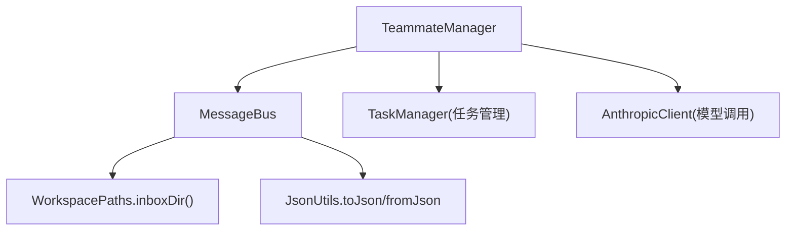
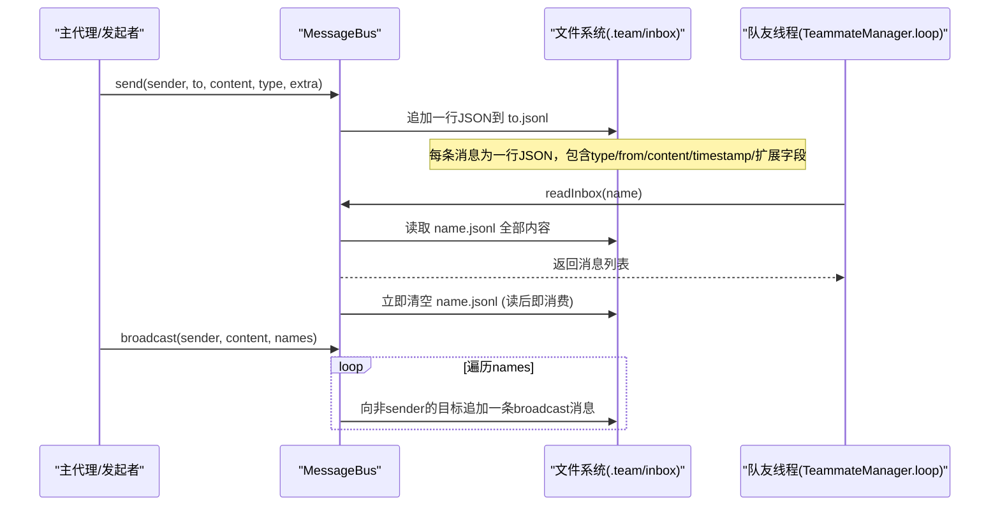
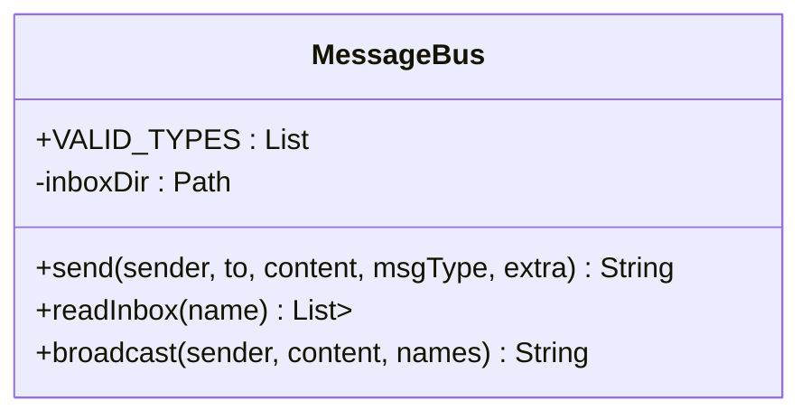
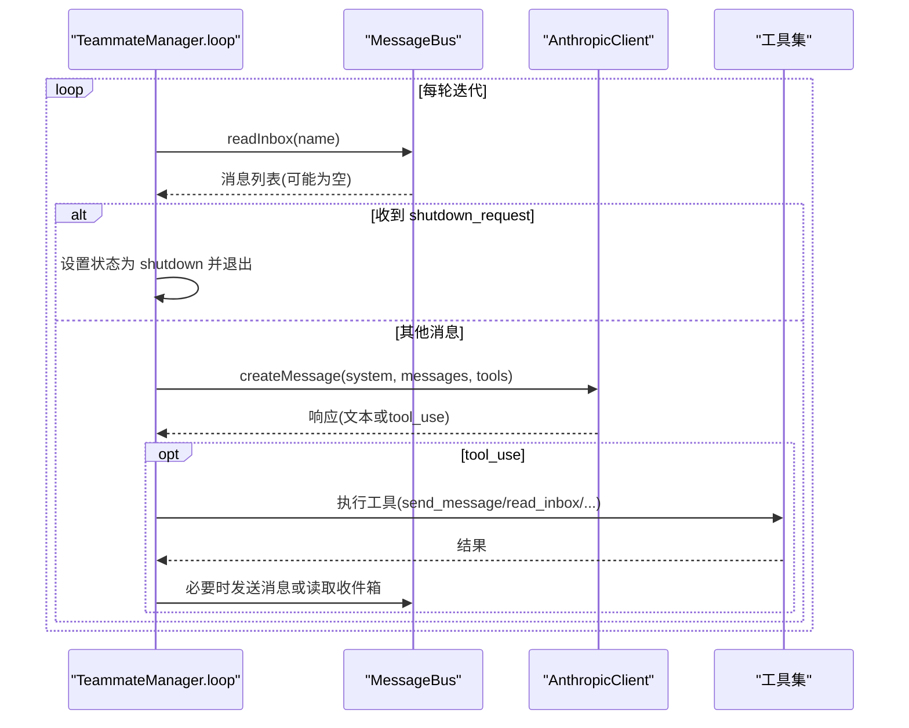
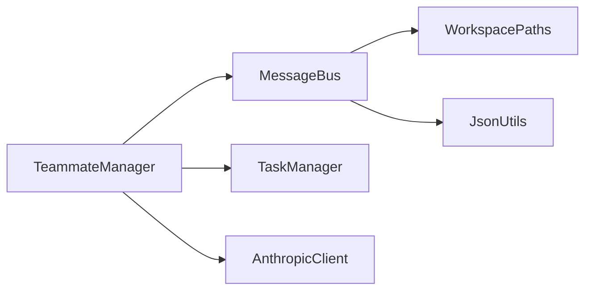

# 消息总线系统

<cite>
**本文引用的文件**
- [MessageBus.java](file://src/main/java/com/learnclaudecode/team/MessageBus.java)
- [TeammateManager.java](file://src/main/java/com/learnclaudecode/team/TeammateManager.java)
- [TeamMessage.java](file://src/main/java/com/learnclaudecode/model/TeamMessage.java)
- [JsonUtils.java](file://src/main/java/com/learnclaudecode/common/JsonUtils.java)
- [WorkspacePaths.java](file://src/main/java/com/learnclaudecode/common/WorkspacePaths.java)
</cite>

## 目录
1. [简介](#简介)
2. [项目结构](#项目结构)
3. [核心组件](#核心组件)
4. [架构总览](#架构总览)
5. [详细组件分析](#详细组件分析)
6. [依赖关系分析](#依赖关系分析)
7. [性能考量](#性能考量)
8. [故障排查指南](#故障排查指南)
9. [结论](#结论)
10. [附录：使用示例与最佳实践](#附录使用示例与最佳实践)

## 简介
本文件系统消息总线为多代理协作提供轻量、可持久化、跨进程的消息通道。其核心思想是：每个队友拥有独立的收件箱文件（位于工作区的 .team/inbox 目录下），消息以 JSONL 格式追加写入；读取时“读后即清空”，实现“读即消费”的语义。该设计避免共享内存与外部中间件依赖，具备天然的可调试性与崩溃安全特性。

## 项目结构
- 消息总线与协议实现集中在 team 包中，负责基于文件的发送、读取与广播。
- 工作区路径由 common.WorkspacePaths 统一管理，确保 inbox 目录存在且路径安全。
- JSON 序列化统一通过 common.JsonUtils 完成，保证时间戳等类型正确序列化。
- 模型 TeamMessage 定义了消息结构的字段约定，便于理解与文档化。

图表来源
- [MessageBus.java:19-122](file://src/main/java/com/learnclaudecode/team/MessageBus.java#L19-L122)
- [TeammateManager.java:39-70](file://src/main/java/com/learnclaudecode/team/TeammateManager.java#L39-L70)
- [WorkspacePaths.java:103-113](file://src/main/java/com/learnclaudecode/common/WorkspacePaths.java#L103-L113)
- [JsonUtils.java:12-83](file://src/main/java/com/learnclaudecode/common/JsonUtils.java#L12-L83)

章节来源
- [MessageBus.java:19-122](file://src/main/java/com/learnclaudecode/team/MessageBus.java#L19-L122)
- [WorkspacePaths.java:103-113](file://src/main/java/com/learnclaudecode/common/WorkspacePaths.java#L103-L113)
- [JsonUtils.java:12-83](file://src/main/java/com/learnclaudecode/common/JsonUtils.java#L12-L83)

## 核心组件
- MessageBus：基于文件系统的消息总线，提供 send、readInbox、broadcast 三个关键能力。
- TeammateManager：协调多个队友线程，驱动消息循环、工具执行与状态管理，并借助 MessageBus 进行通信。
- WorkspacePaths：提供 inboxDir 等路径访问方法，确保目录存在与安全。
- JsonUtils：统一的 JSON 序列化/反序列化，支持时间戳等类型。
- TeamMessage：描述消息结构的字段约定（type、from、content、timestamp、extra）。

章节来源
- [MessageBus.java:19-122](file://src/main/java/com/learnclaudecode/team/MessageBus.java#L19-L122)
- [TeammateManager.java:39-70](file://src/main/java/com/learnclaudecode/team/TeammateManager.java#L39-L70)
- [TeamMessage.java:9-34](file://src/main/java/com/learnclaudecode/model/TeamMessage.java#L9-L34)
- [WorkspacePaths.java:103-113](file://src/main/java/com/learnclaudecode/common/WorkspacePaths.java#L103-L113)
- [JsonUtils.java:12-83](file://src/main/java/com/learnclaudecode/common/JsonUtils.java#L12-L83)

## 架构总览
下图展示了从发送端到接收端的完整流程，包括文件落盘、读后即消费、以及广播机制。

图表来源
- [MessageBus.java:54-121](file://src/main/java/com/learnclaudecode/team/MessageBus.java#L54-L121)
- [TeammateManager.java:177-273](file://src/main/java/com/learnclaudecode/team/TeammateManager.java#L177-L273)
- [WorkspacePaths.java:103-113](file://src/main/java/com/learnclaudecode/common/WorkspacePaths.java#L103-L113)

## 详细组件分析

### MessageBus：文件型消息总线
- 支持的5种消息类型：message、broadcast、shutdown_request、shutdown_response、plan_approval_response。
- send：校验类型，构造消息对象（type、from、content、timestamp、可选extra），按目标名称写入 to.jsonl，采用追加模式。
- readInbox：读取指定收件箱的全部行，解析为消息列表，并立即清空文件，实现“读即消费”。
- broadcast：向除发送者外的所有目标分别发送一条 broadcast 消息。
- 并发安全：send 与 readInbox 均声明为 synchronized，避免同一时刻对同一文件的并发读写导致数据竞争或丢失。

图表来源
- [MessageBus.java:19-122](file://src/main/java/com/learnclaudecode/team/MessageBus.java#L19-L122)

章节来源
- [MessageBus.java:19-122](file://src/main/java/com/learnclaudecode/team/MessageBus.java#L19-L122)

### TeamMessage：消息结构定义
- type：消息类型，限定为上述5种之一。
- from：发送者标识（通常为队友名或 Agent 名）。
- content：消息正文内容。
- timestamp：Unix 时间戳（秒级浮点），用于记录消息创建时间。
- extra：扩展字段，承载不同消息类型的附加数据（如 request_id、approve、feedback 等）。

章节来源
- [TeamMessage.java:9-34](file://src/main/java/com/learnclaudecode/model/TeamMessage.java#L9-L34)

### TeammateManager：队友管理与消息循环
- 启动与生命周期：spawn 创建独立守护线程运行 loop，loop 持续消费收件箱、调用模型、执工具。
- 消息处理：在 loop 中先消费 bus.readInbox(name)，将 shutdown_request 等特殊类型直接处理，其余作为用户消息加入上下文。
- 工具集成：send_message、read_inbox、claim_task、idle、shutdown_response、plan_approval 等工具通过 MessageBus 与 TaskManager 协作。
- 计划审批与关闭协议：通过 plan_approval_response 与 shutdown_response 完成双向确认。

图表来源
- [TeammateManager.java:177-273](file://src/main/java/com/learnclaudecode/team/TeammateManager.java#L177-L273)
- [MessageBus.java:83-101](file://src/main/java/com/learnclaudecode/team/MessageBus.java#L83-L101)

章节来源
- [TeammateManager.java:177-273](file://src/main/java/com/learnclaudecode/team/TeammateManager.java#L177-L273)

### 工作区路径与存储布局
- inboxDir：位于 workdir/.team/inbox，每个队友一个 .jsonl 文件。
- 安全路径：WorkspacePaths.safeResolve 防止路径逃逸，保障仅在工作区内操作。
- 目录初始化：MessageBus 构造时确保 inbox 目录存在。

章节来源
- [WorkspacePaths.java:103-113](file://src/main/java/com/learnclaudecode/common/WorkspacePaths.java#L103-L113)
- [MessageBus.java:35-42](file://src/main/java/com/learnclaudecode/team/MessageBus.java#L35-L42)

## 依赖关系分析
- MessageBus 依赖 WorkspacePaths 获取 inbox 目录，依赖 JsonUtils 进行序列化/反序列化。
- TeammateManager 依赖 MessageBus 进行通信，依赖 TaskManager 进行任务认领，依赖 AnthropicClient 进行模型交互。
- 整体耦合度低，职责清晰：总线专注 IO，管理器专注流程编排。

图表来源
- [TeammateManager.java:39-70](file://src/main/java/com/learnclaudecode/team/TeammateManager.java#L39-L70)
- [MessageBus.java:19-42](file://src/main/java/com/learnclaudecode/team/MessageBus.java#L19-L42)

章节来源
- [TeammateManager.java:39-70](file://src/main/java/com/learnclaudecode/team/TeammateManager.java#L39-L70)
- [MessageBus.java:19-42](file://src/main/java/com/learnclaudecode/team/MessageBus.java#L19-L42)

## 性能考量
- 追加写与顺序读：JSONL 追加写天然适合并发写入不同文件，单文件内顺序追加减少锁竞争。
- 读后即消费：readInbox 一次性读取并清空，避免重复处理与状态同步开销。
- 批量广播：broadcast 内部循环调用 send，注意目标数量较大时的 I/O 次数。
- 建议优化方向：
  - 合并小消息：在应用层聚合多条消息后一次写入，降低系统调用次数。
  - 异步写入：在高吞吐场景下可引入缓冲队列与后台写入线程，但需保证幂等与顺序性。
  - 定期归档：对历史 inbox 文件进行归档与压缩，控制磁盘增长。
  - 监控指标：统计发送/读取延迟、错误率、文件大小与行数。

[本节为通用性能讨论，不直接分析具体文件]

## 故障排查指南
- 常见错误：
  - 无效消息类型：send 会拒绝未知类型并返回错误信息。
  - 文件I/O异常：readInbox 捕获 IOException 并返回系统错误消息，便于定位问题。
  - 目录不存在：MessageBus 构造时会尝试创建 inbox 目录，失败则抛出非法状态异常。
- 排查步骤：
  - 检查工作区路径是否正确，inbox 目录是否存在且有写入权限。
  - 检查 .jsonl 文件格式是否为合法 JSON 行，避免损坏行影响后续读取。
  - 观察 TeammateManager 的工具输出与状态变化，确认消息是否被正确处理。
- 恢复策略：
  - 若出现部分损坏行，可在读取时跳过空行与非法行（当前实现已跳过空白行）。
  - 对于长时间未消费的收件箱，可人工清理或迁移至归档目录。

章节来源
- [MessageBus.java:54-75](file://src/main/java/com/learnclaudecode/team/MessageBus.java#L54-L75)
- [MessageBus.java:83-101](file://src/main/java/com/learnclaudecode/team/MessageBus.java#L83-L101)
- [MessageBus.java:35-42](file://src/main/java/com/learnclaudecode/team/MessageBus.java#L35-L42)

## 结论
该消息总线以极简的文件系统协议实现了可靠的多代理通信：JSONL 追加写、读后即消费、内置5类消息类型、配合 TeammateManager 的流程编排，形成一套易于调试、跨进程可用、无需额外基础设施的协作方案。在中小规模场景中具备良好可用性与可维护性；在大规模高吞吐场景下可按建议进行异步化与批量化优化。

[本节为总结性内容，不直接分析具体文件]

## 附录：使用示例与最佳实践

### 代理间通信示例
- 主代理向队友发送消息：
  - 调用 send(sender="lead", to="backend-dev", content="请实现用户API", msgType="message", extra=null)。
  - 队友线程在 loop 中通过 readInbox("backend-dev") 消费消息并继续工作。
- 队友回复主代理：
  - 队友工具 send_message(to="lead", content="API已完成", msg_type="message")。
- 广播通知：
  - 主代理调用 broadcast(sender="lead", content="系统升级中", names=["backend-dev","frontend-dev"])。

章节来源
- [MessageBus.java:54-75](file://src/main/java/com/learnclaudecode/team/MessageBus.java#L54-L75)
- [MessageBus.java:112-121](file://src/main/java/com/learnclaudecode/team/MessageBus.java#L112-L121)
- [TeammateManager.java:177-273](file://src/main/java/com/learnclaudecode/team/TeammateManager.java#L177-L273)

### 错误处理建议
- 发送端：
  - 校验 msgType 是否在 VALID_TYPES 中，避免无效类型。
  - 捕获 send 返回的错误字符串并进行日志记录。
- 接收端：
  - 对 readInbox 返回的系统错误消息进行处理与告警。
  - 对异常行进行跳过与计数，便于统计与修复。

章节来源
- [MessageBus.java:54-75](file://src/main/java/com/learnclaudecode/team/MessageBus.java#L54-L75)
- [MessageBus.java:83-101](file://src/main/java/com/learnclaudecode/team/MessageBus.java#L83-L101)

### 性能优化建议
- 批量写入：在应用层聚合多条消息后一次写入，减少 I/O 次数。
- 异步写入：在高并发场景下引入缓冲与后台写入线程，注意顺序性与幂等性。
- 归档与清理：定期归档历史 inbox 文件，控制磁盘占用。
- 监控与度量：统计发送/读取延迟、错误率、文件大小与行数，建立告警阈值。

[本节为通用优化建议，不直接分析具体文件]