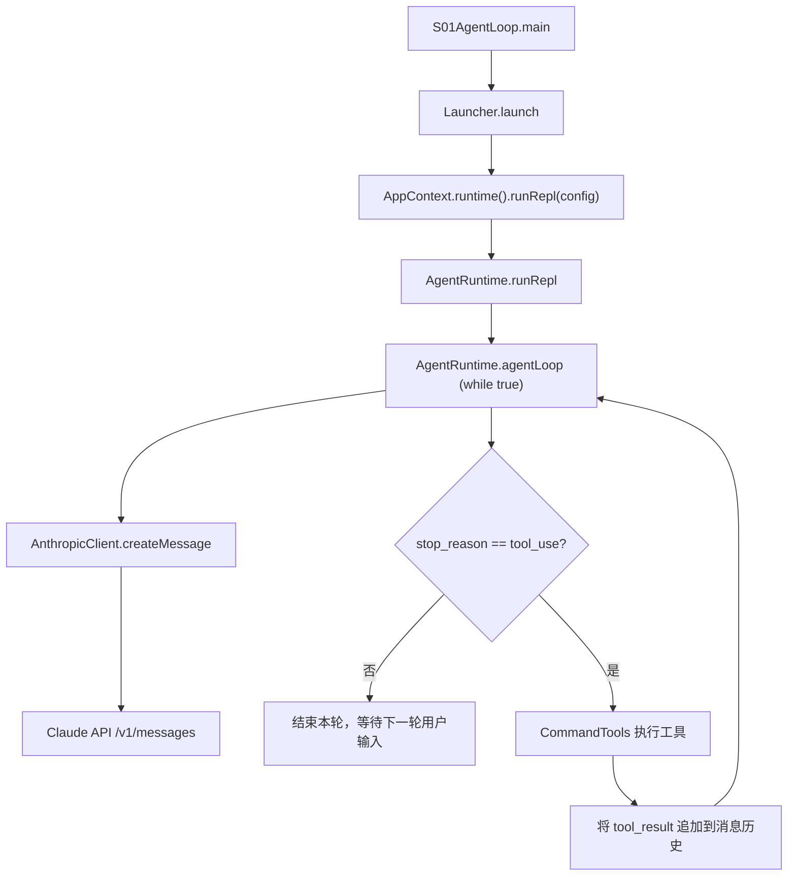
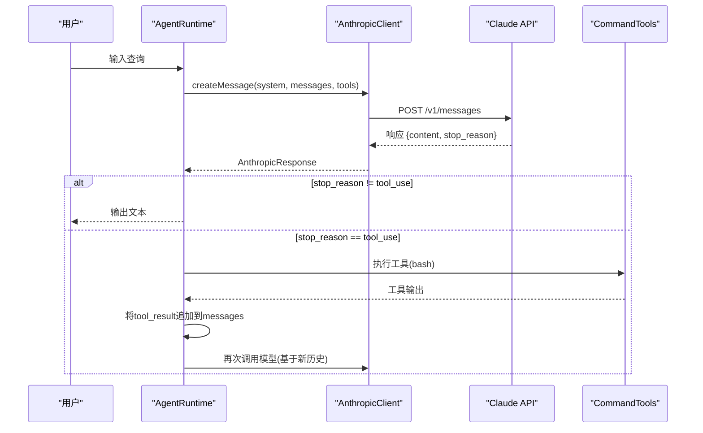
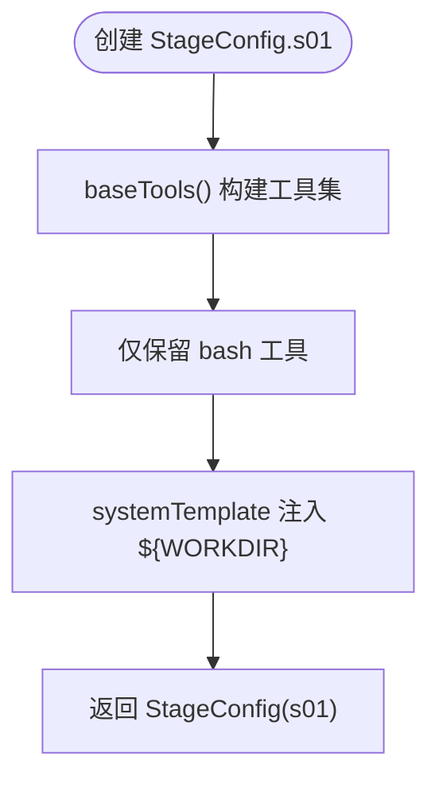
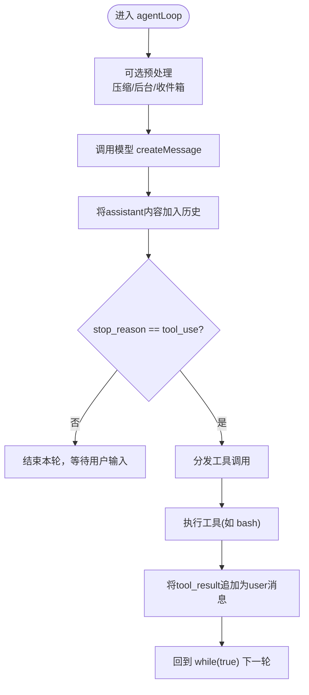
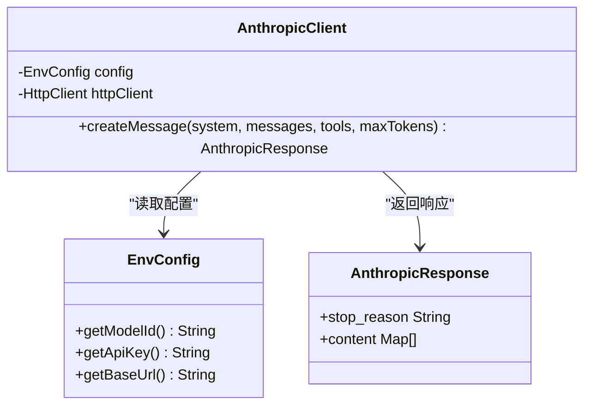
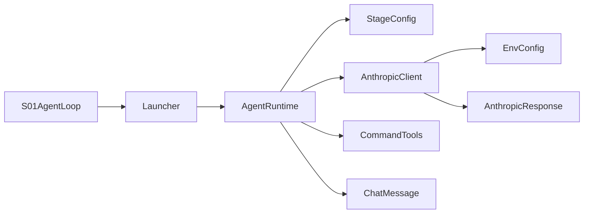

# S01: Agent循环基础

<cite>
**本文引用的文件**
- [S01AgentLoop.java](file://src/main/java/com/learnclaudecode/agents/S01AgentLoop.java)
- [StageConfig.java](file://src/main/java/com/learnclaudecode/agents/StageConfig.java)
- [Launcher.java](file://src/main/java/com/learnclaudecode/agents/Launcher.java)
- [AgentRuntime.java](file://src/main/java/com/learnclaudecode/agents/AgentRuntime.java)
- [AnthropicClient.java](file://src/main/java/com/learnclaudecode/common/AnthropicClient.java)
- [EnvConfig.java](file://src/main/java/com/learnclaudecode/common/EnvConfig.java)
- [ChatMessage.java](file://src/main/java/com/learnclaudecode/model/ChatMessage.java)
- [AnthropicResponse.java](file://src/main/java/com/learnclaudecode/model/AnthropicResponse.java)
- [CommandTools.java](file://src/main/java/com/learnclaudecode/tools/CommandTools.java)
</cite>

## 目录
1. [简介](#简介)
2. [项目结构](#项目结构)
3. [核心组件](#核心组件)
4. [架构总览](#架构总览)
5. [详细组件分析](#详细组件分析)
6. [依赖关系分析](#依赖关系分析)
7. [性能考虑](#性能考虑)
8. [故障排查指南](#故障排查指南)
9. [结论](#结论)
10. [附录：最小可运行示例与调试技巧](#附录最小可运行示例与调试技巧)

## 简介
本章节聚焦“最小化 Agent 闭环”的 S01 阶段，解释 while(true) 主循环如何驱动“请求-响应”模式，如何在每轮中读取用户输入、调用 Claude（或兼容）API、执行工具并回写结果，直到模型停止调用工具为止。同时说明 StageConfig.s01() 的配置含义与初始化过程，给出启动最简单 Agent 循环的步骤、输入输出示例与调试技巧。

## 项目结构
S01 的最小闭环由以下关键类协作完成：
- 入口与配置：S01AgentLoop、StageConfig、Launcher
- 运行时与消息流：AgentRuntime、ChatMessage
- 模型交互：AnthropicClient、EnvConfig、AnthropicResponse
- 工具执行：CommandTools（S01 仅启用 bash）

图表来源
- [S01AgentLoop.java:9-11](file://src/main/java/com/learnclaudecode/agents/S01AgentLoop.java#L9-L11)
- [Launcher.java:23-26](file://src/main/java/com/learnclaudecode/agents/Launcher.java#L23-L26)
- [AgentRuntime.java:97-123](file://src/main/java/com/learnclaudecode/agents/AgentRuntime.java#L97-L123)
- [AgentRuntime.java:131-261](file://src/main/java/com/learnclaudecode/agents/AgentRuntime.java#L131-L261)
- [AnthropicClient.java:52-101](file://src/main/java/com/learnclaudecode/common/AnthropicClient.java#L52-L101)

章节来源
- [S01AgentLoop.java:1-12](file://src/main/java/com/learnclaudecode/agents/S01AgentLoop.java#L1-L12)
- [Launcher.java:1-28](file://src/main/java/com/learnclaudecode/agents/Launcher.java#L1-L28)
- [AgentRuntime.java:23-39](file://src/main/java/com/learnclaudecode/agents/AgentRuntime.java#L23-L39)

## 核心组件
- S01AgentLoop：最薄入口，选择 s01 配置并启动。
- StageConfig：定义当前阶段的 system prompt、工具集与能力开关；s01 仅开放 bash。
- Launcher：统一启动器，避免重复初始化。
- AgentRuntime：实现 REPL 与 agentLoop 主循环，负责消息历史维护、模型调用、工具调度与结果回写。
- AnthropicClient：封装 HTTP 调用，构造 messages API 请求体，处理认证与错误。
- EnvConfig：从环境变量或 .env 加载模型 ID、API Key、Base URL 与工作目录。
- CommandTools：提供 bash、read_file、write_file、edit_file 等基础工具；S01 仅使用 bash。
- ChatMessage/AnthropicResponse：消息与响应的轻量数据模型。

章节来源
- [StageConfig.java:77-82](file://src/main/java/com/learnclaudecode/agents/StageConfig.java#L77-L82)
- [AgentRuntime.java:97-123](file://src/main/java/com/learnclaudecode/agents/AgentRuntime.java#L97-L123)
- [AgentRuntime.java:131-261](file://src/main/java/com/learnclaudecode/agents/AgentRuntime.java#L131-L261)
- [AnthropicClient.java:52-101](file://src/main/java/com/learnclaudecode/common/AnthropicClient.java#L52-L101)
- [EnvConfig.java:22-29](file://src/main/java/com/learnclaudecode/common/EnvConfig.java#L22-L29)
- [CommandTools.java:36-65](file://src/main/java/com/learnclaudecode/tools/CommandTools.java#L36-L65)
- [ChatMessage.java:1-8](file://src/main/java/com/learnclaudecode/model/ChatMessage.java#L1-L8)
- [AnthropicResponse.java:1-14](file://src/main/java/com/learnclaudecode/model/AnthropicResponse.java#L1-L14)

## 架构总览
S01 的核心思想是“让模型决定下一步动作，本地运行时负责执行并反馈”。在每一轮中：
- 收集系统提示、对话历史、工具定义，发送给模型。
- 若模型返回文本，直接展示给用户。
- 若模型返回 tool_use，则在本地执行对应工具，并将 tool_result 作为新的 user 消息追加到历史，继续下一轮。
- 当 stop_reason 不是 tool_use 时，本轮结束，等待下一次用户输入。

图表来源
- [AgentRuntime.java:131-261](file://src/main/java/com/learnclaudecode/agents/AgentRuntime.java#L131-L261)
- [AnthropicClient.java:52-101](file://src/main/java/com/learnclaudecode/common/AnthropicClient.java#L52-L101)
- [CommandTools.java:36-65](file://src/main/java/com/learnclaudecode/tools/CommandTools.java#L36-L65)

## 详细组件分析

### S01AgentLoop：最小入口
- 作用：选择 s01 配置并启动运行时。
- 关键点：不关心内部细节，只负责装配与启动。

章节来源
- [S01AgentLoop.java:9-11](file://src/main/java/com/learnclaudecode/agents/S01AgentLoop.java#L9-L11)

### StageConfig.s01()：配置与初始化
- 配置项：
  - prompt：控制台提示前缀，用于区分阶段。
  - enableTodoNag/enableCompression/enableBackground/enableInbox/subagentWritable/autonomousTeammates：均为 false，表示关闭高级能力。
  - tools：仅包含 bash 工具定义。
  - systemTemplate：注入工作目录与技能信息（S01 未使用技能）。
- 初始化流程：
  - 通过 baseTools() 获取基础工具集合，再取第一个（bash）。
  - 生成 systemPrompt 时替换 ${WORKDIR} 占位符。

图表来源
- [StageConfig.java:56-82](file://src/main/java/com/learnclaudecode/agents/StageConfig.java#L56-L82)

章节来源
- [StageConfig.java:77-82](file://src/main/java/com/learnclaudecode/agents/StageConfig.java#L77-L82)
- [StageConfig.java:56-70](file://src/main/java/com/learnclaudecode/agents/StageConfig.java#L56-L70)

### AgentRuntime：while(true) 主循环与消息处理
- runRepl：
  - 维护消息历史 history。
  - 打印阶段提示，读取用户输入。
  - 将用户输入作为 user 消息加入历史，调用 agentLoop。
  - 解析最后一条 assistant 消息中的文本块并输出。
- agentLoop：
  - 进入 while(true) 主循环。
  - 可选：上下文压缩、后台任务结果注入、团队收件箱注入（S01 均关闭）。
  - 调用 AnthropicClient.createMessage，传入 systemPrompt、messages、tools。
  - 将 assistant 内容加入历史。
  - 若 stop_reason 不是 tool_use，结束本轮。
  - 否则遍历 content 中的 tool_use 块，映射到本地工具执行（S01 仅 bash），将 tool_result 作为新的 user 消息追加，继续下一轮。

图表来源
- [AgentRuntime.java:97-123](file://src/main/java/com/learnclaudecode/agents/AgentRuntime.java#L97-L123)
- [AgentRuntime.java:131-261](file://src/main/java/com/learnclaudecode/agents/AgentRuntime.java#L131-L261)

章节来源
- [AgentRuntime.java:97-123](file://src/main/java/com/learnclaudecode/agents/AgentRuntime.java#L97-L123)
- [AgentRuntime.java:131-261](file://src/main/java/com/learnclaudecode/agents/AgentRuntime.java#L131-L261)

### AnthropicClient：与 Claude API 的基本交互
- 构造请求体：model、max_tokens、messages、system、tools。
- 设置 Base URL 与版本头，支持第三方兼容端点。
- 认证：同时发送 x-api-key 与 authorization Bearer。
- 错误处理：HTTP 非 2xx 抛出异常并附带响应体；IO/中断异常统一包装。

图表来源
- [AnthropicClient.java:27-101](file://src/main/java/com/learnclaudecode/common/AnthropicClient.java#L27-L101)
- [EnvConfig.java:22-96](file://src/main/java/com/learnclaudecode/common/EnvConfig.java#L22-L96)
- [AnthropicResponse.java:1-14](file://src/main/java/com/learnclaudecode/model/AnthropicResponse.java#L1-L14)

章节来源
- [AnthropicClient.java:52-101](file://src/main/java/com/learnclaudecode/common/AnthropicClient.java#L52-L101)
- [EnvConfig.java:22-96](file://src/main/java/com/learnclaudecode/common/EnvConfig.java#L22-L96)

### CommandTools：S01 的工具执行
- bash：在工作目录下执行命令，限制危险命令，超时控制，合并 stdout/stderr。
- read_file/write_file/edit_file：S01 未启用，但具备基础能力。

章节来源
- [CommandTools.java:36-65](file://src/main/java/com/learnclaudecode/tools/CommandTools.java#L36-L65)
- [CommandTools.java:87-145](file://src/main/java/com/learnclaudecode/tools/CommandTools.java#L87-L145)

## 依赖关系分析
- S01AgentLoop 依赖 Launcher 与 StageConfig。
- Launcher 依赖 AppContext（由运行时环境提供）与 AgentRuntime。
- AgentRuntime 依赖 AnthropicClient、StageConfig、CommandTools 及多个可选服务（S01 关闭）。
- AnthropicClient 依赖 EnvConfig 与 JSON 工具。
- 数据模型 ChatMessage 与 AnthropicResponse 贯穿消息流。

图表来源
- [S01AgentLoop.java:9-11](file://src/main/java/com/learnclaudecode/agents/S01AgentLoop.java#L9-L11)
- [Launcher.java:23-26](file://src/main/java/com/learnclaudecode/agents/Launcher.java#L23-L26)
- [AgentRuntime.java:41-90](file://src/main/java/com/learnclaudecode/agents/AgentRuntime.java#L41-L90)
- [AnthropicClient.java:27-41](file://src/main/java/com/learnclaudecode/common/AnthropicClient.java#L27-L41)

章节来源
- [AgentRuntime.java:41-90](file://src/main/java/com/learnclaudecode/agents/AgentRuntime.java#L41-L90)
- [AnthropicClient.java:27-41](file://src/main/java/com/learnclaudecode/common/AnthropicClient.java#L27-L41)

## 性能考虑
- 单次请求 token 上限：S01 使用固定 max_tokens 限制输出长度，避免过长响应。
- 工具输出截断：bash/read_file 等工具对输出进行截断，防止污染上下文。
- 超时控制：命令执行设置超时，避免阻塞主循环。
- 可选压缩：S01 关闭自动压缩，但在后续阶段可通过配置开启以缓解上下文膨胀。

[本节为通用指导，不直接分析具体文件]

## 故障排查指南
- 环境变量缺失：确保 MODEL_ID 已设置；ANTHROPIC_API_KEY 与 ANTHROPIC_BASE_URL 可选。
- 网络错误：检查 Base URL 与 API Key；查看异常堆栈中的 HTTP 状态码与响应体。
- 命令执行失败：确认工作目录权限与安全策略；注意危险命令拦截与超时。
- 工具未生效：确认 StageConfig.tools 是否包含该工具；S01 仅启用 bash。

章节来源
- [EnvConfig.java:22-29](file://src/main/java/com/learnclaudecode/common/EnvConfig.java#L22-L29)
- [AnthropicClient.java:87-101](file://src/main/java/com/learnclaudecode/common/AnthropicClient.java#L87-L101)
- [CommandTools.java:36-65](file://src/main/java/com/learnclaudecode/tools/CommandTools.java#L36-L65)

## 结论
S01 展示了最小化的 Agent 闭环：while(true) 主循环驱动“读输入→调模型→执行工具→回写结果”的迭代过程。通过 StageConfig.s01() 精确限定可用工具与能力开关，配合 AnthropicClient 的标准化消息接口，实现了可扩展、可演进的 Agent 架构基础。

[本节为总结性内容，不直接分析具体文件]

## 附录：最小可运行示例与调试技巧

### 启动最简单的 Agent 循环
- 入口：运行 S01AgentLoop.main。
- 配置：StageConfig.s01() 仅启用 bash 工具，system prompt 指向工作目录。
- 交互：控制台显示阶段提示，输入任务后进入多轮推理与工具执行。

章节来源
- [S01AgentLoop.java:9-11](file://src/main/java/com/learnclaudecode/agents/S01AgentLoop.java#L9-L11)
- [StageConfig.java:77-82](file://src/main/java/com/learnclaudecode/agents/StageConfig.java#L77-L82)

### 输入输出示例
- 输入：在控制台提示后输入一个需要执行 shell 的任务描述。
- 输出：
  - 若模型返回文本：直接打印文本块。
  - 若模型返回 tool_use：执行 bash 并打印工具输出摘要，随后继续下一轮。
  - 当模型不再调用工具时，本轮结束，等待下一次用户输入。

章节来源
- [AgentRuntime.java:97-123](file://src/main/java/com/learnclaudecode/agents/AgentRuntime.java#L97-L123)
- [AgentRuntime.java:131-261](file://src/main/java/com/learnclaudecode/agents/AgentRuntime.java#L131-L261)

### 调试技巧
- 检查环境变量：MODEL_ID 必填；ANTHROPIC_API_KEY 与 ANTHROPIC_BASE_URL 可选。
- 观察日志：工具执行会打印 "> 工具名: 输出摘要"，便于定位问题。
- 网络错误：捕获 HTTP 状态码与响应体，确认兼容端点是否正确。
- 命令超时：长时间运行的命令会被强制终止，避免阻塞。

章节来源
- [EnvConfig.java:22-29](file://src/main/java/com/learnclaudecode/common/EnvConfig.java#L22-L29)
- [AnthropicClient.java:87-101](file://src/main/java/com/learnclaudecode/common/AnthropicClient.java#L87-L101)
- [CommandTools.java:36-65](file://src/main/java/com/learnclaudecode/tools/CommandTools.java#L36-L65)