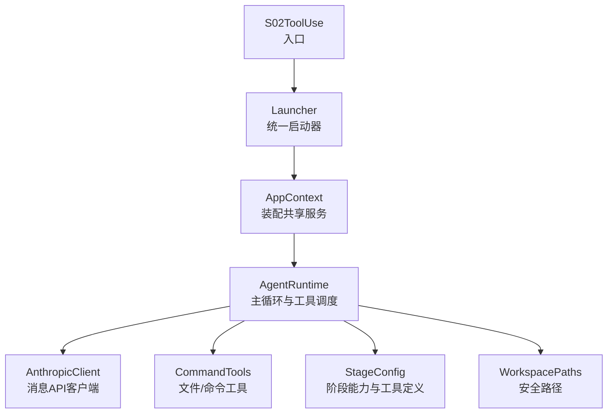
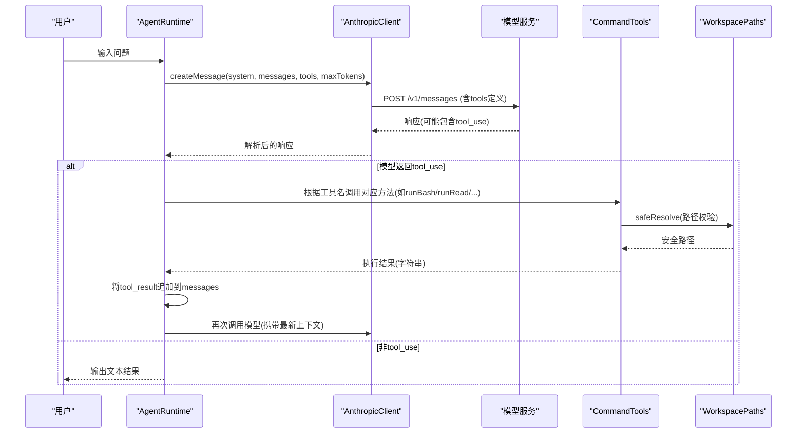
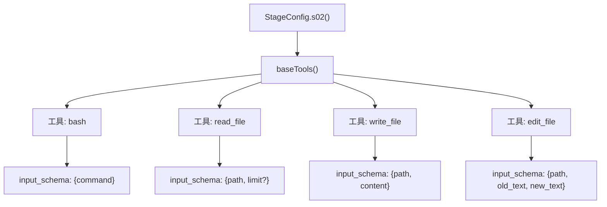
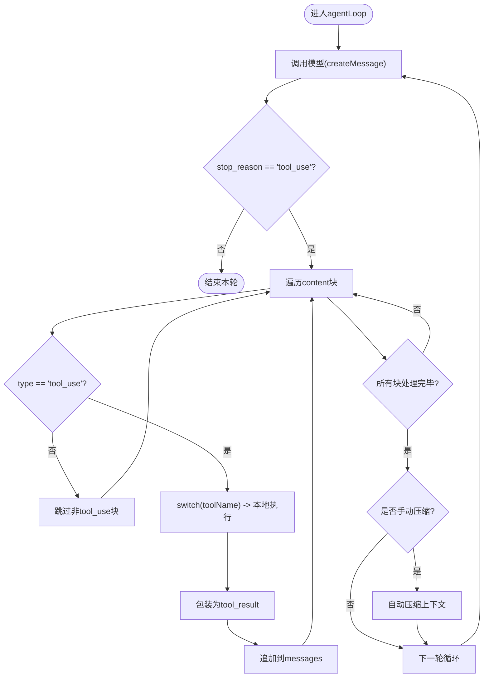
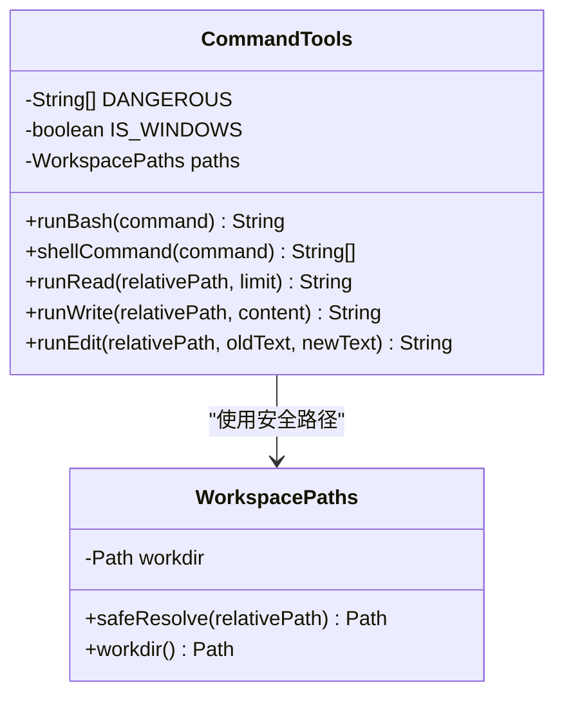
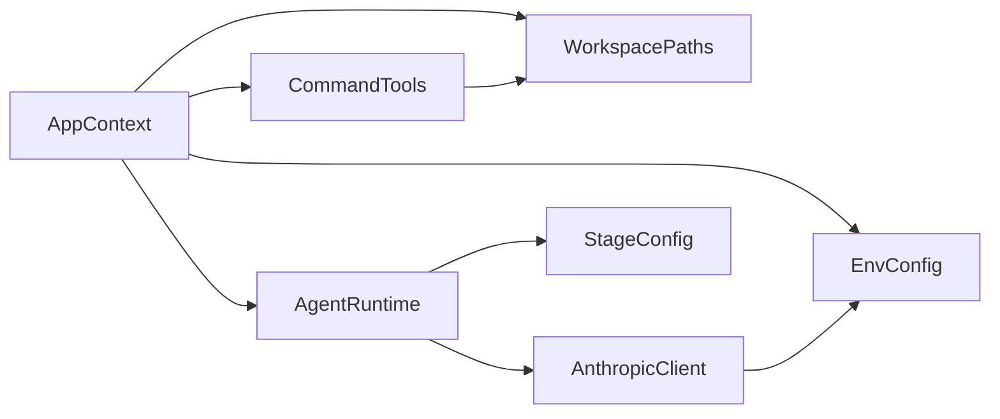

# S02: 工具调用机制

<cite>
**本文引用的文件**
- [S02ToolUse.java](file://src/main/java/com/learnclaudecode/agents/S02ToolUse.java)
- [Launcher.java](file://src/main/java/com/learnclaudecode/agents/Launcher.java)
- [AppContext.java](file://src/main/java/com/learnclaudecode/agents/AppContext.java)
- [StageConfig.java](file://src/main/java/com/learnclaudecode/agents/StageConfig.java)
- [AgentRuntime.java](file://src/main/java/com/learnclaudecode/agents/AgentRuntime.java)
- [CommandTools.java](file://src/main/java/com/learnclaudecode/tools/CommandTools.java)
- [TodoManager.java](file://src/main/java/com/learnclaudecode/tools/TodoManager.java)
- [AnthropicClient.java](file://src/main/java/com/learnclaudecode/common/AnthropicClient.java)
- [EnvConfig.java](file://src/main/java/com/learnclaudecode/common/EnvConfig.java)
- [WorkspacePaths.java](file://src/main/java/com/learnclaudecode/common/WorkspacePaths.java)
- [AnthropicResponse.java](file://src/main/java/com/learnclaudecode/model/AnthropicResponse.java)
- [ToolSpec.java](file://src/main/java/com/learnclaudecode/model/ToolSpec.java)
</cite>

## 目录
1. [简介](#简介)
2. [项目结构](#项目结构)
3. [核心组件](#核心组件)
4. [架构总览](#架构总览)
5. [详细组件分析](#详细组件分析)
6. [依赖关系分析](#依赖关系分析)
7. [性能考虑](#性能考虑)
8. [故障排查指南](#故障排查指南)
9. [结论](#结论)
10. [附录：完整示例与最佳实践](#附录完整示例与最佳实践)

## 简介
本章节面向“S02 工具调用机制”，目标是解释 Agent 如何声明和使用工具，包括工具注册、工具调用协议、参数传递和结果返回机制；深入说明 CommandTools 的内置工具（文件操作、命令执行）的使用方法；提供从模型声明工具调用到本地执行的完整流程示例；并给出错误处理、权限控制与性能优化策略及最佳实践。

## 项目结构
S02 的核心由“入口 -> 装配 -> 运行时 -> 工具”四层组成：
- 入口：S02ToolUse 启动 s02 阶段配置。
- 装配：AppContext 组装环境、工作区路径、工具、任务系统等共享服务。
- 运行时：AgentRuntime 驱动“用户输入 -> 调模型 -> 解析 tool_use -> 本地执行 -> 回写结果”的主循环。
- 工具：CommandTools 提供 bash、read_file、write_file、edit_file 等基础能力。

图表来源
- [S02ToolUse.java:9-11](file://src/main/java/com/learnclaudecode/agents/S02ToolUse.java#L9-L11)
- [Launcher.java:23-26](file://src/main/java/com/learnclaudecode/agents/Launcher.java#L23-L26)
- [AppContext.java:35-58](file://src/main/java/com/learnclaudecode/agents/AppContext.java#L35-L58)
- [AgentRuntime.java:97-172](file://src/main/java/com/learnclaudecode/agents/AgentRuntime.java#L97-L172)
- [StageConfig.java:56-94](file://src/main/java/com/learnclaudecode/agents/StageConfig.java#L56-L94)
- [CommandTools.java:36-144](file://src/main/java/com/learnclaudecode/tools/CommandTools.java#L36-L144)
- [WorkspacePaths.java:42-49](file://src/main/java/com/learnclaudecode/common/WorkspacePaths.java#L42-L49)

章节来源
- [S02ToolUse.java:9-11](file://src/main/java/com/learnclaudecode/agents/S02ToolUse.java#L9-L11)
- [Launcher.java:23-26](file://src/main/java/com/learnclaudecode/agents/Launcher.java#L23-L26)
- [AppContext.java:35-58](file://src/main/java/com/learnclaudecode/agents/AppContext.java#L35-L58)
- [StageConfig.java:56-94](file://src/main/java/com/learnclaudecode/agents/StageConfig.java#L56-L94)

## 核心组件
- StageConfig：集中定义每个教学阶段的 system prompt、工具集和能力开关。s02 启用 baseTools（bash、read_file、write_file、edit_file）。
- AgentRuntime：实现 Agent 主循环，负责将模型返回的 tool_use 映射为本地方法调用，并将结果以 tool_result 形式回写消息历史。
- AnthropicClient：封装对 Anthropic-compatible messages API 的 HTTP 调用，负责构造请求体（含 tools）、发送请求、解析响应。
- CommandTools：实现具体工具逻辑，包含命令执行、文件读取/写入/编辑，以及安全限制（黑名单、超时、输出截断、路径校验）。
- WorkspacePaths：提供工作区根路径与安全路径解析，防止路径逃逸。
- EnvConfig：读取环境变量（模型ID、API Key、Base URL、工作目录），支撑客户端与路径初始化。
- TodoManager：用于 s03/s_full 的任务清单管理，在 s02 中不直接参与，但被运行时预留支持。

章节来源
- [StageConfig.java:56-94](file://src/main/java/com/learnclaudecode/agents/StageConfig.java#L56-L94)
- [AgentRuntime.java:131-260](file://src/main/java/com/learnclaudecode/agents/AgentRuntime.java#L131-L260)
- [AnthropicClient.java:52-100](file://src/main/java/com/learnclaudecode/common/AnthropicClient.java#L52-L100)
- [CommandTools.java:36-144](file://src/main/java/com/learnclaudecode/tools/CommandTools.java#L36-L144)
- [WorkspacePaths.java:42-49](file://src/main/java/com/learnclaudecode/common/WorkspacePaths.java#L42-L49)
- [EnvConfig.java:22-29](file://src/main/java/com/learnclaudecode/common/EnvConfig.java#L22-L29)
- [TodoManager.java:21-54](file://src/main/java/com/learnclaudecode/tools/TodoManager.java#L21-L54)

## 架构总览
下图展示“模型声明工具调用 -> 本地执行 -> 结果回传”的端到端流程。

图表来源
- [AgentRuntime.java:131-260](file://src/main/java/com/learnclaudecode/agents/AgentRuntime.java#L131-L260)
- [AnthropicClient.java:52-100](file://src/main/java/com/learnclaudecode/common/AnthropicClient.java#L52-L100)
- [CommandTools.java:36-144](file://src/main/java/com/learnclaudecode/tools/CommandTools.java#L36-L144)
- [WorkspacePaths.java:42-49](file://src/main/java/com/learnclaudecode/common/WorkspacePaths.java#L42-L49)

## 详细组件分析

### 工具注册与声明（StageConfig）
- s02 使用 baseTools() 暴露四个基础工具：bash、read_file、write_file、edit_file。
- 每个工具通过 tool(name, description, input_schema) 构造，严格对齐 messages API 的工具描述格式。
- StageConfig 还负责在不同阶段组合不同工具集，形成“能力开关”。

图表来源
- [StageConfig.java:56-94](file://src/main/java/com/learnclaudecode/agents/StageConfig.java#L56-L94)
- [StageConfig.java:277-284](file://src/main/java/com/learnclaudecode/agents/StageConfig.java#L277-L284)

章节来源
- [StageConfig.java:56-94](file://src/main/java/com/learnclaudecode/agents/StageConfig.java#L56-L94)
- [StageConfig.java:277-284](file://src/main/java/com/learnclaudecode/agents/StageConfig.java#L277-L284)

### 工具调用协议（AgentRuntime 主循环）
- 每轮循环：准备 system prompt + messages + tools，调用模型。
- 若 stop_reason == "tool_use"，则遍历 content 中的 tool_use 块，按 name 分发到本地实现。
- 将执行结果包装为 tool_result 并追加到 messages，继续下一轮，直到模型不再调用工具。

图表来源
- [AgentRuntime.java:131-260](file://src/main/java/com/learnclaudecode/agents/AgentRuntime.java#L131-L260)

章节来源
- [AgentRuntime.java:131-260](file://src/main/java/com/learnclaudecode/agents/AgentRuntime.java#L131-L260)

### 参数传递与结果返回
- 参数传递：模型返回的 tool_use.input 字段为 Map<String,Object>，AgentRuntime 通过键名提取参数（如 command、path、limit、content、old_text、new_text）。
- 类型容错：numberOrNull/numberOrDefault 将数字或字符串统一解析为整数，避免模型输出风格差异导致失败。
- 结果返回：本地执行返回字符串，AgentRuntime 将其包装为 tool_result 并回写消息历史，供模型下一轮推理使用。

章节来源
- [AgentRuntime.java:184-240](file://src/main/java/com/learnclaudecode/agents/AgentRuntime.java#L184-L240)
- [AgentRuntime.java:318-339](file://src/main/java/com/learnclaudecode/agents/AgentRuntime.java#L318-L339)

### CommandTools 实现详解
- runBash(command)：
  - 黑名单拦截危险命令（如 rm -rf /、sudo、shutdown、reboot、> /dev/）。
  - 基于 ProcessBuilder 执行 shell，设置工作目录为 workdir，超时 120 秒，强制终止超时进程。
  - 合并 stdout/stderr，空输出返回占位提示，输出最大截断至 50000 字符。
- shellCommand(command)：
  - 根据操作系统选择 powershell 或 bash -lc 作为底层执行器。
- runRead(relativePath, limit)：
  - 通过 WorkspacePaths.safeResolve 进行路径安全校验。
  - 支持 limit 行数限制，避免大文件撑爆上下文。
  - 输出最大截断至 50000 字符。
- runWrite(relativePath, content)：
  - 自动创建父目录，写入 UTF-8 内容。
- runEdit(relativePath, oldText, newText)：
  - 精确匹配旧文本后替换一次，确保最小变更。

图表来源
- [CommandTools.java:16-144](file://src/main/java/com/learnclaudecode/tools/CommandTools.java#L16-L144)
- [WorkspacePaths.java:42-49](file://src/main/java/com/learnclaudecode/common/WorkspacePaths.java#L42-L49)

章节来源
- [CommandTools.java:36-144](file://src/main/java/com/learnclaudecode/tools/CommandTools.java#L36-L144)
- [WorkspacePaths.java:42-49](file://src/main/java/com/learnclaudecode/common/WorkspacePaths.java#L42-L49)

### 工具调用完整示例（从模型到本地执行）
以下示例展示了 s02 的典型交互流程（概念性步骤，不包含代码片段）：
1. 用户输入：“在当前工作区创建一个 README.md，内容为 Hello World。”
2. AgentRuntime 调用模型，附带 s02 的工具定义（包含 write_file）。
3. 模型返回 tool_use{name:"write_file", input:{path:"README.md", content:"Hello World"}}。
4. AgentRuntime 解析参数并调用 CommandTools.runWrite("README.md", "Hello World")。
5. CommandTools 通过 WorkspacePaths.safeResolve 校验路径，写入文件。
6. 结果包装为 tool_result 回写消息历史，模型下一轮确认完成。

章节来源
- [StageConfig.java:89-94](file://src/main/java/com/learnclaudecode/agents/StageConfig.java#L89-L94)
- [AgentRuntime.java:184-240](file://src/main/java/com/learnclaudecode/agents/AgentRuntime.java#L184-L240)
- [CommandTools.java:110-121](file://src/main/java/com/learnclaudecode/tools/CommandTools.java#L110-L121)
- [WorkspacePaths.java:42-49](file://src/main/java/com/learnclaudecode/common/WorkspacePaths.java#L42-L49)

## 依赖关系分析
- AppContext 装配顺序：EnvConfig -> WorkspacePaths -> AnthropicClient -> CommandTools -> TodoManager -> SkillLoader -> CompressionService -> TaskManager -> BackgroundManager -> MessageBus -> TeammateManager -> WorktreeManager -> AgentRuntime。
- AgentRuntime 依赖：AnthropicClient（模型通信）、CommandTools（工具执行）、WorkspacePaths（路径安全）、StageConfig（工具定义与系统提示）。
- CommandTools 依赖：WorkspacePaths（路径安全）、ProcessBuilder（命令执行）。
- AnthropicClient 依赖：EnvConfig（模型ID、API Key、Base URL）、JsonUtils（序列化/反序列化）。

图表来源
- [AppContext.java:35-58](file://src/main/java/com/learnclaudecode/agents/AppContext.java#L35-L58)
- [AgentRuntime.java:41-90](file://src/main/java/com/learnclaudecode/agents/AgentRuntime.java#L41-L90)
- [CommandTools.java:16-28](file://src/main/java/com/learnclaudecode/tools/CommandTools.java#L16-L28)
- [AnthropicClient.java:27-41](file://src/main/java/com/learnclaudecode/common/AnthropicClient.java#L27-L41)
- [EnvConfig.java:22-29](file://src/main/java/com/learnclaudecode/common/EnvConfig.java#L22-L29)

章节来源
- [AppContext.java:35-58](file://src/main/java/com/learnclaudecode/agents/AppContext.java#L35-L58)
- [AgentRuntime.java:41-90](file://src/main/java/com/learnclaudecode/agents/AgentRuntime.java#L41-L90)
- [CommandTools.java:16-28](file://src/main/java/com/learnclaudecode/tools/CommandTools.java#L16-L28)
- [AnthropicClient.java:27-41](file://src/main/java/com/learnclaudecode/common/AnthropicClient.java#L27-L41)
- [EnvConfig.java:22-29](file://src/main/java/com/learnclaudecode/common/EnvConfig.java#L22-L29)

## 性能考虑
- 命令执行超时：runBash 设置 120 秒超时，避免长时间阻塞；超时后强制销毁进程。
- 输出截断：命令与文件读取输出限制在 50000 字符，减少网络传输与上下文占用。
- 文件读取限流：runRead 支持 limit 参数，避免一次性加载超大文件。
- 后台任务：s08 引入 background_run/check_background，将长耗时任务移出主循环，提升交互响应性。
- 上下文压缩：s06 支持 microCompact/autoCompact，降低对话历史膨胀带来的成本与延迟。
- 工具定义精简：仅暴露必要工具，减少模型理解负担与 token 消耗。

[本节为通用性能建议，不直接分析具体文件]

## 故障排查指南
- 环境变量缺失：EnvConfig 会抛出缺少 MODEL_ID 等必填变量的异常，检查 .env 或系统环境变量。
- 网络错误：AnthropicClient 在 HTTP 状态码 >= 400 时抛出异常并附带响应体，便于定位兼容性问题。
- 路径逃逸：WorkspacePaths.safeResolve 检测到路径越界会抛出异常，确保工具只在工作区内操作。
- 危险命令：CommandTools 黑名单拦截危险命令，返回错误信息，避免破坏系统。
- 超时与中断：runBash 捕获 InterruptedException 并恢复线程中断标志；IOException 统一转为业务异常。
- 工具未知：AgentRuntime 的 switch 默认分支返回 “Unknown tool: ...”，检查 StageConfig 工具定义与模型输出一致性。

章节来源
- [EnvConfig.java:37-39](file://src/main/java/com/learnclaudecode/common/EnvConfig.java#L37-L39)
- [AnthropicClient.java:90-100](file://src/main/java/com/learnclaudecode/common/AnthropicClient.java#L90-L100)
- [WorkspacePaths.java:42-49](file://src/main/java/com/learnclaudecode/common/WorkspacePaths.java#L42-L49)
- [CommandTools.java:38-64](file://src/main/java/com/learnclaudecode/tools/CommandTools.java#L38-L64)
- [AgentRuntime.java:233-234](file://src/main/java/com/learnclaudecode/agents/AgentRuntime.java#L233-L234)

## 结论
S02 工具调用机制通过“配置化工具声明 + 运行时调度 + 安全工具实现”的组合，实现了模型与本地能力的解耦与可控执行。StageConfig 负责声明工具，AgentRuntime 负责将模型意图翻译为本地方法调用，CommandTools 提供安全且高效的执行能力。该设计易于扩展新工具、控制权限、优化性能，并为后续阶段（任务、团队、自治等）奠定基础。

[本节为总结性内容，不直接分析具体文件]

## 附录：完整示例与最佳实践

### 示例：创建并编辑文件
- 目标：在当前工作区创建 src/Main.java，并在其中添加类声明与方法。
- 步骤：
  1. 使用 write_file 工具创建文件并写入初始内容。
  2. 使用 edit_file 工具对特定文本进行精确替换，逐步完善代码。
  3. 使用 bash 工具运行编译或测试命令验证结果。
- 注意事项：
  - 路径必须相对工作区根目录，避免 ../ 逃逸。
  - 大文件读取时使用 limit 限制行数。
  - 命令执行注意超时与输出大小限制。

章节来源
- [StageConfig.java:89-94](file://src/main/java/com/learnclaudecode/agents/StageConfig.java#L89-L94)
- [CommandTools.java:87-144](file://src/main/java/com/learnclaudecode/tools/CommandTools.java#L87-L144)
- [WorkspacePaths.java:42-49](file://src/main/java/com/learnclaudecode/common/WorkspacePaths.java#L42-L49)

### 最佳实践
- 工具声明清晰：为每个工具提供准确的 name、description 与 input_schema，帮助模型正确生成调用。
- 参数校验前置：在工具内部做必要校验（如路径安全、黑名单、必填字段），尽早失败。
- 错误信息友好：返回明确的错误原因，便于调试与模型自我修正。
- 资源保护：限制输出大小、设置超时、避免无限循环。
- 可观测性：记录关键步骤日志（如工具名、输入摘要、结果长度），便于追踪。
- 渐进式能力：通过 StageConfig 逐步打开高级功能，降低学习曲线与风险。

[本节为通用最佳实践，不直接分析具体文件]