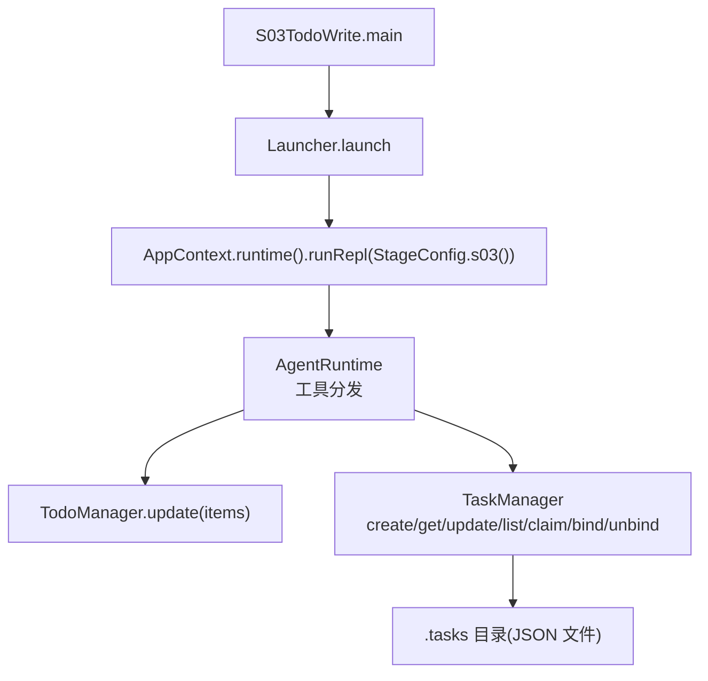
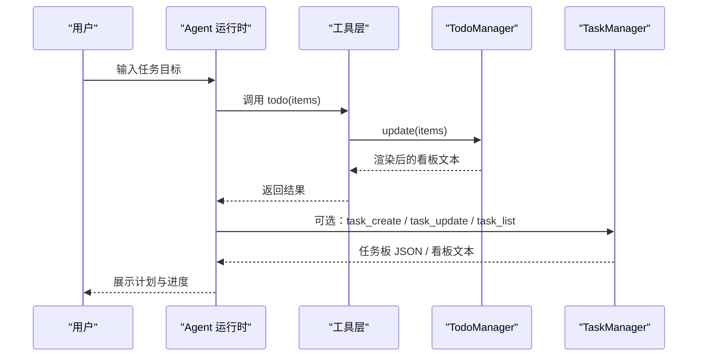
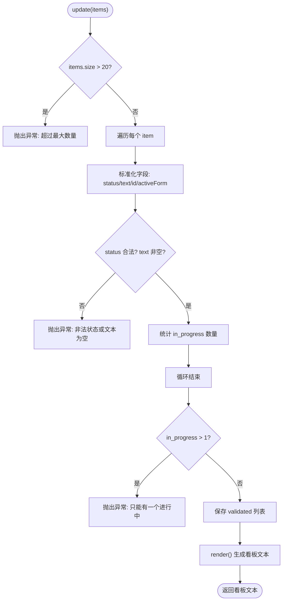
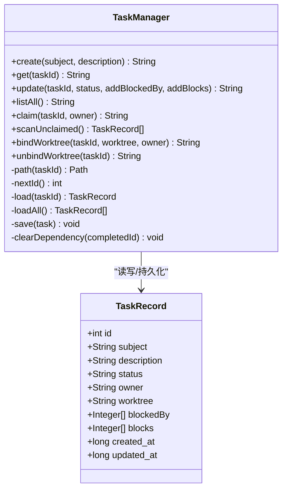
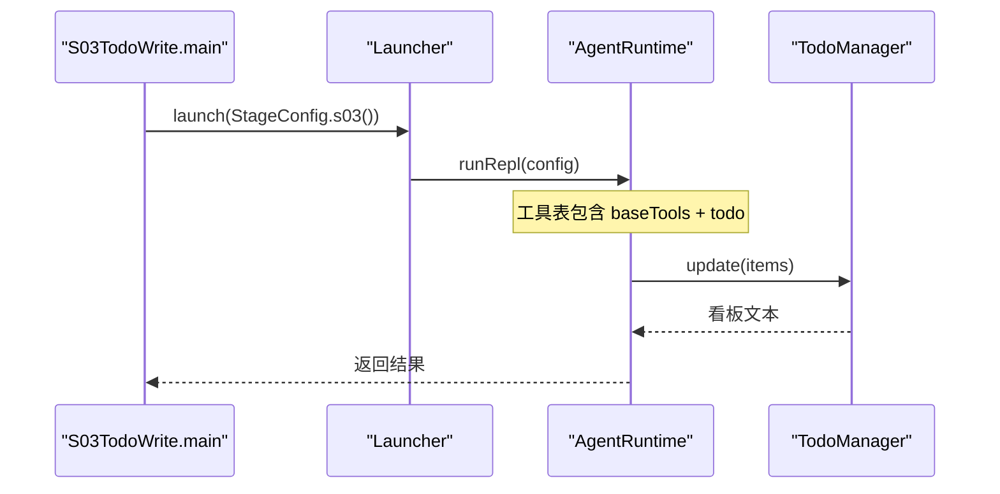
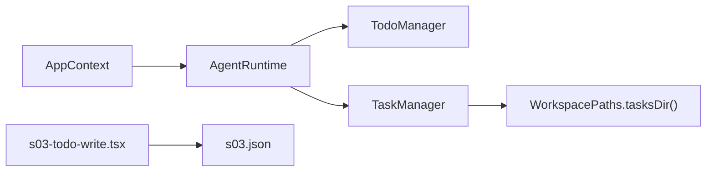

# S03: 任务管理入门

<cite>
**本文引用的文件**
- [TodoManager.java](file://src/main/java/com/learnclaudecode/tools/TodoManager.java)
- [TodoItem.java](file://src/main/java/com/learnclaudecode/model/TodoItem.java)
- [TaskRecord.java](file://src/main/java/com/learnclaudecode/model/TaskRecord.java)
- [TaskManager.java](file://src/main/java/com/learnclaudecode/tasks/TaskManager.java)
- [StageConfig.java](file://src/main/java/com/learnclaudecode/agents/StageConfig.java)
- [S03TodoWrite.java](file://src/main/java/com/learnclaudecode/agents/S03TodoWrite.java)
- [Launcher.java](file://src/main/java/com/learnclaudecode/agents/Launcher.java)
- [AgentRuntime.java](file://src/main/java/com/learnclaudecode/agents/AgentRuntime.java)
- [WorkspacePaths.java](file://src/main/java/com/learnclaudecode/common/WorkspacePaths.java)
- [s03-todo-write.tsx](file://web/src/components/visualizations/s03-todo-write.tsx)
- [s03.json](file://web/src/data/scenarios/s03.json)
</cite>

## 目录
1. [简介](#简介)
2. [项目结构](#项目结构)
3. [核心组件](#核心组件)
4. [架构总览](#架构总览)
5. [详细组件分析](#详细组件分析)
6. [依赖关系分析](#依赖关系分析)
7. [性能与并发特性](#性能与并发特性)
8. [故障排查指南](#故障排查指南)
9. [结论](#结论)
10. [附录：API 使用示例与最佳实践](#附录api-使用示例与最佳实践)

## 简介
本入门文档聚焦于 S03 阶段的“任务管理”能力，围绕 TodoManager 的待办事项管理与 TaskManager 的文件化任务系统展开。你将了解：
- 如何创建、更新、删除和跟踪待办事项状态
- TodoItem 数据模型字段含义
- Agent 中如何使用 todo 工具进行多步任务规划
- 任务优先级、依赖关系与批量操作的使用方式
- 实际应用场景与最佳实践

## 项目结构
S03 的任务管理能力由“运行时配置 + 工具调度 + 管理器实现”三部分构成：
- 阶段配置 StageConfig.s03() 暴露 todo 工具给 Agent
- AgentRuntime 将模型的工具调用路由到本地实现（如 TodoManager.update）
- TodoManager 维护内存中的待办列表并渲染看板；TaskManager 提供基于文件的持久化任务板

图表来源
- [S03TodoWrite.java:9-11](file://src/main/java/com/learnclaudecode/agents/S03TodoWrite.java#L9-L11)
- [Launcher.java:23-26](file://src/main/java/com/learnclaudecode/agents/Launcher.java#L23-L26)
- [StageConfig.java:101-108](file://src/main/java/com/learnclaudecode/agents/StageConfig.java#L101-L108)
- [AgentRuntime.java:187-199](file://src/main/java/com/learnclaudecode/agents/AgentRuntime.java#L187-L199)
- [TaskManager.java:27-42](file://src/main/java/com/learnclaudecode/tasks/TaskManager.java#L27-L42)

章节来源
- [S03TodoWrite.java:1-13](file://src/main/java/com/learnclaudecode/agents/S03TodoWrite.java#L1-L13)
- [Launcher.java:1-28](file://src/main/java/com/learnclaudecode/agents/Launcher.java#L1-L28)
- [StageConfig.java:96-108](file://src/main/java/com/learnclaudecode/agents/StageConfig.java#L96-L108)
- [AgentRuntime.java:187-199](file://src/main/java/com/learnclaudecode/agents/AgentRuntime.java#L187-L199)

## 核心组件
- TodoManager：内存式待办清单，支持批量更新、状态校验、进度渲染
- TodoItem：轻量记录，包含 id、text、status、activeForm
- TaskManager：基于 .tasks 目录的 JSON 任务板，支持创建、查询、更新、认领、绑定 worktree、依赖清理等
- StageConfig.s03()：为 Agent 暴露 todo 工具，引导“先计划再执行”的工作流
- AgentRuntime：统一工具分发器，将模型的工具调用映射到具体实现

章节来源
- [TodoManager.java:1-93](file://src/main/java/com/learnclaudecode/tools/TodoManager.java#L1-L93)
- [TodoItem.java:1-8](file://src/main/java/com/learnclaudecode/model/TodoItem.java#L1-L8)
- [TaskManager.java:17-42](file://src/main/java/com/learnclaudecode/tasks/TaskManager.java#L17-L42)
- [StageConfig.java:96-108](file://src/main/java/com/learnclaudecode/agents/StageConfig.java#L96-L108)
- [AgentRuntime.java:187-199](file://src/main/java/com/learnclaudecode/agents/AgentRuntime.java#L187-L199)

## 架构总览
S03 的任务管理在“短期清单”和“长期任务板”两个层面协同工作：
- 短期清单：TodoManager 用于单轮或多轮对话中的步骤拆解与进度可视化
- 长期任务板：TaskManager 用于跨会话、跨 Agent 的持久化任务协作

图表来源
- [StageConfig.java:101-108](file://src/main/java/com/learnclaudecode/agents/StageConfig.java#L101-L108)
- [AgentRuntime.java:187-199](file://src/main/java/com/learnclaudecode/agents/AgentRuntime.java#L187-L199)
- [TodoManager.java:21-55](file://src/main/java/com/learnclaudecode/tools/TodoManager.java#L21-L55)
- [TaskManager.java:51-61](file://src/main/java/com/learnclaudecode/tasks/TaskManager.java#L51-L61)

## 详细组件分析

### TodoManager：待办清单与看板
- 功能要点
  - 批量更新：接收 items 数组，内部校验并替换当前列表
  - 状态约束：仅允许 pending、in_progress、completed；同时最多一个 in_progress
  - 长度限制：items 数量上限为 20
  - 文本兼容：支持 text 或 content 字段，自动归一化为 text 与 content
  - 进度渲染：输出带标记的看板文本，并在末尾显示完成数
- 复杂度
  - 更新：O(n)，n 为 items 数量
  - 渲染：O(n)
  - 空间：O(n)

图表来源
- [TodoManager.java:21-55](file://src/main/java/com/learnclaudecode/tools/TodoManager.java#L21-L55)
- [TodoManager.java:71-91](file://src/main/java/com/learnclaudecode/tools/TodoManager.java#L71-L91)

章节来源
- [TodoManager.java:1-93](file://src/main/java/com/learnclaudecode/tools/TodoManager.java#L1-L93)

### TodoItem：数据模型
- 字段说明
  - id：唯一标识
  - text：任务描述文本
  - status：状态（pending/in_progress/completed）
  - activeForm：活跃态展示文本（通常与 text 一致）
- 用途
  - 作为 TodoManager 内部渲染与外部可视化的基础数据结构

章节来源
- [TodoItem.java:1-8](file://src/main/java/com/learnclaudecode/model/TodoItem.java#L1-L8)

### TaskManager：文件化任务板
- 功能要点
  - 创建任务：自动生成 ID、初始状态 pending、写入 .tasks 目录下的 JSON 文件
  - 获取详情：按 ID 读取任务 JSON
  - 更新任务：支持状态变更、追加 blockedBy/blocks 依赖；当状态为 completed 时自动清理其他任务的阻塞依赖；deleted 直接删除文件
  - 列出看板：将所有任务以看板文本形式输出
  - 认领任务：设置 owner 并将状态推进为 in_progress
  - 扫描可认领：筛选 pending、无 owner、无前置依赖的任务
  - 绑定/解绑 worktree：将任务与工作树关联，必要时推进状态
- 并发与一致性
  - 关键方法加同步锁，避免并发写覆盖
  - 依赖清理会遍历所有任务并即时落盘，保证多 Agent 可见性

图表来源
- [TaskManager.java:27-338](file://src/main/java/com/learnclaudecode/tasks/TaskManager.java#L27-L338)
- [TaskRecord.java:9-61](file://src/main/java/com/learnclaudecode/model/TaskRecord.java#L9-L61)

章节来源
- [TaskManager.java:17-338](file://src/main/java/com/learnclaudecode/tasks/TaskManager.java#L17-L338)
- [TaskRecord.java:1-62](file://src/main/java/com/learnclaudecode/model/TaskRecord.java#L1-L62)

### Agent 集成：S03 工具与运行流程
- 阶段配置
  - StageConfig.s03() 暴露 todo 工具，提示 Agent 使用它来规划多步任务
- 工具分发
  - AgentRuntime 将模型调用的 todo/TodoWrite 映射到 TodoManager.update
- 启动入口
  - S03TodoWrite.main 通过 Launcher.launch(StageConfig.s03()) 启动交互式 Agent

图表来源
- [S03TodoWrite.java:9-11](file://src/main/java/com/learnclaudecode/agents/S03TodoWrite.java#L9-L11)
- [Launcher.java:23-26](file://src/main/java/com/learnclaudecode/agents/Launcher.java#L23-L26)
- [StageConfig.java:101-108](file://src/main/java/com/learnclaudecode/agents/StageConfig.java#L101-L108)
- [AgentRuntime.java:187-199](file://src/main/java/com/learnclaudecode/agents/AgentRuntime.java#L187-L199)

章节来源
- [S03TodoWrite.java:1-13](file://src/main/java/com/learnclaudecode/agents/S03TodoWrite.java#L1-L13)
- [StageConfig.java:96-108](file://src/main/java/com/learnclaudecode/agents/StageConfig.java#L96-L108)
- [AgentRuntime.java:187-199](file://src/main/java/com/learnclaudecode/agents/AgentRuntime.java#L187-L199)

## 依赖关系分析
- 运行时装配
  - AppContext 组装 AgentRuntime，注入 TodoManager、TaskManager 等组件
- 路径与安全
  - WorkspacePaths 提供安全路径解析与常用目录访问（如 .tasks）
- 前端可视化
  - s03-todo-write.tsx 演示了看板列与 Nag 计时器的交互
  - s03.json 描述了从“创建计划”到“执行与测试”的步骤序列

图表来源
- [AppContext.java:55-69](file://src/main/java/com/learnclaudecode/agents/AppContext.java#L55-L69)
- [WorkspacePaths.java:77-88](file://src/main/java/com/learnclaudecode/common/WorkspacePaths.java#L77-L88)
- [s03-todo-write.tsx:1-324](file://web/src/components/visualizations/s03-todo-write.tsx#L1-L324)
- [s03.json:1-54](file://web/src/data/scenarios/s03.json#L1-L54)

章节来源
- [AppContext.java:55-69](file://src/main/java/com/learnclaudecode/agents/AppContext.java#L55-L69)
- [WorkspacePaths.java:1-150](file://src/main/java/com/learnclaudecode/common/WorkspacePaths.java#L1-L150)
- [s03-todo-write.tsx:1-324](file://web/src/components/visualizations/s03-todo-write.tsx#L1-L324)
- [s03.json:1-54](file://web/src/data/scenarios/s03.json#L1-L54)

## 性能与并发特性
- TodoManager
  - 内存操作，更新与渲染均为 O(n)，适合短清单场景
  - 限制 items ≤ 20，避免过大列表影响性能与可读性
- TaskManager
  - 每次更新/读取都涉及磁盘 I/O；批量操作建议合并多次更新以减少 IO
  - 关键方法加同步锁，确保并发安全；依赖清理会全量扫描并落盘，注意在高并发下可能带来额外开销
- 建议
  - 对频繁读的场景，可在上层缓存任务列表
  - 对复杂依赖图，建议在应用层做增量检查，减少不必要的遍历

[本节为通用性能讨论，不直接分析具体文件]

## 故障排查指南
- 常见错误与处理
  - 超过最大待办数量：TodoManager 会抛出异常，需拆分任务或分批更新
  - 非法状态或空文本：更新前需校验 status 与 text/content
  - 多个进行中任务：同一时刻只允许一个 in_progress，需调整状态后再提交
  - 任务不存在：TaskManager.get/load 会抛出异常，需确认 taskId 有效
  - 删除失败：TaskManager.update 删除时会尝试删除文件，IO 异常会转为运行时异常
- 定位思路
  - 查看 AgentRuntime 的工具分发日志，确认工具名与参数
  - 检查 .tasks 目录下对应 JSON 文件是否被正确读写
  - 使用 listAll/scanUnclaimed 快速定位任务状态与依赖问题

章节来源
- [TodoManager.java:21-55](file://src/main/java/com/learnclaudecode/tools/TodoManager.java#L21-L55)
- [TaskManager.java:69-133](file://src/main/java/com/learnclaudecode/tasks/TaskManager.java#L69-L133)

## 结论
S03 通过“短期清单 + 长期任务板”的组合，帮助 Agent 在多步任务中保持清晰计划与可追踪进度。TodoManager 提供轻量、快速的看板能力；TaskManager 提供持久化、可协作的任务板，并内置依赖管理与状态流转规则。结合 StageConfig.s03() 的工具暴露与 AgentRuntime 的统一分发，开发者可以在复杂任务中高效地进行任务规划与管理。

[本节为总结性内容，不直接分析具体文件]

## 附录：API 使用示例与最佳实践

### 在 Agent 中使用 todo 工具（S03）
- 触发方式
  - 通过 StageConfig.s03() 暴露的 todo 工具，向 Agent 传入 items 数组
- 典型流程
  - 先调用 todo(items) 创建计划，再将首个任务设为 in_progress
  - 逐步完成任务，将状态改为 completed
  - 使用 render 输出的看板文本跟踪进度

章节来源
- [StageConfig.java:101-108](file://src/main/java/com/learnclaudecode/agents/StageConfig.java#L101-L108)
- [AgentRuntime.java:187-199](file://src/main/java/com/learnclaudecode/agents/AgentRuntime.java#L187-L199)
- [TodoManager.java:21-55](file://src/main/java/com/learnclaudecode/tools/TodoManager.java#L21-L55)

### 任务优先级、依赖关系与批量操作
- 优先级
  - 可通过 items 顺序表达优先级；TodoManager 会按顺序渲染
  - 对于更复杂的优先级，建议使用 TaskManager 的 blockedBy/blocks 表达依赖
- 依赖关系
  - TaskManager.update 支持 addBlockedBy/addBlocks，完成后自动清理依赖
  - 使用 scanUnclaimed 找到可立即执行的任务
- 批量操作
  - TodoManager.update 支持一次性更新整个列表（≤20 项）
  - TaskManager 建议将多次小更新合并为一次，减少 IO 与锁竞争

章节来源
- [TodoManager.java:21-55](file://src/main/java/com/learnclaudecode/tools/TodoManager.java#L21-L55)
- [TaskManager.java:84-133](file://src/main/java/com/learnclaudecode/tasks/TaskManager.java#L84-L133)
- [TaskManager.java:187-197](file://src/main/java/com/learnclaudecode/tasks/TaskManager.java#L187-L197)

### 实际应用场景
- 构建 CLI 计算器
  - 使用 todo 工具先列出步骤（解析参数、实现运算、错误处理、测试），再逐步执行
  - 参考前端可视化与场景脚本，理解“先计划再执行”的流程

章节来源
- [s03.json:1-54](file://web/src/data/scenarios/s03.json#L1-L54)
- [s03-todo-write.tsx:18-86](file://web/src/components/visualizations/s03-todo-write.tsx#L18-L86)

### 最佳实践
- 明确拆分任务粒度：每个 item 应是一个可独立验证的最小步骤
- 控制进行中任务数量：始终保证至多一个 in_progress
- 及时更新状态：完成即改 completed，避免僵尸任务
- 利用依赖关系：用 blockedBy/blocks 表达真实依赖，提高并行度
- 结合 worktree：复杂任务绑定 worktree，隔离上下文与文件冲突

[本节为通用指导，不直接分析具体文件]