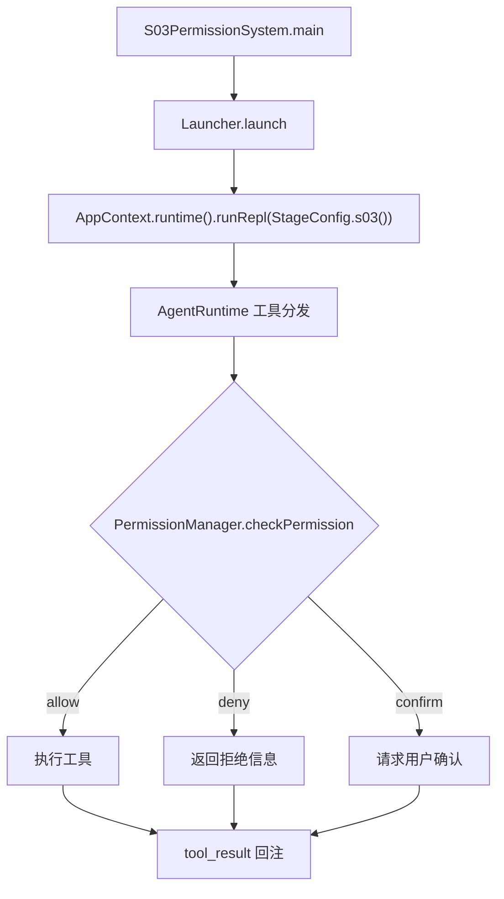
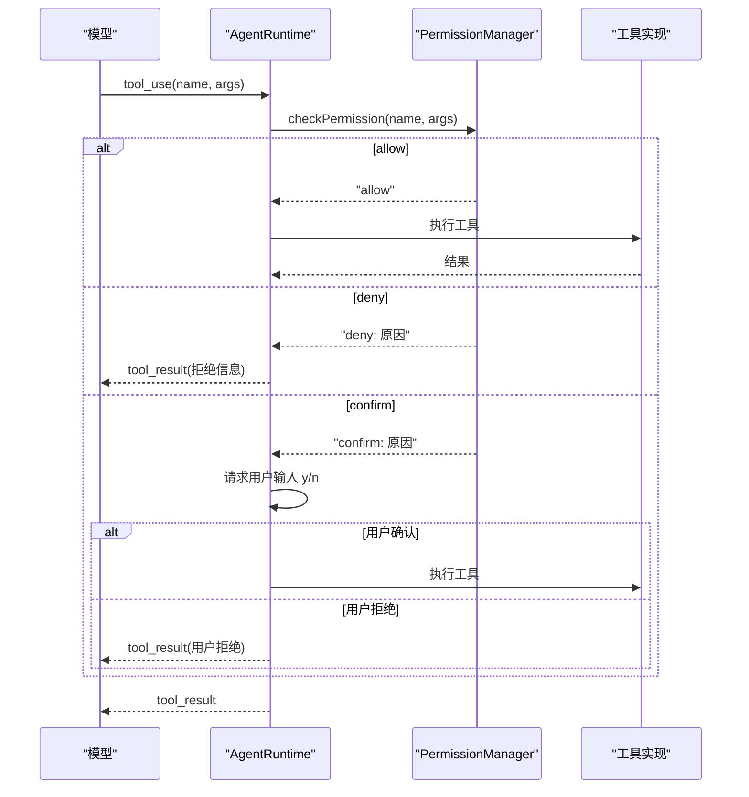

# S03: 权限系统

<cite>
**本文引用的文件**
- [PermissionManager.java](file://src/main/java/com/learnclaudecode/permission/PermissionManager.java)
- [StageConfig.java](file://src/main/java/com/learnclaudecode/agents/StageConfig.java)
- [S03PermissionSystem.java](file://src/main/java/com/learnclaudecode/agents/S03PermissionSystem.java)
- [AgentRuntime.java](file://src/main/java/com/learnclaudecode/agents/AgentRuntime.java)
- [AppContext.java](file://src/main/java/com/learnclaudecode/agents/AppContext.java)
- [WorkspacePaths.java](file://src/main/java/com/learnclaudecode/common/WorkspacePaths.java)
</cite>

## 目录
1. [简介](#简介)
2. [教学目标](#教学目标)
3. [项目结构](#项目结构)
4. [核心组件](#核心组件)
5. [架构总览](#架构总览)
6. [详细组件分析](#详细组件分析)
7. [工具列表](#工具列表)
8. [与前后阶段的关系](#与前后阶段的关系)
9. [故障排查指南](#故障排查指南)
10. [结论](#结论)

## 简介

> **座右铭："先设边界，再给自由"**

在 S01/S02 中，Agent 已经能够执行 bash 命令和读写文件。但一个没有任何约束的 Agent 是危险的——它可能执行 `rm -rf /`，可能读取工作区之外的敏感文件，可能在你不知情的情况下修改关键配置。

S03 阶段引入**权限系统**，在工具调用之前增加一道"安检门"：每次模型请求调用工具时，PermissionManager 会先检查该调用是否被允许，只有通过了权限检查，工具才会真正执行。

本阶段的核心问题是：**如何在不牺牲 Agent 能力的前提下，为它划定安全边界？**

## 教学目标

完成本阶段学习后，你应当能够：

- 理解为什么 Agent 需要权限控制层（而不是靠 system prompt "劝说"模型不要做危险操作）
- 掌握 PermissionRule 的三态策略：allow / deny / confirm
- 理解路径沙箱（path sandbox）如何防止文件工具逃逸工作区
- 理解 bash 黑名单如何拦截危险命令
- 能够解释"规则匹配顺序"对权限判定的影响
- 了解权限系统如何与 AgentRuntime 的工具分发流程集成

## 项目结构

S03 的权限能力由"阶段配置 + 权限管理器 + 运行时集成"三部分构成：

- 阶段配置 `StageConfig.s03()` 在 S02 基础上启用 `enablePermission=true`，并暴露权限管理工具
- `PermissionManager` 维护规则列表，执行权限检查
- `AgentRuntime` 在工具分发前调用权限检查，根据结果决定执行、拒绝或请求确认



**图表来源**
- [S03PermissionSystem.java](file://src/main/java/com/learnclaudecode/agents/S03PermissionSystem.java)
- [PermissionManager.java:79-123](file://src/main/java/com/learnclaudecode/permission/PermissionManager.java#L79-L123)
- [AgentRuntime.java](file://src/main/java/com/learnclaudecode/agents/AgentRuntime.java)

**章节来源**
- [S03PermissionSystem.java](file://src/main/java/com/learnclaudecode/agents/S03PermissionSystem.java)
- [StageConfig.java](file://src/main/java/com/learnclaudecode/agents/StageConfig.java)
- [PermissionManager.java:1-255](file://src/main/java/com/learnclaudecode/permission/PermissionManager.java#L1-L255)

## 核心组件

- **PermissionManager**：权限管理器，维护规则列表并执行三层检查（路径沙箱 → bash 黑名单 → 规则匹配）
- **PermissionRule**：权限规则记录（record），包含 toolPattern（工具名模式，支持 `*` 通配符）和 policy（allow/deny/confirm）
- **StageConfig.s03()**：启用 `enablePermission` 开关，暴露 `permission_list` 和 `permission_set` 工具
- **AgentRuntime**：在工具分发的 switch 之前插入权限检查逻辑

**章节来源**
- [PermissionManager.java:23-65](file://src/main/java/com/learnclaudecode/permission/PermissionManager.java#L23-L65)
- [StageConfig.java](file://src/main/java/com/learnclaudecode/agents/StageConfig.java)

## 架构总览

权限检查位于"模型请求工具调用"与"本地执行工具"之间，是一个同步拦截层：



**图表来源**
- [PermissionManager.java:79-123](file://src/main/java/com/learnclaudecode/permission/PermissionManager.java#L79-L123)
- [AgentRuntime.java](file://src/main/java/com/learnclaudecode/agents/AgentRuntime.java)

## 详细组件分析

### PermissionManager：三层检查流程

`checkPermission(toolName, args)` 方法按以下顺序执行检查：

**第一层：路径沙箱检查（文件工具专用）**

对 `read_file`、`write_file`、`edit_file` 三个文件工具，无论规则如何配置，都会先检查目标路径是否在工作区内：

```java
if (FILE_TOOLS.contains(toolName) && args != null) {
    String filePath = String.valueOf(args.get("path"));
    if (!isPathInWorkspace(filePath)) {
        return "deny: path '" + filePath + "' escapes workspace boundary";
    }
}
```

`isPathInWorkspace` 将路径规范化（resolve + normalize）后检查是否以 workdir 开头，防止 `../../etc/passwd` 式的逃逸。

**第二层：bash 命令黑名单**

对 `bash` 工具，检查命令文本是否包含危险关键词：

```java
private static final List<String> BASH_BLACKLIST = List.of(
    "rm -rf", "format", "shutdown", "reboot",
    "mkfs", "dd if=", ":(){ :|:& };:"
);
```

匹配到黑名单中的任何模式，直接返回 deny。

**第三层：规则列表匹配**

按声明顺序遍历规则列表，第一个命中的规则决定最终策略：

```java
for (PermissionRule rule : rules) {
    if (matchesPattern(rule.toolPattern(), toolName)) {
        return switch (rule.policy()) {
            case "allow" -> "allow";
            case "deny" -> "deny: ...";
            case "confirm" -> "confirm: ...";
        };
    }
}
```

**通配符匹配**：`matchesPattern` 支持 `*` 通配符。`"*"` 匹配一切；`"file_*"` 匹配所有以 `file_` 开头的工具名。内部将通配符模式转换为正则表达式进行匹配。

**章节来源**
- [PermissionManager.java:79-123](file://src/main/java/com/learnclaudecode/permission/PermissionManager.java#L79-L123)
- [PermissionManager.java:217-253](file://src/main/java/com/learnclaudecode/permission/PermissionManager.java#L217-L253)

### 默认规则：最小权限原则

PermissionManager 构造时加载以下默认规则：

| 序号 | 工具模式 | 策略 | 设计意图 |
|------|---------|------|---------|
| 1 | `bash` | confirm | 命令影响范围大，需人工确认 |
| 2 | `read_file` | allow | 读操作风险低（路径沙箱兜底） |
| 3 | `write_file` | allow | 写操作受路径沙箱保护 |
| 4 | `edit_file` | allow | 编辑操作受路径沙箱保护 |
| 5 | `*` | allow | 兜底：未显式声明的工具默认允许 |

规则顺序很重要：`bash` 的 confirm 规则排在 `*` 的 allow 兜底之前，因此 bash 调用会被拦截要求确认，而其他工具（如 todo、task）则直接放行。

**章节来源**
- [PermissionManager.java:55-65](file://src/main/java/com/learnclaudecode/permission/PermissionManager.java#L55-L65)

### 规则的动态管理

PermissionManager 提供运行时修改规则的能力：

- **setRule(toolPattern, policy)**：添加或更新规则。新规则插入到 `*` 兜底规则之前，确保优先级正确。如果同模式规则已存在则原地更新。
- **removeRule(toolPattern)**：移除指定规则。`*` 兜底规则受保护，不可移除。
- **listRules()**：以格式化文本列出所有规则，用 `[+]`/`[-]`/`[?]` 图标区分 allow/deny/confirm。

这些方法通过 `permission_set` 和 `permission_list` 工具暴露给模型，使 Agent 能够在运行时调整自己的权限边界（例如用户明确授权后，将 bash 从 confirm 改为 allow）。

**章节来源**
- [PermissionManager.java:130-208](file://src/main/java/com/learnclaudecode/permission/PermissionManager.java#L130-L208)

### 线程安全设计

- 规则列表使用 `CopyOnWriteArrayList`，读操作（checkPermission 中的遍历）无需加锁
- 写操作（setRule、removeRule）加 `synchronized`，防止并发修改导致规则丢失
- 这种"读多写少"的场景非常适合 CopyOnWriteArrayList

**章节来源**
- [PermissionManager.java:25](file://src/main/java/com/learnclaudecode/permission/PermissionManager.java#L25)
- [PermissionManager.java:160](file://src/main/java/com/learnclaudecode/permission/PermissionManager.java#L160)

## 工具列表

S03 阶段在 S02 的基础工具（bash、read_file、write_file、edit_file）之上，新增以下权限管理工具：

| 工具名 | 功能 | 关键参数 |
|--------|------|---------|
| `permission_list` | 列出当前所有权限规则 | 无 |
| `permission_set` | 添加或更新一条权限规则 | tool_pattern, policy(allow/deny/confirm) |

**使用示例**：

```
用户：允许 Agent 自由执行 bash 命令
Agent 调用：permission_set(tool_pattern="bash", policy="allow")
返回：Rule updated: bash -> allow
```

```
用户：禁止 Agent 使用 write_file
Agent 调用：permission_set(tool_pattern="write_file", policy="deny")
返回：Rule added: write_file -> deny
```

**章节来源**
- [StageConfig.java](file://src/main/java/com/learnclaudecode/agents/StageConfig.java)
- [PermissionManager.java:130-208](file://src/main/java/com/learnclaudecode/permission/PermissionManager.java#L130-L208)

## 与前后阶段的关系

### 前置阶段

- **S01（Agent 循环）**：提供了"模型请求 → 本地执行"的基本闭环，但没有任何安全检查
- **S02（工具调用）**：引入了 read_file/write_file/edit_file 等文件工具，扩大了 Agent 的操作面，使权限控制变得必要

### 后续阶段

- **S04（钩子系统）**：权限系统是"硬拦截"（deny 即终止），钩子系统则提供"软扩展"（log/audit/block），二者互补。权限检查在钩子之前执行——先过安检门，再触发钩子
- **S05（Todo 规划）**：todo 工具不在 FILE_TOOLS 集合中，也不在黑名单中，因此被 `*` 兜底规则直接 allow
- **S15（集成运行时）**：在完整系统中，权限系统与钩子系统、MCP 工具等协同工作，所有工具调用（包括 MCP 发现的外部工具）都经过权限检查

### 设计演进

```
S01: 无约束执行 bash
S02: 增加文件工具，仍无约束
S03: 引入权限层 ← 你在这里
S04: 引入钩子层（更细粒度的生命周期扩展）
```

**章节来源**
- [StageConfig.java](file://src/main/java/com/learnclaudecode/agents/StageConfig.java)
- [AgentRuntime.java](file://src/main/java/com/learnclaudecode/agents/AgentRuntime.java)

## 故障排查指南

| 现象 | 可能原因 | 定位方法 |
|------|---------|---------|
| bash 命令总是要求确认 | 默认规则将 bash 设为 confirm | 调用 `permission_set(tool_pattern="bash", policy="allow")` 修改 |
| 文件操作被拒绝 "escapes workspace" | 路径包含 `../` 或绝对路径指向工作区外 | 检查传入的 path 参数，确保在工作区内 |
| 新工具被意外拒绝 | 某条 deny 规则的通配符匹配了该工具 | 调用 `permission_list` 查看规则顺序 |
| setRule 返回 "invalid policy" | policy 参数不是 allow/deny/confirm 之一 | 检查拼写，只接受这三个值 |
| 通配符规则不生效 | `*` 兜底规则排在前面，先匹配到了 | 新规则自动插入到 `*` 之前，检查 listRules 输出 |

**章节来源**
- [PermissionManager.java:79-208](file://src/main/java/com/learnclaudecode/permission/PermissionManager.java#L79-L208)

## 结论

S03 通过在工具调用前插入权限检查层，为 Agent 建立了"先设边界，再给自由"的安全模型。PermissionManager 的三层检查（路径沙箱 → bash 黑名单 → 规则匹配）既保证了危险操作被拦截，又通过 allow/deny/confirm 三态策略和通配符规则提供了灵活的配置能力。

关键设计决策：
- **纯内存存储**：规则随进程生命周期存在，适合教学演示（生产环境可持久化）
- **内置优先于规则**：路径沙箱和黑名单是硬编码的安全底线，无法被规则覆盖
- **规则顺序即优先级**：第一个命中的规则决定结果，`*` 兜底规则永远排最后
- **运行时可调**：模型可以通过 permission_set 工具调整自己的权限边界

这一阶段为后续的钩子系统（S04）和完整集成（S15）奠定了安全基础。
