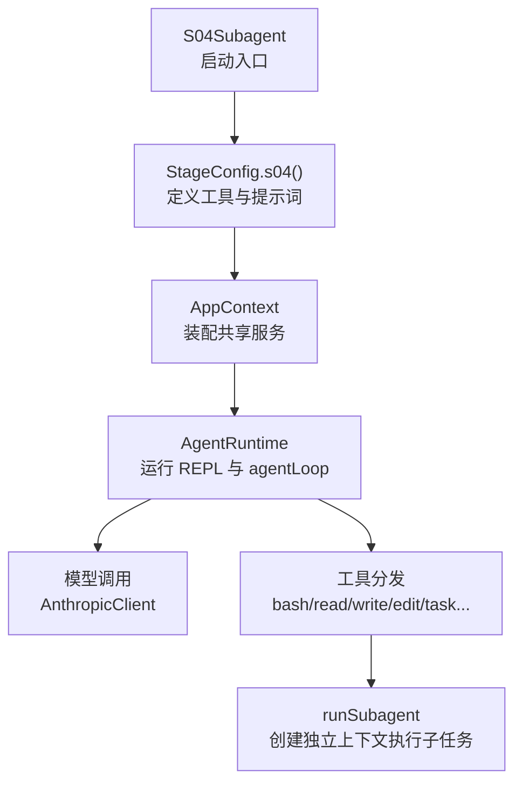
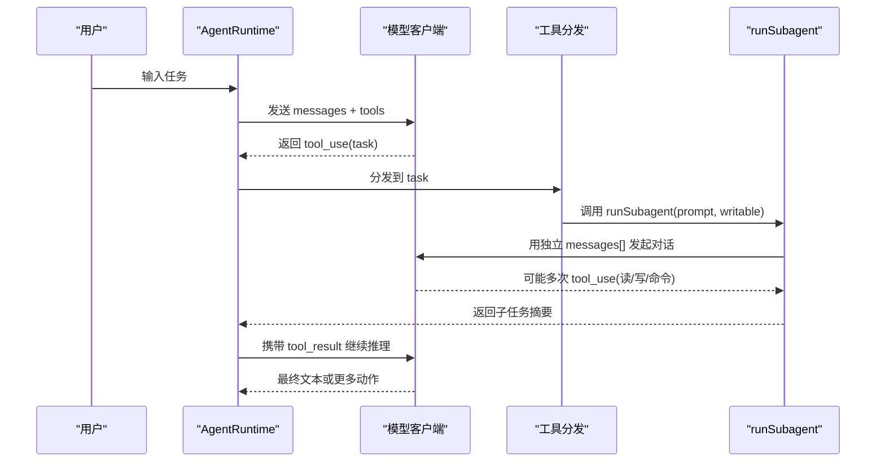
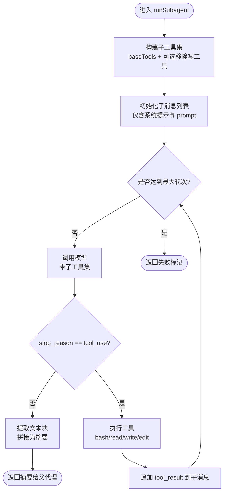
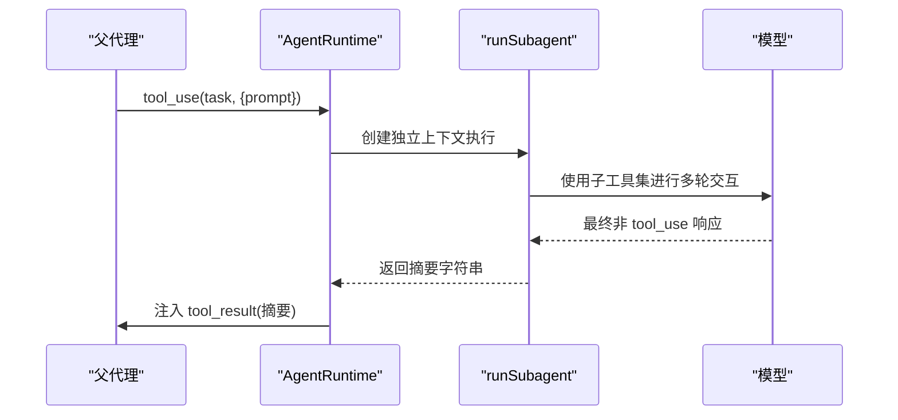
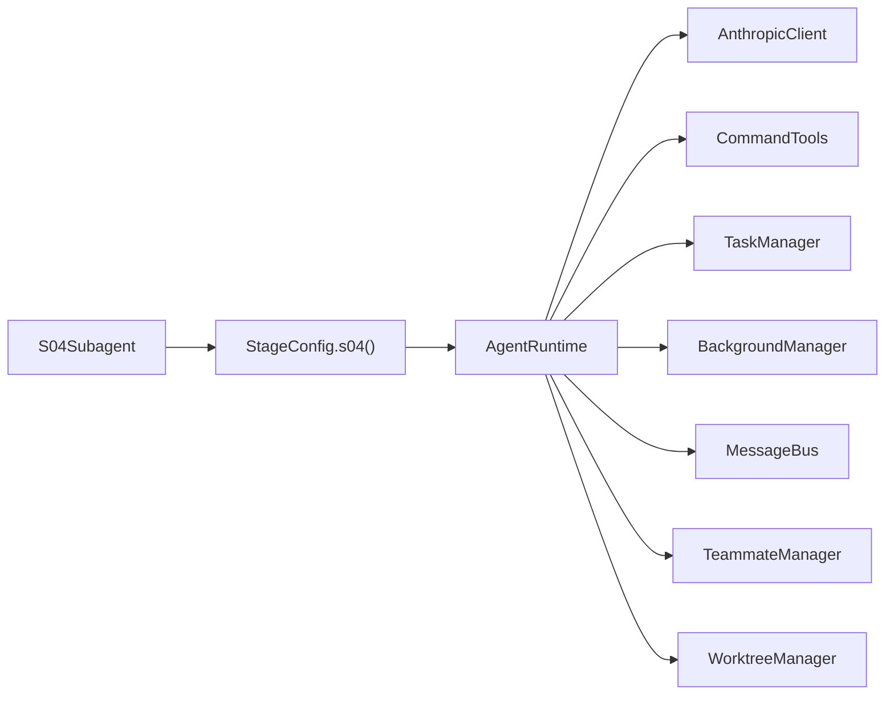

# S04: 子代理概念

<cite>
**本文引用的文件**
- [S04Subagent.java](file://src/main/java/com/learnclaudecode/agents/S04Subagent.java)
- [AgentRuntime.java](file://src/main/java/com/learnclaudecode/agents/AgentRuntime.java)
- [AppContext.java](file://src/main/java/com/learnclaudecode/agents/AppContext.java)
- [StageConfig.java](file://src/main/java/com/learnclaudecode/agents/StageConfig.java)
- [s04-subagent.tsx](file://web/src/components/visualizations/s04-subagent.tsx)
- [s04.json（场景）](file://web/src/data/scenarios/s04.json)
- [s04.json（注解）](file://web/src/data/annotations/s04.json)
</cite>

## 目录
1. [简介](#简介)
2. [项目结构](#项目结构)
3. [核心组件](#核心组件)
4. [架构总览](#架构总览)
5. [详细组件分析](#详细组件分析)
6. [依赖关系分析](#依赖关系分析)
7. [性能考虑](#性能考虑)
8. [故障排查指南](#故障排查指南)
9. [结论](#结论)
10. [附录：使用示例与最佳实践](#附录使用示例与最佳实践)

## 简介
本章节围绕“子代理”这一概念，系统性解释其设计模式、实现原理与使用方式。重点包括：
- 主代理与子代理的通信机制
- 生命周期管理与资源隔离
- AppContext 中的装配与 AgentRuntime 中的执行路径
- 上下文继承、数据共享与错误传播
- 多代理协作场景与性能考量

## 项目结构
S04 子代理能力由以下关键部分组成：
- 入口类：S04Subagent 启动 s04 阶段
- 运行时：AgentRuntime 负责消息循环、工具调度与子代理执行
- 配置：StageConfig 定义 s04 的工具集与系统提示词
- 可视化与场景：前端可视化展示父子上下文隔离；JSON 描述典型交互流程与决策说明

图表来源
- [S04Subagent.java:9-11](file://src/main/java/com/learnclaudecode/agents/S04Subagent.java#L9-L11)
- [StageConfig.java:115-122](file://src/main/java/com/learnclaudecode/agents/StageConfig.java#L115-L122)
- [AppContext.java:35-59](file://src/main/java/com/learnclaudecode/agents/AppContext.java#L35-L59)
- [AgentRuntime.java:97-123](file://src/main/java/com/learnclaudecode/agents/AgentRuntime.java#L97-L123)

章节来源
- [S04Subagent.java:1-12](file://src/main/java/com/learnclaudecode/agents/S04Subagent.java#L1-L12)
- [StageConfig.java:115-122](file://src/main/java/com/learnclaudecode/agents/StageConfig.java#L115-L122)
- [AppContext.java:16-69](file://src/main/java/com/learnclaudecode/agents/AppContext.java#L16-L69)
- [AgentRuntime.java:23-39](file://src/main/java/com/learnclaudecode/agents/AgentRuntime.java#L23-L39)

## 核心组件
- S04Subagent：最小可运行的子代理演示入口，委托给 Launcher 并传入 s04 阶段配置。
- StageConfig：以“能力开关 + 工具集 + 系统提示词”的方式编排 s04，新增 task 工具用于委派子任务。
- AgentRuntime：统一的消息循环与工具调度器，包含 runSubagent 实现子代理的独立上下文执行。
- AppContext：集中装配共享服务（命令、任务、后台、团队、worktree 等），最终产出 AgentRuntime。

章节来源
- [S04Subagent.java:9-11](file://src/main/java/com/learnclaudecode/agents/S04Subagent.java#L9-L11)
- [StageConfig.java:115-122](file://src/main/java/com/learnclaudecode/agents/StageConfig.java#L115-L122)
- [AgentRuntime.java:97-123](file://src/main/java/com/learnclaudecode/agents/AgentRuntime.java#L97-L123)
- [AgentRuntime.java:270-310](file://src/main/java/com/learnclaudecode/agents/AgentRuntime.java#L270-L310)
- [AppContext.java:35-59](file://src/main/java/com/learnclaudecode/agents/AppContext.java#L35-L59)

## 架构总览
子代理的核心思想是“分治”：将复杂问题拆分为若干独立子任务，每个子任务在独立的上下文内完成，最后将结果摘要回传给父代理，避免污染主上下文。

图表来源
- [AgentRuntime.java:131-261](file://src/main/java/com/learnclaudecode/agents/AgentRuntime.java#L131-L261)
- [AgentRuntime.java:270-310](file://src/main/java/com/learnclaudecode/agents/AgentRuntime.java#L270-L310)

## 详细组件分析

### 子代理的生命周期与上下文隔离
- 触发点：主循环中遇到 tool_use("task")，进入 runSubagent。
- 上下文隔离：子代理拥有全新的 messages[]，仅包含系统提示与委派任务描述，不继承父代理历史。
- 工具集裁剪：根据 writable 标志决定是否允许写操作，默认只读探索更安全。
- 终止条件：当模型不再请求 tool_use，即返回文本时，提取文本块拼接为摘要返回。
- 超时保护：最多固定轮次，防止无限循环。

图表来源
- [AgentRuntime.java:270-310](file://src/main/java/com/learnclaudecode/agents/AgentRuntime.java#L270-L310)

章节来源
- [AgentRuntime.java:270-310](file://src/main/java/com/learnclaudecode/agents/AgentRuntime.java#L270-L310)

### 主代理与子代理的通信机制
- 父代理通过 tool_use("task") 将任务委派给子代理，参数包含 prompt。
- 子代理完成后，以 tool_result 的形式将摘要回传至父代理的消息历史。
- 父代理基于该摘要继续推理，保持主上下文简洁。

图表来源
- [AgentRuntime.java:189-234](file://src/main/java/com/learnclaudecode/agents/AgentRuntime.java#L189-L234)
- [AgentRuntime.java:270-310](file://src/main/java/com/learnclaudecode/agents/AgentRuntime.java#L270-L310)

章节来源
- [AgentRuntime.java:189-234](file://src/main/java/com/learnclaudecode/agents/AgentRuntime.java#L189-L234)
- [AgentRuntime.java:270-310](file://src/main/java/com/learnclaudecode/agents/AgentRuntime.java#L270-L310)

### 资源隔离与安全策略
- 上下文隔离：子代理不继承父代理历史，避免无关信息占用上下文窗口。
- 工具权限：可通过 writable 控制是否允许写操作，降低误改风险。
- 递归限制：子代理工具集中不包含 task，防止无限委派。

章节来源
- [StageConfig.java:115-122](file://src/main/java/com/learnclaudecode/agents/StageConfig.java#L115-L122)
- [AgentRuntime.java:270-310](file://src/main/java/com/learnclaudecode/agents/AgentRuntime.java#L270-L310)

### AppContext 中的装配与扩展点
- AppContext 负责装配共享服务（命令、任务、后台、团队、worktree 等），并构造 AgentRuntime。
- 虽然当前 s04 未直接暴露“创建子代理”的方法，但通过 StageConfig 的 task 工具与 AgentRuntime 的 runSubagent，即可实现子代理能力。
- 若需扩展，可在 AppContext 中注入新的管理器或服务，并在 AgentRuntime 的工具分发中接入。

章节来源
- [AppContext.java:16-69](file://src/main/java/com/learnclaudecode/agents/AppContext.java#L16-L69)
- [AgentRuntime.java:40-90](file://src/main/java/com/learnclaudecode/agents/AgentRuntime.java#L40-L90)

## 依赖关系分析
- S04Subagent 依赖 StageConfig.s04() 提供工具与提示词。
- AgentRuntime 依赖 AnthropicClient、CommandTools、TaskManager、BackgroundManager、MessageBus、TeammateManager、WorktreeManager 等。
- StageConfig 提供 baseTools 与各阶段工具组合，s04 引入 task 工具。
- 前端可视化与 JSON 场景用于教学演示与理解。

图表来源
- [S04Subagent.java:9-11](file://src/main/java/com/learnclaudecode/agents/S04Subagent.java#L9-L11)
- [StageConfig.java:115-122](file://src/main/java/com/learnclaudecode/agents/StageConfig.java#L115-L122)
- [AgentRuntime.java:40-90](file://src/main/java/com/learnclaudecode/agents/AgentRuntime.java#L40-L90)

章节来源
- [S04Subagent.java:1-12](file://src/main/java/com/learnclaudecode/agents/S04Subagent.java#L1-L12)
- [StageConfig.java:115-122](file://src/main/java/com/learnclaudecode/agents/StageConfig.java#L115-L122)
- [AgentRuntime.java:40-90](file://src/main/java/com/learnclaudecode/agents/AgentRuntime.java#L40-L90)

## 性能考虑
- 上下文隔离减少父上下文膨胀，提升后续推理效率。
- 子代理工具集裁剪可降低模型决策空间，提高工具选择准确率。
- 固定轮次上限避免子代理长时间占用资源。
- 建议：对长任务优先拆分，让多个子代理并行处理不同子域，再汇总结果。

[本节为通用指导，不直接分析具体文件]

## 故障排查指南
- 子代理无输出：检查是否达到最大轮次或模型未返回 tool_use；确认子工具集是否正确构建。
- 写入失败：确认 writable 标志与工具权限；必要时放宽权限或调整工作区路径。
- 无限委派：确保子代理工具集中不包含 task，防止递归委派。
- 上下文污染：确认子代理使用独立 messages[]，不继承父代理历史。

章节来源
- [AgentRuntime.java:270-310](file://src/main/java/com/learnclaudecode/agents/AgentRuntime.java#L270-L310)
- [StageConfig.java:115-122](file://src/main/java/com/learnclaudecode/agents/StageConfig.java#L115-L122)

## 结论
S04 子代理通过“独立上下文 + 工具集裁剪 + 固定轮次”的设计，实现了安全、可控的分治执行。父代理只需关注任务分解与结果汇总，子代理专注单一子任务，整体架构清晰、可扩展性强。

[本节为总结性内容，不直接分析具体文件]

## 附录：使用示例与最佳实践

### 完整使用流程（从入口到执行）
- 启动：S04Subagent.main 调用 Launcher.launch(StageConfig.s04())。
- 配置：StageConfig.s04 添加 task 工具，设置系统提示词。
- 运行：AgentRuntime.runRepl 接收用户输入，进入 agentLoop。
- 委派：当模型返回 tool_use("task")，进入 runSubagent 创建子代理。
- 执行：子代理在独立上下文中执行工具，完成后返回摘要。
- 汇总：父代理将摘要作为 tool_result 继续推理。

章节来源
- [S04Subagent.java:9-11](file://src/main/java/com/learnclaudecode/agents/S04Subagent.java#L9-L11)
- [StageConfig.java:115-122](file://src/main/java/com/learnclaudecode/agents/StageConfig.java#L115-L122)
- [AgentRuntime.java:97-123](file://src/main/java/com/learnclaudecode/agents/AgentRuntime.java#L97-L123)
- [AgentRuntime.java:189-234](file://src/main/java/com/learnclaudecode/agents/AgentRuntime.java#L189-L234)
- [AgentRuntime.java:270-310](file://src/main/java/com/learnclaudecode/agents/AgentRuntime.java#L270-L310)

### 可视化与场景参考
- 前端可视化：s04-subagent.tsx 展示了父子上下文隔离、任务委派与摘要返回的过程。
- 场景数据：s04.json（场景）描述了典型的用户输入、工具调用与结果。
- 注解说明：s04.json（注解）解释了上下文隔离、工具过滤与禁止递归委派的设计决策。

章节来源
- [s04-subagent.tsx:13-67](file://web/src/components/visualizations/s04-subagent.tsx#L13-L67)
- [s04.json（场景）:1-52](file://web/src/data/scenarios/s04.json#L1-L52)
- [s04.json（注解）:1-48](file://web/src/data/annotations/s04.json#L1-L48)

### 多代理协作场景与性能优化
- 场景：父代理将大任务拆分为多个子任务，分别委派给子代理，最后汇总结果。
- 优化：合理设置子代理工具集（只读/受限写），控制轮次上限，避免上下文膨胀。
- 监控：通过日志与前端可视化观察子代理执行过程，定位瓶颈。

[本节为通用指导，不直接分析具体文件]