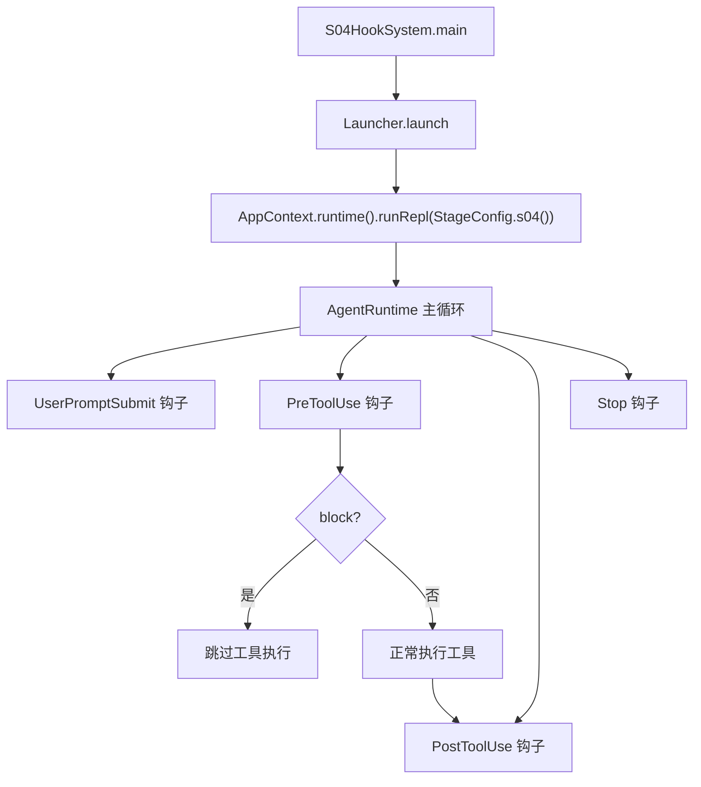
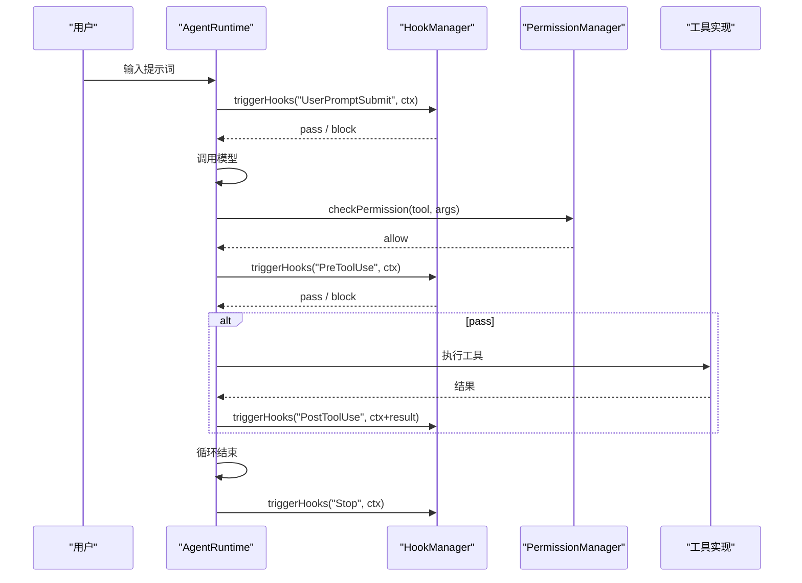

# S04: 钩子系统

<cite>
**本文引用的文件**
- [HookManager.java](file://src/main/java/com/learnclaudecode/hooks/HookManager.java)
- [HookContext.java](file://src/main/java/com/learnclaudecode/hooks/HookContext.java)
- [StageConfig.java](file://src/main/java/com/learnclaudecode/agents/StageConfig.java)
- [S04HookSystem.java](file://src/main/java/com/learnclaudecode/agents/S04HookSystem.java)
- [AgentRuntime.java](file://src/main/java/com/learnclaudecode/agents/AgentRuntime.java)
- [AppContext.java](file://src/main/java/com/learnclaudecode/agents/AppContext.java)
</cite>

## 目录
1. [简介](#简介)
2. [教学目标](#教学目标)
3. [项目结构](#项目结构)
4. [核心组件](#核心组件)
5. [架构总览](#架构总览)
6. [详细组件分析](#详细组件分析)
7. [工具列表](#工具列表)
8. [与前后阶段的关系](#与前后阶段的关系)
9. [故障排查指南](#故障排查指南)
10. [结论](#结论)

## 简介

> **座右铭："围绕循环挂钩子，而非重写循环"**

S03 的权限系统解决了"能不能做"的问题，但 Agent 运行时还有很多其他横切关注点：想记录每次工具调用的日志？想在用户提交提示词时做输入过滤？想在 Agent 停止时生成会话摘要？

如果每个需求都去修改 AgentRuntime 的主循环代码，运行时会迅速膨胀成不可维护的"上帝类"。S04 引入**钩子系统（Hook System）**，在 Agent 主循环的关键节点注册扩展逻辑，实现"不修改循环，只挂载行为"。

本阶段的核心问题是：**如何在不侵入运行时代码的前提下，为 Agent 的生命周期注入自定义行为？**

## 教学目标

完成本阶段学习后，你应当能够：

- 理解钩子（Hook）作为"生命周期扩展点"的设计思想
- 掌握四种钩子类型：PreToolUse / PostToolUse / UserPromptSubmit / Stop
- 理解 HookContext 如何为不同场景提供统一的上下文传递
- 掌握钩子的阻断机制（block 短路）
- 了解钩子与权限系统的区别与互补关系
- 能够解释"按注册顺序执行 + block 短路"的设计选择

## 项目结构

S04 的钩子能力由"阶段配置 + 钩子管理器 + 上下文记录 + 运行时触发"四部分构成：

- 阶段配置 `StageConfig.s04()` 在 S03 基础上启用 `enableHooks=true`，并暴露钩子管理工具
- `HookManager` 维护钩子注册表，负责触发与执行
- `HookContext` 是不可变 record，为钩子提供统一的上下文信息
- `AgentRuntime` 在主循环的关键节点调用 `triggerHooks`



**图表来源**
- [S04HookSystem.java](file://src/main/java/com/learnclaudecode/agents/S04HookSystem.java)
- [HookManager.java:149-163](file://src/main/java/com/learnclaudecode/hooks/HookManager.java#L149-L163)
- [AgentRuntime.java](file://src/main/java/com/learnclaudecode/agents/AgentRuntime.java)

**章节来源**
- [S04HookSystem.java](file://src/main/java/com/learnclaudecode/agents/S04HookSystem.java)
- [HookManager.java:1-221](file://src/main/java/com/learnclaudecode/hooks/HookManager.java#L1-L221)
- [HookContext.java:1-67](file://src/main/java/com/learnclaudecode/hooks/HookContext.java#L1-L67)

## 核心组件

- **HookManager**：钩子管理器，维护钩子注册表（CopyOnWriteArrayList），提供注册、列举、移除、触发能力
- **Hook**：钩子记录（record），包含 id（UUID 前 8 位）、type（钩子类型）、action（动作）
- **HookContext**：钩子执行上下文（record），携带 toolName、toolArgs、result，通过静态工厂方法构造
- **StageConfig.s04()**：启用 `enableHooks` 开关，暴露 `hook_register`、`hook_list`、`hook_remove` 工具

**章节来源**
- [HookManager.java:26-48](file://src/main/java/com/learnclaudecode/hooks/HookManager.java#L26-L48)
- [HookContext.java:15-19](file://src/main/java/com/learnclaudecode/hooks/HookContext.java#L15-L19)

## 架构总览

钩子系统在 Agent 主循环中的触发位置：



**关键设计**：权限检查（S03）在 PreToolUse 钩子之前执行。也就是说，先过"安检门"（权限），再过"自定义检查站"（钩子）。被权限 deny 的调用不会触发钩子。

**图表来源**
- [HookManager.java:149-163](file://src/main/java/com/learnclaudecode/hooks/HookManager.java#L149-L163)
- [AgentRuntime.java](file://src/main/java/com/learnclaudecode/agents/AgentRuntime.java)

## 详细组件分析

### 四种钩子类型

| 类型 | 触发时机 | 典型用途 | HookContext 内容 |
|------|---------|---------|-----------------|
| `PreToolUse` | 工具执行前（权限通过后） | 拦截危险操作、记录调用意图 | toolName + toolArgs, result=null |
| `PostToolUse` | 工具执行后 | 审计执行结果、统计耗时 | toolName + toolArgs + result |
| `UserPromptSubmit` | 用户提交提示词时 | 输入过滤、敏感词检测 | toolName=null, toolArgs={prompt: "..."} |
| `Stop` | Agent 循环结束时 | 清理资源、生成会话摘要 | toolName=null, result=停止原因 |

**章节来源**
- [HookManager.java:29-31](file://src/main/java/com/learnclaudecode/hooks/HookManager.java#L29-L31)
- [HookContext.java:28-65](file://src/main/java/com/learnclaudecode/hooks/HookContext.java#L28-L65)

### HookContext：统一的上下文传递

HookContext 是一个不可变 record，通过静态工厂方法为不同场景构造实例：

```java
public record HookContext(String toolName, Map<String, Object> toolArgs, String result) {
    public static HookContext preToolUse(String toolName, Map<String, Object> args) { ... }
    public static HookContext postToolUse(String toolName, Map<String, Object> args, String result) { ... }
    public static HookContext userPrompt(String prompt) { ... }
    public static HookContext stop(String reason) { ... }
}
```

设计要点：
- **不可变性**：record 天然不可变，钩子无法篡改上下文影响后续钩子
- **统一接口**：所有钩子类型共用同一个 Context 结构，简化了 triggerHooks 的调用方式
- **null 语义**：toolName 为 null 表示非工具相关场景（UserPromptSubmit / Stop）

**章节来源**
- [HookContext.java:15-66](file://src/main/java/com/learnclaudecode/hooks/HookContext.java#L15-L66)

### HookManager：触发与短路机制

`triggerHooks(type, context)` 是运行时的核心调用入口：

```java
public String triggerHooks(String type, HookContext context) {
    List<Hook> matched = getHooksForType(type);
    if (matched.isEmpty()) return "pass";
    for (Hook hook : matched) {
        String result = executeHook(hook, context);
        if (result.startsWith("block")) return result;  // 短路！
    }
    return "pass";
}
```

**短路语义**：按注册顺序执行，任一钩子返回 `block` 则立即停止，不再执行后续钩子。这保证了"最严格的钩子优先"——如果第一个钩子就决定拦截，后续钩子无需浪费执行。

### 三种内置动作

| 动作 | 行为 | 返回值 |
|------|------|--------|
| `log` | 输出工具名和参数到 stdout | pass |
| `block` | 输出拦截原因，阻止工具执行 | block: reason |
| `audit` | 输出工具名、参数和结果（截断 80 字符） | pass |

自定义动作（非 log/block/audit）被视为描述性标签，仅输出日志，默认 pass。

**章节来源**
- [HookManager.java:149-205](file://src/main/java/com/learnclaudecode/hooks/HookManager.java#L149-L205)

### 钩子的生命周期管理

- **registerHook(type, action)**：生成 UUID 前 8 位作为 ID，验证 type 合法性，追加到列表末尾
- **removeHook(hookId)**：按 ID 精确移除，支持运行时动态卸载钩子
- **listHooks()**：格式化输出所有钩子，用 `[LOG]`/`[BLK]`/`[AUD]`/`[CST]` 图标区分动作类型

钩子存储在 `CopyOnWriteArrayList` 中，读操作（triggerHooks 遍历）无锁，写操作（register/remove）加 synchronized。

**章节来源**
- [HookManager.java:60-118](file://src/main/java/com/learnclaudecode/hooks/HookManager.java#L60-L118)

## 工具列表

S04 阶段在 S03 的工具基础上新增以下钩子管理工具：

| 工具名 | 功能 | 关键参数 |
|--------|------|---------|
| `hook_register` | 注册一个新钩子 | type(PreToolUse/PostToolUse/UserPromptSubmit/Stop), action(log/block/audit/自定义) |
| `hook_list` | 列出所有已注册钩子 | 无 |
| `hook_remove` | 按 ID 移除钩子 | hook_id |

**使用示例**：

```
用户：记录每次 bash 调用
Agent 调用：hook_register(type="PreToolUse", action="log")
返回：Hook registered: id=a3f7b2c1, type=PreToolUse, action=log

用户：禁止所有 write_file 操作
Agent 调用：hook_register(type="PreToolUse", action="block")
返回：Hook registered: id=e9d4c8f2, type=PreToolUse, action=block
```

**章节来源**
- [StageConfig.java](file://src/main/java/com/learnclaudecode/agents/StageConfig.java)
- [HookManager.java:60-118](file://src/main/java/com/learnclaudecode/hooks/HookManager.java#L60-L118)

## 与前后阶段的关系

### 前置阶段

- **S03（权限系统）**：权限是"硬规则"（deny 不可绕过），钩子是"软扩展"（可注册可移除）。权限检查在钩子之前执行，二者形成"先安检、再自定义"的双层防护

### 后续阶段

- **S05（Todo 规划）**：todo 工具的调用会触发 PreToolUse/PostToolUse 钩子，可用于审计任务规划行为
- **S08（上下文压缩）**：压缩操作可通过 Stop 钩子在会话结束时自动触发
- **S13（多 Agent 协作）**：队友 spawn 和消息发送可通过钩子进行审计
- **S15（集成运行时）**：全部钩子类型在完整系统中协同工作
- **S17（目标循环）**：GoalController 本质上是一个"会话级 Stop hook"——每轮结束时评判目标是否达成，与 Stop 钩子的设计思想一脉相承

### 设计演进

```
S03: 权限系统（硬拦截：allow/deny/confirm）
S04: 钩子系统（软扩展：log/block/audit） ← 你在这里
S17: 目标循环（会话级 Stop hook 的特化应用）
```

**章节来源**
- [StageConfig.java](file://src/main/java/com/learnclaudecode/agents/StageConfig.java)
- [AgentRuntime.java](file://src/main/java/com/learnclaudecode/agents/AgentRuntime.java)

## 故障排查指南

| 现象 | 可能原因 | 定位方法 |
|------|---------|---------|
| 注册钩子返回 "invalid hook type" | type 不是四种合法类型之一 | 检查拼写：PreToolUse / PostToolUse / UserPromptSubmit / Stop |
| 钩子注册成功但未触发 | 钩子类型与当前触发点不匹配 | 调用 hook_list 确认类型；检查 enableHooks 是否开启 |
| block 钩子未拦截工具 | 权限系统已先 deny 了该调用 | 权限 deny 不会触发钩子；检查 permission_list |
| 多个钩子只执行了第一个 | 第一个钩子返回 block 触发短路 | 调整注册顺序，或移除 block 钩子 |
| removeHook 返回 "no hook found" | ID 拼写错误或钩子已被移除 | 调用 hook_list 查看当前有效 ID |

**章节来源**
- [HookManager.java:60-163](file://src/main/java/com/learnclaudecode/hooks/HookManager.java#L60-L163)

## 结论

S04 通过钩子系统实现了"围绕循环挂钩子，而非重写循环"的扩展模式。四种钩子类型覆盖了 Agent 生命周期的关键节点，HookContext 提供了统一的上下文传递，block 短路机制保证了拦截的即时性。

关键设计决策：
- **纯内存存储**：钩子随进程生命周期存在，重启后需重新注册（适合教学演示）
- **UUID 标识**：每个钩子有唯一 ID，支持精确移除
- **短路执行**：block 立即终止后续钩子，避免无意义的执行开销
- **与权限互补**：权限是静态规则（配置驱动），钩子是动态行为（代码驱动）；权限先行，钩子后置

钩子系统是 Agent 架构中"开闭原则"的典型体现：对扩展开放（注册新钩子），对修改关闭（不改 AgentRuntime 代码）。这为后续阶段（S17 目标循环）的"会话级 Stop hook"设计奠定了思想基础。
