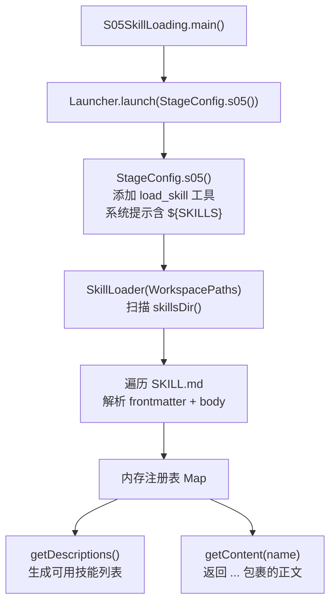
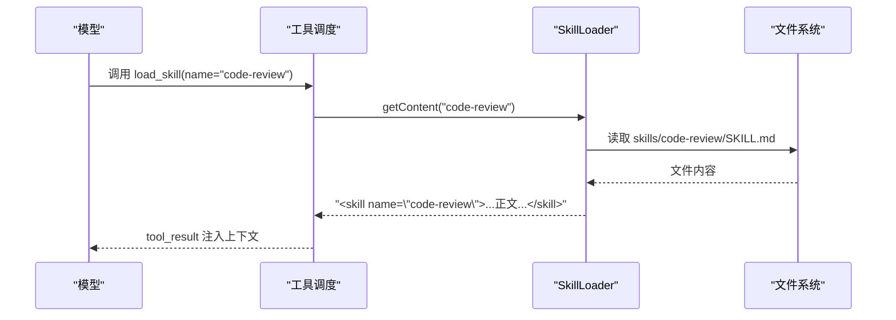
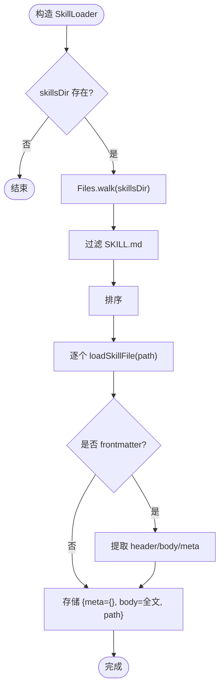
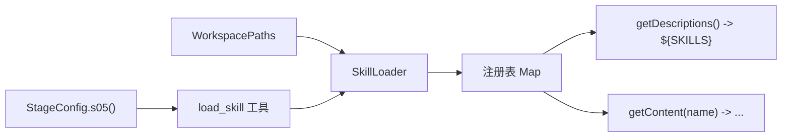

# S05: 技能加载系统

<cite>
**本文引用的文件**
- [SkillLoader.java](file://src/main/java/com/learnclaudecode/skills/SkillLoader.java)
- [WorkspacePaths.java](file://src/main/java/com/learnclaudecode/common/WorkspacePaths.java)
- [StageConfig.java](file://src/main/java/com/learnclaudecode/agents/StageConfig.java)
- [S05SkillLoading.java](file://src/main/java/com/learnclaudecode/agents/S05SkillLoading.java)
- [SKILL.md（agent-builder）](file://skills/agent-builder/SKILL.md)
- [SKILL.md（code-review）](file://skills/code-review/SKILL.md)
- [SKILL.md（mcp-builder）](file://skills/mcp-builder/SKILL.md)
- [SKILL.md（pdf）](file://skills/pdf/SKILL.md)
- [s05.json（场景数据）](file://web/src/data/scenarios/s05.json)
- [s05.json（设计决策注解）](file://web/src/data/annotations/s05.json)
- [s05-skill-loading.tsx（可视化组件）](file://web/src/components/visualizations/s05-skill-loading.tsx)
</cite>

## 目录
1. [简介](#简介)
2. [项目结构](#项目结构)
3. [核心组件](#核心组件)
4. [架构总览](#架构总览)
5. [详细组件分析](#详细组件分析)
6. [依赖关系分析](#依赖关系分析)
7. [性能考量](#性能考量)
8. [故障排查指南](#故障排查指南)
9. [结论](#结论)
10. [附录：自定义技能开发指南与最佳实践](#附录自定义技能开发指南与最佳实践)

## 简介
本章节面向“S05 技能加载系统”，目标是解释如何通过动态发现、解析和注入 SKILL.md 文件，为 Agent 提供按需的专业知识。该系统采用“两层架构”：
- 第一层：启动时扫描 skills 目录，仅读取每个技能的 frontmatter（名称、描述等），生成精简的技能列表，注入到系统提示词中，保持上下文轻量且可缓存。
- 第二层：运行时由模型决定需要某个技能时，调用 load_skill 工具，将对应 SKILL.md 的正文内容以 tool_result 的形式注入上下文，避免污染系统提示词并提升缓存命中率。

该机制支持多技能叠加、按名检索、错误回退，以及可扩展的元数据字段，便于教学与实战扩展。

## 项目结构
S05 相关代码位于 Java 后端与前端可视化两部分：
- 后端核心：SkillLoader 负责扫描与解析；WorkspacePaths 提供安全路径访问；StageConfig.s05() 定义工具与系统提示词模板；S05SkillLoading 作为入口。
- 技能文件：skills 目录下每个子目录包含一个 SKILL.md，约定 frontmatter + Markdown 正文。
- 前端可视化：演示两层架构、token 消耗与步骤流程。

图表来源
- [S05SkillLoading.java:9-11](file://src/main/java/com/learnclaudecode/agents/S05SkillLoading.java#L9-L11)
- [StageConfig.java:129-135](file://src/main/java/com/learnclaudecode/agents/StageConfig.java#L129-L135)
- [SkillLoader.java:26-38](file://src/main/java/com/learnclaudecode/skills/SkillLoader.java#L26-L38)
- [SkillLoader.java:45-72](file://src/main/java/com/learnclaudecode/skills/SkillLoader.java#L45-L72)
- [SkillLoader.java:79-104](file://src/main/java/com/learnclaudecode/skills/SkillLoader.java#L79-L104)
- [WorkspacePaths.java:123-125](file://src/main/java/com/learnclaudecode/common/WorkspacePaths.java#L123-L125)

章节来源
- [S05SkillLoading.java:1-12](file://src/main/java/com/learnclaudecode/agents/S05SkillLoading.java#L1-L12)
- [StageConfig.java:129-135](file://src/main/java/com/learnclaudecode/agents/StageConfig.java#L129-L135)
- [SkillLoader.java:1-106](file://src/main/java/com/learnclaudecode/skills/SkillLoader.java#L1-L106)
- [WorkspacePaths.java:115-125](file://src/main/java/com/learnclaudecode/common/WorkspacePaths.java#L115-L125)

## 核心组件
- SkillLoader：扫描 skills 目录，解析 SKILL.md 的 frontmatter 与正文，维护内存中的技能注册表，并提供摘要与全文获取能力。
- WorkspacePaths：提供安全的相对路径解析与 skillsDir() 等目录访问方法，确保不越权访问工作区外文件。
- StageConfig.s05()：构建 s05 阶段的工具集与系统提示词，注入 load_skill 工具与 ${SKILLS} 占位符，用于展示可用技能列表。
- S05SkillLoading：示例入口，启动 s05 阶段配置。

章节来源
- [SkillLoader.java:15-104](file://src/main/java/com/learnclaudecode/skills/SkillLoader.java#L15-L104)
- [WorkspacePaths.java:36-49](file://src/main/java/com/learnclaudecode/common/WorkspacePaths.java#L36-L49)
- [WorkspacePaths.java:115-125](file://src/main/java/com/learnclaudecode/common/WorkspacePaths.java#L115-L125)
- [StageConfig.java:129-135](file://src/main/java/com/learnclaudecode/agents/StageConfig.java#L129-L135)
- [S05SkillLoading.java:9-11](file://src/main/java/com/learnclaudecode/agents/S05SkillLoading.java#L9-L11)

## 架构总览
S05 采用“两层架构”实现技能的知识注入：
- 层一（常驻）：启动时扫描所有 SKILL.md 的 frontmatter，生成简短的技能列表，注入系统提示词。此列表很小且稳定，利于 API 提供商缓存。
- 层二（按需）：当模型识别到需要某项专业技能时，调用 load_skill 工具，SkillLoader.getContent(name) 返回被 <skill> 标签包裹的正文内容，作为 tool_result 注入上下文。

图表来源
- [StageConfig.java:129-135](file://src/main/java/com/learnclaudecode/agents/StageConfig.java#L129-L135)
- [SkillLoader.java:98-104](file://src/main/java/com/learnclaudecode/skills/SkillLoader.java#L98-L104)
- [SkillLoader.java:45-72](file://src/main/java/com/learnclaudecode/skills/SkillLoader.java#L45-L72)

## 详细组件分析

### SkillLoader：动态技能发现与解析
- 扫描策略：通过 WorkspacePaths.skillsDir() 定位 skills 目录，使用 Files.walk 递归遍历，过滤出名为 SKILL.md 的文件，并按路径排序后逐个加载。
- 解析逻辑：若文件以 "---\n" 开头，则视为包含 frontmatter；找到第二个分隔符后的正文部分，并将键值对（如 name、description）解析为元数据。
- 注册表：以技能名为键，存储 meta、body、path 三要素，供后续 getDescriptions 与 getContent 使用。
- 摘要与全文：
  - getDescriptions：遍历注册表，输出“名称: 描述”的简要列表，用于系统提示词中的 ${SKILLS}。
  - getContent：根据名称查找技能，若不存在返回错误信息；存在则返回被 <skill> 标签包裹的正文。

图表来源
- [SkillLoader.java:26-38](file://src/main/java/com/learnclaudecode/skills/SkillLoader.java#L26-L38)
- [SkillLoader.java:45-72](file://src/main/java/com/learnclaudecode/skills/SkillLoader.java#L45-L72)

章节来源
- [SkillLoader.java:26-72](file://src/main/java/com/learnclaudecode/skills/SkillLoader.java#L26-L72)
- [SkillLoader.java:79-104](file://src/main/java/com/learnclaudecode/skills/SkillLoader.java#L79-L104)

### WorkspacePaths：安全路径与目录访问
- safeResolve：将相对路径在工作区内规范化，防止 ../ 逃逸。
- skillsDir：返回 workdir/skills 目录，供 SkillLoader 扫描。
- readText/writeText：统一编码与安全校验的文件读写。

章节来源
- [WorkspacePaths.java:36-49](file://src/main/java/com/learnclaudecode/common/WorkspacePaths.java#L36-L49)
- [WorkspacePaths.java:115-125](file://src/main/java/com/learnclaudecode/common/WorkspacePaths.java#L115-L125)

### StageConfig.s05()：工具与系统提示词
- 工具：在基础工具之上增加 load_skill(name)，输入 schema 要求 name 字符串。
- 系统提示词：包含 ${SKILLS} 占位符，运行时将被替换为 SkillLoader.getDescriptions() 的输出，使模型知晓可用技能及其描述。

章节来源
- [StageConfig.java:129-135](file://src/main/java/com/learnclaudecode/agents/StageConfig.java#L129-L135)

### S05SkillLoading：示例入口
- main 方法直接调用 Launcher.launch(StageConfig.s05())，启动 s05 阶段。

章节来源
- [S05SkillLoading.java:9-11](file://src/main/java/com/learnclaudecode/agents/S05SkillLoading.java#L9-L11)

### 技能文件格式规范（SKILL.md）
- 约定：每个技能一个目录，内含 SKILL.md 作为入口。
- Frontmatter：以 "---\n" 开始，键值行形如 key: value，当前实现支持 name、description 等关键字段。
- 正文：frontmatter 之后的 Markdown 文本，作为指令或知识库内容，按需注入上下文。
- 示例：
  - agent-builder：包含丰富的设计理念与实践建议。
  - code-review：结构化审查清单与输出格式。
  - mcp-builder：MCP 服务器快速入门与最佳实践。
  - pdf：PDF 处理命令与编程方式。

章节来源
- [SKILL.md（agent-builder）:1-130](file://skills/agent-builder/SKILL.md#L1-L130)
- [SKILL.md（code-review）:1-99](file://skills/code-review/SKILL.md#L1-L99)
- [SKILL.md（mcp-builder）:1-49](file://skills/mcp-builder/SKILL.md#L1-L49)
- [SKILL.md（pdf）:1-50](file://skills/pdf/SKILL.md#L1-L50)

### 生命周期管理
- 启动期：SkillLoader 构造时扫描并解析所有 SKILL.md，建立内存注册表。
- 运行期：模型通过 load_skill 工具按需获取技能正文，注入 tool_result。
- 销毁期：进程退出时内存释放，无持久化状态。

章节来源
- [SkillLoader.java:26-38](file://src/main/java/com/learnclaudecode/skills/SkillLoader.java#L26-L38)
- [SkillLoader.java:98-104](file://src/main/java/com/learnclaudecode/skills/SkillLoader.java#L98-L104)

## 依赖关系分析
- SkillLoader 依赖 WorkspacePaths 提供的 skillsDir() 进行目录定位。
- StageConfig.s05() 提供工具定义与系统提示词模板，驱动模型调用 load_skill。
- 前端可视化组件基于场景数据与步骤动画，演示两层架构与 token 消耗。

图表来源
- [WorkspacePaths.java:123-125](file://src/main/java/com/learnclaudecode/common/WorkspacePaths.java#L123-L125)
- [StageConfig.java:129-135](file://src/main/java/com/learnclaudecode/agents/StageConfig.java#L129-L135)
- [SkillLoader.java:19-104](file://src/main/java/com/learnclaudecode/skills/SkillLoader.java#L19-L104)

章节来源
- [SkillLoader.java:19-104](file://src/main/java/com/learnclaudecode/skills/SkillLoader.java#L19-L104)
- [StageConfig.java:129-135](file://src/main/java/com/learnclaudecode/agents/StageConfig.java#L129-L135)
- [WorkspacePaths.java:123-125](file://src/main/java/com/learnclaudecode/common/WorkspacePaths.java#L123-L125)

## 性能考量
- 启动开销：仅读取 frontmatter，避免加载完整正文，显著降低初始上下文大小。
- 缓存友好：系统提示词静态且稳定，API 提供商可缓存；动态内容通过 tool_result 注入，不影响缓存。
- 按需加载：仅在模型判断需要时加载具体技能正文，减少无关指令对模型的干扰。
- 资源限制：大文件或多技能叠加时，注意上下文窗口与 token 成本；可通过精简正文与合理拆分技能控制。

章节来源
- [s05.json（设计决策注解）:1-48](file://web/src/data/annotations/s05.json#L1-L48)
- [s05-skill-loading.tsx:61-95](file://web/src/components/visualizations/s05-skill-loading.tsx#L61-L95)

## 故障排查指南
- 未知技能名：getContent 返回错误信息与可用技能列表，检查技能名是否与目录名或 frontmatter name 一致。
- 文件读取异常：IOException 被忽略，确认文件权限与编码（UTF-8）。
- 路径越界：safeResolve 会抛出非法参数异常，确保相对路径未尝试逃逸工作区。
- 空技能目录：getDescriptions 返回“(no skills available)”，检查 skillsDir 是否存在及是否有 SKILL.md。

章节来源
- [SkillLoader.java:98-104](file://src/main/java/com/learnclaudecode/skills/SkillLoader.java#L98-L104)
- [WorkspacePaths.java:42-49](file://src/main/java/com/learnclaudecode/common/WorkspacePaths.java#L42-L49)

## 结论
S05 技能加载系统通过“两层架构”实现了高效、可缓存、按需注入的专业知识机制。它利用 SKILL.md 的 frontmatter 与正文分离，既保证了启动时的轻量与稳定，又提供了运行时的灵活扩展。结合工具调用与系统提示词占位符，模型能够自主决定何时加载何种技能，从而在不牺牲性能的前提下获得强大的领域能力。

## 附录：自定义技能开发指南与最佳实践

### 技能接口设计与实现规范
- 目录结构：在 skills 下新建技能目录，并在其中创建 SKILL.md。
- Frontmatter 字段：至少包含 name 与 description；可扩展其他字段（如 globs、version 等），但需确保解析兼容。
- 正文组织：清晰分节，提供操作步骤、命令示例、注意事项；避免冗余，聚焦任务所需知识。
- 命名约定：name 应与目录名一致，便于识别与管理。

章节来源
- [SKILL.md（code-review）:1-4](file://skills/code-review/SKILL.md#L1-L4)
- [SKILL.md（pdf）:1-4](file://skills/pdf/SKILL.md#L1-L4)

### 测试方法
- 单元测试思路：
  - 验证扫描：构造 WorkspacePaths 指向测试目录，断言 SkillLoader 能发现指定数量的 SKILL.md。
  - 解析验证：针对含 frontmatter 的文件，断言 meta 字段正确提取；针对无 frontmatter 的文件，断言 name 回退为目录名。
  - 摘要与全文：断言 getDescriptions 输出格式；断言 getContent 返回 <skill> 包裹内容与错误回退。
- 集成测试思路：
  - 模拟模型调用 load_skill，验证 tool_result 注入上下文的行为。
  - 验证系统提示词中 ${SKILLS} 占位符替换结果。

章节来源
- [SkillLoader.java:26-72](file://src/main/java/com/learnclaudecode/skills/SkillLoader.java#L26-L72)
- [SkillLoader.java:79-104](file://src/main/java/com/learnclaudecode/skills/SkillLoader.java#L79-L104)

### 热重载、依赖管理与冲突解决
- 热重载：当前实现为进程内内存注册表，重启进程即可重新扫描；如需热重载，可在外部触发重新构造 SkillLoader 并替换实例。
- 依赖管理：SKILL.md 正文可引用外部工具或脚本，建议在正文中明确依赖与环境要求；必要时在 frontmatter 增加 version 字段以便版本控制。
- 冲突解决：同名技能以最后加载为准（Map 覆盖）；建议通过唯一 name 与目录隔离避免冲突。

章节来源
- [SkillLoader.java:64-69](file://src/main/java/com/learnclaudecode/skills/SkillLoader.java#L64-L69)

### 实际技能开发示例与部署最佳实践
- 示例参考：
  - agent-builder：展示如何组织复杂知识与理念。
  - code-review：结构化清单与输出格式，便于自动化与人工审阅。
  - mcp-builder：快速上手 MCP 服务器的最小示例。
  - pdf：命令行与编程方式的 PDF 处理实践。
- 部署最佳实践：
  - 将技能目录纳入版本控制，确保团队共享。
  - 保持 frontmatter 精简，正文聚焦任务；避免过大文件导致上下文膨胀。
  - 在系统提示词中使用 ${SKILLS} 展示可用技能，引导模型按需加载。
  - 监控 token 消耗与上下文长度，必要时拆分技能或优化正文。

章节来源
- [SKILL.md（agent-builder）:1-130](file://skills/agent-builder/SKILL.md#L1-L130)
- [SKILL.md（code-review）:1-99](file://skills/code-review/SKILL.md#L1-L99)
- [SKILL.md（mcp-builder）:1-49](file://skills/mcp-builder/SKILL.md#L1-L49)
- [SKILL.md（pdf）:1-50](file://skills/pdf/SKILL.md#L1-L50)
- [StageConfig.java:129-135](file://src/main/java/com/learnclaudecode/agents/StageConfig.java#L129-L135)