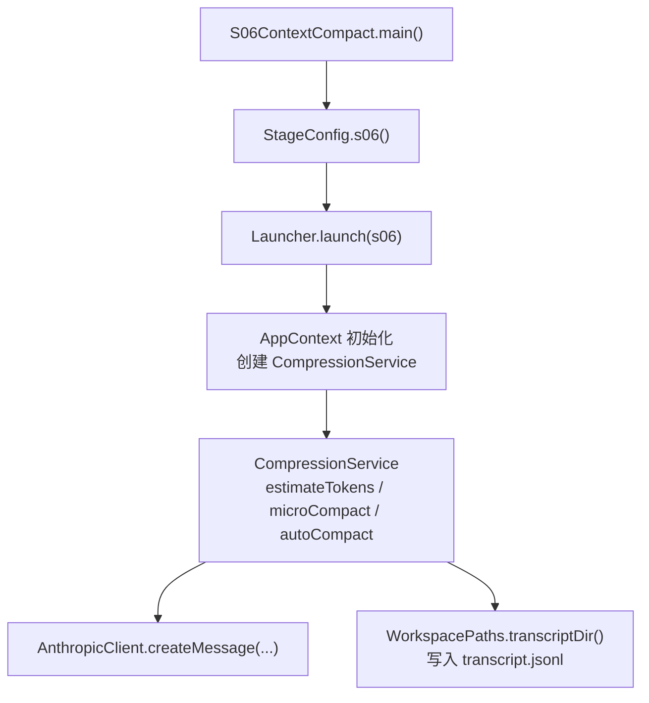
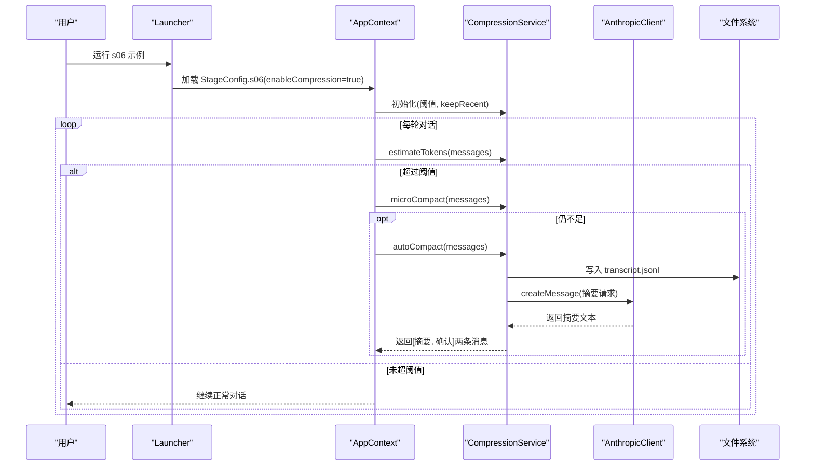
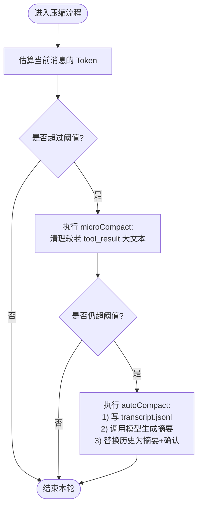
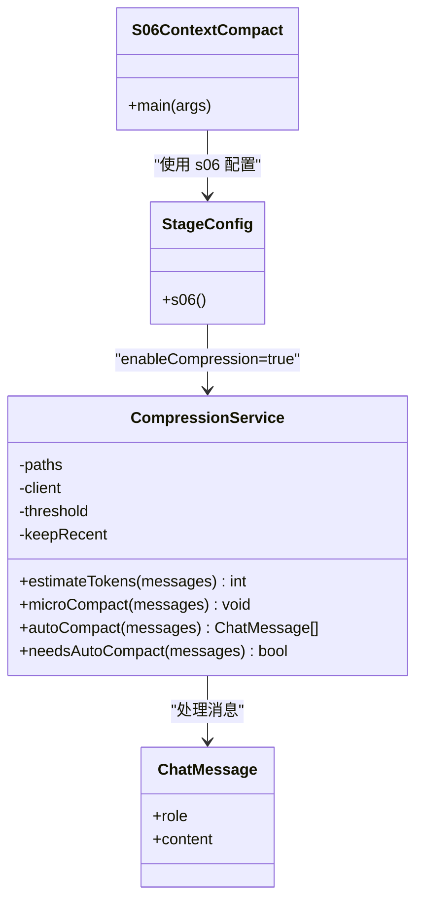
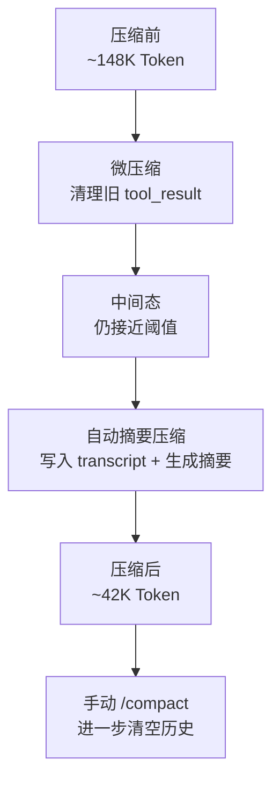

# S06: 上下文压缩

<cite>
**本文引用的文件**
- [S06ContextCompact.java](file://src/main/java/com/learnclaudecode/agents/S06ContextCompact.java)
- [CompressionService.java](file://src/main/java/com/learnclaudecode/context/CompressionService.java)
- [StageConfig.java](file://src/main/java/com/learnclaudecode/agents/StageConfig.java)
- [ChatMessage.java](file://src/main/java/com/learnclaudecode/model/ChatMessage.java)
- [s06-context-compact.tsx](file://web/src/components/visualizations/s06-context-compact.tsx)
- [s06.json（场景）](file://web/src/data/scenarios/s06.json)
- [s06.json（注解）](file://web/src/data/annotations/s06.json)
</cite>

## 目录
1. [简介](#简介)
2. [项目结构](#项目结构)
3. [核心组件](#核心组件)
4. [架构总览](#架构总览)
5. [详细组件分析](#详细组件分析)
6. [依赖关系分析](#依赖关系分析)
7. [性能与效果对比](#性能与效果对比)
8. [故障排查指南](#故障排查指南)
9. [结论](#结论)
10. [附录](#附录)

## 简介
本章节面向“S06 上下文压缩”主题，系统性说明 CompressionService 的智能压缩算法：对话历史分析、关键信息提取与冗余内容过滤；解释压缩策略的配置项（阈值、保留策略等）；给出压缩前后消息数量与 Token 消耗的对比；评估压缩对对话质量的影响并提供优化调优方法；并总结不同场景下的策略选择与基准测试要点。

## 项目结构
S06 的入口是一个示例程序，通过阶段配置启用压缩能力，并在运行时由服务层完成三层压缩：微压缩、自动摘要压缩、以及用户触发的深度压缩。前端可视化组件用于演示三阶段压缩过程与窗口占用变化。

图表来源
- [S06ContextCompact.java:9-11](file://src/main/java/com/learnclaudecode/agents/S06ContextCompact.java#L9-L11)
- [StageConfig.java:142-149](file://src/main/java/com/learnclaudecode/agents/StageConfig.java#L142-L149)
- [CompressionService.java:43-48](file://src/main/java/com/learnclaudecode/context/CompressionService.java#L43-L48)
- [CompressionService.java:118-160](file://src/main/java/com/learnclaudecode/context/CompressionService.java#L118-L160)

章节来源
- [S06ContextCompact.java:1-12](file://src/main/java/com/learnclaudecode/agents/S06ContextCompact.java#L1-L12)
- [StageConfig.java:137-149](file://src/main/java/com/learnclaudecode/agents/StageConfig.java#L137-L149)

## 核心组件
- 入口与编排
  - S06ContextCompact：启动 s06 阶段，启用 enableCompression=true，并暴露 compact 工具供用户手动触发压缩。
  - StageConfig.s06：定义 s06 的工具集与系统提示，开启压缩开关。
- 压缩服务
  - CompressionService：实现三层压缩策略（微压缩、自动摘要压缩、手动压缩），提供 token 估算、阈值判断、落盘归档等能力。
- 数据模型
  - ChatMessage：统一的消息载体，content 支持文本或结构化 tool_result 列表。

章节来源
- [S06ContextCompact.java:1-12](file://src/main/java/com/learnclaudecode/agents/S06ContextCompact.java#L1-L12)
- [StageConfig.java:137-149](file://src/main/java/com/learnclaudecode/agents/StageConfig.java#L137-L149)
- [CompressionService.java:18-48](file://src/main/java/com/learnclaudecode/context/CompressionService.java#L18-L48)
- [ChatMessage.java:1-8](file://src/main/java/com/learnclaudecode/model/ChatMessage.java#L1-L8)

## 架构总览
S06 采用“三层压缩”的渐进式策略：
- 第一层：micro compact（微压缩）——清理较老的 tool_result 大文本，保留最近若干条完整结果，降低上下文体积但尽量不丢失近期细节。
- 第二层：auto compact（自动摘要压缩）——当估算 token 超过阈值时，将完整历史转存到磁盘 JSONL，再调用模型生成摘要，用“摘要 + 确认消息”替换旧历史。
- 第三层：/compact（手动压缩）——用户主动触发，进行更激进的压缩，清空大部分历史，仅保留必要上下文。

图表来源
- [CompressionService.java:56-60](file://src/main/java/com/learnclaudecode/context/CompressionService.java#L56-L60)
- [CompressionService.java:69-106](file://src/main/java/com/learnclaudecode/context/CompressionService.java#L69-L106)
- [CompressionService.java:118-160](file://src/main/java/com/learnclaudecode/context/CompressionService.java#L118-L160)
- [StageConfig.java:142-149](file://src/main/java/com/learnclaudecode/agents/StageConfig.java#L142-L149)

## 详细组件分析

### 压缩服务：CompressionService
- 设计目标
  - 解决 Agent 对话过长导致上下文窗口超限的问题。
  - 采用分层处理：先做轻量清理，再在必要时做全文摘要压缩，最后支持用户手动深度压缩。
- 关键能力
  - 估算 Token：使用 JSON 长度近似估算，便于快速判断是否接近上限。
  - 微压缩：遍历 user 消息中的结构化 content，定位 type=tool_result 的块，按从旧到新顺序，仅清理较早的大文本为占位符，保留最近若干条完整结果。
  - 自动摘要压缩：将完整历史原样落盘为 JSONL，构造摘要提示词，调用模型生成摘要，并以“摘要 + 确认消息”替换旧历史。
  - 阈值判断：根据估算 Token 与配置的 threshold 比较，决定是否触发自动压缩。
- 复杂度与影响
  - 微压缩时间复杂度 O(N)，N 为消息数；主要开销在于遍历与条件判断。
  - 自动摘要压缩涉及 I/O 与一次 LLM 调用，成本较高，但能显著减少后续上下文大小。
  - 错误处理：文件写入失败会抛出异常，确保异常可观测。

图表来源
- [CompressionService.java:56-60](file://src/main/java/com/learnclaudecode/context/CompressionService.java#L56-L60)
- [CompressionService.java:69-106](file://src/main/java/com/learnclaudecode/context/CompressionService.java#L69-L106)
- [CompressionService.java:118-160](file://src/main/java/com/learnclaudecode/context/CompressionService.java#L118-L160)

章节来源
- [CompressionService.java:18-172](file://src/main/java/com/learnclaudecode/context/CompressionService.java#L18-L172)

### 入口与配置：S06ContextCompact 与 StageConfig
- S06ContextCompact：作为示例入口，调用 Launcher 并传入 s06 阶段配置。
- StageConfig.s06：
  - 启用 enableCompression=true。
  - 增加 compact 工具，允许用户手动触发压缩。
  - 基础工具包含 bash、read_file、write_file、edit_file。

章节来源
- [S06ContextCompact.java:1-12](file://src/main/java/com/learnclaudecode/agents/S06ContextCompact.java#L1-L12)
- [StageConfig.java:137-149](file://src/main/java/com/learnclaudecode/agents/StageConfig.java#L137-L149)

### 数据模型：ChatMessage
- 角色 role：user/assistant 等。
- 内容 content：支持字符串或结构化列表（如 tool_result 片段），便于压缩逻辑精准定位与处理。

章节来源
- [ChatMessage.java:1-8](file://src/main/java/com/learnclaudecode/model/ChatMessage.java#L1-L8)

### 可视化与场景：前端演示与示例数据
- 可视化组件 s06-context-compact.tsx：
  - 展示上下文窗口填充率、Token 用量、消息类型图例。
  - 分步骤演示三个阶段：Growing Context → Micro-Compact → Auto-Compact → /compact。
  - 通过动画与颜色标识被压缩的 tool_result 块。
- 场景数据 s06.json：
  - 描述一个会产生大量上下文的任务（读取与分析多个 Python 文件）。
  - 标注压缩触发时机与效果（例如从约 148K 降至约 42K）。

章节来源
- [s06-context-compact.tsx:1-451](file://web/src/components/visualizations/s06-context-compact.tsx#L1-L451)
- [s06.json（场景）:1-52](file://web/src/data/scenarios/s06.json#L1-L52)

## 依赖关系分析
- 模块耦合
  - S06ContextCompact 依赖 StageConfig 以获取 s06 的能力配置。
  - AppContext（由 Launcher 管理）负责装配 CompressionService，并注入 WorkspacePaths、AnthropicClient、threshold、keepRecent。
  - CompressionService 依赖 AnthropicClient 进行摘要生成，依赖 WorkspacePaths 进行 transcript 落盘。
- 外部依赖
  - AnthropicClient：用于生成对话摘要。
  - 文件系统：用于持久化 transcript.jsonl，保证可追溯性。

图表来源
- [S06ContextCompact.java:1-12](file://src/main/java/com/learnclaudecode/agents/S06ContextCompact.java#L1-L12)
- [StageConfig.java:137-149](file://src/main/java/com/learnclaudecode/agents/StageConfig.java#L137-L149)
- [CompressionService.java:18-48](file://src/main/java/com/learnclaudecode/context/CompressionService.java#L18-L48)
- [ChatMessage.java:1-8](file://src/main/java/com/learnclaudecode/model/ChatMessage.java#L1-L8)

章节来源
- [S06ContextCompact.java:1-12](file://src/main/java/com/learnclaudecode/agents/S06ContextCompact.java#L1-L12)
- [StageConfig.java:137-149](file://src/main/java/com/learnclaudecode/agents/StageConfig.java#L137-L149)
- [CompressionService.java:18-48](file://src/main/java/com/learnclaudecode/context/CompressionService.java#L18-L48)
- [ChatMessage.java:1-8](file://src/main/java/com/learnclaudecode/model/ChatMessage.java#L1-L8)

## 性能与效果对比
- 压缩前
  - 随着工具调用增多，tool_result 成为最大消耗者，上下文迅速增长。
  - 示例场景显示：初始任务产生大量上下文，达到约 148K Token。
- 微压缩后
  - 较老的 tool_result 大文本被替换为简短占位符，保留最近若干条完整结果。
  - 效果：上下文体积下降，但仍可能接近阈值。
- 自动摘要压缩后
  - 完整历史转存至 transcript.jsonl，模型生成摘要，用“摘要 + 确认消息”替换旧历史。
  - 示例场景显示：压缩后降至约 42K Token，显著释放上下文空间。
- 手动 /compact
  - 最激进压缩，清空大部分历史，仅保留必要上下文，适合“重新开始”的场景。

图表来源
- [s06.json（场景）:41-49](file://web/src/data/scenarios/s06.json#L41-L49)
- [CompressionService.java:69-106](file://src/main/java/com/learnclaudecode/context/CompressionService.java#L69-L106)
- [CompressionService.java:118-160](file://src/main/java/com/learnclaudecode/context/CompressionService.java#L118-L160)

章节来源
- [s06.json（场景）:1-52](file://web/src/data/scenarios/s06.json#L1-L52)
- [CompressionService.java:56-60](file://src/main/java/com/learnclaudecode/context/CompressionService.java#L56-L60)
- [CompressionService.java:69-106](file://src/main/java/com/learnclaudecode/context/CompressionService.java#L69-L106)
- [CompressionService.java:118-160](file://src/main/java/com/learnclaudecode/context/CompressionService.java#L118-L160)

## 故障排查指南
- 常见问题
  - 文件写入失败：autoCompact 中 transcript 写入失败会抛出异常，需检查工作区路径权限与磁盘空间。
  - 摘要不可用：若模型返回不包含 text 块，将回退为默认提示，需检查客户端响应格式。
  - 压缩未触发：确认阈值设置合理，估算 Token 方法与阈值匹配；同时检查是否需要调整 keepRecent。
- 调试建议
  - 查看 transcript.jsonl 文件，确认完整历史已正确落盘。
  - 观察前端可视化组件的步骤状态，确认压缩阶段是否正确推进。
  - 调整阈值与 keepRecent，平衡上下文质量与 Token 消耗。

章节来源
- [CompressionService.java:118-160](file://src/main/java/com/learnclaudecode/context/CompressionService.java#L118-L160)
- [s06-context-compact.tsx:158-194](file://web/src/components/visualizations/s06-context-compact.tsx#L158-L194)

## 结论
S06 通过三层压缩策略有效解决了长对话导致的上下文窗口问题：
- 微压缩低成本、高频运行，持续保持上下文整洁。
- 自动摘要压缩在阈值触发时大幅缩减上下文，并通过 transcript 保证可追溯性。
- 手动 /compact 提供用户可控的深度压缩，适用于明确的重置场景。
结合前端可视化与示例场景，可以直观理解压缩前后的效果差异与策略选择。

## 附录

### 压缩策略配置选项
- 阈值（threshold）
  - 作用：决定何时触发自动摘要压缩。
  - 建议：根据模型上下文窗口与业务需求设定，避免频繁触发导致摘要成本过高。
- 保留策略（keepRecent）
  - 作用：微压缩时保留最近的 tool_result 数量，确保近期操作细节不被误删。
  - 建议：根据任务特性调整，代码分析类任务可适当提高该值。
- 语言适配
  - 当前实现未内置多语言适配逻辑；如需针对特定语言优化，可在摘要提示词或过滤规则中扩展。

章节来源
- [CompressionService.java:43-48](file://src/main/java/com/learnclaudecode/context/CompressionService.java#L43-L48)
- [CompressionService.java:69-106](file://src/main/java/com/learnclaudecode/context/CompressionService.java#L69-L106)
- [CompressionService.java:118-160](file://src/main/java/com/learnclaudecode/context/CompressionService.java#L118-L160)

### 对话质量影响评估与优化调优
- 质量影响
  - 微压缩：基本不影响近期对话连贯性，因为保留最近若干条完整结果。
  - 自动摘要压缩：以摘要替代全部历史，可能损失部分细节，但通过 transcript 可回溯。
  - 手动 /compact：最激进，适合重置场景，需谨慎使用。
- 优化调优
  - 调整阈值：在高负载场景适当提高阈值，减少摘要频率；在低负载场景降低阈值，提前释放上下文。
  - 调整 keepRecent：对于需要保留更多近期细节的任务，提高该值。
  - 监控与日志：结合 transcript 与前端可视化，持续评估压缩效果与对话质量。

章节来源
- [s06.json（注解）:1-62](file://web/src/data/annotations/s06.json#L1-L62)
- [CompressionService.java:69-106](file://src/main/java/com/learnclaudecode/context/CompressionService.java#L69-L106)
- [CompressionService.java:118-160](file://src/main/java/com/learnclaudecode/context/CompressionService.java#L118-L160)

### 不同场景下的策略选择与基准测试
- 场景选择
  - 短对话、低频工具调用：微压缩即可满足需求。
  - 长对话、高频工具调用：建议启用自动摘要压缩，并配合 transcript 归档。
  - 明确重置需求：使用手动 /compact。
- 基准测试要点
  - 指标：压缩前后消息数量、Token 消耗、摘要生成耗时、I/O 开销。
  - 方法：在不同规模数据集上重复实验，记录均值与方差；对比不同阈值与 keepRecent 的效果。
  - 参考：示例场景显示从 ~148K 降至 ~42K，可作为基线参考。

章节来源
- [s06.json（场景）:41-49](file://web/src/data/scenarios/s06.json#L41-L49)
- [s06-context-compact.tsx:158-194](file://web/src/components/visualizations/s06-context-compact.tsx#L158-L194)