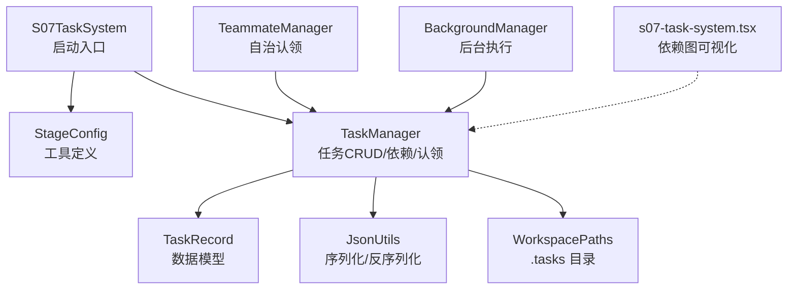
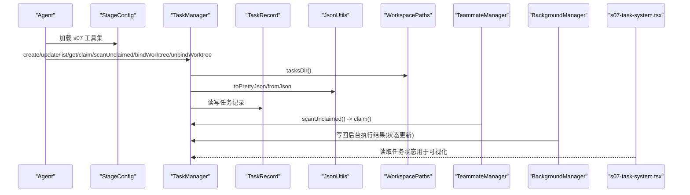
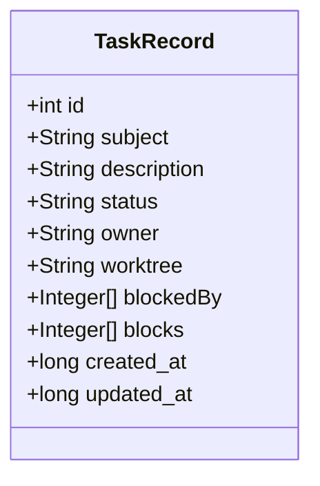
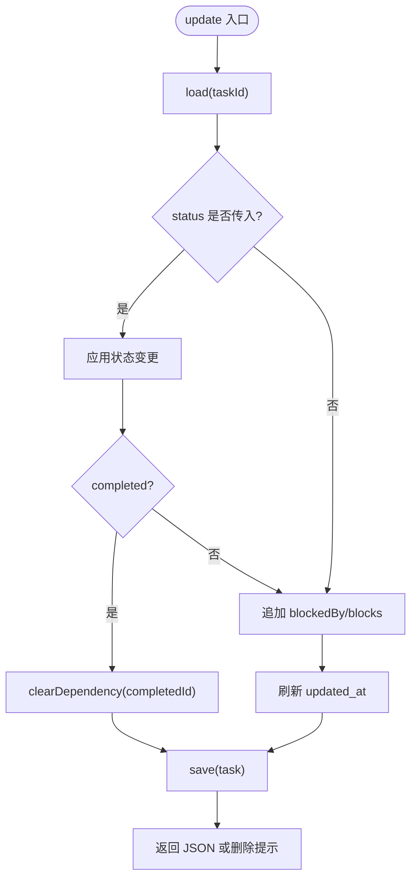
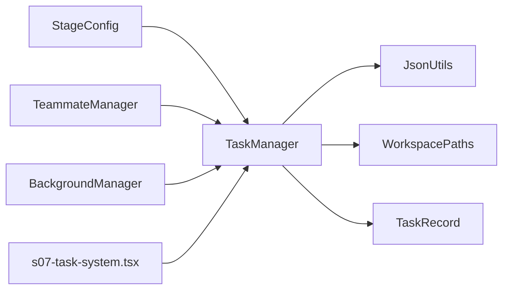

# S07: 任务系统深化

<cite>
**本文引用的文件**
- [S07TaskSystem.java](file://src/main/java/com/learnclaudecode/agents/S07TaskSystem.java)
- [TaskManager.java](file://src/main/java/com/learnclaudecode/tasks/TaskManager.java)
- [TaskRecord.java](file://src/main/java/com/learnclaudecode/model/TaskRecord.java)
- [JsonUtils.java](file://src/main/java/com/learnclaudecode/common/JsonUtils.java)
- [WorkspacePaths.java](file://src/main/java/com/learnclaudecode/common/WorkspacePaths.java)
- [StageConfig.java](file://src/main/java/com/learnclaudecode/agents/StageConfig.java)
- [TeammateManager.java](file://src/main/java/com/learnclaudecode/team/TeammateManager.java)
- [BackgroundManager.java](file://src/main/java/com/learnclaudecode/background/BackgroundManager.java)
- [s07-task-system.tsx](file://web/src/components/visualizations/s07-task-system.tsx)
</cite>

## 目录
1. [简介](#简介)
2. [项目结构](#项目结构)
3. [核心组件](#核心组件)
4. [架构总览](#架构总览)
5. [详细组件分析](#详细组件分析)
6. [依赖关系分析](#依赖关系分析)
7. [性能与扩展性](#性能与扩展性)
8. [故障恢复与重试机制](#故障恢复与重试机制)
9. [API 参考](#api-参考)
10. [监控与可视化](#监控与可视化)
11. [最佳实践](#最佳实践)
12. [结论](#结论)

## 简介
本章节围绕 S07 任务系统的深化主题，系统化阐述基于文件的轻量级任务板：以 JSON 文件持久化任务记录，支持多 Agent 协作、复杂依赖图、状态流转、并发控制、认领与调度、以及可视化的执行监控。文档同时给出完整 API 参考、并发与重试策略建议、大规模任务管理优化方案，帮助读者在现有实现基础上进行扩展与落地。

## 项目结构
S07 任务系统由“入口示例 + 任务管理器 + 数据模型 + 工具类 + 团队/后台集成 + 前端可视化”组成：
- 入口示例：启动 s07 阶段配置，暴露任务相关工具给 Agent。
- 任务管理器：提供任务的创建、查询、更新、删除、认领、扫描可执行任务、绑定 worktree 等能力。
- 数据模型：定义 TaskRecord 的字段与默认值。
- 工具类：JSON 序列化/反序列化与工作区路径安全解析。
- 团队/后台：演示如何从空闲态自动认领任务，以及后台命令执行与通知。
- 前端可视化：展示任务依赖图的逐步推进过程。

图表来源
- [S07TaskSystem.java:9-11](file://src/main/java/com/learnclaudecode/agents/S07TaskSystem.java#L9-L11)
- [StageConfig.java:156-165](file://src/main/java/com/learnclaudecode/agents/StageConfig.java#L156-L165)
- [TaskManager.java:27-337](file://src/main/java/com/learnclaudecode/tasks/TaskManager.java#L27-L337)
- [TaskRecord.java:9-61](file://src/main/java/com/learnclaudecode/model/TaskRecord.java#L9-L61)
- [JsonUtils.java:12-83](file://src/main/java/com/learnclaudecode/common/JsonUtils.java#L12-L83)
- [WorkspacePaths.java:21-88](file://src/main/java/com/learnclaudecode/common/WorkspacePaths.java#L21-L88)
- [TeammateManager.java:321-356](file://src/main/java/com/learnclaudecode/team/TeammateManager.java#L321-L356)
- [BackgroundManager.java:55-79](file://src/main/java/com/learnclaudecode/background/BackgroundManager.java#L55-L79)
- [s07-task-system.tsx:24-69](file://web/src/components/visualizations/s07-task-system.tsx#L24-L69)

章节来源
- [S07TaskSystem.java:9-11](file://src/main/java/com/learnclaudecode/agents/S07TaskSystem.java#L9-L11)
- [StageConfig.java:156-165](file://src/main/java/com/learnclaudecode/agents/StageConfig.java#L156-L165)
- [TaskManager.java:27-337](file://src/main/java/com/learnclaudecode/tasks/TaskManager.java#L27-L337)
- [TaskRecord.java:9-61](file://src/main/java/com/learnclaudecode/model/TaskRecord.java#L9-L61)
- [JsonUtils.java:12-83](file://src/main/java/com/learnclaudecode/common/JsonUtils.java#L12-L83)
- [WorkspacePaths.java:21-88](file://src/main/java/com/learnclaudecode/common/WorkspacePaths.java#L21-L88)
- [TeammateManager.java:321-356](file://src/main/java/com/learnclaudecode/team/TeammateManager.java#L321-L356)
- [BackgroundManager.java:55-79](file://src/main/java/com/learnclaudecode/background/BackgroundManager.java#L55-L79)
- [s07-task-system.tsx:24-69](file://web/src/components/visualizations/s07-task-system.tsx#L24-L69)

## 核心组件
- TaskManager：基于文件的任务板，提供并发安全的 CRUD、依赖追加、完成清理、worktree 绑定、可执行任务扫描等。
- TaskRecord：任务实体，包含 ID、主题、描述、状态、拥有者、worktree、前置依赖 blockedBy、被阻塞 blocks、时间戳等。
- JsonUtils：统一的 Jackson ObjectMapper，提供紧凑/格式化 JSON 序列化与反序列化。
- WorkspacePaths：工作区根目录与安全路径解析，提供 .tasks 目录访问。
- StageConfig：为 s07 阶段注入任务工具（创建、更新、列表、详情）。
- TeammateManager：在空闲时尝试从消息队列或任务板中恢复工作，自动认领未阻塞任务。
- BackgroundManager：后台线程执行命令并写回任务状态，向通知队列投递摘要。
- s07-task-system.tsx：可视化任务依赖图，展示步骤推进与状态变化。

章节来源
- [TaskManager.java:27-337](file://src/main/java/com/learnclaudecode/tasks/TaskManager.java#L27-L337)
- [TaskRecord.java:9-61](file://src/main/java/com/learnclaudecode/model/TaskRecord.java#L9-L61)
- [JsonUtils.java:12-83](file://src/main/java/com/learnclaudecode/common/JsonUtils.java#L12-L83)
- [WorkspacePaths.java:21-88](file://src/main/java/com/learnclaudecode/common/WorkspacePaths.java#L21-L88)
- [StageConfig.java:156-165](file://src/main/java/com/learnclaudecode/agents/StageConfig.java#L156-L165)
- [TeammateManager.java:321-356](file://src/main/java/com/learnclaudecode/team/TeammateManager.java#L321-L356)
- [BackgroundManager.java:55-79](file://src/main/java/com/learnclaudecode/background/BackgroundManager.java#L55-L79)
- [s07-task-system.tsx:24-69](file://web/src/components/visualizations/s07-task-system.tsx#L24-L69)

## 架构总览
下图展示了 S07 任务系统在运行时的关键交互：Agent 通过工具调用 TaskManager；TeammateManager 在空闲时自动扫描并认领任务；BackgroundManager 在后台执行命令并将结果写回任务状态；前端可视化展示依赖图的状态演进。

图表来源
- [StageConfig.java:156-165](file://src/main/java/com/learnclaudecode/agents/StageConfig.java#L156-L165)
- [TaskManager.java:51-337](file://src/main/java/com/learnclaudecode/tasks/TaskManager.java#L51-L337)
- [TaskRecord.java:9-61](file://src/main/java/com/learnclaudecode/model/TaskRecord.java#L9-L61)
- [JsonUtils.java:12-83](file://src/main/java/com/learnclaudecode/common/JsonUtils.java#L12-L83)
- [WorkspacePaths.java:21-88](file://src/main/java/com/learnclaudecode/common/WorkspacePaths.java#L21-L88)
- [TeammateManager.java:321-356](file://src/main/java/com/learnclaudecode/team/TeammateManager.java#L321-L356)
- [BackgroundManager.java:55-79](file://src/main/java/com/learnclaudecode/background/BackgroundManager.java#L55-L79)
- [s07-task-system.tsx:24-69](file://web/src/components/visualizations/s07-task-system.tsx#L24-L69)

## 详细组件分析

### 任务数据模型 TaskRecord
- 字段说明：
  - id：唯一标识
  - subject/description：标题与详细描述
  - status：状态机（pending/in_progress/completed/deleted）
  - owner：当前认领者
  - worktree：关联的工作树标识
  - blockedBy/blocks：双向依赖关系（前置依赖与被阻塞的后置任务）
  - created_at/updated_at：Unix 秒级时间戳
- 复杂度与特性：
  - 依赖关系使用 List<Integer>，追加操作 O(n)，适合中小规模任务图。
  - 状态变更伴随 updated_at 刷新，便于外部监控与排序。

图表来源
- [TaskRecord.java:9-61](file://src/main/java/com/learnclaudecode/model/TaskRecord.java#L9-L61)

章节来源
- [TaskRecord.java:9-61](file://src/main/java/com/learnclaudecode/model/TaskRecord.java#L9-L61)

### 任务管理器 TaskManager
- 并发控制：所有公开方法使用 synchronized 保证同一时刻仅一个线程修改任务，避免竞态条件。
- 依赖管理：
  - update 支持追加 blockedBy 与 blocks，去重添加。
  - 当任务状态变为 completed 时，自动清理其他任务对它的 blockedBy 依赖。
- 生命周期：
  - create：生成新任务，初始状态 pending，写入 .tasks 目录。
  - get/listAll：读取单个或全部任务。
  - claim：将任务标记为 in_progress 并设置 owner。
  - scanUnclaimed：筛选 pending、无 owner、无 blockedBy 的可执行任务。
  - bindWorktree/unbindWorktree：绑定/解绑 worktree，并在绑定时将 pending 推进为 in_progress。
  - update：支持状态更新、依赖追加、删除（deleted 直接删除文件）。
- 持久化：
  - 每个任务对应一个 JSON 文件，路径由 nextId 计算。
  - loadAll 扫描 .tasks 目录并按文件名排序，再反序列化为 TaskRecord。

图表来源
- [TaskManager.java:84-133](file://src/main/java/com/learnclaudecode/tasks/TaskManager.java#L84-L133)
- [TaskManager.java:329-336](file://src/main/java/com/learnclaudecode/tasks/TaskManager.java#L329-L336)

章节来源
- [TaskManager.java:51-337](file://src/main/java/com/learnclaudecode/tasks/TaskManager.java#L51-L337)

### 工具与路径：JsonUtils 与 WorkspacePaths
- JsonUtils：封装 Jackson ObjectMapper，统一日期模块注册与时间戳输出策略，提供 toJson/toPrettyJson/fromJson。
- WorkspacePaths：规范化工作区根路径，提供 safeResolve 防止路径逃逸，并提供 tasksDir/teamDir/inboxDir/skillsDir/transcriptDir/worktreesDir 等常用目录访问。

章节来源
- [JsonUtils.java:12-83](file://src/main/java/com/learnclaudecode/common/JsonUtils.java#L12-L83)
- [WorkspacePaths.java:21-88](file://src/main/java/com/learnclaudecode/common/WorkspacePaths.java#L21-L88)

### 阶段配置与工具暴露：StageConfig
- 为 s07 阶段注入以下工具：
  - task_create：创建任务，参数包括 subject、description。
  - task_update：更新任务状态或依赖，参数包括 task_id、status、addBlockedBy、addBlocks。
  - task_list：列出所有任务。
  - task_get：获取指定任务详情。
- 这些工具由 Agent 调用，最终映射到 TaskManager 的方法。

章节来源
- [StageConfig.java:156-165](file://src/main/java/com/learnclaudecode/agents/StageConfig.java#L156-L165)

### 团队自治与任务认领：TeammateManager
- resumeAutonomous：在空闲时轮询 inbox，若有消息则优先处理；若无消息，则调用 TaskManager.scanUnclaimed 获取可执行任务并自动 claim，模拟自治行为。
- 该流程体现了“消息驱动 + 任务驱动”的双通道恢复策略。

章节来源
- [TeammateManager.java:321-356](file://src/main/java/com/learnclaudecode/team/TeammateManager.java#L321-L356)

### 后台任务与状态写回：BackgroundManager
- execute：在后台线程启动子进程执行命令，限定超时，根据执行结果写回任务状态，并向通知队列投递摘要。
- 与 TaskManager 结合，形成“后台执行 + 任务状态同步”的闭环。

章节来源
- [BackgroundManager.java:55-79](file://src/main/java/com/learnclaudecode/background/BackgroundManager.java#L55-L79)

### 可视化依赖图：s07-task-system.tsx
- 展示任务依赖图（T1→T2/T3→T4→T5），按步骤推进显示各节点状态（pending/in_progress/completed/blocked）。
- 通过 edges 动态高亮已激活的依赖边，并在特定步骤标注阻塞原因（如 T4 等待 T3）。

章节来源
- [s07-task-system.tsx:24-69](file://web/src/components/visualizations/s07-task-system.tsx#L24-L69)
- [s07-task-system.tsx:71-129](file://web/src/components/visualizations/s07-task-system.tsx#L71-L129)
- [s07-task-system.tsx:195-495](file://web/src/components/visualizations/s07-task-system.tsx#L195-L495)

## 依赖关系分析
- 组件耦合：
  - TaskManager 强依赖 JsonUtils 与 WorkspacePaths，弱依赖 TeammateManager 与 BackgroundManager（通过方法调用）。
  - StageConfig 仅负责工具定义，不直接持有运行时对象。
  - 前端可视化通过读取任务状态（例如通过 API 或共享存储）呈现依赖图。
- 潜在循环：
  - 代码层面未见循环依赖；TeammateManager 与 BackgroundManager 均单向调用 TaskManager。
- 外部依赖：
  - Jackson 用于 JSON 序列化。
  - Java NIO 用于文件系统操作。

图表来源
- [StageConfig.java:156-165](file://src/main/java/com/learnclaudecode/agents/StageConfig.java#L156-L165)
- [TaskManager.java:27-337](file://src/main/java/com/learnclaudecode/tasks/TaskManager.java#L27-L337)
- [JsonUtils.java:12-83](file://src/main/java/com/learnclaudecode/common/JsonUtils.java#L12-L83)
- [WorkspacePaths.java:21-88](file://src/main/java/com/learnclaudecode/common/WorkspacePaths.java#L21-L88)
- [TaskRecord.java:9-61](file://src/main/java/com/learnclaudecode/model/TaskRecord.java#L9-L61)
- [TeammateManager.java:321-356](file://src/main/java/com/learnclaudecode/team/TeammateManager.java#L321-L356)
- [BackgroundManager.java:55-79](file://src/main/java/com/learnclaudecode/background/BackgroundManager.java#L55-L79)
- [s07-task-system.tsx:24-69](file://web/src/components/visualizations/s07-task-system.tsx#L24-L69)

章节来源
- [TaskManager.java:27-337](file://src/main/java/com/learnclaudecode/tasks/TaskManager.java#L27-L337)
- [StageConfig.java:156-165](file://src/main/java/com/learnclaudecode/agents/StageConfig.java#L156-L165)
- [TeammateManager.java:321-356](file://src/main/java/com/learnclaudecode/team/TeammateManager.java#L321-L356)
- [BackgroundManager.java:55-79](file://src/main/java/com/learnclaudecode/background/BackgroundManager.java#L55-L79)
- [s07-task-system.tsx:24-69](file://web/src/components/visualizations/s07-task-system.tsx#L24-L69)

## 性能与扩展性
- 当前实现特点：
  - 单实例 synchronized 临界区，确保一致性但限制并发吞吐。
  - loadAll 每次全量扫描 .tasks 目录，适合中小规模任务集。
- 优化建议：
  - 引入内存缓存（如 ConcurrentHashMap）+ 定期落盘，减少磁盘 IO。
  - 为任务文件建立索引（如按状态/owner 分类），加速 scanUnclaimed。
  - 将 blockedBy/blocks 改为 Set<Integer> 提升去重效率。
  - 批量更新合并写盘，降低频繁 save 的开销。
  - 分片存储：按批次或项目拆分 .tasks 子目录，避免单目录过大。
  - 异步化：将耗时操作（如 clearDependency）放入后台线程，避免阻塞主流程。
  - 并发粒度细化：将 synchronized 缩小到具体任务文件级别，提高并行度。

[本节为通用性能讨论，不直接分析具体文件]

## 故障恢复与重试机制
- 当前实现：
  - 文件 IO 异常抛出 IllegalStateException，上层需捕获并处理。
  - 删除任务时若失败会抛出异常。
  - 后台任务执行存在超时控制，但未内置重试逻辑。
- 建议增强：
  - 重试策略：对幂等操作（如 save/load）增加指数退避重试，限制最大次数。
  - 幂等性保障：更新前校验版本或时间戳，避免覆盖。
  - 事务性：采用临时文件 + 原子替换的方式写盘，避免部分写入导致损坏。
  - 死信队列：对持续失败的任务记录错误信息，供人工介入。
  - 健康检查：定期扫描 .tasks 目录，修复不一致状态（如 orphaned 依赖）。

章节来源
- [TaskManager.java:98-104](file://src/main/java/com/learnclaudecode/tasks/TaskManager.java#L98-L104)
- [TaskManager.java:316-322](file://src/main/java/com/learnclaudecode/tasks/TaskManager.java#L316-L322)
- [BackgroundManager.java:55-79](file://src/main/java/com/learnclaudecode/background/BackgroundManager.java#L55-L79)

## API 参考
以下为 TaskManager 提供的核心 API 及用途说明（返回值均为 JSON 字符串或集合）：
- create(subject, description)
  - 功能：创建新任务，初始状态 pending。
  - 输入：subject（字符串）、description（字符串，可为空）。
  - 输出：新任务的 JSON。
  - 并发：方法同步，保证唯一 ID 与一致写入。
  - 参考路径：[TaskManager.java:51-61](file://src/main/java/com/learnclaudecode/tasks/TaskManager.java#L51-L61)
- get(taskId)
  - 功能：获取指定任务详情。
  - 输入：taskId（整数）。
  - 输出：任务 JSON。
  - 参考路径：[TaskManager.java:69-71](file://src/main/java/com/learnclaudecode/tasks/TaskManager.java#L69-L71)
- update(taskId, status, addBlockedBy, addBlocks)
  - 功能：更新任务状态与依赖关系；completed 时清理依赖；deleted 时删除文件。
  - 输入：taskId（整数）、status（字符串，可选）、addBlockedBy（整数列表，可选）、addBlocks（整数列表，可选）。
  - 输出：更新后的任务 JSON 或删除提示。
  - 参考路径：[TaskManager.java:84-133](file://src/main/java/com/learnclaudecode/tasks/TaskManager.java#L84-L133)
- listAll()
  - 功能：列出所有任务看板视图。
  - 输出：文本形式的看板。
  - 参考路径：[TaskManager.java:140-159](file://src/main/java/com/learnclaudecode/tasks/TaskManager.java#L140-L159)
- claim(taskId, owner)
  - 功能：认领任务，状态切换为 in_progress。
  - 输入：taskId（整数）、owner（字符串）。
  - 输出：认领结果提示。
  - 参考路径：[TaskManager.java:168-175](file://src/main/java/com/learnclaudecode/tasks/TaskManager.java#L168-L175)
- scanUnclaimed()
  - 功能：扫描可立即认领的待处理任务（pending、无 owner、无 blockedBy）。
  - 输出：任务记录列表。
  - 参考路径：[TaskManager.java:187-197](file://src/main/java/com/learnclaudecode/tasks/TaskManager.java#L187-L197)
- bindWorktree(taskId, worktree, owner)
  - 功能：绑定 worktree 并可能推进状态至 in_progress。
  - 输入：taskId（整数）、worktree（字符串）、owner（字符串，可选）。
  - 输出：更新后的任务 JSON。
  - 参考路径：[TaskManager.java:215-235](file://src/main/java/com/learnclaudecode/tasks/TaskManager.java#L215-L235)
- unbindWorktree(taskId)
  - 功能：解除 worktree 绑定。
  - 输入：taskId（整数）。
  - 输出：更新后的任务 JSON。
  - 参考路径：[TaskManager.java:243-249](file://src/main/java/com/learnclaudecode/tasks/TaskManager.java#L243-L249)

章节来源
- [TaskManager.java:51-249](file://src/main/java/com/learnclaudecode/tasks/TaskManager.java#L51-L249)

## 监控与可视化
- 看板视图：listAll 提供人类可读的任务清单，包含状态标记、拥有者、依赖阻塞信息与 worktree 绑定。
- 依赖图可视化：s07-task-system.tsx 展示任务依赖图，按步骤推进显示节点状态与边激活情况，并在阻塞时标注原因。
- 后台任务监控：BackgroundManager 在执行完成后写回任务状态并投递通知，可用于构建监控面板。

章节来源
- [TaskManager.java:140-159](file://src/main/java/com/learnclaudecode/tasks/TaskManager.java#L140-L159)
- [s07-task-system.tsx:24-69](file://web/src/components/visualizations/s07-task-system.tsx#L24-L69)
- [BackgroundManager.java:55-79](file://src/main/java/com/learnclaudecode/background/BackgroundManager.java#L55-L79)

## 最佳实践
- 任务建模：
  - 明确依赖方向：blockedBy 表示前置依赖，blocks 表示后置依赖，保持双向一致。
  - 合理拆分任务粒度：避免过大任务导致难以追踪与重试。
- 并发与一致性：
  - 使用 synchronized 保护关键路径；未来可按任务文件粒度细粒度锁。
  - 写盘采用原子替换，避免部分写入。
- 调度策略：
  - 优先选择无依赖且未认领的任务（scanUnclaimed）。
  - 结合消息驱动：优先处理 inbox 中的指令，再抢任务。
- 可靠性：
  - 对关键操作增加重试与幂等校验。
  - 记录错误上下文，便于排查。
- 性能优化：
  - 缓存热点任务，减少磁盘 IO。
  - 批量更新与延迟落盘。
  - 分目录存储与索引。

[本节为通用最佳实践，不直接分析具体文件]

## 结论
S07 任务系统以文件为基础，提供了简洁而实用的任务管理能力：支持依赖图、状态流转、并发安全、认领与调度、以及可视化监控。在此基础上，可通过缓存、索引、原子写盘、重试与幂等、分片与批处理等手段，进一步提升性能与可靠性，满足更大规模的任务管理需求。