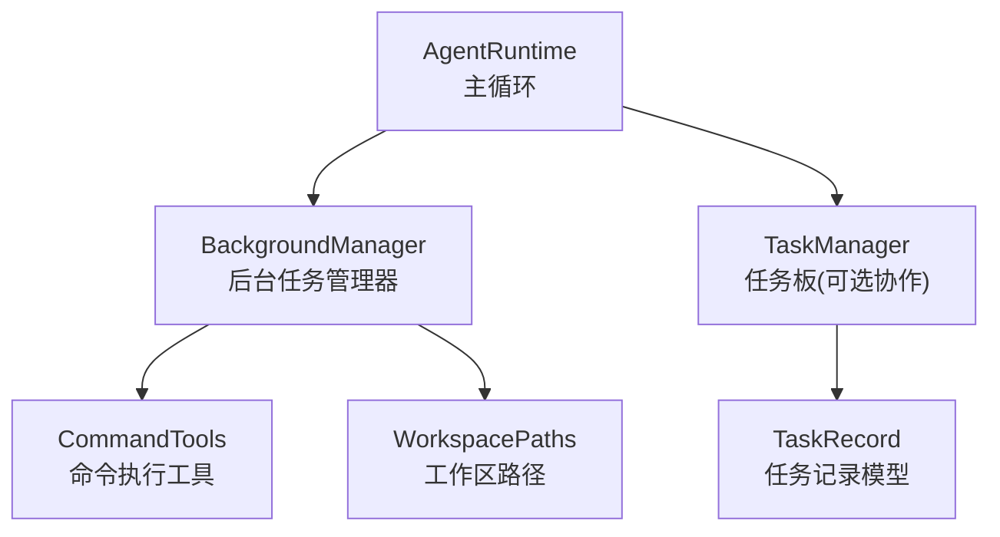
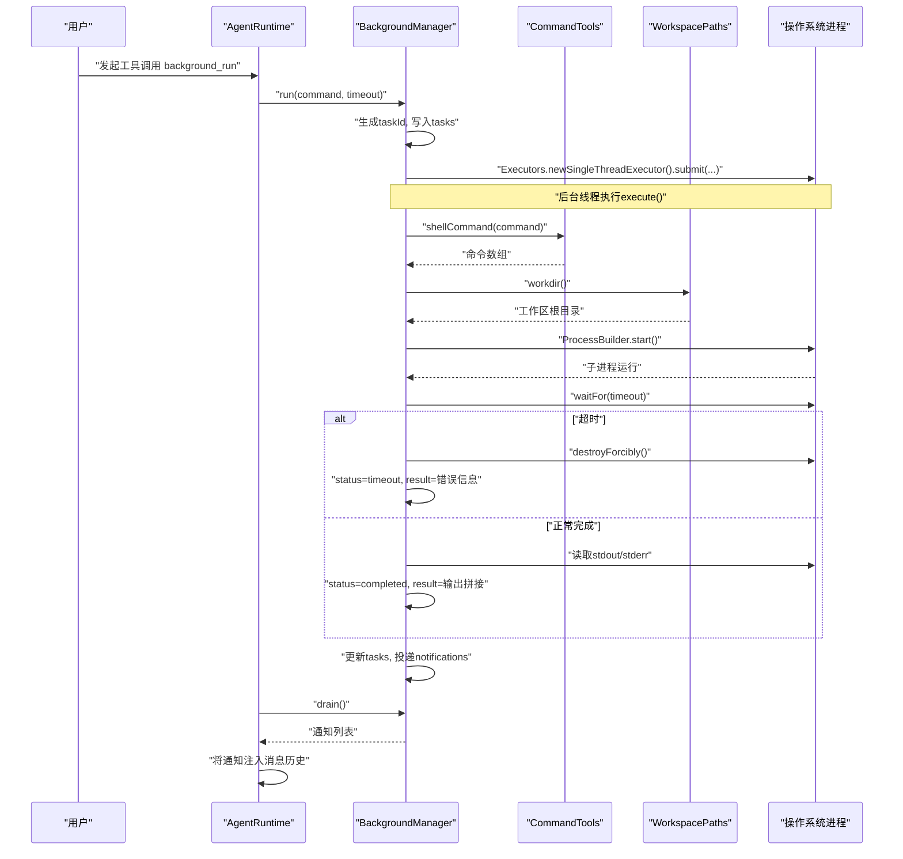
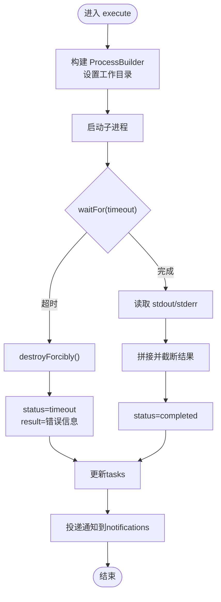
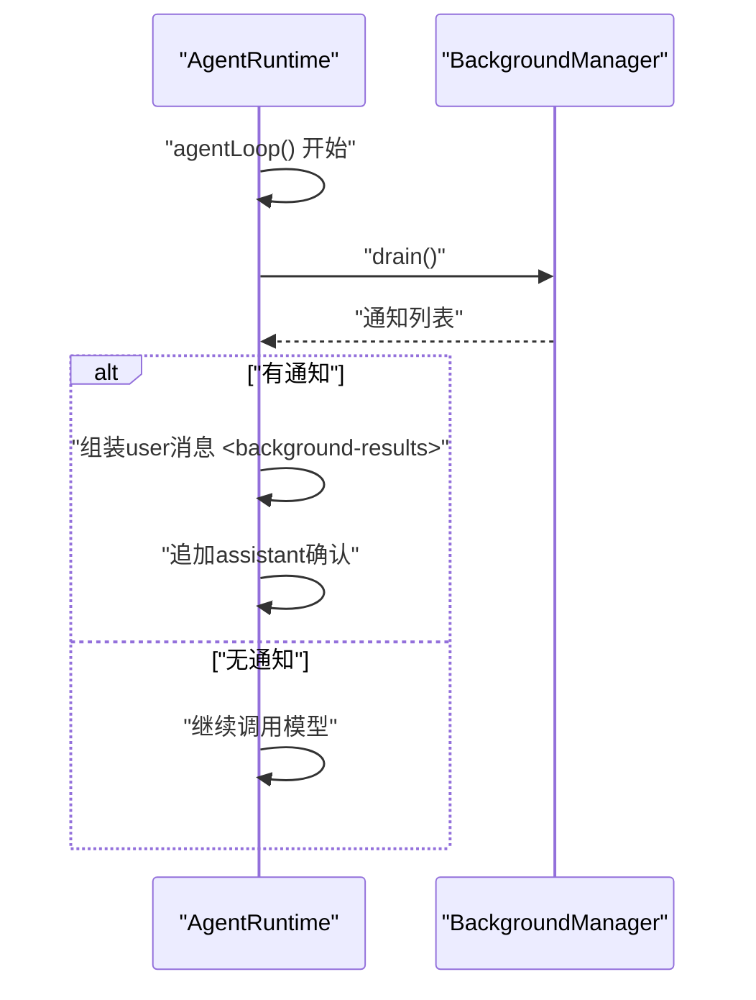
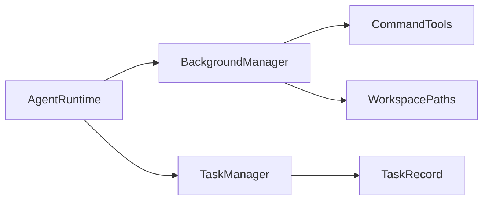

# S08: 后台任务处理

<cite>
**本文引用的文件**
- [BackgroundManager.java](file://src/main/java/com/learnclaudecode/background/BackgroundManager.java)
- [AgentRuntime.java](file://src/main/java/com/learnclaudecode/agents/AgentRuntime.java)
- [CommandTools.java](file://src/main/java/com/learnclaudecode/tools/CommandTools.java)
- [WorkspacePaths.java](file://src/main/java/com/learnclaudecode/common/WorkspacePaths.java)
- [TaskRecord.java](file://src/main/java/com/learnclaudecode/model/TaskRecord.java)
- [TaskManager.java](file://src/main/java/com/learnclaudecode/tasks/TaskManager.java)
- [S08BackgroundTasks.java](file://src/main/java/com/learnclaudecode/agents/S08BackgroundTasks.java)
</cite>

## 目录
1. [简介](#简介)
2. [项目结构](#项目结构)
3. [核心组件](#核心组件)
4. [架构总览](#架构总览)
5. [详细组件分析](#详细组件分析)
6. [依赖关系分析](#依赖关系分析)
7. [性能与并发特性](#性能与并发特性)
8. [故障排查指南](#故障排查指南)
9. [结论](#结论)
10. [附录：使用示例与最佳实践](#附录使用示例与最佳实践)

## 简介
本章节面向 S08 的后台任务处理，围绕 BackgroundManager 的异步执行框架展开，解释其任务队列管理、线程模型、调度策略、任务创建/监控/取消机制，以及与 Agent 主循环的集成方式。同时给出长耗时任务、定时任务、事件驱动任务的实践思路，并说明状态持久化、错误处理与结果回调机制，以及并发安全、资源管理与性能监控的最佳实践。

## 项目结构
S08 的后台任务能力由以下关键部分组成：
- BackgroundManager：负责后台命令的异步执行、状态跟踪与通知投递。
- AgentRuntime：Agent 主循环，周期性轮询后台通知并注入到对话上下文。
- CommandTools：封装底层 shell 命令执行、超时控制与安全限制。
- WorkspacePaths：工作区路径工具，确保所有子进程在受控目录下执行。
- TaskManager / TaskRecord：用于任务板（持久化）的状态管理，与后台任务解耦但可配合使用。
- S08BackgroundTasks：入口类，启动 StageConfig.s08() 以启用后台任务能力。

图表来源
- [AgentRuntime.java:131-260](file://src/main/java/com/learnclaudecode/agents/AgentRuntime.java#L131-L260)
- [BackgroundManager.java:20-159](file://src/main/java/com/learnclaudecode/background/BackgroundManager.java#L20-L159)
- [CommandTools.java:16-78](file://src/main/java/com/learnclaudecode/tools/CommandTools.java#L16-L78)
- [WorkspacePaths.java:11-49](file://src/main/java/com/learnclaudecode/common/WorkspacePaths.java#L11-L49)
- [TaskManager.java:27-133](file://src/main/java/com/learnclaudecode/tasks/TaskManager.java#L27-L133)
- [TaskRecord.java:9-61](file://src/main/java/com/learnclaudecode/model/TaskRecord.java#L9-L61)

章节来源
- [S08BackgroundTasks.java:9-11](file://src/main/java/com/learnclaudecode/agents/S08BackgroundTasks.java#L9-L11)
- [AgentRuntime.java:146-159](file://src/main/java/com/learnclaudecode/agents/AgentRuntime.java#L146-L159)

## 核心组件
- BackgroundManager
  - 职责：接收后台命令，分配唯一 taskId，提交到独立线程执行；维护任务状态表与通知队列；提供查询与批量取通知接口。
  - 关键数据结构：ConcurrentHashMap<String, Map<String, Object>> tasks；BlockingQueue<Map<String, Object>> notifications。
  - 关键方法：run(command, timeoutSeconds)、execute(taskId, command, timeoutSeconds)、check(taskId)、drain()。
- AgentRuntime
  - 职责：在主循环中周期调用 backgroundManager.drain()，将后台结果作为新的 user 消息注入上下文，实现“非阻塞”的结果回传。
  - 工具映射：将模型的工具调用 background_run/check_background 路由到 BackgroundManager。
- CommandTools
  - 职责：构造平台相关的 shell 命令数组；执行命令并限制超时；读取标准输出/错误流；黑名单拦截危险命令。
- WorkspacePaths
  - 职责：规范化工作区根目录；为子进程设置固定工作目录；提供安全路径解析，防止逃逸出工作区。
- TaskManager / TaskRecord
  - 职责：基于文件的轻量任务板，支持创建、更新、认领、依赖管理等；可与后台任务配合进行“计划-执行-追踪”。

章节来源
- [BackgroundManager.java:20-159](file://src/main/java/com/learnclaudecode/background/BackgroundManager.java#L20-L159)
- [AgentRuntime.java:189-209](file://src/main/java/com/learnclaudecode/agents/AgentRuntime.java#L189-L209)
- [CommandTools.java:36-78](file://src/main/java/com/learnclaudecode/tools/CommandTools.java#L36-L78)
- [WorkspacePaths.java:21-49](file://src/main/java/com/learnclaudecode/common/WorkspacePaths.java#L21-L49)
- [TaskManager.java:51-133](file://src/main/java/com/learnclaudecode/tasks/TaskManager.java#L51-L133)
- [TaskRecord.java:9-61](file://src/main/java/com/learnclaudecode/model/TaskRecord.java#L9-L61)

## 架构总览
下图展示了从用户输入到后台任务执行、再到结果回注主循环的整体流程。

图表来源
- [BackgroundManager.java:43-123](file://src/main/java/com/learnclaudecode/background/BackgroundManager.java#L43-L123)
- [AgentRuntime.java:146-159](file://src/main/java/com/learnclaudecode/agents/AgentRuntime.java#L146-L159)
- [CommandTools.java:73-78](file://src/main/java/com/learnclaudecode/tools/CommandTools.java#L73-L78)
- [WorkspacePaths.java:32-34](file://src/main/java/com/learnclaudecode/common/WorkspacePaths.java#L32-L34)

## 详细组件分析

### BackgroundManager：异步任务执行框架
- 任务队列管理
  - 任务状态表：ConcurrentHashMap<String, Map<String, Object>> tasks，保存每个任务的 status/command/result。
  - 通知队列：LinkedBlockingQueue<Map<String, Object>> notifications，仅投递摘要，避免过大负载。
- 线程池配置
  - 当前实现为每次 run() 创建一个新单线程执行器并提交任务，适合教学场景演示“每任务一线程”的隔离性。
  - 生产建议：改为共享线程池（如 ThreadPoolExecutor），统一管控线程数、拒绝策略与生命周期。
- 任务调度策略
  - 立即调度：run() 直接提交到线程池，无优先级队列或延迟调度。
  - 可扩展点：引入优先级队列（按超时时间或重要性）、延迟队列（ScheduledExecutorService）以实现定时任务。
- 任务创建、监控、暂停与取消
  - 创建：run(command, timeoutSeconds) 生成 taskId 并启动后台执行。
  - 监控：check(taskId) 返回任务状态与结果；drain() 获取累计通知。
  - 暂停：当前未实现显式暂停；可通过外部信号（如标志位）在 execute 中检查并中断。
  - 取消：通过 Process.destroyForcibly() 强制终止子进程；上层可结合任务状态实现逻辑取消。
- 状态持久化
  - 当前 tasks 为内存结构，重启后丢失。可对接 TaskManager 或文件系统，将任务状态落盘。
- 错误处理与结果回调
  - 异常捕获：catch(Exception e) 统一标记 error 并写入结果。
  - 结果回调：通过 notifications 队列将结果推送到主循环，再由 AgentRuntime 注入消息历史。

图表来源
- [BackgroundManager.java:68-123](file://src/main/java/com/learnclaudecode/background/BackgroundManager.java#L68-L123)

章节来源
- [BackgroundManager.java:20-159](file://src/main/java/com/learnclaudecode/background/BackgroundManager.java#L20-L159)

### AgentRuntime：主循环与后台结果注入
- 工具映射
  - background_run -> BackgroundManager.run(...)
  - check_background -> BackgroundManager.check(...)
- 结果注入
  - 每轮循环先 drain() 后台通知，若存在则组装成 user 消息注入上下文，随后 assistant 确认收到。
- 与后台任务的解耦
  - 主循环不阻塞等待后台任务完成，而是轮询通知，保证交互流畅。

图表来源
- [AgentRuntime.java:146-159](file://src/main/java/com/learnclaudecode/agents/AgentRuntime.java#L146-L159)
- [AgentRuntime.java:189-209](file://src/main/java/com/learnclaudecode/agents/AgentRuntime.java#L189-L209)

章节来源
- [AgentRuntime.java:131-260](file://src/main/java/com/learnclaudecode/agents/AgentRuntime.java#L131-L260)

### CommandTools：命令执行与安全
- 平台适配：根据操作系统选择 powershell 或 bash -lc。
- 超时控制：默认 120s 超时，超时后强制销毁进程。
- 安全限制：黑名单拦截危险命令（如 rm -rf /、sudo、shutdown 等）。
- 输出处理：合并 stdout/stderr，空输出占位，结果截断防溢出。

章节来源
- [CommandTools.java:36-78](file://src/main/java/com/learnclaudecode/tools/CommandTools.java#L36-L78)
- [CommandTools.java:16-28](file://src/main/java/com/learnclaudecode/tools/CommandTools.java#L16-L28)

### WorkspacePaths：工作区路径安全
- 规范化路径：绝对路径 + normalize，避免相对路径歧义。
- 安全解析：safeResolve 校验目标路径是否在工作区内，防止逃逸。
- 子进程工作目录：统一设置为 workdir()，确保命令在受控目录执行。

章节来源
- [WorkspacePaths.java:21-49](file://src/main/java/com/learnclaudecode/common/WorkspacePaths.java#L21-L49)
- [WorkspacePaths.java:32-34](file://src/main/java/com/learnclaudecode/common/WorkspacePaths.java#L32-L34)

### TaskManager / TaskRecord：任务持久化与协作
- 持久化：任务以 JSON 文件形式保存在 .tasks 目录，支持创建、更新、删除、认领、依赖管理。
- 状态流转：pending -> in_progress -> completed/deleted；完成后自动清理其他任务的 blockedBy。
- 与后台任务配合：可将后台任务 ID 与 TaskRecord 关联，形成“计划-执行-追踪”闭环。

章节来源
- [TaskManager.java:51-133](file://src/main/java/com/learnclaudecode/tasks/TaskManager.java#L51-L133)
- [TaskRecord.java:9-61](file://src/main/java/com/learnclaudecode/model/TaskRecord.java#L9-L61)

## 依赖关系分析
- BackgroundManager 依赖 CommandTools 与 WorkspacePaths，用于命令构造与工作区控制。
- AgentRuntime 依赖 BackgroundManager，实现工具映射与结果注入。
- TaskManager 与 TaskRecord 提供任务持久化，可与 BackgroundManager 协同但不强耦合。

图表来源
- [AgentRuntime.java:41-51](file://src/main/java/com/learnclaudecode/agents/AgentRuntime.java#L41-L51)
- [BackgroundManager.java:20-34](file://src/main/java/com/learnclaudecode/background/BackgroundManager.java#L20-L34)
- [TaskManager.java:27-42](file://src/main/java/com/learnclaudecode/tasks/TaskManager.java#L27-L42)

章节来源
- [AgentRuntime.java:41-51](file://src/main/java/com/learnclaudecode/agents/AgentRuntime.java#L41-L51)
- [BackgroundManager.java:20-34](file://src/main/java/com/learnclaudecode/background/BackgroundManager.java#L20-L34)
- [TaskManager.java:27-42](file://src/main/java/com/learnclaudecode/tasks/TaskManager.java#L27-L42)

## 性能与并发特性
- 线程模型
  - 当前实现为“每任务一线程”，简单直观但资源开销大；生产环境建议使用固定大小线程池，合理设置 corePoolSize、maxPoolSize、keepAliveTime、workQueue 容量与拒绝策略。
- 队列与背压
  - notifications 使用 LinkedBlockingQueue，具备无限容量风险；建议设置容量上限并结合背压策略（丢弃旧通知、阻塞生产者或降级）。
- I/O 与超时
  - 子进程执行采用 waitFor(timeout)，超时后 destroyForcibly() 释放资源；注意长时间运行的命令应设置合理超时。
- 结果大小控制
  - 结果字符串截断至固定长度，避免内存膨胀；通知仅包含摘要，完整结果通过 check(taskId) 获取。
- 并发安全
  - tasks 使用 ConcurrentHashMap 保证多线程读写安全；通知队列天然线程安全。
- 资源管理
  - 子进程必须确保被正确终止；建议在 finally 块中确保 destroyForcibly() 调用。
- 监控指标
  - 建议统计：任务总数、进行中、已完成、失败、平均执行时长、超时率、队列深度、线程池利用率。

[本节为通用指导，无需特定文件引用]

## 故障排查指南
- 常见错误
  - 未知任务 ID：check(taskId) 返回 Unknown task；请确认 run() 返回的 taskId 是否正确传递。
  - 超时：status=timeout；检查命令复杂度、系统负载与超时阈值。
  - 权限/路径：子进程工作目录固定为 workdir()；确保命令访问的文件在工作区内且权限允许。
  - 危险命令拦截：CommandTools 黑名单会阻止危险命令；调整命令或扩展白名单需谨慎。
- 调试步骤
  - 使用 check(taskId) 查看任务状态与结果摘要。
  - 使用 drain() 获取最新通知，确认主循环是否正确注入。
  - 检查 CommandTools 日志（如有）与系统进程列表，确认子进程是否存活。
- 恢复策略
  - 对超时任务，可重试或拆分更细粒度任务。
  - 对失败任务，检查命令参数与环境变量；必要时增加日志输出。

章节来源
- [BackgroundManager.java:131-147](file://src/main/java/com/learnclaudecode/background/BackgroundManager.java#L131-L147)
- [CommandTools.java:36-65](file://src/main/java/com/learnclaudecode/tools/CommandTools.java#L36-L65)

## 结论
S08 的后台任务处理通过 BackgroundManager 实现了“异步执行 + 通知总线”的基本范式，结合 AgentRuntime 的主循环轮询，达成非阻塞的任务结果回传。当前实现简洁易理解，适合教学与原型验证；在生产环境中需增强线程池管理、队列容量控制、状态持久化、取消/暂停机制与监控告警。配合 TaskManager 可实现“计划-执行-追踪”的完整闭环。

[本节为总结性内容，无需特定文件引用]

## 附录：使用示例与最佳实践

### 基本用法
- 启动后台任务
  - 通过工具调用 background_run(command, timeout) 启动后台命令，立即获得 taskId。
  - 参考：[AgentRuntime.java:207-208](file://src/main/java/com/learnclaudecode/agents/AgentRuntime.java#L207-L208)
- 查询任务状态
  - 使用 check_background(task_id) 获取任务状态与结果摘要。
  - 参考：[AgentRuntime.java:208](file://src/main/java/com/learnclaudecode/agents/AgentRuntime.java#L208)
- 轮询通知
  - AgentRuntime 每轮自动 drain() 后台通知并注入上下文；也可在自定义逻辑中调用 drain()。
  - 参考：[AgentRuntime.java:146-159](file://src/main/java/com/learnclaudecode/agents/AgentRuntime.java#L146-L159)

章节来源
- [AgentRuntime.java:146-159](file://src/main/java/com/learnclaudecode/agents/AgentRuntime.java#L146-L159)
- [AgentRuntime.java:207-208](file://src/main/java/com/learnclaudecode/agents/AgentRuntime.java#L207-L208)

### 长耗时任务
- 设计要点
  - 设置合理超时；拆分任务为更小单元；使用幂等命令便于重试。
  - 将任务 ID 与 TaskRecord 关联，记录进度与依赖。
- 参考实现
  - 超时与进程终止：[BackgroundManager.java:81-89](file://src/main/java/com/learnclaudecode/background/BackgroundManager.java#L81-L89)
  - 结果截断与空输出占位：[BackgroundManager.java:90-102](file://src/main/java/com/learnclaudecode/background/BackgroundManager.java#L90-L102)

章节来源
- [BackgroundManager.java:81-102](file://src/main/java/com/learnclaudecode/background/BackgroundManager.java#L81-L102)

### 定时任务
- 当前未内置定时调度；可基于 ScheduledExecutorService 扩展。
- 建议方案
  - 使用延迟队列或定时任务触发 background_run。
  - 将定时任务注册为 TaskRecord，状态为 pending/in_progress，完成后更新。

[本节为概念性扩展，无需特定文件引用]

### 事件驱动任务
- 当前通过 notifications 队列实现“事件即通知”的模式。
- 建议方案
  - 在后台任务中监听外部事件（如文件变更、消息到达），完成后向 notifications 投递事件摘要。
  - AgentRuntime 轮询并注入上下文，驱动后续动作。

章节来源
- [BackgroundManager.java:116-123](file://src/main/java/com/learnclaudecode/background/BackgroundManager.java#L116-L123)
- [AgentRuntime.java:146-159](file://src/main/java/com/learnclaudecode/agents/AgentRuntime.java#L146-L159)

### 状态持久化
- 当前 tasks 为内存结构；建议对接 TaskManager 或文件系统。
- 建议方案
  - 将任务状态（status/command/result）序列化到 .tasks 目录，支持重启恢复。
  - 使用 TaskRecord 的 created_at/updated_at 记录生命周期。

章节来源
- [TaskManager.java:51-61](file://src/main/java/com/learnclaudecode/tasks/TaskManager.java#L51-L61)
- [TaskRecord.java:52-61](file://src/main/java/com/learnclaudecode/model/TaskRecord.java#L52-L61)

### 错误处理与结果回调
- 错误分类
  - 超时：status=timeout；强制终止进程。
  - 异常：status=error；记录异常信息。
- 结果回调
  - 通过 notifications 投递摘要；完整结果通过 check(taskId) 获取。
- 参考实现
  - 异常捕获与状态设置：[BackgroundManager.java:103-108](file://src/main/java/com/learnclaudecode/background/BackgroundManager.java#L103-L108)
  - 通知投递：[BackgroundManager.java:116-123](file://src/main/java/com/learnclaudecode/background/BackgroundManager.java#L116-L123)

章节来源
- [BackgroundManager.java:103-123](file://src/main/java/com/learnclaudecode/background/BackgroundManager.java#L103-L123)

### 并发安全、资源管理与性能监控最佳实践
- 并发安全
  - 使用 ConcurrentHashMap 与 BlockingQueue 保证线程安全。
  - 避免在后台任务中修改共享可变状态；如需共享，使用原子类型或锁。
- 资源管理
  - 确保子进程被正确终止；在 finally 中调用 destroyForcibly()。
  - 限制输出大小，避免内存溢出。
- 性能监控
  - 统计任务指标：数量、状态分布、执行时长、超时率。
  - 监控队列深度与线程池利用率，及时扩容或限流。

[本节为通用指导，无需特定文件引用]