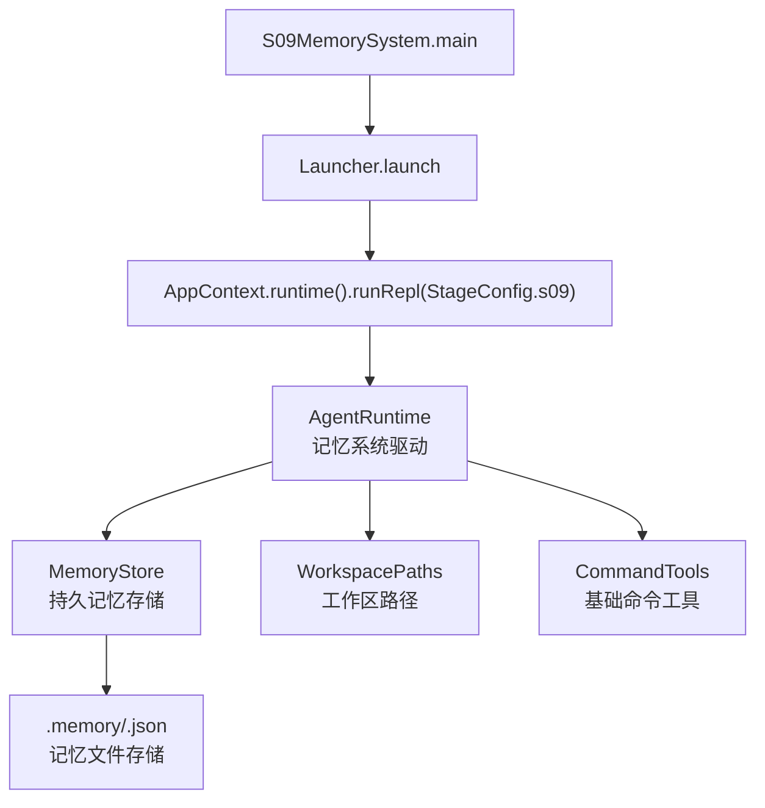
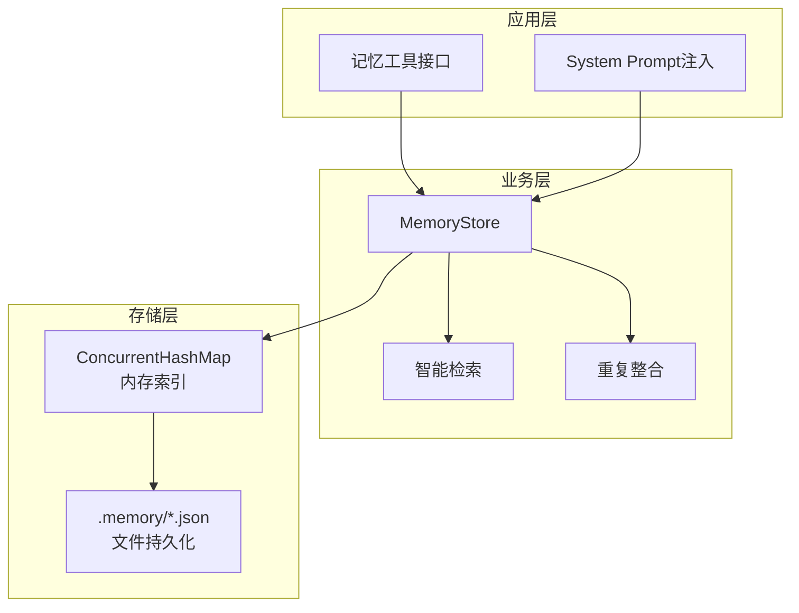
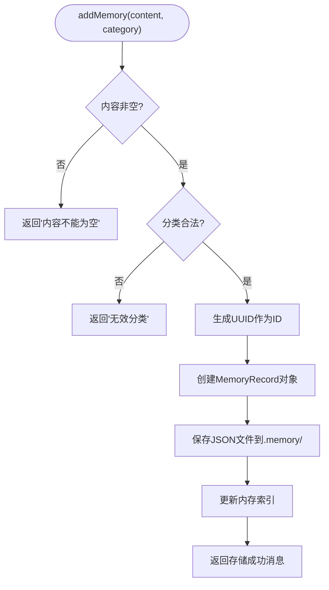
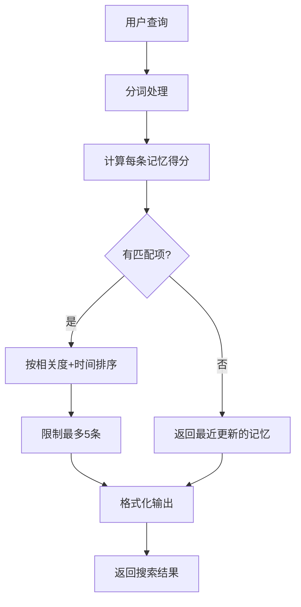
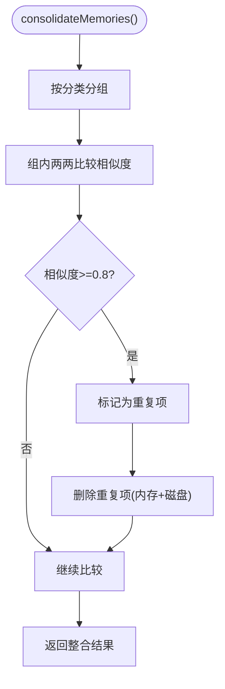
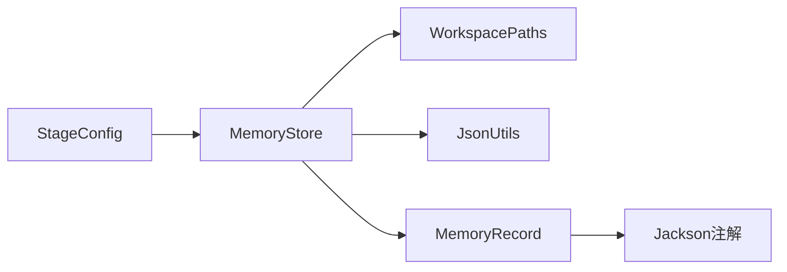

# S09: 持久记忆系统

<cite>
**本文引用的文件**
- [S09MemorySystem.java](file://src/main/java/com/learnclaudecode/agents/S09MemorySystem.java)
- [StageConfig.java](file://src/main/java/com/learnclaudecode/agents/StageConfig.java)
- [MemoryStore.java](file://src/main/java/com/learnclaudecode/memory/MemoryStore.java)
- [MemoryRecord.java](file://src/main/java/com/learnclaudecode/model/MemoryRecord.java)
- [WorkspacePaths.java](file://src/main/java/com/learnclaudecode/common/WorkspacePaths.java)
- [JsonUtils.java](file://src/main/java/com/learnclaudecode/common/JsonUtils.java)
</cite>

## 更新摘要
**变更内容**
- 将原S09代理团队协作功能完全移除，重构为新的持久记忆系统
- 新增MemoryStore核心组件，实现跨会话持久化记忆机制
- 更新StageConfig配置，添加记忆相关工具（memory_add、memory_search、memory_list、memory_delete）
- 重构架构图和组件关系，聚焦记忆存储、检索和整合功能

## 目录
1. [简介](#简介)
2. [项目结构](#项目结构)
3. [核心组件](#核心组件)
4. [架构总览](#架构总览)
5. [详细组件分析](#详细组件分析)
6. [依赖关系分析](#依赖关系分析)
7. [性能与扩展性](#性能与扩展性)
8. [故障处理与排障指南](#故障处理与排障指南)
9. [结论](#结论)
10. [附录：记忆使用示例与最佳实践](#附录记忆使用示例与最佳实践)

## 简介
本章节面向"持久记忆系统"的完整实现，聚焦 S09 阶段的核心能力：通过 MemoryStore 实现跨会话的持久化记忆机制，让 Agent 能够记住重要的事实、偏好和操作步骤，即使对话上下文被压缩或清空，这些关键信息也不会丢失。文档将解释记忆的增删查改、智能检索、重复整合等核心功能，以及"记住重要的，遗忘无关的"设计理念。

## 项目结构
S09 的入口是 S09MemorySystem.main，它通过 Launcher 启动统一运行时，并使用 StageConfig.s09 提供的记忆工具集（添加记忆、搜索记忆、列出记忆、删除记忆）。运行时在 AppContext 中装配 WorkspacePaths、AnthropicClient、CommandTools、MemoryStore 等依赖，由 AgentRuntime 依据 StageConfig 的 enableMemory 开关接线。

图表来源
- [S09MemorySystem.java:14-16](file://src/main/java/com/learnclaudecode/agents/S09MemorySystem.java#L14-L16)
- [StageConfig.java:437-453](file://src/main/java/com/learnclaudecode/agents/StageConfig.java#L437-L453)
- [MemoryStore.java:78-81](file://src/main/java/com/learnclaudecode/memory/MemoryStore.java#L78-L81)

章节来源
- [S09MemorySystem.java:14-16](file://src/main/java/com/learnclaudecode/agents/S09MemorySystem.java#L14-L16)
- [StageConfig.java:437-453](file://src/main/java/com/learnclaudecode/agents/StageConfig.java#L437-L453)

## 核心组件
- MemoryStore：持久记忆存储核心，提供 addMemory、searchMemories、listMemories、deleteMemory、consolidateMemories 等核心能力，支持 fact/preference/procedure 三种记忆分类。
- MemoryRecord：记忆记录模型，包含 id、content、category、createdAt、updatedAt 字段，每个记忆对应一个独立的 JSON 文件。
- WorkspacePaths：安全的工作区路径工具，提供 memoryDir 子目录访问，确保所有记忆文件存储在工作区内。
- StageConfig：阶段配置器，定义 s09 的记忆工具集（memory_add、memory_search、memory_list、memory_delete），以及 system prompt 模板。

章节来源
- [MemoryStore.java:90-304](file://src/main/java/com/learnclaudecode/memory/MemoryStore.java#L90-L304)
- [MemoryRecord.java:19-65](file://src/main/java/com/learnclaudecode/model/MemoryRecord.java#L19-L65)
- [StageConfig.java:437-453](file://src/main/java/com/learnclaudecode/agents/StageConfig.java#L437-L453)

## 架构总览
S09 采用"内存索引 + 文件持久化"的混合架构：
- 存储层：MemoryStore 维护 ConcurrentHashMap 内存索引，每条记忆独立存储在 .memory/ 目录下的 JSON 文件中。
- 检索层：基于关键词分词的简单打分算法，按相关度和更新时间排序返回结果。
- 整合层：使用 Jaccard 相似度检测重复记忆，自动合并高度相似的内容。
- 注入层：getRelevantMemories 方法根据上下文智能选择相关记忆注入 system prompt。

图表来源
- [MemoryStore.java:64-68](file://src/main/java/com/learnclaudecode/memory/MemoryStore.java#L64-L68)
- [MemoryStore.java:121-146](file://src/main/java/com/learnclaudecode/memory/MemoryStore.java#L121-L146)
- [MemoryStore.java:255-304](file://src/main/java/com/learnclaudecode/memory/MemoryStore.java#L255-L304)

## 详细组件分析

### MemoryStore：持久记忆存储核心
- 设计要点
  - 分类管理：fact（客观事实）、preference（用户偏好）、procedure（操作步骤）三类记忆。
  - 内存索引：构造时加载全部记忆到 ConcurrentHashMap，后续检索走内存避免频繁IO。
  - 文件持久化：每条记忆独立JSON文件，天然可读、可diff、可手工修复。
  - 错误处理：所有对外方法返回人类可读字符串，错误以 "Error: ..." 形式返回。
- 核心功能
  - addMemory：添加新记忆，自动生成UUID作为ID，验证分类合法性。
  - searchMemories：关键词检索，按命中分数和相关度排序，最多返回5条。
  - listMemories：按分类分组展示全部记忆，支持空库提示。
  - deleteMemory：删除指定ID的记忆，同步清理内存和磁盘文件。
  - consolidateMemories：检测并合并高度相似的记忆，保持记忆库精炼。
  - getRelevantMemories：智能检索相关记忆用于prompt注入，支持兜底策略。

图表来源
- [MemoryStore.java:90-109](file://src/main/java/com/learnclaudecode/memory/MemoryStore.java#L90-L109)
- [MemoryStore.java:322-324](file://src/main/java/com/learnclaudecode/memory/MemoryStore.java#L322-L324)

章节来源
- [MemoryStore.java:90-304](file://src/main/java/com/learnclaudecode/memory/MemoryStore.java#L90-L304)

### 记忆检索与评分算法
- 分词策略：使用正则表达式切分中英文文本，兼容常见标点符号。
- 评分机制：统计查询词在记忆内容中的出现次数，命中越多越相关。
- 排序规则：按相关度降序，分数相同时按更新时间降序（越新越靠前）。
- 结果限制：最多返回5条记忆，避免一次性塞入过多上下文。

图表来源
- [MemoryStore.java:121-146](file://src/main/java/com/learnclaudecode/memory/MemoryStore.java#L121-L146)
- [MemoryStore.java:359-371](file://src/main/java/com/learnclaudecode/memory/MemoryStore.java#L359-L371)
- [MemoryStore.java:402-415](file://src/main/java/com/learnclaudecode/memory/MemoryStore.java#L402-L415)

章节来源
- [MemoryStore.java:121-146](file://src/main/java/com/learnclaudecode/memory/MemoryStore.java#L121-L146)
- [MemoryStore.java:359-415](file://src/main/java/com/learnclaudecode/memory/MemoryStore.java#L359-L415)

### 记忆整合与去重机制
- 相似度计算：使用 Jaccard 相似度算法，阈值设为0.8。
- 分组策略：按记忆分类分组，只在同类别内比较相似度。
- 保留策略：保留更新时间最新的一条，删除其余重复项。
- 一致性保证：同步清理内存索引和磁盘文件，确保状态一致。

图表来源
- [MemoryStore.java:255-304](file://src/main/java/com/learnclaudecode/memory/MemoryStore.java#L255-L304)
- [MemoryStore.java:424-438](file://src/main/java/com/learnclaudecode/memory/MemoryStore.java#L424-L438)

章节来源
- [MemoryStore.java:255-304](file://src/main/java/com/learnclaudecode/memory/MemoryStore.java#L255-L304)
- [MemoryStore.java:424-438](file://src/main/java/com/learnclaudecode/memory/MemoryStore.java#L424-L438)

### 记忆注入与Prompt增强
- 智能选择：根据当前上下文语义匹配最相关的记忆。
- 兜底策略：若无匹配项，返回最近更新的几条记忆，确保Agent有新会话感知。
- 格式优化：将记忆内容压缩为单行，超长部分截断显示。
- 占位符替换：在system prompt中使用${MEMORY}占位符注入记忆内容。

章节来源
- [MemoryStore.java:217-244](file://src/main/java/com/learnclaudecode/memory/MemoryStore.java#L217-L244)
- [MemoryStore.java:446-462](file://src/main/java/com/learnclaudecode/memory/MemoryStore.java#L446-L462)

## 依赖关系分析
- MemoryStore 依赖：
  - WorkspacePaths：获取 memoryDir 目录路径。
  - JsonUtils：序列化/反序列化 MemoryRecord 对象。
  - MemoryRecord：记忆数据模型。
- MemoryRecord 依赖：
  - Jackson注解：@JsonIgnoreProperties 支持向前兼容。
- StageConfig 依赖：
  - 继承 s08 工具集，添加记忆相关工具。

图表来源
- [MemoryStore.java:3-5](file://src/main/java/com/learnclaudecode/memory/MemoryStore.java#L3-L5)
- [MemoryRecord.java:3](file://src/main/java/com/learnclaudecode/model/MemoryRecord.java#L3)
- [StageConfig.java:437-453](file://src/main/java/com/learnclaudecode/agents/StageConfig.java#L437-L453)

章节来源
- [MemoryStore.java:3-5](file://src/main/java/com/learnclaudecode/memory/MemoryStore.java#L3-L5)
- [MemoryRecord.java:3](file://src/main/java/com/learnclaudecode/model/MemoryRecord.java#L3)
- [StageConfig.java:437-453](file://src/main/java/com/learnclaudecode/agents/StageConfig.java#L437-L453)

## 性能与扩展性
- 内存索引优化
  - 构造时加载全部记忆到内存，避免每次检索都扫描磁盘。
  - 使用 ConcurrentHashMap 保证并发安全的读操作。
  - 写操作加 synchronized 锁，保证数据一致性。
- 文件I/O优化
  - 每条记忆独立文件，天然支持并行读写。
  - 使用 Files.writeString 高效写入，StandardCharsets.UTF_8 编码。
  - 单个文件损坏不影响其他记忆加载，优雅降级。
- 检索性能优化
  - 分词缓存：tokenize 方法对相同输入返回相同结果。
  - 评分优化：scoreAll 方法避免重复计算，只计算一次后排序。
  - 结果限制：MAX_RESULTS=5 控制返回数量，避免上下文溢出。
- 扩展性建议
  - 引入更高级的语义检索算法（如向量相似度）。
  - 支持记忆优先级和过期机制。
  - 增加记忆版本控制和回滚功能。

[本节为通用性能讨论，无需具体文件引用]

## 故障处理与排障指南
- 常见错误
  - 空内容：addMemory 会返回 "Memory content cannot be empty"。
  - 非法分类：只接受 fact/preference/procedure，其他分类返回错误提示。
  - 文件IO异常：save/delete 失败时捕获 IOException 并返回错误信息。
  - 记忆不存在：deleteMemory 对未知ID返回 "Memory not found"。
- 排查步骤
  - 检查 .memory/ 目录下是否存在对应的JSON文件。
  - 查看记忆文件的JSON格式是否正确，字段是否完整。
  - 确认 MemoryStore 构造函数正确初始化，memoryDir 存在。
  - 观察控制台输出，定位具体的错误信息和堆栈跟踪。

章节来源
- [MemoryStore.java:90-109](file://src/main/java/com/learnclaudecode/memory/MemoryStore.java#L90-L109)
- [MemoryStore.java:189-204](file://src/main/java/com/learnclaudecode/memory/MemoryStore.java#L189-L204)
- [MemoryStore.java:322-349](file://src/main/java/com/learnclaudecode/memory/MemoryStore.java#L322-L349)

## 结论
S09 实现了基于文件系统的持久化记忆机制：MemoryStore 提供完整的CRUD操作，支持智能检索、重复整合和上下文注入；MemoryRecord 定义标准化的记忆数据结构；配合 WorkspacePaths 确保存储位置的安全性。该设计遵循"记住重要的，遗忘无关的"理念，通过分类管理和相似度检测保持记忆库的精炼。适合教学演示和生产环境的基础记忆需求。

[本节为总结性内容，无需具体文件引用]

## 附录：记忆使用示例与最佳实践
- 添加记忆
  - 使用 memory_add 工具存储重要信息，选择合适的分类（fact/preference/procedure）。
  - 例如：存储项目技术栈、用户偏好、常用操作流程等。
- 检索记忆
  - 使用 memory_search 进行关键词检索，支持中文和英文查询。
  - 检索结果按相关度排序，最多返回5条最相关的记忆。
- 管理记忆
  - 使用 memory_list 查看所有记忆，按分类分组展示。
  - 使用 memory_delete 删除不再需要的记忆，保持记忆库整洁。
- 记忆整合
  - 定期运行 consolidateMemories 合并重复记忆，减少冗余。
  - 关注整合报告，了解哪些记忆被合并或删除。
- 最佳实践
  - 合理分类：事实类用 fact，偏好用 preference，操作步骤用 procedure。
  - 简洁表达：记忆内容应简洁明了，避免冗长描述。
  - 定期维护：清理过时记忆，整合重复内容。
  - 利用上下文：在复杂任务中，先检索相关记忆再执行操作。
- 性能优化
  - 控制记忆数量：避免存储过多细碎信息。
  - 合理使用检索：避免过于宽泛的查询条件。
  - 监控存储大小：定期检查 .memory/ 目录占用空间。

[本节为实践指导，无需具体文件引用]