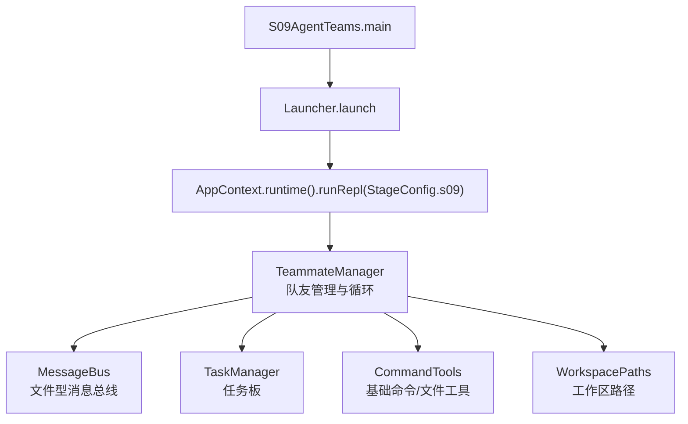
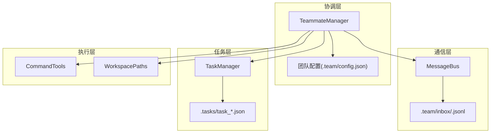
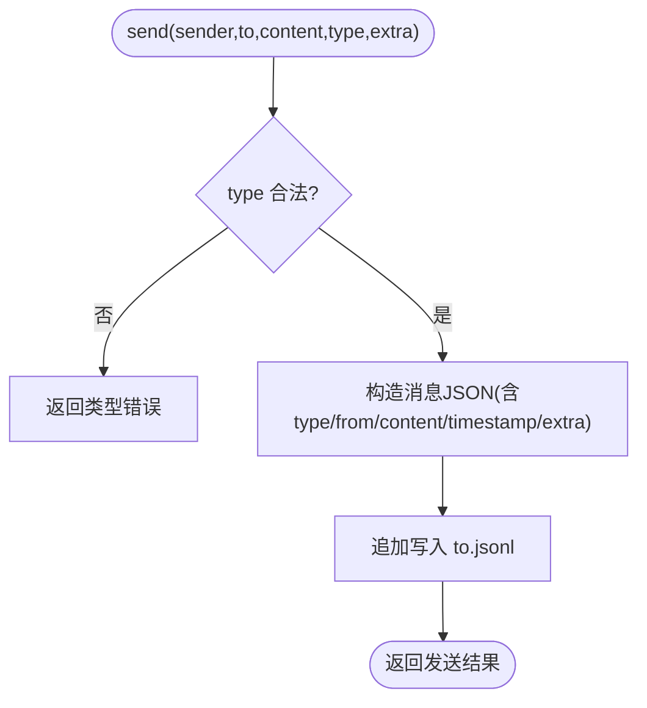
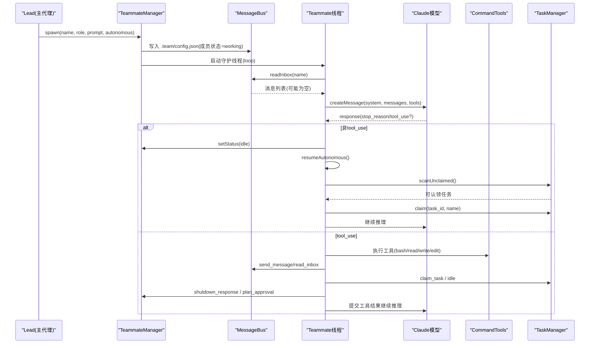
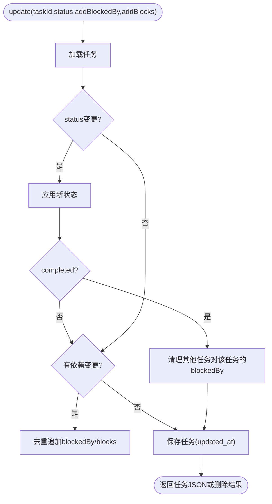
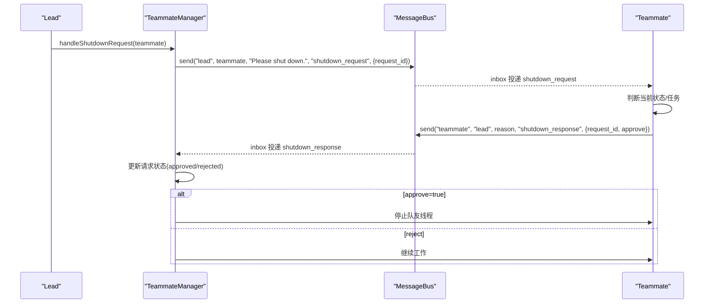
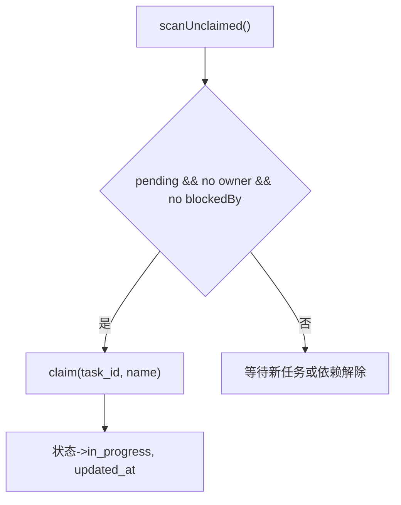
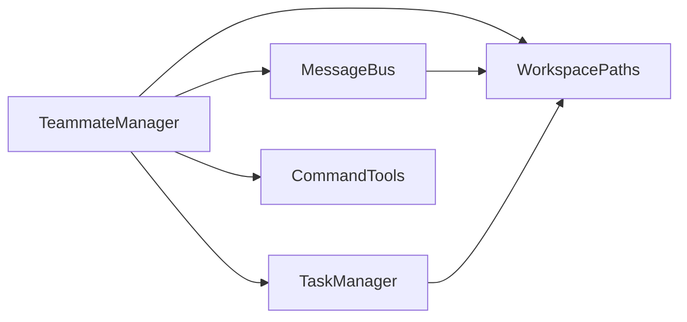

# S09: 代理团队协作

<cite>
**本文引用的文件**
- [S09AgentTeams.java](file://src/main/java/com/learnclaudecode/agents/S09AgentTeams.java)
- [Launcher.java](file://src/main/java/com/learnclaudecode/agents/Launcher.java)
- [StageConfig.java](file://src/main/java/com/learnclaudecode/agents/StageConfig.java)
- [MessageBus.java](file://src/main/java/com/learnclaudecode/team/MessageBus.java)
- [TeammateManager.java](file://src/main/java/com/learnclaudecode/team/TeammateManager.java)
- [TaskManager.java](file://src/main/java/com/learnclaudecode/tasks/TaskManager.java)
- [WorkspacePaths.java](file://src/main/java/com/learnclaudecode/common/WorkspacePaths.java)
- [CommandTools.java](file://src/main/java/com/learnclaudecode/tools/CommandTools.java)
- [TeamMessage.java](file://src/main/java/com/learnclaudecode/model/TeamMessage.java)
- [TaskRecord.java](file://src/main/java/com/learnclaudecode/model/TaskRecord.java)
</cite>

## 目录
1. [简介](#简介)
2. [项目结构](#项目结构)
3. [核心组件](#核心组件)
4. [架构总览](#架构总览)
5. [详细组件分析](#详细组件分析)
6. [依赖关系分析](#依赖关系分析)
7. [性能与扩展性](#性能与扩展性)
8. [故障处理与排障指南](#故障处理与排障指南)
9. [结论](#结论)
10. [附录：协作示例与最佳实践](#附录协作示例与最佳实践)

## 简介
本章节面向“多代理团队协作”的完整实现，聚焦 S09 阶段的核心能力：通过 MessageBus 的文件型消息总线进行低耦合通信，由 TeammateManager 负责队友生命周期、角色与状态管理，并结合 TaskManager 的任务板实现任务分配与自治认领。文档将解释代理间通信协议、消息路由、负载均衡策略、动态扩展、角色权限与冲突解决机制，并给出分布式协作的性能优化与故障处理建议。

## 项目结构
S09 的入口是 S09AgentTeams.main，它通过 Launcher 启动统一运行时，并使用 StageConfig.s09 提供的工具集（创建队友、发消息、读收件箱、广播等）。运行时在 AppContext 中装配 WorkspacePaths、AnthropicClient、CommandTools、MessageBus、TaskManager 等依赖，并由 TeammateManager 驱动队友线程循环。

图表来源
- [S09AgentTeams.java:9-11](file://src/main/java/com/learnclaudecode/agents/S09AgentTeams.java#L9-L11)
- [Launcher.java:23-25](file://src/main/java/com/learnclaudecode/agents/Launcher.java#L23-L25)
- [StageConfig.java:186-197](file://src/main/java/com/learnclaudecode/agents/StageConfig.java#L186-L197)
- [TeammateManager.java:58-70](file://src/main/java/com/learnclaudecode/team/TeammateManager.java#L58-L70)
- [MessageBus.java:19-42](file://src/main/java/com/learnclaudecode/team/MessageBus.java#L19-L42)
- [TaskManager.java:27-42](file://src/main/java/com/learnclaudecode/tasks/TaskManager.java#L27-L42)
- [WorkspacePaths.java:86-113](file://src/main/java/com/learnclaudecode/common/WorkspacePaths.java#L86-L113)

章节来源
- [S09AgentTeams.java:9-11](file://src/main/java/com/learnclaudecode/agents/S09AgentTeams.java#L9-L11)
- [Launcher.java:23-25](file://src/main/java/com/learnclaudecode/agents/Launcher.java#L23-L25)
- [StageConfig.java:186-197](file://src/main/java/com/learnclaudecode/agents/StageConfig.java#L186-L197)

## 核心组件
- MessageBus：基于 .team/inbox/*.jsonl 的文件型消息总线，提供 send、readInbox、broadcast 三个核心能力，支持 message、broadcast、shutdown_request、shutdown_response、plan_approval_response 等类型。
- TeammateManager：队友管理器，负责 spawn 队友线程、维护成员配置、处理 shutdown_request/plan_approval 协议、构建队友工具集、驱动每个队友的主循环（消费 inbox -> 调用模型 -> 执行工具 -> 状态流转）。
- TaskManager：文件任务系统，提供任务的创建、更新、认领、扫描可认领任务、绑定 worktree、依赖清理等能力，支撑任务板与自治认领。
- WorkspacePaths：安全的工作区路径工具，提供 tasksDir、teamDir、inboxDir 等子目录访问，确保所有 IO 落盘在工作区内。
- CommandTools：基础命令与文件操作工具，供队友执行 bash、读写编辑文件。
- StageConfig：阶段配置器，定义 s09 的工具集（spawn_teammate、list_teammates、send_message、read_inbox、broadcast），以及 system prompt。

章节来源
- [MessageBus.java:19-123](file://src/main/java/com/learnclaudecode/team/MessageBus.java#L19-L123)
- [TeammateManager.java:39-70](file://src/main/java/com/learnclaudecode/team/TeammateManager.java#L39-L70)
- [TaskManager.java:27-42](file://src/main/java/com/learnclaudecode/tasks/TaskManager.java#L27-L42)
- [WorkspacePaths.java:86-113](file://src/main/java/com/learnclaudecode/common/WorkspacePaths.java#L86-L113)
- [CommandTools.java:16-28](file://src/main/java/com/learnclaudecode/tools/CommandTools.java#L16-L28)
- [StageConfig.java:186-197](file://src/main/java/com/learnclaudecode/agents/StageConfig.java#L186-L197)

## 架构总览
S09 采用“主代理 lead + 多个队友 teammate”的协作模式：
- 通信层：MessageBus 使用文件系统作为消息通道，每个队友一个 inbox 文件（name.jsonl），每条消息一行 JSON，具备“写追加、读即清空”的语义。
- 协调层：TeammateManager 维护团队配置（成员名、角色、状态），为每个队友创建独立守护线程运行 loop；同时暴露 handleShutdownRequest、handlePlanReview 等协议接口。
- 任务层：TaskManager 提供共享任务板，支持 pending/in_progress/completed/deleted 状态与 blockedBy/blocks 依赖关系，支持 claim 和 scanUnclaimed 用于自治认领。
- 工具层：CommandTools 提供 bash、read_file、write_file、edit_file 等基础能力；TeammateManager 根据是否自治模式装配不同工具集。

图表来源
- [TeammateManager.java:58-70](file://src/main/java/com/learnclaudecode/team/TeammateManager.java#L58-L70)
- [MessageBus.java:19-42](file://src/main/java/com/learnclaudecode/team/MessageBus.java#L19-L42)
- [TaskManager.java:27-42](file://src/main/java/com/learnclaudecode/tasks/TaskManager.java#L27-L42)
- [WorkspacePaths.java:86-113](file://src/main/java/com/learnclaudecode/common/WorkspacePaths.java#L86-L113)

## 详细组件分析

### MessageBus：文件型消息总线
- 设计要点
  - 消息类型白名单：message、broadcast、shutdown_request、shutdown_response、plan_approval_response。
  - 写入：append 到 <inbox>/<to>.jsonl，每行一条 JSON，包含 type/from/content/timestamp/extra。
  - 读取：一次性读取并清空，实现“读即消费”，避免重复消费。
  - 广播：向除发送者外的所有队友发送 broadcast 类型消息。
- 复杂度与并发
  - send/readInbox/broadcast 均加同步锁，保证单进程内并发安全。
  - 时间戳使用 Instant.now() 毫秒级精度。
- 错误处理
  - 非法类型返回错误字符串；IO 异常捕获后返回错误信息或兜底消息。

图表来源
- [MessageBus.java:54-75](file://src/main/java/com/learnclaudecode/team/MessageBus.java#L54-L75)
- [MessageBus.java:83-102](file://src/main/java/com/learnclaudecode/team/MessageBus.java#L83-L102)
- [MessageBus.java:112-121](file://src/main/java/com/learnclaudecode/team/MessageBus.java#L112-L121)

章节来源
- [MessageBus.java:19-123](file://src/main/java/com/learnclaudecode/team/MessageBus.java#L19-L123)

### TeammateManager：成员管理与队友循环
- 成员管理
  - spawn(name, role, prompt, autonomous)：若同名成员已存在且非 idle/shutdown，则拒绝；否则设置状态为 working 并持久化到 .team/config.json。
  - listAll/members：列出团队成员及其状态。
  - setStatus：更新成员状态与更新时间。
- 协议处理
  - handleShutdownRequest：生成 request_id，记录 pending，向目标队友发送 shutdown_request。
  - handlePlanReview：根据 approve/feedback 更新 planRequests 状态，并向队友回发 plan_approval_response。
- 队友循环 loop
  - 初始化 system prompt（区分自治与非自治）、消息历史、工具集。
  - 每次循环先 readInbox(name)，将 inbox 消息注入对话上下文。
  - 调用 AnthropicClient.createMessage，解析 stop_reason：
    - 若非 tool_use：自治模式下进入 idle，尝试 resumeAutonomous；非自治则结束。
    - 若为 tool_use：按工具名分发执行（bash/read/write/edit/send_message/read_inbox/claim_task/idle/shutdown_response/plan_approval）。
  - 自治恢复 resumeAutonomous：周期性检查 inbox 与新消息，若无则扫描未认领任务并 claim，再注入上下文继续工作。
- 工具装配 teammateTools
  - baseTools + 通信工具（send_message/read_inbox）+ 自治相关（claim_task/idle）或非自治相关（shutdown_response/plan_approval）。

图表来源
- [TeammateManager.java:81-105](file://src/main/java/com/learnclaudecode/team/TeammateManager.java#L81-L105)
- [TeammateManager.java:177-273](file://src/main/java/com/learnclaudecode/team/TeammateManager.java#L177-L273)
- [TeammateManager.java:321-356](file://src/main/java/com/learnclaudecode/team/TeammateManager.java#L321-L356)
- [TaskManager.java:168-197](file://src/main/java/com/learnclaudecode/tasks/TaskManager.java#L168-L197)

章节来源
- [TeammateManager.java:39-438](file://src/main/java/com/learnclaudecode/team/TeammateManager.java#L39-L438)
- [StageConfig.java:186-197](file://src/main/java/com/learnclaudecode/agents/StageConfig.java#L186-L197)

### TaskManager：任务板与依赖管理
- 任务状态机
  - pending -> in_progress（claim/bindWorktree）-> completed（update）-> deleted（update删除文件）。
- 依赖关系
  - blockedBy：前置任务ID集合；blocks：被当前任务阻塞的后置任务ID集合。
  - 完成时自动清理其他任务对它的 blockedBy 依赖。
- 可认领任务
  - scanUnclaimed：筛选 pending、无 owner、blockedBy 为空的任务。
- 工作区隔离
  - bindWorktree/unbindWorktree：将任务与工作树关联，便于多任务并行隔离。

图表来源
- [TaskManager.java:84-133](file://src/main/java/com/learnclaudecode/tasks/TaskManager.java#L84-L133)
- [TaskManager.java:168-197](file://src/main/java/com/learnclaudecode/tasks/TaskManager.java#L168-L197)
- [TaskManager.java:215-235](file://src/main/java/com/learnclaudecode/tasks/TaskManager.java#L215-L235)
- [TaskManager.java:329-336](file://src/main/java/com/learnclaudecode/tasks/TaskManager.java#L329-L336)

章节来源
- [TaskManager.java:27-338](file://src/main/java/com/learnclaudecode/tasks/TaskManager.java#L27-L338)
- [TaskRecord.java:9-62](file://src/main/java/com/learnclaudecode/model/TaskRecord.java#L9-L62)

### 通信协议与消息路由
- 消息类型
  - message：普通点对点消息。
  - broadcast：广播给所有队友（排除发送者）。
  - shutdown_request：请求关闭特定队友。
  - shutdown_response：队友响应关闭请求（approve/reject）。
  - plan_approval_response：队友提交计划，lead 审批后回传结果。
- 路由规则
  - send：写入 <inbox>/<to>.jsonl。
  - readInbox：读取并清空 <inbox>/<name>.jsonl。
  - broadcast：遍历 names，逐个 send。
- 协议流程（以 shutdown 为例）
  - lead 发送 shutdown_request（带 request_id）。
  - 队友 loop 收到后，决定是否 approve，并发送 shutdown_response。
  - lead 根据 approve 状态更新请求状态，必要时终止队友线程。

图表来源
- [TeammateManager.java:141-167](file://src/main/java/com/learnclaudecode/team/TeammateManager.java#L141-L167)
- [MessageBus.java:54-75](file://src/main/java/com/learnclaudecode/team/MessageBus.java#L54-L75)
- [MessageBus.java:112-121](file://src/main/java/com/learnclaudecode/team/MessageBus.java#L112-L121)

章节来源
- [TeammateManager.java:141-167](file://src/main/java/com/learnclaudecode/team/TeammateManager.java#L141-L167)
- [MessageBus.java:19-123](file://src/main/java/com/learnclaudecode/team/MessageBus.java#L19-L123)

### 负载均衡与任务分配
- 负载发现：scanUnclaimed 返回可立即认领的任务（pending、无 owner、无 blockedBy）。
- 认领策略：
  - 非自治队友：由 lead 通过工具显式分配。
  - 自治队友：loop 中 resumeAutonomous 周期扫描并 claim 第一个可用任务，实现简单轮询式负载均衡。
- 依赖约束：blockedBy 保证任务顺序，避免资源竞争与逻辑冲突。

图表来源
- [TaskManager.java:187-197](file://src/main/java/com/learnclaudecode/tasks/TaskManager.java#L187-L197)
- [TaskManager.java:168-175](file://src/main/java/com/learnclaudecode/tasks/TaskManager.java#L168-L175)
- [TeammateManager.java:321-356](file://src/main/java/com/learnclaudecode/team/TeammateManager.java#L321-L356)

章节来源
- [TaskManager.java:168-197](file://src/main/java/com/learnclaudecode/tasks/TaskManager.java#L168-L197)
- [TeammateManager.java:321-356](file://src/main/java/com/learnclaudecode/team/TeammateManager.java#L321-L356)

### 动态扩展、角色权限与冲突解决
- 动态扩展：spawn 可随时新增队友，成员状态持久化到 .team/config.json；每个队友独立线程，互不阻塞。
- 角色权限：
  - 非自治队友：拥有 send_message/read_inbox/shutdown_response/plan_approval 等工具，受 lead 控制。
  - 自治队友：额外拥有 claim_task/idle，可自主从任务板领取工作。
- 冲突解决：
  - 任务冲突：通过 blockedBy/blocks 表达依赖，避免并发修改同一资源。
  - 消息冲突：inbox 读后即清空，避免重复消费；broadcast 排除发送者，防止自环。
  - 状态冲突：setStatus/loadConfig/saveConfig 使用同步方法保护配置一致性。

章节来源
- [TeammateManager.java:81-105](file://src/main/java/com/learnclaudecode/team/TeammateManager.java#L81-L105)
- [TeammateManager.java:281-294](file://src/main/java/com/learnclaudecode/team/TeammateManager.java#L281-L294)
- [TaskManager.java:84-133](file://src/main/java/com/learnclaudecode/tasks/TaskManager.java#L84-L133)
- [MessageBus.java:54-75](file://src/main/java/com/learnclaudecode/team/MessageBus.java#L54-L75)

## 依赖关系分析
- TeammateManager 依赖：
  - WorkspacePaths：获取 teamDir/inboxDir。
  - AnthropicClient：调用模型推理。
  - CommandTools：执行基础命令与文件操作。
  - MessageBus：收发消息。
  - TaskManager：任务板与自治认领。
- MessageBus 依赖：
  - WorkspacePaths：inbox 目录。
  - JsonUtils：序列化/反序列化。
- TaskManager 依赖：
  - WorkspacePaths：tasks 目录。
  - JsonUtils：任务记录序列化。

图表来源
- [TeammateManager.java:58-70](file://src/main/java/com/learnclaudecode/team/TeammateManager.java#L58-L70)
- [MessageBus.java:19-42](file://src/main/java/com/learnclaudecode/team/MessageBus.java#L19-L42)
- [TaskManager.java:27-42](file://src/main/java/com/learnclaudecode/tasks/TaskManager.java#L27-L42)
- [WorkspacePaths.java:86-113](file://src/main/java/com/learnclaudecode/common/WorkspacePaths.java#L86-L113)

章节来源
- [TeammateManager.java:58-70](file://src/main/java/com/learnclaudecode/team/TeammateManager.java#L58-L70)
- [MessageBus.java:19-42](file://src/main/java/com/learnclaudecode/team/MessageBus.java#L19-L42)
- [TaskManager.java:27-42](file://src/main/java/com/learnclaudecode/tasks/TaskManager.java#L27-L42)

## 性能与扩展性
- 文件 I/O 优化
  - 消息写入采用 append 模式，减少频繁打开/关闭文件开销。
  - 读取后立即清空 inbox，降低后续读取成本。
- 并发与锁粒度
  - MessageBus 的 send/readInbox/broadcast 加同步锁，避免竞态。
  - TaskManager 的 update/claim/listAll 等同步方法，保证任务状态一致性。
- 模型调用频率
  - 自治队友在 idle 阶段周期性检查 inbox 与任务板，避免高频空转；可通过调整休眠间隔平衡响应速度与资源消耗。
- 可扩展性建议
  - 引入优先级队列或加权轮询替代简单 scanUnclaimed，提升复杂场景下的负载均衡效果。
  - 将 inbox 替换为轻量消息队列（如内存队列或嵌入式 KV），提高吞吐与可靠性。
  - 增加健康检查与心跳机制，检测僵尸队友并自动回收。

[本节为通用性能讨论，无需具体文件引用]

## 故障处理与排障指南
- 常见错误
  - 非法消息类型：MessageBus.send 会返回类型错误提示。
  - 文件 IO 异常：MessageBus.readInbox 捕获 IOException 并返回兜底错误消息；TaskManager 在读取/保存失败时抛出异常。
  - 命令执行超时：CommandTools.runBash 限制 120 秒，超时强制销毁进程。
- 排查步骤
  - 检查 .team/inbox 下是否存在对应队友的 jsonl 文件，确认消息是否送达。
  - 查看 .team/config.json 中成员状态是否为 idle/shutdown，确认队友是否存活。
  - 检查 .tasks 目录下任务文件状态与依赖，确认是否有 blockedBy 导致无法认领。
  - 观察命令输出与错误日志，定位 CommandTools 执行失败原因。

章节来源
- [MessageBus.java:54-75](file://src/main/java/com/learnclaudecode/team/MessageBus.java#L54-L75)
- [MessageBus.java:83-102](file://src/main/java/com/learnclaudecode/team/MessageBus.java#L83-L102)
- [CommandTools.java:36-65](file://src/main/java/com/learnclaudecode/tools/CommandTools.java#L36-L65)
- [TaskManager.java:276-322](file://src/main/java/com/learnclaudecode/tasks/TaskManager.java#L276-L322)

## 结论
S09 实现了基于文件系统的低耦合多代理协作框架：MessageBus 提供可靠的消息通道，TeammateManager 管理队友生命周期与协议交互，TaskManager 提供任务板与依赖管理，配合自治认领机制实现简单的负载均衡。该设计易于扩展，适合教学与原型验证；在生产环境中可进一步引入更健壮的存储与调度机制以提升性能与可靠性。

[本节为总结性内容，无需具体文件引用]

## 附录：协作示例与最佳实践
- 组建团队
  - 使用 spawn 创建多个队友，指定角色与初始提示，例如“前端开发”“后端开发”。
  - 通过 list_teammates 查看成员状态，确保均为 working/idle。
- 分配任务
  - 使用 TaskManager 创建任务，设置 subject/description，必要时添加 blockedBy 依赖。
  - 非自治队友由 lead 显式分配；自治队友通过 claim_task 自动领取。
- 协调工作
  - 使用 send_message 进行点对点沟通，使用 broadcast 通知全体。
  - 对于需要审批的计划，使用 plan_approval 提交，lead 通过 plan_approval_response 反馈结果。
- 动态扩展
  - 随时 spawn 新队友，加入团队分工；通过 setStatus 调整状态。
- 冲突解决
  - 利用 blockedBy 表达依赖，避免并发冲突。
  - 通过 inbox 读后即清空避免重复消费；broadcast 排除发送者防止自环。
- 性能优化
  - 合理设置自治队友的 idle 检查间隔，平衡响应速度与资源占用。
  - 将大文件读写限制行数，避免上下文溢出。
- 故障处理
  - 遇到命令执行失败，检查 CommandTools 的错误输出。
  - 消息未送达，检查 inbox 目录与权限；任务不可认领，检查依赖与状态。

[本节为实践指导，无需具体文件引用]