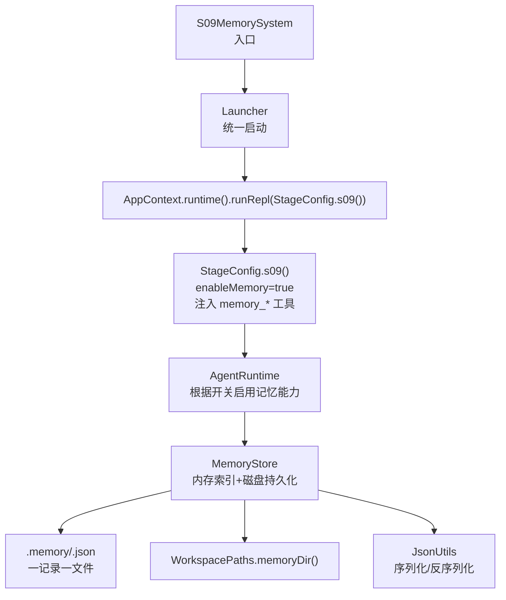
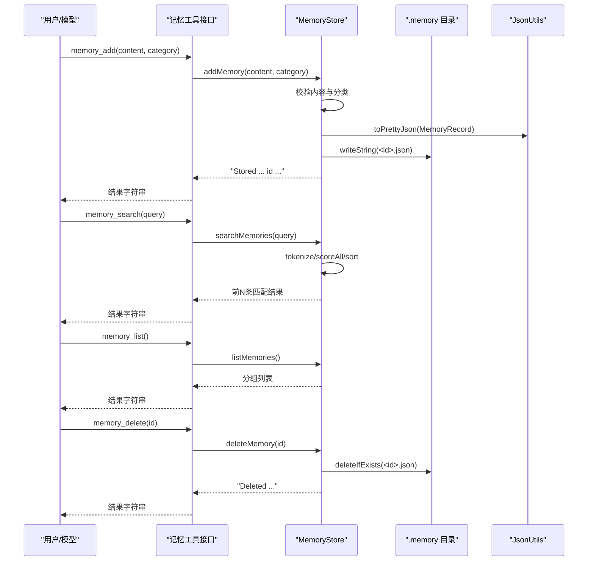
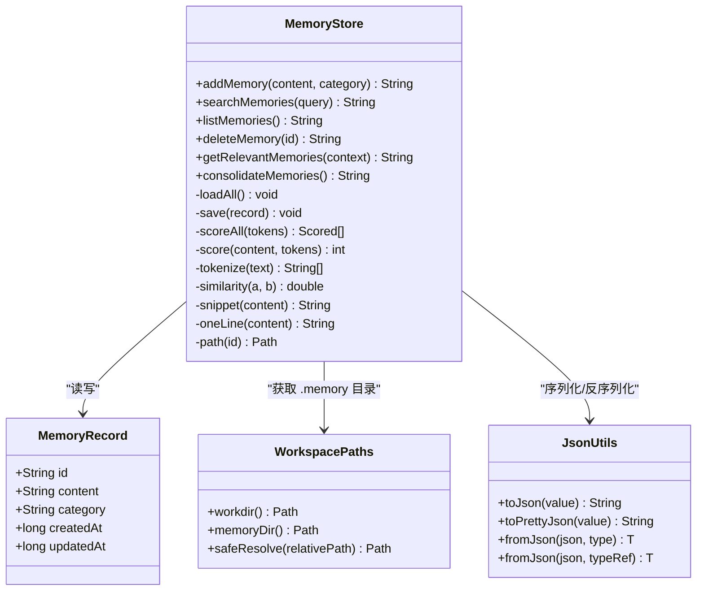
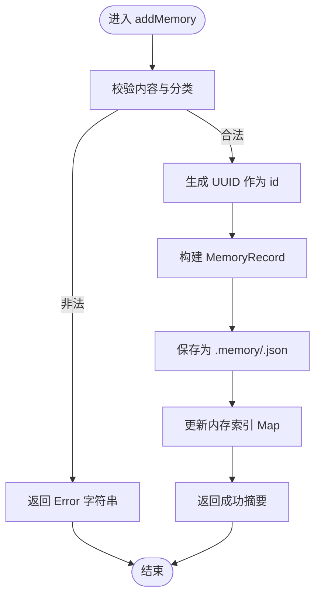
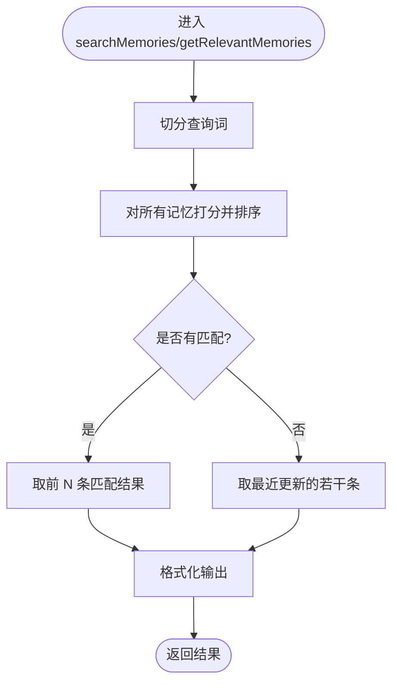
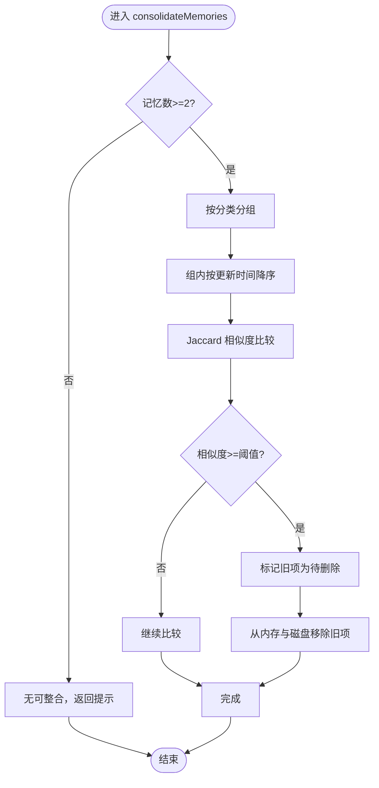
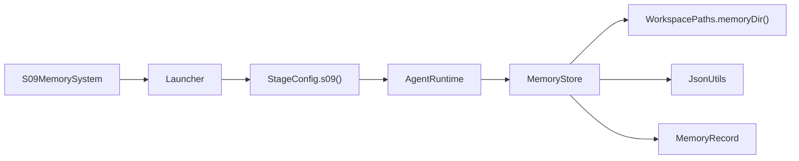

# S09: 记忆系统

<cite>
**本文引用的文件**
- [S09MemorySystem.java](file://src/main/java/com/learnclaudecode/agents/S09MemorySystem.java)
- [Launcher.java](file://src/main/java/com/learnclaudecode/agents/Launcher.java)
- [StageConfig.java](file://src/main/java/com/learnclaudecode/agents/StageConfig.java)
- [MemoryStore.java](file://src/main/java/com/learnclaudecode/memory/MemoryStore.java)
- [MemoryRecord.java](file://src/main/java/com/learnclaudecode/model/MemoryRecord.java)
- [WorkspacePaths.java](file://src/main/java/com/learnclaudecode/common/WorkspacePaths.java)
- [JsonUtils.java](file://src/main/java/com/learnclaudecode/common/JsonUtils.java)
- [MemoryStoreTest.java](file://src/test/java/com/learnclaudecode/memory/MemoryStoreTest.java)
</cite>

## 目录
1. [简介](#简介)
2. [项目结构](#项目结构)
3. [核心组件](#核心组件)
4. [架构总览](#架构总览)
5. [详细组件分析](#详细组件分析)
6. [依赖关系分析](#依赖关系分析)
7. [性能与复杂度](#性能与复杂度)
8. [故障排查指南](#故障排查指南)
9. [结论](#结论)

## 简介
本章节聚焦于“S09: 记忆系统”，目标是让 Agent 具备跨会话的持久记忆能力：对话历史可以被压缩或清空，但重要的事实、偏好和操作流程应被持久化到工作区的 .memory 目录中，在重启后仍可恢复。该阶段通过一组记忆工具（新增、检索、列举、删除）暴露给模型，并由 MemoryStore 负责内存索引与磁盘落盘的一致性维护。

## 项目结构
S09 的记忆系统由“入口配置 + 运行时启动 + 存储实现 + 数据模型 + 路径与序列化”组成：
- 入口与启动：S09MemorySystem 仅选择 s09 阶段配置并交给 Launcher 统一启动；
- 阶段配置：StageConfig.s09 开启 enableMemory 并注入 memory_* 工具集；
- 存储实现：MemoryStore 提供增删查、相关度检索、分组列举、重复整合等能力；
- 数据模型：MemoryRecord 描述单条记忆的元数据与内容；
- 基础设施：WorkspacePaths 提供 .memory 目录路径并确保存在；JsonUtils 负责 JSON 序列化/反序列化。

图表来源
- [S09MemorySystem.java:13-16](file://src/main/java/com/learnclaudecode/agents/S09MemorySystem.java#L13-L16)
- [Launcher.java:23-26](file://src/main/java/com/learnclaudecode/agents/Launcher.java#L23-L26)
- [StageConfig.java:437-453](file://src/main/java/com/learnclaudecode/agents/StageConfig.java#L437-L453)
- [MemoryStore.java:78-81](file://src/main/java/com/learnclaudecode/memory/MemoryStore.java#L78-L81)
- [WorkspacePaths.java:157-159](file://src/main/java/com/learnclaudecode/common/WorkspacePaths.java#L157-L159)
- [JsonUtils.java:43-49](file://src/main/java/com/learnclaudecode/common/JsonUtils.java#L43-L49)

章节来源
- [S09MemorySystem.java:13-16](file://src/main/java/com/learnclaudecode/agents/S09MemorySystem.java#L13-L16)
- [Launcher.java:23-26](file://src/main/java/com/learnclaudecode/agents/Launcher.java#L23-L26)
- [StageConfig.java:437-453](file://src/main/java/com/learnclaudecode/agents/StageConfig.java#L437-L453)

## 核心组件
- 入口与编排
  - S09MemorySystem：最小入口，调用 Launcher.launch(StageConfig.s09())。
  - Launcher：统一入口，创建 AppContext 并运行 REPL，将 StageConfig 注入运行时。
  - StageConfig.s09：打开 enableMemory，并注册 memory_add、memory_search、memory_delete、memory_list 四个工具，同时设置 system prompt 提示使用记忆。
- 存储层
  - MemoryStore：内存索引（ConcurrentHashMap）+ 磁盘持久化（.memory/*.json），提供 add/search/list/delete/getRelevantMemories/consolidate 等方法。
  - MemoryRecord：单条记忆的数据结构，包含 id、content、category、createdAt、updatedAt。
- 基础设施
  - WorkspacePaths：提供 .memory 目录路径并确保存在。
  - JsonUtils：基于 Jackson 的统一序列化/反序列化。

章节来源
- [S09MemorySystem.java:13-16](file://src/main/java/com/learnclaudecode/agents/S09MemorySystem.java#L13-L16)
- [Launcher.java:23-26](file://src/main/java/com/learnclaudecode/agents/Launcher.java#L23-L26)
- [StageConfig.java:437-453](file://src/main/java/com/learnclaudecode/agents/StageConfig.java#L437-L453)
- [MemoryStore.java:78-81](file://src/main/java/com/learnclaudecode/memory/MemoryStore.java#L78-L81)
- [MemoryRecord.java:18-65](file://src/main/java/com/learnclaudecode/model/MemoryRecord.java#L18-L65)
- [WorkspacePaths.java:157-159](file://src/main/java/com/learnclaudecode/common/WorkspacePaths.java#L157-L159)
- [JsonUtils.java:43-49](file://src/main/java/com/learnclaudecode/common/JsonUtils.java#L43-L49)

## 架构总览
记忆系统的整体流程如下：
- 启动时：MemoryStore 构造器从 .memory 目录加载所有已有记录到内存 Map；
- 写入时：addMemory 生成 UUID 作为 id，落盘为 <id>.json，并更新内存索引；
- 读取时：searchMemories 按关键词打分排序返回 Top-N；listMemories 按分类分组展示；getRelevantMemories 用于注入上下文；
- 管理时：deleteMemory 同步删除内存与磁盘；consolidateMemories 按分类内 Jaccard 相似度合并重复项。

图表来源
- [MemoryStore.java:90-109](file://src/main/java/com/learnclaudecode/memory/MemoryStore.java#L90-L109)
- [MemoryStore.java:121-146](file://src/main/java/com/learnclaudecode/memory/MemoryStore.java#L121-L146)
- [MemoryStore.java:153-181](file://src/main/java/com/learnclaudecode/memory/MemoryStore.java#L153-L181)
- [MemoryStore.java:189-204](file://src/main/java/com/learnclaudecode/memory/MemoryStore.java#L189-L204)
- [JsonUtils.java:43-49](file://src/main/java/com/learnclaudecode/common/JsonUtils.java#L43-L49)

## 详细组件分析

### 类与关系图（代码级）

图表来源
- [MemoryStore.java:38-476](file://src/main/java/com/learnclaudecode/memory/MemoryStore.java#L38-L476)
- [MemoryRecord.java:18-65](file://src/main/java/com/learnclaudecode/model/MemoryRecord.java#L18-L65)
- [WorkspacePaths.java:157-159](file://src/main/java/com/learnclaudecode/common/WorkspacePaths.java#L157-L159)
- [JsonUtils.java:29-81](file://src/main/java/com/learnclaudecode/common/JsonUtils.java#L29-L81)

### 关键流程与时序

#### 新增记忆流程

图表来源
- [MemoryStore.java:90-109](file://src/main/java/com/learnclaudecode/memory/MemoryStore.java#L90-L109)
- [MemoryStore.java:322-324](file://src/main/java/com/learnclaudecode/memory/MemoryStore.java#L322-L324)

#### 检索与注入流程

图表来源
- [MemoryStore.java:121-146](file://src/main/java/com/learnclaudecode/memory/MemoryStore.java#L121-L146)
- [MemoryStore.java:217-244](file://src/main/java/com/learnclaudecode/memory/MemoryStore.java#L217-L244)
- [MemoryStore.java:359-371](file://src/main/java/com/learnclaudecode/memory/MemoryStore.java#L359-L371)

#### 整合重复记忆流程

图表来源
- [MemoryStore.java:255-304](file://src/main/java/com/learnclaudecode/memory/MemoryStore.java#L255-L304)
- [MemoryStore.java:424-438](file://src/main/java/com/learnclaudecode/memory/MemoryStore.java#L424-L438)

### 数据模型说明
- MemoryRecord：每条记忆的唯一标识、内容、分类、创建时间与更新时间。使用 @JsonIgnoreProperties(ignoreUnknown = true) 保证向前兼容，旧版本 JSON 可被正常反序列化。
- 分类约束：fact、preference、procedure，用于组织与展示记忆，避免无序膨胀。

章节来源
- [MemoryRecord.java:18-65](file://src/main/java/com/learnclaudecode/model/MemoryRecord.java#L18-L65)
- [MemoryStore.java:40-57](file://src/main/java/com/learnclaudecode/memory/MemoryStore.java#L40-L57)

### 阶段配置与工具注入
- StageConfig.s09 打开 enableMemory，并注入以下工具：
  - memory_add：存储记忆（含内容与分类）
  - memory_search：搜索记忆
  - memory_delete：删除记忆
  - memory_list：列举记忆
- system prompt 会提示模型使用这些工具进行跨会话记忆管理。

章节来源
- [StageConfig.java:437-453](file://src/main/java/com/learnclaudecode/agents/StageConfig.java#L437-L453)

## 依赖关系分析
- MemoryStore 依赖：
  - WorkspacePaths：获取 .memory 目录并确保存在；
  - JsonUtils：序列化/反序列化 MemoryRecord；
  - MemoryRecord：数据载体。
- 启动链路：
  - S09MemorySystem -> Launcher -> AppContext.runtime().runRepl(StageConfig.s09()) -> 根据 enableMemory 注入记忆工具 -> 调用 MemoryStore。

图表来源
- [S09MemorySystem.java:13-16](file://src/main/java/com/learnclaudecode/agents/S09MemorySystem.java#L13-L16)
- [Launcher.java:23-26](file://src/main/java/com/learnclaudecode/agents/Launcher.java#L23-L26)
- [StageConfig.java:437-453](file://src/main/java/com/learnclaudecode/agents/StageConfig.java#L437-L453)
- [MemoryStore.java:78-81](file://src/main/java/com/learnclaudecode/memory/MemoryStore.java#L78-L81)
- [WorkspacePaths.java:157-159](file://src/main/java/com/learnclaudecode/common/WorkspacePaths.java#L157-L159)
- [JsonUtils.java:43-49](file://src/main/java/com/learnclaudecode/common/JsonUtils.java#L43-L49)

## 性能与复杂度
- 时间复杂度
  - 新增：O(1) 写入单个 JSON 文件；
  - 检索：O(N) 扫描全部记忆并打分排序，N 为记忆总数；
  - 列举：O(N) 分组与排序；
  - 删除：O(1) 内存删除 + O(1) 文件删除；
  - 整合：O(K^2) 每分类内两两比较，K 为该分类记忆数量。
- 空间复杂度
  - 内存索引：O(N) 存储所有 MemoryRecord；
  - 磁盘：每条记忆一个 JSON 文件，便于 diff 与手工修复。
- 并发特性
  - 读操作走 ConcurrentHashMap，写操作加 synchronized，保证一致性；
  - 单个文件损坏不影响其他记忆加载，体现优雅降级。

[本节为通用性能讨论，不直接分析具体文件]

## 故障排查指南
- 常见问题
  - 空内容或非法分类：addMemory 会返回错误字符串，检查传入参数；
  - 未找到记忆：deleteMemory 对未知 id 返回错误，确认 id 是否正确；
  - 无匹配检索：searchMemories 返回“无匹配”，尝试调整查询词或使用 getRelevantMemories 的兜底策略；
  - 磁盘不可用：写入失败返回错误字符串，检查 .memory 目录权限与磁盘空间。
- 测试覆盖
  - 单元测试验证了新增、检索、列举、删除、整合以及跨实例持久化行为，可作为回归参考。

章节来源
- [MemoryStore.java:90-109](file://src/main/java/com/learnclaudecode/memory/MemoryStore.java#L90-L109)
- [MemoryStore.java:189-204](file://src/main/java/com/learnclaudecode/memory/MemoryStore.java#L189-L204)
- [MemoryStore.java:121-146](file://src/main/java/com/learnclaudecode/memory/MemoryStore.java#L121-L146)
- [MemoryStoreTest.java:52-177](file://src/test/java/com/learnclaudecode/memory/MemoryStoreTest.java#L52-L177)

## 结论
S09 记忆系统通过“内存索引 + 一记录一文件”的持久化方案，实现了跨会话的知识沉淀。它在不改变对话上下文的前提下，让 Agent 能够记住重要信息并在后续会话中检索与复用。结合分类管理与重复整合机制，记忆库可在长期运行中保持精炼与可用。配合统一的启动与配置体系，记忆能力以工具形式平滑接入 Agent 的工作流。