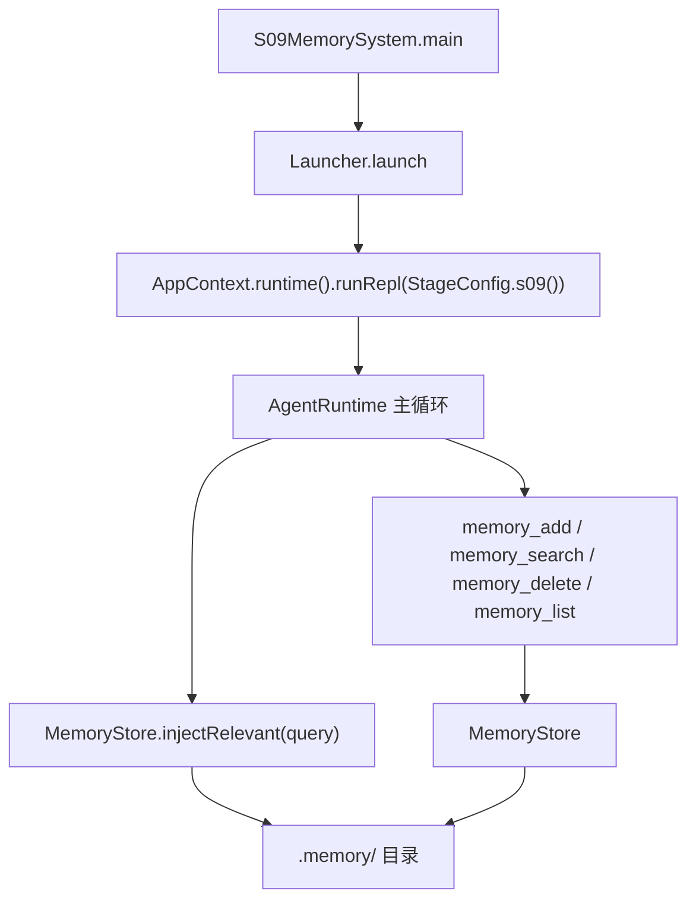
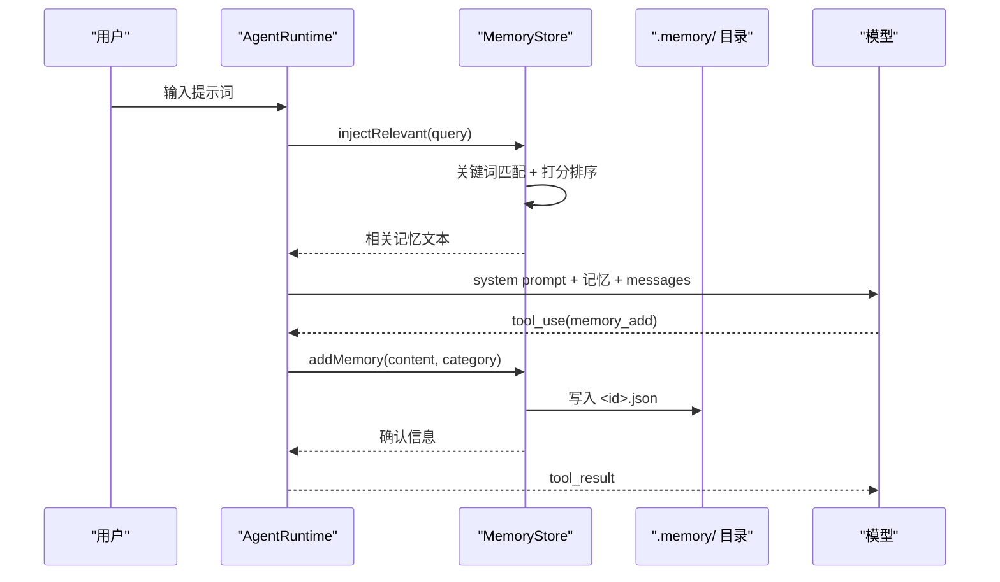

# S09: 记忆系统

<cite>
**本文引用的文件**
- [MemoryStore.java](file://src/main/java/com/learnclaudecode/memory/MemoryStore.java)
- [MemoryRecord.java](file://src/main/java/com/learnclaudecode/model/MemoryRecord.java)
- [StageConfig.java](file://src/main/java/com/learnclaudecode/agents/StageConfig.java)
- [S09MemorySystem.java](file://src/main/java/com/learnclaudecode/agents/S09MemorySystem.java)
- [AgentRuntime.java](file://src/main/java/com/learnclaudecode/agents/AgentRuntime.java)
- [WorkspacePaths.java](file://src/main/java/com/learnclaudecode/common/WorkspacePaths.java)
</cite>

## 目录
1. [简介](#简介)
2. [教学目标](#教学目标)
3. [项目结构](#项目结构)
4. [核心组件](#核心组件)
5. [架构总览](#架构总览)
6. [详细组件分析](#详细组件分析)
7. [工具列表](#工具列表)
8. [持久化机制](#持久化机制)
9. [与前后阶段的关系](#与前后阶段的关系)
10. [故障排查指南](#故障排查指南)
11. [结论](#结论)

## 简介

> **座右铭："记住重要的，遗忘无关的"**

在 S08（上下文压缩）中，我们学会了如何在单次会话内管理过长的对话历史。但压缩有一个根本局限：**会话结束后，所有上下文都会消失**。下一次启动 Agent，它完全不记得上次做了什么、用户偏好什么、项目有哪些约定。

S09 引入**记忆系统（Memory System）**，让 Agent 具备跨会话的持久记忆能力。重要的事实、用户偏好、操作流程被单独存储到 `.memory/` 目录，即使对话历史被压缩甚至清空，这些记忆依然存在。

本阶段的核心问题是：**哪些信息值得"记住"？如何组织、检索和维护这些长期知识？**

## 教学目标

完成本阶段学习后，你应当能够：

- 理解"上下文"与"记忆"的区别：上下文是工作记忆（短期），记忆是长期知识（持久）
- 掌握 MemoryRecord 的三种分类：fact / preference / procedure
- 理解关键词检索的打分机制（词频匹配 + 时间排序）
- 了解记忆整合（consolidate）如何通过 Jaccard 相似度合并重复记忆
- 掌握".memory/ 目录 + 一记录一文件"的持久化模式
- 能够解释记忆注入（inject）如何将相关记忆加入系统提示词

## 项目结构

S09 的记忆能力由"阶段配置 + 记忆存储 + 数据模型 + 运行时注入"四部分构成：

- 阶段配置 `StageConfig.s09()` 启用 `enableMemory=true`，暴露记忆管理工具
- `MemoryStore` 负责记忆的增删查改、整合与注入
- `MemoryRecord` 是记忆的数据模型
- `AgentRuntime` 在每轮循环开始时调用 `injectRelevant` 将相关记忆注入上下文



**图表来源**
- [S09MemorySystem.java](file://src/main/java/com/learnclaudecode/agents/S09MemorySystem.java)
- [MemoryStore.java:78-81](file://src/main/java/com/learnclaudecode/memory/MemoryStore.java#L78-L81)

**章节来源**
- [S09MemorySystem.java](file://src/main/java/com/learnclaudecode/agents/S09MemorySystem.java)
- [MemoryStore.java:1-477](file://src/main/java/com/learnclaudecode/memory/MemoryStore.java#L1-L477)
- [MemoryRecord.java:1-66](file://src/main/java/com/learnclaudecode/model/MemoryRecord.java#L1-L66)

## 核心组件

- **MemoryStore**：持久记忆存储，提供增删查改、关键词检索、记忆整合、上下文注入能力
- **MemoryRecord**：记忆数据模型，包含 id、content、category、createdAt、updatedAt
- **StageConfig.s09()**：启用 `enableMemory` 开关，暴露 4 个记忆管理工具
- **WorkspacePaths.memoryDir()**：提供 `.memory/` 目录路径

**章节来源**
- [MemoryStore.java:38-81](file://src/main/java/com/learnclaudecode/memory/MemoryStore.java#L38-L81)
- [MemoryRecord.java:19-65](file://src/main/java/com/learnclaudecode/model/MemoryRecord.java#L19-L65)

## 架构总览

记忆系统在 Agent 运行时中的位置：



**图表来源**
- [MemoryStore.java:90-108](file://src/main/java/com/learnclaudecode/memory/MemoryStore.java#L90-L108)
- [AgentRuntime.java](file://src/main/java/com/learnclaudecode/agents/AgentRuntime.java)

## 详细组件分析

### MemoryRecord：记忆数据模型

```java
public class MemoryRecord {
    public String id;          // UUID，同时作为文件名
    public String content;     // 记忆正文
    public String category;    // fact / preference / procedure
    public long createdAt;     // 创建时间戳
    public long updatedAt;     // 最近更新时间戳
}
```

三种分类的教学意义：

| 分类 | 含义 | 典型示例 |
|------|------|---------|
| `fact` | 客观事实 | "本项目使用 Java 17"、"API 基础路径是 /v1/messages" |
| `preference` | 用户偏好 | "用户喜欢中文注释"、"代码风格倾向函数式" |
| `procedure` | 可复用操作步骤 | "部署流程：先编译 → 跑测试 → 打包 → 上传" |

分类的目的不是技术约束，而是**教会读者"记忆也要分门别类"**——不同类型的记忆有不同的生命周期和使用场景。

**章节来源**
- [MemoryRecord.java:1-66](file://src/main/java/com/learnclaudecode/model/MemoryRecord.java#L1-L66)

### MemoryStore：核心操作

#### addMemory(content, category)

新增一条记忆：
1. 校验 content 非空、category 合法（只接受 fact/preference/procedure）
2. 生成 UUID 作为 id
3. 构造 MemoryRecord，写入 `.memory/<id>.json`
4. 加入内存索引 Map

#### searchMemories(query)

关键词检索：
1. 将 query 切分为词（按空格和标点）
2. 遍历所有记忆，统计每条记忆内容命中了多少个查询词
3. 按命中数降序排列；命中数相同时，按 updatedAt 降序（越新越靠前）
4. 返回前 MAX_RESULTS（5）条

这是一种朴素但直观可解释的打分方式，适合教学演示。生产环境可替换为向量检索。

#### deleteMemory(id)

按 ID 删除：从内存 Map 移除，删除对应 JSON 文件。

#### consolidate()

记忆整合：
1. 对所有记忆两两计算 Jaccard 相似度（基于词集合）
2. 相似度 ≥ 0.8 的视为"重复"
3. 保留 updatedAt 最新的一条，删除其余
4. 返回整合报告

整合的意义：随着会话累积，记忆库可能产生大量语义重复的条目。整合机制自动"遗忘"冗余，保持记忆库精简。

#### injectRelevant(query)

上下文注入：
1. 用当前用户输入作为 query 调用 searchMemories
2. 将命中的记忆格式化为文本块
3. 返回给 AgentRuntime，注入到系统提示词或消息历史中

这使 Agent 在每轮对话开始时就能"想起"与当前任务相关的长期知识。

**章节来源**
- [MemoryStore.java:90-477](file://src/main/java/com/learnclaudecode/memory/MemoryStore.java#L90-L477)

### 并发安全设计

- 内存索引使用 `ConcurrentHashMap`，读操作（search、list、inject）无需加锁
- 写操作（add、delete、consolidate）加 `synchronized`，防止并发写导致文件与内存不一致
- 构造时一次性 `loadAll()` 将磁盘记忆全部载入内存，后续检索走内存，避免每次搜索都扫盘

**章节来源**
- [MemoryStore.java:62-81](file://src/main/java/com/learnclaudecode/memory/MemoryStore.java#L62-L81)

## 工具列表

S09 阶段暴露以下记忆管理工具：

| 工具名 | 功能 | 关键参数 |
|--------|------|---------|
| `memory_add` | 新增一条记忆 | content, category(fact/preference/procedure) |
| `memory_search` | 按关键词检索记忆 | query |
| `memory_delete` | 按 ID 删除记忆 | memory_id |
| `memory_list` | 列出所有记忆（按分类分组） | 无 |

**使用示例**：

```
用户：记住这个项目用 Java 17
Agent 调用：memory_add(content="本项目使用 Java 17 编译", category="fact")
返回：Stored fact memory 550e8400-e29b-...: 本项目使用 Java 17 编译
```

```
用户：之前我说过什么偏好？
Agent 调用：memory_search(query="偏好 喜欢 风格")
返回：[preference] 用户喜欢中文注释 (updated: 2024-01-15)
```

**章节来源**
- [StageConfig.java](file://src/main/java/com/learnclaudecode/agents/StageConfig.java)
- [MemoryStore.java:90-200](file://src/main/java/com/learnclaudecode/memory/MemoryStore.java#L90-L200)

## 持久化机制

### 存储结构

```
.memory/
├── 550e8400-e29b-41d4-a716-446655440000.json
├── 6ba7b810-9dad-11d1-80b4-00c04fd430c8.json
└── ...
```

每条记忆是一个独立的 JSON 文件，文件名即记忆 ID。

### 单条记忆 JSON 格式

```json
{
  "id": "550e8400-e29b-41d4-a716-446655440000",
  "content": "本项目使用 Java 17 编译",
  "category": "fact",
  "createdAt": 1705312800000,
  "updatedAt": 1705312800000
}
```

### 设计选择

| 决策 | 理由 |
|------|------|
| 一记录一文件 | 天然可读、可 diff、可手工修复；与 TaskManager 的 `.tasks/` 模式一致 |
| UUID 作文件名 | 全局唯一，无需额外的 ID 生成器 |
| 启动时全量载入 | 记忆数量有限（教学场景），全量载入后检索走内存，性能更好 |
| @JsonIgnoreProperties | 向前兼容：未来新增字段不会导致旧文件反序列化失败 |

**章节来源**
- [MemoryStore.java:24-37](file://src/main/java/com/learnclaudecode/memory/MemoryStore.java#L24-L37)
- [MemoryRecord.java:14-17](file://src/main/java/com/learnclaudecode/model/MemoryRecord.java#L14-L17)
- [WorkspacePaths.java](file://src/main/java/com/learnclaudecode/common/WorkspacePaths.java)

## 与前后阶段的关系

### 前置阶段

- **S07（技能加载）**：技能是"预置的外部知识"（只读），记忆是"运行时积累的知识"（可写）。二者互补：技能提供领域指导，记忆提供项目上下文
- **S08（上下文压缩）**：压缩解决"单次会话内上下文过长"的问题，记忆解决"跨会话知识丢失"的问题。压缩后重要信息可能丢失，但如果已存入记忆则不受影响

### 后续阶段

- **S10（任务系统）**：任务的描述和状态可以通过记忆持久化，跨会话恢复工作进度
- **S13（多 Agent 协作）**：队友可以共享记忆库，实现团队级别的知识积累
- **S15（集成运行时）**：记忆注入成为主循环的标准步骤，每轮对话前自动检索相关记忆
- **S17（目标循环）**：目标条件可以存入记忆，跨会话追踪长期目标

### 设计演进

```
S07: 技能加载（只读外部知识）
S08: 上下文压缩（短期工作记忆管理）
S09: 记忆系统（长期持久知识） ← 你在这里
S15: 集成运行时（记忆自动注入主循环）
```

**章节来源**
- [StageConfig.java](file://src/main/java/com/learnclaudecode/agents/StageConfig.java)
- [AgentRuntime.java](file://src/main/java/com/learnclaudecode/agents/AgentRuntime.java)

## 故障排查指南

| 现象 | 可能原因 | 定位方法 |
|------|---------|---------|
| memory_add 返回 "Invalid category" | category 不是 fact/preference/procedure | 检查拼写，只接受这三种小写值 |
| memory_search 无结果 | 查询词与记忆内容无交集 | 尝试更宽泛的关键词；用 memory_list 查看全部记忆 |
| 重启后记忆丢失 | .memory/ 目录被清理或路径不正确 | 检查 WorkspacePaths.memoryDir() 指向的目录是否存在 |
| consolidate 未合并重复记忆 | Jaccard 相似度未达 0.8 阈值 | 两条记忆的用词差异较大时不会被合并，属正常行为 |
| 记忆注入未生效 | enableMemory 未开启 | 检查 StageConfig 的 enableMemory 字段 |

**章节来源**
- [MemoryStore.java:90-200](file://src/main/java/com/learnclaudecode/memory/MemoryStore.java#L90-L200)

## 结论

S09 通过记忆系统实现了"记住重要的，遗忘无关的"的跨会话知识管理。MemoryStore 以".memory/ 目录 + 一记录一 JSON 文件"的模式持久化记忆，通过关键词检索和 Jaccard 整合保持记忆库的精简与相关。

关键设计决策：
- **三分类体系**：fact/preference/procedure 教会读者"记忆需要结构化"
- **朴素检索**：词频匹配 + 时间排序，直观可解释，适合教学（生产可换向量检索）
- **自动整合**：Jaccard 相似度 ≥ 0.8 即合并，防止记忆库膨胀
- **启动载入**：全量载入内存后检索无 I/O 开销
- **错误即返回值**：所有方法返回 "Error: ..." 字符串而非抛异常，模型可直接理解

记忆系统补齐了 Agent 的"长期知识"维度：S08 管短期（上下文压缩），S09 管长期（持久记忆），二者共同构成 Agent 的完整记忆体系。
