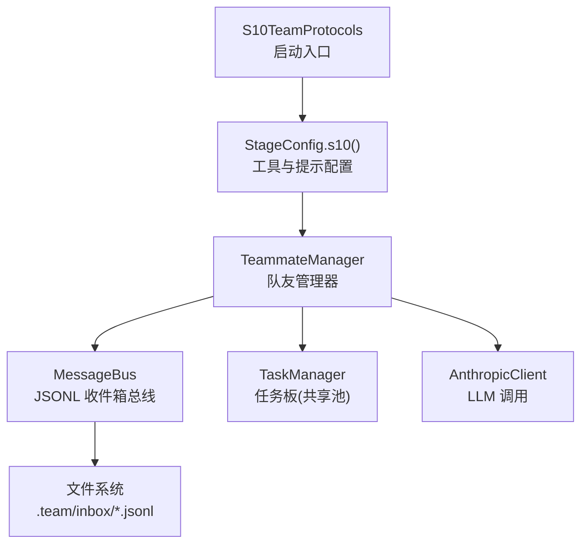
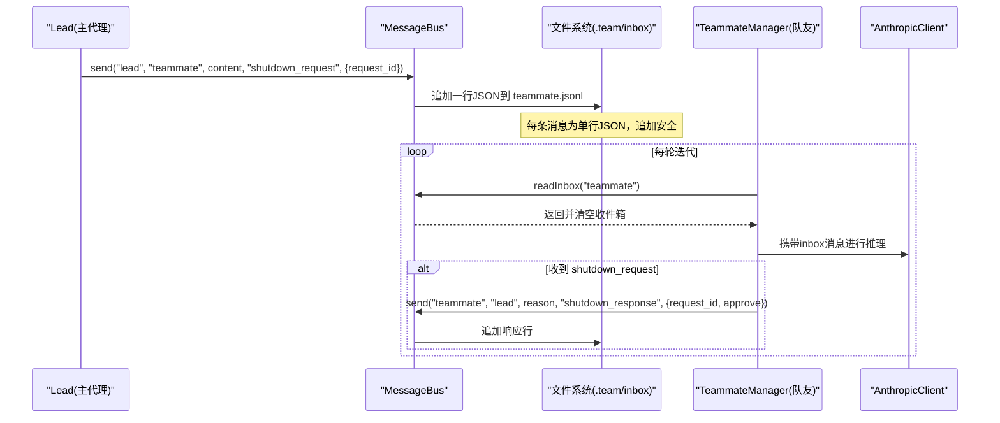
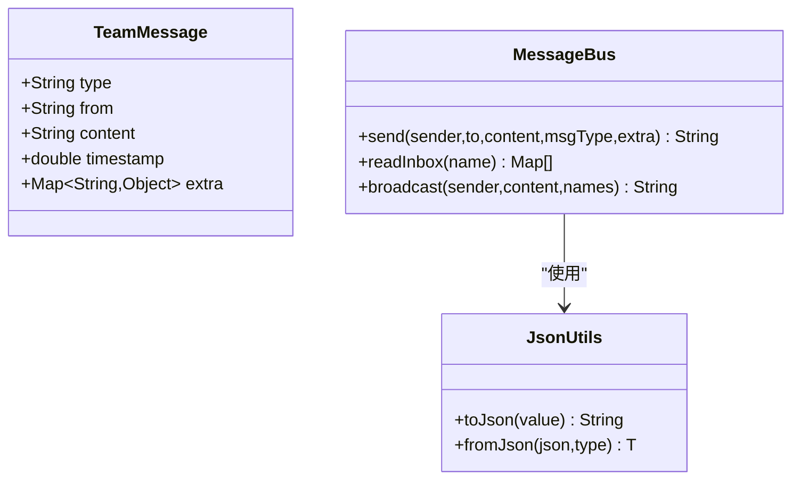
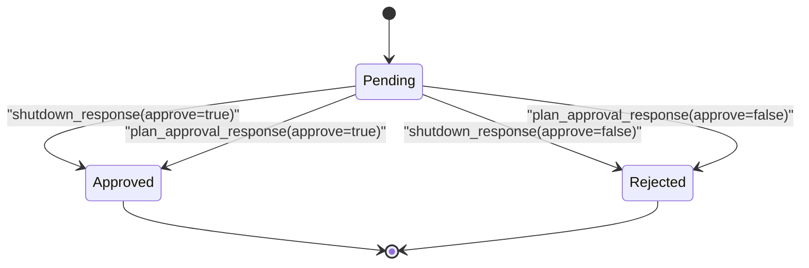
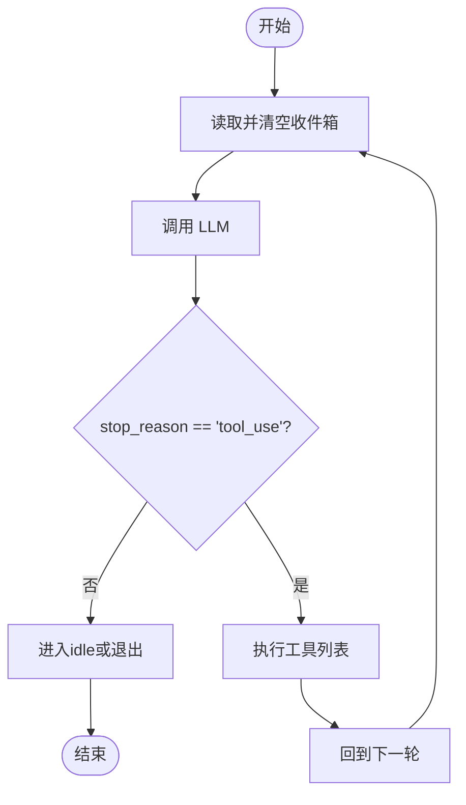
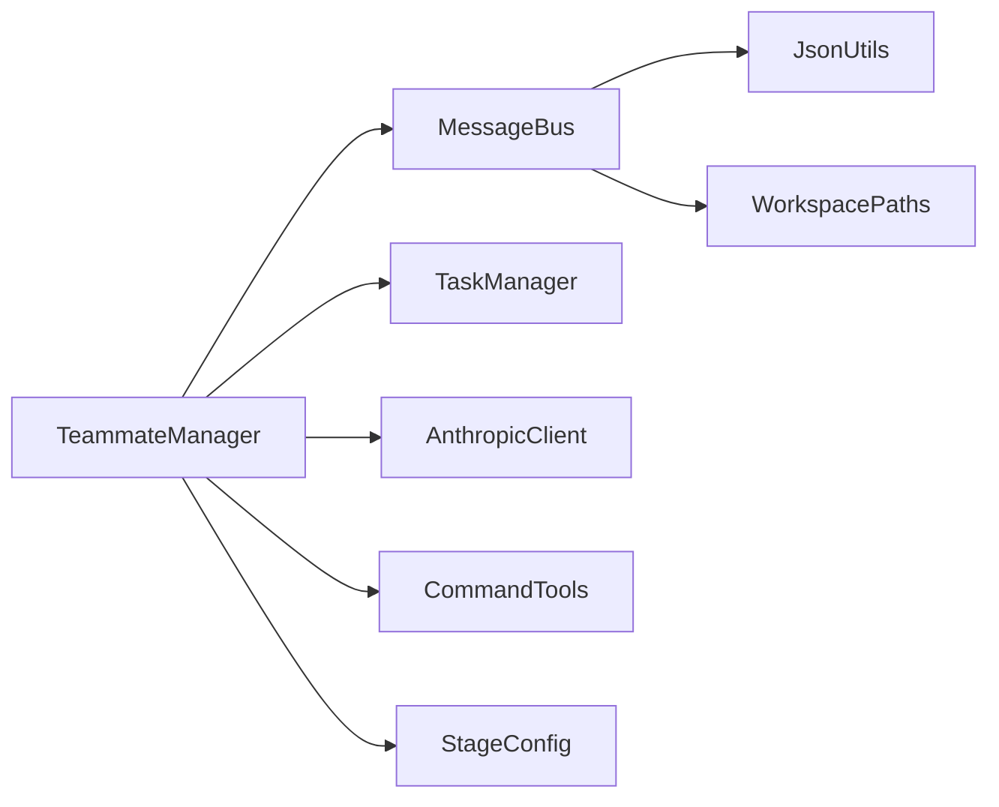

# S10: 团队协议

<cite>
**本文引用的文件**
- [TeamMessage.java](file://src/main/java/com/learnclaudecode/model/TeamMessage.java)
- [MessageBus.java](file://src/main/java/com/learnclaudecode/team/MessageBus.java)
- [TeammateManager.java](file://src/main/java/com/learnclaudecode/team/TeammateManager.java)
- [StageConfig.java](file://src/main/java/com/learnclaudecode/agents/StageConfig.java)
- [JsonUtils.java](file://src/main/java/com/learnclaudecode/common/JsonUtils.java)
- [S10TeamProtocols.java](file://src/main/java/com/learnclaudecode/agents/S10TeamProtocols.java)
- [s10.json（场景）](file://web/src/data/scenarios/s10.json)
- [s10.json（注解）](file://web/src/data/annotations/s10.json)
</cite>

## 目录
1. [简介](#简介)
2. [项目结构](#项目结构)
3. [核心组件](#核心组件)
4. [架构总览](#架构总览)
5. [详细组件分析](#详细组件分析)
6. [依赖关系分析](#依赖关系分析)
7. [性能考量](#性能考量)
8. [故障排查指南](#故障排查指南)
9. [结论](#结论)
10. [附录](#附录)

## 简介
本文件面向“S10：团队协议”的规范设计与实现说明，聚焦多 Agent 协作中的通信协议、消息模型、状态机、握手流程与错误处理。该协议以“基于文件的 JSONL 收件箱”为传输层，通过有限但完备的消息类型覆盖点对点通信、广播、生命周期管理与审批工作流。文档同时提供自定义协议扩展、序列化与验证实践、版本兼容与迁移策略，以及测试与调试方法。

## 项目结构
S10 协议由以下关键部分组成：
- 消息模型：TeamMessage 定义消息字段结构。
- 传输层：MessageBus 负责将消息序列化为 JSONL 行并落盘到每个队友的 inbox 文件。
- 协调层：TeammateManager 管理队友生命周期、工具集、消息循环与协议状态机。
- 配置层：StageConfig 暴露 s10 阶段能力（工具与系统提示），驱动 S10 运行入口。
- 序列化：JsonUtils 统一 JSON 编解码。
- 入口：S10TeamProtocols.main 启动 s10 阶段。

图表来源
- [S10TeamProtocols.java:9-11](file://src/main/java/com/learnclaudecode/agents/S10TeamProtocols.java#L9-L11)
- [StageConfig.java:204-211](file://src/main/java/com/learnclaudecode/agents/StageConfig.java#L204-L211)
- [TeammateManager.java:58-70](file://src/main/java/com/learnclaudecode/team/TeammateManager.java#L58-L70)
- [MessageBus.java:35-42](file://src/main/java/com/learnclaudecode/team/MessageBus.java#L35-L42)

章节来源
- [S10TeamProtocols.java:9-11](file://src/main/java/com/learnclaudecode/agents/S10TeamProtocols.java#L9-L11)
- [StageConfig.java:204-211](file://src/main/java/com/learnclaudecode/agents/StageConfig.java#L204-L211)

## 核心组件
- TeamMessage：消息数据模型，包含 type、from、content、timestamp、extra。用于表达协议消息的结构化语义。
- MessageBus：文件型消息总线，维护有效消息类型白名单，提供 send、readInbox、broadcast 等能力；每条消息以单行 JSON 追加到目标收件箱文件。
- TeammateManager：队友管理器，负责 spawn 队友线程、构造工具集、消费 inbox、执行工具、处理 shutdown_request/shutdown_response/plan_approval_response 等协议交互，并维护请求状态机。
- StageConfig：定义 s10 阶段的工具集合（包括 shutdown_request、plan_approval），以及系统提示，驱动 S10 行为。
- JsonUtils：统一的 JSON 序列化/反序列化，保证跨进程/跨线程一致的数据格式。

章节来源
- [TeamMessage.java:9-34](file://src/main/java/com/learnclaudecode/model/TeamMessage.java#L9-L34)
- [MessageBus.java:20-26](file://src/main/java/com/learnclaudecode/team/MessageBus.java#L20-L26)
- [MessageBus.java:54-75](file://src/main/java/com/learnclaudecode/team/MessageBus.java#L54-L75)
- [MessageBus.java:83-102](file://src/main/java/com/learnclaudecode/team/MessageBus.java#L83-L102)
- [TeammateManager.java:177-273](file://src/main/java/com/learnclaudecode/team/TeammateManager.java#L177-L273)
- [StageConfig.java:204-211](file://src/main/java/com/learnclaudecode/agents/StageConfig.java#L204-L211)
- [JsonUtils.java:29-81](file://src/main/java/com/learnclaudecode/common/JsonUtils.java#L29-L81)

## 架构总览
S10 协议采用“消息驱动 + 文件持久化”的轻量架构：
- 发送方通过 MessageBus.send 将消息写入接收方的 inbox 文件（JSONL）。
- 接收方在每次 LLM 调用前读取并清空自己的 inbox，将消息注入对话上下文。
- 协议通过 request_id 关联请求与响应，形成简单的状态机（pending -> approved/rejected）。
- 支持两种典型流程：优雅关闭（shutdown_request/response）与计划审批（plan_approval/response）。

图表来源
- [MessageBus.java:54-75](file://src/main/java/com/learnclaudecode/team/MessageBus.java#L54-L75)
- [MessageBus.java:83-102](file://src/main/java/com/learnclaudecode/team/MessageBus.java#L83-L102)
- [TeammateManager.java:177-273](file://src/main/java/com/learnclaudecode/team/TeammateManager.java#L177-L273)

## 详细组件分析

### 消息模型与序列化
- TeamMessage 定义了协议消息的核心字段：type、from、content、timestamp、extra。
- MessageBus 在发送时构建 Map 并序列化为 JSON 行，追加到目标收件箱文件；读取时按行解析为 Map。
- JsonUtils 提供统一的 ObjectMapper，确保时间戳、嵌套对象等正确序列化/反序列化。

图表来源
- [TeamMessage.java:9-34](file://src/main/java/com/learnclaudecode/model/TeamMessage.java#L9-L34)
- [MessageBus.java:54-75](file://src/main/java/com/learnclaudecode/team/MessageBus.java#L54-L75)
- [MessageBus.java:83-102](file://src/main/java/com/learnclaudecode/team/MessageBus.java#L83-L102)
- [JsonUtils.java:29-81](file://src/main/java/com/learnclaudecode/common/JsonUtils.java#L29-L81)

章节来源
- [TeamMessage.java:9-34](file://src/main/java/com/learnclaudecode/model/TeamMessage.java#L9-L34)
- [MessageBus.java:54-75](file://src/main/java/com/learnclaudecode/team/MessageBus.java#L54-L75)
- [MessageBus.java:83-102](file://src/main/java/com/learnclaudecode/team/MessageBus.java#L83-L102)
- [JsonUtils.java:29-81](file://src/main/java/com/learnclaudecode/common/JsonUtils.java#L29-L81)

### 协议消息类型与用途
- message：点对点通信。
- broadcast：全团队广播。
- shutdown_request：优雅关闭请求。
- shutdown_response：对关闭请求的响应。
- plan_approval_response：计划审批结果。

这些类型在 MessageBus.VALID_TYPES 中声明，发送时会校验，非法类型将被拒绝。

章节来源
- [MessageBus.java:20-26](file://src/main/java/com/learnclaudecode/team/MessageBus.java#L20-L26)
- [MessageBus.java:54-57](file://src/main/java/com/learnclaudecode/team/MessageBus.java#L54-L57)

### 状态机与握手流程
- 优雅关闭流程：
  - Lead 发起 shutdown_request，附带唯一 request_id，状态置为 pending。
  - 队友收到后根据当前状态决定 approve/reject，并通过 shutdown_response 回传。
  - Lead 更新状态为 approved/rejected，若批准则停止队友线程。
- 计划审批流程：
  - 队友提交计划，生成 request_id，状态 pending。
  - Lead 审批后通过 plan_approval_response 回传 approve/feedback。
  - 状态更新为 approved/rejected。

图表来源
- [TeammateManager.java:141-167](file://src/main/java/com/learnclaudecode/team/TeammateManager.java#L141-L167)
- [TeammateManager.java:236-254](file://src/main/java/com/learnclaudecode/team/TeammateManager.java#L236-L254)

章节来源
- [TeammateManager.java:141-167](file://src/main/java/com/learnclaudecode/team/TeammateManager.java#L141-L167)
- [TeammateManager.java:236-254](file://src/main/java/com/learnclaudecode/team/TeammateManager.java#L236-L254)

### 消息循环与工具集
- 队友循环：
  - 每轮先读取并清空 inbox，将消息注入对话上下文。
  - 调用 LLM，若 stop_reason 不是 tool_use，进入 idle 或退出。
  - 若 tool_use，执行工具（bash/read_file/write_file/edit_file/send_message/read_inbox/claim_task/idle/shutdown_response/plan_approval）。
- 工具集：
  - 基础工具来自 StageConfig.baseTools()。
  - s10 阶段增加 shutdown_request、plan_approval。
  - 自治模式（s11）额外提供 claim_task、idle。

图表来源
- [TeammateManager.java:177-273](file://src/main/java/com/learnclaudecode/team/TeammateManager.java#L177-L273)
- [StageConfig.java:204-211](file://src/main/java/com/learnclaudecode/agents/StageConfig.java#L204-L211)

章节来源
- [TeammateManager.java:177-273](file://src/main/java/com/learnclaudecode/team/TeammateManager.java#L177-L273)
- [StageConfig.java:204-211](file://src/main/java/com/learnclaudecode/agents/StageConfig.java#L204-L211)

### 错误处理机制
- 消息类型校验：非法 type 直接返回错误字符串。
- 文件 IO 异常：读写失败返回错误信息或构造系统错误消息。
- 未知工具：返回未知工具提示。
- 配置读写异常：抛出运行时异常，便于上层捕获。

章节来源
- [MessageBus.java:54-75](file://src/main/java/com/learnclaudecode/team/MessageBus.java#L54-L75)
- [MessageBus.java:83-102](file://src/main/java/com/learnclaudecode/team/MessageBus.java#L83-L102)
- [TeammateManager.java:236-256](file://src/main/java/com/learnclaudecode/team/TeammateManager.java#L236-L256)
- [TeammateManager.java:372-393](file://src/main/java/com/learnclaudecode/team/TeammateManager.java#L372-L393)

### 版本兼容性与迁移策略
- 向后兼容：
  - 新增可选字段（如 extra）不影响旧客户端解析。
  - 消息类型白名单允许逐步引入新类型，旧节点忽略未知类型。
- 向前兼容：
  - 新版本可识别旧消息格式（仅含必需字段）。
- 迁移建议：
  - 分阶段启用新消息类型，先在沙箱环境验证。
  - 保留旧类型映射，避免破坏既有流程。
  - 通过日志与审计记录类型变更影响范围。

[本节为通用指导，不直接分析具体文件]

### 自定义协议扩展示例
- 定义新消息类型：
  - 在 MessageBus.VALID_TYPES 中添加新类型。
  - 在 TeammateManager 的工具分支中处理新类型的收发逻辑。
- 序列化与验证：
  - 使用 JsonUtils 统一序列化，确保字段类型一致。
  - 在接收端对关键字段进行非空与格式校验。
- 示例路径参考：
  - 消息发送：[MessageBus.send:54-75](file://src/main/java/com/learnclaudecode/team/MessageBus.java#L54-L75)
  - 消息读取：[MessageBus.readInbox:83-102](file://src/main/java/com/learnclaudecode/team/MessageBus.java#L83-L102)
  - 工具处理：[TeammateManager.loop:177-273](file://src/main/java/com/learnclaudecode/team/TeammateManager.java#L177-L273)

章节来源
- [MessageBus.java:20-26](file://src/main/java/com/learnclaudecode/team/MessageBus.java#L20-L26)
- [MessageBus.java:54-75](file://src/main/java/com/learnclaudecode/team/MessageBus.java#L54-L75)
- [MessageBus.java:83-102](file://src/main/java/com/learnclaudecode/team/MessageBus.java#L83-L102)
- [TeammateManager.java:177-273](file://src/main/java/com/learnclaudecode/team/TeammateManager.java#L177-L273)

## 依赖关系分析
- TeammateManager 依赖：
  - MessageBus：消息收发。
  - TaskManager：任务认领与扫描。
  - AnthropicClient：LLM 调用。
  - CommandTools：文件与命令操作。
  - StageConfig：工具与提示配置。
- MessageBus 依赖：
  - JsonUtils：序列化/反序列化。
  - WorkspacePaths：inbox 目录定位。

图表来源
- [TeammateManager.java:58-70](file://src/main/java/com/learnclaudecode/team/TeammateManager.java#L58-L70)
- [MessageBus.java:35-42](file://src/main/java/com/learnclaudecode/team/MessageBus.java#L35-L42)

章节来源
- [TeammateManager.java:58-70](file://src/main/java/com/learnclaudecode/team/TeammateManager.java#L58-L70)
- [MessageBus.java:35-42](file://src/main/java/com/learnclaudecode/team/MessageBus.java#L35-L42)

## 性能考量
- 文件 I/O：
  - JSONL 追加写具备并发安全（不同进程写入不同位置）。
  - 读后即清语义减少重复处理开销。
- 响应性：
  - 每轮 LLM 调用前检查 inbox，保证高响应性。
- 可扩展性：
  - 通过独立线程运行队友，主 lead 只负责协调。
- 优化建议：
  - 批量合并小消息以减少频繁 I/O。
  - 对高频 inbox 文件做缓存与增量读取。
  - 监控磁盘空间与文件增长。

[本节为通用指导，不直接分析具体文件]

## 故障排查指南
- 常见问题：
  - 消息类型无效：检查 VALID_TYPES 与发送方传入的 msgType。
  - 文件写入失败：检查 inbox 目录权限与磁盘空间。
  - 未知工具：确认工具名是否在工具集中注册。
  - 配置读写异常：检查 team 目录是否存在及可读可写。
- 调试方法：
  - 查看 .team/inbox/*.jsonl 文件内容，确认消息是否到达。
  - 打印工具执行输出，定位执行失败点。
  - 使用场景与注解文件辅助理解预期流程。

章节来源
- [MessageBus.java:54-75](file://src/main/java/com/learnclaudecode/team/MessageBus.java#L54-L75)
- [MessageBus.java:83-102](file://src/main/java/com/learnclaudecode/team/MessageBus.java#L83-L102)
- [TeammateManager.java:236-256](file://src/main/java/com/learnclaudecode/team/TeammateManager.java#L236-L256)
- [TeammateManager.java:372-393](file://src/main/java/com/learnclaudecode/team/TeammateManager.java#L372-L393)
- [s10.json（场景）:1-39](file://web/src/data/scenarios/s10.json#L1-L39)
- [s10.json（注解）:1-48](file://web/src/data/annotations/s10.json#L1-L48)

## 结论
S10 团队协议以简洁而稳健的文件型 JSONL 收件箱为基础，通过五种核心消息类型覆盖点对点通信、广播、生命周期管理与审批工作流。配合 request_id 的状态机与每轮 inbox 检查，实现了高响应、易调试、跨进程安全的团队协作机制。通过 StageConfig 的能力编排与 TeammateManager 的工具驱动，S10 为后续自治与隔离能力提供了坚实基础。

[本节为总结，不直接分析具体文件]

## 附录
- 运行入口：S10TeamProtocols.main 启动 s10 阶段。
- 场景与注解：web/src/data/scenarios/s10.json 与 web/src/data/annotations/s10.json 提供步骤与决策说明。

章节来源
- [S10TeamProtocols.java:9-11](file://src/main/java/com/learnclaudecode/agents/S10TeamProtocols.java#L9-L11)
- [s10.json（场景）:1-39](file://web/src/data/scenarios/s10.json#L1-L39)
- [s10.json（注解）:1-48](file://web/src/data/annotations/s10.json#L1-L48)